# ERD — Operasional Laboratorium (`BC-LAB`)

| Field | Value |
|---|---|
| Blueprint ID | `LAB-BP-001` |
| Bounded context | `BC-LAB` Operasional Laboratorium |
| Revision | `2` |
| Status | `draft` |
| Backend SHA | `c87d9c0` |

Kolom audit warisan `IdentityModel` tidak digambar pada ERD ini. Penjelasannya ada di
`data-dictionary.md`.

---

## 1. Pesanan, wadah, dan pemeriksaan

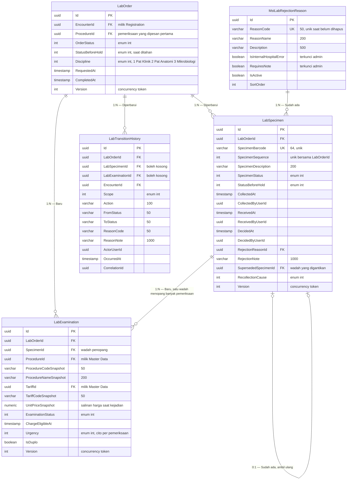

### Perubahan makna yang harus dibaca dengan teliti

| Sebelum `LAB-DEC-024` | Sesudah |
|---|---|
| `LabSpecimen` membawa `ProcedureId` dan salinan tarif | Keduanya pindah ke `LabExamination` |
| Satu barcode = satu pemeriksaan | Satu barcode = satu wadah nyata, yang dapat menopang beberapa pemeriksaan |
| Menolak satu baris = menolak satu pemeriksaan | Menolak satu wadah = menggugurkan seluruh pemeriksaan di atasnya |
| Baris tagihan menunjuk identitas sampel | Baris tagihan menunjuk identitas pemeriksaan |

---

## 2. Batas nilai dan persetujuan klinis

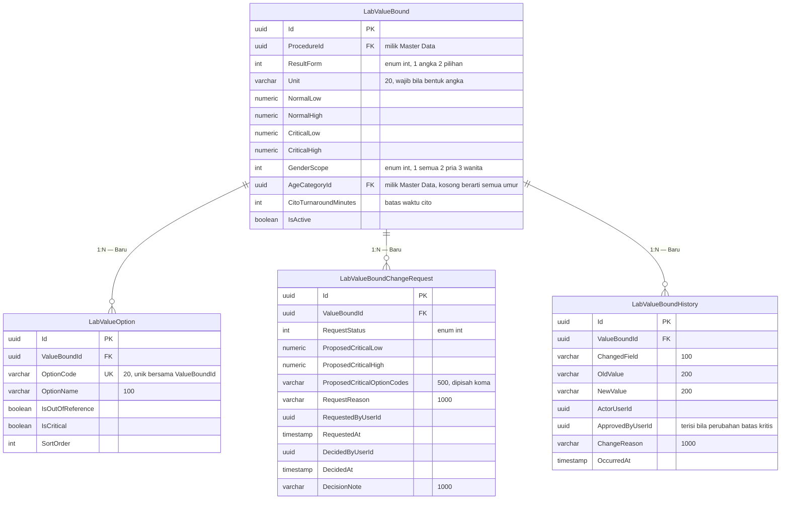

### Aturan kunci pada kelompok ini

| Aturan | Wujudnya |
|---|---|
| Satu pemeriksaan boleh punya beberapa baris batas | Unik pada `ProcedureId` + `GenderScope` + `AgeCategoryId` |
| Satu baris punya tepat satu bentuk hasil | `ResultForm` menentukan kolom mana yang wajib terisi |
| Bentuk angka wajib bersatuan | `Unit` wajib bila `ResultForm` bernilai angka |
| Bentuk pilihan wajib punya daftar pilihan | Sekurang-kurangnya satu `LabValueOption` |
| Batas kritis tidak dapat diubah langsung | Perubahan ditulis ke `LabValueBoundChangeRequest` lebih dulu |
| Seluruh perubahan berriwayat | Satu baris `LabValueBoundHistory` per kolom yang berubah |

---

## 2b. Lapis rujukan — data milik modul lain

Laboratorium **membaca** ketiga kelompok di bawah dan **tidak menulis** ke satu pun.
Digambarkan di sini agar implementer melihat bentuk yang dipakainya.

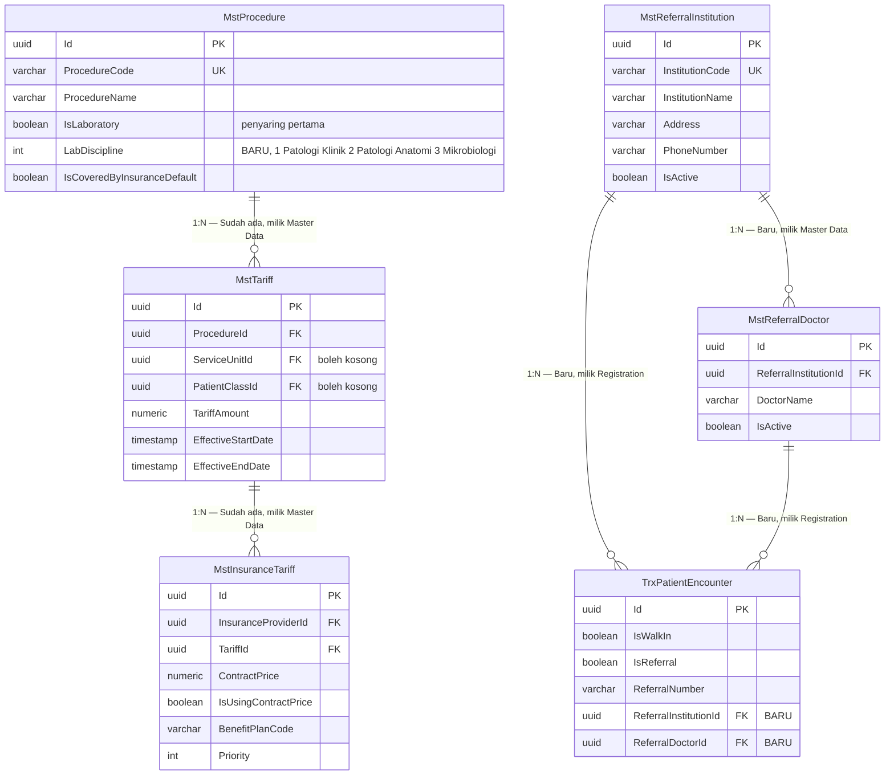

### Bagaimana ketiganya dipakai bersama

Saat petugas membuka layar pemesanan, satu baris katalog dirakit dari tiga sumber:

| Yang tampil di layar | Dari |
|---|---|
| Nama pemeriksaan dan disiplinnya | `MstProcedure` |
| Harga satuan | `MstTariff` yang berlaku pada tanggal kejadian, menurut unit dan kelas pasien |
| Tercakup penjamin atau tidak | Ada tidaknya baris `MstInsuranceTariff` untuk penjamin pasien |

**Contoh perakitan:**

> Pasien Andi berpenjamin BPJS, dilayani di unit laboratorium, kelas pasien umum.
>
> | Pemeriksaan | Disiplin | Harga rumah sakit | Kontrak BPJS | Yang tampil |
> |---|---|---|---|---|
> | Hemoglobin | Patologi Klinik | Rp50.000 | Ada, Rp42.000 | Rp50.000, **tercakup** |
> | Kultur darah | Mikrobiologi | Rp350.000 | Tidak ada | Rp350.000, **tidak tercakup** |
>
> Kultur darah **tetap boleh** dipesan. Keterangan tidak tercakup muncul agar pasien tahu
> sebelum pemeriksaan dikerjakan. Keputusan tagihannya tetap milik Billing.

### Batas yang tegas

| Yang boleh | Yang dilarang |
|---|---|
| Membaca ketiganya | Menulis ke salah satunya |
| Menyalin harga saat kejadian ke baris pemeriksaan | Menyimpan keputusan cakupan sebagai kebenaran |
| Menampilkan total sebagai perkiraan biaya | Membentuk tagihan |

---

## 3. Contoh isi yang menjelaskan bentuknya

**Hemoglobin — bentuk angka, tiga baris batas:**

| `ProcedureId` | `GenderScope` | `AgeCategoryId` | `Unit` | Normal | Kritis |
|---|---|---|---|---|---|
| Hemoglobin | Pria | Dewasa | g/dL | 13,0 – 17,0 | < 7,0 atau > 20,0 |
| Hemoglobin | Wanita | Dewasa | g/dL | 12,0 – 15,0 | < 7,0 atau > 20,0 |
| Hemoglobin | Semua | Anak | g/dL | 11,0 – 14,0 | < 6,0 atau > 18,0 |

**Protein urin — bentuk pilihan, satu baris batas dengan lima pilihan:**

| `OptionCode` | `OptionName` | `IsOutOfReference` | `IsCritical` |
|---|---|:---:|:---:|
| `NEG` | Negatif | Tidak | Tidak |
| `P1` | +1 | Ya | Tidak |
| `P2` | +2 | Ya | Tidak |
| `P3` | +3 | Ya | **Ya** |
| `P4` | +4 | Ya | **Ya** |

**Satu wadah menopang dua pemeriksaan:**

| Wadah | Barcode | Pemeriksaan yang ditopang | Harga |
|---|---|---|---|
| Tabung serum | `LSP-a1b2…` | Fungsi hati | Rp150.000 |
| Tabung serum yang sama | `LSP-a1b2…` | Fungsi ginjal | Rp120.000 |

Satu barcode, satu keputusan kelayakan, dua baris tagihan.

---

## Amandemen 2026-09-18 — Hasil Mikrobiologi dan Patologi Anatomi (`S4b`, `S4c`)

Menurunkan `LAB-DA-001` revision 6 bagian A3, dan `02-backend-architecture.md` bagian 14.

### ERD — hasil Mikrobiologi

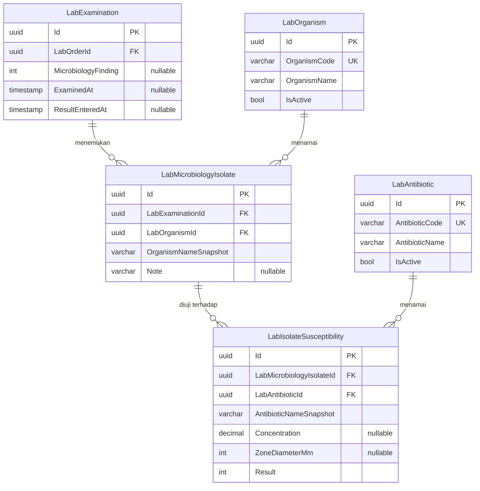

### Status dan pemilik setiap entity

| Entity | Status | Pemilik | Catatan |
|---|---|---|---|
| `LabExamination` | **`Extend`** | `BC-LAB` | Bertambah empat kolom |
| `LabMicrobiologyIsolate` | **`New`** | `BC-LAB` | `LAB-DC-036` |
| `LabIsolateSusceptibility` | **`New`** | `BC-LAB` | `LAB-DC-037` |
| `LabOrganism` | **`New`** | `BC-LAB` | `LAB-DC-041`, `LAB-DEC-084` |
| `LabAntibiotic` | **`New`** | `BC-LAB` | `LAB-DC-042`, `LAB-DEC-084` |

## Amandemen 2026-09-21 — `S4b` sesudah amendment pass putaran 9 dan 10

Menurunkan decision log **revision 50** (`LAB-DEC-095`..`LAB-DEC-113`) dan capability map
**revision 4**. Bersifat **aditif** terhadap amandemen 2026-09-18: nol entity yang sudah
digambar berubah bentuk, dan nol kolom yang sudah ada bergeser.

### Yang sudah benar sejak 2026-09-18 dan tidak diubah

Empat keputusan putaran 9 ternyata **menegakkan** bentuk yang sudah digambar, bukan mengubahnya.
Dicatat supaya tidak ada yang mengira gambar lama perlu disentuh:

| Keputusan | Bentuk yang sudah digambar | Hasil |
|---|---|---|
| `LAB-DEC-095` hasil per pemeriksaan | `LabMicrobiologyIsolate.LabExaminationId` | ✅ sudah benar |
| `LAB-DEC-101` MIC dan zona keduanya opsional | `Concentration` dan `ZoneDiameterMm` keduanya `nullable`, `Result` wajib | ✅ sudah benar |
| `LAB-DEC-102` nol subbakteri | `LabOrganism` nol kolom induk | ✅ sudah benar |
| `LAB-DEC-113` status temuan daftar sendiri | `LabExamination.MicrobiologyFinding` terpisah dari `LabPathologyFindingStatus` | ✅ sudah benar |

### ERD — kelengkapan hasil, penanda Definitif, dan aturan kritis

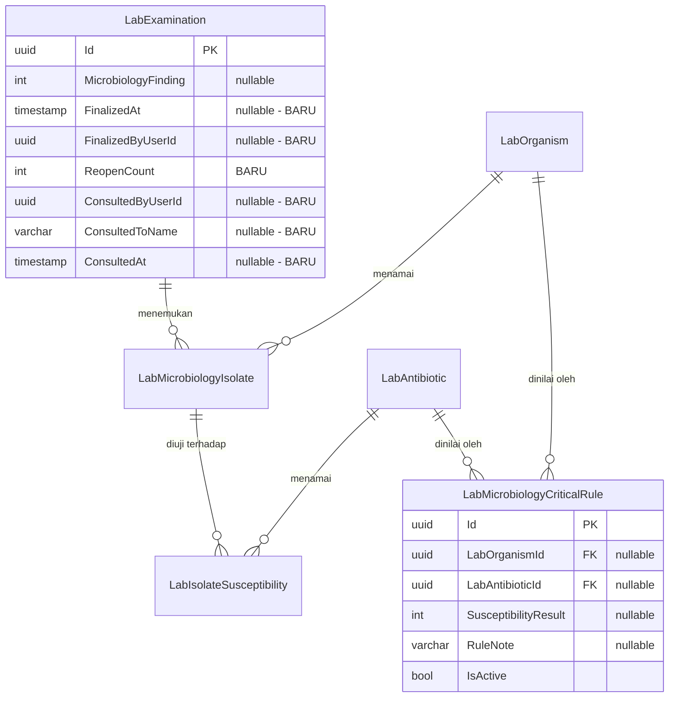

**`LabMicrobiologyCriticalRule` — kenapa ketiga ruas penilainya boleh kosong.** Satu baris
menyatakan *"keadaan seperti ini kritis"*, dan keadaan itu tidak selalu bertumpu pada ketiganya.
Ruas yang kosong berarti **apa saja**.

| Contoh baris | Organisme | Antibiotik | Interpretasi | Artinya |
|---|---|---|---|---|
| 1 | `MRSA` | *(kosong)* | *(kosong)* | Kuman itu selalu kritis, antibiotik apa pun hasilnya |
| 2 | *(kosong)* | `Meropenem` | `R` | Resisten terhadap Meropenem selalu kritis, kuman apa pun |
| 3 | `Escherichia coli` | `Ceftriaxone` | `R` | Hanya kombinasi itu yang kritis |

Baris yang **ketiganya kosong** ditolak — ia berarti seluruh hasil kritis, dan itu mematikan
guna penandanya (`VAL-106`).

### ERD — Spesifik Specimen dan jejak perubahan ruas

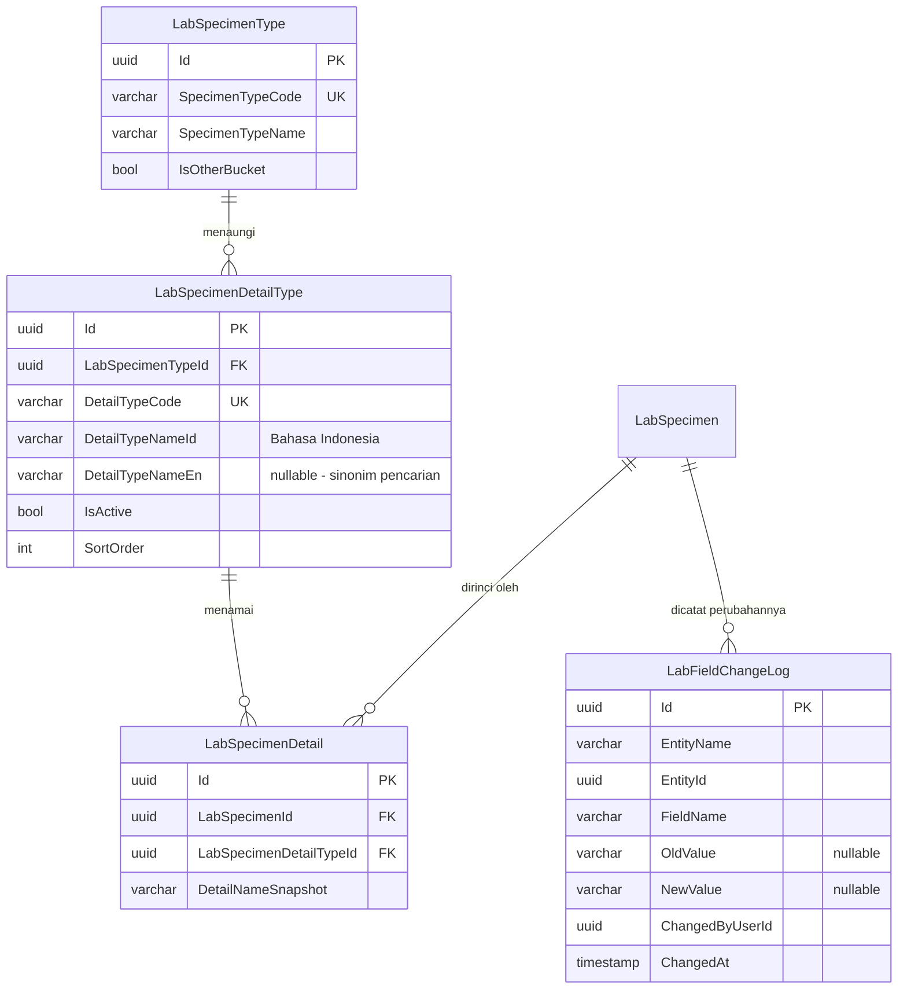

**`LabSpecimenDetail` adalah tabel jembatan, dan ia menyimpan snapshot nama.** Alasannya sama
dengan `OrganismNameSnapshot`: nama yang diperbaiki kepala instalasi enam bulan kemudian tidak
boleh mengubah arti specimen yang sudah tercatat.

**`LabFieldChangeLog` sengaja dibuat umum**, tidak khusus specimen. `EntityName` + `EntityId`
membuatnya dapat dipakai ulang ketika ruas lain kelak perlu dijejaki, tanpa menambah tabel
kelima. Ia **tidak** menggantikan `LabTransitionHistory`; keduanya bersumbu berbeda
(`LAB-DEC-112`).

### Status dan pemilik setiap entity — amandemen ini

| Entity | Status | Pemilik | Keputusan |
|---|---|---|---|
| `LabExamination` | **`Extend`** | `BC-LAB` | Bertambah **enam** kolom: tiga kelengkapan (`LAB-DEC-097`), tiga konsultasi (`LAB-DEC-106`) |
| `LabMicrobiologyCriticalRule` | **`New`** | `BC-LAB` | `LAB-DEC-103` |
| `LabSpecimenDetailType` | **`New`** | `BC-LAB` | `LAB-DEC-098`, `LAB-DEC-099` |
| `LabSpecimenDetail` | **`New`** | `BC-LAB` | `LAB-DEC-098` |
| `LabFieldChangeLog` | **`New`** | `BC-LAB` | `LAB-DEC-112` |
| `LabSpecimenType` | **`Existing`** — tidak disentuh | `BC-LAB` | `LAB-DEC-098` butir 1 |
| `LabTransitionHistory` | **`Existing`** — tidak disentuh | `BC-LAB` | `LAB-DEC-112` |
| `MstMeasurement` | **`Existing`** — hanya **baris baru**, nol kolom | `master-data` | `LAB-DEC-100` |
| `MstDoctor`, `TrxOnCallAssignment` | **`Adapter/View`** — dibaca saja, nol disalin | `master-data` / `human-resource` | `LAB-DEC-111` |

> **Nol salinan pasien maupun dokter dibuat.** `LAB-DEC-111` membaca rantai
> `TrxOnCallAssignment` → `MstDoctor` lewat join pada `ApplicationDbContext` yang sama. Nol
> tabel bayangan, nol sinkronisasi.

### Delete behavior dan index

| Tabel | Delete behavior | Index |
|---|---|---|
| `LabMicrobiologyCriticalRule` | **Nol cascade.** Organisme/antibiotik dinonaktifkan, bukan dihapus (`INV-31`) | Index atas `(LabOrganismId, LabAntibioticId, SusceptibilityResult)` di antara baris `IsActive` |
| `LabSpecimenDetailType` | `Restrict` terhadap `LabSpecimenType` | Unik **parsial** atas `DetailTypeCode` di antara baris yang belum `IsDelete` — mengikuti pola `VAL-91` |
| `LabSpecimenDetail` | `Cascade` dari `LabSpecimen` | Unik parsial atas `(LabSpecimenId, LabSpecimenDetailTypeId)` — satu rincian tidak boleh dicentang dua kali |
| `LabFieldChangeLog` | **Nol cascade dari mana pun.** Jejak tidak ikut mati bersama barisnya | Index atas `(EntityName, EntityId, ChangedAt)` |

> **Kenapa `LabFieldChangeLog` tidak cascade.** Menghapus specimen lalu ikut menghapus jejak
> perubahannya membuat jejak itu hilang tepat pada saat ia paling dibutuhkan. Pola yang sama
> dipakai `LabTransitionHistory`.

### Yang sengaja tidak digambar

| Yang ditolak | Alasan |
|---|---|
| Kolom `IsCritical` tersimpan pada isolat atau baris kepekaan | Penilaian dihitung saat dibaca, bukan disimpan. Aturan kritis dapat berubah, dan nilai tersimpan akan membekukan penilaian lama sebagai kalau-kalau fakta. Sejalan `LAB-DEC-080` — kolom mencatat apa yang terjadi, bukan menyimpulkan |
| Tabel `LabMicrobiologyReport` per order | `LAB-DEC-095` menegaskan hasil melekat pada pemeriksaan. Patologi Anatomi punya tabel per order justru karena `LAB-DEC-085` memutuskan sebaliknya untuk disiplin itu |
| Kolom `HL7Status` | `LAB-DEC-109` — ruasnya tidak dibangun sampai `LAB-COORD-012` dijawab |
| Tabel penugasan jaga milik Laboratorium | `LAB-DEC-111` membaca milik Human Resource. Mendirikan sendiri berarti dua daftar dokter jaga yang dapat berbeda |

---

### ~~Patologi Anatomi — nol entity baru~~ — **DICABUT 2026-09-18 sore**

> Bagian ini menilai laporan Patologi Anatomi sebagai `VALUE_OBJECT` berbentuk tiga kolom pada
> `LabExamination`. **Penilaian itu dicabut** oleh bukti `LAB-EVD-003` dan `LAB-DEC-085`:
> hasil PA melekat pada **pesanan**, ruasnya sampai lima belas, dan ia punya lifecycle sendiri.
> Bentuk yang berlaku ada pada **Amandemen 2026-09-18 sore** di bawah.

---

## Amandemen 2026-09-18 sore — Laporan Patologi Anatomi per pesanan

Menurunkan `LAB-DA-001` revision 7 bagian A4, dan `02-backend-architecture.md` bagian 15.

### ERD — laporan dan konteks klinis

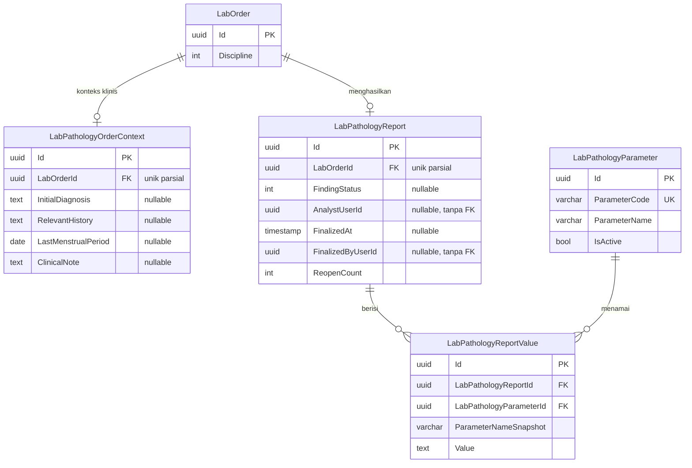

### ERD — data induk dan pemetaan kategori

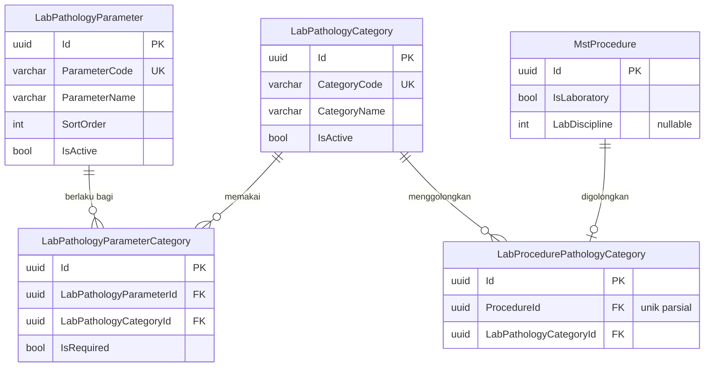

### Status dan pemilik setiap entity

| Entity | Status | Pemilik | Catatan |
|---|---|---|---|
| `LabPathologyReport` | **`New`** | `BC-LAB` | `LAB-DC-043` |
| `LabPathologyReportValue` | **`New`** | `BC-LAB` | `LAB-DC-044` |
| `LabPathologyOrderContext` | **`New`** | `BC-LAB` | `LAB-DC-049` |
| `LabPathologyParameter` | **`New`** | `BC-LAB` | `LAB-DC-045` |
| `LabPathologyCategory` | **`New`** | `BC-LAB` | `LAB-DC-046` |
| `LabPathologyParameterCategory` | **`New`** | `BC-LAB` | `LAB-DC-047` |
| `LabProcedurePathologyCategory` | **`New`** | `BC-LAB` | `LAB-DC-048`. **`MstProcedure` nol disentuh** |
| `LabExamination` | **tidak berubah oleh PA** | `BC-LAB` | Tiga kolom `Pathology*` yang dirancang bagian 14 **dicabut** |

### Delete behavior dan index

| Relasi | `DeleteBehavior` |
|---|---|
| `LabPathologyReport` → `LabOrder` | **`Restrict`** |
| `LabPathologyOrderContext` → `LabOrder` | **`Restrict`** |
| `LabPathologyReportValue` → `LabPathologyReport` | **`Restrict`** |
| `LabPathologyReportValue` → `LabPathologyParameter` | **`Restrict`** — menonaktifkan parameter nol menghapus isi laporan (`INV-37`) |
| `LabPathologyParameterCategory` → keduanya | **`Restrict`** |
| `LabProcedurePathologyCategory` → keduanya | **`Restrict`** |

| Index | Tabel | Sifat |
|---|---|---|
| `LabOrderId` | `LabPathologyReport` | **Unik parsial** — `INV-32`, satu laporan per pesanan |
| `LabOrderId` | `LabPathologyOrderContext` | **Unik parsial** |
| (`LabPathologyReportId`, `LabPathologyParameterId`) | `LabPathologyReportValue` | **Unik parsial** — satu parameter sekali per laporan |
| `ParameterCode` | `LabPathologyParameter` | **Unik parsial** |
| `CategoryCode` | `LabPathologyCategory` | **Unik parsial** |
| (`ParameterId`, `CategoryId`) | `LabPathologyParameterCategory` | **Unik parsial** |
| `ProcedureId` | `LabProcedurePathologyCategory` | **Unik parsial** — satu pemeriksaan satu kategori |

> ### ⚠ Tujuh index unik, dan ketujuhnya WAJIB PARSIAL
>
> Pembatas `IsDelete = false` bukan kehalusan teknis. Penghapusan di sistem ini bersifat
> **penandaan**, sehingga baris tertandai hapus **tetap menempati kuncinya** — dan kepala instalasi
> yang menghapus satu parameter lalu menambahkannya lagi dengan kode yang sama akan ditolak basis
> data tanpa sebab yang masuk akal baginya.
>
> Modul ini sudah membayar persis kesalahan itu lewat `LAB-CONFLICT-005`. **Tujuh index berarti
> tujuh kesempatan mengulanginya.**

### Yang sengaja tidak digambar

| Yang dicari pembaca | Kenapa tidak ada |
|---|---|
| Kolom `IssuedAt` dan `EffectiveAt` | **Nol disimpan** (`INV-38`). Keduanya diturunkan dari `FinalizedAt` dan `LabSpecimen.CollectedAt` |
| Kolom status `Draft`/`Final` | `INV-36`. Dibaca dari `FinalizedAt` |
| Tabel gambar laporan | `DEC-LAB-016` |
| Kolom kategori pada `MstProcedure` | `LAB-DEC-087` — pemetaannya milik Laboratorium; katalognya nol disentuh |

### Delete behavior, index, dan satu jebakan

| Relasi | `DeleteBehavior` | Alasan |
|---|---|---|
| `LabMicrobiologyIsolate` → `LabExamination` | **`Restrict`** | Histori klinis tidak boleh terhapus berantai |
| `LabMicrobiologyIsolate` → `LabOrganism` | **`Restrict`** | Menonaktifkan data induk tidak boleh menghapus temuan pasien (`INV-31`) |
| `LabIsolateSusceptibility` → `LabMicrobiologyIsolate` | **`Restrict`** | Sama |
| `LabIsolateSusceptibility` → `LabAntibiotic` | **`Restrict`** | Sama |

| Index | Tabel | Sifat |
|---|---|---|
| `OrganismCode` | `LabOrganism` | **Unik** |
| `AntibioticCode` | `LabAntibiotic` | **Unik** |
| `LabExaminationId` | `LabMicrobiologyIsolate` | Biasa |
| `LabMicrobiologyIsolateId` | `LabIsolateSusceptibility` | Biasa |
| (`LabMicrobiologyIsolateId`, `LabAntibioticId`) | `LabIsolateSusceptibility` | **Unik PARSIAL** — dibatasi `IsDelete = false` |

> ### ⚠ Index unik parsial itu bukan kehalusan teknis
>
> Penghapusan di sistem ini bersifat **penandaan** (`IsDelete`), bukan penghapusan sungguhan.
> Index unik biasa akan membuat baris yang sudah ditandai hapus **tetap menempati kuncinya**,
> sehingga analis yang salah memilih antibiotik, menghapusnya, lalu memilih antibiotik yang sama
> lagi akan ditolak sistem tanpa sebab yang masuk akal baginya.
>
> Modul ini **sudah pernah membayar persis kesalahan ini** lewat `LAB-CONFLICT-005` pada index
> `(SpecimenId, ProcedureId)`. Dicatat di sini agar tidak diulang untuk ketiga kalinya.

---

## Amandemen 2026-09-21 (kedua) — `S4b` sesudah bukti cetak `LAB-EVD-005` dan `LAB-EVD-006`

Menurunkan decision log **revision 52** (`LAB-DEC-114`..`LAB-DEC-128`). Bersifat **aditif**
terhadap amandemen pertama 2026-09-21; nol entity yang sudah digambar dibongkar.

> **Peringatan yang dibawa amandemen ini.** `LAB-OPEN-039` masih menyisakan **enam varian
> cetak** yang belum pernah dilihat. `LAB-DEC-116` sudah sekali terkoreksi kurang dari satu jam
> sesudah dicatat, dan sebabnya persis itu: disimpulkan dari satu contoh. Bagian yang paling
> mungkin bergeser lagi ditandai **⚠ rapuh** di bawah.

### ERD — antibiogram sesudah bukti cetak

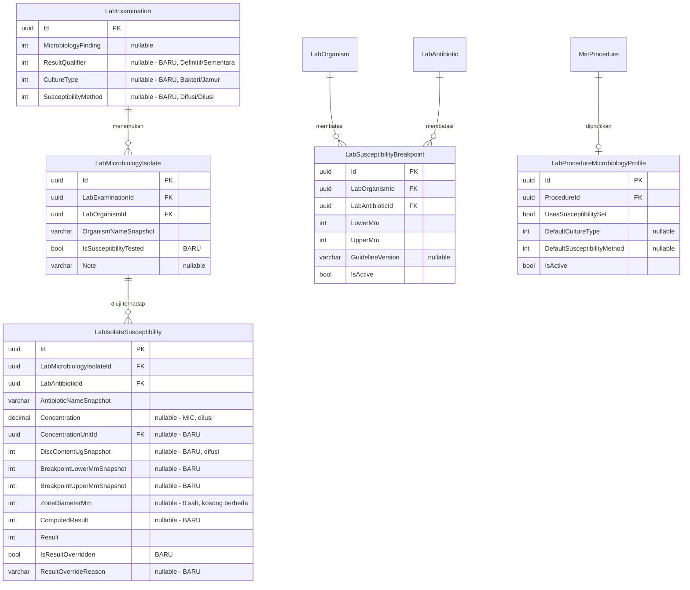

### Kenapa `ComputedResult` dan `Result` disimpan berdampingan

`LAB-DEC-123` menjadikan interpretasi **terhitung**, tetapi membuka penimpaan beralasan.

| Kolom | Isinya |
|---|---|
| `ComputedResult` | Hasil hitungan sistem dari zona terhadap breakpoint |
| `Result` | Nilai yang **berlaku** dan yang dicetak |
| `IsResultOverridden` | Benar ketika keduanya berbeda |
| `ResultOverrideReason` | **Wajib** ketika ditimpa |

> **Kenapa hitungannya ikut disimpan, bukan dihitung ulang saat dibaca.** Ia berbeda dari
> `IsCritical` yang sengaja **tidak** disimpan. Alasannya: penanda kritis menilai hasil
> terhadap aturan yang boleh berubah, sedangkan `ComputedResult` adalah **fakta apa yang
> sistem katakan pada saat analis memutuskan menimpanya**. Tanpa menyimpannya, pertanyaan
> *"analis menimpa dari apa"* kehilangan jawabannya begitu breakpoint diperbarui.

### Kenapa breakpoint di-snapshot ke baris hasil

`BreakpointLowerMmSnapshot` dan `BreakpointUpperMmSnapshot` menyalin rentang yang **berlaku
saat hasil diisi**. Ketika versi CLSI berganti dan rentangnya bergeser, hasil tahun lalu tetap
dapat dibaca dengan rentang yang dipakai ketika ia dibuat — dan cetakan ulang menghasilkan
lembar yang sama persis. Pola yang sama sudah dipakai `OrganismNameSnapshot`.

### ERD — pengaturan per disiplin

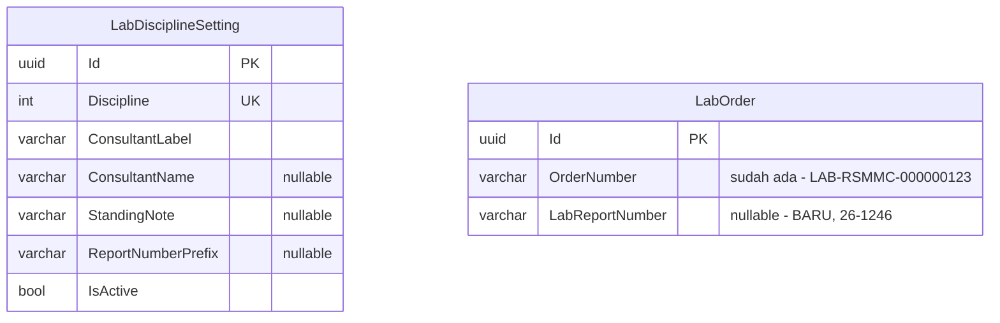

`LabDisciplineSetting` memuat tiga hal yang seluruhnya **berbeda per disiplin** dan seluruhnya
terbukti dari bukti cetak:

| Ruas | Mikrobiologi | Patologi Anatomi | Patologi Klinik |
|---|---|---|---|
| `ConsultantLabel` | `Konsultan Mikrobiologi Klinik` | `Spesialis Patologi Anatomi` | `Konsultan` |
| `ConsultantName` | `Usman Chatib Warsa, PhD, SpMK-K, Prof. dr.` | `Ening Krisnuhoni, SpPA-K, dr.` | `Prof.Dr.Riadi Wirawan SpPK(K)` |
| `StandingNote` | `LEBAR ZONA ANTIBIOTIK TIDAK MEMPENGARUHI...` | *(kosong)* | *(catatan penafsiran)* |

> **Satu tabel, bukan tiga pengaturan terpisah.** Ketiganya menjawab pertanyaan yang sama —
> *"apa yang tercetak di footer disiplin ini"* — dan memisahkannya berarti tiga tempat yang
> harus diingat bersamaan ketika kop rumah sakit berubah.

### Status dan pemilik setiap entity — amandemen ini

| Entity | Status | Keputusan | Rapuh? |
|---|---|---|---|
| `LabExamination` | **`Extend`** — 3 kolom lagi | `LAB-DEC-114`, `124` | — |
| `LabMicrobiologyIsolate` | **`Extend`** — 1 kolom | `LAB-DEC-126` | — |
| `LabIsolateSusceptibility` | **`Extend`** — 7 kolom | `LAB-DEC-115`, `122`, `123` | — |
| `LabSusceptibilityBreakpoint` | **`New`** | `LAB-DEC-122` | — |
| `LabProcedureMicrobiologyProfile` | **`New`** | `LAB-DEC-125` | — |
| `LabDisciplineSetting` | **`New`** | `LAB-DEC-119`, `127` | ⚠ **rapuh** — footer tiga disiplin baru terlihat masing-masing satu contoh |
| `LabOrder` | **`Extend`** — 1 kolom | `LAB-DEC-117` | — |
| `MstProcedure` | **`Existing`** — nol disentuh | `LAB-DEC-125` | — |
| `MstMeasurement` | **`Existing`** — baris baru `ug/mL`, `mg/L` | `LAB-DEC-115` | — |

> **`MstProcedure` sengaja nol disentuh.** `LabProcedureMicrobiologyProfile` menunjuk kepadanya
> dari sisi Laboratorium, persis pola `LabProcedurePathologyCategory`. Menambah kolom pada
> tabel milik `master-data` sudah dua kali menahan modul ini lewat `LAB-COORD-006` dan
> `MST-POS-WRITE`.

### Delete behavior dan index

| Tabel | Delete behavior | Index |
|---|---|---|
| `LabSusceptibilityBreakpoint` | `Restrict` terhadap organisme dan antibiotik | Unik **parsial** atas `(LabOrganismId, LabAntibioticId)` di antara baris `IsActive` |
| `LabProcedureMicrobiologyProfile` | `Restrict` terhadap `MstProcedure` | Unik **parsial** atas `ProcedureId` |
| `LabDisciplineSetting` | Nol cascade | Unik **parsial** atas `Discipline` |
| `LabOrder.LabReportNumber` | — | Unik **parsial** atas `(Discipline, Tahun, Nomor)` |

### ⚠ Bagian yang paling mungkin bergeser lagi

| Bagian | Kenapa rapuh | Varian yang akan memastikannya |
|---|---|---|
| Susunan isolat pada cetakan | Contoh yang ada hanya punya **satu** tabel `IDENTITAS` | Cetakan **dua isolat berantibiogram** |
| Bentuk hasil nol pertumbuhan | Belum pernah terlihat | Cetakan **kultur steril** |
| Pengulangan kop per lembar | Ketiga contoh satu halaman | Cetakan **halaman kedua** |
| `LabDisciplineSetting` | Footer tiap disiplin baru terlihat satu contoh | Kategori PA lain |

**Ketiga ruas berikut sengaja dibuat nullable** justru karena keempat varian di atas belum
terlihat: `ResultQualifier`, `CultureType`, dan `SusceptibilityMethod`. Bila ternyata ada
bentuk kelima, menambah nilai enum lebih murah daripada membongkar kolom wajib.

---

## Amandemen 2026-09-21 (ketiga) — Data induk specimen dari `LAB-EVD-007`

Menurunkan decision log **revision 53** (`LAB-DEC-129`..`132`).

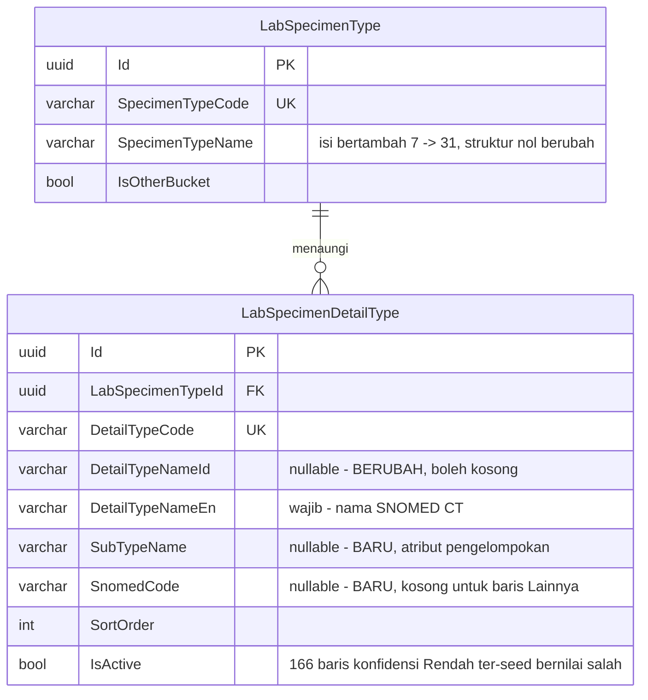

### Yang berubah dan tidak berubah

| Hal | Keadaan |
|---|---|
| `LabSpecimenType` struktur | **Nol berubah** — GUID ketujuh baris ter-seed dipertahankan |
| `LabSpecimenType` isi | 7 → **31**, ditangani **seeder**, bukan migration |
| `LabSpecimen.SpecimenTypeId` | **Nol perlu dipetakan ulang** |
| `DetailTypeNameId` | Wajib → **nullable** |

> **`SubTypeName` disimpan sebagai teks, bukan sebagai penunjuk tabel.** Ia **bukan tingkat
> pilihan** (`LAB-DEC-129`), dan mendirikan tabel untuk sesuatu yang nol pernah dipilih berarti
> tiga tabel untuk dua tingkat. Sebagai teks ia tetap dapat dikelompokkan pada pelaporan, yang
> memang satu-satunya kegunaannya.

### Index

| Kolom | Index |
|---|---|
| `SnomedCode` | Unik **parsial** di antara baris yang belum `IsDelete` **dan** `SnomedCode` tidak kosong |
| `SubTypeName` | Index biasa, untuk pengelompokan pelaporan |
| `DetailTypeNameId`, `DetailTypeNameEn` | Index untuk pencarian dua bahasa (`RULE-007`) |

> **Unik parsial pada `SnomedCode` wajib mengecualikan yang kosong.** Baris yang ditambahkan
> lewat `Lainnya` seluruhnya berkode SNOMED kosong; index unik penuh akan menolak baris lokal
> kedua.
