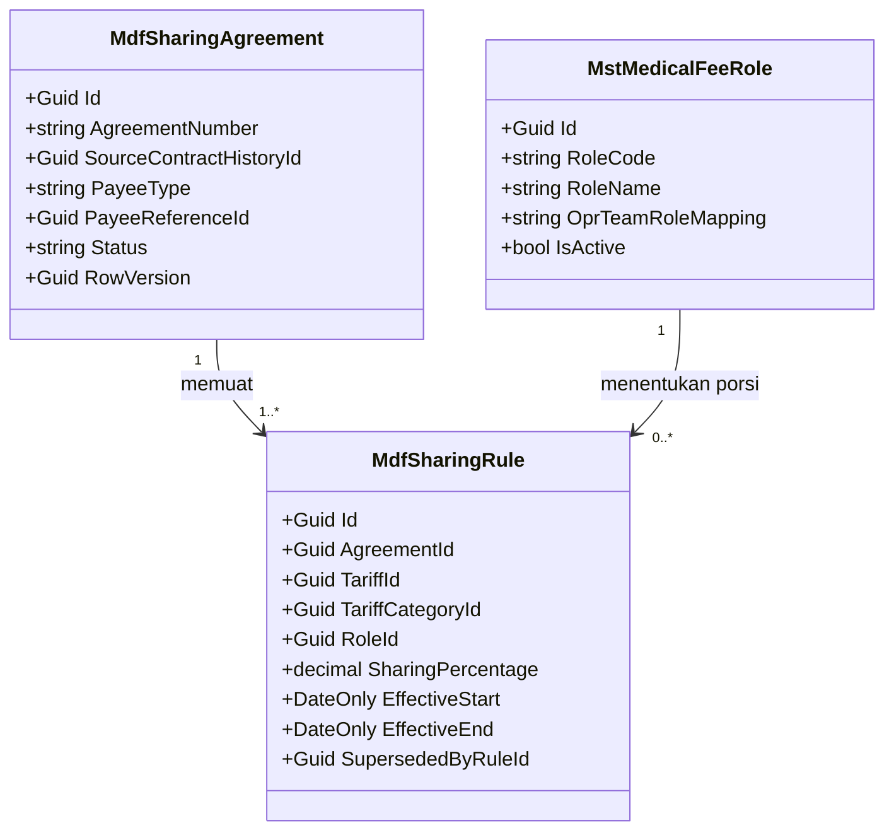
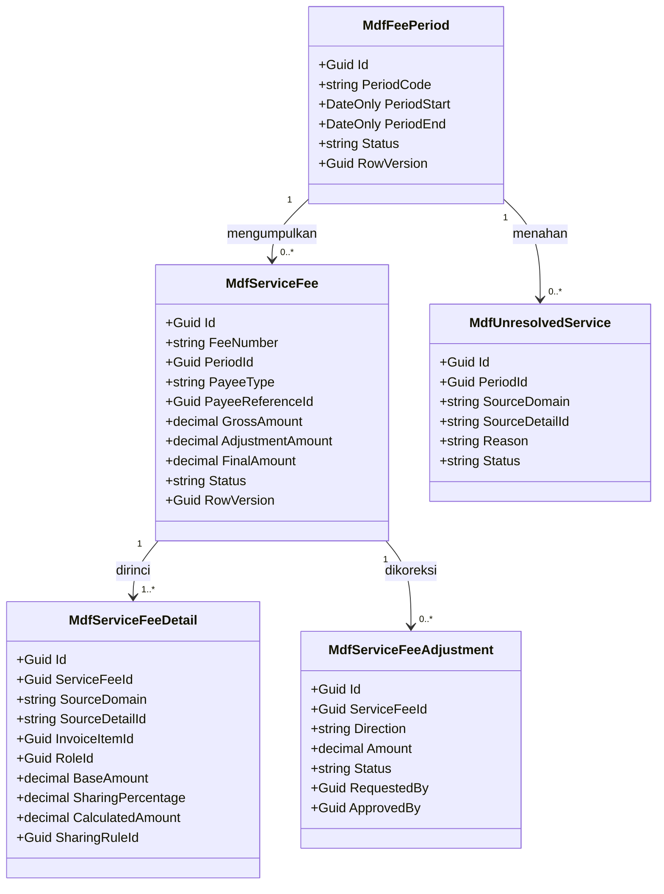
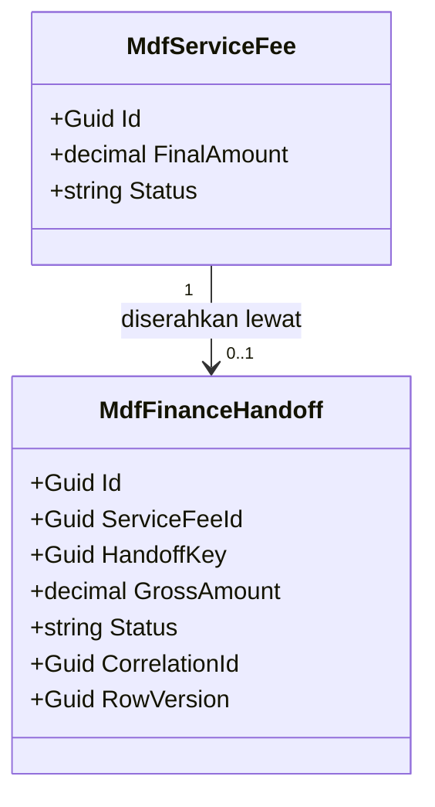

# Medical Fee — Arsitektur Backend

| Field | Nilai |
|---|---|
| Blueprint ID | `MF-BP-001` |
| Revision | `1` |
| Status | `approved` — seluruh `MDF-DES-001`..`018` disetujui Yasmin 20 September 2026 |
| Masukan | `00-interview-decisions.md` revisi 2 (`MF-DEC-001`..`018`), `01-existing-capability-map.md` revisi 1 |
| Backend SHA | `09101d05` (branch `Yasmina`) |
| Frontend SHA | `66f36b432` |
| Tanggal | 20 September 2026 |

Dokumen ini **menurunkan** dari 17 keputusan bisnis yang sudah disetujui; ia tidak membuat
keputusan bisnis baru. Setiap keputusan teknis diberi nomor `MDF-DES-nnn` beserta dasarnya.

---

## 1. Bounded context dan kepemilikan

Medical Fee adalah **modul perhitungan penghasilan atas layanan yang sudah diberikan**. Ia
membaca layanan dari modul klinis, menghitung jasa menurut kesepakatan tarif, lalu menyerahkan
hasil yang sudah disetujui ke Finance.

### 1.1 Tiga konteks di dalam modul

| Konteks | Folder submodul | Aggregate root | Tanggung jawab |
|---|---|---|---|
| Master dan Aturan | `MasterData/` | `MstMedicalFeeRole`, `MdfSharingAgreement` | Daftar peran, kesepakatan tarif sharing beserta baris tarifnya |
| Perhitungan Jasa | `FeeCalculation/` | `MdfFeePeriod`, `MdfServiceFee` | Periode, hasil jasa per penerima, rincian per layanan, koreksi, dan layanan yang belum dapat dihitung |
| Penyerahan ke Finance | `Handoff/` | `MdfFinanceHandoff` | Fakta hasil jasa yang sudah disetujui, siap dikonsumsi Finance |

### 1.2 Tabel kepemilikan data

| Kelompok data | Modul pemilik | Dipakai modul ini | Dibuat ulang di modul ini |
|---|---|:---:|---|
| Pasien, kunjungan, rekam medis | Registration / Clinical | Tidak langsung | **Tidak.** Modul ini tidak menyimpan data pasien sama sekali |
| Tagihan dan baris tagihan | Billing | Ya, sumber layanan dan nilai kotor | **Tidak.** Dirujuk lewat `SourceDomain` + `SourceDetailId` |
| Bagian dokter (`BilInvoiceItem.DoctorShare`) | Billing | Ya | **Tidak.** Modul ini menjadi *sumber nilainya* (`MF-DEC-001`), kolomnya tetap milik Billing |
| Diskon dan persetujuannya | Billing | Ya, sebagai pengurang | **Tidak** |
| Tarif layanan (`MstTariff`, `MstTariffCategory`) | Health Services / MasterData | Ya, basis perhitungan | **Tidak** |
| Tim operasi (`OprTeamMember`, `OprCase`) | Operating Room | Ya, sumber pelaksana paling lengkap | **Tidak** |
| Tindakan klinis (`TrxPatientProcedure`) | Clinical | Ya, sumber pelaksana | **Tidak** |
| Pemeriksaan laboratorium (`LabOrder`) | Laboratory | Ya, sumber pelaksana | **Tidak** |
| Pemeriksaan radiologi | Radiology | **Belum** — ditunda (`MF-DEC-015`) | **Tidak** |
| Identitas tenaga medis (`MstDoctor`, `MstWorkforceProfile`) | HR / MasterData | Ya, rujukan identitas | **Tidak** |
| Kontrak kerja (`WfpContractHistory`, `MstContractType`) | HR / WorkforceCore | Ya, ditunjuk kesepakatan tarif | **Tidak.** `MF-DEC-012` menutup ini |
| Tipe praktik dan kepegawaian | HR | Ya, rujukan | **Tidak.** Sudah ada di `MstDoctor` |
| Utang dan pembayaran jasa | Finance | Tidak | **Tidak.** Modul ini berhenti di penyerahan hasil |
| Potongan PPh 21, kasbon, iuran | Finance | Tidak | **Tidak.** `MF-DEC-005` menyerahkannya ke Finance |
| Jurnal dan buku besar | Accounting | Tidak | **Tidak** |
| **Daftar peran untuk perhitungan jasa** | **Medical Fee** | Ya | **Ya — baru.** `OprTeamRole` hanya berlaku untuk kamar operasi |
| **Kesepakatan tarif sharing dan baris tarifnya** | **Medical Fee** | Ya | **Ya — baru.** HR memiliki kontraknya, bukan tarif sharingnya |
| **Periode jasa, hasil jasa, rincian, koreksi** | **Medical Fee** | Ya | **Ya — baru** |
| **Layanan yang belum dapat dihitung jasanya** | **Medical Fee** | Ya | **Ya — baru** |
| **Fakta penyerahan ke Finance** | **Medical Fee** | Ya | **Ya — baru** |

---

## 2. Keputusan arsitektur

Seluruhnya `approved` 20 September 2026.

### 2.1 Penempatan dan penamaan

| ID | Keputusan | Dasar | Konsekuensi |
|---|---|---|---|
| `MDF-DES-001` | Model, DTO, service, dan controller di `Areas/HealthServices/MedicalFeeManagement/<Submodul>/`; EF configuration di `Repositories/Configurations/HealthServices/MedicalFeeManagement/<Submodul>/` | `FIN-BRD-V2-0.3` bagian 4 menempatkan Medical Fee di bawah Health Services. Folder `Configurations/HealthServices/` (jamak) diverifikasi sebagai pola yang berlaku | MUST NOT menaruh configuration di dalam `Areas/`, dan MUST NOT memakai `HealthService` tunggal |
| `MDF-DES-002` | Modul `MedicalFeeManagement` beserta prefix `Mdf` MUST didaftarkan di `MODULE_OWNERSHIP_PREFIX_REGISTRY.md` **sebelum** file model pertama ditulis | `QBE-MOD-002`, `QBE-MOD-003`, `QBE-NAM-004`; prefix `Mdf` diverifikasi belum dipakai | Tanpa pendaftaran, QBE menolak seluruh entity baru |
| `MDF-DES-003` | Data induk memakai prefix `Mst`; entity transaksi memakai `Mdf` | Ketentuan modul yang ditegaskan owner pada `FIN-DES-003` | `MstMedicalFeeRole` memakai `Mst`; delapan entity lain memakai `Mdf` |

### 2.2 Pola teknis yang diwarisi

Keempatnya menyalin pola yang sudah berjalan, bukan menciptakan yang baru.

| ID | Keputusan | Bukti pola |
|---|---|---|
| `MDF-DES-004` | Status sebagai `string(30)` + `static class ...Statuses` + `HasCheckConstraint`. Bukan enum `int` | `FinPettyCashBudget.Status`; `FIN-DES-004` |
| `MDF-DES-005` | Optimistic concurrency `Guid RowVersion` yang dicek terhadap `ExpectedRowVersion` | `PettyCashBudgetService.EnsureCurrentRowVersion`; `FIN-DES-005` |
| `MDF-DES-006` | Perintah pengubah hasil jasa membawa header `Idempotency-Key` bertipe `Guid` | `PettyCashBudgetController.TopUp`; `FIN-DES-006` |
| `MDF-DES-007` | Perhitungan periode dijalankan di `BeginTransactionAsync(IsolationLevel.Serializable)` | `PettyCashBudgetService.TopUpAsync`; `FIN-DES-007` |

### 2.3 Aturan tarif sharing

| ID | Keputusan | Dasar | Konsekuensi |
|---|---|---|---|
| `MDF-DES-008` | `MdfSharingAgreement` **menunjuk** satu baris `WfpContractHistory` lewat `SourceContractHistoryId`. Nomor kontrak, masa berlaku, dan dokumen tidak disalin | `MF-DEC-012` | Kontrak berakhir di HR → kesepakatan tarif ikut berhenti. Service MUST memeriksa masa berlaku kontrak saat menghitung |
| `MDF-DES-009` | `MdfSharingRule` berversi lewat **masa berlaku**, bukan pembaruan baris. Perubahan tarif membuat baris baru; baris lama ditutup dan tidak pernah diubah | `MF-DEC-004` | Hasil jasa periode lalu tidak berubah ketika tarif diperbarui |
| `MDF-DES-010` | Setiap rincian hasil jasa menyimpan **snapshot** persentase yang dipakai beserta rujukan baris tarif asalnya | Tanpa snapshot, menelusuri "mengapa angkanya sekian" menuntut menebak tarif mana yang berlaku saat itu | Perubahan tarif tidak pernah mengubah hasil yang sudah dihitung |
| `MDF-DES-011` | Daftar peran dimiliki modul ini (`MstMedicalFeeRole`), memetakan `OprTeamRole` lewat kolom pemetaan | `MF-DEC-016` | Peran "operator" berarti sama di seluruh sumber. `OprTeamRole` milik Operating Room tidak disentuh |

### 2.4 Perhitungan

| ID | Keputusan | Dasar | Konsekuensi |
|---|---|---|---|
| `MDF-DES-012` | Basis perhitungan adalah **nilai kotor baris tagihan** (`Quantity × UnitPrice`), sebelum diskon apa pun | `MF-DEC-013`; `MF-CAP-003` | Diskon promo pasien tidak mengurangi hak tenaga medis |
| `MDF-DES-013` | Porsi antar penerima dihitung dari **persentase peran** pada baris tarif | `MF-DEC-014` | Jumlah persentase seluruh peran pada satu layanan MUST tidak melebihi 100% |
| `MDF-DES-014` | Layanan yang tidak dapat dihitung dicatat sebagai `MdfUnresolvedService` **terpisah**, bukan sebagai hasil jasa berstatus tertahan | `MF-DEC-018` menghendaki "terlihat dan tidak hilang". Baris hasil jasa selalu menuntut penerima, sedangkan yang tertahan justru belum punya — memaksakannya melahirkan baris yatim | Layar "belum dapat dihitung" membaca satu tabel yang jelas, dan invariant hasil jasa tetap utuh |
| `MDF-DES-015` | Selama periode terbuka, perhitungan ulang **mengganti** seluruh rincian periode itu. Setelah ditutup atau disetujui, perubahan hanya lewat koreksi bernilai selisih | `MF-DEC-007` | Perhitungan ulang aman diulang berkali-kali tanpa menumpuk baris ganda |
| `MDF-DES-016` | Periode **tidak dapat ditutup** selama masih ada `MdfUnresolvedService` yang belum selesai | `MF-DEC-018` | Jasa yang terlewat tidak mungkin lolos diam-diam ke periode berikutnya |

### 2.5 Persetujuan dan penyerahan

| ID | Keputusan | Dasar | Konsekuensi |
|---|---|---|---|
| `MDF-DES-017` | Maker-checker ditegakkan dua lapis: check constraint database dan pemeriksaan service | `MF-DEC-009`; pola `FIN-DES-014` | Aturan tidak bisa dilanggar walau ada jalur kode lain kelak |
| `MDF-DES-018` | Penyerahan ke Finance memakai **tabel handoff persisted** `MdfFinanceHandoff` dikunci `HandoffKey` | Pola `BilArHandoff` dan pilihan `FIN-DEC-005` | Finance mengonsumsi dan memberi ACK; Medical Fee tidak pernah menulis ke tabel Finance |

### 2.6 Yang dirancang bentuknya tetapi `OPEN DECISION`

| Rumpun | Menunggu | Yang sudah dirancang |
|---|---|---|
| Arah alir nilai jasa ke `BilInvoiceItem.DoctorShare` | `MF-CQ-08` — owner Billing | Bentuk kontraknya pada `contracts/integration-contract.md`; mekanisme teknisnya menunggu jawaban |
| Jasa dari entri bebas kasir | `MF-CQ-05` — owner Billing | Perlakuan sumber `ADHOC` dirancang; menunggu field pelaksana |
| Pembagian tim di luar kamar operasi | `MF-CQ-07` — Clinical dan Laboratory | Bentuk data peran dirancang; menunggu modul sumber mencatat timnya |
| Jasa radiologi | `MF-DEC-015` — sengaja ditunda | Tidak dirancang sama sekali pada revisi ini |

---

## 3. Class diagram per konteks

### 3.1 Master dan Aturan



### 3.2 Perhitungan Jasa



### 3.3 Penyerahan ke Finance



---

## 4. Penjelasan setiap class

### 4.1 `MstMedicalFeeRole`

| Aspek | Penjelasan |
|---|---|
| **Status** | `Baru` |
| **Lokasi file** | `Areas/HealthServices/MedicalFeeManagement/MasterData/Models/MstMedicalFeeRole.cs` |
| Kategori | Data induk |
| Tanggung jawab utama | Menyimpan daftar peran yang berlaku untuk perhitungan jasa di **seluruh** sumber layanan, sehingga "operator" berarti sama di kamar operasi dan di tindakan poli |
| Field penting | `RoleCode`, `RoleName`, `OprTeamRoleMapping`, `IsPrimaryRole`, `IsActive` |
| Navigation property dan relasi | Punya banyak `MdfSharingRule` |
| Pemakaian dalam alur bisnis | Dipilih saat menyusun baris tarif, dan dipakai saat membagi porsi antar pelaksana |
| Catatan desain | `OprTeamRoleMapping` memetakan nilai `OprTeamRole` milik Operating Room. Peran yang sudah dipakai baris tarif MUST dinonaktifkan, bukan dihapus |
| Ekuivalen model lama | — |

### 4.2 `MdfSharingAgreement`

| Aspek | Penjelasan |
|---|---|
| **Status** | `Baru` |
| **Lokasi file** | `Areas/HealthServices/MedicalFeeManagement/MasterData/Models/MdfSharingAgreement.cs` |
| Kategori | Transaksi — aggregate root kesepakatan tarif |
| Tanggung jawab utama | Menyatakan bahwa seseorang punya kesepakatan tarif sharing, dan menunjuk kontrak kerja mana yang mendasarinya |
| Field penting | `AgreementNumber`, `SourceContractHistoryId`, `PayeeType`, `PayeeReferenceId`, `EffectiveStart`, `EffectiveEnd`, `Status`, `Notes` |
| Navigation property dan relasi | Punya banyak `MdfSharingRule`; menunjuk `WfpContractHistory` milik HR |
| Pemakaian dalam alur bisnis | Disusun saat dokter baru bergabung atau kontraknya diperpanjang |
| Catatan desain | Nomor kontrak dan dokumennya **tidak disalin** — dibaca dari HR (`MDF-DES-008`). Masa berlaku kesepakatan MUST berada di dalam masa berlaku kontrak sumbernya |
| Ekuivalen model lama | PKS/SK yang selama ini diperiksa manual |

### 4.3 `MdfSharingRule`

| Aspek | Penjelasan |
|---|---|
| **Status** | `Baru` |
| **Lokasi file** | `Areas/HealthServices/MedicalFeeManagement/MasterData/Models/MdfSharingRule.cs` |
| Kategori | Transaksi — baris tarif |
| Tanggung jawab utama | Menyatakan berapa persen jasa untuk satu peran pada satu kelompok layanan, beserta masa berlakunya |
| Field penting | `AgreementId`, `TariffId`, `TariffCategoryId`, `RoleId`, `SharingPercentage`, `EffectiveStart`, `EffectiveEnd`, `SupersededByRuleId` |
| Navigation property dan relasi | Milik `MdfSharingAgreement`; menunjuk `MstMedicalFeeRole`, `MstTariff`, dan `MstTariffCategory` |
| Pemakaian dalam alur bisnis | Dibaca setiap kali jasa dihitung |
| Catatan desain | `TariffId` dan `TariffCategoryId` keduanya boleh kosong — kosong berarti berlaku untuk seluruh layanan. Aturan yang lebih khusus menang atas yang lebih umum. Perubahan tarif membuat **baris baru**, tidak pernah mengubah baris lama (`MDF-DES-009`) |
| Ekuivalen model lama | Tarif sharing yang tercantum di PKS |

### 4.4 `MdfFeePeriod`

| Aspek | Penjelasan |
|---|---|
| **Status** | `Baru` |
| **Lokasi file** | `Areas/HealthServices/MedicalFeeManagement/FeeCalculation/Models/MdfFeePeriod.cs` |
| Kategori | Transaksi — aggregate root periode |
| Tanggung jawab utama | Mengelompokkan seluruh hasil jasa satu bulan dan mengunci angkanya saat ditutup |
| Field penting | `PeriodCode`, `PeriodStart`, `PeriodEnd`, `Status`, `CalculatedAt`, `ClosedBy`, `ClosedAt` |
| Navigation property dan relasi | Punya banyak `MdfServiceFee` dan `MdfUnresolvedService` |
| Pemakaian dalam alur bisnis | Dibuka di awal bulan, dihitung, diverifikasi, disetujui, lalu ditutup |
| Catatan desain | `PeriodCode` MUST unik. Periode **tidak dapat ditutup** selama masih ada layanan yang belum dapat dihitung (`MDF-DES-016`) |
| Ekuivalen model lama | Penarikan data tanggal 1 sampai akhir bulan pada menu Report Fee Dokter |

### 4.5 `MdfServiceFee`

| Aspek | Penjelasan |
|---|---|
| **Status** | `Baru` |
| **Lokasi file** | `Areas/HealthServices/MedicalFeeManagement/FeeCalculation/Models/MdfServiceFee.cs` |
| Kategori | Transaksi — aggregate root hasil jasa |
| Tanggung jawab utama | Menyimpan jasa satu penerima untuk satu periode, sebagai satu angka yang dapat dirinci ke layanan penyusunnya |
| Field penting | `FeeNumber`, `PeriodId`, `PayeeType`, `PayeeReferenceId`, `GrossAmount`, `AdjustmentAmount`, `FinalAmount`, `Status`, `CalculatedAt`, `VerifiedBy`, `VerifiedAt`, `ApprovedBy`, `ApprovedAt` |
| Navigation property dan relasi | Milik `MdfFeePeriod`; punya banyak `MdfServiceFeeDetail` dan `MdfServiceFeeAdjustment`; punya paling banyak satu `MdfFinanceHandoff` |
| Pemakaian dalam alur bisnis | Inti modul — inilah yang diverifikasi, disetujui, lalu diserahkan ke Finance |
| Catatan desain | Pasangan (`PeriodId`, `PayeeType`, `PayeeReferenceId`) MUST unik. `FinalAmount` = `GrossAmount` + `AdjustmentAmount`. Nilai ini **kotor** — potongan PPh 21 dan kasbon bukan urusan modul ini (`MF-DEC-005`) |
| Ekuivalen model lama | Angka Gross per dokter pada menu Ap Dokter |

### 4.6 `MdfServiceFeeDetail`

| Aspek | Penjelasan |
|---|---|
| **Status** | `Baru` |
| **Lokasi file** | `Areas/HealthServices/MedicalFeeManagement/FeeCalculation/Models/MdfServiceFeeDetail.cs` |
| Kategori | Transaksi — rincian |
| Tanggung jawab utama | Menjelaskan satu layanan menyumbang berapa pada jasa seseorang, beserta dasar perhitungannya |
| Field penting | `ServiceFeeId`, `SourceDomain`, `SourceDetailId`, `InvoiceItemId`, `TariffId`, `RoleId`, `BaseAmount`, `SharingPercentage`, `CalculatedAmount`, `SharingRuleId`, `ServiceDate` |
| Navigation property dan relasi | Milik `MdfServiceFee`; menunjuk `MstMedicalFeeRole` dan `MdfSharingRule` |
| Pemakaian dalam alur bisnis | Dibuat saat periode dihitung; dibaca saat seseorang bertanya "jasa saya bulan ini dari mana saja" |
| Catatan desain | `SharingPercentage` dan `SharingRuleId` adalah **snapshot** (`MDF-DES-010`) — perubahan tarif tidak mengubah baris yang sudah dihitung. `BaseAmount` diambil dari nilai kotor baris tagihan (`MDF-DES-012`) |
| Ekuivalen model lama | Baris-baris di Excel satelit |

### 4.7 `MdfServiceFeeAdjustment`

| Aspek | Penjelasan |
|---|---|
| **Status** | `Baru` |
| **Lokasi file** | `Areas/HealthServices/MedicalFeeManagement/FeeCalculation/Models/MdfServiceFeeAdjustment.cs` |
| Kategori | Transaksi — koreksi berjenjang |
| Tanggung jawab utama | Mencatat penambahan atau pengurangan nilai jasa yang diajukan satu orang dan disetujui orang lain |
| Field penting | `AdjustmentNumber`, `ServiceFeeId`, `Direction`, `Amount`, `Reason`, `Status`, `RequestedBy`, `RequestedAt`, `ApprovedBy`, `ApprovedAt`, `RejectionReason` |
| Navigation property dan relasi | Milik `MdfServiceFee` |
| Pemakaian dalam alur bisnis | Dipakai saat ada kesepakatan khusus atau kekeliruan yang baru ketahuan setelah periode ditutup |
| Catatan desain | `RequestedBy` MUST NOT sama dengan `ApprovedBy`, ditegakkan check constraint **dan** service (`MDF-DES-017`). Nilai jasa hanya berubah saat status menjadi disetujui |
| Ekuivalen model lama | Penyesuaian manual sebelum pembayaran |

### 4.8 `MdfUnresolvedService`

| Aspek | Penjelasan |
|---|---|
| **Status** | `Baru` |
| **Lokasi file** | `Areas/HealthServices/MedicalFeeManagement/FeeCalculation/Models/MdfUnresolvedService.cs` |
| Kategori | Transaksi — daftar pekerjaan yang perlu dilengkapi |
| Tanggung jawab utama | Mencatat layanan yang **belum dapat** dihitung jasanya beserta alasannya, supaya terlihat dan tidak hilang |
| Field penting | `PeriodId`, `SourceDomain`, `SourceDetailId`, `InvoiceItemId`, `Reason`, `DetectedAt`, `Status`, `ResolvedBy`, `ResolvedAt`, `ResolutionNote` |
| Navigation property dan relasi | Milik `MdfFeePeriod` |
| Pemakaian dalam alur bisnis | Muncul di layar sebagai daftar yang perlu dilengkapi sebelum periode dapat ditutup |
| Catatan desain | Wujud teknis `MF-DEC-018` (`MDF-DES-014`). Sengaja **bukan** baris hasil jasa berstatus tertahan, karena baris hasil jasa selalu menuntut penerima sedangkan yang tertahan justru belum punya |
| Ekuivalen model lama | Tidak ada — inilah yang selama ini hilang tanpa jejak |

### 4.9 `MdfFinanceHandoff`

| Aspek | Penjelasan |
|---|---|
| **Status** | `Baru` |
| **Lokasi file** | `Areas/HealthServices/MedicalFeeManagement/Handoff/Models/MdfFinanceHandoff.cs` |
| Kategori | Transaksi — fakta penyerahan |
| Tanggung jawab utama | Menyatakan bahwa satu hasil jasa sudah final dan siap dijadikan utang oleh Finance |
| Field penting | `ServiceFeeId`, `HandoffKey`, `PayeeType`, `PayeeReferenceId`, `PeriodCode`, `GrossAmount`, `Status`, `CorrelationId`, `CausationId`, `CreatedAt`, `AcknowledgedAt` |
| Navigation property dan relasi | Menunjuk `MdfServiceFee` |
| Pemakaian dalam alur bisnis | Dibuat otomatis saat hasil jasa disetujui; dikonsumsi Finance yang membuat utang jasa |
| Catatan desain | `HandoffKey` dan `ServiceFeeId` MUST unik. Nilainya **kotor** (`MF-DEC-005`). Medical Fee **tidak pernah** menulis ke tabel Finance — Finance yang membaca dan memberi ACK (`MDF-DES-018`) |
| Ekuivalen model lama | — |

### 4.10 Service

| Service | Status | Lokasi file | Fungsi utama | Dipanggil oleh | Transaksi |
|---|---|---|---|---|:---:|
| `MedicalFeeRoleService` | `Baru` | `MasterData/Services/MedicalFeeRoleService.cs` | CRUD daftar peran beserta pemetaannya ke peran kamar operasi | `MedicalFeeRolesController` | Tidak — CRUD sederhana |
| `MedicalFeeSharingService` | `Baru` | `MasterData/Services/MedicalFeeSharingService.cs` | Menyusun kesepakatan tarif dan baris tarifnya; memvalidasi masa berlaku terhadap kontrak HR | `MedicalFeeSharingAgreementsController` | Ya |
| `MedicalFeeCalculationService` | `Baru` | `FeeCalculation/Services/MedicalFeeCalculationService.cs` | Menarik layanan dari sumber, mencari pelaksana, memilih baris tarif, membagi porsi, menulis rincian dan daftar yang belum dapat dihitung | `MedicalFeePeriodsController` | Ya — `Serializable` |
| `MedicalFeePeriodService` | `Baru` | `FeeCalculation/Services/MedicalFeePeriodService.cs` | Siklus periode: buka, hitung, verifikasi, setujui, tutup | `MedicalFeePeriodsController` | Ya — `Serializable` |
| `MedicalFeeAdjustmentService` | `Baru` | `FeeCalculation/Services/MedicalFeeAdjustmentService.cs` | Pengajuan dan persetujuan koreksi, menegakkan maker-checker | `MedicalFeeServiceFeesController` | Ya |
| `MedicalFeeServiceSourceAdapter` | `Baru` | `FeeCalculation/Services/MedicalFeeServiceSourceAdapter.cs` | Satu-satunya tempat yang tahu cara membaca pelaksana dari tiap sumber layanan | `MedicalFeeCalculationService` | Tidak — baca saja |
| `MedicalFeeHandoffService` | `Baru` | `Handoff/Services/MedicalFeeHandoffService.cs` | Menulis fakta penyerahan di transaksi yang sama dengan persetujuan | `MedicalFeePeriodService` | Ikut transaksi pemanggil |

`MedicalFeeServiceSourceAdapter` adalah tempat perbedaan antar sumber layanan diisolasi. Kamar
operasi dibaca dari tim beserta perannya; tindakan klinis dan laboratorium dibaca sebagai satu
pelaksana; entri bebas kasir menunggu `MF-CQ-05`; radiologi tidak dibaca sama sekali. Tanpa
adapter ini, perbedaan itu akan tersebar ke seluruh service perhitungan.

### 4.11 Controller

| Controller | Status | Lokasi file | Service yang dipakai | Grup Swagger |
|---|---|---|---|---|
| `MedicalFeeRolesController` | `Baru` | `MasterData/Controllers/MedicalFeeRolesController.cs` | `MedicalFeeRoleService` | `Health Services / Medical Fee Management / Master Data / Fee Role` |
| `MedicalFeeSharingAgreementsController` | `Baru` | `MasterData/Controllers/MedicalFeeSharingAgreementsController.cs` | `MedicalFeeSharingService` | `Health Services / Medical Fee Management / Master Data / Sharing Agreement` |
| `MedicalFeePeriodsController` | `Baru` | `FeeCalculation/Controllers/MedicalFeePeriodsController.cs` | `MedicalFeePeriodService`, `MedicalFeeCalculationService` | `Health Services / Medical Fee Management / Fee Period` |
| `MedicalFeeServiceFeesController` | `Baru` | `FeeCalculation/Controllers/MedicalFeeServiceFeesController.cs` | `MedicalFeeAdjustmentService` | `Health Services / Medical Fee Management / Service Fee` |
| `MedicalFeeUnresolvedServicesController` | `Baru` | `FeeCalculation/Controllers/MedicalFeeUnresolvedServicesController.cs` | `MedicalFeeCalculationService` | `Health Services / Medical Fee Management / Unresolved Service` |
| `MedicalFeeHandoffsController` | `Baru` | `Handoff/Controllers/MedicalFeeHandoffsController.cs` | `MedicalFeeHandoffService` | `Health Services / Medical Fee Management / Finance Handoff` |

Seluruh controller memakai **satu** route kanonik `api/v1/health-services/medical-fee-management/...`.

---

## 5. Arsitektur folder

```text
Areas/HealthServices/MedicalFeeManagement/          # BARU — wajib didaftarkan registry (MDF-DES-002)
├── MasterData/
│   ├── Controllers/MedicalFeeRolesController.cs                    # Baru
│   ├── Controllers/MedicalFeeSharingAgreementsController.cs         # Baru
│   ├── DTOs/MedicalFeeRoleDtos.cs                                   # Baru
│   ├── DTOs/MedicalFeeSharingDtos.cs                                # Baru
│   ├── Models/MstMedicalFeeRole.cs                                  # Baru
│   ├── Models/MdfSharingAgreement.cs                                # Baru
│   ├── Models/MdfSharingRule.cs                                     # Baru
│   ├── Services/MedicalFeeRoleService.cs                            # Baru
│   └── Services/MedicalFeeSharingService.cs                         # Baru
├── FeeCalculation/
│   ├── Controllers/MedicalFeePeriodsController.cs                   # Baru
│   ├── Controllers/MedicalFeeServiceFeesController.cs               # Baru
│   ├── Controllers/MedicalFeeUnresolvedServicesController.cs        # Baru
│   ├── DTOs/MedicalFeePeriodDtos.cs                                 # Baru
│   ├── DTOs/MedicalFeeServiceFeeDtos.cs                             # Baru
│   ├── Models/MdfFeePeriod.cs                                       # Baru
│   ├── Models/MdfServiceFee.cs                                      # Baru
│   ├── Models/MdfServiceFeeDetail.cs                                # Baru
│   ├── Models/MdfServiceFeeAdjustment.cs                            # Baru
│   ├── Models/MdfUnresolvedService.cs                               # Baru
│   ├── Services/MedicalFeePeriodService.cs                          # Baru
│   ├── Services/MedicalFeeCalculationService.cs                     # Baru
│   ├── Services/MedicalFeeAdjustmentService.cs                      # Baru
│   └── Services/MedicalFeeServiceSourceAdapter.cs                   # Baru
└── Handoff/
    ├── Controllers/MedicalFeeHandoffsController.cs                  # Baru
    ├── DTOs/MedicalFeeHandoffDtos.cs                                # Baru
    ├── Models/MdfFinanceHandoff.cs                                  # Baru
    └── Services/MedicalFeeHandoffService.cs                         # Baru

Repositories/Configurations/HealthServices/MedicalFeeManagement/
├── MasterData/MstMedicalFeeRoleConfiguration.cs                     # Baru
├── MasterData/MdfSharingAgreementConfiguration.cs                   # Baru
├── MasterData/MdfSharingRuleConfiguration.cs                        # Baru
├── FeeCalculation/MdfFeePeriodConfiguration.cs                      # Baru
├── FeeCalculation/MdfServiceFeeConfiguration.cs                     # Baru
├── FeeCalculation/MdfServiceFeeDetailConfiguration.cs               # Baru
├── FeeCalculation/MdfServiceFeeAdjustmentConfiguration.cs           # Baru
├── FeeCalculation/MdfUnresolvedServiceConfiguration.cs              # Baru
└── Handoff/MdfFinanceHandoffConfiguration.cs                        # Baru
```

Folder `Repositories/Configurations/HealthServices/` memakai bentuk **jamak** dan itu sudah
benar — aturan struktur menyebut adanya penyimpangan `HealthService` tunggal, tetapi
pemeriksaan langsung menunjukkan folder yang berlaku adalah `HealthServices`. Modul ini
mengikuti yang jamak.

### 5.1 Pendaftaran di luar folder modul

| Berkas | Perubahan | Alasan |
|---|---|---|
| `Repositories/ApplicationDbContext.cs` | Tambah 9 `DbSet<T>` | Pola existing `DbSet<FinPettyCashBudget>` |
| `Program.cs` | Tambah 7 `AddScoped<T>()` | Pola existing `AddScoped<PettyCashBudgetService>()` |
| `docs/engineering/MODULE_OWNERSHIP_PREFIX_REGISTRY.md` | Tambah baris `MedicalFeeManagement` / `Mdf` | `QBE-MOD-002` — **MUST** sebelum file model pertama |

---

## 6. Status model dan dampak migration

| Model | Status | Kolom yang berubah | Dampak migration |
|---|---|---|---|
| `MstMedicalFeeRole` | `Baru` | Seluruh kolom | Tabel baru |
| `MdfSharingAgreement` | `Baru` | Seluruh kolom | Tabel baru |
| `MdfSharingRule` | `Baru` | Seluruh kolom | Tabel baru |
| `MdfFeePeriod` | `Baru` | Seluruh kolom | Tabel baru |
| `MdfServiceFee` | `Baru` | Seluruh kolom | Tabel baru |
| `MdfServiceFeeDetail` | `Baru` | Seluruh kolom | Tabel baru |
| `MdfServiceFeeAdjustment` | `Baru` | Seluruh kolom | Tabel baru |
| `MdfUnresolvedService` | `Baru` | Seluruh kolom | Tabel baru |
| `MdfFinanceHandoff` | `Baru` | Seluruh kolom | Tabel baru |
| `BilInvoiceItem` | `Diperbarui` — **milik Billing**, `OPEN DECISION` | Tambah rujukan pelaksana untuk sumber `ADHOC` dan `ADHOC_CATALOG` (`MF-CQ-05`); arah pengisian `DoctorShare` (`MF-CQ-08`) | **Migration milik tim Billing**, menunggu jawaban |
| `TrxPatientProcedure` | `Diperbarui` — **milik Clinical**, `OPEN DECISION` | Pencatatan tim beserta peran (`MF-CQ-07`) | **Milik tim Clinical** |
| `LabOrder` | `Diperbarui` — **milik Laboratory**, `OPEN DECISION` | Pencatatan tim beserta peran; pengisian pemeriksa diwajibkan (`MF-CQ-07`) | **Milik tim Laboratory** |
| `OprTeamMember`, `MstTariff`, `MstDoctor`, `WfpContractHistory` | `Sudah ada` | Tidak ada | Dipakai apa adanya |

## 7. Rencana migration

Seluruh migration memerlukan **otorisasi terpisah** untuk dibuat maupun dijalankan
(`AGENTS.md`, Keselamatan Database).

| Urut | Nama migration | Isi | Tanpa downtime | Pengisian data lama | Langkah mundur |
|---:|---|---|:---:|---|---|
| 1 | `AddMedicalFeeMasterData` | `MstMedicalFeeRole`, `MdfSharingAgreement`, `MdfSharingRule` | Ya | Tidak ada | `Down()` menghapus tiga tabel |
| 2 | `AddMedicalFeeCalculation` | `MdfFeePeriod`, `MdfServiceFee`, `MdfServiceFeeDetail`, `MdfServiceFeeAdjustment`, `MdfUnresolvedService` | Ya | Tidak ada | `Down()` menghapus lima tabel |
| 3 | `AddMedicalFeeFinanceHandoff` | `MdfFinanceHandoff` | Ya | Tidak ada | `Down()` menghapus satu tabel |

Ketiganya **aditif**: nol tabel existing diubah, nol kolom dihapus, nol data dipindahkan.
Urutan 1 mendahului 2, dan 2 mendahului 3.

Migration untuk `BilInvoiceItem`, `TrxPatientProcedure`, dan `LabOrder` **bukan milik modul
ini** dan tidak direncanakan di sini.

## 8. Rencana data master awal

| Master | Isi minimum | Sumber nilai |
|---|---|---|
| `MstMedicalFeeRole` | Sekurang-kurangnya peran yang memetakan lima nilai `OprTeamRole` yang sudah ada, ditambah satu peran umum untuk layanan berpelaksana tunggal | Daftar peran kamar operasi yang sudah berjalan, ditambah masukan Clinical dan Laboratory (`MF-CQ-07`) |
| `MdfSharingAgreement` | Sekurang-kurangnya satu kesepakatan per tenaga medis yang jasanya akan dihitung | PKS/SK yang selama ini diperiksa manual |
| `MdfSharingRule` | Sekurang-kurangnya satu baris tarif umum per kesepakatan | PKS/SK masing-masing |
| `MdfFeePeriod` | Satu periode berjalan | Dibuat petugas di awal bulan |

**Tanpa `MdfSharingRule` yang terisi, perhitungan tidak menghasilkan apa pun** — seluruh layanan
akan jatuh ke daftar yang belum dapat dihitung dengan alasan tarif tidak ditemukan. Pengisian
kesepakatan tarif adalah pekerjaan nyata yang MUST dijadwalkan sebelum modul diaktifkan.

## 9. Invariant dan batas transaksi

| Invariant | Ditegakkan di mana | Bila dilanggar |
|---|---|---|
| `MdfServiceFee.FinalAmount = GrossAmount + AdjustmentAmount` | Check constraint + service | Transaksi dibatalkan |
| Satu penerima punya paling banyak satu hasil jasa per periode | Unique index (`PeriodId`, `PayeeType`, `PayeeReferenceId`) | `409` |
| `MdfServiceFee.GrossAmount` = jumlah seluruh `CalculatedAmount` rinciannya | Service | Transaksi dibatalkan |
| `MdfSharingRule.SharingPercentage` antara 0 dan 100 | Check constraint | Ditolak database |
| Jumlah persentase seluruh peran pada satu layanan tidak melebihi 100% | Service | `422` |
| Masa berlaku kesepakatan berada di dalam masa berlaku kontrak HR | Service | `422` |
| `RequestedBy <> ApprovedBy` pada koreksi | Check constraint + service | `422` |
| Periode tidak dapat ditutup bila masih ada layanan belum dapat dihitung | Service | `422` |
| Satu hasil jasa menghasilkan paling banyak satu penyerahan ke Finance | Unique index | `409` |
| `MdfSharingAgreement` menunjuk `WfpContractHistory` yang ada | FK `Restrict` | Ditolak database |

**Batas transaksi.** Satu transaksi mencakup: perhitungan seluruh periode, penulisan rincian,
penulisan daftar yang belum dapat dihitung, dan pembaruan status periode. Semuanya berhasil
bersama atau gagal bersama. Penyerahan ke Finance ditulis di transaksi yang sama dengan
persetujuan hasil jasa.

## 10. Yang sengaja tidak dibuat

| Yang ditolak | Alasan |
|---|---|
| Salinan data kontrak kerja di Medical Fee | HR sudah memilikinya (`WfpContractHistory`). Dua sumber kebenaran akan berbeda setelah perpanjangan kontrak pertama (`MF-DEC-012`) |
| `MdfDoctor` atau salinan master tenaga medis | Identitas milik HR. Modul ini cukup menyimpan rujukannya |
| Daftar peran sendiri di tiap modul layanan | Akan membuat "operator" berarti berbeda-beda. Diganti satu daftar milik modul ini (`MDF-DES-011`) |
| Perhitungan PPh 21 dan potongan lain | `MF-DEC-005` menyerahkannya ke Finance. Modul ini berhenti di jasa kotor |
| Pembayaran ke tenaga medis | Milik Finance (`FIN-BP-001`) |
| Baris hasil jasa berstatus tertahan untuk layanan tanpa pelaksana | Baris hasil jasa selalu menuntut penerima; yang tertahan justru belum punya. Diganti `MdfUnresolvedService` (`MDF-DES-014`) |
| Menimpa baris tarif saat tarif berubah | Akan mengubah hasil periode lalu. Diganti baris baru bermasa berlaku (`MDF-DES-009`) |
| Pencocokan otomatis pelaksana dari dokter penanggung jawab kunjungan | Berisiko memberi jasa kepada orang yang tidak mengerjakan. Ditolak eksplisit saat `MF-CQ-04` diputuskan |
| Entity perhitungan untuk radiologi | Sengaja ditunda (`MF-DEC-015`); datanya belum ada di modul sumber |
