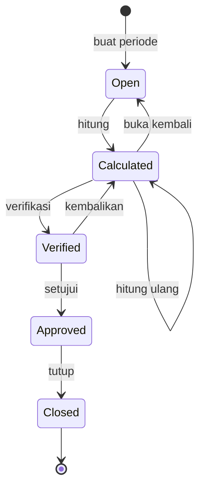
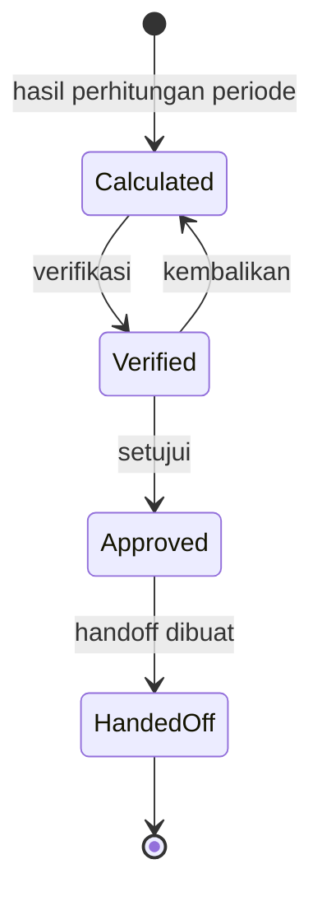
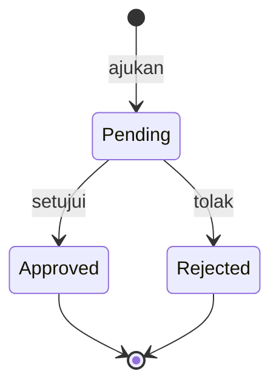
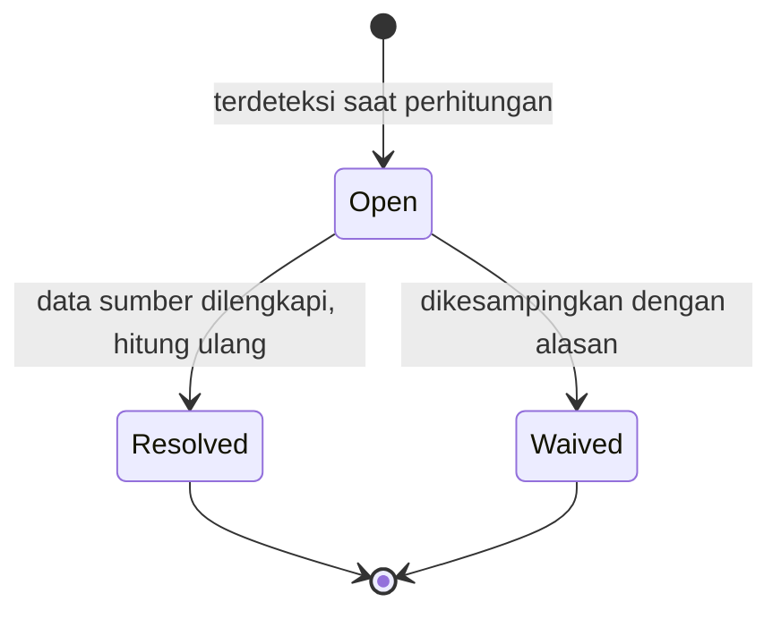
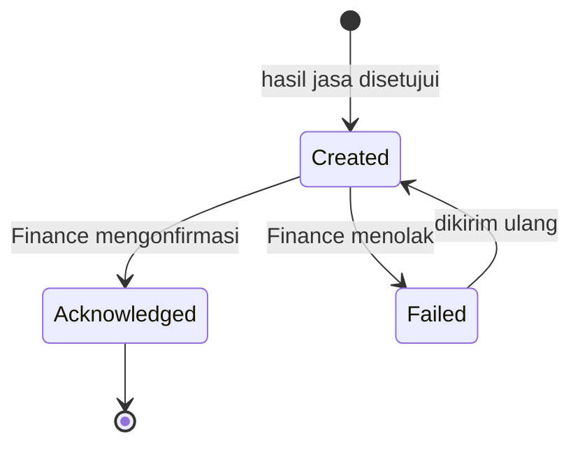

# Medical Fee — Matriks Transisi Status

| Field | Nilai |
|---|---|
| Kontrak | `MDF-STATE-1.0` — `locked` 20 September 2026 |
| Blueprint ID | `MF-BP-001` |
| Cakupan | 5 mesin status: periode, hasil jasa, koreksi, layanan belum terhitung, penyerahan |

Seluruh status disimpan sebagai `string` dan dibatasi check constraint (`MDF-DES-004`).

---

## 1. `MdfFeePeriod`

| Dari | Ke | Aksi | Prasyarat | Efek samping |
|---|---|---|---|---|
| — | `Open` | Buat periode | `PeriodCode` belum ada; rentang tidak tumpang-tindih periode lain | — |
| `Open` | `Calculated` | Hitung | Ada sekurang-kurangnya satu layanan pada rentang | Menulis rincian dan daftar belum terhitung; `CalculatedAt` diisi |
| `Calculated` | `Calculated` | Hitung ulang | — | Mengganti seluruh rincian (`MDF-DES-015`) |
| `Calculated` | `Open` | Buka kembali | — | Menghapus seluruh rincian dan daftar belum terhitung berstatus `Open` |
| `Calculated` | `Verified` | Verifikasi | Seluruh `MdfServiceFee` periode itu sudah `Verified` | `VerifiedBy`, `VerifiedAt` diisi |
| `Verified` | `Calculated` | Kembalikan | — | Status seluruh hasil jasa turun ke `Calculated` |
| `Verified` | `Approved` | Setujui | `ApprovedBy <> VerifiedBy` | Seluruh hasil jasa menjadi `Approved`; **`MdfFinanceHandoff` dibuat** |
| `Approved` | `Closed` | Tutup | **Tidak ada `MdfUnresolvedService` berstatus `Open`** (`MDF-DES-016`) | `ClosedBy`, `ClosedAt` diisi; periode terkunci permanen |

Dari `Closed` **tidak ada jalan kembali**. Koreksi setelah penutupan hanya lewat
`MdfServiceFeeAdjustment`.

## 2. `MdfServiceFee`

| Dari | Ke | Aksi | Prasyarat | Efek samping |
|---|---|---|---|---|
| — | `Calculated` | Perhitungan periode | Ada sekurang-kurangnya satu rincian | `GrossAmount` dan `FinalAmount` dihitung |
| `Calculated` | `Verified` | Verifikasi | Periode `Calculated`; pengguna punya izin verifikasi | `VerifiedBy`, `VerifiedAt` |
| `Verified` | `Calculated` | Kembalikan | Periode belum `Approved` | `VerifiedBy`, `VerifiedAt` dikosongkan |
| `Verified` | `Approved` | Setujui | `ApprovedBy <> VerifiedBy` (`MDF-DES-017`); periode `Verified` | `ApprovedBy`, `ApprovedAt` |
| `Approved` | `HandedOff` | Otomatis | `MdfFinanceHandoff` berhasil dibuat di transaksi yang sama | — |

Baris `HandedOff` **tidak dapat** dihapus, dikembalikan, atau diubah nilainya. Koreksi
sesudahnya wajib lewat `MdfServiceFeeAdjustment`.

## 3. `MdfServiceFeeAdjustment`

| Dari | Ke | Aksi | Prasyarat | Efek samping |
|---|---|---|---|---|
| — | `Pending` | Ajukan | Hasil jasa ada; `Reason` terisi | `RequestedBy`, `RequestedAt` |
| `Pending` | `Approved` | Setujui | **`ApprovedBy <> RequestedBy`** | `MdfServiceFee.AdjustmentAmount` dan `FinalAmount` diperbarui |
| `Pending` | `Rejected` | Tolak | `RejectionReason` terisi; `ApprovedBy <> RequestedBy` | Nilai jasa tidak berubah |

`Approved` dan `Rejected` keduanya final. Membatalkan koreksi yang sudah disetujui dilakukan
dengan mengajukan koreksi baru berarah berlawanan — bukan dengan mengubah yang lama.

## 4. `MdfUnresolvedService`

| Dari | Ke | Aksi | Prasyarat | Efek samping |
|---|---|---|---|---|
| — | `Open` | Terdeteksi | Layanan tidak dapat dihitung | Menahan penutupan periode |
| `Open` | `Resolved` | Hitung ulang setelah data sumber dilengkapi | Perhitungan ulang menghasilkan rincian untuk layanan itu | Tidak lagi menahan penutupan |
| `Open` | `Waived` | Kesampingkan | `ResolutionNote` terisi; pengguna punya izin khusus | Tidak lagi menahan penutupan; jejaknya tetap ada |

`Waived` adalah **keputusan sadar yang tercatat**, bukan penghapusan. Barisnya tetap terlihat di
riwayat periode beserta siapa yang mengesampingkannya dan alasannya.

## 5. `MdfFinanceHandoff`

| Dari | Ke | Aksi | Prasyarat | Efek samping |
|---|---|---|---|---|
| — | `Created` | Persetujuan hasil jasa | Hasil jasa `Approved` | Ditulis di transaksi yang sama dengan persetujuan |
| `Created` | `Acknowledged` | ACK dari Finance | `HandoffKey` cocok | `AcknowledgedAt` diisi |
| `Created` | `Failed` | Penolakan Finance | `FailureReason` terisi | Muncul di layar sebagai perlu ditindaklanjuti |
| `Failed` | `Created` | Kirim ulang | Penyebabnya sudah diperbaiki | `HandoffKey` **tidak berubah** — Finance tetap idempoten |

`HandoffKey` yang tidak berubah saat pengiriman ulang adalah yang membuat Finance aman menerima
baris yang sama dua kali.

## 6. Aturan yang berlaku di seluruh mesin status

| # | Aturan |
|---:|---|
| 1 | Transisi yang tidak tercantum di tabel MUST ditolak `422`, bukan diabaikan diam-diam |
| 2 | Setiap transisi memeriksa `ExpectedRowVersion` terhadap `RowVersion`; tidak cocok → `409` (`MDF-DES-005`) |
| 3 | Setiap transisi berjalan di dalam transaksi; kegagalan mana pun membatalkan seluruhnya |
| 4 | Setiap transisi tercatat di audit trail beserta pelaku, waktu, status sebelum, dan status sesudah |
| 5 | Transisi berpasangan maker-checker MUST diperiksa di service **dan** di check constraint (`MDF-DES-017`) |
| 6 | Perintah yang mengubah nilai uang membawa `Idempotency-Key`; pengulangan dengan kunci sama mengembalikan hasil yang sama, bukan menggandakan (`MDF-DES-006`) |
