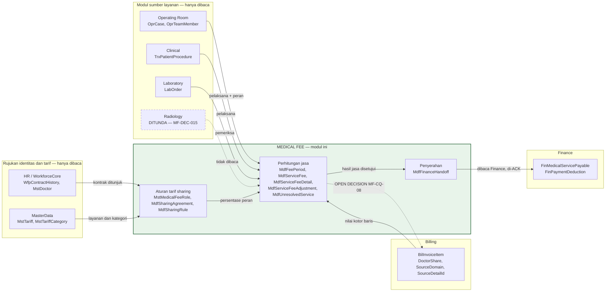

# Medical Fee — ERD Konteks

| Field | Nilai |
|---|---|
| Blueprint ID | `MF-BP-001` |
| Revision | `1` — `draft` |
| Backend SHA | `09101d05` |
| Tanggal | 20 September 2026 |

Dokumen ini memetakan **batas modul**, bukan kolom. Kolom ada di `data-dictionary.md`.

---

## 1. Peta antar bounded context

Satu-satunya panah **keluar** dari Medical Fee yang mengubah data modul lain adalah panah putus
ke `BilInvoiceItem`, dan panah itu `OPEN DECISION` menunggu `MF-CQ-08`. Semua panah lain hanya
membaca, atau diserahkan lewat tabel handoff yang dikonsumsi modul tujuan.

## 2. Arah hubungan dan tanggung jawabnya

| Dari | Ke | Arah | Jenis | Menunggu |
|---|---|---|---|---|
| Medical Fee | Operating Room | Baca | Query langsung lewat `MedicalFeeServiceSourceAdapter` | — |
| Medical Fee | Clinical | Baca | Query langsung | Pembagian tim menunggu `MF-CQ-07` |
| Medical Fee | Laboratory | Baca | Query langsung | Pembagian tim menunggu `MF-CQ-07` |
| Medical Fee | Radiology | **Tidak ada** | — | Ditunda `MF-DEC-015` |
| Medical Fee | Billing (`BilInvoiceItem`) | Baca | Query langsung, nilai kotor baris | — |
| Medical Fee | Billing (`DoctorShare`) | **Tulis** | `OPEN DECISION` | `MF-CQ-08` |
| Medical Fee | HR (`WfpContractHistory`) | Baca + FK `Restrict` | Rujukan kontrak | — |
| Medical Fee | MasterData (`MstTariff`) | Baca + FK `Restrict` | Rujukan layanan | — |
| Medical Fee | Finance | Serah | Tabel handoff `MdfFinanceHandoff`, ACK oleh Finance | — |
| Accounting | Medical Fee | **Tidak ada** | Jurnal dibuat dari sisi Finance | — |

## 3. Kunci lintas modul

| Kolom Medical Fee | Menunjuk | FK database | Alasan |
|---|---|:---:|---|
| `MdfSharingAgreement.SourceContractHistoryId` | `WfpContractHistory.Id` | Ya — `Restrict` | Satu database, satu modul, integritas ditegakkan di sana |
| `MdfSharingRule.TariffId` | `MstTariff.Id` | Ya — `Restrict` | Idem |
| `MdfSharingRule.TariffCategoryId` | `MstTariffCategory.Id` | Ya — `Restrict` | Idem |
| `MdfSharingRule.RoleId` | `MstMedicalFeeRole.Id` | Ya — `Restrict` | Dalam modul |
| `MdfServiceFee.PayeeReferenceId` | `MstDoctor.Id` atau profil tenaga kerja | **Tidak** | Polimorfik menurut `PayeeType`; ditegakkan service |
| `MdfServiceFeeDetail.InvoiceItemId` | `BilInvoiceItem.Id` | **Tidak** | Menghindari FK ke aggregate modul lain; mengikuti pola `SourceDetailId` milik Billing |
| `MdfServiceFeeDetail.SourceDetailId` | Baris layanan di modul sumber | **Tidak** | Polimorfik menurut `SourceDomain` |
| `MdfUnresolvedService.SourceDetailId` | Idem | **Tidak** | Idem |

Aturan yang dipakai: **FK database hanya untuk rujukan yang tidak polimorfik**. Rujukan
polimorfik (`SourceDomain` + `SourceDetailId`, `PayeeType` + `PayeeReferenceId`) divalidasi di
service, karena tidak ada satu tabel tujuan yang tetap.

## 4. Tabel yang bukan milik modul ini

`OprTeamMember`, `TrxPatientProcedure`, `LabOrder`, `BilInvoiceItem`, `BilDiscountApplication`,
`MstTariff`, `MstTariffCategory`, `MstDoctor`, `WfpContractHistory`, `MstContractType`,
`FinMedicalServicePayable`, `FinPaymentDeduction`.

Tidak satu pun disalin, dan tidak satu pun ditulis oleh modul ini pada revisi ini.
