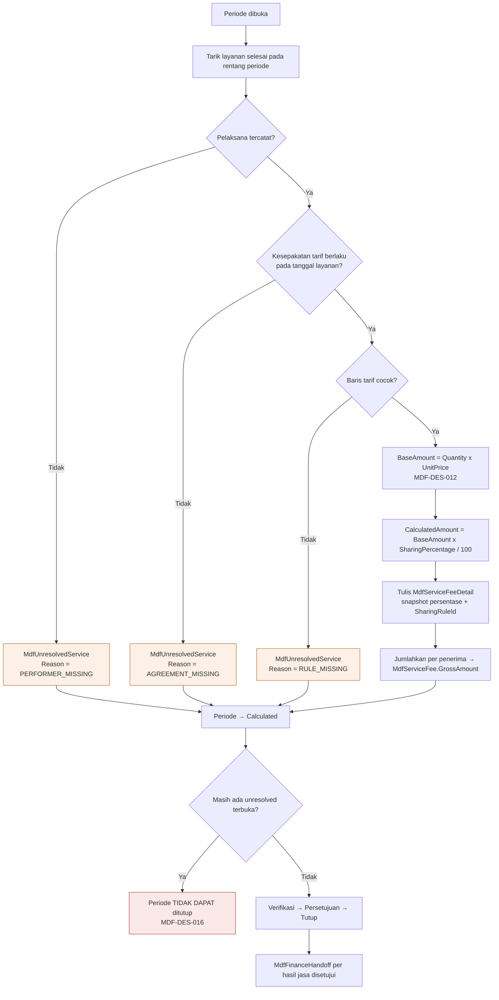

# Medical Fee — ERD Rumpun Perhitungan Jasa

| Field | Nilai |
|---|---|
| Blueprint ID | `MF-BP-001` |
| Revision | `1` — `draft` |
| Cakupan | `MdfFeePeriod`, `MdfServiceFee`, `MdfServiceFeeDetail`, `MdfServiceFeeAdjustment`, `MdfUnresolvedService`, `MdfFinanceHandoff` |
| Keputusan sumber | `MF-DEC-005`..`010`, `013`, `014`, `018`; `MDF-DES-012`..`018` |

---

## 1. Diagram

```mermaid
erDiagram
    MdfFeePeriod ||--o{ MdfServiceFee : "mengumpulkan"
    MdfFeePeriod ||--o{ MdfUnresolvedService : "menahan"
    MdfServiceFee ||--|{ MdfServiceFeeDetail : "dirinci"
    MdfServiceFee ||--o{ MdfServiceFeeAdjustment : "dikoreksi"
    MdfServiceFee ||--o| MdfFinanceHandoff : "diserahkan"
    MdfSharingRule ||--o{ MdfServiceFeeDetail : "snapshot asal"
    MstMedicalFeeRole ||--o{ MdfServiceFeeDetail : "peran"

    MdfFeePeriod {
        Guid Id PK
        string PeriodCode UK
        DateOnly PeriodStart
        DateOnly PeriodEnd
        string Status
        DateTime CalculatedAt "nullable"
        Guid ClosedBy "nullable"
        Guid RowVersion
    }
    MdfServiceFee {
        Guid Id PK
        string FeeNumber UK
        Guid PeriodId FK
        string PayeeType
        Guid PayeeReferenceId
        decimal GrossAmount
        decimal AdjustmentAmount
        decimal FinalAmount
        string Status
        Guid VerifiedBy "nullable"
        Guid ApprovedBy "nullable"
        Guid RowVersion
    }
    MdfServiceFeeDetail {
        Guid Id PK
        Guid ServiceFeeId FK
        string SourceDomain
        string SourceDetailId
        Guid InvoiceItemId "nullable"
        Guid TariffId "nullable"
        Guid RoleId FK
        decimal BaseAmount
        decimal SharingPercentage
        decimal CalculatedAmount
        Guid SharingRuleId FK
        DateOnly ServiceDate
    }
    MdfServiceFeeAdjustment {
        Guid Id PK
        string AdjustmentNumber UK
        Guid ServiceFeeId FK
        string Direction
        decimal Amount
        string Reason
        string Status
        Guid RequestedBy
        Guid ApprovedBy "nullable"
        Guid RowVersion
    }
    MdfUnresolvedService {
        Guid Id PK
        Guid PeriodId FK
        string SourceDomain
        string SourceDetailId
        Guid InvoiceItemId "nullable"
        string Reason
        string Status
        Guid ResolvedBy "nullable"
    }
    MdfFinanceHandoff {
        Guid Id PK
        Guid ServiceFeeId FK UK
        Guid HandoffKey UK
        string PeriodCode
        decimal GrossAmount
        string Status
        Guid CorrelationId
        Guid RowVersion
    }
```

## 2. Alur satu perhitungan periode



## 3. Rumus, sekali dan tanpa varian

| Nilai | Rumus | Dasar |
|---|---|---|
| `MdfServiceFeeDetail.BaseAmount` | `BilInvoiceItem.Quantity × BilInvoiceItem.UnitPrice` — **sebelum diskon apa pun** | `MF-DEC-013`, `MDF-DES-012` |
| `MdfServiceFeeDetail.CalculatedAmount` | `BaseAmount × SharingPercentage ÷ 100`, dibulatkan ke 2 desimal | `MF-DEC-014`, `MDF-DES-013` |
| `MdfServiceFee.GrossAmount` | `Σ CalculatedAmount` seluruh rinciannya | — |
| `MdfServiceFee.AdjustmentAmount` | `Σ Amount` koreksi berstatus disetujui, bertanda menurut `Direction` | `MF-DEC-007` |
| `MdfServiceFee.FinalAmount` | `GrossAmount + AdjustmentAmount` | — |
| `MdfFinanceHandoff.GrossAmount` | `MdfServiceFee.FinalAmount` — **kotor**, sebelum potongan apa pun | `MF-DEC-005` |

Nama `MdfFinanceHandoff.GrossAmount` mengambil nilai `FinalAmount` dengan sengaja: "gross" di
situ berarti **sebelum potongan pajak dan potongan lain**, bukan sebelum koreksi. Potongan
adalah urusan Finance (`FinPaymentDeduction`, `FIN-DES-026`).

## 4. Pembulatan

Satu aturan, berlaku di satu tempat: pembulatan hanya terjadi saat menghitung
`CalculatedAmount`, ke 2 desimal, `MidpointRounding.AwayFromZero`. Seluruh penjumlahan di
atasnya memakai nilai yang sudah dibulatkan, sehingga jumlah baris selalu sama persis dengan
total — tidak ada selisih sen yang muncul belakangan.

Konsekuensi yang diterima: bila satu layanan dibagi tiga peran dengan persentase yang tidak
habis dibagi, jumlah ketiga porsi bisa berselisih sen dari nilai kotor dikali total persentase.
Selisih itu **tidak** dialokasikan ulang ke salah satu peran, karena mengubah salah satunya akan
membuat porsi orang tidak lagi sama dengan persentase yang tertulis di kesepakatannya.

## 5. Mengapa `MdfUnresolvedService` berdiri sendiri

`MDF-DES-014`. Tiga alternatif dipertimbangkan:

| Alternatif | Mengapa ditolak |
|---|---|
| Baris `MdfServiceFee` berstatus tertahan | `MdfServiceFee` selalu menuntut `PayeeReferenceId`; layanan tanpa pelaksana justru belum punya. Memaksakannya melahirkan baris tanpa penerima yang merusak invariant keunikan per penerima |
| Kolom penanda di `MdfServiceFeeDetail` | Rincian selalu milik satu hasil jasa, sehingga masalahnya sama |
| Dilewati dan dicatat di log | Mengulang persis masalah yang ada sekarang — jasa terlewat tanpa ketahuan (`MF-DEC-018`) |

`Reason` memakai nilai tetap: `PERFORMER_MISSING`, `AGREEMENT_MISSING`, `RULE_MISSING`,
`CONTRACT_EXPIRED`, `ROLE_UNMAPPED`, `SOURCE_UNSUPPORTED`. Nilai terakhir dipakai untuk layanan
radiologi selama `MF-DEC-015` masih berlaku.

## 6. Perhitungan ulang

`MDF-DES-015`. Selama periode `Open` atau `Calculated`:

1. Seluruh `MdfServiceFeeDetail` milik periode itu dihapus (soft delete).
2. Seluruh `MdfUnresolvedService` berstatus `Open` milik periode itu dihapus.
3. Perhitungan dijalankan ulang dari awal.
4. `MdfServiceFee` yang penerimanya tidak lagi punya rincian ikut dihapus.
5. Koreksi yang sudah disetujui **tidak** disentuh, dan `AdjustmentAmount` dihitung ulang dari koreksi yang tersisa.

Setelah periode `Verified` atau lebih tinggi, perhitungan ulang ditolak `422`. Perubahan hanya
lewat `MdfServiceFeeAdjustment`.

## 7. Invariant rumpun ini

| # | Invariant | Ditegakkan |
|---:|---|---|
| 1 | `FinalAmount = GrossAmount + AdjustmentAmount` | Check constraint |
| 2 | `GrossAmount >= 0` | Check constraint |
| 3 | (`PeriodId`, `PayeeType`, `PayeeReferenceId`) unik | Partial unique index |
| 4 | `PeriodCode` unik | Partial unique index |
| 5 | `FeeNumber` dan `AdjustmentNumber` unik | Partial unique index |
| 6 | `PeriodEnd >= PeriodStart` | Check constraint |
| 7 | `SharingPercentage` pada rincian antara 0 dan 100 | Check constraint |
| 8 | `GrossAmount` = `Σ CalculatedAmount` rinciannya | Service |
| 9 | `RequestedBy <> ApprovedBy` pada koreksi | Check constraint + service |
| 10 | Periode tidak dapat ditutup bila ada `MdfUnresolvedService` berstatus `Open` | Service |
| 11 | (`ServiceFeeId`) dan (`HandoffKey`) unik pada handoff | Partial unique index |
| 12 | Handoff hanya dibuat untuk hasil jasa berstatus `Approved` | Service |
| 13 | `MdfServiceFeeDetail.SharingRuleId` MUST terisi — setiap rupiah dapat ditelusuri aturannya | `IsRequired` |

Invariant 13 adalah yang menjawab pertanyaan "mengapa angkanya sekian" tanpa menebak.
