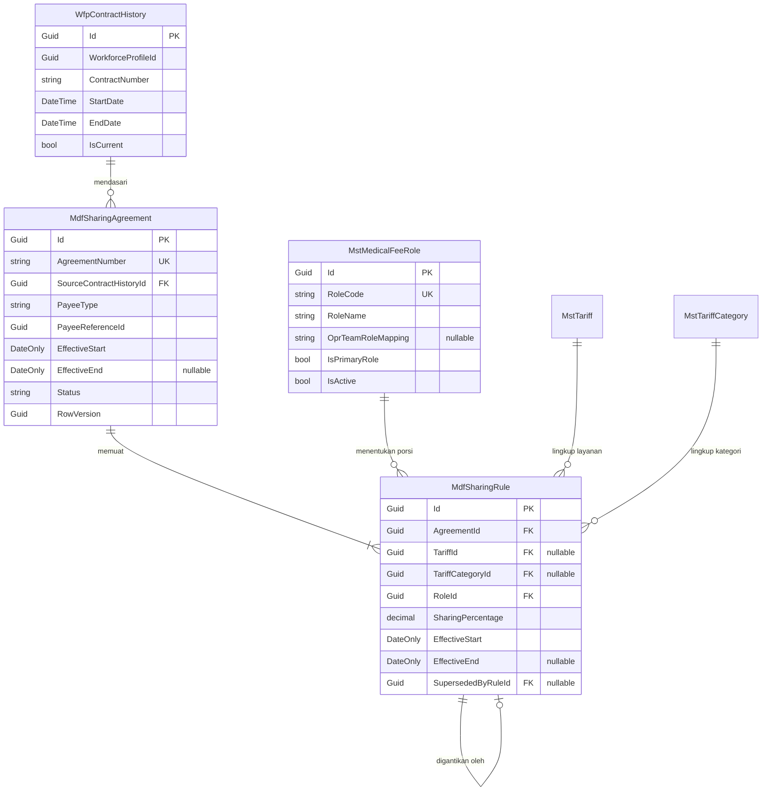

# Medical Fee — ERD Rumpun Aturan Tarif Sharing

| Field | Nilai |
|---|---|
| Blueprint ID | `MF-BP-001` |
| Revision | `1` — `draft` |
| Cakupan | `MstMedicalFeeRole`, `MdfSharingAgreement`, `MdfSharingRule` |
| Keputusan sumber | `MF-DEC-004`, `MF-DEC-012`, `MF-DEC-014`, `MF-DEC-016`; `MDF-DES-008`..`011` |

---

## 1. Diagram



## 2. Cara baris tarif dipilih

Empat tingkat kekhususan. **Yang lebih khusus menang**, dan pencarian berhenti pada tingkat
pertama yang cocok — bukan menjumlahkan lintas tingkat.

| Tingkat | `TariffId` | `TariffCategoryId` | Artinya |
|---:|:---:|:---:|---|
| 1 | terisi | terisi | Layanan tertentu di kategori tertentu |
| 2 | terisi | kosong | Layanan tertentu, kategori apa pun |
| 3 | kosong | terisi | Seluruh layanan pada satu kategori |
| 4 | kosong | kosong | Seluruh layanan — tarif umum kesepakatan itu |

Dalam satu tingkat, baris yang cocok adalah yang `EffectiveStart <= ServiceDate` dan
(`EffectiveEnd` kosong atau `>= ServiceDate`). Bila satu tingkat menghasilkan lebih dari satu
baris untuk peran yang sama, itu **cacat data** — service menolak dengan `422`, bukan memilih
salah satu diam-diam.

## 3. Versi lewat masa berlaku

`MDF-DES-009`. Mengubah tarif **tidak** memperbarui baris yang ada.

```text
Sebelum perubahan
  Rule A  operator 40%  2026-01-01 .. (kosong)         SupersededBy = kosong

Tarif berubah menjadi 45% mulai 2026-10-01
  Rule A  operator 40%  2026-01-01 .. 2026-09-30       SupersededBy = Rule B
  Rule B  operator 45%  2026-10-01 .. (kosong)         SupersededBy = kosong
```

Layanan tanggal 20 September tetap memakai 40%, layanan 5 Oktober memakai 45%, dan hasil jasa
periode September tidak bergeser sedikit pun ketika tarif diubah.

## 4. Hubungan dengan kontrak HR

`MdfSharingAgreement.SourceContractHistoryId` **menunjuk**, tidak menyalin (`MDF-DES-008`,
`MF-DEC-012`).

| Aturan | Ditegakkan di |
|---|---|
| `EffectiveStart` kesepakatan MUST NOT mendahului `StartDate` kontrak | Service |
| `EffectiveEnd` kesepakatan MUST NOT melewati `EndDate` kontrak, bila kontrak punya akhir | Service |
| Layanan setelah kontrak berakhir MUST NOT menghasilkan jasa | `MedicalFeeCalculationService` — jatuh ke `MdfUnresolvedService` |
| Kontrak yang sedang ditunjuk kesepakatan MUST NOT dihapus | FK `Restrict` |

Perpanjangan kontrak di HR melahirkan baris `WfpContractHistory` baru dan **tidak** membawa
kesepakatan tarif ikut berpindah. Itu disengaja, dan sudah disampaikan ke owner HR pada
`evidence/02-pemberitahuan-untuk-owner-hr.md` bagian 4.

## 5. Peran dan pemetaannya

`MstMedicalFeeRole.OprTeamRoleMapping` menyimpan nilai `OprTeamRole` milik Operating Room
(`PrimarySurgeon`, `AssistantSurgeon`, `Anesthesiologist`, `ScrubNurse`, `CirculatingNurse`,
`Other`) sebagai `string`. Kosong berarti peran itu tidak punya padanan di kamar operasi.

| Invariant | Ditegakkan di |
|---|---|
| `RoleCode` unik di antara baris yang belum dihapus | Partial unique index |
| Satu nilai `OprTeamRole` dipetakan paling banyak satu peran | Partial unique index pada `OprTeamRoleMapping` |
| Peran yang sudah dipakai baris tarif MUST NOT dihapus | FK `Restrict`; dinonaktifkan lewat `IsActive` |

## 6. Invariant rumpun ini

| # | Invariant | Ditegakkan |
|---:|---|---|
| 1 | `SharingPercentage` antara 0 dan 100 | Check constraint |
| 2 | `EffectiveEnd` kosong atau `>= EffectiveStart` | Check constraint |
| 3 | `AgreementNumber` unik | Partial unique index |
| 4 | Satu kesepakatan punya sekurang-kurangnya satu baris tarif saat diaktifkan | Service |
| 5 | Jumlah persentase seluruh peran pada satu lingkup dan satu waktu MUST NOT melebihi 100% | Service |
| 6 | Baris tarif yang sudah dipakai rincian hasil jasa MUST NOT diubah nilainya | Service — perubahan menghasilkan baris baru |
| 7 | Masa berlaku kesepakatan berada di dalam masa berlaku kontrak sumbernya | Service |

Invariant 5 sengaja **tidak** memaksa jumlahnya tepat 100%: rumah sakit boleh saja menyisakan
porsi untuk dirinya sendiri, dan itu justru keadaan yang lazim.
