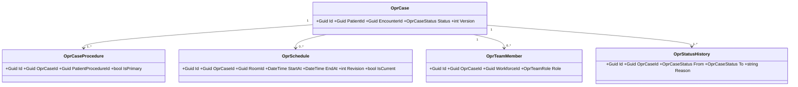

# Modul Operasi — Arsitektur Backend

Status: `approved` oleh pemilik kebutuhan pada 2026-08-21. Input: requirement `READY_FOR_DOMAIN_DESIGN`, domain architecture `DOMAIN_ARCHITECTURE_READY` revision 1.

## Bounded Context dan Ownership

Target canonical: `Areas/HealthServices/OperatingRoomManagement`. Prefix persisted entity: `Opr`, sesuai registry repository berstatus `PLANNED`.

Aggregate root `OprCase` menjaga lifecycle satu kasus. Perubahan status, jadwal aktif, tim minimum, dan gerbang kesiapan berlangsung dalam transaction boundary kasus. Pengiriman ke Billing/Inventory memakai outbox/delivery state sehingga transaksi lokal tidak bergantung pada layanan downstream tersedia saat itu.

## Tabel Kepemilikan Data

| Kelompok data | Modul pemilik | Dipakai | Dibuat ulang |
|---|---|:---:|:---:|
| Pasien | PatientManagement | Ya | Tidak |
| Encounter | RegistrationManagement | Ya | Tidak |
| Tindakan pasien | ClinicalManagement | Ya | Tidak |
| Consent operasi/anestesi | ClinicalManagement | Ya | Tidak |
| Dokter/pegawai/credential | HumanResource | Ya | Tidak |
| Ruang/procedure/tarif | MasterData | Ya | Tidak |
| Kasus, jadwal, tim, checklist, pelaksanaan, anestesi, recovery, handover | OperatingRoomManagement | Ya | Ya |
| Item dan saldo stok | Pharmacy/Inventory | Ya | Tidak |
| Charge/invoice/pembayaran | BillingManagement | Ya | Tidak |

## Class Diagram — Inti Kasus



## Class Diagram — Klinis dan Integrasi

```mermaid
classDiagram
 class OprCase
 class OprSafetyChecklist { +Guid Id +Guid OprCaseId +OprChecklistPhase Phase +OprChecklistStatus Status }
 class OprExecutionRecord { +Guid Id +Guid OprCaseId +OprRecordStatus Status +DateTime? FinalizedAt }
 class OprExecutionAddendum { +Guid Id +Guid ExecutionRecordId +string Reason +DateTime AuthoredAt }
 class OprAnesthesiaRecord { +Guid Id +Guid OprCaseId +OprRecordStatus Status }
 class OprMaterialUsage { +Guid Id +Guid OprCaseId +Guid ExternalItemId +decimal Quantity +OprMaterialOutcome Outcome }
 class OprRecovery { +Guid Id +Guid OprCaseId +OprRecoveryStatus Status +DateTime? ReleasedAt }
 class OprHandover { +Guid Id +Guid OprCaseId +Guid DestinationUnitId +Guid? ReceivedBy +DateTime? AcceptedAt }
 class OprIntegrationDelivery { +Guid Id +Guid OprCaseId +string Destination +string IdempotencyKey +OprDeliveryStatus Status }
 OprCase "1" --> "0..*" OprSafetyChecklist
 OprCase "1" --> "0..1" OprExecutionRecord
 OprExecutionRecord "1" --> "0..*" OprExecutionAddendum
 OprCase "1" --> "0..1" OprAnesthesiaRecord
 OprCase "1" --> "0..*" OprMaterialUsage
 OprCase "1" --> "0..1" OprRecovery
 OprCase "1" --> "0..*" OprHandover
 OprCase "1" --> "0..*" OprIntegrationDelivery
```



## Penjelasan Class

Semua model baru berada di `Areas/HealthServices/OperatingRoomManagement/Models/`, enum di `Enums/`, DTO di `DTOs/`, dan configuration di `Repositories/Configurations/HealthServices/OperatingRoomManagement/`.

| Class | Status | Lokasi file | Kategori | Tanggung jawab dan catatan |
|---|---|---|---|---|
| `OprCase` | Baru | `.../Models/OprCase.cs` | Aggregate/transaksi | Pusat lifecycle; referensi pasien/encounter; concurrency wajib |
| `OprCaseProcedure` | Baru | `.../Models/OprCaseProcedure.cs` | Entity asosiasi | Banyak tindakan per kasus, tepat satu utama; tidak menyalin procedure |
| `OprSchedule` | Baru | `.../Models/OprSchedule.cs` | Transaksi | Revisi jadwal append-only; satu current per kasus |
| `OprTeamMember` | Baru | `.../Models/OprTeamMember.cs` | Transaksi | Assignment tenaga dan peran; referensi HR |
| `OprSafetyChecklist` | Baru | `.../Models/OprSafetyChecklist.cs` | Transaksi klinis | Checklist berversi per fase beserta sign-off/bypass |
| `OprExecutionRecord` | Baru | `.../Models/OprExecutionRecord.cs` | Rekam klinis | Catatan operasi; final tidak dapat ditimpa |
| `OprExecutionAddendum` | Baru | `.../Models/OprExecutionAddendum.cs` | Rekam klinis | Koreksi append-only terhadap record final |
| `OprAnesthesiaRecord` | Baru | `.../Models/OprAnesthesiaRecord.cs` | Rekam klinis | Catatan anestesi terpisah dari consent |
| `OprMaterialUsage` | Baru | `.../Models/OprMaterialUsage.cs` | Transaksi | Pemakaian/retur/waste dan batch/serial; bukan saldo stok |
| `OprRecovery` | Baru | `.../Models/OprRecovery.cs` | Rekam klinis | Pemantauan serta keputusan dokter anestesi |
| `OprHandover` | Baru | `.../Models/OprHandover.cs` | Transaksi klinis | Pemindahan tanggung jawab yang harus diterima |
| `OprStatusHistory` | Baru | `.../Models/OprStatusHistory.cs` | Audit domain | Histori transition append-only |
| `OprIntegrationDelivery` | Baru | `.../Models/OprIntegrationDelivery.cs` | Integrasi | Idempotency, retry, kegagalan, rekonsiliasi |
| `OperatingRoomCaseService` | Baru | `.../Services/OperatingRoomCaseService.cs` | Service | Menjaga transition/invariant dan membuka transaksi DB |
| `OperatingRoomSchedulingService` | Baru | `.../Services/OperatingRoomSchedulingService.cs` | Service | Pemeriksaan benturan dan revisi jadwal; membuka transaksi DB |
| `OperatingRoomIntegrationService` | Baru | `.../Services/OperatingRoomIntegrationService.cs` | Service | Membuat delivery idempotent; retry/reconciliation |
| `OperatingRoomCaseController` | Baru | `.../Controllers/OperatingRoomCaseController.cs` | Controller | Query kasus serta command lifecycle; memakai ketiga service |
| `OperatingRoomReportController` | Baru | `.../Controllers/OperatingRoomReportController.cs` | Controller | Query laporan read-only; GET tidak dicatat custom logger |

Setiap model mempunyai file `...Configuration.cs` di folder configuration canonical dan memakai `DeleteBehavior.Restrict` untuk relasi klinis.

## Arsitektur Folder

```text
Areas/HealthServices/OperatingRoomManagement/
├── Controllers/                         # Baru
│   ├── OperatingRoomCaseController.cs
│   └── OperatingRoomReportController.cs
├── DTOs/OperatingRoomCaseDtos.cs        # Baru
├── Enums/                               # Baru: status, role, phase, outcome, delivery
├── Models/                              # Baru: seluruh Opr* di atas
└── Services/                            # Baru: case, scheduling, integration
Repositories/Configurations/HealthServices/OperatingRoomManagement/ # Baru
Migrations/                              # Migration terpisah, belum dibuat
```

## Status Model dan Migration

| Model | Status | Dampak migration |
|---|---|---|
| Seluruh `Opr*` | Baru | Membuat tabel/index/FK baru |
| `TrxPatientProcedure`, `TrxPatientConsent`, patient, encounter, doctor, room, tariff | Sudah ada | Tidak diubah; hanya direferensikan |

## Index, Unique, Delete, Concurrency

- Unique tindakan aktif: `PatientProcedureId` hanya boleh terkait satu kasus yang belum terminal.
- Unique tindakan utama: satu `IsPrimary=true` per kasus.
- Unique jadwal current: satu `IsCurrent=true` per kasus.
- Index benturan: ruang/waktu/current serta workforce/waktu/current.
- Unique checklist: case + phase + revision.
- Unique integration delivery: destination + idempotency key.
- Semua FK klinis `Restrict`; penghapusan memakai penandaan `IdentityModel`.
- `OprCase` dan record yang dapat diedit memakai concurrency token.

## Rencana Migration

1. Tambahkan enum/model/configuration dan DbSet.
2. Buat tabel inti kasus, procedure, schedule, team, status history.
3. Buat tabel klinis dan integration delivery.
4. Tambahkan index/constraint dan validasi data.

Migration bersifat additive dan dirancang tanpa downtime. Tidak ada backfill karena modul baru. Jika gagal sebelum dipakai, rollback migration menghapus objek baru; setelah data produksi tercipta, rollback harus melalui migration kompensasi dan arsip data, bukan drop langsung.

## Rencana Master Awal

Tidak dibuat master baru. Checklist/score klinis membutuhkan konfigurasi rumah sakit, tetapi bentuk master final belum boleh di-hardcode; blueprint memakai template/configuration version pada checklist dan recovery. Implementasi pertama harus mempunyai konfigurasi aktif sebelum fitur dapat dipakai.

## Yang Sengaja Tidak Dibuat

| Ditolak | Alasan |
|---|---|
| `OprPatient`, `OprEncounter`, `OprDoctor`, `OprEmployee` | Sudah dimiliki context lain |
| `OprConsent` | Gunakan `TrxPatientConsent` |
| `OprProcedureMaster`, `OprTariff` | Gunakan MasterData |
| `OprInventory`, `OprStock`, `OprInvoice` | Ownership Pharmacy/Inventory/Billing |
| Jadwal berbasis `MstDoctorSchedule` | Itu jadwal praktik klinik, bukan kalender operasi |
| Satu tabel per bagian form | Bentuk UI bukan alasan membuat entity |

## DI, Deployment, dan Rollback

Daftarkan tiga service scoped di `Program.cs` pada task implementasi terpisah. Deployment backend mendahului frontend. Feature tetap tidak dapat diakses sampai permission dan konfigurasi aktif tersedia. Tidak ada migration atau runtime database yang dijalankan oleh blueprint ini.
