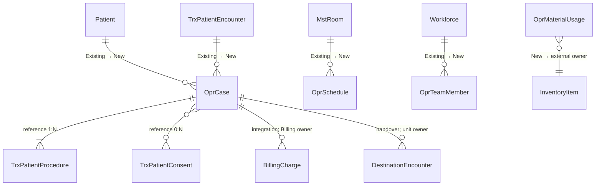

# Context ERD — Modul Operasi

`Patient`, encounter, procedure, consent, room, workforce, item, charge, dan unit tujuan tetap dimiliki context masing-masing. Garis menunjukkan dependency, bukan pemindahan ownership.
