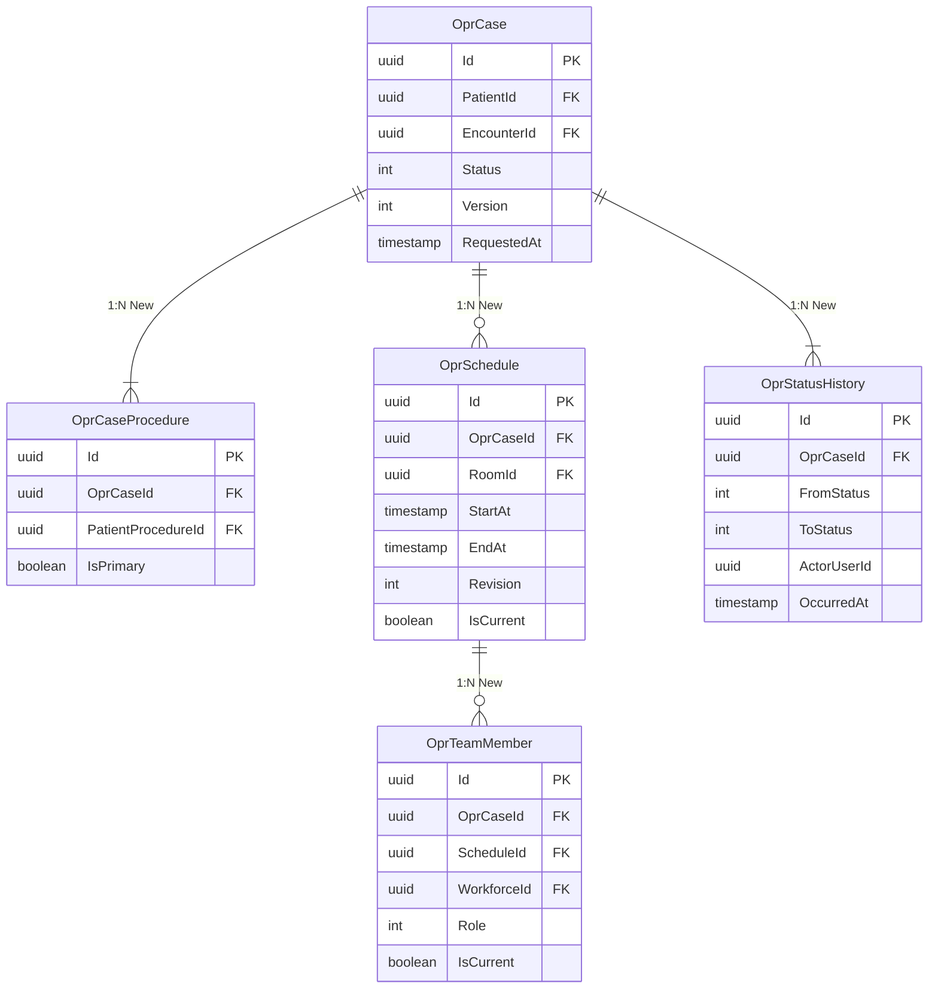

# ERD — Operating Room Management

Status entity seluruh `Opr*`: **Baru**, owner `OperatingRoomManagement`. Existing references tidak dibuat ulang.

## Inti Kasus dan Jadwal



## Klinis, Material, dan Integrasi

```mermaid
erDiagram
 OprCase { uuid Id PK int Status int Version }
 OprSafetyChecklist { uuid Id PK uuid OprCaseId FK int Phase int Revision int Status timestamp? SignedAt }
 OprExecutionRecord { uuid Id PK uuid OprCaseId FK int Status timestamp? FinalizedAt uuid? FinalizedBy }
 OprExecutionAddendum { uuid Id PK uuid ExecutionRecordId FK text Content text Reason timestamp AuthoredAt }
 OprAnesthesiaRecord { uuid Id PK uuid OprCaseId FK int Status timestamp? FinalizedAt }
 OprMaterialUsage { uuid Id PK uuid OprCaseId FK uuid ExternalItemId decimal Quantity int Outcome varchar BatchNumber varchar SerialNumber }
 OprRecovery { uuid Id PK uuid OprCaseId FK int Status uuid? ReleasedBy timestamp? ReleasedAt }
 OprHandover { uuid Id PK uuid OprCaseId FK uuid DestinationUnitId uuid? ReceivedBy timestamp? AcceptedAt int Status }
 OprIntegrationDelivery { uuid Id PK uuid OprCaseId FK varchar Destination varchar IdempotencyKey UK int Status int RetryCount }
 OprCase ||--o{ OprSafetyChecklist : "1:N New"
 OprCase ||--o| OprExecutionRecord : "1:0..1 New"
 OprExecutionRecord ||--o{ OprExecutionAddendum : "1:N New"
 OprCase ||--o| OprAnesthesiaRecord : "1:0..1 New"
 OprCase ||--o{ OprMaterialUsage : "1:N New"
 OprCase ||--o| OprRecovery : "1:0..1 New"
 OprCase ||--o{ OprHandover : "1:N New"
 OprCase ||--o{ OprIntegrationDelivery : "1:N New"
```

Semua relasi klinis memakai `DeleteBehavior.Restrict`. Data tidak dihapus fisik; `IdentityModel` menyediakan penanda penghapusan/audit.
