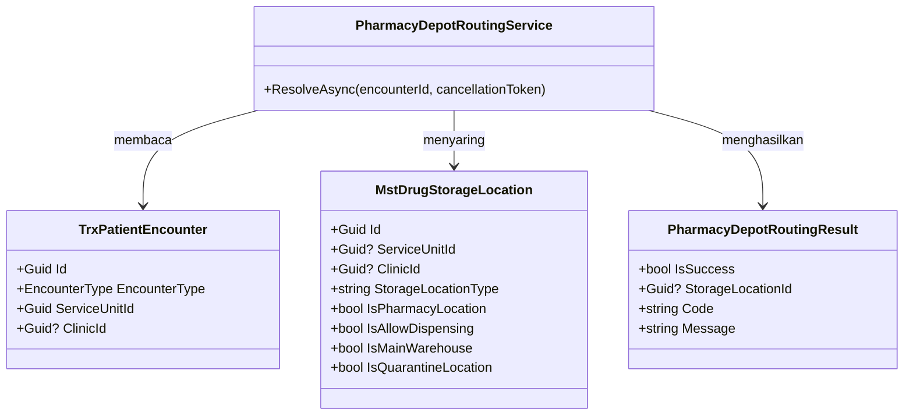

# Farmasi — Arsitektur Backend Routing Depo

Status: `approved` oleh product/domain owner pada 21 Agustus 2026. Scope hanya `PHA-DA-001`.

## Bounded context dan ownership

`Pharmacy Prescription Fulfillment` memiliki aturan routing, tetapi tidak memiliki encounter maupun master lokasi. Routing dijalankan sebagai operasi baca deterministik. Tidak ada aggregate atau transaction database baru; kegagalan menghentikan workflow sebelum reservasi.

## Kepemilikan data

| Kelompok data | Modul pemilik | Dipakai | Dibuat ulang |
| --- | --- | :---: | --- |
| Encounter dan jenis layanan | Registration Management | Ya | Tidak |
| Service Unit dan Clinic | Master Data/Registration | Ya | Tidak |
| Lokasi penyimpanan/Depo | Health Services Master Data | Ya | Tidak |
| Resep | Pharmacy Management | Ya | Tidak |
| Hasil routing | Pharmacy Management | Ya, sebagai result proses | Tidak dipersistensi pada slice ini |

## Class diagram



## Penjelasan class

### `TrxPatientEncounter`

| Aspek | Penjelasan |
| --- | --- |
| **Status** | `Sudah ada` |
| **Lokasi file** | `Areas/HealthServices/RegistrationManagement/Models/TrxPatientEncounter.cs` |
| Kategori | Transaksi Registration |
| Tanggung jawab | Sumber authoritative jenis layanan, unit, dan klinik encounter |
| Field penting | `Id`, `EncounterType`, `ServiceUnitId`, `ClinicId` |
| Relasi | Dibaca resolver; tidak diubah |
| Pemakaian | Menentukan kriteria routing |
| Catatan | Jangan membuat salinan encounter Farmasi |
| Ekuivalen lama | — |

### `MstDrugStorageLocation`

| Aspek | Penjelasan |
| --- | --- |
| **Status** | `Sudah ada` |
| **Lokasi file** | `Areas/HealthServices/MasterData/Models/MstDrugStorageLocation.cs` |
| Kategori | Master lokasi |
| Tanggung jawab | Menyimpan scope dan kelayakan lokasi dispensing |
| Field penting | `Id`, `ServiceUnitId`, `ClinicId`, `StorageLocationType`, seluruh flag eligibility |
| Relasi | Dibaca resolver; tidak diubah |
| Pemakaian | Menjadi kandidat Depo |
| Catatan | Perbandingan `StorageLocationType` dinormalisasi case-insensitive; tidak mengubah data lama |
| Ekuivalen lama | — |

### `PharmacyDepotRoutingService`

| Aspek | Penjelasan |
| --- | --- |
| **Status** | `Baru` |
| **Lokasi file** | `Areas/HealthServices/PharmacyManagement/Services/PharmacyDepotRoutingService.cs` |
| Kategori | Domain/application service |
| Tanggung jawab | Membaca encounter, menyaring kandidat, menerapkan prioritas, dan menolak hasil nol/ganda |
| Dipanggil oleh | Workflow Farmasi sebelum reservasi |
| Membuka transaksi database | Tidak; operasi baca dengan `AsNoTracking` |
| Catatan | Tidak memilih kandidat pertama dan tidak mengubah stok/payment |
| Ekuivalen lama | — |

### `PharmacyDepotRoutingResult`

| Aspek | Penjelasan |
| --- | --- |
| **Status** | `Baru` |
| **Lokasi file** | `Areas/HealthServices/PharmacyManagement/DTOs/PharmacyDepotRoutingDtos.cs` |
| Kategori | Internal result contract |
| Tanggung jawab | Membawa hasil sukses atau kode kegagalan yang aman ditampilkan |
| Field | `IsSuccess: bool`, `StorageLocationId: Guid?`, `Code: string`, `Message: string` |
| Catatan | Bukan entity dan tidak dipersistensi |
| Ekuivalen lama | — |

Tidak ada controller baru. Resolver dipakai oleh workflow existing agar kontrak internal tidak diekspos sebagai endpoint yang dapat dipanggil untuk menebak konfigurasi lokasi.

## Struktur folder target

```text
Areas/HealthServices/PharmacyManagement/
├── DTOs/
│   └── PharmacyDepotRoutingDtos.cs                 # Baru
└── Services/
    └── PharmacyDepotRoutingService.cs              # Baru
Program.cs                                           # Diperbarui: AddScoped service saja
```

Integrasi ke workflow existing ditentukan oleh task delivery setelah kontrak Billing/reservasi siap. Slice pertama dapat menguji resolver secara mandiri tanpa mengaktifkan reservasi.

## Status model dan migration

| Model | Status | Perubahan kolom | Migration |
| --- | --- | --- | --- |
| `TrxPatientEncounter` | Sudah ada | Tidak ada | Tidak |
| `MstDrugStorageLocation` | Sudah ada | Tidak ada | Tidak |
| `PharmacyDepotRoutingResult` | Baru, non-persistence | Tidak berlaku | Tidak |

Rencana migration: tidak ada migration, backfill, downtime, atau rollback database. Rollback source cukup melepas pemanggilan resolver dan registrasi DI.

## Data master awal

Tidak ada tabel master baru. Sebelum aktivasi, setiap layanan yang memakai Farmasi wajib memiliki tepat satu lokasi eligible pada prioritasnya. Konfigurasi ini berasal dari master lokasi rumah sakit, bukan seed hardcoded.

## Yang sengaja tidak dibuat

| Ditolak | Alasan |
| --- | --- |
| `MstPharmacyDepot` | Menduplikasi `MstDrugStorageLocation` |
| `TrxPharmacyDepotRouting` | Routing belum membutuhkan lifecycle persistence; audit persistence diputuskan pada delivery terpisah bila wajib |
| `PharmacyDepotRoutingController` | Resolver adalah bagian workflow internal, bukan resource publik |
| Migration lokasi | Seluruh field routing sudah tersedia |

## Logging, observability, dan privacy

Log kegagalan memuat correlation ID, encounter ID, code, dan jumlah kandidat. Log tidak boleh memuat nama pasien, diagnosis, resep, atau detail obat. Metric minimum: resolved, no-candidate, ambiguous, dan latency resolver.

## Test strategy

Unit/integration test membuktikan tiga jenis encounter, filter eligibility, prioritas Rawat Jalan, nol kandidat, kandidat ganda, lokasi nonaktif, serta cancellation token. Query harus memakai snapshot database test dan tidak mengubah data.
