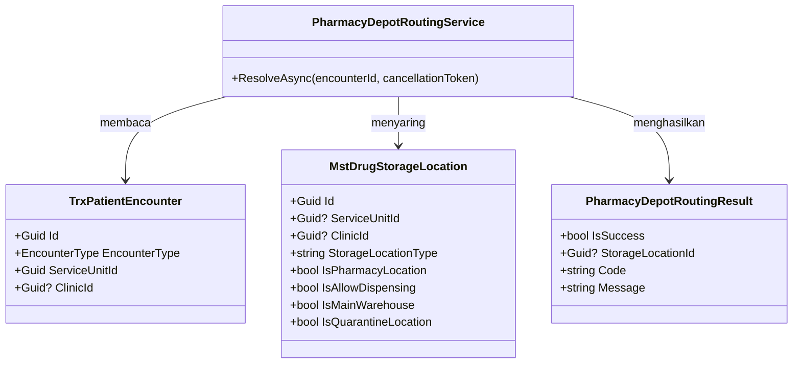
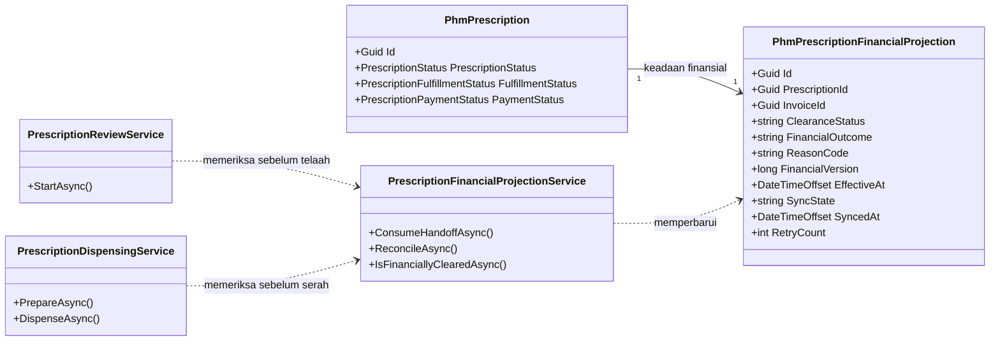

# Farmasi — Arsitektur Backend Routing Depo

Status: `approved` oleh product/domain owner pada 21 Agustus 2026. Scope hanya `PHA-DA-001`.

## Bounded context dan ownership

`Pharmacy Prescription Fulfillment` memiliki aturan routing, tetapi tidak memiliki encounter maupun master lokasi. Routing dijalankan sebagai operasi baca deterministik. Tidak ada aggregate atau transaction database baru; kegagalan menghentikan workflow sebelum reservasi.

## Kepemilikan data

| Kelompok data | Modul pemilik | Dipakai | Dibuat ulang |
| --- | --- | :---: | --- |
| Encounter dan jenis layanan | Registration Management | Ya | Tidak |
| Service Unit dan Clinic | Master Data/Registration | Ya | Tidak |
| Lokasi penyimpanan/Depo | Health Services Master Data | Ya | Tidak |
| Resep | Pharmacy Management | Ya | Tidak |
| Hasil routing | Pharmacy Management | Ya, sebagai result proses | Tidak dipersistensi pada slice ini |

## Class diagram



## Penjelasan class

### `TrxPatientEncounter`

| Aspek | Penjelasan |
| --- | --- |
| **Status** | `Sudah ada` |
| **Lokasi file** | `Areas/HealthServices/RegistrationManagement/Models/TrxPatientEncounter.cs` |
| Kategori | Transaksi Registration |
| Tanggung jawab | Sumber authoritative jenis layanan, unit, dan klinik encounter |
| Field penting | `Id`, `EncounterType`, `ServiceUnitId`, `ClinicId` |
| Relasi | Dibaca resolver; tidak diubah |
| Pemakaian | Menentukan kriteria routing |
| Catatan | Jangan membuat salinan encounter Farmasi |
| Ekuivalen lama | — |

### `MstDrugStorageLocation`

| Aspek | Penjelasan |
| --- | --- |
| **Status** | `Sudah ada` |
| **Lokasi file** | `Areas/HealthServices/MasterData/Models/MstDrugStorageLocation.cs` |
| Kategori | Master lokasi |
| Tanggung jawab | Menyimpan scope dan kelayakan lokasi dispensing |
| Field penting | `Id`, `ServiceUnitId`, `ClinicId`, `StorageLocationType`, seluruh flag eligibility |
| Relasi | Dibaca resolver; tidak diubah |
| Pemakaian | Menjadi kandidat Depo |
| Catatan | Perbandingan `StorageLocationType` dinormalisasi case-insensitive; tidak mengubah data lama |
| Ekuivalen lama | — |

### `PharmacyDepotRoutingService`

| Aspek | Penjelasan |
| --- | --- |
| **Status** | `Baru` |
| **Lokasi file** | `Areas/HealthServices/PharmacyManagement/Services/PharmacyDepotRoutingService.cs` |
| Kategori | Domain/application service |
| Tanggung jawab | Membaca encounter, menyaring kandidat, menerapkan prioritas, dan menolak hasil nol/ganda |
| Dipanggil oleh | Workflow Farmasi sebelum reservasi |
| Membuka transaksi database | Tidak; operasi baca dengan `AsNoTracking` |
| Catatan | Tidak memilih kandidat pertama dan tidak mengubah stok/payment |
| Ekuivalen lama | — |

### `PharmacyDepotRoutingResult`

| Aspek | Penjelasan |
| --- | --- |
| **Status** | `Baru` |
| **Lokasi file** | `Areas/HealthServices/PharmacyManagement/DTOs/PharmacyDepotRoutingDtos.cs` |
| Kategori | Internal result contract |
| Tanggung jawab | Membawa hasil sukses atau kode kegagalan yang aman ditampilkan |
| Field | `IsSuccess: bool`, `StorageLocationId: Guid?`, `Code: string`, `Message: string` |
| Catatan | Bukan entity dan tidak dipersistensi |
| Ekuivalen lama | — |

Tidak ada controller baru. Resolver dipakai oleh workflow existing agar kontrak internal tidak diekspos sebagai endpoint yang dapat dipanggil untuk menebak konfigurasi lokasi.

## Struktur folder target

```text
Areas/HealthServices/PharmacyManagement/
├── DTOs/
│   └── PharmacyDepotRoutingDtos.cs                 # Baru
└── Services/
    └── PharmacyDepotRoutingService.cs              # Baru
Program.cs                                           # Diperbarui: AddScoped service saja
```

Integrasi ke workflow existing ditentukan oleh task delivery setelah kontrak Billing/reservasi siap. Slice pertama dapat menguji resolver secara mandiri tanpa mengaktifkan reservasi.

## Status model dan migration

| Model | Status | Perubahan kolom | Migration |
| --- | --- | --- | --- |
| `TrxPatientEncounter` | Sudah ada | Tidak ada | Tidak |
| `MstDrugStorageLocation` | Sudah ada | Tidak ada | Tidak |
| `PharmacyDepotRoutingResult` | Baru, non-persistence | Tidak berlaku | Tidak |

Rencana migration: tidak ada migration, backfill, downtime, atau rollback database. Rollback source cukup melepas pemanggilan resolver dan registrasi DI.

## Data master awal

Tidak ada tabel master baru. Sebelum aktivasi, setiap layanan yang memakai Farmasi wajib memiliki tepat satu lokasi eligible pada prioritasnya. Konfigurasi ini berasal dari master lokasi rumah sakit, bukan seed hardcoded.

## Yang sengaja tidak dibuat

| Ditolak | Alasan |
| --- | --- |
| `MstPharmacyDepot` | Menduplikasi `MstDrugStorageLocation` |
| `TrxPharmacyDepotRouting` | Routing belum membutuhkan lifecycle persistence; audit persistence diputuskan pada delivery terpisah bila wajib |
| `PharmacyDepotRoutingController` | Resolver adalah bagian workflow internal, bukan resource publik |
| Migration lokasi | Seluruh field routing sudah tersedia |

## Logging, observability, dan privacy

Log kegagalan memuat correlation ID, encounter ID, code, dan jumlah kandidat. Log tidak boleh memuat nama pasien, diagnosis, resep, atau detail obat. Metric minimum: resolved, no-candidate, ambiguous, dan latency resolver.

## Test strategy

Unit/integration test membuktikan tiga jenis encounter, filter eligibility, prioritas Rawat Jalan, nol kandidat, kandidat ganda, lokasi nonaktif, serta cancellation token. Query harus memakai snapshot database test dan tidak mengubah data.

---

# Amendment 21 September 2026 — Slice baru: Financial Clearance Handoff

> Slice **baru**, terpisah dari Routing Depo. Seluruh kontrak Farmasi yang ada sebelumnya
> (`PHA-*-ROUTING-v1`) khusus Routing Depo dan **tidak disentuh** amendment ini.
>
> Masukan: `PHA-DEC-063`–`070` (approved 21 September 2026), gerbang `PHA-RCG-002`
> (`READY_FOR_DOMAIN_DESIGN`), sisi penerbit `BKC-DES-036`–`041`.
> `domain_architecture_readiness`: **`DOMAIN_ARCHITECTURE_NOT_RUN`** untuk slice ini — arsitektur
> domain yang ada (`PHA-DA-001-r1`) hanya berlaku untuk Routing Depo, dan slice ini tidak
> memerlukannya karena batas bounded context-nya sudah ditetapkan keputusan pemilik: Billing
> memiliki kebenaran finansial, Farmasi memiliki kebenaran klinis dan operasional.
> Backend SHA diaudit: `6782ae652ca53299f7469c49b2edb64d23e77b60`.

## 1. Masalah yang diselesaikan

Sejak `RJ-BIL-BE-002` menutup jalur lama pada 24 Agustus 2026, **tidak ada satu pun jalur kode
yang dapat memindahkan resep dari keadaan menunggu pembayaran**. Terverifikasi langsung ke
source: `PhmPrescription.PaymentStatus` hanya pernah ditulis `NotBilled`, dan `FulfillmentStatus`
tidak pernah ditulis `ReadyForPharmacy` di mana pun. Sementara `PrescriptionReviewService`
mensyaratkan resep sudah berada di antrean sebelum telaah apoteker dapat dimulai.

Akibatnya seluruh resep rawat jalan macet permanen. Ini keadaan berjalan, bukan risiko.

## 2. Bounded context dan ownership

| Yang dimiliki Farmasi | Yang **MUST NOT** dimiliki Farmasi |
| --- | --- |
| Siklus hidup klinis resep, telaah apoteker, penyiapan, peracikan, penyerahan, jumlah aktual | Kebenaran finansial: apakah sudah dibayar, disetujui penjamin, atau ditiadakan |
| Keputusan operasional: kapan mulai menyiapkan, siapa yang meracik | Penentuan hasil finansial dari cara bayar |
| Salinan keadaan finansial **yang hanya boleh dibaca** | Menulis, mengoreksi, atau menyimpulkan keadaan finansial sendiri |

Aggregate root baru: `PhmPrescriptionFinancialProjection`. Ia **bukan** sumber kebenaran; ia
salinan yang menyatakan "inilah yang terakhir Billing katakan, pada versi sekian".

### Invariant yang paling mudah dilanggar

| Invariant | Sebabnya |
| --- | --- |
| Satu resep tepat satu baris proyeksi | Dua baris berarti dua jawaban yang bisa berbeda untuk pertanyaan yang sama |
| Surat bernomor versi lebih rendah **MUST NOT** menimpa yang lebih tinggi | Surat dapat tiba tidak berurutan. Menimpa berarti resep yang sudah dicabut kembali terbaca boleh diambil (`PHA-DEC-063`) |
| Penanda tahan finansial **MUST NOT** disimpan sebagai kolom | Modul ini sudah memakai prinsip itu untuk jumlah sisa penyerahan: yang dapat dihitung tidak disimpan, supaya penanda dan fakta tidak pernah menyatakan dua hal berbeda |
| Keadaan "belum diketahui" **MUST NOT** diperlakukan sebagai boleh diambil | `PHA-DEC-067` fail-closed |
| Farmasi **MUST NOT** menulis ke tabel Billing | Arah kebenaran satu arah |

## 3. Tabel kepemilikan data

| Kelompok data | Modul pemilik | Dipakai modul ini | Dibuat ulang di modul ini |
| --- | --- | :---: | --- |
| Resep, baris resep, racikan | `pharmacy` | Ya | Tidak — tabel yang sudah ada |
| Penyerahan obat dan riwayatnya | `pharmacy` | Ya | Tidak |
| **Salinan keadaan finansial resep** | `pharmacy` | Ya | **Ya — tabel baru** |
| Surat clearance | `billing-kasir` | Ya, **baca saja** | Tidak — **MUST NOT** ditulis |
| Tagihan, tender, alokasi pembayaran | `billing-kasir` | **Tidak dibaca langsung** | Tidak — Farmasi membaca surat, bukan tabel tagihan |
| Cara bayar beserta penandanya | Billing Master Data | Tidak | Tidak — penentuan hasil finansial milik Billing |

Baris kelima penting: Farmasi **tidak** membaca tabel tagihan untuk menyimpulkan sendiri apakah
sudah lunas. Ia hanya membaca apa yang Billing nyatakan. Membaca tabel tagihan langsung akan
membuat Farmasi punya jalan menyimpulkan sendiri — persis yang `RJ-BIL-BE-002` tutup.

## 4. Class diagram — slice clearance



## 5. Penjelasan setiap class

### `PhmPrescriptionFinancialProjection`

| Aspek | Isi |
| --- | --- |
| **Status** | **Baru** |
| **Lokasi file** | `Areas/HealthServices/PharmacyManagement/Models/PhmPrescriptionFinancialProjection.cs` |
| Peran | Menyimpan keadaan finansial terkini sebuah resep menurut Billing, beserta nomor versi dan kesegaran salinannya |
| Kunci alami | Identitas resep — **unik**, satu baris per resep |
| Relasi | Menunjuk resep lewat foreign key (tabel milik modul ini sendiri). Menunjuk tagihan dan surat sumber lewat identitas **tanpa** foreign key ke tabel Billing |
| Perilaku hapus | `DeleteBehavior.Restrict` |
| Sifat | **Diperbarui di tempat**, bukan append-only. Riwayat suratnya sudah dijaga permanen di sisi Billing (`BKC-DEC-109`); menyalin ulang riwayat itu menciptakan salinan kedua yang bisa berbeda |

### `PrescriptionFinancialProjectionService`

| Aspek | Isi |
| --- | --- |
| **Status** | **Baru** |
| **Lokasi file** | `Areas/HealthServices/PharmacyManagement/Services/PrescriptionFinancialProjectionService.cs` |
| Fungsi utama | Mengonsumsi surat clearance, menolak versi basi, menandai surat sudah diambil, dan menjawab pertanyaan "resep ini sudah boleh dikerjakan atau belum" |
| Dipanggil siapa | Pekerjaan konsumsi surat; dan setiap gerbang yang perlu tahu keadaan finansial |
| Membuka transaksi sendiri | Ya, untuk konsumsi surat. Tidak, ketika hanya menjawab pertanyaan |
| Yang **MUST NOT** dilakukannya | Menyimpulkan keadaan finansial dari sumber lain, menulis tabel Billing, atau menganggap ketiadaan surat sebagai izin |

### Perubahan pada service yang sudah ada

| Class | Status | Yang berubah |
| --- | --- | --- |
| `PrescriptionWorkflowService` | **Diperbarui** | Tidak lagi menjadi akhir jalan. Resep yang difinalkan dokter tetap masuk keadaan menunggu pembayaran, tetapi kini ada jalur sah yang memindahkannya keluar |
| `PrescriptionReviewService` | **Diperbarui** | `StartAsync` memeriksa keadaan finansial sebelum telaah dimulai. Resep yang belum clear, atau yang sedang ditahan, ditolak dengan alasan yang terbaca petugas |
| `PrescriptionPreparationService` | **Diperbarui** | Penyiapan tidak boleh dimulai maupun dilanjutkan saat resep ditahan finansial |
| `PrescriptionFinalCheckService` | **Diperbarui** | Pemeriksaan akhir tidak boleh menaikkan resep ke keadaan siap serah saat ditahan |
| `PrescriptionDispensingService` | **Diperbarui** | Gerbang `SettledPayments` yang sudah ada **tetap dipertahankan**, tetapi sumbernya berpindah ke proyeksi. Gerbang itu sudah menanti tiga keadaan yang sama persis dengan `PHA-DEC-065` — ia hanya tidak pernah punya yang mengisinya |

### Configuration EF Core

| Class | Status | Lokasi file |
| --- | --- | --- |
| `PhmPrescriptionFinancialProjectionConfiguration` | **Baru** | `Repositories/Configurations/HealthServices/PharmacyManagement/PhmPrescriptionFinancialProjectionConfiguration.cs` |

## 6. Arsitektur folder

```text
Areas/HealthServices/PharmacyManagement/
├── Models/
│   ├── PhmPrescriptionFinancialProjection.cs        # BARU
│   └── PhmPrescription.cs                           # DIPERBARUI — lihat bagian 7
├── Services/
│   ├── PrescriptionFinancialProjectionService.cs    # BARU
│   ├── PrescriptionWorkflowService.cs               # DIPERBARUI
│   ├── PrescriptionReviewService.cs                 # DIPERBARUI
│   ├── PrescriptionPreparationService.cs            # DIPERBARUI
│   ├── PrescriptionFinalCheckService.cs             # DIPERBARUI
│   └── PrescriptionDispensingService.cs             # DIPERBARUI
└── Enums/
    ├── PrescriptionFulfillmentStatus.cs             # tidak berubah — lihat catatan PHA-OQ-018
    └── PrescriptionPaymentStatus.cs                 # tidak berubah

Repositories/Configurations/HealthServices/PharmacyManagement/
└── PhmPrescriptionFinancialProjectionConfiguration.cs   # BARU
```

## 7. Status model dan dampak migration

| Tabel | Status | Kolom yang berubah | Dampak migration |
| --- | --- | --- | --- |
| `PhmPrescriptionFinancialProjection` | **Baru** | Seluruhnya | Satu tabel baru beserta index unik pada identitas resep |
| `PhmPrescription` | Sudah ada | **Nol kolom berubah** | Tidak ada perubahan skema |
| `PhmPrescriptionItem`, `PhmDrugUsage` | Sudah ada | Nol | Tidak tersentuh |

### Nasib `PhmPrescription.PaymentStatus`

Kolom ini **dipertahankan** dan **tidak** dihapus, tetapi maknanya berubah secara tegas:

| Sebelum | Sesudah |
| --- | --- |
| Ditulis modul klinis lewat empat endpoint yang kini sudah dihapus | Ditulis **tepat satu penulis**: layanan konsumsi surat, menyalin dari proyeksi |
| Sumber kebenaran finansial di Farmasi | **Salinan kenyamanan** untuk pembacaan cepat; kebenarannya ada di proyeksi, dan kebenaran sesungguhnya ada di Billing |

Dasarnya `RJ-BIL-GATE-DEC-007`: field pembayaran yang sudah ada boleh dipertahankan sementara
sebagai salinan kompatibilitas, asalkan **tidak ada dua pemilik canonical**. Menghapusnya
sekarang akan menyentuh banyak pembacaan yang sudah berjalan tanpa menambah keamanan — yang
berbahaya adalah **penulisnya**, dan penulis berbahaya itu sudah dihapus `RJ-BIL-BE-002`.

## 8. Rencana migration

| Urutan | Nama | Tanpa mematikan layanan | Pengisian data lama | Langkah mundur |
| --- | --- | --- | --- | --- |
| 1 | `AddPrescriptionFinancialProjection` | **Ya** — satu tabel baru, nol perubahan pada tabel yang dipakai | **Tidak ada** pada migration ini | `Down` menghapus tabel baru |

### Resep yang terlanjur macet

Migration ini **tidak** melepaskan resep yang sudah terlanjur macet. Melepaskannya menuntut surat
pertama terbit dari Billing untuk tagihan yang sudah lunas sebelum jalur ini berdiri.

Dua jalan tersedia, dan keduanya **tidak** memerlukan skrip pemutakhiran data:

1. Permukaan pemeriksaan ulang milik Billing (`BKC-DEC-107`) dipanggil per resep, lalu hasilnya
   mengisi proyeksi.
2. Pekerjaan pemulihan sekali jalan yang memanggil permukaan itu untuk seluruh resep yang masih
   menunggu pembayaran.

Keduanya membaca dari Billing, bukan menebak. Pilihan di antara keduanya adalah keputusan
gelombang pengiriman, bukan keputusan desain.

## 9. Rencana data master awal

**Tidak ada master baru, dan tidak ada isi awal yang dibutuhkan.** Slice ini tidak menambah satu
pun tabel master.

Satu ketergantungan master berada di sisi Billing: penanda asuransi dan penjamin pada cara bayar
menentukan hasil finansial yang dikirim. Kebenaran isinya tanggung jawab Billing, dan sudah
dicatat pada blueprint mereka.

## 10. Yang sengaja tidak dibuat

| Yang ditolak | Alasan |
| --- | --- |
| Kolom penanda tahan finansial pada resep | Dihitung dari proyeksi. Modul ini sudah memakai prinsip yang sama untuk jumlah sisa penyerahan; menyimpannya membuka kemungkinan penanda dan fakta berbeda |
| Tabel riwayat surat yang masuk | Riwayatnya sudah dijaga permanen di Billing (`BKC-DEC-109`). Menyalinnya menciptakan salinan kedua yang bisa menyimpang |
| Pembacaan tabel tagihan secara langsung | Akan memberi Farmasi jalan menyimpulkan sendiri keadaan finansial — persis yang `RJ-BIL-BE-002` tutup |
| Menghidupkan kembali empat endpoint penetapan pembayaran | Dihapus permanen oleh keputusan `1A`. Tidak ada keadaan yang membenarkan pengembaliannya |
| Jalur override petugas saat sinkronisasi terganggu | Ditolak `PHA-DEC-067`. Gangguan teknis bukan alasan sah menyerahkan obat |
| Perubahan daftar nilai keadaan pemenuhan resep | `PHA-OQ-018` baru tertutup sebagian. Pemetaan penuh lifecycle enam-keadaan ke sebelas-keadaan adalah pekerjaan tersendiri |

## 11. Keputusan arsitektur

| ID | Keputusan | Dasar | Alasan |
| --- | --- | --- | --- |
| `PHA-DES-001` | Satu baris proyeksi per resep, diperbarui di tempat | `PHA-DEC-063` | Pertanyaan "resep ini boleh dikerjakan?" harus punya tepat satu jawaban |
| `PHA-DES-002` | Surat bernomor versi lebih rendah ditolak diam-diam, bukan menimbulkan galat | `PHA-DEC-063` | Kedatangan tidak berurutan adalah keadaan normal, bukan kesalahan yang perlu ditangani petugas |
| `PHA-DES-003` | Penanda tahan finansial dihitung, tidak disimpan | Prinsip modul yang sudah berjalan | Mencegah penanda dan fakta menyatakan dua hal berbeda |
| `PHA-DES-004` | `PaymentStatus` dipertahankan sebagai salinan satu-penulis | `RJ-BIL-GATE-DEC-007` | Yang berbahaya penulisnya, dan penulis itu sudah dihapus |
| `PHA-DES-005` | Gerbang dipasang di empat titik: telaah, penyiapan, pemeriksaan akhir, penyerahan | `PHA-DEC-069` | Penahanan mengunci kemajuan, bukan hanya penyerahan |
| `PHA-DES-006` | Keadaan tidak diketahui diperlakukan sebagai belum boleh | `PHA-DEC-067` | Fail-closed |

## 12. Status amendment

| Field | Nilai |
| --- | --- |
| Dampak skema | Satu tabel baru; nol kolom berubah pada tabel yang sudah ada |
| Dampak kontrak API | Nol endpoint publik baru — lihat `contracts/api-contract.md` |
| Dampak frontend | Layar kerja Farmasi menampilkan alasan penahanan; tidak ada layar baru |
| Ketergantungan | Sisi penerbit Billing (`BKC-DES-036`–`041`) **MUST** berdiri lebih dulu |
| Status | **draft** — menunggu approval Product/Domain Owner |
