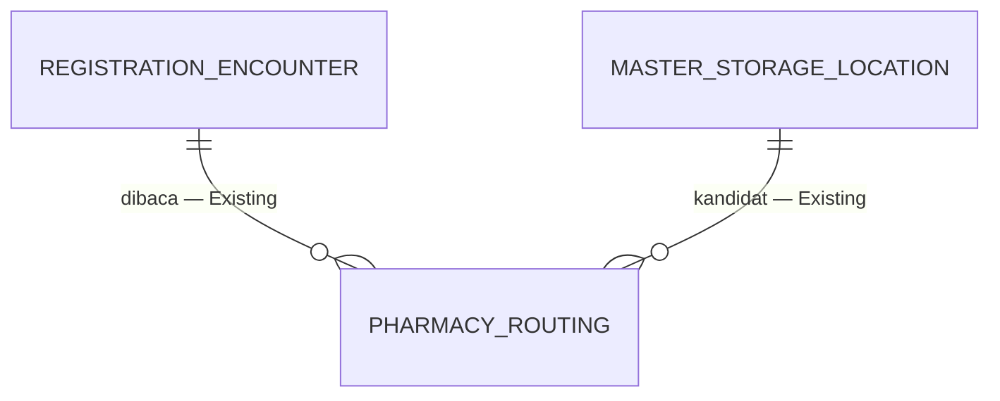

# Farmasi — Context ERD Routing Depo

```mermaid
erDiagram
    REGISTRATION_ENCOUNTER ||--o{ PHARMACY_ROUTING : "dibaca — Existing"
    MASTER_STORAGE_LOCATION ||--o{ PHARMACY_ROUTING : "kandidat — Existing"
```

`PHARMACY_ROUTING` adalah proses/adapter, bukan tabel. Registration tetap memiliki encounter dan Master Data tetap memiliki lokasi.

