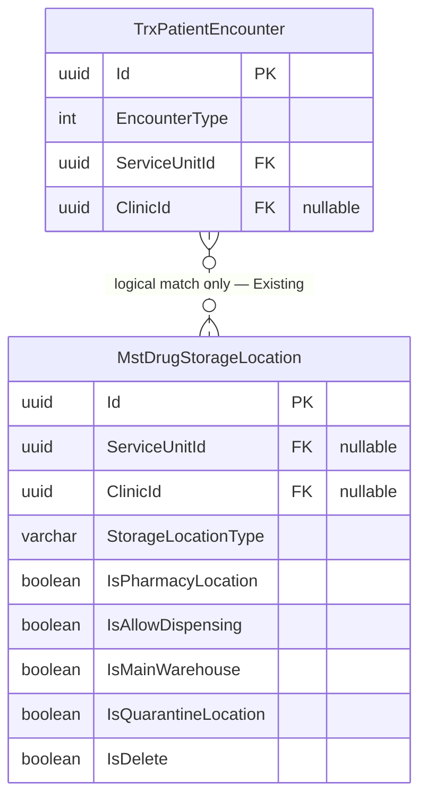

# Farmasi — ERD Routing Depo

| Entity | Status | Owner | Catatan |
| --- | --- | --- | --- |
| `TrxPatientEncounter` | Sudah ada | Registration Management | Direferensikan, tidak disalin |
| `MstDrugStorageLocation` | Sudah ada | Health Services Master Data | Direferensikan, tidak diubah |

Relasi adalah pencocokan logis, bukan foreign key baru.

