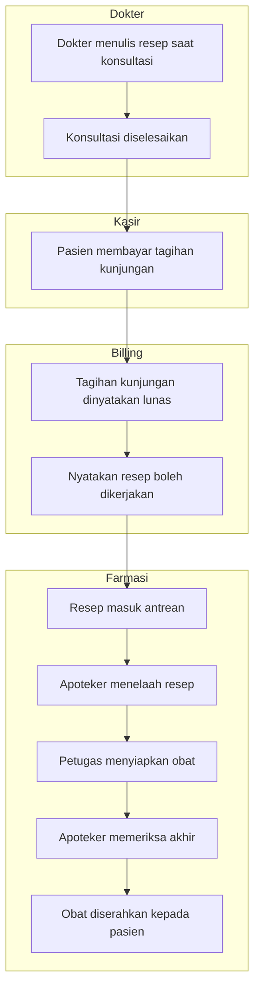

# Farmasi — Alur Utama Resep Rawat Jalan

Alur pokok ujung ke ujung, **jalur normal saja**. Percabangan dan jalur pengecualian ada pada
berkas proses tersendiri di folder yang sama.

Berkas ini lahir 21 September 2026 bersama slice Financial Clearance, karena slice itulah yang
selama ini memutus alur pokok di tengah jalan.

## Keadaan sebelum slice ini

Alur di bawah **putus** pada langkah keempat. Sejak jalur lama ditutup 24 Agustus 2026, tidak
ada satu pun cara resep berpindah dari menunggu pembayaran ke antrean apoteker — sehingga
langkah lima sampai delapan tidak pernah tercapai untuk resep mana pun.

## Alur pokok

Perhatikan dua hal yang disengaja. Pertama, **Farmasi tidak pernah menilai sendiri** apakah
pasien sudah membayar — ia menunggu pernyataan Billing. Kedua, pernyataan itu datang setelah
seluruh tagihan kunjungan lunas, bukan setelah bagian obatnya saja terbayar.

## Tabel langkah

| Langkah | Pelaku | Masukan | Keluaran | Bila gagal |
| --- | --- | --- | --- | --- |
| Menulis resep | Dokter | Keputusan klinis | Resep tersimpan sebagai rancangan | Resep tidak terbentuk; konsultasi tidak dapat diselesaikan |
| Menyelesaikan konsultasi | Dokter | Resep rancangan | Resep final, menunggu pembayaran | Konsultasi diulang |
| Menerima pembayaran | Kasir | Uang atau kartu pasien | Pembayaran tercatat | Pembayaran diulang |
| Menyatakan resep boleh dikerjakan | Billing | Keadaan tagihan kunjungan | Pernyataan terkirim ke Farmasi | Resep tetap menunggu; petugas dapat memeriksa ulang keadaannya |
| Menelaah resep | Apoteker | Resep di antrean | Telaah selesai | Resep tetap di antrean |
| Menyiapkan obat | Petugas Farmasi | Hasil telaah | Obat disiapkan atau diracik | Penyiapan diulang; stok tidak berkurang sebelum penyerahan |
| Memeriksa akhir | Apoteker | Obat yang sudah disiapkan | Obat dinyatakan siap serah | Kembali ke penyiapan |
| Menyerahkan obat | Petugas Farmasi | Obat siap serah | Obat berpindah ke pasien, stok berkurang | Penyerahan diulang; riwayat penyerahan sebagian tetap tercatat |

## Yang tidak digambarkan di sini

| Hal | Letaknya |
| --- | --- |
| Penahanan resep saat tagihan berubah | `pelepasan-dan-penahanan-resep.md` |
| Sinkronisasi gagal dan pemulihannya | `pelepasan-dan-penahanan-resep.md` |
| Pemilihan Depo | Slice Routing Depo, lihat `contracts/PHA-DEPOT-ROUTING-v1.md` |
| Penyerahan bertahap, retur, obat tidak diambil | Slice tersendiri yang requirement-nya masih terbuka |

Trace `PHA-DEC-063`–`070`.
