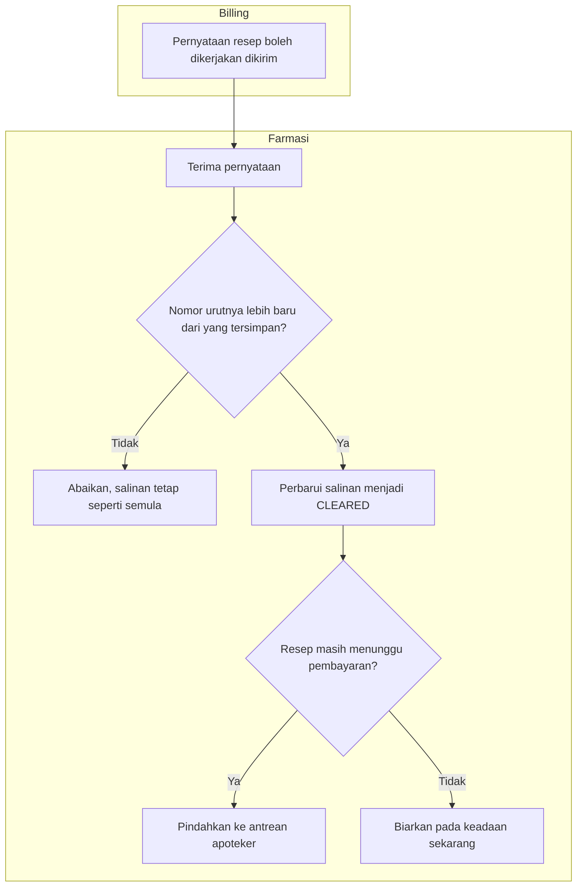
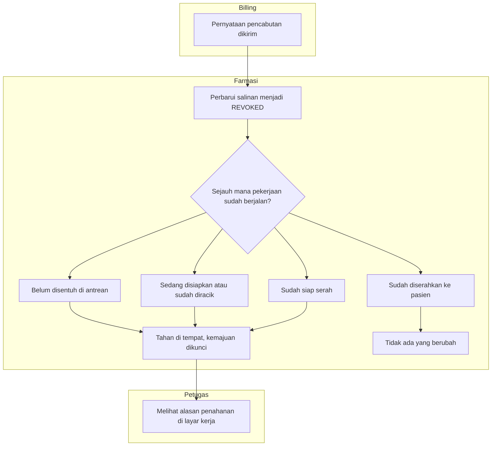
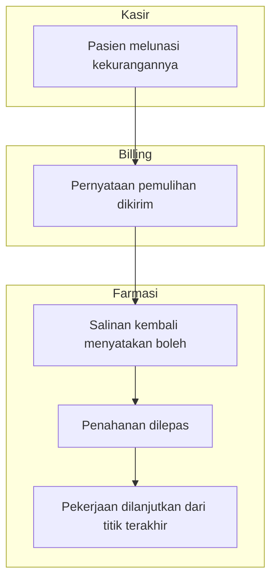
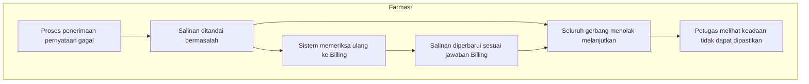

# Pelepasan dan Penahanan Resep

Proses yang menentukan kapan sebuah resep boleh dikerjakan Farmasi, dan apa yang terjadi ketika
izin itu dicabut di tengah pekerjaan. Memuat seluruh percabangan beserta jalur pengecualiannya.

Masukan `PHA-DEC-063`–`070`. Status **draft**, 21 September 2026.

## 1. Pelepasan — resep menjadi boleh dikerjakan

Cabang "abaikan" adalah keadaan **normal**, bukan kegagalan. Pernyataan dapat tiba tidak
berurutan, dan yang lebih tua memang harus diabaikan supaya resep yang sudah dicabut tidak
kembali terbaca boleh dikerjakan.

### Tabel langkah

| Langkah | Pelaku | Masukan | Keluaran | Bila gagal |
| --- | --- | --- | --- | --- |
| Menerima pernyataan | Sistem | Pernyataan dari Billing | Salinan diperbarui | Dicatat sebagai kegagalan beserta jumlah percobaan; pernyataan tetap tersimpan di Billing |
| Memeriksa urutan | Sistem | Nomor urut pernyataan | Diterima atau diabaikan | — |
| Memindahkan ke antrean | Sistem | Resep yang masih menunggu | Resep tampil di antrean apoteker | Salinan tetap benar; petugas dapat memeriksa ulang |

## 2. Penahanan — izin dicabut di tengah pekerjaan

Tiga cabang pertama berakhir sama: **ditahan di tempat, tidak ditarik mundur**. Obat yang sudah
diracik tetap tercatat sudah diracik dan tidak dikembalikan menjadi bahan — racikan memang tidak
dapat dibatalkan secara fisik.

Cabang keempat berbeda: obat yang sudah berpindah ke tangan pasien tidak dapat ditarik. Tidak
ada yang berubah di Farmasi, dan kewajiban finansialnya menjadi urusan Billing.

### Tabel langkah

| Langkah | Pelaku | Masukan | Keluaran | Bila gagal |
| --- | --- | --- | --- | --- |
| Memperbarui salinan | Sistem | Pernyataan pencabutan | Salinan menyatakan dicabut | Dicatat; salinan lama tetap berlaku sampai berhasil diperbarui |
| Mengunci kemajuan | Sistem | Keadaan pekerjaan saat itu | Pekerjaan berhenti di tempat | — |
| Melihat alasan | Petugas Farmasi | Layar kerja | Petugas tahu mengapa pekerjaannya terhenti | Petugas menghubungi kasir tanpa tahu sebabnya — inilah yang dicegah |

## 3. Pemulihan — izin kembali diberikan

Resep **tidak** mengulang antrean, telaah, maupun penyiapan yang sudah selesai. Apoteker yang
sudah meracik tidak meracik untuk kedua kalinya.

### Tabel langkah

| Langkah | Pelaku | Masukan | Keluaran | Bila gagal |
| --- | --- | --- | --- | --- |
| Melunasi kekurangan | Pasien di kasir | Pembayaran | Tagihan kembali lunas | Resep tetap tertahan |
| Melepas penahanan | Sistem | Pernyataan pemulihan | Pekerjaan dapat dilanjutkan | Petugas memeriksa ulang keadaan resep |

## 4. Jalur pengecualian — pernyataan tidak sampai

Keadaan "tidak dapat dipastikan" **tidak pernah** berubah menjadi izin. `PHA-DEC-067` menutup
seluruh jalur override — tidak ada tombol yang dapat ditekan petugas, Kepala Farmasi, maupun
Supervisor.

Ini keputusan yang disadari akibatnya: ketika sambungan ke Billing bermasalah, pasien yang sudah
membayar akan menunggu. Yang dipilih adalah menunda pelayanan, bukan mengambil risiko obat
keluar tanpa dasar.

### Tabel langkah

| Langkah | Pelaku | Masukan | Keluaran | Bila gagal |
| --- | --- | --- | --- | --- |
| Menandai bermasalah | Sistem | Kegagalan berulang | Salinan dinyatakan tidak dapat dipastikan | — |
| Memeriksa ulang | Sistem | Identitas resep | Keadaan terkini menurut Billing | Tetap tidak dapat dipastikan; pemeriksaan diulang |
| Menunggu | Petugas Farmasi | Keterangan di layar | Pekerjaan ditunda | Tidak ada jalan pintas yang tersedia |

## Yang sengaja tidak digambarkan

| Hal | Sebabnya |
| --- | --- |
| Jalur darurat klinis | Kebijakannya belum disahkan (`PHA-OQ-027`). Menggambarnya sekarang berarti menggambar sesuatu yang belum ada |
| Keputusan Billing menentukan sebab pencabutan | Itu proses milik Billing; lihat flowchart penerbitan pada blueprint `billing-kasir` |
| Penyerahan bertahap dan retur | Slice tersendiri yang requirement-nya masih terbuka |

Trace `PHA-DEC-063`, `PHA-DEC-067`, `PHA-DEC-068`, `PHA-DEC-069`.
