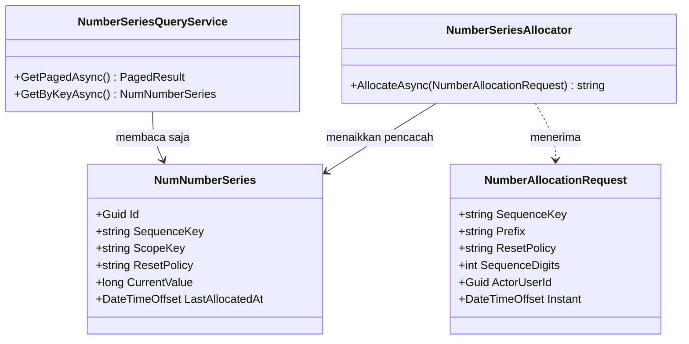

# Arsitektur Backend — Platform / Alokasi Nomor Bisnis

| Field | Nilai |
| --- | --- |
| Blueprint | `PLT-BP-001` revisi 1 |
| Slice | `PLT-SLICE-01` — mesin alokasi nomor untuk deret baru |
| Modul | Platform · Area usulan `Platform` · Module usulan `NumberSeriesManagement` |
| Contract version | `v1` — ✅ **`approved`** `2026-09-09` |
| Backend SHA | `f0d6855` cabang `sukmagp` |
| Keputusan dasar | `DEC-PLT-002`..`005`, `DEC-PLT-007`, `DEC-PLT-008`, `INV-PLT-001`..`004` — seluruhnya `approved` |
| Status | ✅ **`APPROVED`** `2026-09-09` oleh **`Sukma Giri Pratama`** (`sukmagp`). **Implementasi tetap `BLOCKED BY QBE-MOD-002`** sampai baris registry dicatat dan `ACTIVE` — lihat §A.3 dan `OQ-PLT-014` |

---

## A. Batas dan kepemilikan

### A.1 Masalah yang dipecahkan

Sekarang setiap modul menerbitkan nomornya sendiri. Audit menemukan **±120 method pembangkit
berbeda** pada **54 berkas**, 47 di antaranya bernama sama persis `GenerateCodeAsync`
(`FACT-PLT-008`). Panjang nomor tidak seragam — mayoritas 5 digit, tetapi `LegalEntityController`
memakai 3 sehingga deretnya habis setelah `999` (`FACT-PLT-009`). Kode fasilitas ditanam di dalam
awalan (`ENC-RSMMC-`), sehingga fasilitas kedua menuntut perubahan kode, bukan konfigurasi
(`FACT-PLT-010`).

Yang menahan akibat terburuk hanya index unik: tabrakan muncul sebagai kegagalan `500`, bukan
nomor kembar yang tersimpan (`FACT-PLT-005`, `FACT-PLT-007`). Artinya sistem sudah pernah gagal
menerbitkan nomor, dan cara gagalnya kasar.

### A.2 Tabel kepemilikan data

| Kelompok data | Modul pemilik | Dipakai modul ini | Dibuat ulang di sini |
| --- | --- | :---: | :---: |
| Pencacah deret nomor bersama | **Platform — baru** | Ya, dimiliki | **Ya, baru** |
| `BilNumberSeries` beserta empat deret Billing | Billing | **Tidak disentuh** | **Tidak** |
| Awalan, jumlah digit, kebijakan pengulangan per deret | **Modul konsumen masing-masing** (`DEC-PLT-005`) | Dibaca sebagai parameter | **Tidak** |
| Identitas pengguna pelaku | Administrator / Identity | Dibaca untuk audit | **Tidak** |

**Yang dijaga tabel ini.** Platform **tidak** memiliki awalan maupun format nomor modul mana pun.
Ia hanya memiliki pencacahnya. Membalik pembagian ini akan memaksa setiap penambahan deret baru
melewati approval platform — persis yang ditolak `DEC-PLT-005`.

### A.3 Entri registry yang wajib dicatat lebih dulu

**Isinya sudah diputuskan** pada amendment pass 9 September 2026 — `DEC-PLT-009` menetapkan Area
dan Module/pemilik, `DEC-PLT-010` menetapkan prefix. Yang **belum** terjadi adalah pencatatannya:
baris di bawah belum ada di `MODULE_OWNERSHIP_PREFIX_REGISTRY.md`, dan lifecycle-nya belum
dinaikkan `ACTIVE` (`OQ-PLT-014`).

Selama itu, `QBE-MOD-002` dan `QBE-MOD-003` tetap memblokir pembuatan model pertama. Baris
siap-salinnya:

| Area | Module/pemilik | Category | Prefix | Lifecycle |
|---|---|---|---|---|
| Platform | NumberSeriesManagement / Number Series | SHARED PLATFORM CAPABILITY | Num | PLANNED |

| Butir | Isi |
| --- | --- |
| Kepanjangan prefix | `Num` = *Number Series* |
| Kenapa `SHARED PLATFORM CAPABILITY` | Kategori itu sudah dipakai `Wfl` (Workflow) untuk kemampuan yang melayani lebih dari satu domain. Kemampuan ini melayani `HealthServices` dan `Corporate` sekaligus |
| Kenapa Area `Platform` baru | Empat Area yang ada — `Administrator`, `Corporate`, `HealthServices`, `SelfServices` — seluruhnya domain bisnis atau audiens. Menempatkan alokator nomor di salah satunya membuat modul lain tampak meminjam milik tetangga. Preseden `Wfl` yang duduk di `Corporate/HumanResource` justru contoh penempatan yang menyesatkan dan tidak ditiru |
| Alternatif yang ditolak | `Areas/Administrator/NumberSeriesManagement/` — ditolak karena `Administrator` berisi master dan pengaturan yang dikelola admin lewat layar, sedangkan alokator ini tidak dikelola siapa pun; ia hanya dipanggil kode |
| Lifecycle awal | `PLANNED` — memberi wewenang penamaan saja. `PLANNED` → `ACTIVE` adalah keputusan terpisah yang membuka wewenang implementasi |

---

## B. Keputusan arsitektur inti — pencacah yang bertahan

### B.1 Kenapa ini bagian tersulit

`DEC-PLT-008` menuntut nomor **hangus** ketika transaksi bisnisnya dibatalkan. Mesin yang ada
sekarang melakukan **kebalikannya** (`CONF-PLT-002`): kenaikan pencacah duduk di dalam transaksi
pemanggil, sehingga ketika transaksi itu batal, kenaikannya ikut batal dan nomor yang sama terbit
lagi pada percobaan berikutnya.

**Contoh berangka.** Petugas membuat order darah, sistem mengalokasikan `BDO-00000123`, lalu
validasi bisnis menolak order itu dan transaksi dibatalkan.

| Perilaku | Yang terjadi | Melanggar |
| --- | --- | --- |
| Mesin sekarang | Pencacah kembali ke `122`. Order berikutnya juga mendapat `BDO-00000123` | `DEC-PLT-008` |
| Yang dituntut | Pencacah tetap `123`. Order berikutnya mendapat `BDO-00000124`; nomor `123` **hangus selamanya** dan deret berlubang | — |

Lubang itu **bukan cacat data**. `INV-PLT-002` menyatakannya keadaan sah yang **tidak boleh**
"dirapikan" dengan mengisi celahnya. Merapikannya justru melanggar `INV-PLT-001`, karena nomor
yang sempat terlihat petugas dapat menempel pada catatan lain.

### B.2 Cara mewujudkannya

Pencacah dinaikkan pada **transaksi terpisah di koneksi tersendiri**, yang di-`commit` seketika
tanpa menunggu transaksi bisnis pemanggil.

```text
Transaksi bisnis pemanggil  ──────────────────────────────────────────────┐
                                                                          │
   ┌─ Transaksi alokasi (koneksi sendiri, umur sangat pendek) ─┐           │
   │  1. pg_advisory_xact_lock(hashtext(kunci deret))          │           │
   │  2. baca / sisipkan baris deret                           │           │
   │  3. CurrentValue += 1                                     │           │
   │  4. COMMIT  ◄── bertahan walau langkah di luar batal      │           │
   └───────────────────────────────────────────────────────────┘           │
                                                                          │
   5. pakai nomornya, lanjutkan pekerjaan bisnis                           │
   6. COMMIT atau ROLLBACK  ──────────────────────────────────────────────┘
                              bila ROLLBACK, nomor tetap hangus
```

| Aspek | Mesin sekarang | Rancangan ini |
| --- | --- | --- |
| Tempat kenaikan pencacah | Transaksi pemanggil | Transaksi sendiri, `commit` seketika |
| Nasib nomor saat rollback | Dipakai ulang | **Hangus** (`DEC-PLT-008`) |
| Lama kunci dipegang | Sepanjang transaksi bisnis | Hanya selama alokasi |
| Wajib berada di dalam transaksi? | **Ya** — dilempar `InvalidOperationException` bila tidak | **Tidak** — alokasi berdiri sendiri |

**Dampak sampingan yang menguntungkan, dan sebaiknya disadari.** Kunci `pg_advisory_xact_lock`
kini dipegang hanya selama alokasi, bukan sepanjang transaksi bisnis. Pada mesin sekarang, satu
transaksi invoice yang lambat menahan seluruh alokasi nomor invoice lain di belakangnya.
Rancangan ini menghapus penahanan itu tanpa diminta.

### B.3 Alternatif yang ditolak

| Alternatif | Kenapa ditolak |
| --- | --- |
| **PostgreSQL `SEQUENCE`** — `nextval` memang tidak pernah di-rollback, sehingga cocok dengan `DEC-PLT-008` | Kebijakan pengulangan harian/bulanan/tahunan menuntut satu sequence per periode, sehingga aplikasi harus menjalankan DDL saat berjalan. DDL di jalur permintaan rapuh, sulit dimundurkan, dan tidak dapat di-seed. Deret yang sudah ada juga tidak dapat dipindahkan tanpa menebak nilai awalnya |
| **Menaikkan pencacah lewat `UPDATE ... RETURNING` tanpa kunci** | Menghilangkan advisory lock berarti mengandalkan tingkat isolasi. Pada `READ COMMITTED` bawaan, dua transaksi dapat membaca nilai yang sama. Pola kunci yang sudah terbukti di **23 berkas** repository ini tidak dibuang tanpa sebab |
| **Menyimpan pencacah di memori aplikasi** | Dilarang `QBE-CODE-003` — counter statis/lokal dan lock process-local tidak sah sebagai satu-satunya alokator. Juga pecah begitu aplikasi berjalan lebih dari satu instance |
| **Membiarkan pemanggil menentukan nomor** | Melanggar `QBE-CODE-002` |

### B.4 Nasib empat deret Billing yang sudah produksi

`NOTE-PLT-001` meminta dampaknya dinilai saat desain. Hasil penilaiannya:

**Keempat deret Billing — invoice, deposit, shift kasir, kwitansi — TIDAK dipindahkan pada slice
ini.** Mereka tetap dilayani `BillingNumberSeriesService` beserta tabel `BilNumberSeries`
sebagaimana adanya.

| Alasan | Keputusan yang mendasari |
| --- | --- |
| Alokator baru dipakai **kode baru** sejak hari pertama; titik lama pindah bertahap menurut risiko | `DEC-PLT-003` |
| Satu deret hanya boleh dilayani **satu** mekanisme pada satu waktu — tidak pernah keduanya | `INV-PLT-003` |
| Keempatnya deret paling ramai dan sudah jalan produksi; memindahkannya bersamaan dengan kelahiran mesin baru menumpuk dua risiko pada satu rilis | `DEC-PLT-003` urutan menurut risiko |

Konsekuensi yang jujur: **selama masa peralihan, dua mekanisme hidup berdampingan** — yang lama
melayani empat deret Billing, yang baru melayani deret baru. Itu bukan pelanggaran `INV-PLT-003`,
karena invariant itu melarang satu **deret** dilayani dua mekanisme, bukan melarang dua mekanisme
ada di satu sistem.

Pemindahan keempatnya beserta perubahan perilaku hangus/pakai-ulang adalah lingkup
**`PLT-SLICE-02`**, dan menuntut `DEC-PLT-006` dijawab lebih dulu.

**Kenapa ini tetap "ekstraksi" seperti dituntut `DEC-PLT-007`, bukan pembangunan dari nol.**
Algoritmanya — kunci penasihat, kunci deret, kunci scope, kebijakan pengulangan, perakitan
`prefix-scope-urutan` — diambil utuh dari `AllocateNumberAsync` yang sudah terbukti, bukan
dirancang ulang. Yang berubah hanya satu: tempat pencacahnya di-`commit`. Konfigurasi khusus
Billing tidak ikut berpindah, persis seperti bunyi `DEC-PLT-007`.

---

## C. Class diagram



Modul konsumen **tidak** mewarisi apa pun dari diagram ini. Ia memanggil
`NumberSeriesAllocator.AllocateAsync` dengan parameter miliknya sendiri.

---

## D. Penjelasan setiap class

### D.1 Model

**`NumNumberSeries`**

| Aspek | Penjelasan |
| --- | --- |
| Status | `Baru` |
| Lokasi file | `Areas/Platform/NumberSeriesManagement/Models/NumNumberSeries.cs` |
| Kategori | Operasional — pencacah, bukan master |
| Tanggung jawab | Menyimpan nilai terakhir satu deret pada satu scope. Satu baris = satu pasangan `SequenceKey` + `ScopeKey` |
| Field penting | `SequenceKey`, `ScopeKey`, `ResetPolicy`, `CurrentValue`, `LastAllocatedAt` |
| Catatan desain | **Baris lahir sendiri** saat alokasi pertama; tidak ada layar yang membuatnya. **Tidak ada** endpoint yang menurunkan `CurrentValue` — menurunkannya melanggar `INV-PLT-001` |
| Ekuivalen lama | `BilNumberSeries` — **tidak digantikan**, tetap milik Billing sampai `PLT-SLICE-02` |

### D.2 Service

| Service | Status | Lokasi | Fungsi utama | Buka transaksi DB |
| --- | --- | --- | --- | --- |
| `NumberSeriesAllocator` | `Baru` | `Areas/Platform/NumberSeriesManagement/Services/NumberSeriesAllocator.cs` | Mengalokasikan satu nomor secara atomik dan **durabel**. Membuka koneksi serta transaksinya **sendiri** | **Ya — miliknya sendiri, terpisah dari pemanggil** |
| `NumberSeriesQueryService` | `Baru` | `.../Services/NumberSeriesQueryService.cs` | Membaca keadaan deret untuk layar pemantauan. **Nol kemampuan menulis** | Tidak |
| `BillingNumberSeriesService` | `Sudah ada` | `Areas/HealthServices/BillingManagement/Billing/Services/` | **Tidak disentuh slice ini** | Ya (perilaku lama) |

### D.3 Controller

| Controller | Status | Lokasi | Service dipakai | Atribut akses |
| --- | --- | --- | --- | --- |
| `NumberSeriesController` | `Baru` | `Areas/Platform/NumberSeriesManagement/Controllers/NumberSeriesController.cs` | `NumberSeriesQueryService` | `[AccessController(ControllerName = "NumberSeries")]`, `[AccessPermission("NumberSeries", "Read")]` |

Controller ini **hanya membaca**. Tidak ada `POST`, `PUT`, `PATCH`, maupun `DELETE` — nomor
dialokasikan kode, bukan orang, dan pencacah tidak pernah disunting tangan.

### D.4 DTO

| Nama | Jenis | Field |
| --- | --- | --- |
| `NumberAllocationRequest` | Parameter internal (bukan DTO HTTP) | `SequenceKey`, `Prefix`, `ResetPolicy`, `SequenceDigits`, `ActorUserId`, `Instant` |
| `NumberSeriesResponse` | Response | `Id`, `SequenceKey`, `ScopeKey`, `ResetPolicy`, `CurrentValue`, `LastAllocatedAt` |
| `NumberSeriesPagedQuery` | PagedQuery | `search`, `sequenceKey`, `resetPolicy`, `sortBy`, `sortDirection`, `pageNumber`, `pageSize` |
| `NumberSeriesSummaryResponse` | Response | `TotalSeries`, `TotalScope`, `LastAllocatedAt` |
| `NumberSeriesFilterMetadataResponse` | Response | Konfigurasi penyaring, mengikuti pola master data |

### D.5 Enum dan konstanta

| Nama | Nilai | Lokasi |
| --- | --- | --- |
| `NumberSeriesResetPolicies` | `NEVER`, `YEARLY`, `MONTHLY`, `DAILY` | `.../Constants/NumberSeriesResetPolicies.cs` |

Nilai diambil apa adanya dari `BillingNumberResetPolicies` supaya deret Billing dapat dipindahkan
di `PLT-SLICE-02` tanpa menerjemahkan nilai apa pun. **`DEC-PLT-004` menetapkan deret baru memakai
`NEVER`**; ketiga nilai lain ada semata untuk menampung deret lama saat migrasi.

### D.6 Configuration

| Nama file | Lokasi | Yang diatur |
| --- | --- | --- |
| `NumNumberSeriesConfiguration.cs` | `Repositories/Configurations/Platform/NumberSeriesManagement/` | Tabel `NumNumberSeries`; index **unik** `(SequenceKey, ScopeKey)`; check constraint `CurrentValue > 0` dan `ResetPolicy IN (...)`; `DeleteBehavior` tidak berlaku — nol relasi keluar |

---

## E. Arsitektur folder

```text
Areas/Platform/                                     # BARU — Area baru
└── NumberSeriesManagement/                         # BARU
    ├── Constants/
    │   └── NumberSeriesResetPolicies.cs            # Baru
    ├── Controllers/
    │   └── NumberSeriesController.cs               # Baru — hanya baca
    ├── DTOs/
    │   └── NumberSeriesDtos.cs                     # Baru
    ├── Models/
    │   └── NumNumberSeries.cs                      # Baru
    └── Services/
        ├── NumberSeriesAllocator.cs                # Baru — inti slice ini
        └── NumberSeriesQueryService.cs             # Baru

Repositories/Configurations/Platform/               # BARU
└── NumberSeriesManagement/
    └── NumNumberSeriesConfiguration.cs             # Baru
```

**Utang teknis yang tidak ditiru.** `BillingNumberSeriesService` menaruh
`BilNumberSeriesConfiguration.cs` di dalam `Areas/.../Billing/Configurations/`, padahal aturan
struktur menempatkan configuration di luar `Areas/`. Penyimpangan itu dicatat, **tidak diikuti**,
dan **tidak dirapikan** oleh slice ini.

---

## F. Status model dan dampak migration

| Tabel | Status | Kolom yang berubah | Dampak |
| --- | --- | --- | --- |
| `NumNumberSeries` | **`Baru`** | Seluruh kolom baru | Satu `CreateTable` + satu index unik + dua check constraint |
| `BilNumberSeries` | `Sudah ada` | **Nol** | Tidak disentuh |

### F.1 Rencana migration

| Urutan | Migration | Tanpa downtime | Cara mundur |
| ---: | --- | :---: | --- |
| 1 | `AddNumNumberSeries` | **Ya** | `DropTable`. Aman selama belum ada deret baru yang terbit; setelah ada, pemunduran berarti kehilangan pencacah dan **dilarang** karena melanggar `INV-PLT-001` |

Migration ini **aditif murni** — nol tabel existing disentuh, nol kolom diubah, nol data dipindah.
Ia dapat dijalankan pada database yang sedang melayani tanpa mengunci tabel mana pun.

**Peringatan pemunduran.** Begitu satu nomor terbit dari tabel ini, `DropTable` menghapus jejak
nomor tertinggi yang pernah dipakai. Menjalankan ulang migration setelah itu akan memulai
pencacah dari nol dan menerbitkan nomor yang sudah menempel pada catatan lain. Pemunduran karena
itu hanya sah **sebelum** alokasi pertama.

### F.2 Rencana data master awal

**Nol baris di-seed, dan itu disengaja.** Baris deret lahir sendiri pada alokasi pertama setiap
pasangan `SequenceKey` + `ScopeKey`. Menyemai baris dengan `CurrentValue = 0` justru melanggar
check constraint `CurrentValue > 0`, dan menyemainya dengan nilai tebakan berisiko menerbitkan
nomor yang sudah dipakai.

---

## G. Yang sengaja tidak dibuat

| Yang dipertimbangkan | Kenapa ditolak |
| --- | --- |
| Tabel pendaftaran deret (`NumSeriesDefinition`) berisi awalan dan format tiap modul | `DEC-PLT-005` menaruh awalan dan format di tangan modul. Tabel ini akan memindahkannya ke platform dan memaksa tiap deret baru melewati approval platform |
| Endpoint menyetel ulang pencacah | Melanggar `INV-PLT-001` dan `INV-PLT-002` secara langsung. Deret yang berlubang **memang** keadaan sah |
| Endpoint mengalokasikan nomor lewat HTTP | Alokasi adalah panggilan dalam proses dari service pemilik catatan. Memaparkannya lewat HTTP membuat nomor dapat diterbitkan tanpa catatan yang menempel — persis kebocoran yang dilarang `INV-PLT-001` |
| Layar admin membuat atau menghapus deret | Deret lahir dari kode yang memakainya, bukan dari layar |
| Memindahkan empat deret Billing pada slice ini | `DEC-PLT-003` dan `INV-PLT-003` — lihat §B.4. Lingkup `PLT-SLICE-02` |
| Kode fasilitas di dalam awalan | `OQ-PLT-006` masih terbuka; mengarangnya berarti menetapkan kebijakan yang belum diputuskan |
| Peringatan deret hampir habis | `OQ-PLT-005` masih terbuka. Layar pemantauan tetap menampilkan `CurrentValue` supaya keadaannya terbaca, tanpa menetapkan ambang apa pun |

---

## H. Wiring dependency

| Perubahan | Isi |
| --- | --- |
| `Program.cs` | `builder.Services.AddScoped<NumberSeriesAllocator>();` dan `AddScoped<NumberSeriesQueryService>();` |
| `Program.cs` | **`builder.Services.AddDbContextFactory<ApplicationDbContext>(...)`** — dibutuhkan `NumberSeriesAllocator` untuk membuka koneksi tersendiri. Perlu diperiksa apakah pendaftaran `AddDbContext` yang sudah ada perlu disesuaikan agar keduanya hidup berdampingan |
| `ApplicationDbContext` | Satu `DbSet<NumNumberSeries>` pada region baru `PLATFORM` |

**Risiko yang disadari.** `AddDbContextFactory` berdampingan dengan `AddDbContext` adalah satu-satunya
sentuhan slice ini pada komposisi aplikasi yang sudah berjalan. Ia wajib diverifikasi saat
implementasi, bukan dianggap pasti aman.

---

## I. Test strategy

| Lapisan | Yang dibuktikan |
| --- | --- |
| Unit — `UnitTests.InMemory` | Perakitan format nomor, validasi parameter, pemilihan scope key per kebijakan pengulangan |
| Integrasi — `IntegrationTests.Postgres` | **Wajib.** Durabilitas pencacah saat transaksi pemanggil batal, dan ketiadaan nomor kembar saat alokasi bersamaan. Keduanya **tidak dapat** dibuktikan provider InMemory karena InMemory tidak punya transaksi sungguhan maupun advisory lock |
| Relasional — `UnitTests.Sqlite` | Bentuk tabel, index unik, check constraint |

**Ini slice pertama yang pengujian intinya menuntut PostgreSQL sungguhan.** Membuktikan
`DEC-PLT-008` tanpa database sungguhan tidak mungkin: yang diuji justru apa yang terjadi pada
`COMMIT` dan `ROLLBACK`.
