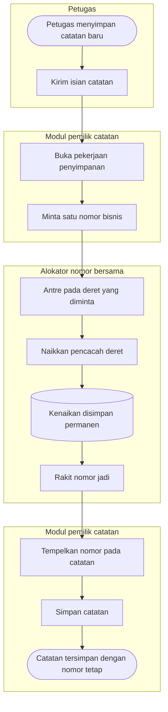

# Alur Utama — Alokasi Nomor Bisnis

Alur pokok ujung ke ujung, **jalur normal saja**. Jalur pengecualiannya ada di
[alokasi-nomor.md](alokasi-nomor.md).

## Tabel langkah

| Langkah | Pelaku | Masukan | Keluaran | Bila gagal |
| --- | --- | --- | --- | --- |
| Kirim isian catatan | Petugas | Isian layar | Permintaan simpan | Petugas memperbaiki isian |
| Buka pekerjaan penyimpanan | Modul pemilik | Permintaan simpan | Pekerjaan berjalan | Ditolak sebelum nomor diminta; nol nomor terpakai |
| Minta satu nomor | Modul pemilik | Penanda deret, awalan, panjang, kebijakan pengulangan | Permintaan alokasi | Ditolak bila parameternya tidak sah |
| Antre pada deret | Alokator | Penanda deret + periode | Giliran didapat | Menunggu; permintaan lain di deret berbeda tidak ikut menunggu |
| Naikkan pencacah | Alokator | Nilai terakhir | Nilai berikutnya | Dikembalikan sebagai kegagalan; nol nomor terbit |
| Simpan kenaikan permanen | Alokator | Nilai berikutnya | Tersimpan | — |
| Rakit nomor jadi | Alokator | Awalan, periode, nilai | Nomor jadi | — |
| Tempelkan dan simpan catatan | Modul pemilik | Nomor jadi | Catatan bernomor | **Nomornya hangus** — lihat jalur pengecualian |

## Yang perlu dipahami dari alur ini

**Nomor terbit lebih dulu, catatannya menyusul.** Urutan itu disengaja. Kebalikannya —
menyimpan catatan lalu menomorinya — membuat ada saat ketika catatan hidup tanpa nomor, dan
petugas dapat melihatnya dalam keadaan itu.

**Kenaikan pencacah disimpan permanen sebelum catatan tersimpan.** Inilah sebabnya nomor bisa
hangus bila penyimpanan catatan kemudian gagal. Perilaku itu dipilih sadar: lebih baik ada nomor
yang tidak terpakai daripada ada satu nomor yang menempel pada dua catatan.
