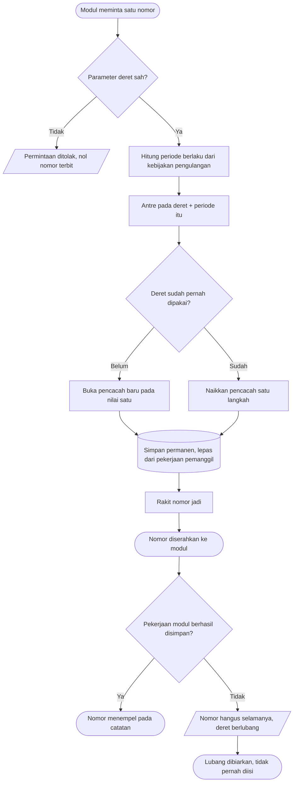

# Proses: Alokasi Nomor — dengan jalur pengecualian

## Tabel langkah

| Langkah | Pelaku | Masukan | Keluaran | Bila gagal |
| --- | --- | --- | --- | --- |
| Periksa parameter deret | Alokator | Penanda deret, awalan, panjang, kebijakan | Parameter sah | Ditolak; modul memperbaiki konfigurasinya |
| Hitung periode berlaku | Alokator | Kebijakan pengulangan + waktu | Penanda periode | — |
| Antre pada deret + periode | Alokator | Penanda deret + periode | Giliran didapat | Menunggu giliran |
| Buka atau naikkan pencacah | Alokator | Nilai terakhir | Nilai berikutnya | Dikembalikan sebagai kegagalan |
| Simpan permanen | Alokator | Nilai berikutnya | Tersimpan lepas dari pemanggil | Dikembalikan sebagai kegagalan; nol nomor terbit |
| Serahkan nomor | Alokator | Nomor jadi | Nomor di tangan modul | — |
| Simpan catatan | Modul pemilik | Nomor + isi catatan | Catatan bernomor | **Nomor hangus**; deret berlubang dan lubang itu dibiarkan |

## Jalur pengecualian yang paling penting

**Pekerjaan modul gagal setelah nomor terbit.** Inilah jalur yang paling sering terjadi dan paling
sering disalahpahami.

> Petugas membuat order darah. Alokator menerbitkan nomor urut ke-123. Validasi bisnis kemudian
> menolak order itu, dan seluruh pekerjaan penyimpanan dibatalkan. Order tidak jadi tersimpan.
>
> **Nomor ke-123 tetap hangus.** Order berikutnya mendapat nomor ke-124, bukan ke-123. Deret
> karena itu berlubang di posisi 123, dan lubang itu **tidak pernah diisi**.

Kenapa demikian: pencacah disimpan permanen pada saat alokasi, terlepas dari nasib pekerjaan
pemanggil. Bila sebaliknya — pencacah ikut dibatalkan — maka nomor ke-123 akan terbit lagi,
padahal petugas mungkin sudah sempat melihatnya, mencatatnya di kertas, atau menyebutkannya
lewat telepon.

**Lubang dalam deret adalah keadaan sah.** Ia bukan cacat data, dan **tidak boleh** dirapikan
dengan cara mengisi celahnya. Merapikannya justru menghasilkan nomor kembar.

**Dua permintaan bersamaan pada deret yang sama.** Keduanya diantrekan, bukan ditolak. Yang
kedua menunggu yang pertama selesai, lalu mendapat nomor berikutnya. Permintaan pada deret
**berbeda** tidak ikut menunggu.

**Deret dipakai pertama kali.** Pencacahnya dibuka pada nilai satu. Tidak ada penyemaian awal,
dan tidak ada layar yang perlu membuat deretnya lebih dulu.
