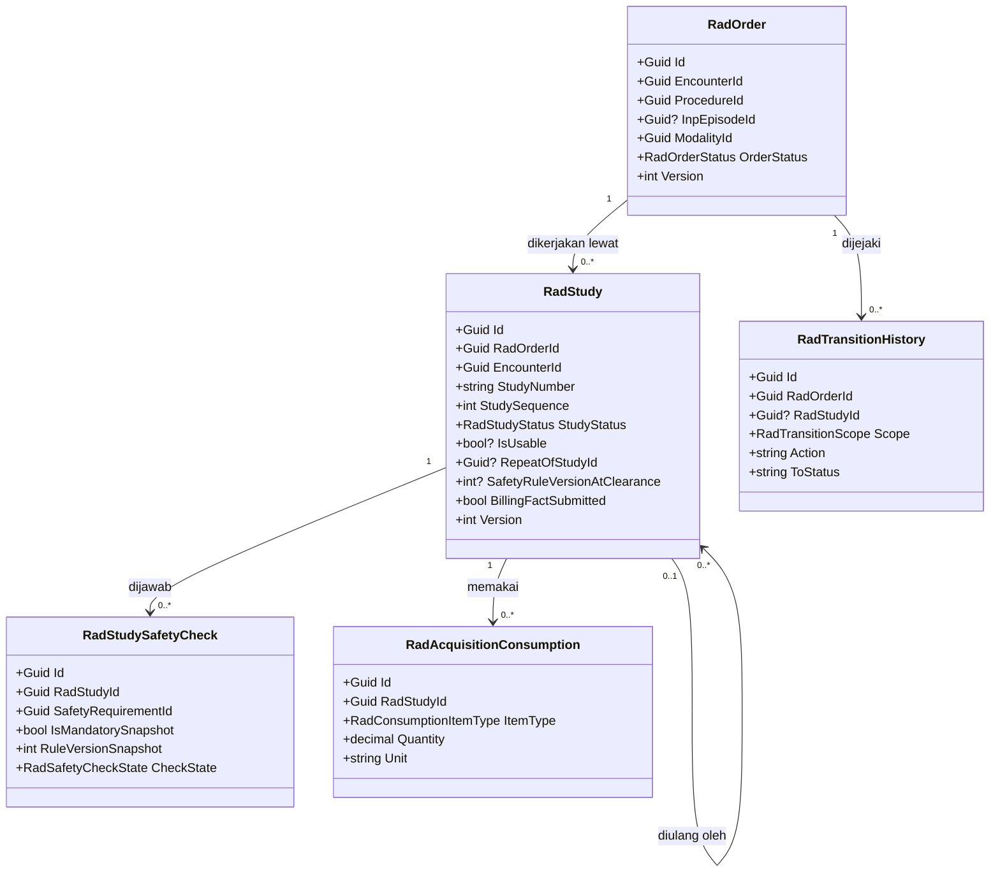
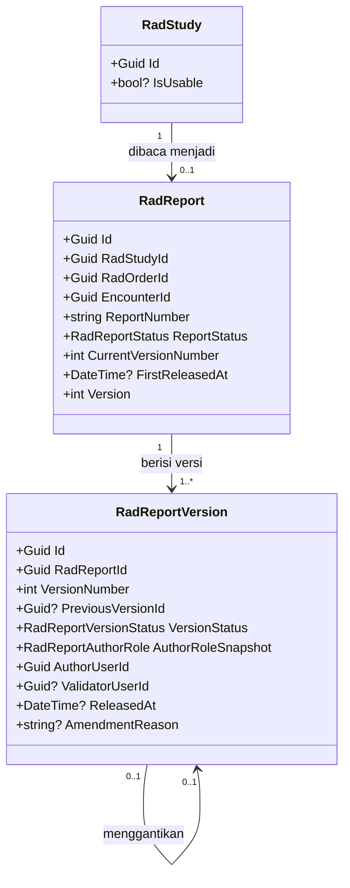
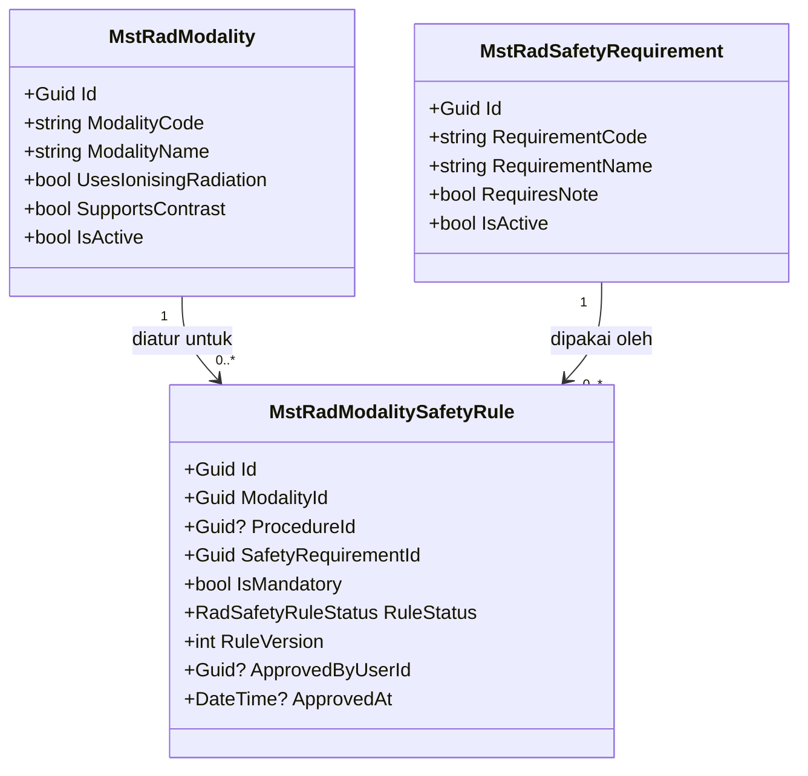

# Radiologi — Backend Architecture

| Field | Value |
|---|---|
| Contract version | `RAD-ARCH-BE-001` |
| Revision | `2` |
| Status | `draft` |
| Blueprint ID | `RAD-BP-001` |
| Backend SHA | `64da911` |
| Frontend SHA | `f66ed1885` |
| Input revision | Decisions rev 8; Capability map rev 1; `RAD-RCG-001-r2`; `RAD-DA-001-r2` |
| Kesiapan arsitektur domain | `DOMAIN_ARCHITECTURE_PARTIAL` |
| Slice yang dirancang | `S1`, `S2`, `S3`, `S4`, `S6`, `S7`, `S8`, `S9`, `S10`, **`S12`**, `S13`, `S14` |
| Slice yang **tidak** dirancang | `S5`, `S11` |
| Perubahan revision 2 | `S12` daftar kerja masuk; `RadOrder` menjadi `Diperbarui` karena penanda cito |
| Owner | Yoga Aji Pratama |
| `approved_by` / `approved_at` | Belum — approval adalah tindakan manusia |

> **Batas dokumen ini.** Dokumen ini merancang bentuk teknis backend. Ia **bukan** izin menulis
> kode, **bukan** izin membuat migration, dan **bukan** izin menjalankan database.
>
> Makna bisnis dan kepemilikan konsep diambil dari `03-domain-architecture.md` dan **tidak**
> dirancang ulang di sini.

---

## 1. Bounded Context dan Ownership

| Context | Aggregate root | Invariant yang dijaga | Batas transaksi |
|---|---|---|---|
| `BC-RAD-01` Ordering | `RadOrder` | Perpindahan status hanya lewat jalur sah; tidak ada kolom finansial | Satu pesanan per transaksi |
| `BC-RAD-02` Acquisition | `RadStudy` | Acquisition ditolak sebelum identitas dan keselamatan tuntas; pengulangan tidak menimpa asal | Study beserta jawaban keselamatan dan konsumsinya |
| `BC-RAD-03` Reporting | `RadReport` | Versi rilis tidak pernah berubah; pengesah wajib radiolog | Report beserta seluruh versinya |
| `BC-RAD-04` Safety Policy | `MstRadModalitySafetyRule` | Hanya aturan `Active` yang dinilai; pengesahan menaikkan versi | Satu aturan per transaksi |

**Rollback.** Seluruh perubahan status memakai satu `SaveChanges` dengan token konkurensi.
Bila token tidak cocok, seluruh perubahan dibatalkan dan pemanggil menerima `409`.

---

## 2. Tabel Kepemilikan Data

Ini pertahanan paling langsung terhadap duplikasi entity.

| Kelompok data | Modul pemilik | Dipakai modul ini | Dibuat ulang di modul ini |
|---|---|:---:|---|
| Pasien | Patient Management | Ya | **Tidak** |
| Kunjungan (*encounter*) | Registration Management | Ya | **Tidak** |
| Perawatan rawat inap | InPatient Management | Ya | **Tidak** |
| Prosedur dan tarif | Health Services MasterData | Ya | **Tidak** |
| Dokter dan petugas | Identity / Human Resource | Ya | **Tidak** |
| Dokumen rekam medis | Clinical Management | Ya | **Tidak** — hanya slot berkas unggahan luar |
| Tagihan, tarif, pembayaran | Billing Management | Ya, sebagai penerima fakta | **Tidak** |
| Pesanan radiologi | **Radiology Management** | Ya | Ya — memang miliknya |
| Study dan keselamatan | **Radiology Management** | Ya | Ya — memang miliknya |
| Hasil bacaan | **Radiology Management** | Ya | Ya — **baru** |
| Alat dan aturan keselamatan | **Radiology Management** | Ya | Ya — memang miliknya |
| Stok kontras, film, BHP | Pharmacy / Inventory | **Tidak** | **Tidak** — Radiologi hanya mencatat pemakaian |

---

## 3. Class Diagram

Dipecah per bounded context agar satu diagram muat dibaca dalam satu layar.

### 3.1 Ordering dan Acquisition — `BC-RAD-01` + `BC-RAD-02`



### 3.2 Reporting — `BC-RAD-03`



### 3.3 Safety Policy — `BC-RAD-04`



---

## 4. Penjelasan Setiap Class

### 4.1 `RadOrder`

| Aspek | Penjelasan |
|---|---|
| **Status** | **`Diperbarui`** |
| **Lokasi file** | `Areas/HealthServices/RadiologyManagement/Models/RadOrder.cs` |
| Kategori | Transaksi Radiologi |
| Tanggung jawab utama | Menyimpan satu permintaan pemeriksaan dari dokter, beserta perjalanan statusnya sampai ditutup |
| Kolom yang **ditambahkan** | `IsUrgent` `bool NOT NULL DEFAULT false`, `UrgentMarkedByUserId` `uuid NULL`, `UrgentMarkedAt` `timestamp NULL` |
| Field penting yang sudah ada | `EncounterId`, `ProcedureId`, `InpEpisodeId`, `ModalityId`, `OrderStatus`, `StatusBeforeHold`, `ClosureReason`, `Version` |
| Relasi | Menunjuk `TrxPatientEncounter`, `MstProcedure`, `MstRadModality`; punya banyak `RadStudy` |
| Pemakaian dalam alur | Dibuat dokter saat memesan; disentuh petugas radiologi saat menerima, menjadwalkan, dan menutup |
| Catatan desain | **Jangan** menambahkan kolom finansial apa pun. Invariant ditegakkan dengan meniadakan kolomnya. Penanda cito melekat di sini, **bukan** di study, karena cito adalah keputusan dokter pengirim (`RAD-DEC-013`) |
| Ekuivalen model lama | — |

### 4.2 `RadStudy`

| Aspek | Penjelasan |
|---|---|
| **Status** | `Sudah ada` |
| **Lokasi file** | `Areas/HealthServices/RadiologyManagement/Models/RadStudy.cs` |
| Kategori | Transaksi Radiologi |
| Tanggung jawab utama | Menyimpan satu tindakan pengambilan citra yang benar-benar dikerjakan, beserta hasil penilaian mutunya |
| Field penting | `RadOrderId`, `StudyNumber`, `StudySequence`, `StudyStatus`, `IsUsable`, `RepeatOfStudyId`, `RepeatCause`, `SafetyRuleVersionAtClearance`, `BillingFactSubmitted`, `Version` |
| Relasi | Milik `RadOrder`; punya banyak `RadStudySafetyCheck` dan `RadAcquisitionConsumption`; dapat menunjuk study yang diulangnya |
| Pemakaian dalam alur | Aktif sejak radiografer merencanakan sampai mutu citra diputuskan |
| Catatan desain | `IsUsable` sengaja `bool?`. `null` berarti belum dinilai, dan belum dinilai **bukan** berarti tidak layak. Pengulangan **tidak pernah** menimpa study asal |
| Ekuivalen model lama | — |

### 4.3 `RadStudySafetyCheck`

| Aspek | Penjelasan |
|---|---|
| **Status** | `Sudah ada` |
| **Lokasi file** | `Areas/HealthServices/RadiologyManagement/Models/RadStudySafetyCheck.cs` |
| Kategori | Transaksi Radiologi |
| Tanggung jawab utama | Menyimpan jawaban satu butir keselamatan pada satu study, beserta salinan aturan yang berlaku saat itu |
| Field penting | `RadStudyId`, `SafetyRequirementId`, `RequirementCodeSnapshot`, `IsMandatorySnapshot`, `RuleVersionSnapshot`, `CheckState`, `Note` |
| Relasi | Milik `RadStudy`; menunjuk `MstRadSafetyRequirement` |
| Pemakaian dalam alur | Diisi radiografer sebelum pemeriksaan dimulai |
| Catatan desain | Kolom bersufiks `Snapshot` **wajib** diisi saat baris dibuat. Tanpa salinan itu, perubahan aturan di kemudian hari akan mengubah arti jawaban lama |
| Ekuivalen model lama | — |

### 4.4 `RadAcquisitionConsumption`

| Aspek | Penjelasan |
|---|---|
| **Status** | `Sudah ada` |
| **Lokasi file** | `Areas/HealthServices/RadiologyManagement/Models/RadAcquisitionConsumption.cs` |
| Kategori | Transaksi Radiologi |
| Tanggung jawab utama | Mencatat bahan yang benar-benar terpakai pada satu pemeriksaan, sebagai jumlah |
| Field penting | `RadStudyId`, `ItemType`, `ItemCode`, `ItemName`, `Quantity`, `Unit`, `ConsumedDespiteFailure` |
| Relasi | Milik `RadStudy` |
| Pemakaian dalam alur | Diisi radiografer setelah pemeriksaan, termasuk ketika pemeriksaan gagal |
| Catatan desain | **Jangan** menambahkan kolom harga atau nominal. Penilaian finansialnya milik Billing |
| Ekuivalen model lama | — |

### 4.5 `RadTransitionHistory`

| Aspek | Penjelasan |
|---|---|
| **Status** | `Sudah ada` |
| **Lokasi file** | `Areas/HealthServices/RadiologyManagement/Models/RadTransitionHistory.cs` |
| Kategori | Jejak audit |
| Tanggung jawab utama | Merekam setiap perpindahan status pesanan maupun study |
| Field penting | `RadOrderId`, `RadStudyId`, `Scope`, `Action`, `FromStatus`, `ToStatus`, `ReasonCode`, `ReasonNote`, `ActorUserId`, `OccurredAt`, `CorrelationId` |
| Relasi | Menunjuk `RadOrder` dan opsional `RadStudy` |
| Pemakaian dalam alur | Ditulis otomatis pada setiap perpindahan status |
| Catatan desain | Hanya bertambah. **Jangan** menyediakan endpoint ubah atau hapus |
| Ekuivalen model lama | — |

### 4.6 `MstRadModality`

| Aspek | Penjelasan |
|---|---|
| **Status** | `Sudah ada` |
| **Lokasi file** | `Areas/HealthServices/RadiologyManagement/Models/MstRadModality.cs` |
| Kategori | Data induk Radiologi |
| Tanggung jawab utama | Daftar alat pencitraan milik rumah sakit |
| Field penting | `ModalityCode`, `ModalityName`, `UsesIonisingRadiation`, `SupportsContrast`, `IsActive`, `SortOrder` |
| Relasi | Punya banyak `MstRadModalitySafetyRule` |
| Pemakaian dalam alur | Dipilih dokter saat memesan; menentukan aturan keselamatan mana yang berlaku |
| Catatan desain | `UsesIonisingRadiation` dan `SupportsContrast` adalah penanda sifat alat, **bukan** aturan keselamatan. Aturannya tetap di `MstRadModalitySafetyRule`. `SortOrder` adalah pola lama yang sudah terlanjur ada — **jangan ditiru** untuk kolom baru |
| Ekuivalen model lama | — |

### 4.7 `MstRadSafetyRequirement`

| Aspek | Penjelasan |
|---|---|
| **Status** | `Sudah ada` |
| **Lokasi file** | `Areas/HealthServices/RadiologyManagement/Models/MstRadSafetyRequirement.cs` |
| Kategori | Data induk Radiologi |
| Tanggung jawab utama | Daftar butir pertanyaan keselamatan yang mungkin dipakai |
| Field penting | `RequirementCode`, `RequirementName`, `Category`, `RequiresNote`, `IsActive` |
| Relasi | Dipakai `MstRadModalitySafetyRule` dan disalin ke `RadStudySafetyCheck` |
| Pemakaian dalam alur | Dikelola admin; dijawab radiografer lewat study |
| Catatan desain | Butir di sini **belum** berlaku apa pun sampai diikat ke alat lewat aturan |
| Ekuivalen model lama | — |

### 4.8 `MstRadModalitySafetyRule`

| Aspek | Penjelasan |
|---|---|
| **Status** | **`Diperbarui`** |
| **Lokasi file** | `Areas/HealthServices/RadiologyManagement/Models/MstRadModalitySafetyRule.cs` |
| Kategori | Data induk Radiologi dengan siklus pengesahan |
| Tanggung jawab utama | Menetapkan butir keselamatan mana yang wajib untuk alat mana, dengan pengesahan berjenjang |
| Kolom yang **ditambahkan** | `RuleStatus`, `SubmittedByUserId`, `SubmittedAt`, `RejectedByUserId`, `RejectedAt`, `RejectionReason` |
| Kolom yang sudah ada | `ModalityId`, `ProcedureId`, `SafetyRequirementId`, `IsMandatory`, `EffectiveFrom`, `EffectiveTo`, `RuleVersion`, `Note`, `IsActive`, `ApprovedByUserId`, `ApprovedAt` |
| Relasi | Menunjuk `MstRadModality`, `MstRadSafetyRequirement`, dan opsional `MstProcedure` |
| Pemakaian dalam alur | Disusun admin, disahkan penanggung jawab klinis, lalu dipakai gerbang keselamatan |
| Catatan desain | `IsActive` **dipertahankan** untuk kompatibilitas; `RuleStatus` menjadi sumber kebenaran baru. Index unik parsial harus ikut berubah — lihat bagian 8 |
| Ekuivalen model lama | — |

### 4.9 `RadReport`

| Aspek | Penjelasan |
|---|---|
| **Status** | **`Baru`** |
| **Lokasi file** | `Areas/HealthServices/RadiologyManagement/Models/RadReport.cs` |
| Kategori | Transaksi Radiologi |
| Tanggung jawab utama | Mewakili bacaan dokter radiolog atas satu study, sebagai wadah bagi seluruh versinya |
| Field penting | `RadStudyId`, `RadOrderId`, `EncounterId`, `ReportNumber`, `ReportStatus`, `CurrentVersionNumber`, `FirstReleasedAt`, `LastReleasedAt`, `Version` |
| Relasi | Milik satu `RadStudy` (satu ke paling banyak satu); punya satu atau lebih `RadReportVersion` |
| Pemakaian dalam alur | Lahir otomatis saat citra dinyatakan layak; hidup selama pasien punya riwayat |
| Catatan desain | **Jangan** menyimpan isi bacaan di sini. Isi tinggal di versi. Root hanya memegang identitas, status, dan nomor versi berlaku. Sengaja **tidak** ada foreign key ke versi berlaku, untuk menghindari relasi melingkar |
| Ruang bagi temuan kritis | Lihat bagian 10 — `GAP-RAD-01` |
| Ekuivalen model lama | — |

### 4.10 `RadReportVersion`

| Aspek | Penjelasan |
|---|---|
| **Status** | **`Baru`** |
| **Lokasi file** | `Areas/HealthServices/RadiologyManagement/Models/RadReportVersion.cs` |
| Kategori | Transaksi Radiologi |
| Tanggung jawab utama | Menyimpan satu versi isi bacaan beserta penulis, pengesah, waktu, dan alasan perubahannya |
| Field penting | `RadReportId`, `VersionNumber`, `PreviousVersionId`, `VersionStatus`, `Findings`, `Impression`, `Recommendation`, `AuthorUserId`, `AuthorRoleSnapshot`, `DraftedAt`, `ValidatorUserId`, `ValidatedAt`, `ReleasedAt`, `IsAmendment`, `AmendmentReason` |
| Relasi | Milik `RadReport`; dapat menunjuk versi yang digantikannya |
| Pemakaian dalam alur | Dibuat saat draf ditulis; dikunci saat dirilis |
| Catatan desain | `AuthorRoleSnapshot` adalah **inti aturan pengesahan**. Ia membekukan peran penulis pada saat draf dibuat, sehingga perubahan peran orang tersebut kelak tidak mengubah arti aturan. Versi berstatus `Released` **tidak boleh** diubah dengan cara apa pun |
| Ekuivalen model lama | — |

### 4.11 Service

| Service | Status | Lokasi | Fungsi utama | Dipanggil | Membuka transaksi |
|---|---|---|---|:---:|:---:|
| `RadOrderService` | `Sudah ada` | `Areas/HealthServices/RadiologyManagement/Services/RadOrderService.cs` | Siklus hidup pesanan | `RadOrderController` | Ya |
| `RadStudyService` | `Sudah ada` | `.../Services/RadStudyService.cs` | Siklus hidup study, keselamatan, mutu, konsumsi, penerbitan fakta tagih | `RadStudyController` | Ya |
| `RadSafetyGateEvaluator` | `Sudah ada` | `.../Services/RadSafetyGateEvaluator.cs` | Menilai kelolosan gerbang keselamatan. Fungsi murni, tanpa database | `RadStudyService` | Tidak |
| `RadReportService` | **`Baru`** | `.../Services/RadReportService.cs` | Siklus hidup hasil bacaan dan amandemen berversi | `RadReportController` | Ya |
| `RadSafetyPolicyService` | **`Baru`** | `.../Services/RadSafetyPolicyService.cs` | Siklus pengesahan aturan keselamatan dan penomoran versinya | `RadSafetyRuleController` | Ya |

### 4.12 Controller

| Controller | Status | Lokasi | Service yang dipakai | Endpoint yang diurus |
|---|---|---|---|---|
| `RadOrderController` | **`Diperbarui`** | `Areas/HealthServices/RadiologyManagement/Controllers/RadOrderController.cs` | `RadOrderService` | 12 endpoint pesanan, **ditambah `GET /worklist`** |
| `RadStudyController` | **`Diperbarui`** | `.../Controllers/RadStudyController.cs` | `RadStudyService` | 14 endpoint study. **Dua endpoint baca data induk dipindahkan** ke controller data induk |
| `RadReportController` | **`Baru`** | `.../Controllers/RadReportController.cs` | `RadReportService` | Hasil bacaan dan amandemen |
| `RadModalityController` | **`Baru`** | `.../Controllers/RadModalityController.cs` | — | CRUD alat pencitraan. CRUD sederhana, memakai `ApplicationDbContext` langsung |
| `RadSafetyRequirementController` | **`Baru`** | `.../Controllers/RadSafetyRequirementController.cs` | — | CRUD butir keselamatan. CRUD sederhana, memakai `ApplicationDbContext` langsung |
| `RadSafetyRuleController` | **`Baru`** | `.../Controllers/RadSafetyRuleController.cs` | `RadSafetyPolicyService` | Aturan keselamatan beserta siklus pengesahannya |

> **Catatan pemindahan endpoint.** `GET /rad-studies/modalities` dan
> `GET /rad-studies/safety-requirements` saat ini menumpang di `RadStudyController`. Keduanya
> **tetap dipertahankan** agar tidak merusak konsumen, dan endpoint baru ditambahkan di
> controller data induk. Penghapusan endpoint lama menjadi task tersendiri setelah seluruh
> konsumen berpindah.

---

## 5. Arsitektur Folder

```text
Areas/HealthServices/RadiologyManagement/
├── Controllers/
│   ├── RadOrderController.cs                   # Diperbarui — GET /worklist
│   ├── RadStudyController.cs                   # Diperbarui
│   ├── RadReportController.cs                  # Baru
│   ├── RadModalityController.cs                # Baru
│   ├── RadSafetyRequirementController.cs       # Baru
│   └── RadSafetyRuleController.cs              # Baru
├── DTOs/
│   ├── RadiologyDtos.cs                        # Sudah ada
│   ├── RadReportDtos.cs                        # Baru
│   └── RadSafetyPolicyDtos.cs                  # Baru
├── Enums/
│   ├── RadiologyEnums.cs                       # Diperbarui — 3 enum ditambahkan
│   └── (tidak ada file enum baru)
├── Models/
│   ├── MstRadModality.cs                       # Sudah ada
│   ├── MstRadSafetyRequirement.cs              # Sudah ada
│   ├── MstRadModalitySafetyRule.cs             # Diperbarui
│   ├── RadOrder.cs                             # Diperbarui — penanda cito
│   ├── RadStudy.cs                             # Sudah ada
│   ├── RadStudySafetyCheck.cs                  # Sudah ada
│   ├── RadAcquisitionConsumption.cs            # Sudah ada
│   ├── RadTransitionHistory.cs                 # Sudah ada
│   ├── RadReport.cs                            # Baru
│   └── RadReportVersion.cs                     # Baru
└── Services/
    ├── RadOperationResult.cs                   # Sudah ada
    ├── RadOrderService.cs                      # Sudah ada
    ├── RadSafetyGateEvaluator.cs               # Sudah ada
    ├── RadStudyService.cs                      # Diperbarui
    ├── RadReportService.cs                     # Baru
    └── RadSafetyPolicyService.cs               # Baru

Repositories/Configurations/HealthServices/RadiologyManagement/
├── MstRadModalityConfiguration.cs              # Sudah ada
├── MstRadSafetyRequirementConfiguration.cs     # Sudah ada
├── MstRadModalitySafetyRuleConfiguration.cs    # Diperbarui
├── RadOrderConfiguration.cs                    # Diperbarui — index cito
├── RadStudyConfiguration.cs                    # Sudah ada
├── RadStudySafetyCheckConfiguration.cs         # Sudah ada
├── RadAcquisitionConsumptionConfiguration.cs   # Sudah ada
├── RadTransitionHistoryConfiguration.cs        # Sudah ada
├── RadReportConfiguration.cs                   # Baru
└── RadReportVersionConfiguration.cs            # Baru
```

**Catatan penempatan yang paling sering salah.**

1. File configuration **tidak** berada di dalam `Areas/`. Ia terpisah di
   `Repositories/Configurations/`.
2. Modul Radiologi menaruh model `Mst*` miliknya **di dalam foldernya sendiri**, bukan di
   `Areas/HealthServices/MasterData/Models/`. Ini menyimpang dari pola umum project, tetapi
   **sudah terlanjur menjadi keadaan nyata sejak migration 28 Agustus 2026**. Model baru pada
   modul ini mengikuti keadaan itu agar konsisten di dalam modul. Perapiannya, bila diinginkan,
   menjadi task tersendiri dengan approval pemilik arsitektur backend — **jangan** dirapikan
   diam-diam di tengah task lain.

---

## 6. Enum yang Ditambahkan

Ditulis di `Areas/HealthServices/RadiologyManagement/Enums/RadiologyEnums.cs`, mengikuti pola
tujuh enum yang sudah ada di sana.

| Enum | Nilai | Bawaan |
|---|---|---|
| `RadReportStatus` | `Pending=1`, `Drafted=2`, `Validated=3`, `Released=4`, `AmendmentDrafted=5`, `AmendmentValidated=6`, `AmendmentReleased=7` | `Pending` |
| `RadReportVersionStatus` | `Drafted=1`, `Validated=2`, `Released=3`, `Superseded=4` | `Drafted` |
| `RadReportAuthorRole` | `Radiologist=1`, `Resident=2`, `Radiographer=3`, `AiAssisted=4` | — wajib diisi |
| `RadSafetyRuleStatus` | `Draft=1`, `PendingApproval=2`, `Active=3`, `Inactive=4` | `Draft` |

> **Mengapa `RadReportAuthorRole` menjadi enum tersendiri, bukan mengambil peran dari sistem
> pengguna.** Peran di sistem pengguna dapat berubah, ditambah, atau dihapus. Yang dibutuhkan
> aturan pengesahan hanyalah **empat golongan** ini, dan golongannya harus tetap terbaca sama
> lima tahun kemudian. Pemetaan dari peran Quilvian ke empat golongan ini adalah `DEC-RAD-004`
> yang masih terbuka.

---

## 7. Status Model dan Dampak Migration

| Model | Status | Kolom yang berubah | Dampak migration |
|---|---|---|---|
| `RadOrder` | **`Diperbarui`** | **Tambah:** `IsUrgent` `bool NOT NULL DEFAULT false`, `UrgentMarkedByUserId` `uuid NULL`, `UrgentMarkedAt` `timestamp NULL`. **Tambah index:** `ModalityId` + `IsUrgent` + `OrderStatus` | Tabel diubah; baris lama diisi `false` |
| `RadStudy` | `Sudah ada` | — | Tidak ada |
| `RadStudySafetyCheck` | `Sudah ada` | — | Tidak ada |
| `RadAcquisitionConsumption` | `Sudah ada` | — | Tidak ada |
| `RadTransitionHistory` | `Sudah ada` | — | Tidak ada |
| `MstRadModality` | `Sudah ada` | — | Tidak ada |
| `MstRadSafetyRequirement` | `Sudah ada` | — | Tidak ada |
| `MstRadModalitySafetyRule` | **`Diperbarui`** | **Tambah:** `RuleStatus` `int NOT NULL DEFAULT 3`, `SubmittedByUserId` `uuid NULL`, `SubmittedAt` `timestamp NULL`, `RejectedByUserId` `uuid NULL`, `RejectedAt` `timestamp NULL`, `RejectionReason` `varchar(1000) NULL`. **Ubah:** filter index unik | Tabel diubah; baris lama diisi nilai bawaan |
| `RadReport` | **`Baru`** | Seluruh kolom | Tabel baru |
| `RadReportVersion` | **`Baru`** | Seluruh kolom | Tabel baru |

### Mengapa `RuleStatus` bawaannya `Active`, bukan `Draft`

Baris aturan yang sudah ada di database dibuat sebelum siklus pengesahan diperkenalkan.
Mengisinya dengan `Draft` akan membuat **seluruh aturan yang selama ini berlaku menjadi tidak
berlaku** — dan karena gerbang bersifat fail-closed, seluruh pemeriksaan langsung tertolak
begitu migration dijalankan.

Nilai bawaan `Active` mempertahankan keadaan yang berjalan. Pengisian yang lebih tepat, yaitu
menurunkan dari `IsActive` yang lama, dijelaskan di bagian 8.

---

## 8. Rencana Migration

> **Peringatan.** Bagian ini adalah **rencana**, bukan izin. Pembuatan migration dan
> penjalanannya terhadap database mana pun memerlukan wewenang task terpisah yang eksplisit.
> Selain itu, seluruhnya masih tertahan `RAD-CONFLICT-001` — registry `Rad` masih `PLANNED`.

| Urutan | Migration | Isi | Tanpa mematikan layanan? |
|---:|---|---|:---:|
| 1 | `AddRadSafetyRuleApprovalLifecycle` | Enam kolom baru pada `MstRadModalitySafetyRule`; index unik parsial diubah | **Ya** |
| 2 | `AddRadReport` | Tabel `RadReport` dan `RadReportVersion` beserta index-nya | **Ya** |
| 3 | `AddRadOrderUrgency` | Tiga kolom penanda cito pada `RadOrder`; satu index baru | **Ya** |

### Migration 1 — rinciannya

**Pengisian data lama.** Setelah kolom ditambahkan, isi `RuleStatus` diturunkan dari kolom yang
sudah ada:

| Kondisi baris lama | `RuleStatus` yang diisi |
|---|---|
| `IsActive = true` dan `IsDelete = false` | `Active` (3) |
| `IsActive = false` | `Inactive` (4) |
| `IsDelete = true` | `Inactive` (4) |

**Perubahan index.** Index unik parsial yang sekarang memakai filter
`"IsDelete" = false AND "IsActive" = true` diubah menjadi
`"IsDelete" = false AND "RuleStatus" = 3`.

Urutannya penting: **isi dulu `RuleStatus`, baru ubah index.** Membalik urutannya membuat index
baru terbentuk di atas kolom yang seluruhnya masih bernilai bawaan.

**Langkah mundur.** Hapus keenam kolom dan kembalikan filter index ke bentuk semula. Tidak ada
data yang hilang karena `IsActive` tetap dipertahankan sepanjang proses.

### Migration 2 — rinciannya

Dua tabel baru, tidak menyentuh tabel mana pun yang sudah ada. Langkah mundurnya menghapus
kedua tabel. Aman selama belum ada hasil bacaan yang tersimpan.

### Migration 3 — rinciannya

Tiga kolom pada `RadOrder`. Pengisian data lama sederhana: seluruh pesanan yang sudah ada
bernilai `IsUrgent = false`, karena penandanya memang belum pernah ada.

Index baru `ModalityId` + `IsUrgent` + `OrderStatus` menopang daftar kerja per alat yang
mendahulukan pesanan cito.

Langkah mundurnya menghapus ketiga kolom dan index-nya. Tidak ada data yang hilang selain
penanda cito itu sendiri.

**Migration 3 dapat dijalankan terpisah dari migration 1 dan 2**, dan tidak bergantung pada
keduanya.

> **Catatan tata kelola.** Migration 3 mengubah tabel yang **sudah ada**, bukan membuat entity
> baru. `QBE-MOD-002` mengatur modul dan entity operasional baru, sehingga secara harfiah tidak
> menahan perubahan ini. Meski begitu, sebaiknya dikonfirmasi ke pemegang registry bersamaan
> dengan `RAD-DEC-007`, supaya tidak ada tafsir yang berbeda di tengah jalan.

---

## 9. Rencana Data Master Awal

**Ini bagian yang menentukan modul dapat dipakai atau tidak.** Gerbang keselamatan bersifat
fail-closed: tanpa aturan aktif, tidak satu pun pemeriksaan berjalan.

| Master | Isi minimum | Sumber nilai |
|---|---|---|
| `MstRadModality` | Enam alat sesuai `RAD-DEC-002`: X-Ray, CT-Scan, MRI, USG, Mamografi, Fluoroskopi, beserta penanda radiasi pengion dan dukungan kontras | Inventaris alat rumah sakit |
| `MstRadSafetyRequirement` | Sekurang-kurangnya empat butir: skrining kehamilan, implan logam atau alat pacu jantung, riwayat alergi kontras, fungsi ginjal untuk pemakaian kontras | SOP radiologi rumah sakit — **belum ada**, lihat `DEC-RAD-005` |
| `MstRadModalitySafetyRule` | Sekurang-kurangnya satu aturan `Active` untuk **setiap** alat yang dipakai | Pengesahan penanggung jawab klinis |

### Usulan pemetaan awal butir keselamatan per alat

Ini **usulan**, bukan kebijakan. Wajib diverifikasi terhadap SOP rumah sakit sebelum disahkan
(`RJ-BIL-DEC-014`, `DEC-RAD-005`).

| Alat | Skrining kehamilan | Implan logam | Alergi kontras | Fungsi ginjal |
|---|:---:|:---:|:---:|:---:|
| X-Ray | Wajib | — | — | — |
| CT-Scan | Wajib | — | Wajib bila berkontras | Wajib bila berkontras |
| MRI | — | **Wajib** | Wajib bila berkontras | Wajib bila berkontras |
| USG | — | — | — | — |
| Mamografi | Wajib | — | — | — |
| Fluoroskopi | Wajib | — | Wajib bila berkontras | Wajib bila berkontras |

> **Perhatikan barisnya USG.** Tidak ada satu pun butir wajib. Karena gerbang bersifat
> fail-closed, USG tetap **membutuhkan sedikitnya satu aturan `Active`** — walau aturan itu
> menandai butirnya tidak wajib. Tanpa satu baris pun, seluruh pemeriksaan USG akan tertolak.

**Nilai seperti wajib atau tidak wajib, dan butir mana untuk alat mana, wajib berasal dari
master.** Jangan ditanam sebagai konstanta di controller maupun frontend.

---

## 10. Ruang bagi Temuan Kritis — `GAP-RAD-01`

Temuan kritis (`S11`) **tidak dirancang** di sini karena `DEC-RAD-002` masih terbuka.

Yang dilakukan desain ini adalah **menyediakan ruang tanpa menetapkan bentuknya**:

| Yang dijamin sekarang | Sehingga nanti |
|---|---|
| `RadReport` punya identitas dan siklus hidup sendiri | Penanda kritis dapat ditambahkan sebagai kolom tanpa mengubah identitas |
| Isi bacaan tinggal di `RadReportVersion`, bukan di root | Penanda kritis per versi dapat ditambahkan tanpa mengubah root |
| Amandemen sudah berversi | Perubahan penandaan kritis otomatis ikut terekam sebagai versi baru |
| Tidak ada asumsi tentang jumlah temuan per bacaan | Baik satu penanda maupun tabel induk temuan kritis sama-sama dapat dipasang |

**Yang tidak boleh dilakukan sekarang:** menebak salah satu bentuknya lalu membongkarnya nanti.

---

## 11. Yang Sengaja Tidak Dibuat

| Yang ditolak | Alasan |
|---|---|
| `RadPatient`, `RadDoctor` | Pasien dan dokter sudah dimiliki modul lain; dipakai lewat `EncounterId` dan identitas pengguna |
| `RadProcedure` | Katalog prosedur milik `MasterData`; dipakai lewat `ProcedureId` |
| Kolom harga pada `RadAcquisitionConsumption` | Radiologi mencatat jumlah, bukan uang. Penilaian finansial milik Billing |
| Kolom `Paid`, `Void`, `Refund` pada `RadOrder` | Invariant `RJ-BIL-GATE-DEC-004` ditegakkan dengan meniadakan kolomnya |
| Tabel salinan hasil bacaan di rekam medis | Dilarang `RAD-DEC-006`; rekam medis membaca langsung |
| Tabel status tersendiri untuk tiap status | Status adalah kolom, bukan entity |
| `RadWorklist` | **Dikonfirmasi tidak dibuat.** `RAD-DEC-012` menetapkan daftar kerja dikelompokkan per alat, sehingga cukup berupa penyaringan atas `RadOrder` dan `RadStudy` yang sudah ada. Daftar kerja tidak punya siklus hidup dan tidak ada yang "membuat" atau "menutup"-nya |
| Tabel penugasan petugas ke pemeriksaan | Ditolak `RAD-DEC-012`. Membutuhkan data jadwal jaga dari modul kepegawaian yang belum tentu akurat |
| Kolom batas waktu cito pada pesanan | Ditunda `RAD-DEC-013`. Penetapan batas waktu per jenis pemeriksaan adalah keputusan klinis baru; lihat `RAD-OPEN-009` |
| Tabel pelewatan gerbang keselamatan | `S5` tertahan `DEC-RAD-001` |
| Foreign key dari `RadReport` ke versi berlaku | Menciptakan relasi melingkar antara induk dan anak. Cukup `CurrentVersionNumber` |
| Interface untuk service | Pola project tidak memakai interface; service didaftarkan `AddScoped<TService>()` |

---

## 12. Dependency Injection

Dua service baru didaftarkan di `Program.cs`, mengikuti pola dua service yang sudah ada pada
baris 304-305:

```text
builder.Services.AddScoped<RadReportService>();
builder.Services.AddScoped<RadSafetyPolicyService>();
```

Dua `DbSet` baru didaftarkan di `Repositories/ApplicationDbContext.cs`, di dalam region
`HEALTH SERVICE - Radiology Management` yang sudah ada pada baris 748-764.

---

## 13. Strategi Test

| Lapisan | Yang diuji | Lokasi |
|---|---|---|
| Unit, tanpa database | Aturan pengesahan hasil bacaan berdasarkan `AuthorRoleSnapshot` | `Tests/QuilvianSystemBackend.Tests/HealthServices/RadiologyManagement/` |
| Unit, tanpa database | Penilaian gerbang keselamatan atas aturan berstatus selain `Active` | Sama |
| Integrasi | Siklus hidup hasil bacaan dan amandemen berversi | `Tests/QuilvianSystemBackend.IntegrationTests.Postgres/Radiology/` |
| Integrasi | Siklus pengesahan aturan keselamatan dan penomoran versinya | Sama |
| Kontrak hak akses | Seluruh endpoint radiologi, mengikuti pola `LaboratoryAuthorityTests` | Sama — menutup `RAD-CAP-025` |

Dua berkas test radiologi yang sudah ada tetap berlaku dan tidak diubah.

---

## 14. Traceability

| Keputusan | Yang lahir darinya di dokumen ini |
|---|---|
| `RJ-BIL-GATE-DEC-004` | `RadReport`, `RadReportVersion`, enum `RadReportStatus`, larangan kolom finansial |
| `RJ-BIL-DEC-014` | Rencana data master awal; sifat fail-closed dipertahankan |
| `RAD-DEC-003` | `AuthorRoleSnapshot`, enum `RadReportAuthorRole` |
| `RAD-DEC-005` | `RuleStatus`, kolom pengesahan dan penolakan, migration 1 |
| `RAD-DEC-006` | Larangan tabel salinan; `RadReportController` sebagai satu-satunya sumber |
| `RAD-DEC-011` | Status `Draft` pesanan dipertahankan, tidak dipakai |
| `RAD-DA-001-r1` | Empat bounded context, empat aggregate, batas transaksi |
| `RAD-CAP-025` | Test kontrak hak akses ditambahkan |
| `RAD-DEC-012` | `GET /worklist` sebagai penyaringan, tanpa tabel baru |
| `RAD-DEC-013` | Tiga kolom penanda cito pada `RadOrder`; migration 3 |

---

## 15. Riwayat Revisi

| Revision | Tanggal | Perubahan | Status |
|---:|---|---|---|
| 1 | 2026-09-09 | Arsitektur backend pertama untuk 11 slice siap. Dua model baru, satu model diperbarui, empat enum baru, dua service baru, empat controller baru, dua migration direncanakan. | `draft` |
| 2 | 2026-09-09 | `S12` daftar kerja masuk. `RadOrder` menjadi `Diperbarui` dengan tiga kolom penanda cito; `RadOrderController` menambah `GET /worklist`; migration 3 direncanakan. **Tidak ada tabel baru** untuk daftar kerja. | `draft` |
