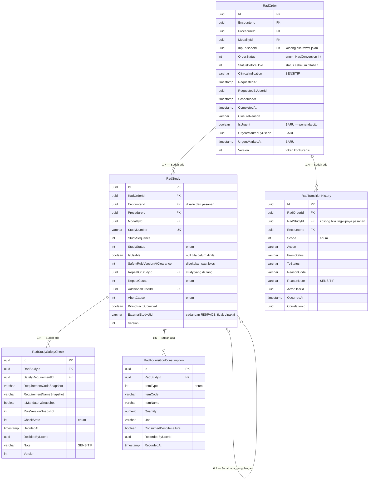

# ERD — Radiology Ordering dan Acquisition

| Field | Value |
|---|---|
| Contract version | `RAD-ERD-ORD-001` |
| Revision | `2` |
| Status | `draft` |
| Konteks | `BC-RAD-01` Ordering, `BC-RAD-02` Acquisition |
| Backend SHA | `64da911` |

Empat dari lima tabel berstatus `Sudah ada` dan tidak berubah. **`RadOrder` berstatus
`Diperbarui`** karena penanda cito (`RAD-DEC-013`).

---

## Diagram

---

## Tabel Status Entity

| Entity | Status | Owner | Catatan |
|---|---|---|---|
| `RadOrder` | **`Diperbarui`** | Radiology Management | Tiga kolom penanda cito ditambahkan |
| `RadStudy` | `Sudah ada` | Radiology Management | Tidak berubah |
| `RadStudySafetyCheck` | `Sudah ada` | Radiology Management | Tidak berubah |
| `RadAcquisitionConsumption` | `Sudah ada` | Radiology Management | Tidak berubah |
| `RadTransitionHistory` | `Sudah ada` | Radiology Management | Tidak berubah |

---

## Index dan Batasan yang Berlaku

Diambil apa adanya dari berkas configuration pada `64da911`.

| Tabel | Index | Sifat |
|---|---|---|
| `RadOrder` | `EncounterId` | Biasa |
| `RadOrder` | `OrderStatus` | Biasa |
| `RadOrder` | `ModalityId` + `OrderStatus` | Biasa |
| `RadOrder` | `ModalityId` + `IsUrgent` + `OrderStatus` | Biasa — **BARU**, menopang daftar kerja per alat |
| `RadStudy` | `StudyNumber` | **Unik**, difilter `"IsDelete" = false` |
| `RadStudy` | `RadOrderId` + `StudySequence` | Biasa |
| `RadStudy` | `EncounterId` | Biasa |
| `RadStudy` | `StudyStatus` | Biasa |
| `RadStudy` | `RepeatOfStudyId` | Biasa |

Seluruh relasi memakai `DeleteBehavior.Restrict`, sehingga riwayat klinis tidak ikut terhapus
berantai.

---

## Dua Bentuk yang Perlu Dipahami Pembaca

### Mengapa `EncounterId` disalin ke `RadStudy`

Kunjungan sebenarnya sudah tersimpan pada pesanan. Salinannya di study bukan duplikasi
kepemilikan — pemiliknya tetap Registration Management — melainkan agar study dapat dicari
tanpa menggabungkan tabel, dan agar fakta yang dikirim ke Billing membawa konteks kunjungannya
sendiri.

### Mengapa pengulangan berupa relasi ke diri sendiri

Study yang diulang **tidak** dihapus dan **tidak** ditimpa. Study baru dibuat dengan
`RepeatOfStudyId` menunjuk study lama beserta sebabnya.

> **Contoh.** CT-Scan Tn. B urutan ke-1 gagal karena pasien bergerak. Study ke-2 dibuat dengan
> `RepeatOfStudyId` menunjuk study ke-1 dan `RepeatCause` bernilai `PatientCondition`.
> Pertanyaan "berapa kali Tn. B sebenarnya disinari" dijawab dengan menghitung dua baris,
> bukan satu.

---

## Daftar Kerja Petugas — Tidak Ada Tabelnya

Slice `S12` daftar kerja petugas **tidak menambah satu tabel pun**. Ini keputusan `RAD-DEC-012`
dan pantas ditegaskan di dokumen ERD supaya tidak ada yang mencarinya.

Daftar kerja adalah **cara memandang** data yang sudah ada:

| Yang diminta pengguna | Cara menjawabnya |
|---|---|
| "Pekerjaan CT-Scan hari ini" | Saring `RadOrder` berdasarkan `ModalityId`, tanggal, dan status yang belum selesai |
| "Yang mendesak dulu" | Urutkan `IsUrgent` menurun, lalu `RequestedAt` menaik |
| "Sudah sampai mana masing-masing" | Ambil status study terkait lewat `RadStudy` |

Index `ModalityId` + `IsUrgent` + `OrderStatus` ditambahkan khusus untuk menopang pandangan ini.

> **Mengapa ini penting bagi pembaca teknis.** Daftar kerja tidak punya siklus hidup. Tidak ada
> yang "membuat" daftar kerja, tidak ada yang "menutup"-nya, dan tidak ada keadaan yang perlu
> dijaga di dalamnya. Membuatkannya tabel berarti menyimpan salinan yang harus dijaga tetap
> sinkron dengan sumbernya — pekerjaan tambahan tanpa manfaat.
