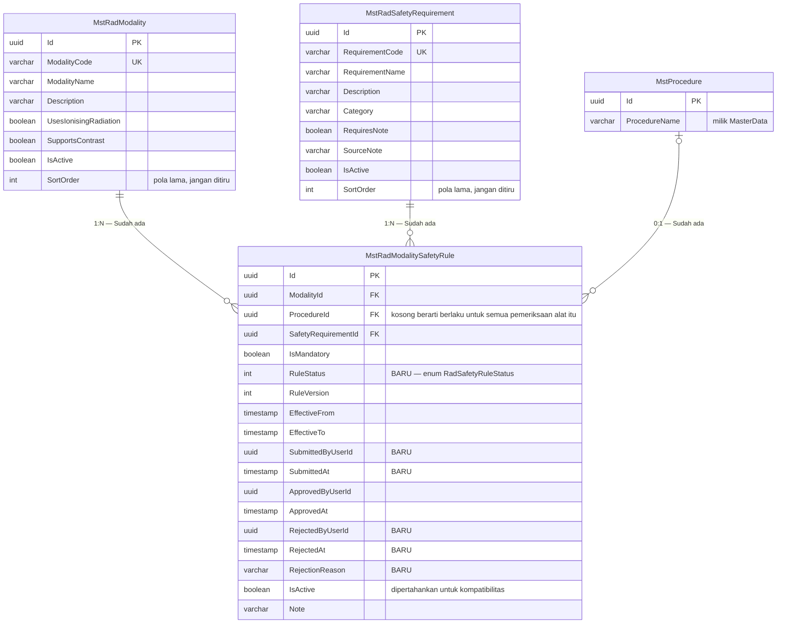

# ERD — Radiology Safety Policy

| Field | Value |
|---|---|
| Contract version | `RAD-ERD-SAF-001` |
| Revision | `1` |
| Status | `draft` |
| Konteks | `BC-RAD-04` Safety Policy |
| Backend SHA | `64da911` |
| Decision | `RAD-DEC-005`, `RJ-BIL-DEC-014` |

Konteks ini menetapkan **kebijakan**, bukan mengerjakan pasien. Ia yang menentukan pemeriksaan
boleh berjalan atau tidak.

---

## Diagram

---

## Tabel Status Entity

| Entity | Status | Owner | Catatan |
|---|---|---|---|
| `MstRadModality` | `Sudah ada` | Radiology Management | Tidak berubah; ditambah endpoint pengelolaan |
| `MstRadSafetyRequirement` | `Sudah ada` | Radiology Management | Tidak berubah; ditambah endpoint pengelolaan |
| `MstRadModalitySafetyRule` | **`Diperbarui`** | Radiology Management | Enam kolom siklus pengesahan ditambahkan |
| `MstProcedure` | `Sudah ada` | Health Services MasterData | Direferensikan, **MUST NOT** disalin |

---

## Index dan Batasan

| Tabel | Index | Sifat | Keadaan |
|---|---|---|---|
| `MstRadModalitySafetyRule` | `ModalityId` + `ProcedureId` + `SafetyRequirementId` | **Unik**, difilter | **Filter diubah** — lihat di bawah |
| `MstRadModalitySafetyRule` | `ModalityId` + `IsActive` | Biasa | Tidak berubah |

### Perubahan filter index unik

| Keadaan | Filter |
|---|---|
| Sekarang di `64da911` | `"IsDelete" = false AND "IsActive" = true` |
| Setelah migration 1 | `"IsDelete" = false AND "RuleStatus" = 3` |

Angka `3` adalah nilai `RadSafetyRuleStatus.Active`.

**Mengapa index ini penting.** Tanpa penjaga ini, dua baris yang saling bertentangan — satu
menyatakan butir wajib, satu menyatakan tidak wajib, untuk kombinasi alat dan pemeriksaan yang
sama — dapat hidup berdampingan. Yang menang tinggal soal urutan baris, dan itu berarti
keselamatan pasien ditentukan kebetulan.

---

## Arti Kolom `ProcedureId` yang Boleh Kosong

Ini bentuk yang mudah disalahpahami.

| `ProcedureId` | Artinya |
|---|---|
| Kosong | Aturan berlaku untuk **seluruh pemeriksaan** dengan alat itu |
| Terisi | Aturan berlaku **hanya** untuk pemeriksaan tersebut |

> **Contoh.** Skrining kehamilan wajib untuk **semua** pemeriksaan CT-Scan, maka `ProcedureId`
> dikosongkan. Sedangkan pemeriksaan fungsi ginjal hanya wajib untuk **CT-Scan dengan
> kontras**, maka `ProcedureId` diisi pemeriksaan itu saja. Pasien yang menjalani CT-Scan tanpa
> kontras tidak ditanyai fungsi ginjal, tetapi tetap ditanyai kehamilan.

---

## Siklus Hidup Aturan

Rinciannya ada di [contracts/state-transition-matrix.md](../contracts/state-transition-matrix.md).
Ringkasnya:

| `RuleStatus` | Ikut dinilai gerbang keselamatan? |
|---|:---:|
| `Draft` (1) | **Tidak** |
| `PendingApproval` (2) | **Tidak** |
| `Active` (3) | **Ya** |
| `Inactive` (4) | **Tidak** |

> **Akibat yang wajib disampaikan ke pengguna.** Selama sebuah alat belum punya satu pun aturan
> berstatus `Active`, seluruh pemeriksaan dengan alat itu **akan ditolak**. Ini disengaja
> (`RJ-BIL-DEC-014`), bukan kerusakan. Layar pengelolaan wajib menampilkan peringatan itu.
