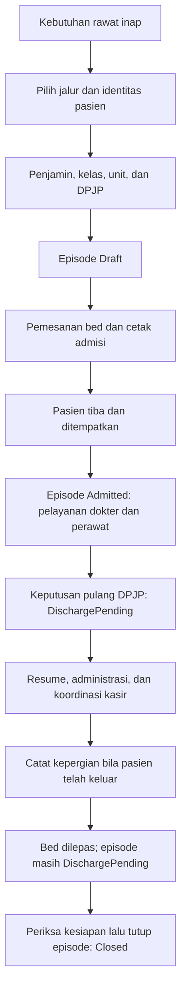

# Alur Lengkap Penggunaan Rawat Inap

Versi 1.0 · 6 Oktober 2026.

## Tujuan, pelaku, dan pemicu

Tujuannya mencatat satu rangkaian perawatan yang dapat ditelusuri sampai penutupannya. Proses dimulai ketika pasien membutuhkan rawat inap. Petugas admisi menyiapkan episode; petugas bangsal menempatkan dan merawat pasien; dokter mendokumentasikan pelayanan serta keputusan pulang; kasir menangani tagihan; petugas berwenang menutup episode.

Prasyarat: pasien teridentifikasi, unit/kamar/bed siap, dokter tersedia, penjamin sesuai, dan akun petugas memiliki hak akses yang diperlukan.

## Langkah utama

1. **Pilih jalur admisi.** Gunakan pasien baru, pasien lama, atau permintaan dari kamar pulih. Pasien yang sudah mempunyai nomor rekam medis menggunakan jalur pasien lama.
2. **Siapkan administrasi.** Cocokkan identitas, kategori pasien, cara bayar, penjamin, dan kelas perawatan. Jika muncul langkah Deposit, pahami batas pencatatannya pada panduan keuangan.
3. **Pilih unit dan DPJP.** DPJP berarti Dokter Penanggung Jawab Pelayanan. Simpan langkah Dokter; kunjungan dan episode Draft dibentuk.
4. **Pilih dan pesan bed.** Periksa unit, kelas, isolasi, ketersediaan, serta masa pemesanan. Pemesanan menahan bed sementara.
5. **Konfirmasi dan cetak.** Tinjau ringkasan admisi dan cetak persetujuan. Pada pasien baru, cetak kartu pasien. Konfirmasi ini belum mengubah episode menjadi Admitted.
6. **Catat penempatan saat pasien tiba.** Buka Papan Tempat Tidur atau Detail Episode. Selesaikan penempatan sesuai kondisi nyata. Episode menjadi Admitted.
7. **Lengkapi penugasan dan pelayanan.** Perawat mengisi pengkajian/asuhan. Dokter mengisi kajian, SOAP, CPPT, visite, resep, tindakan, dan pesanan penunjang sesuai kebutuhan.
8. **Pantau pekerjaan tertunda.** Kepala ruangan dan petugas terkait memeriksa daftar pantau, hasil penunjang, verifikasi, serta status tagihan.
9. **Siapkan pemulangan.** DPJP membuat keputusan pulang. Lengkapi resume dan tanda tangan, butir administrasi, serta koordinasi kasir.
10. **Catat pasien meninggalkan ruangan.** Isi waktu nyata. Pahami peringatan kasir bila muncul. Bed dilepas dan episode tetap DischargePending.
11. **Tutup episode.** Petugas berwenang memeriksa kesiapan penutupan, melengkapi persyaratan, lalu menutup episode menjadi Closed.

## Peta urutan

Kepergian dapat tercatat sementara syarat penutupan masih dikerjakan. Server juga dapat menutup episode dengan penempatan aktif yang sah; baca lima syarat pada panduan pemulangan, jangan menganggap urutan gambar menggantikan pemeriksaan server.

## Perubahan status dan penyerahan pekerjaan

| Dari | Tindakan | Ke | Pelaku/kewenangan | Penerima pekerjaan berikutnya |
| --- | --- | --- | --- | --- |
| Belum ada episode | Simpan pembukaan admisi | Draft | Petugas dengan hak membuat episode | Petugas penempatan |
| Draft | Tempatkan pasien | Admitted | Petugas berwenang menempatkan pasien | Perawat dan dokter yang ditugaskan |
| Admitted | Putuskan pulang | DischargePending | DPJP aktif dan hak keputusan pulang | Perawat, admisi, dan kasir |
| DischargePending | Catat kepergian | DischargePending | Hak RecordDeparture | Admisi/kasir untuk penyelesaian |
| DischargePending | Tutup episode | Closed | Hak Close; semua syarat terpenuhi | Dokumentasi dan pelaporan |
| Draft | Batalkan admisi dengan alasan | Cancelled | Hak membatalkan admisi | Pemesanan dibebaskan |

## Contoh satu pasien

Pasien fiktif Budi, RM CONTOH-001, didaftarkan 6 Oktober pukul 08.00. Pada 08.15 petugas menyimpan unit dan DPJP; episode menjadi Draft. Bed dipilih pada 08.20. Pasien tiba dan ditempatkan pada 09.00; episode menjadi Admitted.

Pada 8 Oktober pukul 10.00 DPJP membuat keputusan pulang. Perawat mencatat kepergian nyata pukul 12.00; bed tersedia kembali, tetapi episode belum Closed. Resume yang telah ditandatangani, butir wajib, status kasir, dan keadaan bed diperiksa sebelum episode ditutup.

## Bila alur terhenti

| Kondisi | Tindakan pengguna |
| --- | --- |
| Pasien sudah tersimpan tetapi episode belum ada | Cari melalui admisi pasien lama; hindari pendaftaran pasien kedua. |
| Episode Draft sudah ada | Gunakan Lanjutkan Admisi. |
| Bed sudah diambil pasien lain | Muat ulang pilihan bed dan pilih tempat yang sesuai. |
| Hasil/verifikasi belum tersedia | Buka pekerjaan terkait; jangan menandai seolah telah selesai. |
| Pasien sudah keluar tetapi kasir belum memberi izin | Catat kejadian nyata melalui dialog peringatan; tindak lanjuti daftar pantau. |
| Episode Closed mengandung kesalahan | Gunakan jalur koreksi yang berwenang; status tidak berubah kembali menjadi Admitted. |

## Hasil akhir dan rujukan

Episode Closed memiliki riwayat admisi, penempatan, penugasan, pelayanan, pemulangan, dan penutupan. Mulai praktik dari [pasien baru](admisi/01-pasien-baru.md) atau [pasien lama](admisi/02-pasien-lama.md).

Bukti: [episode dan tempat tidur](99-sumber-dan-status-panduan.md#episode), [pemulangan](99-sumber-dan-status-panduan.md#pemulangan), dan [billing](99-sumber-dan-status-panduan.md#billing).

