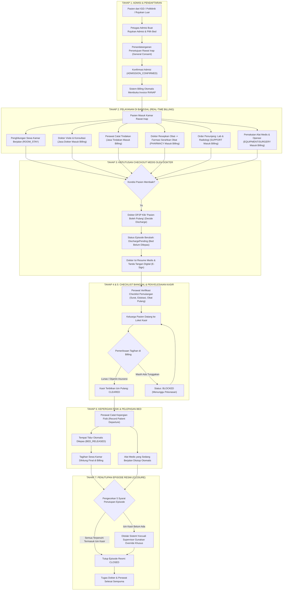
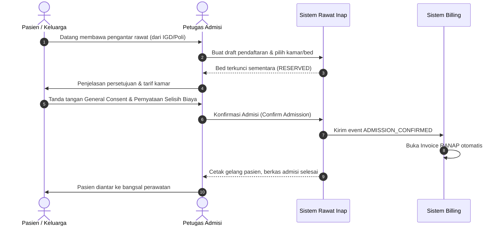
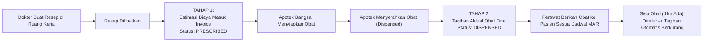
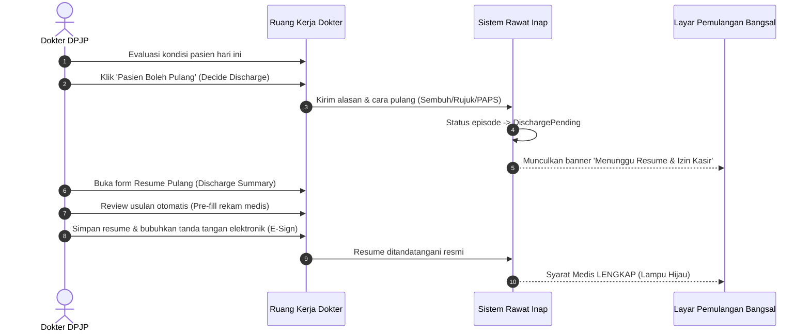
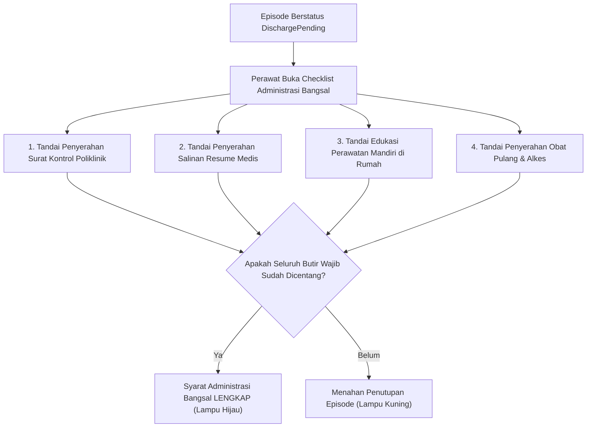
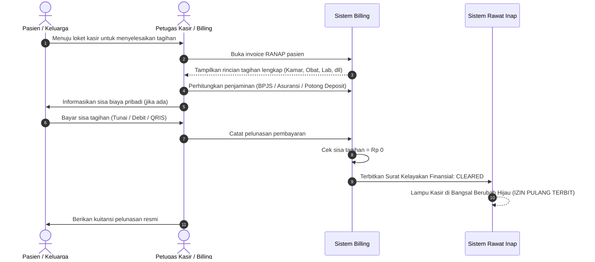
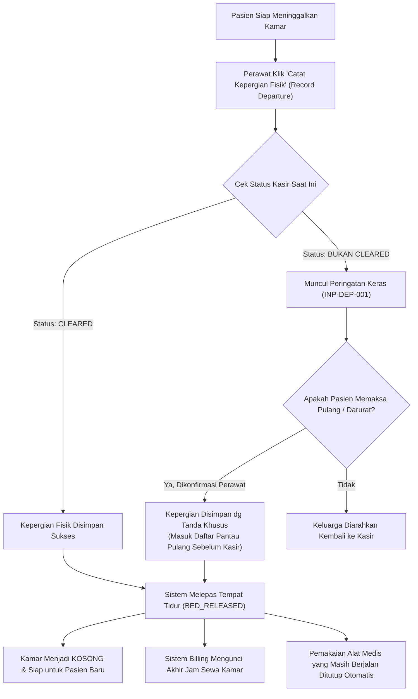
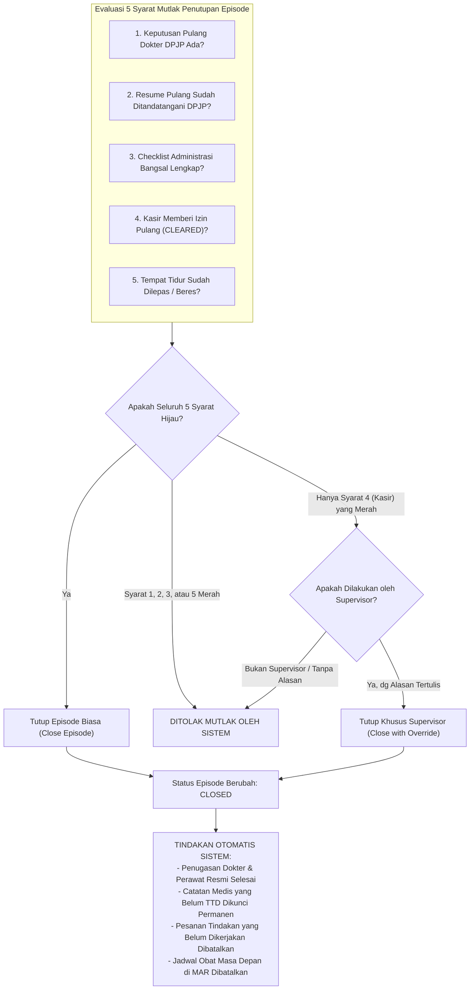

# Panduan Lengkap Siklus Pelayanan Rawat Inap dan Integrasi Billing
## Sistem Informasi Rumah Sakit Quilvian (Quilvian System)

---

## Daftar Isi
1. [Pendahuluan dan Gambaran Umum](#1-pendahuluan-dan-gambaran-umum)
2. [Kamus Istilah dan Peran Pengguna](#2-kamus-istilah-dan-peran-pengguna)
3. [Diagram Alur Proses Bisnis Ujung-ke-Ujung (End-to-End)](#3-diagram-alur-proses-bisnis-ujung-ke-ujung-end-to-end)
4. [Siklus 1: Admisi dan Pendaftaran Pasien Rawat Inap](#4-siklus-1-admisi-dan-pendaftaran-pasien-rawat-inap)
5. [Siklus 2: Pelayanan Harian di Bangsal dan Akumulasi Tagihan Real-Time](#5-siklus-2-pelayanan-harian-di-bangsal-dan-akumulasi-tagihan-real-time)
   - [5.1 Sewa Kamar dan Tempat Tidur (Room Stay)](#51-sewa-kamar-dan-tempat-tidur-room-stay)
   - [5.2 Visite Dokter dan Konsultasi Klinis](#52-visite-dokter-dan-konsultasi-klinis)
   - [5.3 Asuhan dan Tindakan Keperawatan / Medis](#53-asuhan-dan-tindakan-keperawatan--medis)
   - [5.4 Resep Obat, Farmasi, dan MAR Bangsal](#54-resep-obat-farmasi-dan-mar-bangsal)
   - [5.5 Pemeriksaan Penunjang Medis: Laboratorium](#55-pemeriksaan-penunjang-medis-laboratorium)
   - [5.6 Pemeriksaan Penunjang Medis: Radiologi](#56-pemeriksaan-penunjang-medis-radiologi)
   - [5.7 Pemakaian Alat Medis Bangsal dan Kamar Operasi](#57-pemakaian-alat-medis-bangsal-dan-kamar-operasi)
   - [5.8 Pemantauan Tagihan oleh Perawat (Hak Akses Tanpa Rupiah)](#58-pemantauan-tagihan-oleh-perawat-hak-akses-tanpa-rupiah)
6. [Siklus 3: Keputusan Pemulangan Medis oleh Dokter (DPJP)](#6-siklus-3-keputusan-pemulangan-medis-oleh-dokter-dpjp)
   - [6.1 Keputusan Pasien Boleh Pulang (Decide Discharge)](#61-keputusan-pasien-boleh-pulang-decide-discharge)
   - [6.2 Penyusunan dan Tanda Tangan Resume Medis Pulang (E-Sign)](#62-penyusunan-dan-tanda-tangan-resume-medis-pulang-e-sign)
7. [Siklus 4: Pemeriksaan Checklist Administrasi oleh Perawat](#7-siklus-4-pemeriksaan-checklist-administrasi-oleh-perawat)
8. [Siklus 5: Penyelesaian Keuangan di Kasir dan Izin Pulang (Financial Clearance)](#8-siklus-5-penyelesaian-keuangan-di-kasir-dan-izin-pulang-financial-clearance)
   - [8.1 Penyelesaian Pembayaran oleh Kasir (Tunai, Asuransi, Deposit)](#81-penyelesaian-pembayaran-oleh-kasir-tunai-asuransi-deposit)
   - [8.2 Penerbitan Status Izin Pulang (CLEARED)](#82-penerbitan-status-izin-pulang-cleared)
   - [8.3 Pengamanan Otomatis: Pencabutan Izin Jika Ada Tagihan Susulan (Auto-Reblock)](#83-pengamanan-otomatis-pencabutan-izin-jika-ada-tagihan-susulan-auto-reblock)
9. [Siklus 6: Pencatatan Kepergian Fisik dan Pelepasan Tempat Tidur](#9-siklus-6-pencatatan-kepergian-fisik-dan-pelepasan-tempat-tidur)
   - [9.1 Pencatatan Pasien Meninggalkan Kamar (Record Departure)](#91-pencatatan-pasien-meninggalkan-kamar-record-departure)
   - [9.2 Pelepasan Tempat Tidur dan Finalisasi Jam Rawat](#92-pelepasan-tempat-tidur-dan-finalisasi-jam-rawat)
   - [9.3 Prosedur Khusus: Pasien Pulang Paksa / Sebelum Izin Kasir](#93-prosedur-khusus-pasien-pulang-paksa--sebelum-izin-kasir)
10. [Siklus 7: Penutupan Resmi Episode Rawat Inap (Episode Closure)](#10-siklus-7-penutupan-resmi-episode-rawat-inap-episode-closure)
    - [10.1 Evaluasi 5 Syarat Mutlak Penutupan](#101-evaluasi-5-syarat-mutlak-penutupan)
    - [10.2 Efek Samping dan Tindakan Otomatis Sistem saat Penutupan](#102-efek-samping-dan-tindakan-otomatis-sistem-saat-penutupan)
    - [10.3 Jalur Khusus Supervisor: Tutup dengan Alasan Tertulis (Override)](#103-jalur-khusus-supervisor-tutup-dengan-alasan-tertulis-override)
11. [Contoh Kasus Nyata di Rumah Sakit: Perjalanan Pasien Budi Santoso](#11-contoh-kasus-nyata-di-rumah-sakit-perjalanan-pasien-budi-santoso)
12. [Spesifikasi Teknis Endpoint API (Bergaya Swagger)](#12-spesifikasi-teknis-endpoint-api-bergaya-swagger)

---

## 1. Pendahuluan dan Gambaran Umum

Modul **Rawat Inap (Inpatient Management)** dan **Billing (Billing Management)** di sistem Quilvian dirancang untuk memastikan integrasi yang mulus, aman, dan tanpa celah antara **pelayanan medis klinis** dan **tanggung jawab keuangan rumah sakit**.

### Filosofi Desain Sistem Quilvian
1. **Pemisahan Wewenang Klinis dan Finansial**: Staf medis (dokter dan perawat) berfokus penuh pada keselamatan dan perawatan pasien tanpa dibebani transaksi kasir. Namun, setiap pelayanan medis yang terkonfirmasi secara otomatis dicatat ke dalam buku tagihan (*Billing Folio*).
2. **Penagihan Berbasis Peristiwa (*Event-Driven Billing*)**: Sistem tidak menunggu pasien pulang baru mengumpulkan bon tagihan secara manual. Ketika obat diserahkan, darah diambil di lab, rontgen dipotret, atau dokter melakukan visite, tagihan langsung terjadwal masuk ke invoice pasien secara *real-time*.
3. **Gerbang Keamanan Berlapis saat Pemulangan (*Discharge Gate*)**: Pasien tidak dapat ditutup perawatannya hanya dengan satu tombol sembarangan. Proses pemulangan melewati gerbang medis (persetujuan DPJP & resume pulang), gerbang administrasi bangsal (checklist perawat), dan gerbang kasir (*Financial Clearance*).

---

## 2. Kamus Istilah dan Peran Pengguna

| Istilah | Penjelasan Sederhana untuk Pengguna |
| :--- | :--- |
| **Episode Rawat Inap (`InpEpisode`)** | Satu kurun waktu perawatan pasien di rawat inap dari pertama kali masuk bangsal sampai resmi selesai dan ditutup. |
| **Kunjungan / Encounter (`RegPatientEncounter`)** | Catatan kunjungan admisi pasien di rumah sakit yang menjadi jangkar utama penagihan keuangan. |
| **DPJP (Dokter Penanggung Jawab Pelayanan)** | Dokter spesialis yang memegang kendali klinis penuh atas pasien rawat inap. Hanya DPJP yang berhak memutuskan pasien boleh pulang. |
| **Invoice RANAP (`BilInvoice`)** | Tagihan induk rawat inap tempat seluruh rincian biaya (kamar, obat, lab, tindakan, dll) disatukan. |
| **Financial Clearance (Izin Kasir)** | Status kelayakan keuangan dari Kasir/Billing yang menyatakan bahwa tagihan pasien telah lunas atau sudah dijamin asuransi/perusahaan. |
| **Auto-Reblock** | Mekanisme keselamatan otomatis di mana izin pulang kasir langsung dicabut kembali menjadi `REVOKED` jika ada tagihan baru yang masuk belakangan. |
| **MAR (*Medication Administration Record*)** | Lembar pencatatan pemberian obat oleh perawat di bangsal sesuai jadwal dokter. |
| **Pelepasan Bed (*Release Bed*)** | Pengosongan status tempat tidur agar sistem dapat mengalokasikannya kepada pasien rawat inap berikutnya. |

### Peran Pengguna (User Roles)
- **Petugas Pendaftaran / Admisi**: Mendaftarkan pasien, memilih kamar dan tempat tidur, mencatat penjamin, serta mencetak persetujuan rawat inap.
- **Dokter DPJP**: Melakukan visite, menulis instruksi medis, meresepkan obat, memutuskan pasien boleh pulang, dan menandatangani resume medis pulang.
- **Perawat Bangsal**: Memberikan asuhan keperawatan, membagikan obat (MAR), memesan lab/radiologi, memeriksa checklist kepulangan, dan mencatat kepergian fisik pasien.
- **Kasir / Bagian Billing**: Memverifikasi seluruh rincian biaya, memproses pembayaran tunai/kartu/asuransi/deposit, dan menerbitkan izin kelayakan keuangan.
- **Supervisor Rawat Inap / Kepala Ruangan**: Memiliki wewenang darurat untuk menutup episode rawat inap jika kasir terkendala, dengan mencatat alasan tertulis yang dapat diaudit.

---

## 3. Diagram Alur Proses Bisnis Ujung-ke-Ujung (End-to-End)



---

## 4. Siklus 1: Admisi dan Pendaftaran Pasien Rawat Inap

Siklus ini merupakan gerbang awal masuknya pasien ke instalasi rawat inap rumah sakit.



### Langkah-langkah Proses Bisnis
1. **Penerimaan Rujukan Rawat Inap**: Pasien yang membutuhkan perawatan inap datang dengan surat rujukan dari Instalasi Gawat Darurat (IGD), Poliklinik Rawat Jalan, atau rujukan luar rumah sakit.
2. **Pemilihan Kamar dan Tempat Tidur**: Petugas admisi membuka papan ketersediaan tempat tidur (*Bed Board*), memilih ruang rawat sesuai hak kelas (Kelas 3, Kelas 2, Kelas 1, VIP, VVIP, atau Ruang Isolasi/ICU). Tempat tidur berstatus *Reserved*.
3. **Penetapan Penjamin Biaya**: Petugas menetapkan skema bayar pasien:
   - **Umum / Tunai Pribadi**: Dapat diminta uang muka/deposit rawat inap bila dipersyaratkan.
   - **BPJS Kesehatan**: Verifikasi Surat Eligibilitas Peserta (SEP).
   - **Asuransi Swasta / Perusahaan Rekanan**: Verifikasi surat jaminan awal (*surat garansi / guarantee letter*).
4. **Penandatanganan Berkas Admisi**: Pasien atau keluarga yang bertanggung jawab menandatangani formulir Persetujuan Umum (*General Consent*), formulir pelepasan informasi medis, dan pernyataan kesediaan membayar selisih biaya (jika naik kelas rawat).
5. **Konfirmasi Admisi & Pembukaan Tagihan Otomatis**:
   - Petugas menekan tombol konfirmasi.
   - Sistem Rawat Inap mengirimkan notifikasi resmi ke Sistem Billing.
   - **Sistem Billing seketika membuka `BilInvoice` berjenis `RANAP`**. Nomor rekam medis dan nomor kunjungan pasien langsung terhubung.

---

## 5. Siklus 2: Pelayanan Harian di Bangsal dan Akumulasi Tagihan Real-Time

Selama pasien dirawat, seluruh pelayanan yang diberikan oleh tenaga medis akan langsung diubah menjadi transaksi tagihan tanpa memerlukan pencatatan manual ganda ke kasir.

### 5.1 Sewa Kamar dan Tempat Tidur (Room Stay)
- **Mekanisme**: Sejak perawat mengonfirmasi pasien menempati tempat tidur (`OCCUPIED`), durasi menginap mulai berjalan.
- **Aturan Tarif**: Dihitung otomatis oleh Billing mengacu pada kebijakan rumah sakit (`MstRoomChargePolicy`).
- **Pindah Kamar (Transfer Bed)**: Jika pasien pindah kamar (misal: kondisi membaik dari ICU pindah ke Bangsal Melati), perawat mencatat perpindahan di sistem. Billing secara otomatis menutup perhitungan tarif kamar lama dan membuka perhitungan tarif kamar baru secara proporsional per menit/hari.

### 5.2 Visite Dokter dan Konsultasi Klinis
- **Mekanisme**: Setiap hari dokter DPJP atau dokter konsulen melakukan visite pemeriksaan pasien di bangsal.
- **Pencatatan**: Dokter mencatat perkembangan pasien di lembar CPPT (*Catatan Perkembangan Pasien Terintegrasi*) dan menyelesaikan sesi visite di ruang kerja dokter (*Physician Workspace*).
- **Integrasi Billing**: Ketika sesi visite diselesaikan (`COMPLETED`), jasa konsultasi dokter langsung diterbitkan melalui `ClinicalMilestoneFactProducer` dan masuk ke baris invoice rawat inap pada kelompok `PROCEDURE` dengan nama dokter yang bersangkutan.

### 5.3 Asuhan dan Tindakan Keperawatan / Medis
- **Mekanisme**: Tindakan seperti pemasangan infus, kateter, perawatan luka steril, kumbah lambung, atau fisioterapi dicatat oleh perawat.
- **Integrasi Billing**: Saat tindakan dinyatakan selesai dikerjakan (`PERFORMED`/`COMPLETED`), tarif tindakan langsung otomatis masuk ke invoice tagihan.

### 5.4 Resep Obat, Farmasi, dan MAR Bangsal
Penagihan obat diatur secara sangat hati-hati menggunakan **model dua tahap (Two-Stage Billing)** untuk mencegah selisih biaya obat:



1. **Tahap 1 (Order Final oleh Dokter)**: Tagihan resep langsung dikirim ke invoice rawat inap berstatus `PRESCRIBED`. Kasir dan perawat sudah dapat melihat estimasi nilai obat.
2. **Tahap 2 (Penyerahan Obat oleh Farmasi)**: Saat obat diserahkan (*dispensed*), sistem mengunci jumlah obat aktual yang benar-benar diserahkan sebagai tagihan pasti berstatus `DISPENSED`.
3. **Pemberian Obat di Bangsal (MAR)**: Perawat menandai jam pemberian obat pada lembar digital MAR (*Medication Administration Record*).
4. **Retur Obat**: Bila dokter menghentikan obat di tengah jalan dan obat dikembalikan ke farmasi, bagian farmasi memproses retur obat (`DrugReturn`), yang seketika membentuk penyesuaian kredit (*credit adjustment*) sehingga tagihan pasien otomatis berkurang.

### 5.5 Pemeriksaan Penunjang Medis: Laboratorium
1. Dokter atau perawat membuat pesanan tes laboratorium (contoh: Darah Lengkap, Elektrolit, Fungsi Hati).
2. Petugas lab mengambil spesimen/darah.
3. **Titik Masuk Billing**: Begitu sampel spesimen diterima dan diverifikasi oleh analis laboratorium (`LabSpecimenService`), biaya tes lab seketika masuk ke invoice rawat inap kelompok `SUPPORT`.

### 5.6 Pemeriksaan Penunjang Medis: Radiologi
1. Dokter membuat pesanan radiologi (contoh: Rontgen Thorax, USG Abdomen, CT Scan).
2. Pasien diperiksa di instalasi radiologi.
3. **Titik Masuk Billing**: Ketika pemeriksaan selesai dilakukan dan kualitas citra disetujui oleh radiografer (`RadStudyService`), biaya radiologi langsung tercatat di invoice rawat inap kelompok `SUPPORT`.

### 5.7 Pemakaian Alat Medis Bangsal dan Kamar Operasi
- **Alat Medis Bangsal**: Pemakaian alat khusus di bangsal (seperti Syringe Pump, Infusion Pump, Nebulizer, atau Ventilator) dicatat jam mulai dan jam selesainya oleh perawat. Saat pemakaian dihentikan, biaya sewa alat masuk ke invoice ranap kelompok `EQUIPMENT`.
- **Kamar Operasi (OK)**: Jika pasien menjalani operasi, pemakaian kamar operasi, tindakan tim bedah, dan jasa dokter anestesi dikirimkan langsung oleh instalasi kamar operasi ke invoice rawat inap kelompok `SURGERY`.

### 5.8 Pemantauan Tagihan oleh Perawat (Hak Akses Tanpa Rupiah)
- **Tampilan Khusus Bangsal**: Perawat dapat memantau rincian layanan apa saja yang sudah masuk ke tagihan pasien melalui tab **Tagihan Pasien** di Ruang Kerja Keperawatan.
- **Perlindungan Privasi**: Demi menjaga fokus pelayanan medis dan privasi keuangan, perawat hanya melihat **daftar butir pelayanan yang sudah tercatat tanpa melihat nominal harga per item**, kecuali bagi perawat yang memiliki izin otorisasi khusus `PatientBillingSummary : ViewAmount`.

---

## 6. Siklus 3: Keputusan Pemulangan Medis oleh Dokter (DPJP)

Proses pemulangan pasien selalu **dimulai dari keputusan klinis dokter**. Petugas administrasi atau kasir tidak berhak memulangkan pasien jika dokter belum menyatakan pasien layak pulang.



### 6.1 Keputusan Pasien Boleh Pulang (Decide Discharge)
- Dokter DPJP membuka berkas pasien dan memilih menu pemulangan.
- Dokter memilih cara pulang:
  - **Sembuh / Perbaikan Klinis** (Normal Discharge)
  - **Dirujuk ke Faskes Lain** (Referred)
  - **Pulang Atas Permintaan Sendiri / Menolak Rawat** (PAPS)
- Dokter menginput alasan keputusan pulang.
- **Efek Sistem**: Status episode berubah dari `Admitted` menjadi **`DischargePending`**.
- **Penting**: Tempat tidur pasien **belum dilepas** pada tahap ini. Pasien masih berhak menempati tempat tidur hingga proses administrasi dan serah terima obat selesai.

### 6.2 Penyusunan dan Tanda Tangan Resume Medis Pulang (E-Sign)
- Dokter melengkapi Resume Pulang (*Discharge Summary*), yang memuat: diagnosis utama, diagnosis sekunder, ringkasan perjalanan penyakit, hasil penunjang penting, tindakan yang telah dilakukan, serta anjuran kontrol dan obat pulang.
- Sistem menyediakan fitur otomatis (*Summary Prefill*) untuk meringkas riwayat yang sudah pernah diinput sehingga dokter tidak perlu mengetik ulang dari awal.
- Dokter membubuhkan **Tanda Tangan Digital**. Setelah ditandatangani, resume terkunci permanen dan menjadi dokumen legal rekam medis.

---

## 7. Siklus 4: Pemeriksaan Checklist Administrasi oleh Perawat

Setelah dokter menyatakan boleh pulang, perawat bangsal bertugas memastikan seluruh kebutuhan pasien sebelum pulang telah terpenuhi:



- Butir-butir checklist diatur oleh manajemen rumah sakit (misal: verifikasi lepas jarum infus, serah terima obat pulang, penjelasan cara minum obat, kartu kontrol ulang).
- Perawat menandai butir-butir tersebut satu per satu di sistem. Setiap penandaan mencatat nama perawat dan waktu penandaan secara transparan.

---

## 8. Siklus 5: Penyelesaian Keuangan di Kasir dan Izin Pulang (Financial Clearance)

Ini adalah titik temu penting antara bangsal perawatan dan bagian keuangan rumah sakit.



### 8.1 Penyelesaian Pembayaran oleh Kasir
Kasir membuka akun tagihan pasien. Seluruh biaya dari bangsal, farmasi, lab, radiologi, dan kamar operasi sudah tersusun rapi per kategori.
1. Kasir memvalidasi porsi penjaminan (BPJS / Asuransi / Perusahaan Rekanan).
2. Jika pasien memiliki uang muka (deposit), saldo deposit dipotongkan ke tagihan.
3. Bila ada sisa biaya yang menjadi tanggung jawab pribadi pasien (*ekses*), keluarga pasien melunasinya di kasir.

### 8.2 Penerbitan Status Izin Pulang (CLEARED)
- Ketika seluruh tagihan dinyatakan selesai (`outstanding <= 0`) atau telah dijamin penuh:
- Sistem Billing secara otomatis menerbitkan dokumen serah terima kelayakan pulang: **`ClearanceStatus = CLEARED`**.
- Pada layar perawat dan dokter di bangsal, indikator kasir (*Billing Summary Card*) yang melakukan pembaruan otomatis setiap 10 detik akan langsung berubah menjadi **Lampu Hijau (Kasir Memberi Izin Pulang)**.

### 8.3 Pengamanan Otomatis: Pencabutan Izin Jika Ada Tagihan Susulan (Auto-Reblock)
- **Skenario Bahaya**: Pasien sudah dinyatakan lunas di kasir jam 10.00 WIB, tetapi jam 10.15 WIB perawat lupa bahwa ada obat khusus yang baru diinput ke sistem.
- **Solusi Quilvian**: Sistem memiliki mekanisme proteksi **Auto-Reblock**. Begitu ada tagihan baru masuk ke invoice setelah izin terbit, **Sistem Billing seketika mencabut status izin pulang kembali menjadi `REVOKED` (Dicabut)**.
- Bangsal tidak akan bisa menutup perawatan pasien sampai tagihan susulan tersebut diselesaikan kembali bersama kasir. Hal ini melindungi rumah sakit dari potensi kerugian finansial akibat tagihan susulan yang tidak tertagih.

---

## 9. Siklus 6: Pencatatan Kepergian Fisik dan Pelepasan Tempat Tidur

Setelah izin kasir terbit dan seluruh obat pulang diserahkan, pasien bersiap meninggalkan ruangan rawat inap.



### 9.1 Pencatatan Pasien Meninggalkan Kamar (Record Departure)
- Perawat membuka menu pemulangan dan menekan tombol **Catat Kepergian Pasien**.
- Perawat mengonfirmasi waktu aktual pasien meninggalkan bangsal.

### 9.2 Pelepasan Tempat Tidur dan Finalisasi Jam Rawat
- **Pelepasan Tempat Tidur Seketika**: Tempat tidur yang ditempati pasien resmi dilepas (`InpBedPlacementEndReason.PatientDeparted`). Di papan kamar rumah sakit (*Bed Board*), tempat tidur tersebut langsung kembali berstatus **Tersedia (Available)** untuk ditempati pasien rawat inap berikutnya.
- **Kalkulasi Final Kamar**: Sistem mengirim event `BED_RELEASED` ke Billing untuk mengunci perhitungan durasi jam sewa kamar secara presisi sampai detik pasien meninggalkan ruangan.
- **Pembersihan Alat Medis**: Jika masih ada pemakaian alat medis yang lupa distop secara manual di sistem, pencatatan kepergian fisik secara otomatis menutup pemakaian alat medis tersebut (`CloseRunningForDepartureAsync`).

### 9.3 Prosedur Khusus: Pasien Pulang Paksa / Sebelum Izin Kasir
- Jika status kasir belum `CLEARED` namun pasien tetap meninggalkan ruangan (misal: pasien kabur, pulang paksa, atau keadaan darurat malam hari di mana kasir tutup):
- Sistem akan mengeluarkan peringatan keras (`INP-DEP-001`).
- Perawat wajib mencentang konfirmasi pemakluman bahwa kepergian dicatat tanpa izin kasir.
- Data ini tidak hilang, melainkan secara otomatis masuk ke dalam **Laporan Daftar Pasien Pulang Sebelum Izin Kasir (*Departures Before Clearance*)** untuk ditindaklanjuti oleh manajemen penagihan dan piutang rumah sakit.

---

## 10. Siklus 7: Penutupan Resmi Episode Rawat Inap (Episode Closure)

Penutupan episode rawat inap adalah tahap akhir administratif yang mengunci seluruh rekam medis dan transaksi perawatan pasien.



### 10.1 Evaluasi 5 Syarat Mutlak Penutupan
Sebelum tombol penutupan aktif, sistem secara otomatis mengevaluasi 5 kondisi (*Closure Readiness*):
1. **`DISCHARGE_DECIDED`**: DPJP telah menetapkan cara dan keputusan boleh pulang.
2. **`SUMMARY_SIGNED`**: Resume pulang telah ditandatangani dokter secara sah.
3. **`CLEARANCE_COMPLETE`**: Seluruh checklist wajib administrasi bangsal telah dicentang.
4. **`FINANCIAL_CLEARED`**: Kasir telah menerbitkan izin pulang (`CLEARED`).
5. **`BED_STATE_RESOLVED`**: Pasien sudah tercatat keluar kamar dan tempat tidur sudah dilepaskan.

### 10.2 Efek Samping dan Tindakan Otomatis Sistem saat Penutupan
Saat episode resmi ditutup (`CLOSED`), sistem secara otomatis menjalankan tindakan pembersihan data dalam satu transaksi database:
- **Penguncian Catatan Dokter**: Konsep catatan dokter yang belum sempat ditandatangani otomatis dikunci permanen dengan status *"Tidak Ditandatangani"* (mencegah manipulasi rekam medis susulan).
- **Pembatalan Pesanan Tertunda**: Pesanan tindakan rawat inap yang belum sempat dilaksanakan otomatis dibatalkan (`Cancelled`).
- **Pembatalan Dosis Obat Masa Depan**: Jadwal pemberian obat di lembar MAR yang jatuh tempo setelah jam tutup otomatis dibatalkan dengan keterangan *"Perawatan Ditutup"*.
- **Penyelesaian Penugasan**: Masa tugas dokter DPJP dan perawat penanggung jawab atas pasien tersebut resmi diakhiri (`EndDateTime` diisi).

### 10.3 Jalur Khusus Supervisor: Tutup dengan Alasan Tertulis (Override)
- Jika terjadi situasi darurat di mana kasir terkendala jaringan atau terdapat kebijakan penundaan bayar direksi, **Supervisor Rawat Inap** dapat menutup episode menggunakan jalur khusus **`Close with Override`**.
- **Aturan Ketat**: Jalur ini **hanya dapat menembus syarat ke-4 (Kasir)**. Syarat medis (resume dokter dan checklist perawat) tetap tidak boleh dilewati oleh siapa pun.
- Supervisor wajib menginput alasan tertulis yang jelas (misal: *"Pasien dijamin dinas sosial berdasarkan memo direktur No. 123"*). Episode ini akan ditandai khusus dan masuk ke daftar audit pemeriksaan manajemen keuangan.

---

## 11. Contoh Kasus Nyata di Rumah Sakit: Perjalanan Pasien Budi Santoso

Untuk mempermudah pemahaman seluruh alur di atas, berikut adalah ilustrasi skenario nyata penanganan pasien:

```text
Nama Pasien       : Budi Santoso (Laki-laki, 34 Tahun)
Nomor Rekam Medis : RM-2026-08129
Diagnosis Masuk   : Demam Berdarah Dengue (DBD) Grade II
Ruang Perawatan   : Bangsal Mawar, Bed M-04 (Kelas 1)
Dokter DPJP       : dr. Hendra Prasetya, Sp.PD
Penjamin          : Asuransi Swasta Sehat Mandiri (Hak Kelas 1)
```

### Hari ke-1 (Senin, 08.00 WIB) — Admisi Masuk
1. Pasien Budi Santoso diantar dari IGD ke loket admisi rawat inap.
2. Petugas admisi memilih kamar Bangsal Mawar Bed M-04. Pasien menandatangani General Consent.
3. Petugas mengklik konfirmasi admisi. **Invoice RANAP langsung otomatis terbentuk di sistem Billing.** Pasien diantar ke kamar M-04.

### Hari ke-2 (Selasa, 09.30 WIB) — Pelayanan Harian
1. **Visite Dokter**: dr. Hendra, Sp.PD melakukan visite, memeriksa Budi, dan mencatat SOAP di sistem. Jasa visite dokter otomatis tercatat di invoice Budi.
2. **Obat & Infus**: dr. Hendra meresepkan Cairan Ringer Laktat dan Paracetamol Drip. Farmasi menyerahkan obat ke bangsal, dan biaya obat otomatis masuk ke invoice. Perawat memberikan obat dan mencentang lembar MAR.
3. **Pemeriksaan Lab**: dr. Hendra memesan pemeriksaan Trombosit dan Hematokrit berkala. Petugas lab mengambil darah jam 11.00. Begitu sampel diverifikasi di lab, tagihan lab seketika masuk ke invoice Budi.
4. **Sewa Kamar**: Sistem menghitung biaya sewa kamar Bed M-04 secara otomatis.

### Hari ke-4 (Kamis, 08.30 WIB) — Checkout Medis
1. Hasil trombosit Budi sudah naik dan stabil (160.000 /µL), demam sudah reda.
2. dr. Hendra memutuskan Budi boleh pulang. Di sistem, dr. Hendra memilih cara pulang: *Sembuh/Perbaikan*. Status episode berubah menjadi `DischargePending`. Bed M-04 masih ditempati Budi.
3. dr. Hendra melengkapi Resume Medis Pulang dan membubuhkan tanda tangan elektronik.

### Hari ke-4 (Kamis, 09.15 WIB) — Administrasi Bangsal & Kasir
1. Perawat Bangsal Mawar melengkapi checklist: menyerahkan surat kontrol poliklinik minggu depan, memberikan obat minum untuk di rumah, dan mengedukasi hidrasi cairan.
2. Keluarga Budi menuju ke loket kasir.
3. Kasir membuka invoice Budi. Total biaya adalah Rp 4.850.000 (terdiri dari sewa kamar, visite dokter, obat & cairan, serta laboratorium).
4. Asuransi Sehat Mandiri menyetujui penjaminan penuh sebesar Rp 4.850.000.
5. Kasir memproses klaim asuransi. Sisa tagihan Budi = Rp 0.
6. **Sistem Billing menerbitkan izin kelayakan pulang: CLEARED.** Di layar komputer perawat Bangsal Mawar, lampu status kasir untuk Budi Santoso berubah menjadi **HIJAU**.

### Hari ke-4 (Kamis, 10.30 WIB) — Pasien Keluar Ruangan
1. Perawat melihat lampu kasir sudah hijau, lalu melepas jarum infus Budi dan menyerahkan berkas resume.
2. Budi dan keluarga meninggalkan kamar.
3. Perawat mengklik **Catat Kepergian Fisik Pasien**.
4. Tempat tidur Bed M-04 seketika menjadi **KOSONG / TERSEDIA** di sistem, sehingga siap ditempati pasien baru yang sedang mengantre di IGD.

### Hari ke-4 (Kamis, 11.00 WIB) — Penutupan Episode Resmi
1. Kepala Ruangan Bangsal Mawar membuka layar penutupan episode.
2. Kelima syarat penutupan (Keputusan DPJP, Resume bertanda tangan, Checklist bangsal, Izin kasir, dan Status bed) seluruhnya berlampu hijau.
3. Kepala Ruangan menekan tombol **Tutup Episode Rawat Inap**.
4. Episode resmi **`CLOSED`**. Seluruh riwayat rekam medis dan transaksi keuangan Budi Santoso tersimpan aman dan terintegrasi penuh.

---

## 12. Spesifikasi Teknis Endpoint API (Bergaya Swagger)

Berikut adalah daftar spesifikasi endpoint API utama yang digunakan dalam siklus rawat inap dan integrasi billing:

### Grup: Inpatient Management (Pemulangan & Penutupan)
`[Tags("Health Services / Inpatient Management / Inpatient Discharge")]`

| Method | Path Endpoint | Deskripsi Fungsi Bisnis | Otorisasi / Hak Akses | Request Body Utama | Response Sukses Utama |
| :--- | :--- | :--- | :--- | :--- | :--- |
| `POST` | `/api/v1/health-services/inpatient-management/discharges/{episodeId}/decide` | DPJP memutuskan pasien boleh pulang dan cara pulangnya | `InpatientDischarge : Update` (Wajib DPJP aktif pasien) | `DecideDischargeRequest` (`dischargeType`, `reason`) | `200 OK` (`InpatientEpisodeDetailResponse`) |
| `GET` | `/api/v1/health-services/inpatient-management/discharges/{episodeId}/summary` | Mengambil resume medis pulang beserta riwayat versinya | `InpatientDischarge : Read` | Query `includeRevisions=true/false` | `200 OK` (`DischargeSummaryResponse`) |
| `PUT` | `/api/v1/health-services/inpatient-management/discharges/{episodeId}/summary` | Menyimpan draf atau pembaharuan isi resume pulang | `InpatientDischarge : Update` (Wajib DPJP aktif) | `UpsertDischargeSummaryRequest` (Diagnosis, Terapi, Anjuran) | `200 OK` (`DischargeSummaryResponse`) |
| `PATCH` | `/api/v1/health-services/inpatient-management/discharges/{episodeId}/summary/sign` | DPJP membubuhkan tanda tangan elektronik pada resume | `InpatientDischarge : Sign` (Wajib DPJP aktif) | `SignDischargeSummaryRequest` (`signatureNote`) | `200 OK` (`DischargeSummaryResponse`) |
| `GET` | `/api/v1/health-services/inpatient-management/discharges/{episodeId}/clearance` | Membaca daftar checklist administrasi bangsal | `InpatientDischarge : Read` | None | `200 OK` (`ClearanceChecklistResponse`) |
| `POST` | `/api/v1/health-services/inpatient-management/discharges/{episodeId}/clearance/{itemId}/mark` | Perawat menandai butir checklist administrasi bangsal | `InpatientDischarge : Update` | `MarkClearanceItemRequest` (`note`) | `200 OK` (`ClearanceChecklistResponse`) |
| `GET` | `/api/v1/health-services/inpatient-management/discharges/{episodeId}/financial-clearance` | Membaca status izin kelayakan keuangan kasir | `InpatientDischarge : ReadFinancialClearance` | None | `200 OK` (`FinancialClearanceResponse`) |
| `POST` | `/api/v1/health-services/inpatient-management/discharges/{episodeId}/record-departure` | Mencatat pasien meninggalkan kamar & melepas tempat tidur | `InpatientDischarge : RecordDeparture` | `RecordDepartureRequest` (`departedAt`, `clearanceWarningAcknowledged`) | `200 OK` (`InpatientDepartureResponse`) |
| `GET` | `/api/v1/health-services/inpatient-management/discharges/{episodeId}/closure-readiness` | Memeriksa kelaikan 5 syarat penutupan episode | `InpatientDischarge : Read` | None | `200 OK` (`ClosureReadinessResponse`) |
| `POST` | `/api/v1/health-services/inpatient-management/discharges/{episodeId}/close` | Menutup episode rawat inap resmi (semua syarat wajib hijau) | `InpatientDischarge : Close` | `CloseEpisodeRequest` (`expectedVersion`, `note`) | `200 OK` (`InpatientEpisodeDetailResponse`) |
| `POST` | `/api/v1/health-services/inpatient-management/discharges/{episodeId}/close-with-override` | Supervisor menutup episode menembus syarat kasir | `InpatientDischarge : CloseOverride` (Supervisor) | `CloseEpisodeOverrideRequest` (`reason`, `expectedVersion`) | `200 OK` (`InpatientEpisodeDetailResponse`) |

---

### Grup: Billing Management (Kelayakan Keuangan Rawat Inap)
`[Tags("Health Services / Billing Management / Inpatient Clearance")]`

| Method | Path Endpoint | Deskripsi Fungsi Bisnis | Otorisasi / Hak Akses | Request Body Utama | Response Sukses Utama |
| :--- | :--- | :--- | :--- | :--- | :--- |
| `GET` | `/api/v1/health-services/billing-management/inpatient-clearances/encounters/{encounterId}/latest` | Membaca status kelaikan kasir real-time untuk bangsal | `InpatientClearance : Read` | None | `200 OK` (`InpatientClearanceStatusView`) |
| `POST` | `/api/v1/health-services/billing-management/inpatient-clearances/evaluate` | Kasir mengevaluasi dan menerbitkan status kelayakan pulang | `InpatientClearance : Evaluate` | `EvaluateClearanceRequest` (`encounterId`, `reasonCode`) | `200 OK` (`BilInpatientClearanceHandoff`) |
| `POST` | `/api/v1/health-services/billing-management/inpatient-clearances/{handoffId}/acknowledge` | Bangsal mengonfirmasi penerimaan surat izin kasir | `InpatientClearance : Acknowledge` | None | `200 OK` (`BilInpatientClearanceHandoff`) |

---

### Grup: Patient Billing Summary (Pemantauan Tagihan Bangsal)
`[Tags("Health Services / Billing Management / Patient Billing Summary")]`

| Method | Path Endpoint | Deskripsi Fungsi Bisnis | Otorisasi / Hak Akses | Request Body Utama | Response Sukses Utama |
| :--- | :--- | :--- | :--- | :--- | :--- |
| `GET` | `/api/v1/health-services/billing-management/patient-billing-summaries/episodes/{episodeId}/breakdown` | Menampilkan 7 kelompok tagihan pasien tanpa rupiah (untuk perawat) | `PatientBillingSummary : Read` | None | `200 OK` (`PatientBillingBreakdownResponse`) |
| `GET` | `/api/v1/health-services/billing-management/patient-billing-summaries/episodes/{episodeId}/breakdown-amounts` | Menampilkan subtotal nominal per kelompok (khusus pemegang wewenang) | `PatientBillingSummary : ViewAmount` | None | `200 OK` (`PatientBillingBreakdownAmountsResponse`) |

---

### Dokumen ini disusun untuk:
- Tim Pengembang Perangkat Lunak (Backend & Frontend)
- Tim Implementasi & Pelatihan Rumah Sakit (Implementor & QA)
- Manajemen Operasional Rumah Sakit, Dokter DPJP, Kepala Ruangan Keperawatan, dan Bagian Keuangan/Kasir.
