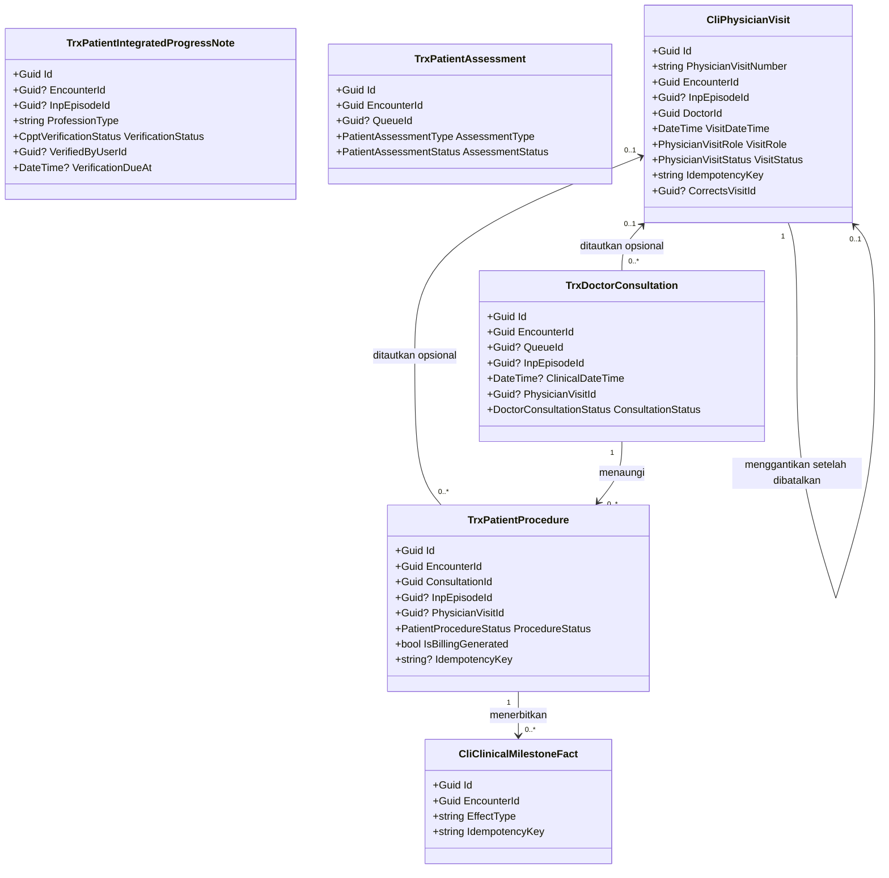
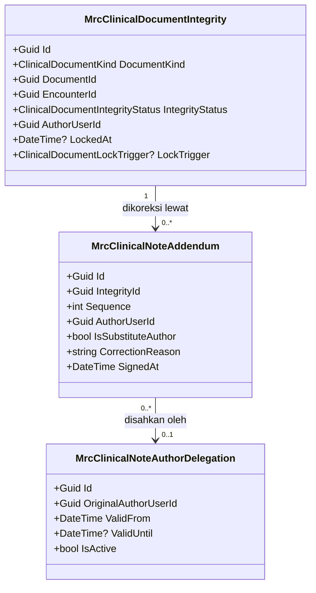
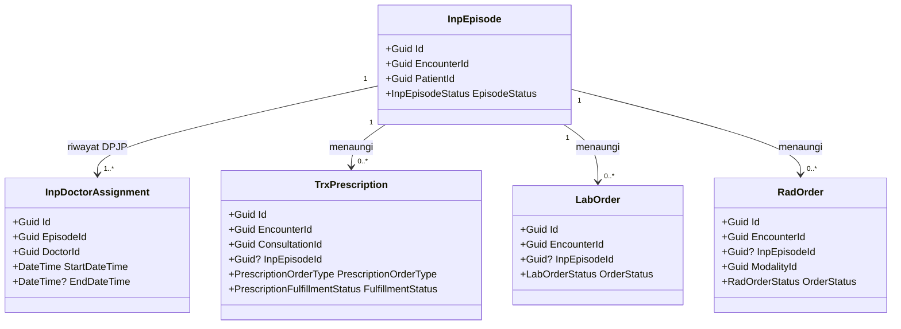
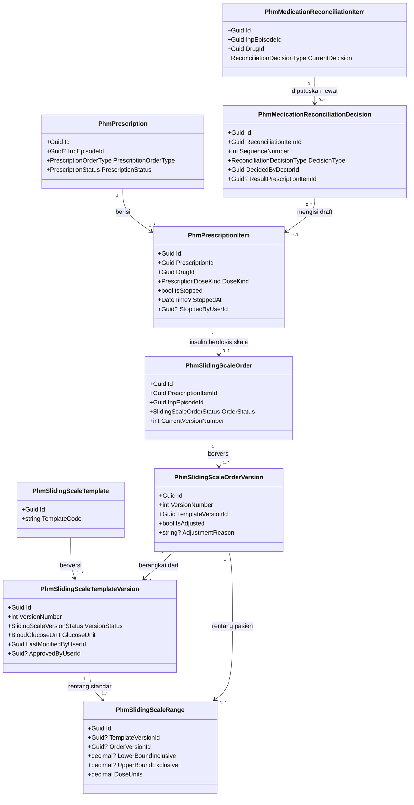
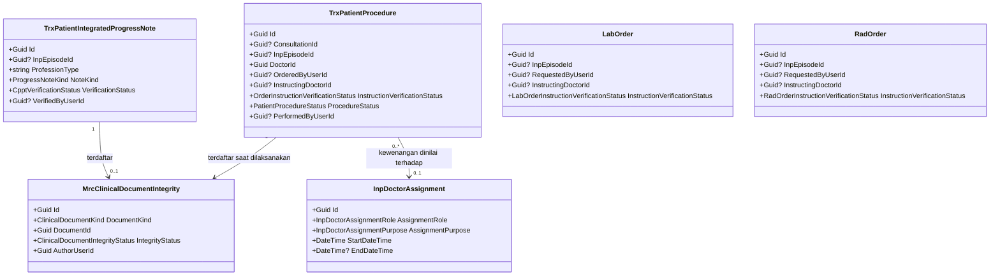

# Arsitektur Backend — Sub-modul `dokter-rawat-inap` (Rawat Inap)

| Field | Nilai |
| --- | --- |
| Blueprint ID | `RWI-BP-001` |
| Sub-modul | `dokter-rawat-inap` — satu dari tiga sub-modul modul `rawat-inap`, bentuk `COMPOSITE` sejak `RWI-DEC-082` |
| Revision | **`0.5`** — amandemen penyelarasan `PRD-RWI-V2-001`, fase `RLN-PH-06`, blueprint revision `7`. Isi baru ada pada **bagian 11**; bagian 0 s.d. 10 tetap berlaku kecuali yang disebut digantikan bagian 11.1 |
| Status | **`draft`** — revision `0.5` belum disetujui manusia. Revision `0.4` disetujui Muhammad Hamzah, 2026-09-09 |
| `approved_by` / `approved_at` | — untuk `0.5`. **Muhammad Hamzah** / **2026-09-09** untuk revision `0.4`; `0.3` disetujui 2026-09-03 |
| Tanggal | 2 September 2026 (`Asia/Jakarta`); diamendemen 9 September 2026; **diamendemen 15 September 2026** |
| Kemampuan | `CAP-015`, `CAP-020` s.d. `CAP-025` — `RWI-DEC-083` |
| Masukan baseline | `PRD-RWI-FINAL-001` v1.0.0 bagian 18, 19, 23.1, 30.3 |
| Masukan keputusan | [`../00-interview-decisions.md`](../00-interview-decisions.md) **revision `10`**, SHA-256 `de786bebc169636c0d7bd254d429a0209809890d78a7f1dcd8220d303fcbecc0` — `RWI-DEC-080` s.d. `RWI-DEC-088`; `RWI-DEC-038` dan `RWI-DEC-070` pelonggaran mesin klinis; `RWI-DEC-046` obat pulang; **`RWI-RULE-038` kapan catatan final dan bagaimana dikoreksi** |
| Masukan arsitektur domain | [`../evidence/03-hospital-domain-architecture.md`](../evidence/03-hospital-domain-architecture.md) revision `0.2` Bagian Kedua, SHA-256 `226c6ef1e4bfec544c366b265fe1e4530e80c510da33c1a9eaf2e62161d0b717` |
| `domain_architecture_readiness` | **`DOMAIN_ARCHITECTURE_READY`** untuk ketujuh capability — menggantikan `DOMAIN_ARCHITECTURE_NOT_RUN` pada revision `0.1` |
| Masukan keadaan saat ini | [`../01-existing-capability-map.md`](../01-existing-capability-map.md) revision `1.3` bagian 15 |
| Peta modul | [`../02-module-map.md`](../02-module-map.md) revision `1` |
| Sub-modul tetangga | [`../keperawatan/`](../keperawatan/) revision `0.1` — berbagi satu pelonggaran dan satu tabel |
| Backend SHA | `93b3227c431401d8f586dec4e1fb25fbf41766e3` (branch `MHamzah`) — **naik dari `5afb54b`** |
| Frontend SHA | `863f24b0d1617069310c04e5770b47fd1b518b5b` (branch `HamzahV2`) |
| Batas tulis | Hanya dokumen blueprint. Tidak ada source, migration, atau endpoint yang dibuat |

---

## 0. Apa yang berubah dari revision `0.1`

Revision `0.1` ditulis di atas snapshot `5afb54b` dan sebelum arsitektur domain dikerjakan. Enam hal
berubah secara material, dan setiap perubahan punya bukti.

| No | Yang berubah | Dari | Menjadi | Buktinya |
| ---: | --- | --- | --- | --- |
| 1 | Nama entity visite | `TrxPhysicianVisit` | **`CliPhysicianVisit`** | `QBE-NAM-001` melarang `Trx*` untuk kode baru; registry memberi prefix `Cli` untuk `ClinicalManagement` berstatus `ACTIVE`; `CliClinicalMilestoneFact.cs` membuktikan konvensinya sudah dipakai |
| 2 | Mekanisme koreksi dokumen final | Kolom `AmendedAt`, `AmendedByUserId`, `AmendReason` per tabel | **Memakai mesin integritas dan addendum milik `MedicalRecordManagement`** | `MrcClinicalDocumentIntegrity`, `MrcClinicalNoteAddendum`, dan `MrcClinicalNoteAuthorDelegation` sudah ada dan sudah menjangkau jenis dokumen `Consultation`, `Assessment`, `ProgressNote`, dan `Procedure` |
| 3 | Koreksi visite | `PATCH /{id}` menyunting waktu dan peran | **Batalkan lalu catat ulang** | `RWI-DEC-085` dan arsitektur domain bagian S.1: event menyatakan fakta kedatangan, menyuntingnya menghapus fakta lama tanpa jejak |
| 4 | Radiologi | "Modulnya belum ada", `CAP-015` masuk MVP sebagian | **Modulnya ada.** `CAP-015` masuk MVP penuh | `RadOrder`, `RadStudy`, `RadOrderController`, dan migration `20260828093000_AddRadiologyManagement` ada pada `BE@93b3227` |
| 5 | Defect jalur tanpa antrean | Tidak tercatat | **Perbaikan wajib sebelum rilis** | `DoctorConsultationController.cs` baris 258–265 mengambil antrean yang boleh kosong, lalu baris 360–366 menulis ke dalamnya tanpa pemeriksaan |
| 6 | Penomoran invariant dan integrasi | Nomor lokal `INV-DOK-01`–`05` dan `INT-DOK-01`–`08` | **Nomor kanonis dari arsitektur domain** | Bagian 1.3 dan `contracts/integration-contract.md` bagian 0 memuat tabel pemetaannya |

## 0.1 Apa yang berubah dari revision `0.2`

Tiga keputusan turun **setelah** revision `0.2` selesai ditulis, dan ketiganya menyentuh satu titik
yang sama: bagaimana catatan dokter dibetulkan setelah selesai.

| No | Yang berubah | Dari | Menjadi | Dasar |
| ---: | --- | --- | --- | --- |
| 1 | Makna "final" | Hanya nilai status pada catatan | **Selesai sama dengan tertanda tangan sama dengan terkunci.** Penekanan tombol Selesai diperlakukan sebagai tanda tangan penulis | `RWI-DEC-086`, `RWI-RULE-038` |
| 2 | Mesin keutuhan dokumen | Dianggap "dipakai apa adanya, nol perubahan" | **Tiga jenis dokumen wajib didaftarkan** ke sana saat finalisasi — catatan dokter, kajian medis, dan tindakan. Mesinnya sendiri tetap tidak berubah | `RWI-DEC-087`, `RWI-FACT-014` |
| 3 | Koreksi atas nama dokter berhalangan | Belum ditetapkan | **Hanya DPJP aktif episode itu**, dengan penetapan kepala unit rawat inap yang wajib berbatas waktu | `RWI-DEC-088` |

**Kenapa butir 2 penting.** Revision `0.2` mencabut enam kolom amandemen dengan alasan mesinnya
sudah ada. Alasan itu benar, tetapi tidak lengkap: mesin itu **hanya tersambung ke catatan
terpadu**. Tiga jenis dokumen lain tidak pernah mendaftarkan diri, sedangkan penyuntingan setelah
selesai sudah dilarang — sehingga hari ini catatan dokter yang sudah diselesaikan **tidak dapat
disunting dan tidak dapat dikoreksi**. Pencabutan kolomnya tetap benar; yang kurang adalah satu
langkah pendaftaran.

## 0.2 Apa yang berubah dari revision `0.3`

Satu hal, dan ia **membalik satu baris pada bagian 9**. Amendment ini tidak lahir dari keputusan
baru, melainkan dari layar yang akhirnya dibuat.

| No | Yang berubah | Dari | Menjadi | Dasar |
| ---: | --- | --- | --- | --- |
| 1 | Diagnosis terstruktur pada kajian medis | Hanya dapat lahir dari catatan dokter; pelonggarannya **ditolak** bagian 9 | **Boleh lahir dari kajian medis** dengan menyebut perawatan rawat inap sebagai konteks. `TrxPatientDiagnosis` naik menjadi `Diperbarui` — bagian 4.10 | `PRD-RWI-FINAL-001` `CAP-022` aturan 2 dan 5; temuan `FE-RWI-044`; `INT-DOK-10` |

**Kenapa pendirian bagian 9 dibalik untuk diagnosis, dan tidak untuk resep maupun tindakan.**
Bagian 9 menolak pelonggaran `ConsultationId` pada ketiganya dengan satu kalimat: "ketiganya memang
lahir dari konsultasi; yang perlu dibuka adalah konsultasinya". Kalimat itu ditulis 2 September,
**sebelum** kajian medis punya kolom isian medis dan sebelum layarnya ada.

Setelah `BE-RWI-045` menambahkan kolom isian medis pada 5 September dan `FE-RWI-044` membangun
layarnya, satu hal menjadi terlihat: **kajian medis awal bukan catatan harian.** Ia dokumen
tersendiri, dengan mesin status sendiri, yang justru lahir **sebelum** catatan harian pertama.
"Membuka konsultasinya" memang membuat dokter bisa menulis, tetapi memaksanya membuat catatan
harian yang tidak ia perlukan hanya sebagai gantungan diagnosis. Resep dan tindakan tidak punya
masalah itu — keduanya memang dicatat dari catatan yang menaunginya, sehingga **alasan bagian 9
tetap berlaku penuh bagi keduanya**.

> **Ini perubahan yang wajib dilihat pemilik, bukan penyelarasan diam-diam.** Baris bagian 9
> diperbarui apa adanya, kamus data diperbarui, dan alasannya ditulis di sini serta pada
> `contracts/integration-contract.md` bagian 10.1. Menolaknya adalah pilihan yang sah; yang tidak
> sah adalah membiarkan kontrak dan arsitektur mengatakan dua hal yang berbeda.

---

## 1. Bounded context, ownership, dan invariant

### 1.1 Kedudukan sub-modul ini

| Hal | Ketetapannya | Sumber |
| --- | --- | --- |
| Jenis konteks | **Workspace context** — menyajikan dan mengumpulkan, bukan memiliki | Arsitektur domain bagian Q.2 |
| Aggregate root yang dimiliki | **Nol** | `RWI-DEC-081` |
| Hubungan dengan `CTX-CLI`, `CTX-PHM`, `CTX-LAB`, `CTX-RAD`, `CTX-MRC` | **Pelanggan–pemasok.** Rawat Inap menyatakan kebutuhan; pemiliknya yang mengubah modelnya sendiri | Arsitektur domain bagian Q.1 |
| Hubungan dengan `CTX-BIL` | **Hilir satu arah.** Billing menerima fakta klinis, tidak pernah mengubahnya | `RWI-DEC-085`, arsitektur domain bagian Y |
| Transaction boundary | Tidak ada transaksi milik sub-modul ini | — |
| Yang benar-benar dimiliki | **Makna konteks klinis episode** (`CON-INP-015`) dan **kewenangan dokter atas pasien tertentu** | Arsitektur domain bagian Q.3 dan V.2 |

### 1.2 Konsep domain yang dipakai

Diambil apa adanya dari arsitektur domain bagian R. **Tidak diturunkan ulang di sini.**

| Konsep | ID | Klasifikasi | Ownership | Wujudnya pada source |
| --- | --- | --- | --- | --- |
| Konteks Klinis Episode | `CON-INP-015` | `VALUE_OBJECT` | `New`, milik Rawat Inap | **Dihitung, tidak disimpan.** Diwujudkan sebagai satu service bersama, bukan tabel |
| Catatan Dokter berisi SOAP | `CON-EXT-011` | `AGGREGATE_ROOT` | `Extend` | `TrxDoctorConsultation` |
| CPPT | `CON-EXT-012` | `AGGREGATE_ROOT` | `Extend` | `TrxPatientIntegratedProgressNote` |
| Kajian Medis Awal | `CON-EXT-013` | `AGGREGATE_ROOT` | `Extend` | `TrxPatientAssessment` dengan pembeda jenis — lihat 4.2 |
| Tindakan Dokter | `CON-EXT-014` | `AGGREGATE_ROOT` | `Extend` | `TrxPatientProcedure` |
| Event Visite Dokter | `CON-EXT-015` | `AGGREGATE_ROOT` | **`New`** | **`CliPhysicianVisit`** — belum ada |
| Fakta Klinis untuk Billing | `CON-EXT-016` | `DOMAIN_EVENT` | `Existing` | `CliClinicalMilestoneFact` beserta producer-nya |
| Resep dan jenis resep | `CON-EXT-017`, `CON-EXT-018` | `AGGREGATE_ROOT`, `VALUE_OBJECT` | `Extend` | `TrxPrescription` |
| Pesanan Laboratorium | `CON-EXT-019` | `AGGREGATE_ROOT` | `Extend` | `LabOrder` |
| Pesanan Radiologi dan Studi | `CON-EXT-020` | `AGGREGATE_ROOT` | `Extend` | `RadOrder`, `RadStudy` |
| Integritas, addendum, dan pendelegasian penulis | `CON-EXT-021` s.d. `CON-EXT-023` | `ENTITY` | `Existing` | `MrcClinicalDocumentIntegrity`, `MrcClinicalNoteAddendum`, `MrcClinicalNoteAuthorDelegation` |

### 1.3 Invariant — memakai penomoran kanonis arsitektur domain

Ketiga belas invariant `INV-DOK-01` s.d. `INV-DOK-13` didefinisikan pada arsitektur domain bagian
S.0 dan **tidak ditulis ulang di sini**. Yang ditulis di sini hanya **bagaimana backend
menegakkannya**.

| Invariant | Ditegakkan di mana | Bentuk penegakan |
| --- | --- | --- |
| `INV-DOK-01` dokumen terikat tepat satu episode | Service konteks klinis bersama, dipanggil setiap perintah tulis | Resolusi episode dari `EncounterId`; permintaan tanpa episode ditolak |
| `INV-DOK-02` pasien dokumen sama dengan pasien episode | Service yang sama | Pembandingan `PatientId` dokumen, kunjungan, dan episode |
| `INV-DOK-03` episode `Closed`/`Cancelled` menolak dokumen baru | Service yang sama | Pemeriksaan `InpEpisode.EpisodeStatus`; addendum tetap diterima |
| `INV-DOK-04` banyak catatan, resep, dan tindakan sepanjang episode | `DoctorConsultationController`, `PrescriptionController` | Pelonggaran batas, disaring tipe kunjungan |
| `INV-DOK-05` perilaku rawat jalan dan MCU tidak berubah | Controller yang sama | Cabang pelonggaran hanya menyala untuk `Inpatient` dan `Emergency`; dijaga test regresi |
| `INV-DOK-06` satu kunci permintaan satu event | Database | **Unique index** pada `CliPhysicianVisit.IdempotencyKey` |
| `INV-DOK-07` visite tidak diturunkan dari SOAP/CPPT | Struktur | Tidak ada satu pun jalur yang membuat event visite lahir dari penyimpanan catatan |
| `INV-DOK-08` event batal tetap tersimpan dan tidak dihitung | Model dan query | `VisitStatus = Cancelled`; seluruh query hitungan menyaring `Recorded` |
| `INV-DOK-09` Billing tidak mengubah catatan klinis | Arah kontrak | Catatan klinis disimpan lebih dulu; fakta diterbitkan sesudahnya, satu arah |
| `INV-DOK-10` dokumen final tidak disunting di tempat | `MedicalRecordManagement` | Mesin integritas mengunci dokumen; koreksi lewat addendum bernomor urut |
| `INV-DOK-11` verifikasi CPPT hanya oleh DPJP aktif | Service klinis | `InpEpisodeService.IsActiveDoctorAsync` pada saat verifikasi |
| `INV-DOK-12` hanya hasil final terverifikasi milik episode yang dibaca | Query pembacaan | Penyaring kunjungan milik episode ditambah penyaring status hasil |
| `INV-DOK-13` kewenangan atas pasien ini, bukan hanya peran | Setiap perintah klinis | `IsActiveDoctorAsync`, di **dalam** perintah, bukan di lapisan luar |

### 1.4 Dua aturan batas milik sub-modul ini

Keduanya bukan invariant domain, melainkan **batas kepemilikan** yang lahir dari `RWI-DEC-081`.
Dinomori tersendiri supaya tidak bertabrakan dengan penomoran kanonis.

| ID | Aturan | Dasar |
| --- | --- | --- |
| `RUL-DOK-01` | Rawat Inap **tidak pernah** menulis status pemenuhan resep maupun menandai obat sudah diserahkan. Statusnya hanya dibaca dari Farmasi | PRD `CAP-023` aturan 6, `RWI-RULE-024` |
| `RUL-DOK-02` | Rawat Inap **tidak pernah** menyalin hasil laboratorium maupun radiologi menjadi baris kebenaran baru | PRD `CAP-015` aturan 4, `AC-CAP015-02`, arsitektur domain bagian R.4 |

> **Pemetaan dari penomoran revision `0.1`.** Pembaca dokumen lama perlu tabel ini sekali saja.
>
> | Nomor lama | Bunyinya dulu | Sekarang menjadi |
> | --- | --- | --- |
> | `INV-DOK-01` | Dokumentasi hanya bila ada episode `Admitted` | `INV-DOK-01` ditambah `INV-DOK-02` dan `INV-DOK-03` kanonis |
> | `INV-DOK-02` | Episode `Closed` menolak dokumentasi baru | `INV-DOK-03` kanonis |
> | `INV-DOK-03` | Visite dicatat, bukan disimpulkan | `INV-DOK-07` kanonis |
> | `INV-DOK-04` | Tidak pernah menandai obat diserahkan | `RUL-DOK-01` |
> | `INV-DOK-05` | Tidak pernah menyalin hasil penunjang | `RUL-DOK-02` |

---

## 2. Tabel kepemilikan data

> Tabel kepemilikan data **seluruh modul** ada di [`../02-module-map.md`](../02-module-map.md)
> bagian 2. Yang di bawah ini hanya kelompok data yang disentuh sub-modul ini.

### 2.1 Yang dipakai, tidak dibuat ulang

| Kelompok data | Modul pemilik | Dipakai sub-modul ini | Dibuat ulang |
| --- | --- | :---: | --- |
| Episode rawat inap, penugasan DPJP | `episode-rawat-inap` | Konteks dan kewenangan | **Tidak** |
| Kajian medis awal | `ClinicalManagement` | Ya — ditulis lewat endpoint modul itu | **Tidak** — `RWI-DEC-081` |
| Konsultasi dan SOAP | `ClinicalManagement` | Ya | **Tidak** |
| CPPT | `ClinicalManagement` | Ya — **kontraknya milik sub-modul ini** (`CAP-021`) | **Tidak** |
| Diagnosis dan daftar masalah | `ClinicalManagement` | Ya — **satu kolom diminta dan satu kewajiban dilonggarkan** pada `0.4`, bagian 4.10 | **Tidak** — `RWI-DEC-081` |
| Tindakan dokter | `ClinicalManagement` | Ya | **Tidak** |
| **Event visite dokter** | `ClinicalManagement` | Ya — **konsep baru, diminta kepada pemiliknya** | **Tidak.** Nama `Inp*` dilarang |
| Integritas dokumen, addendum, pendelegasian penulis | `MedicalRecordManagement` | Ya — dipakai apa adanya | **Tidak** |
| Fakta klinis untuk Billing | `ClinicalManagement` | Ya — sudah ada | **Tidak** |
| Resep | `PharmacyManagement` | Ya — dibuat; **status pemenuhannya hanya dibaca** | **Tidak** — `RUL-DOK-01` |
| Pesanan dan hasil laboratorium | `LaboratoryManagement` | Pesanan dibuat; hasil **hanya dibaca** | **Tidak** — `RUL-DOK-02` |
| **Pesanan, studi, dan hasil radiologi** | `RadiologyManagement` | Pesanan dibuat; hasil **hanya dibaca** | **Tidak** — `RUL-DOK-02` |
| Tanda vital, alergi, riwayat penyakit | `ClinicalManagement` | Dibaca | **Tidak** |

### 2.2 Yang belum ada di mana pun dan diminta kepada pemiliknya

| Kelompok data | Modul pemilik | Keadaan hari ini | Diminta oleh |
| --- | --- | --- | --- |
| Event visite dokter | `ClinicalManagement` | **Tidak ada.** Pencarian `PhysicianVisit` pada `Areas` dan `Migrations` di `BE@93b3227` menghasilkan nol kecocokan | `CAP-025`, bagian 4.6 |

**Satu tabel baru. Itu saja.** Enam kemampuan lain berdiri di atas tabel yang sudah ada.

### 2.3 Nol baris kepemilikan yang belum diputuskan

Ketujuh kemampuan sub-modul ini punya pemilik data yang tegas pada PRD 23.1 dan `RWI-DEC-081`.
Tidak ada `OPEN DECISION` kepemilikan di sini.

---

## 3. Tiga penghalang teknis, bukan lagi dua

Revision `0.1` mencatat dua penghalang. Impact scan pada `BE@93b3227` menemukan **satu lagi**, dan
yang ketiga ini adalah yang paling berbahaya karena berwujud kegagalan sistem.

### 3.1 Penghalang 1 — konteks klinis episode belum dikenali

| Berkas | Method | Yang dijaga |
| --- | --- | --- |
| `Areas/HealthServices/ClinicalManagement/Controllers/PatientAssessmentController.cs` | `ValidateRequestAsync` | Pengkajian — dibahas juga oleh `keperawatan` |
| `Areas/HealthServices/ClinicalManagement/Controllers/DoctorConsultationController.cs` | `ValidateRequestAsync` | **Konsultasi** — pintu bagi SOAP, diagnosis, resep, dan tindakan |

Keduanya hanya mengenali kunjungan yang punya baris IGD. Pencarian `InpEpisode` maupun `EpisodeId`
pada kedua controller **tidak menemukan satu pun cabang rawat inap** — `DOK-TRC-INT-01`.

**Kenapa membuka pengkajian saja tidak cukup.** Empat kemampuan bergantung pada konsultasi:

| Kemampuan | Bergantung pada konsultasi karena |
| --- | --- |
| `CAP-020` SOAP | Kolom `Subjective`, `Objective`, dan seterusnya **berada di dalam** `TrxDoctorConsultation` |
| `CAP-023` Resep | `TrxPrescription.ConsultationId` **wajib**, bukan nullable |
| `CAP-024` Tindakan | `TrxPatientProcedure.ConsultationId` **wajib** |
| Diagnosis | `TrxPatientDiagnosis.ConsultationId` **wajib** |

### 3.2 Penghalang 2 — jalur tanpa antrean berujung kegagalan sistem ★ baru

| Hal | Isinya |
| --- | --- |
| Bukti | `BE@93b3227 DoctorConsultationController.cs` baris 258–265 mengambil antrean **yang boleh kosong**; baris 360–366 menulis `queue.QueueStatus` dan waktu konsultasi **tanpa memeriksa kosong lebih dulu** |
| Akibat | Setiap permintaan tanpa antrean berujung kegagalan sistem — kode `500` |
| Siapa yang terkena | Pasien rawat inap **dan** pasien IGD, karena keduanya memakai jalur yang sama |
| Status | `Repair` — `DOK-TRC-DEF-01` |
| Kenapa ini butir arsitektur, bukan sekadar bug | Jalur tanpa antrean adalah **satu-satunya** jalur pasien rawat inap. Selama ia meledak, `RWI-DEC-038` tidak pernah benar-benar berlaku |

> **Urutan yang tidak boleh dibalik.** Perbaikan ini dikerjakan **sebelum atau bersamaan** dengan
> pembukaan cabang episode. Membuka cabang episode lebih dulu berarti mengundang pasien rawat inap
> masuk ke jalur yang sudah diketahui gagal.

### 3.3 Penghalang 3 — batas jumlah konsultasi dan resep

| Bukti | Isinya |
| --- | --- |
| `DoctorConsultationController.cs#ValidateRequestAsync` sekitar baris 844–850 dan 916–923 | Menolak konsultasi kedua pada satu `EncounterId` |
| `PharmacyManagement/Controllers/PrescriptionController.cs#ValidateCreateRequestAsync` sekitar baris 555–563 | Menolak resep aktif kedua |

| Tanpa pelonggaran | Akibatnya bagi pasien rawat inap |
| --- | --- |
| Satu konsultasi per kunjungan | Dokter hanya dapat menulis **satu** SOAP untuk seluruh masa perawatan |
| Satu resep aktif per konsultasi | Pasien yang dirawat sepuluh hari hanya dapat menerima satu resep |

Keduanya `approved` sejak `RWI-DEC-038`, diperluas `RWI-DEC-070`. Yang belum ada kodenya —
`DOK-TRC-INT-02`.

### 3.4 Bentuk yang diminta

| Hal | Ketetapannya |
| --- | --- |
| Pemilik perubahan | `ClinicalManagement` dan `PharmacyManagement` — Muhammad Hamzah, disetujui `RWI-DEC-062` |
| Bentuk | Satu **service konteks klinis bersama** yang menjawab `CON-INP-015`, dipanggil kedua controller |
| Yang **tidak** berubah | Perilaku rawat jalan dan medical check-up — `INV-DOK-05`, `RWI-AC-143` |
| Nol kolom baru untuk pelonggaran ini | Kedua `QueueId` **sudah** nullable |
| Prasyarat lintas sub-modul | Cabang pengkajian (`keperawatan`) dan cabang konsultasi **wajib dikerjakan bersama** — `INT-DOK-01` |

---

## 4. Entity: yang ada, yang diperluas, yang diminta baru

### 4.0 Class diagram

Dipecah menjadi tiga, mengikuti bounded context pemiliknya, supaya setiap diagram muat dibaca dalam
satu layar. Hanya field kunci, status, dan field yang dipakai aturan bisnis yang ditampilkan; field
lengkap ada di [`data/data-dictionary.md`](./data/data-dictionary.md).

#### 4.0.1 Dokumentasi klinis dokter — `CTX-CLI`



**Yang perlu dibaca dari diagram ini.** Tiga panah putus arah ke `CliPhysicianVisit` semuanya
`0..1` dan opsional. Itulah wujud `INV-DOK-07`: catatan boleh ada tanpa event, dan event boleh ada
tanpa catatan. Panah dari `CliPhysicianVisit` ke dirinya sendiri adalah jalur koreksi — event baru
menunjuk event yang dibatalkannya, bukan menimpanya.

#### 4.0.2 Integritas dokumen — `CTX-MRC`



`DocumentKind` menautkan mesin ini ke dokumen mana pun tanpa foreign key langsung, sehingga satu
mesin melayani konsultasi, kajian, CPPT, dan tindakan sekaligus. **Nol perubahan diminta di sini.**

#### 4.0.3 Konteks episode dan penunjang — `CTX-INP-CARE`, `CTX-PHM`, `CTX-LAB`, `CTX-RAD`



Seluruh panah dari `InpEpisode` adalah **konteks**, bukan kepemilikan: episode menaungi dokumen
yang lahir selama perawatan, tetapi tabelnya tetap milik modul masing-masing. Menutup episode
**tidak** menghapus satu pun baris di sebelah kanan — arsitektur domain bagian T.2.

### 4.1 `TrxDoctorConsultation` — `Diperbarui` — `CAP-020`

| Aspek | Penjelasan |
| --- | --- |
| **Status** | `Diperbarui` |
| **Lokasi file** | `Areas/HealthServices/ClinicalManagement/Models/TrxDoctorConsultation.cs` |
| Kategori | Transaksi klinis |
| Pemilik | `ClinicalManagement` |
| Tanggung jawab utama | Menyimpan satu catatan pemeriksaan dokter beserta isi SOAP-nya. Pada sistem ini catatan dokter dan konsultasi adalah objek yang sama |
| Field penting | `EncounterId`, `QueueId` (nullable), `PatientId`, `DoctorId`, `ConsultationStatus`, `Subjective`, `Objective` dan seterusnya |
| Relasi | Milik satu kunjungan; punya banyak diagnosis, tindakan, dan resep |
| Pemakaian dalam alur bisnis | Dibuat setiap kali dokter memeriksa pasien; difinalkan setelah isinya lengkap |
| Catatan desain | Jangan memecah SOAP menjadi tabel sendiri. Jangan menyunting isi setelah final — koreksi lewat addendum |
| Ekuivalen model lama | — |

| Kolom yang diminta | Tipe | Wajib | Bawaan | Kenapa | Sensitif |
| --- | --- | :---: | --- | --- | :---: |
| `InpEpisodeId` | `Guid?` | Tidak | `null` | Konteks episode dapat ditelusuri tanpa menghitung ulang lewat kunjungan | Tidak |
| `ClinicalDateTime` | `DateTime?` | Tidak | `null` | Membedakan **waktu klinis** dari waktu penulisan. Visite pukul 07.40 yang ditulis pukul 11.00 harus terbaca pada pukul 07.40 | Tidak |
| `PhysicianVisitId` | `Guid?` | Tidak | `null` | Tautan **opsional** ke event visite — `INV-DOK-07`. **Berganti nama** dari `VisitId` supaya tidak tertukar dengan kunjungan IGD | Tidak |

| Index diminta | Bentuk | Kenapa |
| --- | --- | --- |
| `IX_TrxDoctorConsultation_InpEpisodeId` | `(InpEpisodeId, ClinicalDateTime)` | Lini masa SOAP satu episode, terurut waktu klinis |

`DeleteBehavior` pada `InpEpisodeId`: `Restrict`. Pada `PhysicianVisitId`: `SetNull`.

> **Kenapa `InpEpisodeId` disimpan padahal kunjungan sudah cukup.** `INV-INP-04` menjamin satu
> episode menempel pada tepat satu kunjungan, sehingga episode **dapat** diturunkan dari kunjungan.
> Kolom ini tetap diminta karena dua alasan praktis: pertanyaan "episode A atau episode B" harus
> dijawab tanpa join berlapis pada setiap pembacaan lini masa, dan penjagaan `INV-DOK-01` menjadi
> pemeriksaan satu kolom, bukan penelusuran. **Keduanya wajib sepakat**: bila `InpEpisodeId` terisi
> tetapi tidak cocok dengan episode milik `EncounterId`, permintaan ditolak — `VAL-DOK-26`.

### 4.2 `TrxPatientAssessment` — `Diperbarui` — `CAP-022` ★ butuh persetujuan struktur

Kajian medis awal punya dua jalan yang sama-sama masuk akal. Arsitektur domain bagian S.4 menyatakan
keduanya menghasilkan **model domain yang sama**, dan menyerahkan bentuk penyimpanannya ke sini.

| Jalan | Isinya | Dipilih? |
| --- | --- | :---: |
| **A. Pakai ulang `TrxPatientAssessment` dengan pembeda jenis** | Kajian medis menjadi nilai baru pada `AssessmentType` yang sudah diminta `keperawatan` | **Ya** |
| B. Bentuk penyimpanan tersendiri | Kajian medis punya tabelnya sendiri | Tidak |

**Kenapa A.** `TrxPatientAssessment` sudah memuat keluhan utama, riwayat, alergi, tanda vital,
kesadaran, dan pemeriksaan umum, dan **sudah punya kolom `DoctorId`** — ia memang tidak pernah
menjadi tabel milik perawat saja. Jalan B menyalin puluhan kolom yang sama, dan menyalin kolom
adalah persis yang dicegah tabel kepemilikan data.

**Keberatan yang wajib diketahui pemilik sebelum menyetujui.** Arsitektur domain bagian S.4
mencatat bahwa isian yang ada hari ini **bercorak keperawatan** — tingkat kesadaran, risiko jatuh,
status gizi, kemandirian — sedangkan kajian medis menuntut anamnesis, pemeriksaan fisik, diagnosis
kerja, dan rencana terapi. Jalan A karena itu menuntut penambahan isian medis pada tabel yang sama.

| Akibat jalan A | Cara menanganinya |
| --- | --- |
| Enum `PatientAssessmentType` dipakai bersama `keperawatan` | Siapa pun yang mendarat lebih dulu membuatnya; yang kedua menambah nilainya — `INT-DOK-09` |
| Validasi bercabang menurut jenis | `validation-matrix.md` bagian 3 |
| Kewenangan bercabang menurut jenis, dan mesin hak akses **tidak** melihat jenis | `VAL-DOK-05`; risikonya ditulis pada `permission-audit-matrix.md` bagian 3 |
| Pembaca dapat mengira kajian medis adalah pengkajian keperawatan | Ruang kerja memisahkan keduanya di layar — `03-frontend-architecture.md` bagian 3.2 |

**Bila pemilik memilih jalan B**, yang berubah hanya bagian ini dan kamus datanya; kontrak API,
kewenangan, dan alur tetap sama. Karena itu ia **tidak** menahan gelombang pengiriman.

| Kolom yang diminta | Tipe | Wajib | Bawaan | Kenapa |
| --- | --- | :---: | --- | --- |
| `AssessmentType` | `enum` | Ya | `Initial` | Nilai baru `MedicalInitial` dan `MedicalReassessment` ditambahkan pada enum yang sama |

Kolom `InpEpisodeId`, `DueAt`, dan `PolicyId` **sudah diminta** `keperawatan`; sub-modul ini
memakainya apa adanya dan **tidak meminta duplikatnya**.

> `AC-CAP022-02` menuntut kajian medis dan SOAP punya record serta lifecycle berbeda. Terpenuhi:
> kajian medis hidup di `TrxPatientAssessment`, SOAP hidup di `TrxDoctorConsultation` — dua tabel
> berbeda dengan mesin status yang berbeda.

### 4.3 `TrxPatientIntegratedProgressNote` — `Diperbarui` — `CAP-021`

| Aspek | Penjelasan |
| --- | --- |
| **Status** | `Diperbarui` |
| **Lokasi file** | `Areas/HealthServices/ClinicalManagement/Models/TrxPatientIntegratedProgressNote.cs` |
| Kategori | Transaksi klinis lintas profesi |
| Pemilik | `ClinicalManagement`; **kontraknya milik sub-modul ini** — `CAP-021`, `RWI-DEC-083` |
| Tanggung jawab utama | Menyimpan satu catatan perkembangan pada lembar terpadu, beserta profesi dan penulisnya |
| Field penting | `EncounterId`, `ProfessionType`, `ProviderUserId`, `NoteDateTime`, ringkasan S/O/A/P |
| Relasi | Menempel pada kunjungan; dapat merujuk konsultasi dan pengkajian |
| Catatan desain | Verifikasi **tidak pernah** menulis ulang `ProviderUserId` |

| Kolom yang diminta | Tipe | Wajib | Bawaan | Kenapa | Sensitif |
| --- | --- | :---: | --- | --- | :---: |
| `InpEpisodeId` | `Guid?` | Tidak | `null` | Konteks episode — `INV-DOK-01` | Tidak |
| `VerificationStatus` | `enum` | Ya | `NotRequired` | Verifikasi DPJP **bila diwajibkan** | Tidak |
| `VerifiedAt` | `DateTime?` | Tidak | `null` | Waktu verifikasi | Tidak |
| `VerifiedByUserId` | `Guid?` | Tidak | `null` | **Verifikator bukan penulis asli** — `INV-DOK-11` | Tidak |
| `VerificationDueAt` | `DateTime?` | Tidak | `null` | Batas waktu terpantau daftar pantau | Tidak |

`CpptVerificationStatus`: `NotRequired`, `Pending`, `Verified`, `Overdue`. Bawaan `NotRequired`.

> **Bawaan `NotRequired`, bukan `Pending`.** PRD menulis "**bila** verifikasi DPJP diwajibkan".
> Menyalakannya sebagai bawaan membuat setiap catatan perawat langsung terhitung menunggu
> verifikasi pada rumah sakit yang tidak mewajibkannya, dan daftar pantau penuh sejak hari pertama.

> **Tiga kolom amandemen dari revision `0.1` dicabut.** `AmendedAt`, `AmendedByUserId`, dan
> `AmendReason` **tidak jadi diminta**, karena mesinnya sudah ada di `MedicalRecordManagement`:
> `MrcClinicalNoteAddendum` sudah menyimpan nomor urut, penulis, penanda penulis pengganti, teks
> addendum, **alasan koreksi**, waktu tanda tangan, dan perangkat penandatangan. Menambah kolom
> tandingan berarti dua tempat menyimpan alasan koreksi yang sama. Lihat 4.9.

### 4.4 `TrxPatientProcedure` — `Diperbarui` — `CAP-024`

| Aspek | Penjelasan |
| --- | --- |
| **Status** | `Diperbarui` |
| **Lokasi file** | `Areas/HealthServices/ClinicalManagement/Models/TrxPatientProcedure.cs` |
| Pemilik | `ClinicalManagement` |
| Tanggung jawab utama | Menyimpan tindakan yang direncanakan dan yang dikerjakan, beserta rujukan tarif dan penanda penagihan |
| Field penting | `EncounterId`, `ConsultationId`, `ProcedureStatus`, `IsExecuted`, `ExecutedAt`, `PerformedAt`, `TariffId`, `BillingItemId`, `IsBillingGenerated` |
| Catatan desain | Catatan klinis disimpan lebih dulu, fakta ke Billing diterbitkan sesudahnya — `INV-DOK-09` |

| Kolom yang diminta | Tipe | Wajib | Bawaan | Kenapa |
| --- | --- | :---: | --- | --- |
| `InpEpisodeId` | `Guid?` | Tidak | `null` | `INV-DOK-01` |
| `PhysicianVisitId` | `Guid?` | Tidak | `null` | Tautan **opsional** ke event visite — arsitektur domain bagian S.6 |
| `IdempotencyKey` | `string?` | Tidak | `null` | Percobaan ulang tidak melahirkan tindakan dan tagihan ganda — `AC-CAP024-02` |

| Constraint | Bentuk | Kenapa |
| --- | --- | --- |
| Unique parsial `IdempotencyKey` | `WHERE "IdempotencyKey" IS NOT NULL AND "IsDelete" = false` | Dijaga database, bukan hanya service |

> **Dua kolom dari revision `0.1` dicabut.** `ProcedureRecordType` tidak jadi diminta karena
> `ProcedureStatus` yang sudah ada memuat `Planned` beserta penanda `IsExecuted`, `ExecutedAt`, dan
> `PerformedAt` — perbedaan rencana dan pelaksanaan **sudah** terwakili. `BillingDispatchStatus`
> juga tidak jadi diminta: hasil penerbitan fakta sudah dinyatakan `ClinicalFactEmissionKind`
> beserta `IsBillingGenerated` dan `BillingGeneratedAt`. Menambah kolom status ketiga membuat tiga
> sumber jawaban untuk satu pertanyaan.

### 4.5 `TrxPrescription` — `Diperbarui` — `CAP-023`

| Aspek | Penjelasan |
| --- | --- |
| **Status** | `Diperbarui` |
| **Lokasi file** | `Areas/HealthServices/PharmacyManagement/Models/TrxPrescription.cs` |
| Pemilik | `PharmacyManagement` |
| Tanggung jawab utama | Menyimpan resep beserta status resep, pembayaran, dan pemenuhannya |
| Field penting | `EncounterId`, `ConsultationId` (**wajib**), `PrescriptionStatus`, `PaymentStatus`, `FulfillmentStatus` |
| Catatan desain | Sub-modul ini **membaca** ketiga status itu dan tidak pernah menulisnya — `RUL-DOK-01` |

| Kolom yang diminta | Tipe | Wajib | Bawaan | Kenapa |
| --- | --- | :---: | --- | --- |
| `InpEpisodeId` | `Guid?` | Tidak | `null` | `INV-DOK-01` |
| `PrescriptionOrderType` | `enum` | Ya | `Routine` | **Obat pulang menjadi jenis resep yang eksplisit** — `RWI-RULE-024`, `RWI-DEC-046`, `AC-CAP023-03` |
| `IdempotencyKey` | `string?` | Tidak | `null` | Percobaan ulang tidak melahirkan resep ganda |

`PrescriptionOrderType`: `Routine`, `Daily`, `Discharge`. Bawaan `Routine`.

> **Kenapa melonggarkan aturan resep saja tidak cukup.** `ConsultationId` **wajib**. Selama
> konsultasi kedua masih ditolak, dokter tidak punya tempat sah untuk menggantungkan resep kedua.
> Inilah alasan `RWI-DEC-070` melonggarkan aturan 3, 4, dan 5 sekaligus.

### 4.6 `CliPhysicianVisit` — `Baru`, milik `ClinicalManagement` — `CAP-025`

**Satu-satunya tabel yang benar-benar baru pada sub-modul ini.**

| Aspek | Penjelasan |
| --- | --- |
| **Status** | `Baru` |
| **Lokasi file** | `Areas/HealthServices/ClinicalManagement/Models/CliPhysicianVisit.cs` |
| **Configuration** | `Repositories/Configurations/HealthServices/ClinicalManagement/CliPhysicianVisitConfiguration.cs` |
| Nama tabel | `public."CliPhysicianVisit"` — tunggal, PascalCase |
| `DbSet` | `CliPhysicianVisits` |
| Kategori | Transaksi klinis |
| Pemilik | `ClinicalManagement` |
| Tanggung jawab utama | Menyatakan bahwa seorang dokter benar-benar mendatangi pasien pada waktu tertentu. Satu baris sama dengan satu kunjungan nyata |
| Relasi | Menempel pada kunjungan dan episode; **boleh** menunjuk konsultasi, CPPT, atau tindakan |
| Pemakaian dalam alur bisnis | Dibuat dokter setiap kali ia selesai mendatangi pasien |
| Catatan desain | Jangan menurunkannya dari SOAP. Jangan menyuntingnya setelah tersimpan. Jangan menguncinya "satu per dokter per tanggal" |
| Ekuivalen model lama | — |

> **Kenapa `Cli`, bukan `Trx`.** `QBE-NAM-001` melarang `Trx*` untuk kode baru. Registry
> kepemilikan prefix memberi `ClinicalManagement` prefix **`Cli`** berstatus `ACTIVE`, dan
> `CliClinicalMilestoneFact.cs` membuktikan konvensi itu sudah dipakai di modul yang sama.
> Revision `0.1` menulis `TrxPhysicianVisit`, dan itu **keliru**.

| Kolom | Tipe | Wajib | Bawaan | Kenapa | Sensitif |
| --- | --- | :---: | --- | --- | :---: |
| `Id` | `Guid` | Ya | `Guid.NewGuid()` | Kunci utama | Tidak |
| `PhysicianVisitNumber` | `string(30)` | Ya | — | Nomor bisnis yang terbaca manusia, dialokasikan service lewat provider number-series | Tidak |
| `EncounterId` | `Guid` | Ya | — | Jangkar klinis | Tidak |
| `InpEpisodeId` | `Guid?` | Tidak | `null` | Konteks episode; nullable agar visite non-rawat-inap kelak muat | Tidak |
| `PatientId` | `Guid` | Ya | — | Penjaga salah pasien — `INV-DOK-02` | Tidak |
| `DoctorId` | `Guid` | Ya | — | Subjek fakta | Tidak |
| `VisitDateTime` | `DateTime` | Ya | — | **Waktu kedatangan, bukan waktu pencatatan** — `RWI-AC-150` | Tidak |
| `VisitRole` | `enum` | Ya | `Dpjp` | DPJP, konsulen, atau dokter jaga — `RWI-AC-153` | Tidak |
| `VisitStatus` | `enum` | Ya | `Recorded` | **Baru pada revision `0.2`.** Menjaga `INV-DOK-08` | Tidak |
| `ConsultationId` | `Guid?` | Tidak | `null` | Tautan **opsional** ke catatan dokter | Tidak |
| `ProgressNoteId` | `Guid?` | Tidak | `null` | Tautan **opsional** ke CPPT | Tidak |
| `PatientProcedureId` | `Guid?` | Tidak | `null` | Tautan **opsional** ke tindakan — **baru**, dituntut `RWI-AC-153` | Tidak |
| `Note` | `string(1000)?` | Tidak | `null` | Catatan singkat | **Ya** |
| `RecordedByUserId` | `Guid` | Ya | — | Pelaku pencatatan | Tidak |
| `IdempotencyKey` | `string(100)` | **Ya** | — | **Berubah dari opsional menjadi wajib.** `INV-DOK-06` tidak dapat dijamin bila kuncinya boleh kosong | Tidak |
| `CancelledAt` | `DateTime?` | Tidak | `null` | Waktu pembatalan | Tidak |
| `CancelledByUserId` | `Guid?` | Tidak | `null` | Pelaku pembatalan | Tidak |
| `CancelReason` | `string(500)?` | Tidak | `null` | **Alasan wajib saat membatalkan** | **Ya** |
| `CorrectsVisitId` | `Guid?` | Tidak | `null` | Menunjuk event yang digantikannya, bila baris ini adalah pencatatan ulang setelah koreksi | Tidak |

`PhysicianVisitRole`: `Dpjp`, `Consultant`, `OnCall`. Bawaan `Dpjp`.
`PhysicianVisitStatus`: `Recorded`, `Cancelled`. Bawaan `Recorded`.

| Constraint | Bentuk | Kenapa |
| --- | --- | --- |
| **Unique penuh** `IdempotencyKey` | `UNIQUE ("IdempotencyKey")` | `INV-DOK-06`, `RWI-AC-152`, `RWI-AC-155`. Bukan unique parsial, karena kuncinya kini wajib terisi dan **kunci event yang dibatalkan pun tidak boleh dipakai ulang** |
| Index | `(InpEpisodeId, VisitDateTime)` | Riwayat visite satu episode, terurut |
| Index | `(DoctorId, VisitDateTime)` | Hitungan operasional per dokter |
| **Tidak ada** unique pada `(EpisodeId, DoctorId, tanggal)` | — | `RWI-DEC-085`: dua visite nyata pada hari yang sama adalah **dua** event. Menguncinya memaksa petugas berbohong |

> **Kenapa koreksi berbentuk batal lalu catat ulang, bukan sunting.** Arsitektur domain bagian S.1
> menyatakannya: event menyatakan fakta "dokter datang pukul sekian". Menyunting waktunya mengubah
> fakta tanpa ada yang tahu bahwa ia pernah berbunyi lain. Karena itu revision `0.2` **mencabut**
> `PATCH /{id}` yang menyunting waktu dan peran pada revision `0.1`.

### 4.7 `LabOrder` — `Diperbarui` — `CAP-015`

| Aspek | Penjelasan |
| --- | --- |
| **Status** | `Diperbarui` |
| **Lokasi file** | `Areas/HealthServices/LaboratoryManagement/Models/LabOrder.cs` |
| Pemilik | `LaboratoryManagement` — prefix `Lab`, lifecycle **`ACTIVE`** sejak 2026-09-02 |
| Keadaan hari ini | Modul berjalan: pesanan, spesimen, riwayat transisi, dua controller |
| Temuan | `LabOrder` terikat pada `EncounterId` saja — tanpa antrean dan tanpa konsultasi. Pemesanan lab rawat inap **tidak tertahan gerbang mana pun**. Yang kurang: daftar pesanan **belum dapat disaring per kunjungan** |

| Kolom yang diminta | Tipe | Wajib | Bawaan | Kenapa |
| --- | --- | :---: | --- | --- |
| `InpEpisodeId` | `Guid?` | Tidak | `null` | `AC-CAP015-01`: pesanan episode A tidak boleh diproses sebagai milik episode B |

| Kemampuan query yang diminta | Kenapa |
| --- | --- |
| Penyaring kunjungan pada daftar pesanan | Tanpa itu `INV-DOK-12` tidak dapat ditegakkan — `ARCH-GAP-014` |

### 4.8 `RadOrder` — `Diperbarui` — `CAP-015` ★ baru pada revision `0.2`

| Aspek | Penjelasan |
| --- | --- |
| **Status** | `Diperbarui` |
| **Lokasi file** | `Areas/HealthServices/RadiologyManagement/Models/RadOrder.cs` |
| Pemilik | `RadiologyManagement` |
| Keadaan hari ini | **Modulnya ada dan berjalan** — `RadOrder`, `RadStudy`, modalitas, lifecycle pesanan, migration `20260828093000_AddRadiologyManagement`, dan penyaring kunjungan pada daftar |
| Pernyataan yang dicabut | "Modul radiologi belum ada" pada revision `0.1` — **stale** |

| Kolom yang diminta | Tipe | Wajib | Bawaan | Kenapa |
| --- | --- | :---: | --- | --- |
| `InpEpisodeId` | `Guid?` | Tidak | `null` | Sama dengan `LabOrder`: `AC-CAP015-01` |

> **Prasyarat registry yang wajib diselesaikan lebih dulu.** `MODULE_OWNERSHIP_PREFIX_REGISTRY.md`
> masih mencatat `RadiologyManagement / Rad` berstatus **`PLANNED`**, padahal entity `Rad*` beserta
> migration-nya sudah ada di source. Selisih ini **dilaporkan, bukan ditambal**: penambahan kolom
> pada entity yang sudah ada tidak terhalang `QBE-MOD-002`, tetapi barisnya tetap perlu dinaikkan
> menjadi `ACTIVE` oleh pemiliknya agar registry menggambarkan keadaan sebenarnya.

### 4.9 Mesin integritas dan addendum — `Sudah ada`, dipakai apa adanya

Bagian ini menggantikan seluruh rancangan kolom amandemen pada revision `0.1`.

| Class | Status | Lokasi file | Yang dipakai |
| --- | --- | --- | --- |
| `MrcClinicalDocumentIntegrity` | `Sudah ada` | `Areas/HealthServices/MedicalRecordManagement/Models/MrcClinicalDocumentIntegrity.cs` | Penandatanganan, penguncian, dan pembatalan dokumen. Berjangkar pada pasangan `DocumentKind` dan `DocumentId` |
| `MrcClinicalNoteAddendum` | `Sudah ada` | `.../MrcClinicalNoteAddendum.cs` | Koreksi dokumen final: nomor urut, penulis, penanda penulis pengganti, teks, **alasan koreksi**, waktu tanda tangan |
| `MrcClinicalNoteAuthorDelegation` | `Sudah ada` | `.../MrcClinicalNoteAuthorDelegation.cs` | Menjelaskan sah tidaknya dokumen yang ditandatangani orang lain beserta masa berlakunya |

`ClinicalDocumentKind` yang sudah tersedia mencakup `Consultation`, `Assessment`, `ProgressNote`,
dan `Procedure` — keempat dokumen yang dikoreksi sub-modul ini. **Nol nilai enum baru diminta.**

| Yang tidak jadi dibuat | Alasan |
| --- | --- |
| `AmendedAt`, `AmendedByUserId`, `AmendReason` pada CPPT | Sudah dipegang `MrcClinicalNoteAddendum` |
| Kolom amandemen pada kajian medis dan konsultasi | Sama |
| Nilai enum `Amended` sebagai status dokumen | Status kunci dan riwayat addendum sudah menjawabnya. Menambah status keenam membuat dua sumber jawaban |

#### 4.9.1 Pertanyaan yang sudah terjawab, dan celah yang ditemukan sambil menjawabnya

Revision `0.2` menitipkan satu pertanyaan kepada pemilik `MedicalRecordManagement`: apakah dokumen
terkunci tetap menerima koreksi? **Jawabannya sudah ada di dalam source, dan arahnya lebih tegas
dari dugaan semula.**

| Temuan | Isinya | Bukti |
| --- | --- | --- |
| Koreksi **hanya** untuk dokumen terkunci | Dokumen berstatus konsep ditolak dengan pesan "Catatan ini belum terkunci. Perbaiki langsung pada catatannya". Dokumen yang sudah dibatalkan juga ditolak | `ClinicalNoteAddendumService.cs` baris 60–130 |
| Status dokumen tidak bergeser setelah dikoreksi | Dokumen yang tertanda tangan tetap tertanda tangan | Komentar pada baris 220 berkas yang sama |
| **Hanya catatan terpadu yang terdaftar** | Pencarian pendaftaran keutuhan pada seluruh controller `ClinicalManagement` hanya menemukan controller catatan terpadu | `RWI-FACT-014` |
| Penyuntingan setelah selesai **sudah dilarang** | "SOAP pada konsultasi yang sudah completed tidak dapat diubah" | `DoctorConsultationController.cs` baris 528 |

Gabungan dua temuan terakhir adalah celahnya: catatan dokter yang sudah diselesaikan hari ini tidak
dapat disunting **dan** tidak dapat dikoreksi. Salah ketik menjadi permanen, dan satu-satunya jalan
yang tersisa bagi dokter adalah menulis catatan baru yang membantah catatan lama.

#### 4.9.2 Yang diminta — `RWI-DEC-087`

| Hal | Ketetapannya |
| --- | --- |
| Apa | Ketiga jenis dokumen berikut **didaftarkan** ke mesin keutuhan pada saat finalisasi: catatan dokter berisi SOAP, kajian medis, dan tindakan dokter |
| Kapan | **Dalam transaksi yang sama** dengan finalisasi. Bila pendaftaran gagal, finalisasi ikut batal — supaya tidak pernah lahir catatan final yang tidak dapat dikoreksi |
| Sebagai apa | Berstatus **tertanda tangan**, dengan penulis dokumen sebagai penanda tangan. Penekanan tombol Selesai adalah tanda tangannya |
| Jenis dokumen | Memakai nilai yang **sudah tersedia**. **Nol nilai enum baru** |
| Yang tidak berubah | Mesin keutuhan, mesin addendum, dan mesin penetapan penulis pengganti. Ketiganya dipakai apa adanya |
| Catatan terpadu | **Sudah terdaftar** dan tidak perlu diubah |

#### 4.9.3 Koreksi atas nama dokter yang berhalangan — `RWI-DEC-088`

Mesinnya sudah mengenali tiga tingkat kewenangan, dan ketiganya dipakai apa adanya:

| Tingkat | Keadaan | Perlu penetapan? |
| --- | --- | --- |
| 1 | Penulis asli mengoreksi catatannya sendiri | Tidak |
| 2 | Akun penulis sudah nonaktif | **Tidak** — disimpulkan sistem sendiri |
| 3 | Penulis berhalangan sementara | **Ya** — penetapan kepala unit rawat inap, wajib berbatas waktu |

> **Satu batas yang tidak dapat dijaga mesin mana pun, dan wajib dinyatakan.** Penetapan berhalangan
> bersifat **milik penulis**: ia menyatakan "dokter ini sedang berhalangan dari tanggal sekian
> sampai sekian", **tanpa menyebut siapa yang boleh menggantikan**. Akibatnya, begitu penetapan
> berlaku, siapa pun yang memegang butir hak akses pengganti dapat mengoreksi catatan dokter itu.
>
> `RWI-DEC-088` membatasi kewenangan itu pada **DPJP yang aktif pada episode pasien tersebut**, dan
> batas itu **tidak dapat** ditegakkan mesin hak akses maupun mesin penetapan. Ia masuk kategori
> yang sama dengan `INV-DOK-13`: kewenangan per pasien, dijaga di dalam perintah bisnis. Rinciannya
> pada `contracts/permission-audit-matrix.md` bagian 3.

### 4.10 `TrxPatientDiagnosis` — `Diperbarui` — `CAP-022` aturan 5 ★ baru pada revision `0.4`

Tabel ini sebelumnya berstatus `Sudah ada` dan hanya dirujuk. Ia naik menjadi `Diperbarui` karena
`CAP-022` aturan 5 menuntut daftar masalah berbentuk objek terstruktur, dan bentuk kolomnya hari ini
menutup jalur itu bagi kajian medis.

| Keadaan hari ini | Buktinya |
| --- | --- |
| `ConsultationId` **wajib** pada permintaan | `PatientDiagnosisDtos.cs` baris 148–152 — `EncounterId` dan `ConsultationId` keduanya `[Required]` |
| `ConsultationId` **wajib** pada tabelnya | `TrxPatientDiagnosis.cs` baris 20–21 |
| Konsultasi yang disebut **wajib ada** | `PatientDiagnosisController.cs` baris 326 memakai `FirstAsync`, yang melempar bila tidak ketemu |
| Tidak ada kolom konteks rawat inap | Pencarian `InpEpisodeId` pada berkas modelnya nihil |

| Kolom yang diminta | Tipe | Wajib | Bawaan | Index | Kenapa |
| --- | --- | :---: | --- | --- | --- |
| `InpEpisodeId` | `uuid` | **Tidak** | `null` | Ya, bersama `PatientId` | Konteks perawatan bagi diagnosis yang lahir dari kajian medis. Pola dan namanya **sama persis** dengan kolom yang sudah dipakai pada empat tabel klinis lain sejak `BE-RWI-040` |

| Kolom yang berubah | Dari | Menjadi | Akibat pada baris lama |
| --- | --- | --- | --- |
| `ConsultationId` | `NOT NULL` | **Boleh kosong** | **Nol.** Setiap baris lama sudah terisi dan tidak disentuh. Melepas kewajiban terisi tidak mengubah satu nilai pun |

**Preseden yang diikuti apa adanya.** Pelonggaran berbentuk sama sudah pernah dikerjakan pada tabel
milik `ClinicalManagement` yang sama: `QueueId` pada `TrxPatientAssessment` dilonggarkan oleh
`BE-IGD-026` supaya pengkajian pasien IGD dapat disimpan, dengan alasan yang ditulis lengkap pada
komentar modelnya. Bentuk, jaminan, dan cara membuktikannya diambil dari sana.

| Yang dijaga | Caranya |
| --- | --- |
| Diagnosis tidak pernah menggantung tanpa konteks | Salah satu dari `ConsultationId` atau `InpEpisodeId` **wajib** terisi — `VAL-DOK-36`. Dijaga aturan bisnis, **bukan** oleh `NOT NULL`, karena tidak ada satu kolom pun yang selalu terisi pada kedua jalur |
| Rawat jalan dan medical check-up tidak berubah | Pada kunjungan bertipe itu `ConsultationId` tetap dituntut, dengan kalimat penolakan yang sama persis — `VAL-DOK-38`, `RWI-AC-143` |
| Tidak ada konsultasi bayangan | Jalur rawat inap **tidak** membuatkan baris konsultasi demi mengisi kolom. Dibuktikan dengan menghitung baris konsultasi sebelum dan sesudah — `testing/acceptance-test-matrix.md` bagian 11 |
| Kewenangan per pasien | `VAL-DOK-39`, memakai pemeriksaan dokter aktif per episode yang **sudah ada** |

> **`WorkingDiagnosis` tidak dicabut dan tidak digantikan.** Keduanya hidup berdampingan: teks bebas
> menampung diagnosis kerja naratif, daftar terstruktur menampung kode ICD yang dapat dicari,
> dinyatakan teratasi, dan dibawa ke ringkasan masalah. `VAL-DOK-11` lolos bila **salah satu**
> terisi — menuntut keduanya berarti memaksa dokter mengetik hal yang sama dua kali.

---

## 5. Arsitektur folder

Nol berkas baru di bawah `InPatientManagement/`.

```text
Areas/HealthServices/ClinicalManagement/
├── Controllers/
│   ├── DoctorConsultationController.cs             Diperbarui — cabang episode, perbaikan jalur tanpa antrean, pelonggaran jumlah
│   ├── PatientAssessmentController.cs              Diperbarui — cabang episode, jenis kajian medis
│   ├── PatientIntegratedProgressNoteController.cs  Diperbarui — konteks episode, verifikasi DPJP
│   ├── PatientProcedureController.cs               Diperbarui — konteks episode, idempotency, tautan visite
│   └── PhysicianVisitController.cs                 Baru
├── Models/
│   ├── TrxDoctorConsultation.cs                    Diperbarui — 3 kolom   # entity legacy Trx*, jangan ditiru
│   ├── TrxPatientAssessment.cs                     Diperbarui — nilai enum
│   ├── TrxPatientIntegratedProgressNote.cs         Diperbarui — 5 kolom
│   ├── TrxPatientProcedure.cs                      Diperbarui — 3 kolom
│   └── CliPhysicianVisit.cs                        Baru — prefix registry Cli
├── Enums/
│   ├── PatientAssessmentType.cs                    Diperbarui — 2 nilai medis
│   ├── CpptVerificationStatus.cs                   Baru
│   ├── PhysicianVisitRole.cs                       Baru
│   └── PhysicianVisitStatus.cs                     Baru
├── DTOs/
│   └── PhysicianVisitDtos.cs                       Baru
└── Services/
    ├── InpatientClinicalContextService.cs          Baru — mewujudkan CON-INP-015, dipakai bersama keperawatan
    └── PhysicianVisitService.cs                    Baru — memiliki CRUD dan orkestrasi CliPhysicianVisit

Repositories/Configurations/HealthServices/ClinicalManagement/
└── CliPhysicianVisitConfiguration.cs               Baru   # configuration TIDAK berada di dalam Areas/

Areas/HealthServices/PharmacyManagement/
└── Models/TrxPrescription.cs                       Diperbarui — 3 kolom

Areas/HealthServices/LaboratoryManagement/
└── Models/LabOrder.cs                              Diperbarui — 1 kolom

Areas/HealthServices/RadiologyManagement/
└── Models/RadOrder.cs                              Diperbarui — 1 kolom

Areas/HealthServices/MedicalRecordManagement/       ◄── NOL perubahan model
Areas/HealthServices/InPatientManagement/           ◄── NOL berkas baru
```

> **Dua utang teknis yang sengaja tidak dirapikan.**
> Pertama, `DoctorConsultationController.cs` dan `PatientAssessmentController.cs` menaruh logika
> bisnis di controller, bukan service — berlawanan dengan `QBE-SVC-001`. Sub-modul ini tidak
> merapikannya: pemiliknya modul lain, dan refactor besar di tengah penambahan fitur adalah dua
> pekerjaan yang digabung. **Kode baru tetap wajib mengikuti pola standar**, sehingga
> `PhysicianVisitController` memakai `PhysicianVisitService`, bukan `ApplicationDbContext`
> langsung.
> Kedua, entity klinis yang ada masih berawalan `Trx*`. Normalisasinya adalah task tersendiri
> dengan approval pemilik arsitektur backend, sebagaimana `QBE-NAM-003`; **jangan** dikerjakan
> menyelinap di dalam task ini.

---

## 6. Status model dan dampak migration

| Tabel | Status | Kolom berubah | Dampak migration |
| --- | --- | --- | --- |
| `TrxDoctorConsultation` | `Diperbarui` | `InpEpisodeId`, `ClinicalDateTime`, `PhysicianVisitId` — **tiga**, seluruhnya nullable | Tanpa mematikan layanan |
| `TrxPatientAssessment` | `Diperbarui` | **Nol kolom baru dari sub-modul ini**; hanya dua nilai enum | Tanpa mematikan layanan |
| `TrxPatientIntegratedProgressNote` | `Diperbarui` | `InpEpisodeId`, `VerificationStatus`, `VerifiedAt`, `VerifiedByUserId`, `VerificationDueAt` — **lima**, turun dari delapan | Tanpa mematikan layanan; baris lama `VerificationStatus = NotRequired` |
| `TrxPatientProcedure` | `Diperbarui` | `InpEpisodeId`, `PhysicianVisitId`, `IdempotencyKey` — **tiga**, turun dari lima | Tanpa mematikan layanan |
| `TrxPrescription` | `Diperbarui` | `InpEpisodeId`, `PrescriptionOrderType`, `IdempotencyKey` — **tiga** | Tanpa mematikan layanan; baris lama `Routine` |
| `LabOrder` | `Diperbarui` | `InpEpisodeId` — **satu** | Tanpa mematikan layanan |
| `RadOrder` | `Diperbarui` | `InpEpisodeId` — **satu** | Tanpa mematikan layanan |
| `TrxPatientDiagnosis` ★ `0.4` | `Diperbarui` | `InpEpisodeId` **ditambah** — satu, nullable; `ConsultationId` **dilonggarkan** dari `NOT NULL` menjadi boleh kosong | Tanpa mematikan layanan. **Satu-satunya kolom yang berubah bentuk di seluruh sub-modul ini**, dan arahnya melonggarkan |
| `CliPhysicianVisit` | **`Baru`** | — | Tabel baru, kosong |
| `MrcClinicalDocumentIntegrity`, `MrcClinicalNoteAddendum` | `Sudah ada` | **Nol** | Nol migration |

**Nol tabel yang bentuknya rusak, nol kolom yang dihapus, nol kolom yang berubah tipe.**
Dibanding revision `0.1`: **enam kolom lebih sedikit** diminta, dan satu tabel berganti nama
sebelum sempat dibuat.

**Satu kolom berubah kewajibannya pada `0.4`**, dan hanya satu: `ConsultationId` pada
`TrxPatientDiagnosis`, dari wajib menjadi boleh kosong. Arahnya melonggarkan, sehingga **nol baris
lama menjadi tidak sah** dan langkah mundurnya tidak kehilangan data — kecuali baris rawat inap
yang memang lahir setelah pelonggaran, lihat bagian 7.3.

---

## 7. Rencana migration

> Urutan **antar** sub-modul dipegang [`../02-module-map.md`](../02-module-map.md) bagian 3.4.
> Seluruh langkah di bawah dijalankan **oleh pemilik modulnya**, bukan oleh task Rawat Inap.

### 7.1 Urutan

| No | Langkah | Pemilik | Tanpa mematikan layanan |
| ---: | --- | --- | :---: |
| 0 | **Perbaiki jalur tanpa antrean** pada `DoctorConsultationController` beserta test regresi IGD | `ClinicalManagement` | Ya — hanya kode |
| 0b | **Daftarkan tiga jenis dokumen ke mesin keutuhan saat finalisasi**, memakai jenis yang sudah ada | `ClinicalManagement` | Ya — hanya kode, nol perubahan bentuk data |
| 1 | Naikkan baris registry `Rad` menjadi `ACTIVE` | Pemilik registry | Ya — hanya dokumen |
| 2 | Tambah tiga enum baru dan dua nilai pada `PatientAssessmentType` | `ClinicalManagement` | Ya |
| 3 | Tambah kolom pada empat tabel klinis | `ClinicalManagement` | Ya |
| 4 | Buat `CliPhysicianVisit` beserta configuration, index, dan unique-nya | `ClinicalManagement` | Ya |
| 5 | Tambah tiga kolom pada `TrxPrescription` | `PharmacyManagement` | Ya |
| 6 | Tambah satu kolom pada `LabOrder` dan penyaring kunjungan pada daftarnya | `LaboratoryManagement` | Ya |
| 7 | Tambah satu kolom pada `RadOrder` | `RadiologyManagement` | Ya |
| 8 | Daftarkan `DbSet`, configuration, dan kedua service baru | `ClinicalManagement` | Ya |
| 9 | **Pasang service konteks klinis** pada kedua controller | `ClinicalManagement` | **Tidak sepenuhnya** |
| 10 | **Longgarkan batas jumlah konsultasi dan resep** untuk `Inpatient` dan `Emergency` | `ClinicalManagement`, `PharmacyManagement` | **Tidak sepenuhnya** |
| 11 | **Tambah `InpEpisodeId` dan longgarkan `ConsultationId`** pada `TrxPatientDiagnosis`, lalu pindahkan penjagaannya ke aturan bisnis — `INT-DOK-10` ★ `0.4` | `ClinicalManagement` | **Tidak sepenuhnya** |

> **Langkah 0 berada di urutan nol, dan itu disengaja.** Ia tidak menyentuh bentuk data sama
> sekali, tetapi tanpanya langkah 9 mengundang pasien rawat inap ke jalur yang sudah diketahui
> gagal.

### 7.2 Pengisian data lama

Tidak ada data lama yang perlu dipindahkan: belum ada satu pun dokumentasi dokter rawat inap. Baris
lama milik poliklinik dan IGD menerima nilai bawaan pada kolom baru dan **tidak disentuh**.

### 7.3 Langkah mundur

| Langkah gagal | Cara mundur |
| --- | --- |
| 0 | Kembalikan kode ke bentuk semula. Nol perubahan data |
| 2 s.d. 8 | Migration mundur. Tidak ada data hilang: kolomnya nullable atau bernilai bawaan, tabelnya baru dan kosong |
| 9 dan 10 | Kembalikan validasi ke bentuk semula. Tidak ada bentuk data yang berubah |
| 11 ★ `0.4` | **Mundurnya tidak simetris, dan itu wajib diketahui sebelum dijalankan.** Mengembalikan `ConsultationId` menjadi `NOT NULL` **gagal** bila sudah ada diagnosis rawat inap yang lahir tanpa nomor konsultasi. Urutan mundur yang benar: kembalikan validasinya lebih dulu supaya tidak ada baris baru, tangani baris yang sudah telanjur ada bersama pemilik klinis, baru turunkan migration-nya. Menambah `InpEpisodeId` sendiri mundur tanpa masalah |

Langkah 9 dan 10 sengaja paling akhir dan **wajib diuji bersama test regresi poliklinik dan IGD**
sesuai `RWI-DEC-051` dan `RWI-AC-143`.

---

## 8. Rencana data master awal

| Master | Isi minimum | Sumber nilai |
| --- | --- | --- |
| `MstClinicalAssessmentPolicy` | Baris untuk jenis kajian medis, bila batas waktu kajian diberlakukan | `RWI-RULE-021` — **menunggu pemilik klinis** |
| Kebijakan verifikasi CPPT | Apakah verifikasi DPJP diwajibkan, dan berapa batas waktunya | **Menunggu Clinical Governance** |
| Number series `CliPhysicianVisit` | Satu baris seri nomor visite | Konvensi nomor bisnis modul klinis |
| Master tindakan, obat, pemeriksaan lab, dan modalitas radiologi | **Sudah ada** dan sudah dipakai poliklinik | — |
| Butir hak akses `PhysicianVisit` beserta aksinya | Seeder hak akses | `permission-audit-matrix.md` bagian 2 |

> **Selama kebijakan verifikasi CPPT belum ada,** `VerificationStatus` tetap `NotRequired` untuk
> seluruh catatan, daftar pantau kosong, dan pencatatan CPPT berjalan penuh. Mekanismenya dibangun,
> angkanya menyusul.

---

## 9. Yang sengaja tidak dibuat

| Yang ditolak | Alasan |
| --- | --- |
| Tabel `Inp*` apa pun untuk dokumentasi dokter | `RWI-DEC-081`, PRD 23.1 |
| **Entity baru berawalan `Trx*`** | `QBE-NAM-001`. Termasuk `TrxPhysicianVisit` yang tertulis pada revision `0.1` |
| Tabel SOAP tersendiri | `TrxDoctorConsultation` sudah memuat S/O/A/P |
| Bentuk penyimpanan kajian medis tersendiri | Menyalin puluhan kolom. Lihat 4.2 beserta keberatan dan syaratnya |
| **Kolom amandemen per tabel** | Mesin addendum `MedicalRecordManagement` sudah menyimpan penulis, alasan, dan nomor urut koreksi — 4.9 |
| **Kolom status pengiriman tagihan tersendiri** | `IsBillingGenerated`, `BillingGeneratedAt`, dan hasil penerbitan fakta sudah menjawabnya — 4.4 |
| **Penyuntingan event visite di tempat** | `RWI-DEC-085`; koreksi lewat pembatalan beralasan lalu pencatatan ulang |
| Menurunkan visite dari catatan SOAP | `INV-DOK-07`, `RWI-AC-151` |
| Unique "satu visite per dokter per hari" | `RWI-DEC-085`, `RWI-AC-154`. Dua kunjungan nyata adalah dua event |
| Kolom status penyerahan obat milik Rawat Inap | `RUL-DOK-01` |
| Tabel salinan hasil laboratorium maupun radiologi | `RUL-DOK-02`, `AC-CAP015-02` |
| Melonggarkan `ConsultationId` pada **resep dan tindakan** | Keduanya memang lahir dari catatan dokter, dan catatan dokter sendiri sudah dibuka `BE-RWI-043`. **Alasan ini tetap berlaku penuh bagi keduanya** |
| ~~Melonggarkan `ConsultationId` pada **diagnosis**~~ ★ **dibalik pada revision `0.4`** | Baris ini semula menolak, dengan alasan yang sama seperti di atas. Ia **tidak berlaku** bagi diagnosis: kajian medis awal adalah dokumen tersendiri yang lahir sebelum catatan harian pertama, dan `CAP-022` aturan 5 menuntut daftar masalah berbentuk objek terstruktur. Lihat bagian 0.2 dan 4.10 |
| **Membuatkan konsultasi bayangan** demi mengisi `ConsultationId` diagnosis | Menanam baris catatan dokter yang tidak pernah ditulis siapa pun ke dalam rekam medis. Yang dilonggarkan kolomnya, bukan dipalsukan isinya |
| Merapikan controller legacy menjadi service | Utang teknis milik modul lain; task tersendiri, bukan menyelinap — bagian 5 |

---

## 10. Traceability

| Bagian | Requirement | Decision | Konsep domain |
| --- | --- | --- | --- |
| 1.2 konsep | PRD 23.1 | `RWI-DEC-081`, `RWI-DEC-083` | `CON-INP-015`, `CON-EXT-011` s.d. `CON-EXT-023` |
| 1.3 invariant | `RWI-AC-143`, `RWI-AC-150` s.d. `RWI-AC-156` | `RWI-DEC-084`, `RWI-DEC-085` | `INV-DOK-01` s.d. `INV-DOK-13` |
| 1.4 batas kepemilikan | PRD `CAP-015` aturan 4, `CAP-023` aturan 6 | `RWI-DEC-046`, `RWI-DEC-081` | Bagian R.4 |
| 3 penghalang | PRD 30.3 | `RWI-DEC-038`, `RWI-DEC-062`, `RWI-DEC-070`, `RWI-DEC-080` | `INT-DOK-01`, `INT-DOK-02` |
| 4.1 SOAP | PRD `CAP-020` aturan 1 s.d. 5 | — | `CON-EXT-011`, `AGG-CLI-NOTE` |
| 4.2 kajian medis | PRD `CAP-022`, `AC-CAP022-02` | **Butuh persetujuan struktur pemilik** | `CON-EXT-013`, `AGG-CLI-ASSESSMENT` |
| 4.3 CPPT | PRD `CAP-021` aturan 2, 4, 5 | — | `CON-EXT-012`, `AGG-CLI-CPPT` |
| 4.4 tindakan | PRD `CAP-024` aturan 3, 5 | — | `CON-EXT-014`, `AGG-CLI-PROCEDURE` |
| 4.5 resep | PRD `CAP-023` aturan 7, 8 | `RWI-DEC-033`, `RWI-DEC-046` | `CON-EXT-017`, `CON-EXT-018` |
| 4.6 visite | `RWI-AC-150` s.d. `RWI-AC-156` | **`RWI-DEC-084`, `RWI-DEC-085`** | `CON-EXT-015`, `AGG-CLI-VISIT` |
| 4.7, 4.8 penunjang | PRD `CAP-015`, `AC-CAP015-01` | — | `CON-EXT-019`, `CON-EXT-020` |
| 4.9 integritas | PRD `CAP-020` aturan 5; `RWI-AC-157` s.d. `RWI-AC-162` | `RWI-DEC-051`, **`RWI-DEC-086`**, **`RWI-DEC-087`** | `CON-EXT-021` s.d. `CON-EXT-023`, `INV-DOK-10` |
| 4.9.3 penulis pengganti | `RWI-AC-163` s.d. `RWI-AC-167` | **`RWI-DEC-088`** | `INV-DOK-13` |

---

## 11. Amandemen revision `0.5` — penyelarasan `PRD-RWI-V2-001` ★ 15 September 2026

### 11.0 Masukan, batas, dan cara membaca bagian ini

| Field | Nilai |
| --- | --- |
| Fase | `RLN-PH-06` pada [`../blueprint-manifest.md`](../blueprint-manifest.md) bagian 0-B.4 |
| Masukan keputusan | [`../00-interview-decisions.md`](../00-interview-decisions.md) revision `21`, SHA-256 `1c55c80a50aee11ef005ccde6315c2935cbe21504e8596798b89bf7f2d45102a` — `RWI-DEC-106` s.d. `RWI-DEC-149`, `RWI-AC-181` s.d. `RWI-AC-231` |
| Masukan gate | [`../evidence/02-requirement-completeness-gate.md`](../evidence/02-requirement-completeness-gate.md) revision `1.6`, SHA-256 `f31d207ae0cac120b0821d4474a3d952e109293c2b517aa630370396e49b5300` — `INP-S17` s.d. `INP-S21` `READY_FOR_DOMAIN_DESIGN` |
| Masukan keadaan saat ini | [`../01-existing-capability-map.md`](../01-existing-capability-map.md) revision `1.4` bagian 17, SHA-256 `337a10f09d6e91b06395405098bad09623452de062e10a720a637bd22daa543a` |
| Masukan hulu | `PRD-RWI-V2-001` v`2.0`, SHA-256 `2b3b2f29c9e547f448f186d7ac990e33dc3bdede8043a9b4bebfad6fbe0a679f`, dibaca berlapis sesuai `RWI-DEC-110` |
| Backend SHA | `df3679c0d5b2f08106702153eb242d3a6cb2929b` (branch `MHamzah`) — seluruh status `Sudah ada`/`Diperbarui` di bagian ini dibaca ulang pada SHA ini |
| Frontend SHA | `1ce219b40f8e411f3c4e66975626ab33ae81616a` (branch `HamzahV2`). Satu commit sesudah `147355f5`: hanya gaya sticky/scroll dan test; nol perubahan endpoint, service, state, maupun route |
| `domain_architecture_readiness` | Tetap `DOMAIN_ARCHITECTURE_READY` revision `0.2` untuk tujuh capability lama. Untuk isi baru bagian ini: **`DOMAIN_ARCHITECTURE_NOT_RUN`**, dengan alasan gate `1.6` bagian 15.15 — kepemilikan data dan arah rujukan lintas modul sudah ditetapkan pemilik lewat `RWI-DEC-117`, `132`, `135`, `142`, `144`, `147` s.d. `149` |
| Kontrak | `contract_versions` sub-modul naik `0.5.0` → **`0.6.0`** |
| Batas tulis | Hanya dokumen blueprint. Nol source, migration, endpoint, atau database |

**Cara membaca.** Bagian 0 s.d. 10 adalah desain `0.4` yang sudah disetujui. Bagian ini **menambah**
dan, pada butir yang disebut 11.1, **menggantikan**. Setiap penggantian ditulis eksplisit supaya tidak
ada dua pernyataan yang sama-sama terbaca berlaku.

### 11.1 Yang berubah dari revision `0.4`

| No | Yang berubah | Dari (`0.4`) | Menjadi (`0.5`) | Dasar |
| ---: | --- | --- | --- | --- |
| 1 | Nama entity resep | `TrxPrescription` | **`PhmPrescription`** dan `PhmPrescriptionItem` — nama yang benar-benar ada di source. Bagian 1.2, 4.0.3, 4.5, 5, 6, 7 membaca nama ini | `RWI-DEC-132` butir (6), `BE@df3679c0 PharmacyManagement/Models/PhmPrescription.cs` |
| 2 | Ruang kerja dokter | Layar anak Census dan Detail Episode, nol butir menu | **Halaman berdiri sendiri** di bawah butir sidebar Dokter → Rawat Inap, susunan sama persis dengan Dokter Rawat Jalan V2, daftar pasien dari penugasan dokter login | `RWI-DEC-107`, `RWI-DEC-111` |
| 3 | Verifikasi CPPT | "DPJP aktif" dibaca `IsActiveDoctorAsync`, yang menerima peran apa pun | **Hanya penugasan berperan DPJP yang aktif pada detik verifikasi**, ditambah pengecualian DPJP terakhir untuk episode `Closed` | `RWI-DEC-125`, `RWI-DEC-126`, `RLN3-CAP-25` |
| 4 | Kewenangan menulis catatan baru | Penugasan pada waktu klinis | Penugasan pada waktu klinis **dan** penugasan aktif saat disimpan; konsep hanya disunting dan diselesaikan penulisnya | `RWI-DEC-128`, `RLN3-CAP-33` s.d. `36` |
| 5 | Waktu pendaftaran ke mesin keutuhan | Saat finalisasi, `RWI-DEC-087` | **Sejak konsep pertama dibuat** untuk SOAP dan kajian medis rawat inap; registrasi yang sama berubah menjadi tertanda tangan | `RWI-DEC-144` |
| 6 | Konsep saat episode ditutup | Tidak diatur | **Terkunci "Tidak Ditandatangani"**; pelengkapan hanya lewat addendum dari "Catatan Saya". Pemicu penguncian milik `episode-rawat-inap` | `RWI-DEC-138`, `RWI-DEC-127` |
| 7 | Tindakan dokter | `ConsultationId` wajib; tidak ada penginput maupun pemberi instruksi | `ConsultationId` **boleh kosong pada rawat inap**; penginput, dokter pemberi instruksi, dan status verifikasi instruksi disimpan; ubah hanya oleh penginput; batal oleh penginput atau DPJP aktif | `RWI-DEC-114`, `RWI-DEC-139`, `RWI-DEC-143` |
| 8 | Bagian 9 "Melonggarkan `ConsultationId` pada resep dan tindakan — ditolak" | Ditolak untuk keduanya | **Dibalik untuk tindakan**, tetap ditolak untuk resep. Lihat 11.4.6 | `RWI-DEC-114` |
| 9 | Resep | Jenis resep dan kunci permintaan | Tambah **penghentian butir** beralasan, **rekonsiliasi obat**, **order sliding scale**, dan perbaikan **template resep** | `RWI-DEC-121` s.d. `122`, `132` s.d. `135`, `145` s.d. `147` |
| 10 | Penunjang | Laboratorium dan Radiologi | Enam layanan. Gizi, Hemodialisa, Bank Darah, Rehab Medik **permukaan "Integrasi belum tersedia"**, nol backend | `RWI-DEC-108`, `RWI-DEC-113`; jawaban pemilik 15 September 2026 |
| 11 | CPPT | Profesi saja | Tambah **penanda jenis catatan** supaya SOAP perawat dan catatan naratif perawat terbedakan | `RWI-DEC-115`, `RWI-DEC-140` |
| 12 | Pesanan laboratorium dan radiologi | Tanpa pemberi instruksi | Tambah dokter pemberi instruksi dan status verifikasinya untuk pesanan yang dibuat perawat | `RWI-DEC-114` |

### 11.2 Invariant dan aturan batas baru

Penomoran melanjutkan `INV-DOK-13` dan `RUL-DOK-02`.

| ID | Bunyinya | Ditegakkan di mana | Contoh |
| --- | --- | --- | --- |
| `INV-DOK-14` | Konsep catatan dokter rawat inap **hanya** disunting dan diselesaikan penulisnya | `InpatientClinicalContextService.ResolveForDoctorWriteAsync` dengan niat `EditOwnDraft` atau `FinalizeOwnDraft`, dipanggil jalur `PUT`, `PATCH /soap`, dan `PATCH /complete` | dr. Rina, DPJP aktif Joko, menyelesaikan konsep SOAP tulisan dr. Yoga → `403` |
| `INV-DOK-15` | Dokumen **baru** mensyaratkan penugasan yang berlaku pada waktu klinis **dan** penugasan yang aktif saat disimpan; keduanya boleh baris berbeda | Service yang sama, niat `NewDocument` | Penugasan dr. Yoga berakhir 07.00. Pukul 08.10 ia mengirim catatan berwaktu klinis 05.00 → `403`. Pukul 08.40, dengan penugasan singkat 08.30–09.30, → diterima |
| `INV-DOK-16` | Verifikasi CPPT hanya oleh dokter berperan **DPJP** yang aktif pada detik verifikasi; untuk episode `Closed`, oleh **DPJP terakhir** dan hanya untuk entri yang ditulis sebelum penutupan | `CpptVerificationService.VerifyAsync` | Konsulen dengan penugasan aktif memverifikasi → `403`. DPJP terakhir memverifikasi entri Sabtu 21.00 pada episode yang ditutup Senin 13.00 → diterima, tetap tercatat terlambat |
| `INV-DOK-17` | Pesanan tindakan yang belum dilaksanakan **hanya diubah penginputnya**; dibatalkan penginput atau DPJP aktif dengan alasan wajib; catatan pelaksanaan milik pelaksananya | `PatientProcedureOrderService` | Ns. Siti mengubah jumlah pesanan kateter dr. Rina → `403` |
| `INV-DOK-18` | Registrasi mesin keutuhan untuk SOAP dan kajian medis rawat inap **satu per dokumen sumber**, dibuat sejak konsep | `InpatientClinicalDocumentRegistrationService`, idempoten lewat `ClinicalDocumentIntegrityService.RegisterAsync` yang sudah mengembalikan registrasi yang ada (`RWI-FACT-040`) | Simpan otomatis dua kali pukul 06.31 → tetap satu registrasi |
| `RUL-DOK-03` | Dosis insulin sliding scale **tidak pernah** dihitung dari hasil laboratorium | Tidak ada jalur baca hasil laboratorium pada `SlidingScaleOrderService` maupun pelaksanaan milik `keperawatan` | GDS lab 190 pukul 06.00 hanya tampil sebagai informasi |
| `RUL-DOK-04` | Rawat Inap dan `ClinicalManagement` **tidak** membuat tabel resep, template, rekonsiliasi, maupun sliding scale | Tabel kepemilikan data `../02-module-map.md` bagian 2.3 | Pencarian `InpPrescription*`, `CliSlidingScale*`, `CliMedicationReconciliation*` pada source → nol |

### 11.3 Tabel kepemilikan data — yang disentuh isi baru

Tabel seluruh modul ada di [`../02-module-map.md`](../02-module-map.md) bagian 2 revision `2`. Yang di
bawah ini hanya baris baru atau berubah bagi sub-modul ini.

| Kelompok data | Modul pemilik | Dipakai sub-modul ini | Dibuat ulang | Sub-modul perancang |
| --- | --- | :---: | --- | --- |
| Penghentian butir resep | `PharmacyManagement` | Ya — ditulis dokter dari Resep Harian | **Tidak** — kolom pada `PhmPrescriptionItem` | `dokter-rawat-inap` |
| Template resep | `PharmacyManagement` — `MstPrescriptionTemplate` **sudah ada** | Ya | **Tidak** — dipakai ulang, `RWI-DEC-135` | `dokter-rawat-inap` |
| Rekonsiliasi obat: obat bawaan dan keputusan dokter | `PharmacyManagement` | Ya — keputusan ditulis dokter; obat bawaan ditulis perawat lewat grup yang sama | **Tidak** — `RWI-DEC-132` | `dokter-rawat-inap` — satu aggregate, satu perancang |
| Template, versi, dan rentang protokol sliding scale | `PharmacyManagement` | Ya — dipilih dokter saat memesan | **Tidak** — `RWI-DEC-147` | `dokter-rawat-inap` |
| Order sliding scale per pasien beserta versinya | `PharmacyManagement` | Ya — dipesan dokter | **Tidak** — `RWI-DEC-147` | `dokter-rawat-inap` |
| Pelaksanaan sliding scale, MAR, gula darah, intake/output | `PharmacyManagement`, `ClinicalManagement` | **Dibaca** | **Tidak** | **`keperawatan`** — lihat `../keperawatan/02-backend-architecture.md` bagian 11 |
| Penanda jenis catatan CPPT | `ClinicalManagement` | Ya — kontrak `CAP-021` milik sub-modul ini | **Tidak** — kolom pada `TrxPatientIntegratedProgressNote` | `dokter-rawat-inap` |
| Penginput, pemberi instruksi, dan verifikasi instruksi pada pesanan tindakan | `ClinicalManagement` | Ya | **Tidak** — kolom pada `TrxPatientProcedure` | `dokter-rawat-inap` |
| Pemberi instruksi dan verifikasi pada pesanan laboratorium dan radiologi | `LaboratoryManagement`, `RadiologyManagement` | Ya | **Tidak** — kolom pada `LabOrder`, `RadOrder` | `dokter-rawat-inap`; **persetujuan pemilik kedua modul belum tercatat** — gerbang implementasi `RWI-DEC-114` (b) |
| Daftar catatan milik penulis | `MedicalRecordManagement` | Ya — "Catatan Saya" | **Tidak** — `RWI-DEC-142` | Diminta kepada **Yoga Aji Pratama**; bagian terkunci menunggu persetujuannya |
| Penugasan singkat dan jalur tulis konsulen/dokter jaga | `InPatientManagement` | **Dibaca** | **Tidak** | **`episode-rawat-inap`** revision `0.8` |
| Resume medis beserta tiga isian barunya | `InPatientManagement` | Ya — ditulis dari tab Resume Medis | **Tidak** — `RWI-DEC-112` | **`episode-rawat-inap`** revision `0.8` |
| Gizi, Hemodialisa, Bank Darah, Rehab Medik | Modul penunjang masing-masing | **Tidak dipakai** pada rilis ini | **Tidak** | — permukaan saja |

> **Kenapa rekonsiliasi dirancang sub-modul ini walaupun perawat yang mencatat obat bawaan.** Obat
> bawaan dan keputusan dokter adalah **satu aggregate**: keputusan tidak berarti apa-apa tanpa baris
> obatnya, dan baris obat tidak selesai tanpa keputusan. Memecah perancangnya menjadi dua sub-modul
> berarti dua berkas kamus data mengaku memiliki bagian yang berbeda dari satu konsep. Karena
> `CAP-023` Medication Management milik sub-modul ini, aggregate-nya dirancang di sini; `keperawatan`
> memakai endpoint pencatatan obat bawaan sebagai permukaan.

### 11.4 Class diagram

Dipecah tiga supaya setiap diagram muat satu layar. Field lengkap ada di
[`data/data-dictionary.md`](./data/data-dictionary.md) bagian 13.

#### 11.4.1 Obat — `CTX-PHM`



**Yang perlu dibaca.** Rentang tersimpan di **satu** tabel yang dimiliki salah satu dari dua pemilik:
versi template **atau** versi order, tidak pernah keduanya. Saat dokter memesan, rentang template
**disalin** menjadi rentang order versi 1. Karena itu template yang kelak berganti versi tidak pernah
menggeser order yang sudah berjalan — `RWI-AC-224`.

#### 11.4.2 Dokumen klinis, pesanan, dan kewenangan — `CTX-CLI`, `CTX-LAB`, `CTX-RAD`, `CTX-MRC`



`InpDoctorAssignment` digambar karena dibaca, **bukan** dirancang di sini; kolom `AssignmentPurpose`
dirancang `episode-rawat-inap`. `MrcClinicalDocumentIntegrity` tidak berubah bentuk.

#### 11.4.3 Service dan controller

```mermaid
classDiagram
    class InpatientClinicalContextService {
        +ResolveForDoctorWriteAsync(encounterId, clinicalAt, intent, documentAuthorUserId)
        +IsActiveDpjpAtAsync(episodeId, doctorId, at)
        +GetLastDpjpAsync(episodeId)
        +GetActiveAssignmentsForDoctorAsync(doctorId, at)
    }
    class CpptVerificationService {
        +VerifyAsync(noteId, actorUserId)
        +GetVerificationWorklistAsync(doctorUserId)
    }
    class InpatientClinicalDocumentRegistrationService {
        +RegisterDraftAsync(kind, documentId)
        +SignAsync(kind, documentId, actorUserId)
        +CancelDraftAsync(kind, documentId, reason)
    }
    class PatientProcedureOrderService {
        +CreateOrderAsync(request, actorUserId)
        +UpdateOrderAsync(id, request, actorUserId)
        +CancelOrderAsync(id, reason, actorUserId)
        +VerifyInstructionAsync(id, actorUserId)
        +CancelPendingOrdersForClosureAsync(episodeId, closedByUserId)
    }
    class InpatientPrescriptionService {
        +GetDailyPrescriptionsAsync(episodeId, period)
        +StopItemAsync(itemId, reason, actorUserId)
    }
    class MedicationReconciliationService {
        +RecordHomeMedicationAsync(request, actorUserId)
        +DecideAsync(itemId, decision, actorUserId)
    }
    class SlidingScaleTemplateService {
        +SaveDraftVersionAsync(templateId, ranges, actorUserId)
        +ApproveVersionAsync(versionId, actorUserId)
    }
    class SlidingScaleOrderService {
        +OrderAsync(request, actorUserId)
        +AdjustAsync(orderId, ranges, reason, actorUserId)
        +StopAsync(orderId, reason, actorUserId)
    }
    class PrescriptionTemplateService {
        +CreateAsync(request, actorUserId)
        +UpdateAsync(id, request, actorUserId)
        +ApplyAsync(id, request, actorUserId)
    }
    PatientProcedureOrderService --> InpatientClinicalContextService : kewenangan
    CpptVerificationService --> InpatientClinicalContextService : DPJP aktif atau terakhir
    InpatientPrescriptionService --> MedicationAdministrationService : batalkan dosis Due
    SlidingScaleOrderService --> SlidingScaleTemplateService : salin rentang versi sah
    MedicationReconciliationService --> PrescriptionDraftWriter : isi draft resep
```



`MedicationAdministrationService` dirancang `keperawatan`. `PrescriptionDraftWriter` adalah jalur
tulis draft resep yang sudah ada pada `PrescriptionController`/`PrescriptionWorkflowService`,
dipanggil lewat service — bukan class baru.

### 11.5 Penjelasan setiap class

#### 11.5.1 `PhmPrescriptionItem` — `Diperbarui` — `CAP-023-RSP`

| Aspek | Penjelasan |
| --- | --- |
| **Status** | `Diperbarui` |
| **Lokasi file** | `Areas/HealthServices/PharmacyManagement/Models/PhmPrescriptionItem.cs` |
| **Configuration** | `Repositories/Configurations/HealthServices/PharmacyManagement/PhmPrescriptionItemConfiguration.cs` — `Diperbarui` |
| Kategori | Transaksi farmasi |
| Tanggung jawab utama | Satu obat pada satu resep. Sejak `0.5` juga menyimpan **penghentian** butir oleh dokter dan **jenis dosis** — tetap atau skala |
| Field penting baru | `IsStopped`, `StoppedAt`, `StoppedByUserId`, `StopReason`, `DoseKind` |
| Pemakaian dalam alur bisnis | Resep Harian: dr. Rina menghentikan Ceftriaxone pukul 09.10 dengan alasan "kultur sensitif, ganti oral". Baris tetap ada bertanda dihentikan; dosis MAR `Due` sesudahnya menjadi `Cancelled` |
| Catatan desain | Penghentian **bukan** penghapusan dan **bukan** pembatalan resep. Jangan menulis `IsActive = false` untuk menghentikan. `DoseKind = SlidingScale` mewajibkan satu `PhmSlidingScaleOrder` |
| Ekuivalen model lama | V1 `markIsStopped` — `RWI-FACT-025` |

#### 11.5.2 `PhmMedicationReconciliationItem` — `Baru` — `CAP-023-RSP`

| Aspek | Penjelasan |
| --- | --- |
| **Status** | `Baru` |
| **Lokasi file** | `Areas/HealthServices/PharmacyManagement/Models/PhmMedicationReconciliationItem.cs` |
| **Configuration** | `Repositories/Configurations/HealthServices/PharmacyManagement/PhmMedicationReconciliationItemConfiguration.cs` |
| Tabel / `DbSet` | `public."PhmMedicationReconciliationItem"` / `PhmMedicationReconciliationItems` |
| Kategori | Transaksi farmasi |
| Tanggung jawab utama | Satu obat yang **sedang dipakai pasien sebelum masuk**, dicatat perawat saat admisi, beserta keputusan dokter yang berlaku saat ini |
| Field penting | `InpEpisodeId`, `DrugId` (wajib, `RWI-DEC-134`), `Dose`, `DoseUnitMeasurementId`, `FrequencyText`, `Route`, `RecordedByEmployeeId`, `CurrentDecision` |
| Relasi | Menunjuk `MstDrug`; punya banyak `PhmMedicationReconciliationDecision` |
| Pemakaian dalam alur bisnis | Senin 14.20 Ns. Siti mencatat Amlodipin 10 mg 1×1 dan Metformin 500 mg 3×1 milik Budi |
| Catatan desain | **Tidak ada kolom nama obat teks bebas.** Obat yang belum ada didaftarkan dulu lewat jalur non-formularium — 11.5.10 |
| Ekuivalen model lama | V1 `/CurrentMedication` — `RWI-FACT-032` |

#### 11.5.3 `PhmMedicationReconciliationDecision` — `Baru` — `CAP-023-RSP`

| Aspek | Penjelasan |
| --- | --- |
| **Status** | `Baru` |
| **Lokasi file** | `Areas/HealthServices/PharmacyManagement/Models/PhmMedicationReconciliationDecision.cs` |
| **Configuration** | `Repositories/Configurations/HealthServices/PharmacyManagement/PhmMedicationReconciliationDecisionConfiguration.cs` |
| Tanggung jawab utama | **Riwayat** keputusan dokter per obat bawaan. Baris tidak pernah diubah; keputusan baru menambah baris dan menunjuk keputusan yang digantikannya |
| Field penting | `SequenceNumber`, `DecisionType`, `DecisionNote`, `DecidedByDoctorId`, `DecidedByUserId`, `DecidedAt`, `ResultPrescriptionId`, `ResultPrescriptionItemId`, `SupersedesDecisionId` |
| Pemakaian dalam alur bisnis | 15.00 dr. Rina memilih "Lanjut Sama" untuk Amlodipin → baris keputusan nomor 1 dan butir draft resep terisi; Metformin "Hentikan" dengan catatan "pasien dipuasakan" |
| Catatan desain | Keputusan boleh diganti **hanya** selama butir resep hasilnya masih draft; setelah resepnya aktif, perubahan terapi dilakukan lewat resep biasa atau penghentian butir — `VAL-DOK-52` |
| Ekuivalen model lama | Kolom status `Continued`/`Modified`/`Stopped` pada V1 — ditimpa di tempat; V2 menyimpan riwayat |

#### 11.5.4 `PhmSlidingScaleTemplate` dan `PhmSlidingScaleTemplateVersion` — `Baru` — `CAP-023-RSP`

| Aspek | Penjelasan |
| --- | --- |
| **Status** | `Baru` |
| **Lokasi file** | `Areas/HealthServices/PharmacyManagement/Models/PhmSlidingScaleTemplate.cs`, `.../PhmSlidingScaleTemplateVersion.cs` |
| **Configuration** | `Repositories/Configurations/HealthServices/PharmacyManagement/PhmSlidingScaleTemplateConfiguration.cs`, `.../PhmSlidingScaleTemplateVersionConfiguration.cs` |
| Kategori | Konfigurasi klinis-farmasi berversi, milik modul — **prefix `Phm`, bukan `Mst`**, mengikuti preseden registry `LabValueBound` (catatan lifecycle `Lab` 2026-09-02) |
| Tanggung jawab utama | Protokol standar rumah sakit, misalnya "Sliding Scale Insulin Dewasa". Setiap perubahan rentang membuat **versi baru**; hanya versi `Approved` yang dapat dipesan |
| Field penting | `VersionNumber`, `VersionStatus` (`Draft`/`Approved`/`Retired`), `GlucoseUnit`, `LastModifiedByUserId`, `LastModifiedAt`, `ApprovedByUserId`, `ApprovedAt`, `DefinitionHash` |
| Pemakaian dalam alur bisnis | Andi menyimpan draft v2 Senin 09.00; Ns. Wati mengesahkannya Selasa 10.00; v1 otomatis `Retired` dalam transaksi yang sama |
| Catatan desain | Pengesah **tidak boleh** sama dengan `LastModifiedByUserId` (`RWI-DEC-146` butir 1, pola `RWI-DEC-136`). Rentang tidak boleh bertumpuk atau berlubang, dan **wajib** mencakup seluruh kemungkinan nilai lewat batas bawah dan batas atas terbuka — usulan gate `G-23`. Nol angka ditanam di source |
| Ekuivalen model lama | Tidak ada. V1 hanya catatan bebas — `RWI-DEC-145` |

#### 11.5.5 `PhmSlidingScaleRange` — `Baru`

| Aspek | Penjelasan |
| --- | --- |
| **Status** | `Baru` |
| **Lokasi file** | `Areas/HealthServices/PharmacyManagement/Models/PhmSlidingScaleRange.cs` |
| **Configuration** | `Repositories/Configurations/HealthServices/PharmacyManagement/PhmSlidingScaleRangeConfiguration.cs` — memuat `HasCheckConstraint` "tepat satu pemilik" |
| Tanggung jawab utama | Satu baris skala: batas bawah inklusif, batas atas eksklusif, dosis unit, instruksi tindak lanjut, dan penanda perlu lapor dokter |
| Contoh | v2: `[null, 150)` → 0 unit; `[150, 200)` → 2; `[200, 250)` → 4; `[250, 300)` → 6; `[300, null)` → 8 unit dan `RequiresPhysicianNotification = true`. GDS 199,9 jatuh ke `[150, 200)`; GDS 200 jatuh ke `[200, 250)` |
| Catatan desain | `RequiresPhysicianNotification` hanya **penanda tampilan** bagi perawat; notifikasi aktif mengikuti `G-15`/`G-24` dan tidak dirancang pada rilis ini |

#### 11.5.6 `PhmSlidingScaleOrder` dan `PhmSlidingScaleOrderVersion` — `Baru`

| Aspek | Penjelasan |
| --- | --- |
| **Status** | `Baru` |
| **Lokasi file** | `Areas/HealthServices/PharmacyManagement/Models/PhmSlidingScaleOrder.cs`, `.../PhmSlidingScaleOrderVersion.cs` |
| **Configuration** | `.../PharmacyManagement/PhmSlidingScaleOrderConfiguration.cs`, `.../PhmSlidingScaleOrderVersionConfiguration.cs` |
| Tanggung jawab utama | Protokol **per pasien**: menempel pada satu butir resep insulin berdosis skala, berangkat dari satu versi template sah, boleh disesuaikan dengan alasan |
| Field penting | Order: `PrescriptionItemId` (unique), `InpEpisodeId`, `TemplateId`, `OrderStatus` (`Active`/`Stopped`), `CurrentVersionNumber`, `CheckFrequencyCode`, `StoppedAt`, `StoppedByUserId`, `StopReason`. Versi: `TemplateVersionId`, `IsAdjusted`, `AdjustmentReason`, `OrderedByDoctorId`, `OrderedByUserId`, `OrderedAt` |
| Pemakaian dalam alur bisnis | dr. Rina memesan v2 untuk Budi, lalu mengubah dosis tiap rentang menjadi separuh dengan alasan "pasien sensitif insulin" → versi order 1 `IsAdjusted = true`. Rabu v3 disahkan; order Budi tetap v2 sampai dr. Rina memesan ulang |
| Catatan desain | Mengubah penyesuaian membuat **versi order baru**; pelaksanaan lama tetap menunjuk versi lamanya (`RWI-DEC-146` butir 6). Penghentian order mengikuti pola penghentian butir resep, dan menghentikan butir insulinnya menghentikan order dalam transaksi yang sama. Jadwal pemeriksaan `CheckFrequencyCode` adalah **usulan `G-22`** yang wajib dikonfirmasi pemilik saat approval |

#### 11.5.7 `TrxPatientIntegratedProgressNote` — `Diperbarui` — `CAP-021`

| Aspek | Penjelasan |
| --- | --- |
| **Status** | `Diperbarui` — **satu kolom** baru, `NoteKind` |
| **Lokasi file** | `Areas/HealthServices/ClinicalManagement/Models/TrxPatientIntegratedProgressNote.cs` |
| Tanggung jawab baru | Membedakan SOAP perawat, catatan naratif perawat, catatan dokter, dan catatan profesi lain di dalam satu lembar terpadu |
| Aturan | Nilai dari server: profesi penulis dari akun login menentukan nilai yang boleh. Perawat hanya `NursingSoap` atau `NursingNarrative`; dokter hanya `PhysicianNote`. Entri lama bernilai `Unspecified` dan **tidak diisi ulang dengan tebakan** dari teks — `RWI-DEC-140` konsekuensi (1) |
| Contoh | 03.00 Ns. Siti menulis narasi "pasien gelisah, mencabut infus" → `NursingNarrative`; tampil di Catatan Keperawatan dan Catatan Terintegrasi, **tidak** di menu SOAP |
| Catatan desain | Verifikasi DPJP dan penguncian berlaku sama pada setiap jenis — `RWI-DEC-140` konsekuensi (2) |

#### 11.5.8 `TrxPatientProcedure` — `Diperbarui` — `CAP-024`

| Aspek | Penjelasan |
| --- | --- |
| **Status** | `Diperbarui` — **lima kolom** baru, **satu kolom dilonggarkan** |
| **Lokasi file** | `Areas/HealthServices/ClinicalManagement/Models/TrxPatientProcedure.cs` |
| Kolom baru | `OrderedByUserId`, `InstructingDoctorId`, `InstructionVerificationStatus`, `InstructionVerifiedAt`, `InstructionVerifiedByUserId`, `CancelledByEpisodeClosure` |
| Kolom dilonggarkan | `ConsultationId` `NOT NULL` → **boleh kosong**; penjagaan pindah ke `VAL-DOK-45`: salah satu dari `ConsultationId` atau `InpEpisodeId` wajib terisi; pada kunjungan rawat jalan dan MCU `ConsultationId` tetap wajib |
| Arti `DoctorId` pada pesanan perawat | Dokter pemberi instruksi; nilainya sama dengan `InstructingDoctorId`. Pada pesanan dokter, `DoctorId` adalah dokter pemesan dan `InstructingDoctorId` kosong |
| Pemakaian dalam alur bisnis | 23.00 dr. Yoga menelepon; Ns. Siti membuat pesanan cek GDS dengan pemberi instruksi dr. Yoga → `OrderedByUserId` Siti, `InstructionVerificationStatus = Pending`. Esok pagi dr. Yoga memverifikasi → `Verified` |
| Catatan desain | Verifikasi instruksi **tidak** mengubah penginput dan tidak mengubah isi pesanan (`RWI-DEC-139` butir 2). Pembatalan otomatis saat penutupan menulis `CancelledByEpisodeClosure = true` dan alasan tetap "episode ditutup sebelum dilaksanakan" |

> **11.4.6 — Pembalikan pendirian bagian 9 untuk tindakan.** Bagian 9 menolak pelonggaran
> `ConsultationId` pada resep dan tindakan karena "keduanya lahir dari catatan dokter". `RWI-DEC-114`
> kini menetapkan **perawat** boleh membuat pesanan tindakan atas instruksi telepon dokter jaga pukul
> 23.00, ketika tidak ada catatan dokter yang dapat menaunginya. Membuatkan konsultasi bayangan tetap
> dilarang (bagian 9 baris terakhir). Jalan satu-satunya adalah preseden diagnosis `0.4`: kolom
> dilonggarkan, penjagaan pindah ke aturan bisnis, dan perilaku rawat jalan dijaga test regresi.
> **Resep tidak ikut dibalik**: perawat tidak membuat resep (`RWI-DEC-114`, `RWI-DEC-116`), sehingga
> alasan bagian 9 tetap berlaku penuh bagi resep. Langkah mundurnya tidak simetris, sama seperti
> diagnosis — lihat 11.8.

#### 11.5.9 `LabOrder` dan `RadOrder` — `Diperbarui` — `CAP-015-LAB`, `CAP-015-RAD`

| Aspek | Penjelasan |
| --- | --- |
| **Status** | `Diperbarui` — empat kolom pada masing-masing tabel |
| **Lokasi file** | `Areas/HealthServices/LaboratoryManagement/Models/LabOrder.cs`; `Areas/HealthServices/RadiologyManagement/Models/RadOrder.cs` |
| Kolom baru | `InstructingDoctorId`, `InstructionVerificationStatus`, `InstructionVerifiedAt`, `InstructionVerifiedByUserId` |
| Enum | Satu enum per modul — `LabOrderInstructionVerificationStatus` dan `RadOrderInstructionVerificationStatus` — bernilai sama `NotRequired`, `Pending`, `Verified`. Enum bersama lintas modul **tidak** dibuat karena modul pemiliknya berbeda |
| Penginput | `RequestedByUserId` yang **sudah ada**; nol kolom penginput baru |
| Catatan desain | **Gerbang implementasi:** persetujuan pemilik `LaboratoryManagement` dan `RadiologyManagement` belum tercatat (`RWI-DEC-114` konsekuensi b). Desain boleh disetujui; task yang menyentuh kedua tabel tertahan sampai persetujuan itu ada |

#### 11.5.10 Service dan controller

| Class | Status | Lokasi file | Dipanggil oleh / service yang dipakai | Membuka transaksi | Endpoint yang diurus |
| --- | --- | --- | --- | :---: | --- |
| `InpatientClinicalContextService` | `Diperbarui` | `Areas/HealthServices/ClinicalManagement/Services/InpatientClinicalContextService.cs` | Seluruh controller klinis rawat inap | Tidak | — |
| `CpptVerificationService` | `Diperbarui` | `.../ClinicalManagement/Services/CpptVerificationService.cs` | `PatientIntegratedProgressNoteController` | Ya | `PATCH /{id}/verify`, `GET /verification-worklist` |
| `InpatientClinicalDocumentRegistrationService` | **`Baru`** | `.../ClinicalManagement/Services/InpatientClinicalDocumentRegistrationService.cs` | `DoctorConsultationController`, `PatientAssessmentController` pada perawatan rawat inap; memanggil `ClinicalDocumentIntegrityService` milik `MedicalRecordManagement` | Ikut transaksi pemanggil | — |
| `PatientProcedureOrderService` | **`Baru`** | `.../ClinicalManagement/Services/PatientProcedureOrderService.cs` | `PatientProcedureController`; `InpDischargeService` milik `episode-rawat-inap` saat penutupan | Ya, kecuali saat dipanggil penutupan: ikut transaksi penutupan | `POST /inpatient-orders`, `PUT /{id}`, `PATCH /{id}/cancel`, `PATCH /{id}/verify-instruction`, `GET /instruction-verification-worklist` |
| `PatientProcedureController` | `Diperbarui` | `.../ClinicalManagement/Controllers/PatientProcedureController.cs` | `PatientProcedureOrderService`, `InpatientClinicalContextService` | — | Lihat api-contract bagian 13 |
| `InpatientPrescriptionService` | **`Baru`** | `Areas/HealthServices/PharmacyManagement/Services/InpatientPrescriptionService.cs` | `PrescriptionController`; memanggil `MedicationAdministrationService` (`keperawatan`) | Ya | `GET /episodes/{episodeId}/daily`, `PATCH /items/{itemId}/stop` |
| `MedicationReconciliationService` | **`Baru`** | `.../PharmacyManagement/Services/MedicationReconciliationService.cs` | `MedicationReconciliationController` | Ya | Grup Medication Reconciliation |
| `MedicationReconciliationController` | **`Baru`** | `.../PharmacyManagement/Controllers/MedicationReconciliationController.cs` | `MedicationReconciliationService` | — | Grup Medication Reconciliation |
| `SlidingScaleTemplateService` | **`Baru`** | `.../PharmacyManagement/Services/SlidingScaleTemplateService.cs` | `SlidingScaleTemplateController` | Ya | Grup Sliding Scale Template |
| `SlidingScaleTemplateController` | **`Baru`** | `.../PharmacyManagement/Controllers/SlidingScaleTemplateController.cs` | Service di atas | — | Grup Sliding Scale Template |
| `SlidingScaleOrderService` | **`Baru`** | `.../PharmacyManagement/Services/SlidingScaleOrderService.cs` | `SlidingScaleOrderController`; `InpatientPrescriptionService` saat butir insulin dihentikan | Ya | Grup Sliding Scale Order |
| `SlidingScaleOrderController` | **`Baru`** | `.../PharmacyManagement/Controllers/SlidingScaleOrderController.cs` | Service di atas | — | Grup Sliding Scale Order |
| `PrescriptionTemplateService` | `Diperbarui` | `.../PharmacyManagement/Services/PrescriptionTemplateService.cs` | `PrescriptionTemplateController` | Ya | `POST /`, `POST /from-prescription`, `PUT /{id}`, `POST /{id}/apply` — perilaku berubah |
| `DrugController` | `Diperbarui` | `Areas/HealthServices/MasterData/Controllers/DrugController.cs` | `DrugService` bila ada; bila tidak, menjadi penyimpangan legacy yang dicatat, bukan dirapikan | — | `POST /non-formulary-registrations` |

> **Satu penyimpangan penempatan yang dibiarkan.** `ConsultationFinalizationService` berada di folder
> `PharmacyManagement` padahal bernamespace dan berperilaku `ClinicalManagement` (`RWI-FACT-040`).
> Pemanggilan registrasi baru ditambahkan di tempatnya sekarang; memindahkan berkas adalah task
> tersendiri, bukan efek samping amandemen ini.

#### 11.5.11 Enum baru dan berubah

| Enum | Status | Lokasi | Nilai | Bawaan |
| --- | --- | --- | --- | --- |
| `ProgressNoteKind` | Baru | `.../ClinicalManagement/Enums/ProgressNoteKind.cs` | `Unspecified = 0`, `PhysicianNote = 1`, `NursingSoap = 2`, `NursingNarrative = 3`, `OtherProfessionNote = 4` | `Unspecified` |
| `OrderInstructionVerificationStatus` | Baru | `.../ClinicalManagement/Enums/OrderInstructionVerificationStatus.cs` | `NotRequired = 0`, `Pending = 1`, `Verified = 2` | `NotRequired` |
| `LabOrderInstructionVerificationStatus` | Baru | `Areas/HealthServices/LaboratoryManagement/Enums/` | Sama | `NotRequired` |
| `RadOrderInstructionVerificationStatus` | Baru | `Areas/HealthServices/RadiologyManagement/Enums/` | Sama | `NotRequired` |
| `PrescriptionDoseKind` | Baru | `.../PharmacyManagement/Enums/PrescriptionDoseKind.cs` | `Fixed = 0`, `SlidingScale = 1` | `Fixed` |
| `ReconciliationDecisionType` | Baru | `.../PharmacyManagement/Enums/ReconciliationDecisionType.cs` | `Pending = 0`, `ContinueSame = 1`, `ContinueModified = 2`, `Stopped = 3` | `Pending` |
| `HomeMedicationRoute` | Baru | `.../PharmacyManagement/Enums/HomeMedicationRoute.cs` | `Oral = 1`, `Injection = 2`, `Topical = 3`, `Inhalation = 4`, `Rectal = 5`, `Infusion = 6`, `Other = 9` | — wajib dipilih |
| `SlidingScaleVersionStatus` | Baru | `.../PharmacyManagement/Enums/SlidingScaleVersionStatus.cs` | `Draft = 1`, `Approved = 2`, `Retired = 3` | `Draft` |
| `SlidingScaleOrderStatus` | Baru | `.../PharmacyManagement/Enums/SlidingScaleOrderStatus.cs` | `Active = 1`, `Stopped = 2` | `Active` |
| `BloodGlucoseUnit` | Baru — **dirancang `keperawatan`**, dipakai di sini | `.../ClinicalManagement/Enums/BloodGlucoseUnit.cs` | `MgPerDl = 1`, `MmolPerL = 2` | — wajib diisi |
| `DoctorWriteIntent` | Baru, **tidak dipersistensi** | `.../ClinicalManagement/Services/InpatientClinicalContextService.cs` | `NewDocument`, `EditOwnDraft`, `FinalizeOwnDraft` | — |

### 11.6 Arsitektur folder — delta revision `0.5`

```text
Areas/HealthServices/ClinicalManagement/
├── Controllers/
│   ├── PatientIntegratedProgressNoteController.cs   Diperbarui — NoteKind, verifikasi DPJP, daftar tunggu verifikasi
│   ├── DoctorConsultationController.cs              Diperbarui — penulis tunggal konsep, registrasi sejak konsep   # logika di controller: utang teknis
│   ├── PatientAssessmentController.cs               Diperbarui — sama, untuk kajian medis                          # utang teknis
│   └── PatientProcedureController.cs                Diperbarui — pesanan rawat inap lewat service
├── Enums/
│   ├── ProgressNoteKind.cs                          Baru
│   └── OrderInstructionVerificationStatus.cs        Baru
├── Models/
│   ├── TrxPatientIntegratedProgressNote.cs          Diperbarui — 1 kolom                                          # legacy Trx*, jangan ditiru
│   └── TrxPatientProcedure.cs                       Diperbarui — 6 kolom baru, 1 dilonggarkan                     # legacy Trx*
└── Services/
    ├── InpatientClinicalContextService.cs           Diperbarui
    ├── CpptVerificationService.cs                   Diperbarui
    ├── InpatientClinicalDocumentRegistrationService.cs  Baru
    └── PatientProcedureOrderService.cs              Baru

Areas/HealthServices/PharmacyManagement/
├── Controllers/
│   ├── PrescriptionController.cs                    Diperbarui — Resep Harian, hentikan butir
│   ├── PrescriptionTemplateController.cs            Diperbarui — pemilik dari akun login
│   ├── MedicationReconciliationController.cs        Baru
│   ├── SlidingScaleTemplateController.cs            Baru
│   └── SlidingScaleOrderController.cs               Baru
├── DTOs/
│   ├── MedicationReconciliationDtos.cs              Baru
│   ├── SlidingScaleTemplateDtos.cs                  Baru
│   ├── SlidingScaleOrderDtos.cs                     Baru
│   └── InpatientPrescriptionDtos.cs                 Baru
├── Enums/                                           PrescriptionDoseKind, ReconciliationDecisionType, HomeMedicationRoute, SlidingScaleVersionStatus, SlidingScaleOrderStatus — Baru
├── Models/
│   ├── PhmPrescriptionItem.cs                       Diperbarui — 5 kolom
│   ├── PhmMedicationReconciliationItem.cs           Baru
│   ├── PhmMedicationReconciliationDecision.cs       Baru
│   ├── PhmSlidingScaleTemplate.cs                   Baru
│   ├── PhmSlidingScaleTemplateVersion.cs            Baru
│   ├── PhmSlidingScaleRange.cs                      Baru
│   ├── PhmSlidingScaleOrder.cs                      Baru
│   └── PhmSlidingScaleOrderVersion.cs               Baru
└── Services/
    ├── ConsultationFinalizationService.cs           Diperbarui — tanda tangan lewat registrasi yang sama   # berkas salah folder: RWI-FACT-040, dibiarkan
    ├── PrescriptionTemplateService.cs               Diperbarui
    ├── InpatientPrescriptionService.cs              Baru
    ├── MedicationReconciliationService.cs           Baru
    ├── SlidingScaleTemplateService.cs               Baru
    └── SlidingScaleOrderService.cs                  Baru

Areas/HealthServices/LaboratoryManagement/Models/LabOrder.cs      Diperbarui — 4 kolom   (gerbang persetujuan pemilik)
Areas/HealthServices/RadiologyManagement/Models/RadOrder.cs       Diperbarui — 4 kolom   (gerbang persetujuan pemilik)
Areas/HealthServices/MasterData/Controllers/DrugController.cs     Diperbarui — pendaftaran non-formularium

Repositories/Configurations/HealthServices/PharmacyManagement/     7 configuration Baru, 1 Diperbarui
Repositories/Configurations/HealthServices/ClinicalManagement/     2 configuration Diperbarui
Repositories/Configurations/HealthServices/LaboratoryManagement/   LabOrderConfiguration Diperbarui
Repositories/Configurations/HealthServices/RadiologyManagement/    RadOrderConfiguration Diperbarui

Areas/HealthServices/InPatientManagement/                         ◄── NOL berkas dari sub-modul ini
Areas/HealthServices/MedicalRecordManagement/                     ◄── NOL berkas dari sub-modul ini; permintaan tertulis di integration-contract INT-DOK-14
```

### 11.7 Status model dan dampak migration

| Tabel | Status | Kolom berubah | Dampak migration |
| --- | --- | --- | --- |
| `PhmPrescriptionItem` | `Diperbarui` | `IsStopped` (`false`), `StoppedAt`, `StoppedByUserId`, `StopReason`, `DoseKind` (`Fixed`) — **lima**, nullable atau bernilai bawaan | Tanpa mematikan layanan; baris lama `IsStopped = false`, `DoseKind = Fixed` |
| `PhmMedicationReconciliationItem` | `Baru` | — | Tabel baru, kosong |
| `PhmMedicationReconciliationDecision` | `Baru` | — | Tabel baru, kosong |
| `PhmSlidingScaleTemplate`, `PhmSlidingScaleTemplateVersion`, `PhmSlidingScaleRange` | `Baru` | — | Tabel baru; **tanpa versi `Approved` sliding scale tidak dapat dipesan** |
| `PhmSlidingScaleOrder`, `PhmSlidingScaleOrderVersion` | `Baru` | — | Tabel baru, kosong |
| `TrxPatientIntegratedProgressNote` | `Diperbarui` | `NoteKind` (`Unspecified`) — **satu** | Tanpa mematikan layanan; baris lama `Unspecified`, **tanpa pengisian tebakan** |
| `TrxPatientProcedure` | `Diperbarui` | `OrderedByUserId`, `InstructingDoctorId`, `InstructionVerificationStatus` (`NotRequired`), `InstructionVerifiedAt`, `InstructionVerifiedByUserId`, `CancelledByEpisodeClosure` (`false`) — **enam**; `ConsultationId` **dilonggarkan** | Tanpa mematikan layanan; nol baris lama menjadi tidak sah. Mundurnya tidak simetris — 11.8 langkah R7 |
| `LabOrder` | `Diperbarui` | Empat kolom instruksi | Tanpa mematikan layanan |
| `RadOrder` | `Diperbarui` | Empat kolom instruksi | Tanpa mematikan layanan |
| `MstPrescriptionTemplate` | `Sudah ada` | **Nol** — perilaku berubah, bentuk tidak | Nol migration |
| `MstDrug` | `Sudah ada` | **Nol** | Nol migration |
| `MrcClinicalDocumentIntegrity` | `Sudah ada` | **Nol** | Nol migration |

**Tujuh tabel baru**, seluruhnya di `PharmacyManagement`. **Nol tabel baru** di `ClinicalManagement`,
`InPatientManagement`, dan `MedicalRecordManagement` dari sub-modul ini. **Satu kolom dilonggarkan.**

### 11.8 Rencana migration di dalam sub-modul ini

Urutan antar sub-modul dipegang [`../02-module-map.md`](../02-module-map.md) bagian 3.4 revision `2`.

| No | Langkah | Pemilik | Tanpa mematikan layanan |
| ---: | --- | --- | :---: |
| R1 | **Perbaikan penjaga tanpa perubahan bentuk data:** penulis tunggal konsep (`INV-DOK-14`), kewenangan ganda (`INV-DOK-15`), verifikasi hanya DPJP (`INV-DOK-16`), tindakan baru pada episode `Closed` ditolak (`RLN3-CAP-35`) | `ClinicalManagement` | Ya — hanya kode; **wajib** test regresi poliklinik dan IGD |
| R2 | Registrasi sejak konsep untuk SOAP dan kajian medis rawat inap; tanda tangan memakai registrasi yang sama | `ClinicalManagement` | Ya — hanya kode |
| R3 | Tambah `NoteKind` pada CPPT | `ClinicalManagement` | Ya |
| R4 | Tambah lima kolom `PhmPrescriptionItem` beserta endpoint Resep Harian dan penghentian butir | `PharmacyManagement` | Ya |
| R5 | Buat tabel rekonsiliasi; buat jalur pendaftaran obat non-formularium | `PharmacyManagement`, `MasterData` | Ya |
| R6 | Buat tabel template dan order sliding scale | `PharmacyManagement` | Ya |
| R7 | Tambah enam kolom dan **longgarkan `ConsultationId`** pada `TrxPatientProcedure`; pasang `PatientProcedureOrderService` | `ClinicalManagement` | **Tidak sepenuhnya** — mengubah perilaku endpoint yang dipakai poliklinik |
| R8 | Tambah empat kolom instruksi pada `LabOrder` dan `RadOrder` | `LaboratoryManagement`, `RadiologyManagement` | Ya — **setelah** persetujuan pemilik tercatat |
| R9 | Perbaikan `PrescriptionTemplateService`: pemilik dari akun login, jalur pakai bersyarat | `PharmacyManagement` | **Tidak sepenuhnya** — perilaku poliklinik berubah, **wajib** diberitahukan pemilik `rawat-jalan` sebelum dirilis |

| Langkah gagal | Cara mundur |
| --- | --- |
| R1, R2, R9 | Kembalikan kode. Nol perubahan data. Untuk R2, registrasi `Draft` yang telanjur terbentuk **tidak dihapus**; ia tetap sah dan akan berubah menjadi tertanda tangan saat jalur lama memfinalkan dokumennya (`RegisterAsync` idempoten) |
| R3 s.d. R6, R8 | Migration mundur. Kolom baru bernilai bawaan; tabel baru — bila **sudah berisi** data pasien sungguhan, mundur dilarang tanpa ekspor dan persetujuan pemilik klinis, karena menghapus riwayat obat |
| R7 | **Tidak simetris.** Mengembalikan `ConsultationId` menjadi `NOT NULL` gagal bila sudah ada pesanan perawat tanpa konsultasi. Urutan mundur: kembalikan validasi agar tidak lahir baris baru, tangani baris yang telanjur ada bersama pemilik klinis, baru turunkan migration |

### 11.9 Rencana data master awal

| Master / konfigurasi | Isi minimum | Sumber nilai | Selama kosong |
| --- | --- | --- | --- |
| `PhmSlidingScaleTemplate` + versi `Approved` | Sekurang-kurangnya satu template dewasa berversi `Approved`, rentang menutup seluruh nilai GDS | **Pemilik klinis — belum ditunjuk.** Isi klinis gerbang produksi `RWI-DEC-146` | Sliding scale **tidak dapat dipesan**; menu tampil keadaan "Belum ada protokol yang disahkan", bukan form kosong yang dapat disimpan |
| Butir hak akses baru | `MedicationReconciliation`, `SlidingScaleTemplate`, `SlidingScaleOrder`, aksi `Stop` pada `Prescription`, aksi `Verify` pada `PatientProcedure`, `LabOrder`, `RadOrder` | Seeder hak akses; peta peran pada `contracts/permission-audit-matrix.md` bagian 7 | Endpoint menjawab `403` bagi selain SuperAdmin |
| Number series | `PhmSlidingScaleOrder.OrderNumber` | Provider number-series modul Farmasi | Order tidak dapat dibuat |
| Daftar obat high-alert (`MstDrug.IsHighAlert`) | Insulin ditandai sesuai kebijakan | **Pemilik klinis/Farmasi** — gerbang produksi `RWI-DEC-116` | Cek ganda tidak diminta untuk insulin; **tidak boleh** dipakai pasien sungguhan |

Nol angka klinis diisi blueprint ini. Contoh rentang pada 11.5.5 adalah **data samaran dokumentasi**,
bukan data awal.

### 11.10 Yang sengaja tidak dibuat pada revision `0.5`

| Yang ditolak | Alasan |
| --- | --- |
| Tabel resep, template, rekonsiliasi, atau sliding scale di `ClinicalManagement` maupun `InPatientManagement` | `RUL-DOK-04`; `RWI-DEC-117`, `132`, `135`, `147`; `RWI-AC-192`, `RWI-AC-225` |
| Kolom nama obat teks bebas pada rekonsiliasi | `RWI-DEC-134`; `RWI-AC-194` |
| Aksi **verifikasi resep** V1 | `RWI-DEC-121` butir (6): di V2 resep hanya dibuat dokter |
| Jenis resep baru "Resep Harian" | `RWI-DEC-121` butir (2): Resep Harian adalah daftar tersaring, bukan jenis |
| Template bersama tingkat SMF atau rumah sakit | Di luar scope `RWI-DEC-122` |
| Enum bersama `OrderInstructionVerificationStatus` lintas tiga modul | Tiga pemilik berbeda; satu enum bersama menjadikan satu modul bergantung pada modul lain untuk nilai status miliknya |
| Menyimpan salinan angka GDS pada order atau pelaksanaan sliding scale sebagai sumber | `RWI-DEC-148` butir (2); pelaksanaan milik `keperawatan` hanya menyimpan **salinan saat hitung** untuk jejak, sumbernya tetap satu |
| Jalur hasil laboratorium sebagai sumber dosis | `RUL-DOK-03`, `RWI-AC-228` |
| Konsultasi bayangan untuk pesanan perawat | Bagian 9 baris terakhir tetap berlaku |
| Daftar "catatan milik saya" di `ClinicalManagement` atau `InPatientManagement` | `RWI-DEC-142`; `RWI-AC-211` |
| Backend Gizi, Hemodialisa, Bank Darah, Rehab Medik | `RWI-DEC-108`, `113`; jawaban pemilik 15 September 2026 walaupun `NutritionManagement` dan `BloodBankManagement` sudah ada di source |
| Menu, tabel, endpoint handover shift dan transfusi | `RWI-DEC-145` butir (4); `RWI-AC-221` |
| Notifikasi aktif "lapor dokter" dari rentang sliding scale | Usulan gate `G-24` `CONFIGURABLE_DEFAULT`; penanda tampilan saja pada rilis ini |

### 11.11 Traceability bagian 11

| Bagian | Requirement | Decision | Acceptance |
| --- | --- | --- | --- |
| 11.1 butir 2 | PRD v`2.0` bagian 7–15, `UI-AC-DOK-001` s.d. `012` | `RWI-DEC-107`, `RWI-DEC-111` | `RWI-AC-181` s.d. `183` untuk Catatan Saya; layout pada `03-frontend-architecture.md` bagian 10 |
| 11.2 `INV-DOK-14`, `15` | `FR-MVP-DOK-002`, `003` | `RWI-DEC-099`, `127`, `128`, `130` | `RWI-AC-184` s.d. `186`, `189`, `190` |
| 11.2 `INV-DOK-16` | `AC-RWI-011`, `FR-MVP-DOK-007` | `RWI-DEC-125`, `126` | `RWI-AC-190` |
| 11.2 `INV-DOK-17`, 11.5.8 | PRD v`2.0` bagian 20, 42; `BR-RWI-013` | `RWI-DEC-114`, `139`, `143` | `RWI-AC-202`, `203`, `212` s.d. `214` |
| 11.2 `INV-DOK-18` | `BR-RWI-011` | `RWI-DEC-138`, `142`, `144` | `RWI-AC-199` s.d. `201`, `210`, `211`, `215` s.d. `218` |
| 11.5.1 | PRD v`2.0` bagian 19 | `RWI-DEC-121` | Resep Harian — acceptance bagian 13 |
| 11.5.2, 11.5.3 | `CAP-023` aturan 4 | `RWI-DEC-132` s.d. `134` | `RWI-AC-192` s.d. `194` |
| 11.5.4 s.d. 11.5.6 | `FR-MVP-KEP-018`, `AC-MVP-032` | `RWI-DEC-145` s.d. `148` | `RWI-AC-219`, `222` s.d. `226` |
| 11.5.7 | PRD v`2.0` bagian 17, 37, 38, 41 | `RWI-DEC-115`, `RWI-DEC-140` | `RWI-AC-204` s.d. `206` |
| 11.5.9 | PRD v`2.0` bagian 43 | `RWI-DEC-114` | Acceptance bagian 13 |
| Template resep | PRD v`2.0` bagian 19 | `RWI-DEC-122`, `RWI-DEC-135` | `RWI-AC-195` |
| Gap non-blocking | Gate `1.6` `G-22`, `G-23`, `G-24`, `G-25`, `G-28`, `G-29` | — | Dikonfirmasi pemilik saat approval |
