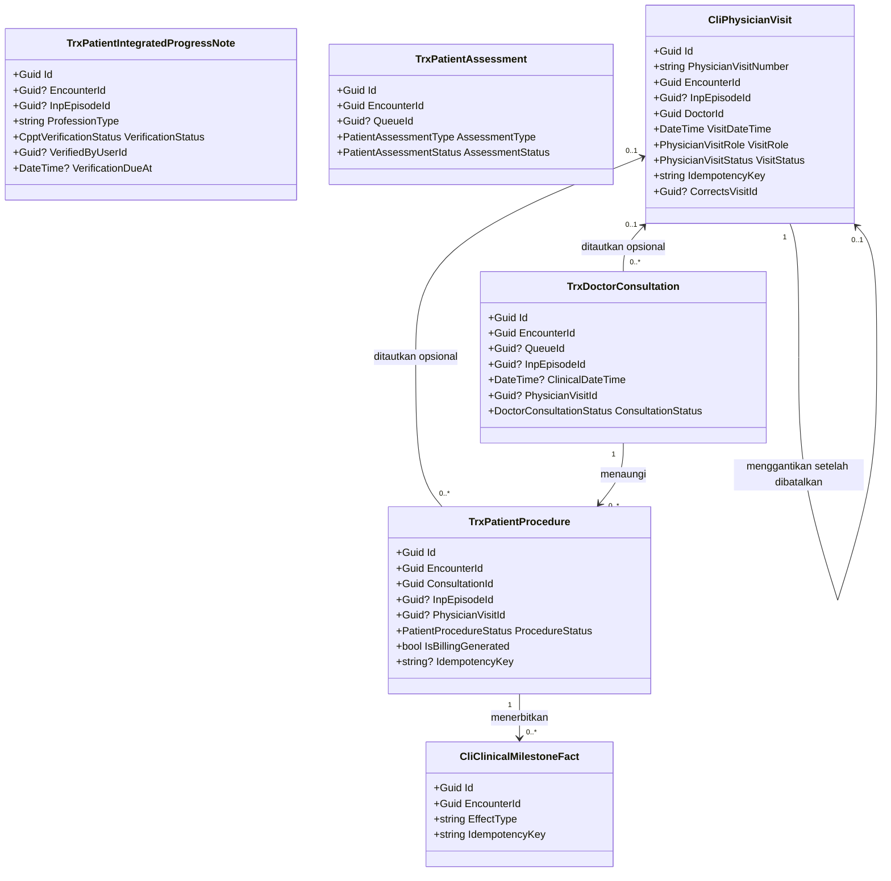
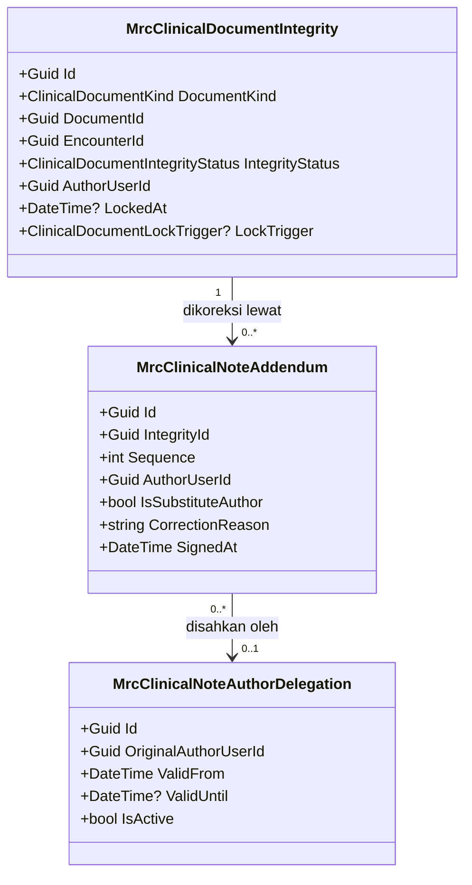
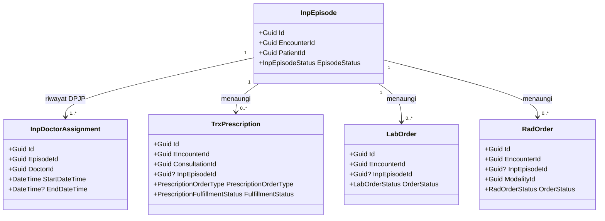

# Arsitektur Backend — Sub-modul `dokter-rawat-inap` (Rawat Inap)

| Field | Nilai |
| --- | --- |
| Blueprint ID | `RWI-BP-001` |
| Sub-modul | `dokter-rawat-inap` — satu dari tiga sub-modul modul `rawat-inap`, bentuk `COMPOSITE` sejak `RWI-DEC-082` |
| Revision | `0.3` — amendment atas `0.2`, menyerap `RWI-DEC-086` s.d. `RWI-DEC-088` |
| Status | `approved` — disetujui Muhammad Hamzah, 2026-09-03 |
| `approved_by` / `approved_at` | **Muhammad Hamzah** / **2026-09-03** |
| Tanggal | 2 September 2026 (`Asia/Jakarta`) |
| Kemampuan | `CAP-015`, `CAP-020` s.d. `CAP-025` — `RWI-DEC-083` |
| Masukan baseline | `PRD-RWI-FINAL-001` v1.0.0 bagian 18, 19, 23.1, 30.3 |
| Masukan keputusan | [`../00-interview-decisions.md`](../00-interview-decisions.md) **revision `10`**, SHA-256 `de786bebc169636c0d7bd254d429a0209809890d78a7f1dcd8220d303fcbecc0` — `RWI-DEC-080` s.d. `RWI-DEC-088`; `RWI-DEC-038` dan `RWI-DEC-070` pelonggaran mesin klinis; `RWI-DEC-046` obat pulang; **`RWI-RULE-038` kapan catatan final dan bagaimana dikoreksi** |
| Masukan arsitektur domain | [`../evidence/03-hospital-domain-architecture.md`](../evidence/03-hospital-domain-architecture.md) revision `0.2` Bagian Kedua, SHA-256 `226c6ef1e4bfec544c366b265fe1e4530e80c510da33c1a9eaf2e62161d0b717` |
| `domain_architecture_readiness` | **`DOMAIN_ARCHITECTURE_READY`** untuk ketujuh capability — menggantikan `DOMAIN_ARCHITECTURE_NOT_RUN` pada revision `0.1` |
| Masukan keadaan saat ini | [`../01-existing-capability-map.md`](../01-existing-capability-map.md) revision `1.3` bagian 15 |
| Peta modul | [`../02-module-map.md`](../02-module-map.md) revision `1` |
| Sub-modul tetangga | [`../keperawatan/`](../keperawatan/) revision `0.1` — berbagi satu pelonggaran dan satu tabel |
| Backend SHA | `93b3227c431401d8f586dec4e1fb25fbf41766e3` (branch `MHamzah`) — **naik dari `5afb54b`** |
| Frontend SHA | `863f24b0d1617069310c04e5770b47fd1b518b5b` (branch `HamzahV2`) |
| Batas tulis | Hanya dokumen blueprint. Tidak ada source, migration, atau endpoint yang dibuat |

---

## 0. Apa yang berubah dari revision `0.1`

Revision `0.1` ditulis di atas snapshot `5afb54b` dan sebelum arsitektur domain dikerjakan. Enam hal
berubah secara material, dan setiap perubahan punya bukti.

| No | Yang berubah | Dari | Menjadi | Buktinya |
| ---: | --- | --- | --- | --- |
| 1 | Nama entity visite | `TrxPhysicianVisit` | **`CliPhysicianVisit`** | `QBE-NAM-001` melarang `Trx*` untuk kode baru; registry memberi prefix `Cli` untuk `ClinicalManagement` berstatus `ACTIVE`; `CliClinicalMilestoneFact.cs` membuktikan konvensinya sudah dipakai |
| 2 | Mekanisme koreksi dokumen final | Kolom `AmendedAt`, `AmendedByUserId`, `AmendReason` per tabel | **Memakai mesin integritas dan addendum milik `MedicalRecordManagement`** | `MrcClinicalDocumentIntegrity`, `MrcClinicalNoteAddendum`, dan `MrcClinicalNoteAuthorDelegation` sudah ada dan sudah menjangkau jenis dokumen `Consultation`, `Assessment`, `ProgressNote`, dan `Procedure` |
| 3 | Koreksi visite | `PATCH /{id}` menyunting waktu dan peran | **Batalkan lalu catat ulang** | `RWI-DEC-085` dan arsitektur domain bagian S.1: event menyatakan fakta kedatangan, menyuntingnya menghapus fakta lama tanpa jejak |
| 4 | Radiologi | "Modulnya belum ada", `CAP-015` masuk MVP sebagian | **Modulnya ada.** `CAP-015` masuk MVP penuh | `RadOrder`, `RadStudy`, `RadOrderController`, dan migration `20260828093000_AddRadiologyManagement` ada pada `BE@93b3227` |
| 5 | Defect jalur tanpa antrean | Tidak tercatat | **Perbaikan wajib sebelum rilis** | `DoctorConsultationController.cs` baris 258–265 mengambil antrean yang boleh kosong, lalu baris 360–366 menulis ke dalamnya tanpa pemeriksaan |
| 6 | Penomoran invariant dan integrasi | Nomor lokal `INV-DOK-01`–`05` dan `INT-DOK-01`–`08` | **Nomor kanonis dari arsitektur domain** | Bagian 1.3 dan `contracts/integration-contract.md` bagian 0 memuat tabel pemetaannya |

## 0.1 Apa yang berubah dari revision `0.2`

Tiga keputusan turun **setelah** revision `0.2` selesai ditulis, dan ketiganya menyentuh satu titik
yang sama: bagaimana catatan dokter dibetulkan setelah selesai.

| No | Yang berubah | Dari | Menjadi | Dasar |
| ---: | --- | --- | --- | --- |
| 1 | Makna "final" | Hanya nilai status pada catatan | **Selesai sama dengan tertanda tangan sama dengan terkunci.** Penekanan tombol Selesai diperlakukan sebagai tanda tangan penulis | `RWI-DEC-086`, `RWI-RULE-038` |
| 2 | Mesin keutuhan dokumen | Dianggap "dipakai apa adanya, nol perubahan" | **Tiga jenis dokumen wajib didaftarkan** ke sana saat finalisasi — catatan dokter, kajian medis, dan tindakan. Mesinnya sendiri tetap tidak berubah | `RWI-DEC-087`, `RWI-FACT-014` |
| 3 | Koreksi atas nama dokter berhalangan | Belum ditetapkan | **Hanya DPJP aktif episode itu**, dengan penetapan kepala unit rawat inap yang wajib berbatas waktu | `RWI-DEC-088` |

**Kenapa butir 2 penting.** Revision `0.2` mencabut enam kolom amandemen dengan alasan mesinnya
sudah ada. Alasan itu benar, tetapi tidak lengkap: mesin itu **hanya tersambung ke catatan
terpadu**. Tiga jenis dokumen lain tidak pernah mendaftarkan diri, sedangkan penyuntingan setelah
selesai sudah dilarang — sehingga hari ini catatan dokter yang sudah diselesaikan **tidak dapat
disunting dan tidak dapat dikoreksi**. Pencabutan kolomnya tetap benar; yang kurang adalah satu
langkah pendaftaran.

---

## 1. Bounded context, ownership, dan invariant

### 1.1 Kedudukan sub-modul ini

| Hal | Ketetapannya | Sumber |
| --- | --- | --- |
| Jenis konteks | **Workspace context** — menyajikan dan mengumpulkan, bukan memiliki | Arsitektur domain bagian Q.2 |
| Aggregate root yang dimiliki | **Nol** | `RWI-DEC-081` |
| Hubungan dengan `CTX-CLI`, `CTX-PHM`, `CTX-LAB`, `CTX-RAD`, `CTX-MRC` | **Pelanggan–pemasok.** Rawat Inap menyatakan kebutuhan; pemiliknya yang mengubah modelnya sendiri | Arsitektur domain bagian Q.1 |
| Hubungan dengan `CTX-BIL` | **Hilir satu arah.** Billing menerima fakta klinis, tidak pernah mengubahnya | `RWI-DEC-085`, arsitektur domain bagian Y |
| Transaction boundary | Tidak ada transaksi milik sub-modul ini | — |
| Yang benar-benar dimiliki | **Makna konteks klinis episode** (`CON-INP-015`) dan **kewenangan dokter atas pasien tertentu** | Arsitektur domain bagian Q.3 dan V.2 |

### 1.2 Konsep domain yang dipakai

Diambil apa adanya dari arsitektur domain bagian R. **Tidak diturunkan ulang di sini.**

| Konsep | ID | Klasifikasi | Ownership | Wujudnya pada source |
| --- | --- | --- | --- | --- |
| Konteks Klinis Episode | `CON-INP-015` | `VALUE_OBJECT` | `New`, milik Rawat Inap | **Dihitung, tidak disimpan.** Diwujudkan sebagai satu service bersama, bukan tabel |
| Catatan Dokter berisi SOAP | `CON-EXT-011` | `AGGREGATE_ROOT` | `Extend` | `TrxDoctorConsultation` |
| CPPT | `CON-EXT-012` | `AGGREGATE_ROOT` | `Extend` | `TrxPatientIntegratedProgressNote` |
| Kajian Medis Awal | `CON-EXT-013` | `AGGREGATE_ROOT` | `Extend` | `TrxPatientAssessment` dengan pembeda jenis — lihat 4.2 |
| Tindakan Dokter | `CON-EXT-014` | `AGGREGATE_ROOT` | `Extend` | `TrxPatientProcedure` |
| Event Visite Dokter | `CON-EXT-015` | `AGGREGATE_ROOT` | **`New`** | **`CliPhysicianVisit`** — belum ada |
| Fakta Klinis untuk Billing | `CON-EXT-016` | `DOMAIN_EVENT` | `Existing` | `CliClinicalMilestoneFact` beserta producer-nya |
| Resep dan jenis resep | `CON-EXT-017`, `CON-EXT-018` | `AGGREGATE_ROOT`, `VALUE_OBJECT` | `Extend` | `TrxPrescription` |
| Pesanan Laboratorium | `CON-EXT-019` | `AGGREGATE_ROOT` | `Extend` | `LabOrder` |
| Pesanan Radiologi dan Studi | `CON-EXT-020` | `AGGREGATE_ROOT` | `Extend` | `RadOrder`, `RadStudy` |
| Integritas, addendum, dan pendelegasian penulis | `CON-EXT-021` s.d. `CON-EXT-023` | `ENTITY` | `Existing` | `MrcClinicalDocumentIntegrity`, `MrcClinicalNoteAddendum`, `MrcClinicalNoteAuthorDelegation` |

### 1.3 Invariant — memakai penomoran kanonis arsitektur domain

Ketiga belas invariant `INV-DOK-01` s.d. `INV-DOK-13` didefinisikan pada arsitektur domain bagian
S.0 dan **tidak ditulis ulang di sini**. Yang ditulis di sini hanya **bagaimana backend
menegakkannya**.

| Invariant | Ditegakkan di mana | Bentuk penegakan |
| --- | --- | --- |
| `INV-DOK-01` dokumen terikat tepat satu episode | Service konteks klinis bersama, dipanggil setiap perintah tulis | Resolusi episode dari `EncounterId`; permintaan tanpa episode ditolak |
| `INV-DOK-02` pasien dokumen sama dengan pasien episode | Service yang sama | Pembandingan `PatientId` dokumen, kunjungan, dan episode |
| `INV-DOK-03` episode `Closed`/`Cancelled` menolak dokumen baru | Service yang sama | Pemeriksaan `InpEpisode.EpisodeStatus`; addendum tetap diterima |
| `INV-DOK-04` banyak catatan, resep, dan tindakan sepanjang episode | `DoctorConsultationController`, `PrescriptionController` | Pelonggaran batas, disaring tipe kunjungan |
| `INV-DOK-05` perilaku rawat jalan dan MCU tidak berubah | Controller yang sama | Cabang pelonggaran hanya menyala untuk `Inpatient` dan `Emergency`; dijaga test regresi |
| `INV-DOK-06` satu kunci permintaan satu event | Database | **Unique index** pada `CliPhysicianVisit.IdempotencyKey` |
| `INV-DOK-07` visite tidak diturunkan dari SOAP/CPPT | Struktur | Tidak ada satu pun jalur yang membuat event visite lahir dari penyimpanan catatan |
| `INV-DOK-08` event batal tetap tersimpan dan tidak dihitung | Model dan query | `VisitStatus = Cancelled`; seluruh query hitungan menyaring `Recorded` |
| `INV-DOK-09` Billing tidak mengubah catatan klinis | Arah kontrak | Catatan klinis disimpan lebih dulu; fakta diterbitkan sesudahnya, satu arah |
| `INV-DOK-10` dokumen final tidak disunting di tempat | `MedicalRecordManagement` | Mesin integritas mengunci dokumen; koreksi lewat addendum bernomor urut |
| `INV-DOK-11` verifikasi CPPT hanya oleh DPJP aktif | Service klinis | `InpEpisodeService.IsActiveDoctorAsync` pada saat verifikasi |
| `INV-DOK-12` hanya hasil final terverifikasi milik episode yang dibaca | Query pembacaan | Penyaring kunjungan milik episode ditambah penyaring status hasil |
| `INV-DOK-13` kewenangan atas pasien ini, bukan hanya peran | Setiap perintah klinis | `IsActiveDoctorAsync`, di **dalam** perintah, bukan di lapisan luar |

### 1.4 Dua aturan batas milik sub-modul ini

Keduanya bukan invariant domain, melainkan **batas kepemilikan** yang lahir dari `RWI-DEC-081`.
Dinomori tersendiri supaya tidak bertabrakan dengan penomoran kanonis.

| ID | Aturan | Dasar |
| --- | --- | --- |
| `RUL-DOK-01` | Rawat Inap **tidak pernah** menulis status pemenuhan resep maupun menandai obat sudah diserahkan. Statusnya hanya dibaca dari Farmasi | PRD `CAP-023` aturan 6, `RWI-RULE-024` |
| `RUL-DOK-02` | Rawat Inap **tidak pernah** menyalin hasil laboratorium maupun radiologi menjadi baris kebenaran baru | PRD `CAP-015` aturan 4, `AC-CAP015-02`, arsitektur domain bagian R.4 |

> **Pemetaan dari penomoran revision `0.1`.** Pembaca dokumen lama perlu tabel ini sekali saja.
>
> | Nomor lama | Bunyinya dulu | Sekarang menjadi |
> | --- | --- | --- |
> | `INV-DOK-01` | Dokumentasi hanya bila ada episode `Admitted` | `INV-DOK-01` ditambah `INV-DOK-02` dan `INV-DOK-03` kanonis |
> | `INV-DOK-02` | Episode `Closed` menolak dokumentasi baru | `INV-DOK-03` kanonis |
> | `INV-DOK-03` | Visite dicatat, bukan disimpulkan | `INV-DOK-07` kanonis |
> | `INV-DOK-04` | Tidak pernah menandai obat diserahkan | `RUL-DOK-01` |
> | `INV-DOK-05` | Tidak pernah menyalin hasil penunjang | `RUL-DOK-02` |

---

## 2. Tabel kepemilikan data

> Tabel kepemilikan data **seluruh modul** ada di [`../02-module-map.md`](../02-module-map.md)
> bagian 2. Yang di bawah ini hanya kelompok data yang disentuh sub-modul ini.

### 2.1 Yang dipakai, tidak dibuat ulang

| Kelompok data | Modul pemilik | Dipakai sub-modul ini | Dibuat ulang |
| --- | --- | :---: | --- |
| Episode rawat inap, penugasan DPJP | `episode-rawat-inap` | Konteks dan kewenangan | **Tidak** |
| Kajian medis awal | `ClinicalManagement` | Ya — ditulis lewat endpoint modul itu | **Tidak** — `RWI-DEC-081` |
| Konsultasi dan SOAP | `ClinicalManagement` | Ya | **Tidak** |
| CPPT | `ClinicalManagement` | Ya — **kontraknya milik sub-modul ini** (`CAP-021`) | **Tidak** |
| Diagnosis dan daftar masalah | `ClinicalManagement` | Ya | **Tidak** |
| Tindakan dokter | `ClinicalManagement` | Ya | **Tidak** |
| **Event visite dokter** | `ClinicalManagement` | Ya — **konsep baru, diminta kepada pemiliknya** | **Tidak.** Nama `Inp*` dilarang |
| Integritas dokumen, addendum, pendelegasian penulis | `MedicalRecordManagement` | Ya — dipakai apa adanya | **Tidak** |
| Fakta klinis untuk Billing | `ClinicalManagement` | Ya — sudah ada | **Tidak** |
| Resep | `PharmacyManagement` | Ya — dibuat; **status pemenuhannya hanya dibaca** | **Tidak** — `RUL-DOK-01` |
| Pesanan dan hasil laboratorium | `LaboratoryManagement` | Pesanan dibuat; hasil **hanya dibaca** | **Tidak** — `RUL-DOK-02` |
| **Pesanan, studi, dan hasil radiologi** | `RadiologyManagement` | Pesanan dibuat; hasil **hanya dibaca** | **Tidak** — `RUL-DOK-02` |
| Tanda vital, alergi, riwayat penyakit | `ClinicalManagement` | Dibaca | **Tidak** |

### 2.2 Yang belum ada di mana pun dan diminta kepada pemiliknya

| Kelompok data | Modul pemilik | Keadaan hari ini | Diminta oleh |
| --- | --- | --- | --- |
| Event visite dokter | `ClinicalManagement` | **Tidak ada.** Pencarian `PhysicianVisit` pada `Areas` dan `Migrations` di `BE@93b3227` menghasilkan nol kecocokan | `CAP-025`, bagian 4.6 |

**Satu tabel baru. Itu saja.** Enam kemampuan lain berdiri di atas tabel yang sudah ada.

### 2.3 Nol baris kepemilikan yang belum diputuskan

Ketujuh kemampuan sub-modul ini punya pemilik data yang tegas pada PRD 23.1 dan `RWI-DEC-081`.
Tidak ada `OPEN DECISION` kepemilikan di sini.

---

## 3. Tiga penghalang teknis, bukan lagi dua

Revision `0.1` mencatat dua penghalang. Impact scan pada `BE@93b3227` menemukan **satu lagi**, dan
yang ketiga ini adalah yang paling berbahaya karena berwujud kegagalan sistem.

### 3.1 Penghalang 1 — konteks klinis episode belum dikenali

| Berkas | Method | Yang dijaga |
| --- | --- | --- |
| `Areas/HealthServices/ClinicalManagement/Controllers/PatientAssessmentController.cs` | `ValidateRequestAsync` | Pengkajian — dibahas juga oleh `keperawatan` |
| `Areas/HealthServices/ClinicalManagement/Controllers/DoctorConsultationController.cs` | `ValidateRequestAsync` | **Konsultasi** — pintu bagi SOAP, diagnosis, resep, dan tindakan |

Keduanya hanya mengenali kunjungan yang punya baris IGD. Pencarian `InpEpisode` maupun `EpisodeId`
pada kedua controller **tidak menemukan satu pun cabang rawat inap** — `DOK-TRC-INT-01`.

**Kenapa membuka pengkajian saja tidak cukup.** Empat kemampuan bergantung pada konsultasi:

| Kemampuan | Bergantung pada konsultasi karena |
| --- | --- |
| `CAP-020` SOAP | Kolom `Subjective`, `Objective`, dan seterusnya **berada di dalam** `TrxDoctorConsultation` |
| `CAP-023` Resep | `TrxPrescription.ConsultationId` **wajib**, bukan nullable |
| `CAP-024` Tindakan | `TrxPatientProcedure.ConsultationId` **wajib** |
| Diagnosis | `TrxPatientDiagnosis.ConsultationId` **wajib** |

### 3.2 Penghalang 2 — jalur tanpa antrean berujung kegagalan sistem ★ baru

| Hal | Isinya |
| --- | --- |
| Bukti | `BE@93b3227 DoctorConsultationController.cs` baris 258–265 mengambil antrean **yang boleh kosong**; baris 360–366 menulis `queue.QueueStatus` dan waktu konsultasi **tanpa memeriksa kosong lebih dulu** |
| Akibat | Setiap permintaan tanpa antrean berujung kegagalan sistem — kode `500` |
| Siapa yang terkena | Pasien rawat inap **dan** pasien IGD, karena keduanya memakai jalur yang sama |
| Status | `Repair` — `DOK-TRC-DEF-01` |
| Kenapa ini butir arsitektur, bukan sekadar bug | Jalur tanpa antrean adalah **satu-satunya** jalur pasien rawat inap. Selama ia meledak, `RWI-DEC-038` tidak pernah benar-benar berlaku |

> **Urutan yang tidak boleh dibalik.** Perbaikan ini dikerjakan **sebelum atau bersamaan** dengan
> pembukaan cabang episode. Membuka cabang episode lebih dulu berarti mengundang pasien rawat inap
> masuk ke jalur yang sudah diketahui gagal.

### 3.3 Penghalang 3 — batas jumlah konsultasi dan resep

| Bukti | Isinya |
| --- | --- |
| `DoctorConsultationController.cs#ValidateRequestAsync` sekitar baris 844–850 dan 916–923 | Menolak konsultasi kedua pada satu `EncounterId` |
| `PharmacyManagement/Controllers/PrescriptionController.cs#ValidateCreateRequestAsync` sekitar baris 555–563 | Menolak resep aktif kedua |

| Tanpa pelonggaran | Akibatnya bagi pasien rawat inap |
| --- | --- |
| Satu konsultasi per kunjungan | Dokter hanya dapat menulis **satu** SOAP untuk seluruh masa perawatan |
| Satu resep aktif per konsultasi | Pasien yang dirawat sepuluh hari hanya dapat menerima satu resep |

Keduanya `approved` sejak `RWI-DEC-038`, diperluas `RWI-DEC-070`. Yang belum ada kodenya —
`DOK-TRC-INT-02`.

### 3.4 Bentuk yang diminta

| Hal | Ketetapannya |
| --- | --- |
| Pemilik perubahan | `ClinicalManagement` dan `PharmacyManagement` — Muhammad Hamzah, disetujui `RWI-DEC-062` |
| Bentuk | Satu **service konteks klinis bersama** yang menjawab `CON-INP-015`, dipanggil kedua controller |
| Yang **tidak** berubah | Perilaku rawat jalan dan medical check-up — `INV-DOK-05`, `RWI-AC-143` |
| Nol kolom baru untuk pelonggaran ini | Kedua `QueueId` **sudah** nullable |
| Prasyarat lintas sub-modul | Cabang pengkajian (`keperawatan`) dan cabang konsultasi **wajib dikerjakan bersama** — `INT-DOK-01` |

---

## 4. Entity: yang ada, yang diperluas, yang diminta baru

### 4.0 Class diagram

Dipecah menjadi tiga, mengikuti bounded context pemiliknya, supaya setiap diagram muat dibaca dalam
satu layar. Hanya field kunci, status, dan field yang dipakai aturan bisnis yang ditampilkan; field
lengkap ada di [`data/data-dictionary.md`](./data/data-dictionary.md).

#### 4.0.1 Dokumentasi klinis dokter — `CTX-CLI`



**Yang perlu dibaca dari diagram ini.** Tiga panah putus arah ke `CliPhysicianVisit` semuanya
`0..1` dan opsional. Itulah wujud `INV-DOK-07`: catatan boleh ada tanpa event, dan event boleh ada
tanpa catatan. Panah dari `CliPhysicianVisit` ke dirinya sendiri adalah jalur koreksi — event baru
menunjuk event yang dibatalkannya, bukan menimpanya.

#### 4.0.2 Integritas dokumen — `CTX-MRC`



`DocumentKind` menautkan mesin ini ke dokumen mana pun tanpa foreign key langsung, sehingga satu
mesin melayani konsultasi, kajian, CPPT, dan tindakan sekaligus. **Nol perubahan diminta di sini.**

#### 4.0.3 Konteks episode dan penunjang — `CTX-INP-CARE`, `CTX-PHM`, `CTX-LAB`, `CTX-RAD`



Seluruh panah dari `InpEpisode` adalah **konteks**, bukan kepemilikan: episode menaungi dokumen
yang lahir selama perawatan, tetapi tabelnya tetap milik modul masing-masing. Menutup episode
**tidak** menghapus satu pun baris di sebelah kanan — arsitektur domain bagian T.2.

### 4.1 `TrxDoctorConsultation` — `Diperbarui` — `CAP-020`

| Aspek | Penjelasan |
| --- | --- |
| **Status** | `Diperbarui` |
| **Lokasi file** | `Areas/HealthServices/ClinicalManagement/Models/TrxDoctorConsultation.cs` |
| Kategori | Transaksi klinis |
| Pemilik | `ClinicalManagement` |
| Tanggung jawab utama | Menyimpan satu catatan pemeriksaan dokter beserta isi SOAP-nya. Pada sistem ini catatan dokter dan konsultasi adalah objek yang sama |
| Field penting | `EncounterId`, `QueueId` (nullable), `PatientId`, `DoctorId`, `ConsultationStatus`, `Subjective`, `Objective` dan seterusnya |
| Relasi | Milik satu kunjungan; punya banyak diagnosis, tindakan, dan resep |
| Pemakaian dalam alur bisnis | Dibuat setiap kali dokter memeriksa pasien; difinalkan setelah isinya lengkap |
| Catatan desain | Jangan memecah SOAP menjadi tabel sendiri. Jangan menyunting isi setelah final — koreksi lewat addendum |
| Ekuivalen model lama | — |

| Kolom yang diminta | Tipe | Wajib | Bawaan | Kenapa | Sensitif |
| --- | --- | :---: | --- | --- | :---: |
| `InpEpisodeId` | `Guid?` | Tidak | `null` | Konteks episode dapat ditelusuri tanpa menghitung ulang lewat kunjungan | Tidak |
| `ClinicalDateTime` | `DateTime?` | Tidak | `null` | Membedakan **waktu klinis** dari waktu penulisan. Visite pukul 07.40 yang ditulis pukul 11.00 harus terbaca pada pukul 07.40 | Tidak |
| `PhysicianVisitId` | `Guid?` | Tidak | `null` | Tautan **opsional** ke event visite — `INV-DOK-07`. **Berganti nama** dari `VisitId` supaya tidak tertukar dengan kunjungan IGD | Tidak |

| Index diminta | Bentuk | Kenapa |
| --- | --- | --- |
| `IX_TrxDoctorConsultation_InpEpisodeId` | `(InpEpisodeId, ClinicalDateTime)` | Lini masa SOAP satu episode, terurut waktu klinis |

`DeleteBehavior` pada `InpEpisodeId`: `Restrict`. Pada `PhysicianVisitId`: `SetNull`.

> **Kenapa `InpEpisodeId` disimpan padahal kunjungan sudah cukup.** `INV-INP-04` menjamin satu
> episode menempel pada tepat satu kunjungan, sehingga episode **dapat** diturunkan dari kunjungan.
> Kolom ini tetap diminta karena dua alasan praktis: pertanyaan "episode A atau episode B" harus
> dijawab tanpa join berlapis pada setiap pembacaan lini masa, dan penjagaan `INV-DOK-01` menjadi
> pemeriksaan satu kolom, bukan penelusuran. **Keduanya wajib sepakat**: bila `InpEpisodeId` terisi
> tetapi tidak cocok dengan episode milik `EncounterId`, permintaan ditolak — `VAL-DOK-26`.

### 4.2 `TrxPatientAssessment` — `Diperbarui` — `CAP-022` ★ butuh persetujuan struktur

Kajian medis awal punya dua jalan yang sama-sama masuk akal. Arsitektur domain bagian S.4 menyatakan
keduanya menghasilkan **model domain yang sama**, dan menyerahkan bentuk penyimpanannya ke sini.

| Jalan | Isinya | Dipilih? |
| --- | --- | :---: |
| **A. Pakai ulang `TrxPatientAssessment` dengan pembeda jenis** | Kajian medis menjadi nilai baru pada `AssessmentType` yang sudah diminta `keperawatan` | **Ya** |
| B. Bentuk penyimpanan tersendiri | Kajian medis punya tabelnya sendiri | Tidak |

**Kenapa A.** `TrxPatientAssessment` sudah memuat keluhan utama, riwayat, alergi, tanda vital,
kesadaran, dan pemeriksaan umum, dan **sudah punya kolom `DoctorId`** — ia memang tidak pernah
menjadi tabel milik perawat saja. Jalan B menyalin puluhan kolom yang sama, dan menyalin kolom
adalah persis yang dicegah tabel kepemilikan data.

**Keberatan yang wajib diketahui pemilik sebelum menyetujui.** Arsitektur domain bagian S.4
mencatat bahwa isian yang ada hari ini **bercorak keperawatan** — tingkat kesadaran, risiko jatuh,
status gizi, kemandirian — sedangkan kajian medis menuntut anamnesis, pemeriksaan fisik, diagnosis
kerja, dan rencana terapi. Jalan A karena itu menuntut penambahan isian medis pada tabel yang sama.

| Akibat jalan A | Cara menanganinya |
| --- | --- |
| Enum `PatientAssessmentType` dipakai bersama `keperawatan` | Siapa pun yang mendarat lebih dulu membuatnya; yang kedua menambah nilainya — `INT-DOK-09` |
| Validasi bercabang menurut jenis | `validation-matrix.md` bagian 3 |
| Kewenangan bercabang menurut jenis, dan mesin hak akses **tidak** melihat jenis | `VAL-DOK-05`; risikonya ditulis pada `permission-audit-matrix.md` bagian 3 |
| Pembaca dapat mengira kajian medis adalah pengkajian keperawatan | Ruang kerja memisahkan keduanya di layar — `03-frontend-architecture.md` bagian 3.2 |

**Bila pemilik memilih jalan B**, yang berubah hanya bagian ini dan kamus datanya; kontrak API,
kewenangan, dan alur tetap sama. Karena itu ia **tidak** menahan gelombang pengiriman.

| Kolom yang diminta | Tipe | Wajib | Bawaan | Kenapa |
| --- | --- | :---: | --- | --- |
| `AssessmentType` | `enum` | Ya | `Initial` | Nilai baru `MedicalInitial` dan `MedicalReassessment` ditambahkan pada enum yang sama |

Kolom `InpEpisodeId`, `DueAt`, dan `PolicyId` **sudah diminta** `keperawatan`; sub-modul ini
memakainya apa adanya dan **tidak meminta duplikatnya**.

> `AC-CAP022-02` menuntut kajian medis dan SOAP punya record serta lifecycle berbeda. Terpenuhi:
> kajian medis hidup di `TrxPatientAssessment`, SOAP hidup di `TrxDoctorConsultation` — dua tabel
> berbeda dengan mesin status yang berbeda.

### 4.3 `TrxPatientIntegratedProgressNote` — `Diperbarui` — `CAP-021`

| Aspek | Penjelasan |
| --- | --- |
| **Status** | `Diperbarui` |
| **Lokasi file** | `Areas/HealthServices/ClinicalManagement/Models/TrxPatientIntegratedProgressNote.cs` |
| Kategori | Transaksi klinis lintas profesi |
| Pemilik | `ClinicalManagement`; **kontraknya milik sub-modul ini** — `CAP-021`, `RWI-DEC-083` |
| Tanggung jawab utama | Menyimpan satu catatan perkembangan pada lembar terpadu, beserta profesi dan penulisnya |
| Field penting | `EncounterId`, `ProfessionType`, `ProviderUserId`, `NoteDateTime`, ringkasan S/O/A/P |
| Relasi | Menempel pada kunjungan; dapat merujuk konsultasi dan pengkajian |
| Catatan desain | Verifikasi **tidak pernah** menulis ulang `ProviderUserId` |

| Kolom yang diminta | Tipe | Wajib | Bawaan | Kenapa | Sensitif |
| --- | --- | :---: | --- | --- | :---: |
| `InpEpisodeId` | `Guid?` | Tidak | `null` | Konteks episode — `INV-DOK-01` | Tidak |
| `VerificationStatus` | `enum` | Ya | `NotRequired` | Verifikasi DPJP **bila diwajibkan** | Tidak |
| `VerifiedAt` | `DateTime?` | Tidak | `null` | Waktu verifikasi | Tidak |
| `VerifiedByUserId` | `Guid?` | Tidak | `null` | **Verifikator bukan penulis asli** — `INV-DOK-11` | Tidak |
| `VerificationDueAt` | `DateTime?` | Tidak | `null` | Batas waktu terpantau daftar pantau | Tidak |

`CpptVerificationStatus`: `NotRequired`, `Pending`, `Verified`, `Overdue`. Bawaan `NotRequired`.

> **Bawaan `NotRequired`, bukan `Pending`.** PRD menulis "**bila** verifikasi DPJP diwajibkan".
> Menyalakannya sebagai bawaan membuat setiap catatan perawat langsung terhitung menunggu
> verifikasi pada rumah sakit yang tidak mewajibkannya, dan daftar pantau penuh sejak hari pertama.

> **Tiga kolom amandemen dari revision `0.1` dicabut.** `AmendedAt`, `AmendedByUserId`, dan
> `AmendReason` **tidak jadi diminta**, karena mesinnya sudah ada di `MedicalRecordManagement`:
> `MrcClinicalNoteAddendum` sudah menyimpan nomor urut, penulis, penanda penulis pengganti, teks
> addendum, **alasan koreksi**, waktu tanda tangan, dan perangkat penandatangan. Menambah kolom
> tandingan berarti dua tempat menyimpan alasan koreksi yang sama. Lihat 4.9.

### 4.4 `TrxPatientProcedure` — `Diperbarui` — `CAP-024`

| Aspek | Penjelasan |
| --- | --- |
| **Status** | `Diperbarui` |
| **Lokasi file** | `Areas/HealthServices/ClinicalManagement/Models/TrxPatientProcedure.cs` |
| Pemilik | `ClinicalManagement` |
| Tanggung jawab utama | Menyimpan tindakan yang direncanakan dan yang dikerjakan, beserta rujukan tarif dan penanda penagihan |
| Field penting | `EncounterId`, `ConsultationId`, `ProcedureStatus`, `IsExecuted`, `ExecutedAt`, `PerformedAt`, `TariffId`, `BillingItemId`, `IsBillingGenerated` |
| Catatan desain | Catatan klinis disimpan lebih dulu, fakta ke Billing diterbitkan sesudahnya — `INV-DOK-09` |

| Kolom yang diminta | Tipe | Wajib | Bawaan | Kenapa |
| --- | --- | :---: | --- | --- |
| `InpEpisodeId` | `Guid?` | Tidak | `null` | `INV-DOK-01` |
| `PhysicianVisitId` | `Guid?` | Tidak | `null` | Tautan **opsional** ke event visite — arsitektur domain bagian S.6 |
| `IdempotencyKey` | `string?` | Tidak | `null` | Percobaan ulang tidak melahirkan tindakan dan tagihan ganda — `AC-CAP024-02` |

| Constraint | Bentuk | Kenapa |
| --- | --- | --- |
| Unique parsial `IdempotencyKey` | `WHERE "IdempotencyKey" IS NOT NULL AND "IsDelete" = false` | Dijaga database, bukan hanya service |

> **Dua kolom dari revision `0.1` dicabut.** `ProcedureRecordType` tidak jadi diminta karena
> `ProcedureStatus` yang sudah ada memuat `Planned` beserta penanda `IsExecuted`, `ExecutedAt`, dan
> `PerformedAt` — perbedaan rencana dan pelaksanaan **sudah** terwakili. `BillingDispatchStatus`
> juga tidak jadi diminta: hasil penerbitan fakta sudah dinyatakan `ClinicalFactEmissionKind`
> beserta `IsBillingGenerated` dan `BillingGeneratedAt`. Menambah kolom status ketiga membuat tiga
> sumber jawaban untuk satu pertanyaan.

### 4.5 `TrxPrescription` — `Diperbarui` — `CAP-023`

| Aspek | Penjelasan |
| --- | --- |
| **Status** | `Diperbarui` |
| **Lokasi file** | `Areas/HealthServices/PharmacyManagement/Models/TrxPrescription.cs` |
| Pemilik | `PharmacyManagement` |
| Tanggung jawab utama | Menyimpan resep beserta status resep, pembayaran, dan pemenuhannya |
| Field penting | `EncounterId`, `ConsultationId` (**wajib**), `PrescriptionStatus`, `PaymentStatus`, `FulfillmentStatus` |
| Catatan desain | Sub-modul ini **membaca** ketiga status itu dan tidak pernah menulisnya — `RUL-DOK-01` |

| Kolom yang diminta | Tipe | Wajib | Bawaan | Kenapa |
| --- | --- | :---: | --- | --- |
| `InpEpisodeId` | `Guid?` | Tidak | `null` | `INV-DOK-01` |
| `PrescriptionOrderType` | `enum` | Ya | `Routine` | **Obat pulang menjadi jenis resep yang eksplisit** — `RWI-RULE-024`, `RWI-DEC-046`, `AC-CAP023-03` |
| `IdempotencyKey` | `string?` | Tidak | `null` | Percobaan ulang tidak melahirkan resep ganda |

`PrescriptionOrderType`: `Routine`, `Daily`, `Discharge`. Bawaan `Routine`.

> **Kenapa melonggarkan aturan resep saja tidak cukup.** `ConsultationId` **wajib**. Selama
> konsultasi kedua masih ditolak, dokter tidak punya tempat sah untuk menggantungkan resep kedua.
> Inilah alasan `RWI-DEC-070` melonggarkan aturan 3, 4, dan 5 sekaligus.

### 4.6 `CliPhysicianVisit` — `Baru`, milik `ClinicalManagement` — `CAP-025`

**Satu-satunya tabel yang benar-benar baru pada sub-modul ini.**

| Aspek | Penjelasan |
| --- | --- |
| **Status** | `Baru` |
| **Lokasi file** | `Areas/HealthServices/ClinicalManagement/Models/CliPhysicianVisit.cs` |
| **Configuration** | `Repositories/Configurations/HealthServices/ClinicalManagement/CliPhysicianVisitConfiguration.cs` |
| Nama tabel | `public."CliPhysicianVisit"` — tunggal, PascalCase |
| `DbSet` | `CliPhysicianVisits` |
| Kategori | Transaksi klinis |
| Pemilik | `ClinicalManagement` |
| Tanggung jawab utama | Menyatakan bahwa seorang dokter benar-benar mendatangi pasien pada waktu tertentu. Satu baris sama dengan satu kunjungan nyata |
| Relasi | Menempel pada kunjungan dan episode; **boleh** menunjuk konsultasi, CPPT, atau tindakan |
| Pemakaian dalam alur bisnis | Dibuat dokter setiap kali ia selesai mendatangi pasien |
| Catatan desain | Jangan menurunkannya dari SOAP. Jangan menyuntingnya setelah tersimpan. Jangan menguncinya "satu per dokter per tanggal" |
| Ekuivalen model lama | — |

> **Kenapa `Cli`, bukan `Trx`.** `QBE-NAM-001` melarang `Trx*` untuk kode baru. Registry
> kepemilikan prefix memberi `ClinicalManagement` prefix **`Cli`** berstatus `ACTIVE`, dan
> `CliClinicalMilestoneFact.cs` membuktikan konvensi itu sudah dipakai di modul yang sama.
> Revision `0.1` menulis `TrxPhysicianVisit`, dan itu **keliru**.

| Kolom | Tipe | Wajib | Bawaan | Kenapa | Sensitif |
| --- | --- | :---: | --- | --- | :---: |
| `Id` | `Guid` | Ya | `Guid.NewGuid()` | Kunci utama | Tidak |
| `PhysicianVisitNumber` | `string(30)` | Ya | — | Nomor bisnis yang terbaca manusia, dialokasikan service lewat provider number-series | Tidak |
| `EncounterId` | `Guid` | Ya | — | Jangkar klinis | Tidak |
| `InpEpisodeId` | `Guid?` | Tidak | `null` | Konteks episode; nullable agar visite non-rawat-inap kelak muat | Tidak |
| `PatientId` | `Guid` | Ya | — | Penjaga salah pasien — `INV-DOK-02` | Tidak |
| `DoctorId` | `Guid` | Ya | — | Subjek fakta | Tidak |
| `VisitDateTime` | `DateTime` | Ya | — | **Waktu kedatangan, bukan waktu pencatatan** — `RWI-AC-150` | Tidak |
| `VisitRole` | `enum` | Ya | `Dpjp` | DPJP, konsulen, atau dokter jaga — `RWI-AC-153` | Tidak |
| `VisitStatus` | `enum` | Ya | `Recorded` | **Baru pada revision `0.2`.** Menjaga `INV-DOK-08` | Tidak |
| `ConsultationId` | `Guid?` | Tidak | `null` | Tautan **opsional** ke catatan dokter | Tidak |
| `ProgressNoteId` | `Guid?` | Tidak | `null` | Tautan **opsional** ke CPPT | Tidak |
| `PatientProcedureId` | `Guid?` | Tidak | `null` | Tautan **opsional** ke tindakan — **baru**, dituntut `RWI-AC-153` | Tidak |
| `Note` | `string(1000)?` | Tidak | `null` | Catatan singkat | **Ya** |
| `RecordedByUserId` | `Guid` | Ya | — | Pelaku pencatatan | Tidak |
| `IdempotencyKey` | `string(100)` | **Ya** | — | **Berubah dari opsional menjadi wajib.** `INV-DOK-06` tidak dapat dijamin bila kuncinya boleh kosong | Tidak |
| `CancelledAt` | `DateTime?` | Tidak | `null` | Waktu pembatalan | Tidak |
| `CancelledByUserId` | `Guid?` | Tidak | `null` | Pelaku pembatalan | Tidak |
| `CancelReason` | `string(500)?` | Tidak | `null` | **Alasan wajib saat membatalkan** | **Ya** |
| `CorrectsVisitId` | `Guid?` | Tidak | `null` | Menunjuk event yang digantikannya, bila baris ini adalah pencatatan ulang setelah koreksi | Tidak |

`PhysicianVisitRole`: `Dpjp`, `Consultant`, `OnCall`. Bawaan `Dpjp`.
`PhysicianVisitStatus`: `Recorded`, `Cancelled`. Bawaan `Recorded`.

| Constraint | Bentuk | Kenapa |
| --- | --- | --- |
| **Unique penuh** `IdempotencyKey` | `UNIQUE ("IdempotencyKey")` | `INV-DOK-06`, `RWI-AC-152`, `RWI-AC-155`. Bukan unique parsial, karena kuncinya kini wajib terisi dan **kunci event yang dibatalkan pun tidak boleh dipakai ulang** |
| Index | `(InpEpisodeId, VisitDateTime)` | Riwayat visite satu episode, terurut |
| Index | `(DoctorId, VisitDateTime)` | Hitungan operasional per dokter |
| **Tidak ada** unique pada `(EpisodeId, DoctorId, tanggal)` | — | `RWI-DEC-085`: dua visite nyata pada hari yang sama adalah **dua** event. Menguncinya memaksa petugas berbohong |

> **Kenapa koreksi berbentuk batal lalu catat ulang, bukan sunting.** Arsitektur domain bagian S.1
> menyatakannya: event menyatakan fakta "dokter datang pukul sekian". Menyunting waktunya mengubah
> fakta tanpa ada yang tahu bahwa ia pernah berbunyi lain. Karena itu revision `0.2` **mencabut**
> `PATCH /{id}` yang menyunting waktu dan peran pada revision `0.1`.

### 4.7 `LabOrder` — `Diperbarui` — `CAP-015`

| Aspek | Penjelasan |
| --- | --- |
| **Status** | `Diperbarui` |
| **Lokasi file** | `Areas/HealthServices/LaboratoryManagement/Models/LabOrder.cs` |
| Pemilik | `LaboratoryManagement` — prefix `Lab`, lifecycle **`ACTIVE`** sejak 2026-09-02 |
| Keadaan hari ini | Modul berjalan: pesanan, spesimen, riwayat transisi, dua controller |
| Temuan | `LabOrder` terikat pada `EncounterId` saja — tanpa antrean dan tanpa konsultasi. Pemesanan lab rawat inap **tidak tertahan gerbang mana pun**. Yang kurang: daftar pesanan **belum dapat disaring per kunjungan** |

| Kolom yang diminta | Tipe | Wajib | Bawaan | Kenapa |
| --- | --- | :---: | --- | --- |
| `InpEpisodeId` | `Guid?` | Tidak | `null` | `AC-CAP015-01`: pesanan episode A tidak boleh diproses sebagai milik episode B |

| Kemampuan query yang diminta | Kenapa |
| --- | --- |
| Penyaring kunjungan pada daftar pesanan | Tanpa itu `INV-DOK-12` tidak dapat ditegakkan — `ARCH-GAP-014` |

### 4.8 `RadOrder` — `Diperbarui` — `CAP-015` ★ baru pada revision `0.2`

| Aspek | Penjelasan |
| --- | --- |
| **Status** | `Diperbarui` |
| **Lokasi file** | `Areas/HealthServices/RadiologyManagement/Models/RadOrder.cs` |
| Pemilik | `RadiologyManagement` |
| Keadaan hari ini | **Modulnya ada dan berjalan** — `RadOrder`, `RadStudy`, modalitas, lifecycle pesanan, migration `20260828093000_AddRadiologyManagement`, dan penyaring kunjungan pada daftar |
| Pernyataan yang dicabut | "Modul radiologi belum ada" pada revision `0.1` — **stale** |

| Kolom yang diminta | Tipe | Wajib | Bawaan | Kenapa |
| --- | --- | :---: | --- | --- |
| `InpEpisodeId` | `Guid?` | Tidak | `null` | Sama dengan `LabOrder`: `AC-CAP015-01` |

> **Prasyarat registry yang wajib diselesaikan lebih dulu.** `MODULE_OWNERSHIP_PREFIX_REGISTRY.md`
> masih mencatat `RadiologyManagement / Rad` berstatus **`PLANNED`**, padahal entity `Rad*` beserta
> migration-nya sudah ada di source. Selisih ini **dilaporkan, bukan ditambal**: penambahan kolom
> pada entity yang sudah ada tidak terhalang `QBE-MOD-002`, tetapi barisnya tetap perlu dinaikkan
> menjadi `ACTIVE` oleh pemiliknya agar registry menggambarkan keadaan sebenarnya.

### 4.9 Mesin integritas dan addendum — `Sudah ada`, dipakai apa adanya

Bagian ini menggantikan seluruh rancangan kolom amandemen pada revision `0.1`.

| Class | Status | Lokasi file | Yang dipakai |
| --- | --- | --- | --- |
| `MrcClinicalDocumentIntegrity` | `Sudah ada` | `Areas/HealthServices/MedicalRecordManagement/Models/MrcClinicalDocumentIntegrity.cs` | Penandatanganan, penguncian, dan pembatalan dokumen. Berjangkar pada pasangan `DocumentKind` dan `DocumentId` |
| `MrcClinicalNoteAddendum` | `Sudah ada` | `.../MrcClinicalNoteAddendum.cs` | Koreksi dokumen final: nomor urut, penulis, penanda penulis pengganti, teks, **alasan koreksi**, waktu tanda tangan |
| `MrcClinicalNoteAuthorDelegation` | `Sudah ada` | `.../MrcClinicalNoteAuthorDelegation.cs` | Menjelaskan sah tidaknya dokumen yang ditandatangani orang lain beserta masa berlakunya |

`ClinicalDocumentKind` yang sudah tersedia mencakup `Consultation`, `Assessment`, `ProgressNote`,
dan `Procedure` — keempat dokumen yang dikoreksi sub-modul ini. **Nol nilai enum baru diminta.**

| Yang tidak jadi dibuat | Alasan |
| --- | --- |
| `AmendedAt`, `AmendedByUserId`, `AmendReason` pada CPPT | Sudah dipegang `MrcClinicalNoteAddendum` |
| Kolom amandemen pada kajian medis dan konsultasi | Sama |
| Nilai enum `Amended` sebagai status dokumen | Status kunci dan riwayat addendum sudah menjawabnya. Menambah status keenam membuat dua sumber jawaban |

#### 4.9.1 Pertanyaan yang sudah terjawab, dan celah yang ditemukan sambil menjawabnya

Revision `0.2` menitipkan satu pertanyaan kepada pemilik `MedicalRecordManagement`: apakah dokumen
terkunci tetap menerima koreksi? **Jawabannya sudah ada di dalam source, dan arahnya lebih tegas
dari dugaan semula.**

| Temuan | Isinya | Bukti |
| --- | --- | --- |
| Koreksi **hanya** untuk dokumen terkunci | Dokumen berstatus konsep ditolak dengan pesan "Catatan ini belum terkunci. Perbaiki langsung pada catatannya". Dokumen yang sudah dibatalkan juga ditolak | `ClinicalNoteAddendumService.cs` baris 60–130 |
| Status dokumen tidak bergeser setelah dikoreksi | Dokumen yang tertanda tangan tetap tertanda tangan | Komentar pada baris 220 berkas yang sama |
| **Hanya catatan terpadu yang terdaftar** | Pencarian pendaftaran keutuhan pada seluruh controller `ClinicalManagement` hanya menemukan controller catatan terpadu | `RWI-FACT-014` |
| Penyuntingan setelah selesai **sudah dilarang** | "SOAP pada konsultasi yang sudah completed tidak dapat diubah" | `DoctorConsultationController.cs` baris 528 |

Gabungan dua temuan terakhir adalah celahnya: catatan dokter yang sudah diselesaikan hari ini tidak
dapat disunting **dan** tidak dapat dikoreksi. Salah ketik menjadi permanen, dan satu-satunya jalan
yang tersisa bagi dokter adalah menulis catatan baru yang membantah catatan lama.

#### 4.9.2 Yang diminta — `RWI-DEC-087`

| Hal | Ketetapannya |
| --- | --- |
| Apa | Ketiga jenis dokumen berikut **didaftarkan** ke mesin keutuhan pada saat finalisasi: catatan dokter berisi SOAP, kajian medis, dan tindakan dokter |
| Kapan | **Dalam transaksi yang sama** dengan finalisasi. Bila pendaftaran gagal, finalisasi ikut batal — supaya tidak pernah lahir catatan final yang tidak dapat dikoreksi |
| Sebagai apa | Berstatus **tertanda tangan**, dengan penulis dokumen sebagai penanda tangan. Penekanan tombol Selesai adalah tanda tangannya |
| Jenis dokumen | Memakai nilai yang **sudah tersedia**. **Nol nilai enum baru** |
| Yang tidak berubah | Mesin keutuhan, mesin addendum, dan mesin penetapan penulis pengganti. Ketiganya dipakai apa adanya |
| Catatan terpadu | **Sudah terdaftar** dan tidak perlu diubah |

#### 4.9.3 Koreksi atas nama dokter yang berhalangan — `RWI-DEC-088`

Mesinnya sudah mengenali tiga tingkat kewenangan, dan ketiganya dipakai apa adanya:

| Tingkat | Keadaan | Perlu penetapan? |
| --- | --- | --- |
| 1 | Penulis asli mengoreksi catatannya sendiri | Tidak |
| 2 | Akun penulis sudah nonaktif | **Tidak** — disimpulkan sistem sendiri |
| 3 | Penulis berhalangan sementara | **Ya** — penetapan kepala unit rawat inap, wajib berbatas waktu |

> **Satu batas yang tidak dapat dijaga mesin mana pun, dan wajib dinyatakan.** Penetapan berhalangan
> bersifat **milik penulis**: ia menyatakan "dokter ini sedang berhalangan dari tanggal sekian
> sampai sekian", **tanpa menyebut siapa yang boleh menggantikan**. Akibatnya, begitu penetapan
> berlaku, siapa pun yang memegang butir hak akses pengganti dapat mengoreksi catatan dokter itu.
>
> `RWI-DEC-088` membatasi kewenangan itu pada **DPJP yang aktif pada episode pasien tersebut**, dan
> batas itu **tidak dapat** ditegakkan mesin hak akses maupun mesin penetapan. Ia masuk kategori
> yang sama dengan `INV-DOK-13`: kewenangan per pasien, dijaga di dalam perintah bisnis. Rinciannya
> pada `contracts/permission-audit-matrix.md` bagian 3.

---

## 5. Arsitektur folder

Nol berkas baru di bawah `InPatientManagement/`.

```text
Areas/HealthServices/ClinicalManagement/
├── Controllers/
│   ├── DoctorConsultationController.cs             Diperbarui — cabang episode, perbaikan jalur tanpa antrean, pelonggaran jumlah
│   ├── PatientAssessmentController.cs              Diperbarui — cabang episode, jenis kajian medis
│   ├── PatientIntegratedProgressNoteController.cs  Diperbarui — konteks episode, verifikasi DPJP
│   ├── PatientProcedureController.cs               Diperbarui — konteks episode, idempotency, tautan visite
│   └── PhysicianVisitController.cs                 Baru
├── Models/
│   ├── TrxDoctorConsultation.cs                    Diperbarui — 3 kolom   # entity legacy Trx*, jangan ditiru
│   ├── TrxPatientAssessment.cs                     Diperbarui — nilai enum
│   ├── TrxPatientIntegratedProgressNote.cs         Diperbarui — 5 kolom
│   ├── TrxPatientProcedure.cs                      Diperbarui — 3 kolom
│   └── CliPhysicianVisit.cs                        Baru — prefix registry Cli
├── Enums/
│   ├── PatientAssessmentType.cs                    Diperbarui — 2 nilai medis
│   ├── CpptVerificationStatus.cs                   Baru
│   ├── PhysicianVisitRole.cs                       Baru
│   └── PhysicianVisitStatus.cs                     Baru
├── DTOs/
│   └── PhysicianVisitDtos.cs                       Baru
└── Services/
    ├── InpatientClinicalContextService.cs          Baru — mewujudkan CON-INP-015, dipakai bersama keperawatan
    └── PhysicianVisitService.cs                    Baru — memiliki CRUD dan orkestrasi CliPhysicianVisit

Repositories/Configurations/HealthServices/ClinicalManagement/
└── CliPhysicianVisitConfiguration.cs               Baru   # configuration TIDAK berada di dalam Areas/

Areas/HealthServices/PharmacyManagement/
└── Models/TrxPrescription.cs                       Diperbarui — 3 kolom

Areas/HealthServices/LaboratoryManagement/
└── Models/LabOrder.cs                              Diperbarui — 1 kolom

Areas/HealthServices/RadiologyManagement/
└── Models/RadOrder.cs                              Diperbarui — 1 kolom

Areas/HealthServices/MedicalRecordManagement/       ◄── NOL perubahan model
Areas/HealthServices/InPatientManagement/           ◄── NOL berkas baru
```

> **Dua utang teknis yang sengaja tidak dirapikan.**
> Pertama, `DoctorConsultationController.cs` dan `PatientAssessmentController.cs` menaruh logika
> bisnis di controller, bukan service — berlawanan dengan `QBE-SVC-001`. Sub-modul ini tidak
> merapikannya: pemiliknya modul lain, dan refactor besar di tengah penambahan fitur adalah dua
> pekerjaan yang digabung. **Kode baru tetap wajib mengikuti pola standar**, sehingga
> `PhysicianVisitController` memakai `PhysicianVisitService`, bukan `ApplicationDbContext`
> langsung.
> Kedua, entity klinis yang ada masih berawalan `Trx*`. Normalisasinya adalah task tersendiri
> dengan approval pemilik arsitektur backend, sebagaimana `QBE-NAM-003`; **jangan** dikerjakan
> menyelinap di dalam task ini.

---

## 6. Status model dan dampak migration

| Tabel | Status | Kolom berubah | Dampak migration |
| --- | --- | --- | --- |
| `TrxDoctorConsultation` | `Diperbarui` | `InpEpisodeId`, `ClinicalDateTime`, `PhysicianVisitId` — **tiga**, seluruhnya nullable | Tanpa mematikan layanan |
| `TrxPatientAssessment` | `Diperbarui` | **Nol kolom baru dari sub-modul ini**; hanya dua nilai enum | Tanpa mematikan layanan |
| `TrxPatientIntegratedProgressNote` | `Diperbarui` | `InpEpisodeId`, `VerificationStatus`, `VerifiedAt`, `VerifiedByUserId`, `VerificationDueAt` — **lima**, turun dari delapan | Tanpa mematikan layanan; baris lama `VerificationStatus = NotRequired` |
| `TrxPatientProcedure` | `Diperbarui` | `InpEpisodeId`, `PhysicianVisitId`, `IdempotencyKey` — **tiga**, turun dari lima | Tanpa mematikan layanan |
| `TrxPrescription` | `Diperbarui` | `InpEpisodeId`, `PrescriptionOrderType`, `IdempotencyKey` — **tiga** | Tanpa mematikan layanan; baris lama `Routine` |
| `LabOrder` | `Diperbarui` | `InpEpisodeId` — **satu** | Tanpa mematikan layanan |
| `RadOrder` | `Diperbarui` | `InpEpisodeId` — **satu** | Tanpa mematikan layanan |
| `CliPhysicianVisit` | **`Baru`** | — | Tabel baru, kosong |
| `MrcClinicalDocumentIntegrity`, `MrcClinicalNoteAddendum` | `Sudah ada` | **Nol** | Nol migration |

**Nol tabel yang bentuknya rusak, nol kolom yang dihapus, nol kolom yang berubah tipe.**
Dibanding revision `0.1`: **enam kolom lebih sedikit** diminta, dan satu tabel berganti nama
sebelum sempat dibuat.

---

## 7. Rencana migration

> Urutan **antar** sub-modul dipegang [`../02-module-map.md`](../02-module-map.md) bagian 3.4.
> Seluruh langkah di bawah dijalankan **oleh pemilik modulnya**, bukan oleh task Rawat Inap.

### 7.1 Urutan

| No | Langkah | Pemilik | Tanpa mematikan layanan |
| ---: | --- | --- | :---: |
| 0 | **Perbaiki jalur tanpa antrean** pada `DoctorConsultationController` beserta test regresi IGD | `ClinicalManagement` | Ya — hanya kode |
| 0b | **Daftarkan tiga jenis dokumen ke mesin keutuhan saat finalisasi**, memakai jenis yang sudah ada | `ClinicalManagement` | Ya — hanya kode, nol perubahan bentuk data |
| 1 | Naikkan baris registry `Rad` menjadi `ACTIVE` | Pemilik registry | Ya — hanya dokumen |
| 2 | Tambah tiga enum baru dan dua nilai pada `PatientAssessmentType` | `ClinicalManagement` | Ya |
| 3 | Tambah kolom pada empat tabel klinis | `ClinicalManagement` | Ya |
| 4 | Buat `CliPhysicianVisit` beserta configuration, index, dan unique-nya | `ClinicalManagement` | Ya |
| 5 | Tambah tiga kolom pada `TrxPrescription` | `PharmacyManagement` | Ya |
| 6 | Tambah satu kolom pada `LabOrder` dan penyaring kunjungan pada daftarnya | `LaboratoryManagement` | Ya |
| 7 | Tambah satu kolom pada `RadOrder` | `RadiologyManagement` | Ya |
| 8 | Daftarkan `DbSet`, configuration, dan kedua service baru | `ClinicalManagement` | Ya |
| 9 | **Pasang service konteks klinis** pada kedua controller | `ClinicalManagement` | **Tidak sepenuhnya** |
| 10 | **Longgarkan batas jumlah konsultasi dan resep** untuk `Inpatient` dan `Emergency` | `ClinicalManagement`, `PharmacyManagement` | **Tidak sepenuhnya** |

> **Langkah 0 berada di urutan nol, dan itu disengaja.** Ia tidak menyentuh bentuk data sama
> sekali, tetapi tanpanya langkah 9 mengundang pasien rawat inap ke jalur yang sudah diketahui
> gagal.

### 7.2 Pengisian data lama

Tidak ada data lama yang perlu dipindahkan: belum ada satu pun dokumentasi dokter rawat inap. Baris
lama milik poliklinik dan IGD menerima nilai bawaan pada kolom baru dan **tidak disentuh**.

### 7.3 Langkah mundur

| Langkah gagal | Cara mundur |
| --- | --- |
| 0 | Kembalikan kode ke bentuk semula. Nol perubahan data |
| 2 s.d. 8 | Migration mundur. Tidak ada data hilang: kolomnya nullable atau bernilai bawaan, tabelnya baru dan kosong |
| 9 dan 10 | Kembalikan validasi ke bentuk semula. Tidak ada bentuk data yang berubah |

Langkah 9 dan 10 sengaja paling akhir dan **wajib diuji bersama test regresi poliklinik dan IGD**
sesuai `RWI-DEC-051` dan `RWI-AC-143`.

---

## 8. Rencana data master awal

| Master | Isi minimum | Sumber nilai |
| --- | --- | --- |
| `MstClinicalAssessmentPolicy` | Baris untuk jenis kajian medis, bila batas waktu kajian diberlakukan | `RWI-RULE-021` — **menunggu pemilik klinis** |
| Kebijakan verifikasi CPPT | Apakah verifikasi DPJP diwajibkan, dan berapa batas waktunya | **Menunggu Clinical Governance** |
| Number series `CliPhysicianVisit` | Satu baris seri nomor visite | Konvensi nomor bisnis modul klinis |
| Master tindakan, obat, pemeriksaan lab, dan modalitas radiologi | **Sudah ada** dan sudah dipakai poliklinik | — |
| Butir hak akses `PhysicianVisit` beserta aksinya | Seeder hak akses | `permission-audit-matrix.md` bagian 2 |

> **Selama kebijakan verifikasi CPPT belum ada,** `VerificationStatus` tetap `NotRequired` untuk
> seluruh catatan, daftar pantau kosong, dan pencatatan CPPT berjalan penuh. Mekanismenya dibangun,
> angkanya menyusul.

---

## 9. Yang sengaja tidak dibuat

| Yang ditolak | Alasan |
| --- | --- |
| Tabel `Inp*` apa pun untuk dokumentasi dokter | `RWI-DEC-081`, PRD 23.1 |
| **Entity baru berawalan `Trx*`** | `QBE-NAM-001`. Termasuk `TrxPhysicianVisit` yang tertulis pada revision `0.1` |
| Tabel SOAP tersendiri | `TrxDoctorConsultation` sudah memuat S/O/A/P |
| Bentuk penyimpanan kajian medis tersendiri | Menyalin puluhan kolom. Lihat 4.2 beserta keberatan dan syaratnya |
| **Kolom amandemen per tabel** | Mesin addendum `MedicalRecordManagement` sudah menyimpan penulis, alasan, dan nomor urut koreksi — 4.9 |
| **Kolom status pengiriman tagihan tersendiri** | `IsBillingGenerated`, `BillingGeneratedAt`, dan hasil penerbitan fakta sudah menjawabnya — 4.4 |
| **Penyuntingan event visite di tempat** | `RWI-DEC-085`; koreksi lewat pembatalan beralasan lalu pencatatan ulang |
| Menurunkan visite dari catatan SOAP | `INV-DOK-07`, `RWI-AC-151` |
| Unique "satu visite per dokter per hari" | `RWI-DEC-085`, `RWI-AC-154`. Dua kunjungan nyata adalah dua event |
| Kolom status penyerahan obat milik Rawat Inap | `RUL-DOK-01` |
| Tabel salinan hasil laboratorium maupun radiologi | `RUL-DOK-02`, `AC-CAP015-02` |
| Melonggarkan `ConsultationId` pada resep, tindakan, dan diagnosis | Ketiganya memang lahir dari konsultasi. Yang perlu dibuka adalah **konsultasinya** |
| Merapikan controller legacy menjadi service | Utang teknis milik modul lain; task tersendiri, bukan menyelinap — bagian 5 |

---

## 10. Traceability

| Bagian | Requirement | Decision | Konsep domain |
| --- | --- | --- | --- |
| 1.2 konsep | PRD 23.1 | `RWI-DEC-081`, `RWI-DEC-083` | `CON-INP-015`, `CON-EXT-011` s.d. `CON-EXT-023` |
| 1.3 invariant | `RWI-AC-143`, `RWI-AC-150` s.d. `RWI-AC-156` | `RWI-DEC-084`, `RWI-DEC-085` | `INV-DOK-01` s.d. `INV-DOK-13` |
| 1.4 batas kepemilikan | PRD `CAP-015` aturan 4, `CAP-023` aturan 6 | `RWI-DEC-046`, `RWI-DEC-081` | Bagian R.4 |
| 3 penghalang | PRD 30.3 | `RWI-DEC-038`, `RWI-DEC-062`, `RWI-DEC-070`, `RWI-DEC-080` | `INT-DOK-01`, `INT-DOK-02` |
| 4.1 SOAP | PRD `CAP-020` aturan 1 s.d. 5 | — | `CON-EXT-011`, `AGG-CLI-NOTE` |
| 4.2 kajian medis | PRD `CAP-022`, `AC-CAP022-02` | **Butuh persetujuan struktur pemilik** | `CON-EXT-013`, `AGG-CLI-ASSESSMENT` |
| 4.3 CPPT | PRD `CAP-021` aturan 2, 4, 5 | — | `CON-EXT-012`, `AGG-CLI-CPPT` |
| 4.4 tindakan | PRD `CAP-024` aturan 3, 5 | — | `CON-EXT-014`, `AGG-CLI-PROCEDURE` |
| 4.5 resep | PRD `CAP-023` aturan 7, 8 | `RWI-DEC-033`, `RWI-DEC-046` | `CON-EXT-017`, `CON-EXT-018` |
| 4.6 visite | `RWI-AC-150` s.d. `RWI-AC-156` | **`RWI-DEC-084`, `RWI-DEC-085`** | `CON-EXT-015`, `AGG-CLI-VISIT` |
| 4.7, 4.8 penunjang | PRD `CAP-015`, `AC-CAP015-01` | — | `CON-EXT-019`, `CON-EXT-020` |
| 4.9 integritas | PRD `CAP-020` aturan 5; `RWI-AC-157` s.d. `RWI-AC-162` | `RWI-DEC-051`, **`RWI-DEC-086`**, **`RWI-DEC-087`** | `CON-EXT-021` s.d. `CON-EXT-023`, `INV-DOK-10` |
| 4.9.3 penulis pengganti | `RWI-AC-163` s.d. `RWI-AC-167` | **`RWI-DEC-088`** | `INV-DOK-13` |
