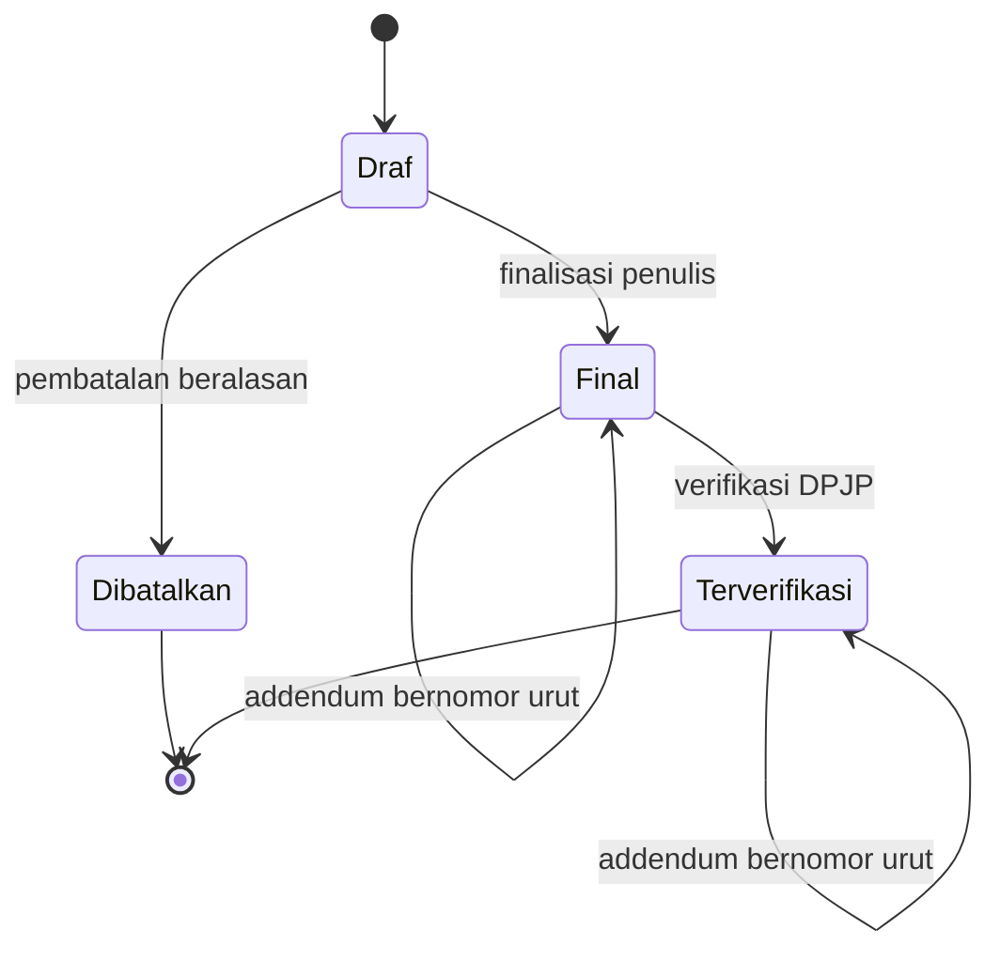

# State Transition Matrix — Sub-modul `dokter-rawat-inap` (Rawat Inap)

| Field | Nilai |
| --- | --- |
| Blueprint ID | `RWI-BP-001` |
| Sub-modul | `dokter-rawat-inap` — bentuk `COMPOSITE`, `RWI-DEC-082` |
| Contract version | **`0.6.0`** |
| `last_changed_in` | **`0.6.0`** — bagian 8 lahir: registrasi sejak konsep dan penguncian saat penutupan, verifikasi DPJP terakhir, pesanan tindakan dan instruksi, butir resep, rekonsiliasi, sliding scale. Sebelumnya `0.5.0` bagian 3A |
| Status | **`draft`** untuk `0.6.0`. `0.5.0` **`approved`** — disetujui **Muhammad Hamzah** 2026-09-11 lewat `RWI-DEC-105` |
| Owner | Product/Domain: **Muhammad Hamzah** (`RWI-DEC-061`); pemilik tabel: `ClinicalManagement`, `PharmacyManagement`, `LaboratoryManagement`, `RadiologyManagement`, `MedicalRecordManagement` |
| `approved_by` / `approved_at` | **Muhammad Hamzah** / **2026-09-03** |
| `input_revision` | `02-backend-architecture.md` `0.2`; arsitektur domain `0.2` |
| `input_hash` | Arsitektur domain SHA-256 `226c6ef1e4bfec544c366b265fe1e4530e80c510da33c1a9eaf2e62161d0b717` |
| Compatibility impact | `0.3.0`: perpindahan ke `Completed` kini **sekaligus** mendaftarkan dokumen ke mesin keutuhan dan menguncinya sebagai tertanda tangan. Nol nilai status baru. Sebelumnya `0.2.0` mencabut status `Amended` dan melahirkan mesin event visite |
| Tanggal | 2 September 2026 |

---

## 0. Mesin status yang dibahas, dan yang bukan milik sub-modul ini

| Mesin | Milik | Dibahas di sini |
| --- | --- | --- |
| Catatan dokter dan SOAP | `ClinicalManagement` | Ya |
| Kajian medis | `ClinicalManagement` | Ya |
| Verifikasi CPPT | `ClinicalManagement` | Ya |
| Tindakan dokter | `ClinicalManagement` | Ya |
| **Event visite** | `ClinicalManagement` | Ya — mesin baru |
| Integritas dan koreksi dokumen | `MedicalRecordManagement` | Ya — dipakai apa adanya |
| Pemenuhan resep | `PharmacyManagement` | **Dibaca saja** — `RUL-DOK-01` |
| Pesanan laboratorium dan radiologi | `LaboratoryManagement`, `RadiologyManagement` | **Dibaca saja** — `RUL-DOK-02` |
| Status episode | `episode-rawat-inap` | **Tidak** — `RWI-DEC-009` mengunci lima nilainya |

### 0.1 Yang berubah dari `0.1.0`

| Perubahan | Alasan |
| --- | --- |
| Status `Amended` **dicabut** dari mesin catatan, kajian, dan tindakan | Koreksi dipegang mesin addendum `MedicalRecordManagement`; menambah status keenam membuat dua sumber jawaban |
| Nilai status tindakan diselaraskan dengan enum yang benar-benar ada | Enum di source berbunyi `Planned`, `Ordered`, `InProgress`, `Completed`, `Cancelled` — bukan `Ordered`/`Performed`/`Amended` seperti tertulis pada `0.1.0` |
| Mesin **event visite** ditambahkan | `RWI-DEC-084`, `RWI-DEC-085` |
| Mesin "status pengiriman tagihan" **dicabut** | Sudah dijawab hasil penerbitan fakta klinis beserta `IsBillingGenerated` |

---

## 1. Catatan dokter dan SOAP

| Dari status | Tindakan | Ke status | Siapa yang boleh | Syarat | Bila dilanggar |
| --- | --- | --- | --- | --- | --- |
| *(belum ada)* | Membuat catatan | `Draft` | Dokter yang berwenang atas pasien itu | Konteks klinis sah; episode `Admitted` atau `DischargePending` | `422` |
| `Draft` | Mengisi S/O/A/P | `InProgress` | Penulisnya | — | — |
| `Draft` / `InProgress` | Menyelesaikan | `Completed` | Penulisnya | Sekurang-kurangnya satu bagian terisi | `400` |
| `Completed` | — | — | — | **Perpindahan ini sekaligus mendaftarkan catatan ke mesin keutuhan sebagai tertanda tangan, dalam transaksi yang sama.** Bila pendaftaran gagal, perpindahan ikut batal | `RWI-DEC-086`, `RWI-DEC-087` |
| `Draft` / `InProgress` | Membatalkan | `Cancelled` | Penulisnya atau supervisor klinis | Alasan wajib | `400` |
| `Completed` | **Mengoreksi** | Tetap `Completed` | Penulisnya, atau penulis pengganti yang punya pendelegasian sah | Alasan koreksi wajib; addendum bernomor urut tersimpan | `403` bagi yang tidak berwenang |

### 1.1 Transisi yang tidak sah

| Dari | Ke | Kenapa dilarang |
| --- | --- | --- |
| `Completed` | `Draft` / `InProgress` | Membuka kembali catatan final menghapus jejak bahwa ia pernah final |
| `Cancelled` | Apa pun | Status terminal |
| Apa pun | Terhapus | Penghapusan bersifat penandaan; hard delete dilarang |
| Apa pun | Status baru saat episode `Closed` | `INV-DOK-03`. **Kecuali** penambahan addendum, yang justru tidak mengaktifkan kembali episode |

> **Baris terakhir adalah pembeda halus yang penting.** Episode tertutup menolak catatan **baru**,
> tetapi menerima **koreksi** catatan lama. Menyamakan keduanya membuat kesalahan tulis pada
> episode yang sudah ditutup tidak pernah dapat dibetulkan.

---

## 2. Kajian medis

Memakai mesin status yang sama dengan pengkajian keperawatan — `Draft`, `InProgress`, `Completed`,
`Cancelled` — karena tabelnya sama. Pembedanya jenis kajian dan siapa yang boleh menulisnya.

| Dari | Tindakan | Ke | Siapa yang boleh | Syarat |
| --- | --- | --- | --- | --- |
| *(belum ada)* | Membuat kajian medis | `Draft` | **Dokter saja** | Konteks klinis sah; belum ada kajian medis berlaku pada episode itu |
| `Draft` | Melanjutkan mengisi | `InProgress` | Penulisnya | — |
| `InProgress` | Menyelesaikan | `Completed` | Penulisnya | Isian minimum terpenuhi |
| `Draft` / `InProgress` | Membatalkan | `Cancelled` | Penulisnya atau supervisor | Alasan wajib |
| `Completed` | Mengoreksi | Tetap `Completed` | Penulisnya atau pengganti sah | Addendum, alasan wajib |

| Transisi tidak sah | Kenapa |
| --- | --- |
| Kajian medis ditimpa catatan SOAP harian | Keduanya tabel berbeda; penimpaan **tidak mungkin terjadi secara struktur** |
| Perawat membuat kajian medis | `VAL-DOK-05` |

---

## 3. Verifikasi CPPT

| Dari status | Tindakan | Ke status | Siapa yang boleh | Syarat | Bila dilanggar |
| --- | --- | --- | --- | --- | --- |
| `NotRequired` | — | — | — | Kebijakan verifikasi tidak aktif | — |
| `Pending` | Memverifikasi | `Verified` | **DPJP yang aktif pada saat verifikasi** | Verifikator bukan penulis aslinya | `403` |
| `Pending` | Lewat batas waktu | `Overdue` | *(sistem)* | Kebijakan aktif punya batas | — |
| `Overdue` | Memverifikasi | `Verified` | DPJP aktif | — | — |
| `Verified` | Catatan dikoreksi lewat addendum | `Pending` | Penulis asli atau pengganti sah | Alasan wajib; verifikasi ulang dibutuhkan | `400` bila alasan kosong |

### 3.1 Aturan yang tidak boleh dilanggar

| Aturan | Sumbernya |
| --- | --- |
| **Verifikasi tidak pernah mengubah penulis asli.** Penulis tetap; verifikator disimpan terpisah | `INV-DOK-11`, `AC-CAP021-03` |
| Verifikator adalah DPJP yang aktif **saat verifikasi**, bukan yang aktif saat catatan ditulis | `RWI-RULE-030` |
| Bawaan `NotRequired`, bukan `Pending` | Menyalakan kewajiban sebagai bawaan membuat daftar pantau penuh pada rumah sakit yang tidak mewajibkannya |
| `Overdue` **tidak menahan** penulisan catatan berikutnya | Verifikasi adalah pemantauan mutu, bukan gerbang pelayanan — `RWI-RULE-021` |

---

## 3A. Penutupan jalur hapus catatan terpadu — `0.5.0`

**Bagian baru 11 September 2026**, menyerap `RWI-DEC-098`. Sebelum ini mesin status catatan
terpadu memiliki satu jalan keluar yang tidak pernah dirancang: baris `IsDelete` bernilai benar,
yang menghilangkan catatan dari seluruh pembacaan normal tanpa meninggalkan keadaan yang dapat
dibaca.

### 3A.1 Keadaan yang dicabut

| Keadaan | Cara mencapainya sebelum `0.5.0` | Ketetapan `0.5.0` |
| --- | --- | --- |
| **Terhapus** | `DELETE /{id}` mengubah `IsDelete` menjadi benar, `IsActive` menjadi salah | **Dicabut.** Keadaan ini tidak dapat dicapai lagi dari API mana pun |

Yang membuatnya berbahaya bukan penghapusan datanya, melainkan bahwa ia **tidak menyisakan
keadaan**. Catatan yang dibatalkan masih terbaca sebagai "dibatalkan beserta alasannya"; catatan
yang dihapus tidak terbaca sama sekali, sehingga pembaca berikutnya tidak punya cara mengetahui
bahwa pernah ada sesuatu di sana.

### 3A.2 Mesin status setelah pencabutan

Catatan `Final` dan `Terverifikasi` **tidak pernah** kembali menjadi `Draf`, dan **tidak pernah**
menjadi `Dibatalkan`. Koreksinya hanya lewat addendum, dan addendum tidak mengubah isi aslinya.

### 3A.3 Transisi yang tidak sah, dan jawabannya

| Percobaan | Jawaban | Kenapa |
| --- | --- | --- |
| `DELETE /{id}` pada catatan mana pun | **`404`** | Route tidak ada. Bukan `403`, karena `403` menyiratkan endpointnya ada dan hanya kurang hak akses |
| Membatalkan catatan `Final` | **`422`** | Jalur pembatalan wajib memanggil pemeriksaan keutuhan dokumen lebih dulu. Diarahkan ke addendum |
| Membatalkan catatan `Terverifikasi` | **`422`** | Sama |
| Membatalkan catatan `Draf` tanpa alasan | `400` | Alasan wajib |
| Membatalkan catatan `Draf` beserta alasan | `200` | Jalur normal |
| Menambah addendum pada catatan `Draf` | `422` | Addendum hanya untuk dokumen yang sudah terkunci |

### 3A.4 Satu perubahan perilaku pada endpoint yang sudah ada

`PATCH /{id}/cancel` sudah tersedia sejak `0.3.0`, tetapi hari ini **tidak** memanggil
`EnsureMutableAsync`. Pemeriksaan keutuhan di controller yang sama hanya terpasang pada jalur
pembaruan. Sejak `0.5.0`, jalur pembatalan wajib memanggilnya lebih dulu.

Tanpa perubahan itu, menutup `DELETE` hanya memindahkan lubangnya: catatan final yang tadinya dapat
dihapus akan dapat dibatalkan, dan hasilnya sama saja bagi pembaca rekam medis.

---
## 4. Tindakan dokter

Nilai status diambil apa adanya dari enum yang sudah ada di source.

| Dari status | Tindakan | Ke status | Siapa yang boleh | Syarat |
| --- | --- | --- | --- | --- |
| *(belum ada)* | Merencanakan tindakan | `Planned` | Dokter berwenang | Konteks klinis sah |
| *(belum ada)* | Mencatat tindakan yang langsung dikerjakan | `InProgress` lalu `Completed` | Dokter pelaksana | Konteks sah; waktu tidak di masa depan |
| `Planned` | Menjadwalkan atau menyetujui | `Ordered` | Dokter berwenang | — |
| `Planned` / `Ordered` | Melaksanakan | `InProgress` | Dokter pelaksana | — |
| `InProgress` | Menyelesaikan | `Completed` | Dokter pelaksana | Waktu dan pelaksana terisi |
| `Planned` / `Ordered` / `InProgress` | Membatalkan | `Cancelled` | Dokter atau supervisor | Alasan wajib |
| `Completed` | Mengoreksi | Tetap `Completed` | Pelaksananya | Addendum, alasan wajib |

### 4.1 Penerbitan fakta klinis ke Billing — **bukan status tindakan**

| Keadaan penerbitan | Artinya | Yang terjadi pada catatan klinis |
| --- | --- | --- |
| Diterbitkan | Fakta diterima Billing | Tidak berubah |
| Diputar ulang | Fakta identik sudah pernah diterbitkan; hasil yang sama dikembalikan | Tidak berubah |
| Ditekan tanpa tagihan sebelumnya | Pembatalan klinis terjadi sebelum tagihan terbentuk | Tidak berubah |
| Perlu rekonsiliasi | Keadaan sebelumnya tidak diketahui | Tidak berubah; **wajib direkonsiliasi sebelum koreksi finansial** |
| Ditolak Billing atau hasil tidak diketahui | Pengiriman gagal | **Tetap `Completed`** — `INV-DOK-09` |

> Keadaan di atas adalah keadaan **pengiriman**, bukan status tindakan. Menyimpannya sebagai status
> tindakan akan membuat kegagalan sistem keuangan terlihat seperti tindakan medis yang batal.

---

## 5. Event visite dokter — mesin baru

| Dari status | Tindakan | Ke status | Siapa yang boleh | Syarat | Bila dilanggar |
| --- | --- | --- | --- | --- | --- |
| *(belum ada)* | Mencatat visite | `Recorded` | Dokter yang berwenang atas pasien itu | Konteks klinis sah; kunci permintaan terisi; waktu tidak di masa depan | `400` atau `422` |
| *(belum ada)* | Mengirim ulang dengan kunci yang sama | **Tetap event yang sama** | Sama | Kunci permintaan identik | `200`, bukan galat |
| `Recorded` | Menautkan dokumen | `Recorded` | Pemilik event | Dokumen milik episode yang sama | `400` bila dokumen milik episode lain |
| `Recorded` | **Membatalkan karena salah catat** | `Cancelled` | Pemilik event atau supervisor | **Alasan wajib** | `400` bila alasan kosong |
| `Cancelled` | — | — | — | **Status terminal** | `409` bila dibatalkan dua kali |

### 5.1 Transisi yang tidak sah, dan kenapa

| Dari | Ke | Kenapa dilarang |
| --- | --- | --- |
| `Recorded` | `Recorded` dengan waktu atau peran berbeda | **Penyuntingan di tempat dilarang.** Event menyatakan fakta kedatangan; mengubah waktunya berarti fakta yang berbeda — `RWI-DEC-085` |
| `Cancelled` | `Recorded` | Event yang dibatalkan tidak dihidupkan kembali. Yang benar adalah mencatat event baru |
| Apa pun | Terhapus | `INV-DOK-08`: event yang dibatalkan **tetap tersimpan** dan tetap terbaca auditor |

### 5.2 Cara koreksi yang benar

1. Batalkan event yang salah beserta alasannya. Ia tetap tampil pada riwayat dengan penanda batal.
2. Catat event baru dengan kunci permintaan **baru**, menunjuk event yang digantikannya.
3. Hitungan visite hanya menghitung event berstatus `Recorded`.

> **Contoh.** dr. Andi visite pukul 07.40 tetapi mengisi 17.40. Ia membatalkan dengan alasan
> "salah ketik jam", lalu mencatat event baru pukul 07.40. Riwayat Tn. Budi menampilkan **dua
> baris**: satu batal beserta alasannya, satu berlaku. Hitungan visite hari itu tetap **1**.

### 5.3 Hitungan, dengan angka

| Keadaan pada 12 September 2026 | Baris tersimpan | Hitungan | Dasar |
| --- | ---: | ---: | --- |
| dr. Andi visite pukul 07.40 lalu kembali pukul 16.10 | 2 | **2** | `RWI-AC-154` |
| Tombol Simpan tertekan dua kali dengan kunci sama | 1 | **1** | `RWI-AC-152` |
| dr. Andi dan dr. Sinta masing-masing sekali | 2 | **2** | `RWI-RULE-017` |
| Tiga SOAP ditulis tanpa satu pun event visite | 0 | **0** | `RWI-AC-151` |
| Satu event salah catat, dibatalkan, lalu dicatat ulang | 2 | **1** | `INV-DOK-08` |
| Billing menggabungkan dua event menjadi satu tagihan harian | 2 | **2** pada riwayat klinis | `RWI-AC-156` |

---

## 6. Integritas dan koreksi dokumen — milik `MedicalRecordManagement`

Nilai status diambil apa adanya dari enum yang sudah ada.

| Dari status | Tindakan | Ke status | Siapa yang boleh | Syarat |
| --- | --- | --- | --- | --- |
| `Draft` | Penulis menandatangani | `Signed` | Penulis dokumen | Dokumen sudah final |
| `Draft` | Kunjungan ditutup tanpa tanda tangan | `LockedUnsigned` | *(sistem)* | Pemicu penguncian tercatat |
| `Signed` / `LockedUnsigned` | Menambah addendum | Tidak berubah | Penulis asli | **Alasan koreksi wajib** |
| `Signed` / `LockedUnsigned` | Menambah addendum **atas nama penulis** | Tidak berubah | **DPJP aktif episode itu**, bila akun penulis nonaktif atau ada penetapan berhalangan yang berlaku | Alasan koreksi wajib; penulis asli tetap tercantum sebagai penulis catatan |
| `Draft` | Menambah addendum | **Ditolak** | — | Dokumen belum terkunci; perbaiki langsung pada catatannya |
| `Draft` / `Signed` | Membatalkan dokumen | `Cancelled` | Sesuai aturan modul pemiliknya | Alasan wajib |

### 6.1 Tiga tingkat kewenangan koreksi

| Tingkat | Keadaan | Siapa yang boleh | Perlu penetapan? |
| --- | --- | --- | --- |
| 1 | Penulis masih aktif | **Penulis asli** | Tidak |
| 2 | Akun penulis sudah nonaktif | **DPJP aktif episode itu** | **Tidak** — disimpulkan sistem |
| 3 | Penulis berhalangan sementara | **DPJP aktif episode itu** | **Ya** — penetapan kepala unit, wajib berbatas waktu |

> **Pertanyaan `0.2.0` sudah terjawab.** Dokumen terkunci bukan hanya menerima koreksi — ia
> **satu-satunya** keadaan yang menerimanya. Dokumen berstatus konsep justru ditolak, dengan arahan
> memperbaiki langsung pada catatannya.
>
> **Satu batas yang bukan milik mesin ini.** Penetapan berhalangan menyatakan "dokter ini
> berhalangan" tanpa menyebut penggantinya, sehingga pembatasan pada tingkat 2 dan 3 bahwa hanya
> **DPJP aktif episode itu** yang boleh mengoreksi dijaga di sisi Rawat Inap, bukan di sini —
> `INV-DOK-13`.

---

## 7. Status milik modul lain yang hanya dibaca

| Mesin | Nilai yang dibaca | Yang **tidak boleh** dilakukan sub-modul ini |
| --- | --- | --- |
| Pemenuhan resep | Menunggu finalisasi klinis dan seterusnya, milik `PharmacyManagement` | **Menulis** status apa pun — `RUL-DOK-01` |
| Pesanan laboratorium | `Requested`, ditahan, dikerjakan, selesai, dibatalkan | Menulis status maupun hasil — `RUL-DOK-02` |
| Pesanan radiologi | `Requested`, diterima, dijadwalkan, dikerjakan, selesai | Sama |
| Status episode | `Draft`, `Admitted`, `DischargePending`, `Closed`, `Cancelled` | Mengubahnya. Sub-modul ini hanya membacanya sebagai syarat |

Menampilkannya di layar adalah membaca. Mengubahnya adalah pelanggaran batas.

---

## 8. Perubahan pada `contract_version` `0.6.0` — penyelarasan `PRD-RWI-V2-001` ★ 15 September 2026

**Status `draft`.** Masukan: `02-backend-architecture.md` `0.5` bagian 11; decision log revision `21`. Bagian 1, 2,
dan 3 di atas tetap berlaku kecuali baris yang disebut digantikan di sini.

### 8.1 Registrasi keutuhan konsep SOAP dan kajian medis rawat inap — `RWI-DEC-144`, `RWI-DEC-138`

Mesin milik `MedicalRecordManagement` (`ClinicalDocumentIntegrityStatus`) **tidak bertambah nilai**. Yang berubah
**kapan** registrasi lahir, dan **siapa** yang memindahkannya.

| Dari status | Tindakan | Ke status | Siapa yang boleh | Syarat | Bila dilanggar |
| --- | --- | --- | --- | --- | --- |
| *(belum ada)* | Konsep SOAP atau kajian medis rawat inap pertama kali disimpan | `Draft` | *(sistem)*, dalam transaksi yang sama dengan pembuatan dokumen | Kunjungan punya episode rawat inap; penulis memenuhi `INV-DOK-15` | Pembuatan dokumen ikut batal; nol registrasi yatim |
| `Draft` | Simpan otomatis atau kiriman ulang | Tetap `Draft` | *(sistem)* | Registrasi yang sama dikembalikan — idempoten per jenis dan id dokumen | — |
| `Draft` | Penulis menekan Selesai | `Signed` | **Penulis dokumen saja** | Isi lolos validasi penyelesaian; episode belum `Closed` | `403` bagi selain penulis — `VAL-DOK-41` |
| `Draft` | Penulis membatalkan konsep | `Cancelled` | Penulis | Alasan wajib; baris registrasi tidak dihapus | `400` |
| `Draft` | Episode ditutup | `LockedUnsigned`, `LockTrigger = EncounterClosed` | *(sistem)*, dipicu penutupan milik `episode-rawat-inap` | Satu transaksi dengan penutupan | Penutupan ikut gagal secara teknis, bukan ditahan aturan bisnis — `INT-DOK-13` |
| `Signed` / `LockedUnsigned` | Addendum | Tetap | Penulis lewat "Catatan Saya", atau pengganti sah `RWI-DEC-088` | Alasan wajib | `403` |

**Transisi tidak sah**

| Dari | Ke | Kenapa dilarang |
| --- | --- | --- |
| `LockedUnsigned` | `Signed` | Menandatangani belakangan menghapus fakta bahwa catatan itu tidak ditandatangani saat perawatan berakhir — `RWI-DEC-138` butir (2) |
| `LockedUnsigned` | `Draft` | Termasuk saat episode dibuka kembali lewat sesi koreksi — `RWI-AC-201` |
| `Draft` | `Signed` oleh selain penulis | Tanda tangan adalah tindakan penulis — `RWI-DEC-128` butir (3), `RLN3-CAP-33` |
| `Draft` | Registrasi kedua untuk dokumen yang sama | `RWI-AC-215`, `RWI-AC-216` |

**Contoh.** 06.30 dr. Yoga menyimpan konsep SOAP Joko → registrasi `Draft`. 06.31 simpan otomatis dua kali → tetap
satu registrasi. 13.00 episode Joko ditutup → registrasi `LockedUnsigned`; dokumen konsultasinya tidak lagi dapat
disunting. Jumat 09.00 dr. Yoga menambah addendum dari "Catatan Saya" → catatan asli tetap bertanda "Tidak
Ditandatangani", addendum bertanda tangan dr. Yoga Jumat 09.00.

> **Baris yang digantikan.** Bagian 1 baris "`Completed` — perpindahan ini sekaligus mendaftarkan catatan ke mesin
> keutuhan" **tidak berlaku** bagi SOAP dan kajian medis rawat inap: registrasinya sudah ada sejak konsep dan hanya
> berpindah `Draft → Signed`. Untuk poliklinik dan IGD baris itu tetap berlaku — `RWI-DEC-144` butir (7). Konsep
> rawat inap lama yang belum terdaftar tetap didaftarkan saat final — butir (8).

### 8.2 Verifikasi CPPT — pengganti kolom "Siapa yang boleh" bagian 3

| Dari status | Tindakan | Ke status | Siapa yang boleh | Syarat | Bila dilanggar |
| --- | --- | --- | --- | --- | --- |
| `Pending` / `Overdue` | Memverifikasi, episode belum `Closed` | `Verified` | Dokter dengan penugasan **berperan DPJP** yang aktif pada detik verifikasi | Verifikator bukan penulis | `403` — `VAL-DOK-44` |
| `Pending` / `Overdue` | Memverifikasi, episode `Closed` | `Verified` | **DPJP terakhir** episode itu | Entri ditulis **sebelum** penutupan; keterlambatan tetap tercatat | `403` bagi DPJP sebelumnya; `422` bagi entri yang ditulis setelah penutupan |

| Transisi tidak sah | Kenapa |
| --- | --- |
| Verifikasi oleh konsulen, dokter jaga, kepala unit, atau penugasan singkat `LateDocumentation` | `RWI-DEC-125` butir (1), `RWI-DEC-130` butir (5) |
| Verifikasi "atas nama" | Tidak ada jalurnya; jalur atas nama `RWI-DEC-088` hanya untuk addendum |
| `Overdue` → `Pending` karena verifikasi terlambat | Keterlambatan tidak dihapus oleh verifikasi — `RWI-DEC-126` butir (6) |

### 8.3 Pesanan tindakan rawat inap — pengganti bagian 4 untuk tahap pesanan

Nilai enum `PatientProcedureStatus` tidak bertambah. `Planned` dan `Ordered` dibaca sebagai **pesanan tertunda**.

| Dari status | Tindakan | Ke status | Siapa yang boleh | Syarat | Bila dilanggar |
| --- | --- | --- | --- | --- | --- |
| *(belum ada)* | Dokter membuat pesanan | `Ordered`, `InstructionVerificationStatus = NotRequired` | Dokter dengan penugasan sah (`INV-DOK-15`) | Episode `Admitted`/`DischargePending` | `403` / `422` |
| *(belum ada)* | Perawat membuat pesanan atas instruksi | `Ordered`, `InstructionVerificationStatus = Pending` | Perawat di unit episode (`RWI-DEC-100`) | Dokter pemberi instruksi punya penugasan aktif | `400` tanpa pemberi instruksi; `403` pemberi instruksi tidak bertugas |
| `Planned` / `Ordered` | Mengubah isi | Tetap | **Penginput saja** | Belum dilaksanakan | `403` — `VAL-DOK-48` |
| `Planned` / `Ordered` | Membatalkan | `Cancelled` | Penginput **atau** DPJP aktif | Alasan wajib; belum menimbulkan tagihan | `403` / `400` / `409` — `VAL-DOK-49` |
| `Planned` / `Ordered` | Episode ditutup | `Cancelled`, `CancelledByEpisodeClosure = true`, alasan "episode ditutup sebelum dilaksanakan" | *(sistem)*, dipicu penutupan | Belum dilaksanakan **dan** belum menimbulkan tagihan | Pesanan tertagih **tidak** dibatalkan; masuk daftar pantau; penutupan tidak ditahan |
| `Ordered` | Melaksanakan | `Completed` | Dokter atau perawat berwenang; akun login menjadi penulis catatan pelaksanaan | Episode belum `Closed` | `422` |
| Verifikasi `Pending` | Dokter pemberi instruksi memverifikasi | `Verified` | **Dokter pemberi instruksi saja** | Tidak bergantung status pesanan; pesanan yang sudah dilaksanakan tetap dapat diverifikasi | `403` / `409` — `VAL-DOK-50` |

**Contoh.** 10.00 dr. Ahmad, konsulen, memesan fisioterapi dada. 12.00 dr. Rina, DPJP, membatalkannya: "pasien pulang
hari ini" → `Cancelled`. 13.00 episode ditutup; pesanan cek GDS Ns. Siti yang belum dilaksanakan → `Cancelled`
otomatis. Tidak ada satu pun pesanan berstatus "Tidak Ditandatangani" — `RWI-AC-214`.

| Transisi tidak sah | Kenapa |
| --- | --- |
| Pemberi instruksi mengubah isi pesanan perawat | `RWI-DEC-139` butir (2) |
| Verifikasi mengubah penginput | Sama |
| `Completed` → `Cancelled` lewat jalur batal pesanan | Di luar `RWI-DEC-143` butir (6) |

### 8.4 Butir resep — penghentian `RWI-DEC-121`

| Dari | Tindakan | Ke | Siapa yang boleh | Syarat | Bila dilanggar |
| --- | --- | --- | --- | --- | --- |
| Butir aktif (`IsStopped = false`) pada resep aktif | Menghentikan | `IsStopped = true` | Dokter dengan penugasan aktif | Alasan wajib | `403` / `400` |
| Butir aktif | *(akibat dalam transaksi yang sama)* | Dosis MAR `Due` sesudah `StoppedAt` → `Cancelled` "resep dihentikan"; order sliding scale butir itu → `Stopped` | *(sistem)* | — | Seluruhnya batal bersama |
| `IsStopped = true` | Menghentikan lagi | — | — | — | `409` |
| `IsStopped = true` | Menghidupkan kembali | **Tidak sah** | — | Terapi baru ditulis sebagai butir resep baru | `409` |

### 8.5 Rekonsiliasi obat — `RWI-DEC-132`

| Dari `CurrentDecision` | Tindakan | Ke | Siapa yang boleh | Syarat | Bila dilanggar |
| --- | --- | --- | --- | --- | --- |
| *(belum ada)* | Perawat mencatat obat bawaan | `Pending` | Perawat di unit episode | `DrugId` dari master | `400` |
| `Pending` | Perawat membatalkan baris salah catat | `IsActive = false` | Perawat di unit episode | Alasan wajib | `409` bila sudah ada keputusan |
| `Pending` | Dokter memutuskan | `ContinueSame` / `ContinueModified` / `Stopped` | Dokter berwenang menulis resep | "Lanjut" membentuk butir draft resep | `403` |
| `ContinueSame` / `ContinueModified` / `Stopped` | Dokter mengganti keputusan | Nilai baru; baris keputusan baru menunjuk yang lama | Dokter berwenang | Butir resep hasil keputusan lama **masih draft**; bila "Lanjut" diganti "Hentikan", butir draft itu dikeluarkan dari draft dalam transaksi yang sama | `409` bila resep hasilnya sudah aktif — `VAL-DOK-52` |

### 8.6 Template sliding scale — versi

| Dari | Tindakan | Ke | Siapa yang boleh | Syarat | Bila dilanggar |
| --- | --- | --- | --- | --- | --- |
| *(belum ada)* | Membuat versi | `Draft` | Pemegang `SlidingScaleTemplate : Update` | Rentang sah | `400` |
| `Draft` | Mengubah | `Draft` | Pemegang hak ubah; `LastModifiedByUserId` diperbarui | Rentang sah | `400` |
| `Draft` | Mengesahkan | `Approved`; versi `Approved` sebelumnya → `Retired` | Pemegang `SlidingScaleTemplate : Approve` yang **bukan** pengubah terakhir | — | `403` |
| `Approved` | Mengubah | **Tidak sah** — buat versi baru | — | — | `409` |
| `Retired` | Apa pun | Terminal | — | Order yang sudah memakainya **tidak** terpengaruh | `409` |

### 8.7 Order sliding scale

| Dari | Tindakan | Ke | Siapa yang boleh | Syarat | Bila dilanggar |
| --- | --- | --- | --- | --- | --- |
| *(belum ada)* | Memesan | `Active`, versi order 1 | Dokter berwenang menulis resep | Versi template `Approved`; butir insulin `DoseKind = SlidingScale` belum punya order | `409` / `403` |
| `Active` | Menyesuaikan | `Active`, versi order +1 | Dokter berwenang | Alasan wajib; `ExpectedVersionNumber` cocok | `400` / `409` |
| `Active` | Menghentikan, atau butir insulinnya dihentikan | `Stopped` | Dokter berwenang, atau *(sistem)* | Alasan wajib | `400` |
| `Stopped` | Menyesuaikan atau menghidupkan | **Tidak sah** — pesan ulang sebagai order baru | — | — | `409` |

Pelaksanaan dari order `Stopped` ditolak pada kontrak `keperawatan` `0.5.0` — `RWI-AC-226`.

### 8.8 Status milik sub-modul lain yang dibaca pada `0.6.0`

| Status | Milik | Yang tidak boleh dilakukan sub-modul ini |
| --- | --- | --- |
| `MedicationDoseStatus` (`Due`, `Administered`, `Held`, `Refused`, `Missed`, `Cancelled`) | `keperawatan` / `PharmacyManagement` | Mengubahnya selain lewat penghentian butir resep |
| Penugasan dokter `AssignmentRole`, `AssignmentPurpose` | `episode-rawat-inap` | Membuat atau mengakhiri penugasan |
| Resume `SignedAt` | `episode-rawat-inap` | Menandatangani selain lewat endpoint episode |
