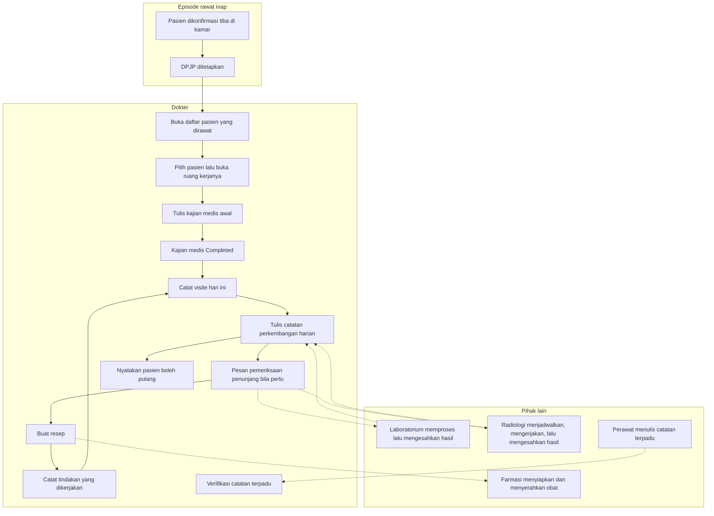

# Alur Utama Dokter Rawat Inap

| Field | Nilai |
| --- | --- |
| Sub-modul | `dokter-rawat-inap` |
| Revision | `0.2` |
| Status | `approved` — disetujui Muhammad Hamzah, 2026-09-03 |
| `approved_by` / `approved_at` | **Muhammad Hamzah** / **2026-09-03** |
| Isi | **Jalur normal saja.** Jalur pengecualian ada pada berkas per proses |
| Sumber | `PRD-RWI-FINAL-001` bagian 18 dan 19; arsitektur domain `0.2` bagian U |
| Berkas per proses | [`01-catatan-harian-dan-cppt.md`](./01-catatan-harian-dan-cppt.md), [`02-visite-dokter.md`](./02-visite-dokter.md) |

---

## 1. Dari pasien masuk sampai rencana pulang

Nama keadaan sama persis dengan
[`../contracts/state-transition-matrix.md`](../contracts/state-transition-matrix.md).

Garis putus-putus berarti **menyerahkan atau menerima**, bukan menunggu. Dokter tidak menahan
langkahnya menunggu Farmasi, Laboratorium, maupun Radiologi.

Panah balik dari tindakan ke visite adalah irama harian: setiap hari dokter datang, mencatat
visitenya, menulis perkembangan, dan bila perlu memesan, meresepkan, atau bertindak.

> **Yang berubah dari revision `0.1`:** langkah membuka daftar pasien dipisah dari langkah membuka
> ruang kerja, karena sumber daftarnya berpindah dari antrean rawat jalan ke census episode; dan
> Radiologi masuk sebagai pihak yang benar-benar ada.

---

## 2. Tabel langkah

| No | Langkah | Pelaku | Masukan yang dibutuhkan | Keluaran | Bila gagal, petugas melakukan |
| ---: | --- | --- | --- | --- | --- |
| 1 | Pasien dikonfirmasi tiba di kamar | Admisi atau supervisor | Pasien hadir di kamar | Perawatan resmi berjalan | Bukan pekerjaan dokter. Hubungi admisi |
| 2 | DPJP ditetapkan | Admisi saat admisi, atau supervisor | Daftar dokter | Penanggung jawab tercatat | Tanpa DPJP, dokter jaga tetap dapat menulis; episodenya muncul di daftar pantau |
| 3 | Buka daftar pasien yang dirawat | Dokter | Daftar pasien dirawat, disaring pada dokter yang masuk | Daftar pasiennya sendiri | Muat ulang daftar. **Jangan** memakai daftar antrean poliklinik |
| 4 | Buka ruang kerja satu pasien | Dokter | Baris pasien terpilih | Konteks pasien tampil | Muat ulang. Jangan menulis sebelum konteks pasti |
| 5 | Tulis kajian medis awal | DPJP | Keadaan pasien, riwayat, hasil pemeriksaan | Kajian tersimpan bertahap | Isian tersimpan sebagai belum selesai |
| 6 | Selesaikan kajian medis | DPJP | Kajian lengkap beserta diagnosis | Kajian `Completed` | Sistem menyebut bagian yang masih kosong |
| 7 | Catat visite | Dokter | Kunjungan yang benar-benar dilakukan | Event visite tersimpan | Bila tombol tertekan dua kali, tetap satu event |
| 8 | Tulis catatan perkembangan harian | Dokter | Keadaan pasien hari itu | Catatan baru, **tidak menimpa** kajian awal | Isian tidak hilang |
| 9 | Pesan penunjang | Dokter | Indikasi klinis | Pesanan terkirim ke Laboratorium atau Radiologi | Pesanan gagal dapat diulang; tidak ada pesanan ganda |
| 10 | Buat resep | Dokter | Obat, dosis, aturan pakai, jenis resep | Resep terkirim ke Farmasi | Ulangi dengan kunci yang sama; tidak ada resep ganda |
| 11 | Catat tindakan | Dokter | Tindakan yang dikerjakan | Catatan tersimpan | Kegagalan tagihan **tidak** menghilangkan catatan |
| 12 | Verifikasi catatan terpadu | DPJP | Catatan profesi lain | Terverifikasi; **penulis aslinya tidak berubah** | Bila kebijakan verifikasi belum ada, langkah ini tidak muncul |
| 13 | Nyatakan boleh pulang | DPJP | Keadaan pasien | Keputusan pulang tercatat | **Bukan milik sub-modul ini** — `CAP-026` milik `episode-rawat-inap` |

---

## 3. Yang tidak ada di alur ini, dan kenapa

| Yang tidak ada | Alasan |
| --- | --- |
| Mengambil nomor antrean lebih dulu | Pasien menginap tidak pernah masuk antrean poliklinik — `RWI-RULE-026` aturan 2 |
| Menunggu pengkajian keperawatan selesai sebelum dokter menulis | `AC-CAP020-02` menyatakannya tegas |
| Menghitung visite dari catatan yang ditulis | `INV-DOK-07`. Visite dicatat sebagai kejadian tersendiri |
| Menandai obat sudah diserahkan | `RUL-DOK-01`. Itu pekerjaan Farmasi |
| Mengisi hasil laboratorium atau radiologi | `RUL-DOK-02`. Itu pekerjaan modul pemiliknya |
| Menulis resume pulang | `CAP-026` milik `episode-rawat-inap` |
| Menggabungkan dua visite menjadi satu demi tagihan | `RWI-DEC-085`. Agregasi milik Billing dan tidak menyentuh riwayat klinis |
