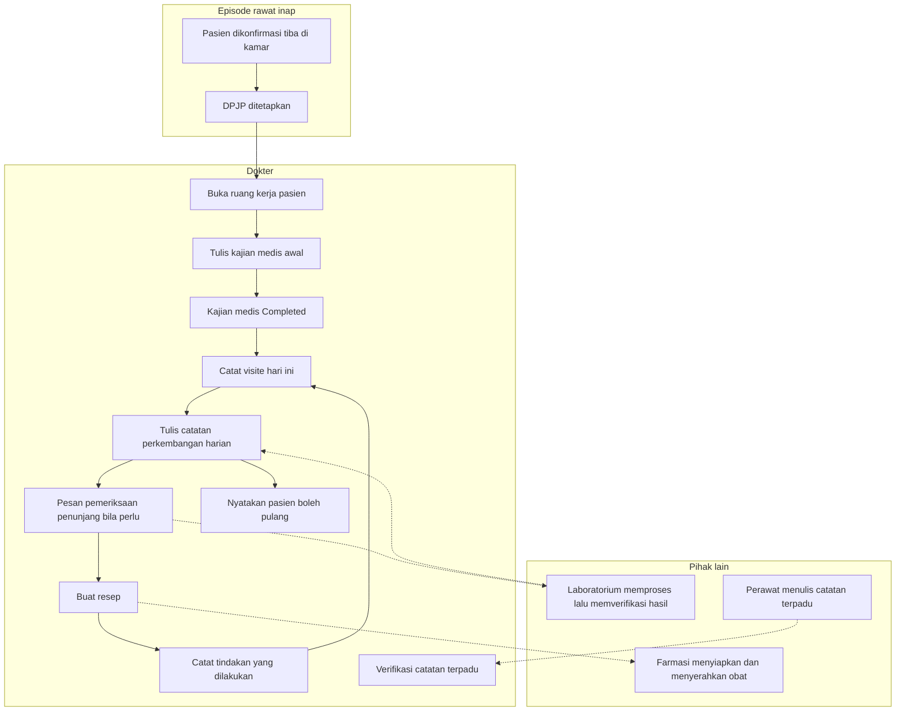

# Alur Utama Dokter Rawat Inap

| Field | Nilai |
| --- | --- |
| Sub-modul | `dokter-rawat-inap` |
| Revision | `0.1` |
| Status | `draft` |
| Isi | **Jalur normal saja.** Jalur pengecualian ada pada berkas per proses |
| Sumber | `PRD-RWI-FINAL-001` bagian 18 dan 19 |

---

## 1. Dari pasien masuk sampai rencana pulang

Nama keadaan sama persis dengan
[`../contracts/state-transition-matrix.md`](../contracts/state-transition-matrix.md).

Garis putus-putus berarti **menyerahkan atau menerima**, bukan menunggu. Dokter tidak menahan
langkahnya menunggu Farmasi maupun Laboratorium.

Panah balik dari tindakan ke visite adalah irama harian: setiap hari dokter datang, mencatat
visitenya, menulis perkembangan, dan bila perlu memesan, meresepkan, atau bertindak.

---

## 2. Tabel langkah

| No | Langkah | Pelaku | Masukan | Keluaran | Bila gagal, petugas melakukan |
| ---: | --- | --- | --- | --- | --- |
| 1 | Pasien dikonfirmasi tiba | Admisi atau supervisor | Pasien hadir di kamar | Perawatan resmi berjalan | Bukan pekerjaan dokter. Hubungi admisi |
| 2 | DPJP ditetapkan | Admisi saat admisi, atau supervisor | Daftar dokter | Penanggung jawab tercatat | Tanpa DPJP, dokter jaga tetap dapat menulis; episodenya muncul di daftar pantau |
| 3 | Buka ruang kerja | Dokter | Daftar pasien yang dirawat | Konteks pasien tampil | Muat ulang. Jangan menulis sebelum konteks pasti |
| 4 | Kajian medis awal | DPJP | Keadaan pasien, riwayat, hasil pemeriksaan | Kajian tersimpan bertahap | Isian tersimpan sebagai belum selesai |
| 5 | Selesaikan kajian medis | DPJP | Kajian lengkap beserta diagnosis | `Completed` | Sistem menyebut bagian yang kosong |
| 6 | Catat visite | Dokter | Kunjungan yang benar-benar dilakukan | Visite tercatat | Bila tombol tertekan dua kali, tetap satu visite |
| 7 | Catatan perkembangan harian | Dokter | Keadaan pasien hari itu | Catatan baru, **tidak menimpa** kajian awal | — |
| 8 | Pesan penunjang | Dokter | Indikasi klinis | Pesanan terkirim ke Laboratorium | Pesanan gagal dapat diulang; tidak ada pesanan ganda |
| 9 | Buat resep | Dokter | Obat, dosis, aturan pakai | Resep terkirim ke Farmasi | Ulangi dengan kunci yang sama; tidak ada resep ganda |
| 10 | Catat tindakan | Dokter | Tindakan yang dikerjakan | Catatan tersimpan | Kegagalan tagihan **tidak** menghilangkan catatan |
| 11 | Verifikasi catatan terpadu | DPJP | Catatan profesi lain | Terverifikasi; **penulis aslinya tidak berubah** | Bila kebijakan verifikasi belum ada, langkah ini tidak muncul |
| 12 | Nyatakan boleh pulang | DPJP | Keadaan pasien | Keputusan pulang tercatat | **Bukan milik sub-modul ini** — `CAP-026` milik `episode-rawat-inap` |

---

## 3. Yang **tidak** ada di alur ini, dan kenapa

| Yang tidak ada | Alasan |
| --- | --- |
| Menunggu pengkajian keperawatan selesai sebelum dokter menulis | `AC-CAP020-02` menyatakan tegas: SOAP dapat dibuat walaupun pengkajian awal keperawatan belum selesai |
| Menghitung visite dari catatan yang ditulis | `INV-DOK-03`. Visite dicatat sebagai peristiwa tersendiri |
| Menandai obat sudah diserahkan | `INV-DOK-04`. Itu pekerjaan Farmasi |
| Mengisi hasil laboratorium | `INV-DOK-05`. Itu pekerjaan Laboratorium |
| Menulis resume pulang | `CAP-026` milik `episode-rawat-inap` — `RWI-DEC-083` |
| Pemeriksaan radiologi | Modulnya belum ada |
