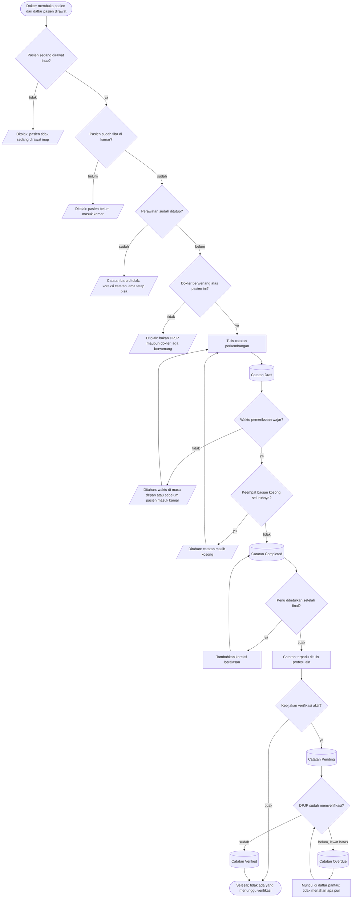

# Proses: Catatan Harian dan Catatan Terpadu

| Field | Nilai |
| --- | --- |
| Sub-modul | `dokter-rawat-inap` |
| Revision | `0.2` |
| Status | `draft` |
| Isi | Seluruh percabangan **beserta jalur pengecualiannya** |
| Kemampuan | `CAP-020`, `CAP-021` |
| Catatan | Proses visite dipindahkan ke berkas tersendiri, [`02-visite-dokter.md`](./02-visite-dokter.md), karena `RWI-DEC-084` menjadikannya kejadian yang berdiri sendiri |

---

## 1. Diagram

---

## 2. Tabel langkah

| No | Langkah | Pelaku | Masukan yang dibutuhkan | Keluaran | Bila gagal, petugas melakukan |
| ---: | --- | --- | --- | --- | --- |
| 1 | Membuka pasien | Dokter | Daftar pasien dirawat milik dokter itu | Ruang kerja terbuka | Muat ulang daftar |
| 2 | Pemeriksaan kelayakan | Sistem | Keadaan perawatan dan kewenangan dokter | Boleh atau ditolak | Lihat jalur gagal di bawah |
| 3 | Menulis catatan | Dokter | Keadaan pasien hari itu | Tersimpan bertahap | Isian tidak hilang |
| 4 | Mengisi waktu pemeriksaan | Dokter | Waktu sebenarnya pemeriksaan | Waktu klinis tersimpan | Sistem menyebut batas waktu yang wajar |
| 5 | Menyelesaikan catatan | Dokter | Sekurang-kurangnya satu bagian terisi | Catatan final | Sistem menyebut bahwa catatan masih kosong |
| 6 | Mengoreksi catatan final | Penulisnya atau penulis pengganti yang sah | Alasan koreksi | Koreksi bernomor urut tersimpan; isi asli **tidak berubah** | Alasan wajib diisi |
| 7 | Menulis catatan terpadu | Profesi yang berwenang | Perkembangan pasien | Catatan tersimpan | Isian tidak hilang |
| 8 | Memverifikasi | DPJP yang aktif saat itu | Catatan profesi lain | Terverifikasi beserta waktu dan verifikatornya | Bila kebijakan tidak aktif, langkah ini tidak muncul |

---

## 3. Jalur gagal — yang paling sering ditemui

| Jalur gagal | Kapan muncul | Yang dilakukan petugas |
| --- | --- | --- |
| Pasien tidak sedang dirawat inap | Pasien poliklinik terbuka dari layar yang salah | Kembali ke daftar pasien rawat inap |
| Pasien belum masuk kamar | Admisi dibuka tetapi kedatangan belum dikonfirmasi | Minta admisi mengonfirmasi kedatangan dari papan tempat tidur |
| Perawatan sudah ditutup | Pasien sudah pulang | Catatan **baru** memang tidak bisa. Bila catatan lama salah, betulkan lewat koreksi beralasan |
| Bukan dokter yang berwenang | Dokter dari unit lain, atau penanggung jawab sudah beralih | Minta supervisor mengalihkan penanggung jawab, atau minta dokter yang berwenang yang mencatat |
| Waktu pemeriksaan tidak wajar | Salah ketik jam, atau salah tanggal | Betulkan jamnya; sistem menyebutkan batas yang wajar |
| Catatan kosong seluruhnya | Tombol selesai tertekan sebelum mengisi | Isi sekurang-kurangnya satu bagian |
| Verifikasi lewat batas | DPJP belum sempat memverifikasi | Muncul di daftar pantau. **Tidak menahan** pekerjaan apa pun |
| Sistem gagal saat menyimpan catatan pertama | **Keadaan hari ini** pada jalur pasien tanpa antrean | Laporkan; jalur ini wajib diperbaiki sebelum modul dipakai — `DOK-TRC-DEF-01` |

> Delapan jalur gagal ini yang paling sering ditemui, dan paling sering lupa dibuatkan layarnya.
> Setiap barisnya punya bunyi pesan pada
> [`../contracts/validation-matrix.md`](../contracts/validation-matrix.md).
