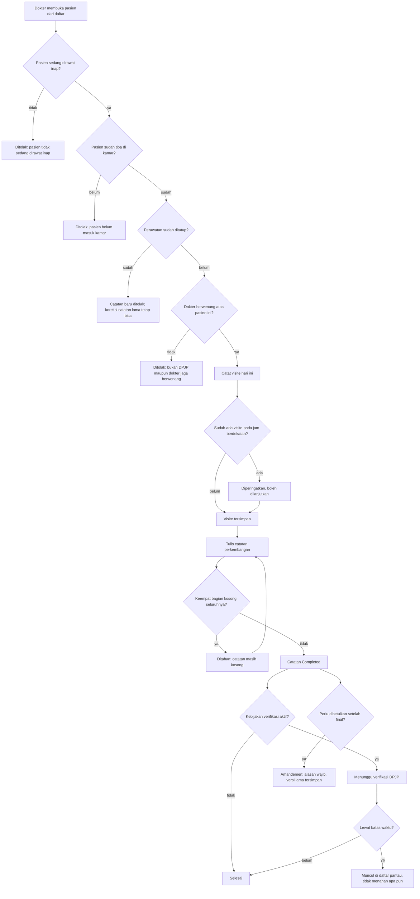

# Proses: Catatan Harian dan Visite

| Field | Nilai |
| --- | --- |
| Sub-modul | `dokter-rawat-inap` |
| Revision | `0.1` |
| Status | `draft` |
| Isi | Seluruh percabangan **beserta jalur pengecualiannya** |
| Kemampuan | `CAP-020`, `CAP-021`, `CAP-025` |

---

## 1. Diagram

---

## 2. Tabel langkah

| No | Langkah | Pelaku | Masukan | Keluaran | Bila gagal, petugas melakukan |
| ---: | --- | --- | --- | --- | --- |
| 1 | Membuka pasien | Dokter | Daftar pasien dirawat | Ruang kerja terbuka | Muat ulang daftar |
| 2 | Pemeriksaan kelayakan | Sistem | Keadaan perawatan | Boleh atau ditolak | Lihat jalur gagal di bawah |
| 3 | Mencatat visite | Dokter | Kunjungan yang dilakukan | Visite tersimpan | Tombol tertekan dua kali tetap satu visite |
| 4 | Menulis catatan | Dokter | Keadaan pasien | Tersimpan bertahap | Isian tidak hilang |
| 5 | Menyelesaikan | Dokter | Sekurang-kurangnya satu bagian terisi | `Completed` | Sistem menyebut bahwa catatan masih kosong |
| 6 | Verifikasi | DPJP | Catatan profesi lain | Terverifikasi | Bila kebijakan tidak aktif, langkah ini tidak muncul |
| 7 | Amandemen | Penulisnya | Alasan perubahan | `Amended` beserta versi lama | Alasan wajib diisi |

---

## 3. Jalur gagal — yang paling sering ditemui

| Jalur gagal | Kapan muncul | Yang dilakukan petugas |
| --- | --- | --- |
| Pasien tidak sedang dirawat inap | Pasien poliklinik terbuka dari layar yang salah | Kembali ke daftar pasien rawat inap |
| Pasien belum masuk kamar | Admisi dibuka tetapi kedatangan belum dikonfirmasi | Minta admisi mengonfirmasi kedatangan dari papan tempat tidur |
| Perawatan sudah ditutup | Pasien sudah pulang | Catatan **baru** memang tidak bisa. Bila catatan lama salah, betulkan lewat amandemen |
| Bukan DPJP | Dokter dari unit lain, atau DPJP sudah beralih | Minta supervisor mengalihkan DPJP, atau minta DPJP yang berlaku yang mencatat |
| Catatan kosong seluruhnya | Tombol selesai tertekan sebelum mengisi | Isi sekurang-kurangnya satu bagian |
| Visite ganda pada jam berdekatan | Dokter benar-benar datang dua kali, atau salah tekan | **Diperingatkan, bukan ditolak.** Lanjutkan bila memang visite kedua |
| Verifikasi lewat batas | DPJP belum sempat memverifikasi | Muncul di daftar pantau. **Tidak menahan** pekerjaan apa pun |

> Tujuh jalur gagal ini yang paling sering ditemui, dan paling sering lupa dibuatkan layarnya.
> Setiap barisnya punya bunyi pesan pada
> [`../contracts/validation-matrix.md`](../contracts/validation-matrix.md).
