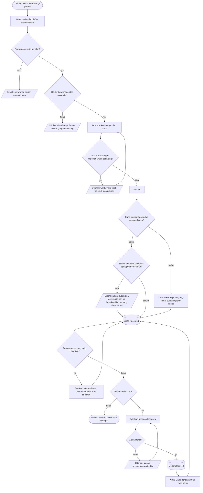

# Proses: Mencatat dan Mengoreksi Visite Dokter

| Field | Nilai |
| --- | --- |
| Sub-modul | `dokter-rawat-inap` |
| Revision | `0.2` — **berkas baru** |
| Status | `approved` — disetujui Muhammad Hamzah, 2026-09-03 |
| `approved_by` / `approved_at` | **Muhammad Hamzah** / **2026-09-03** |
| Isi | Seluruh percabangan **beserta jalur pengecualiannya** |
| Kemampuan | `CAP-025` |
| Dasar keputusan | `RWI-DEC-084` dan `RWI-DEC-085`; `RWI-AC-150` s.d. `RWI-AC-156` |

> **Kenapa berkas ini lahir.** Pada revision `0.1` visite menumpang pada proses catatan harian,
> karena waktu itu ia dianggap akibat dari menulis catatan. `RWI-DEC-084` menjadikannya **kejadian
> yang berdiri sendiri**, dengan pemicu, pelaku, jalur koreksi, dan cara menghitung sendiri.
> Menumpangkannya pada proses lain akan menyembunyikan justru bagian yang paling mudah salah.

---

## 1. Diagram

---

## 2. Tabel langkah

| No | Langkah | Pelaku | Masukan yang dibutuhkan | Keluaran | Bila gagal, petugas melakukan |
| ---: | --- | --- | --- | --- | --- |
| 1 | Membuka pasien | Dokter | Daftar pasien dirawat milik dokter itu | Ruang kerja terbuka | Muat ulang daftar |
| 2 | Mengisi waktu kedatangan dan peran | Dokter | Jam ia benar-benar datang, dan perannya saat itu | Isian siap disimpan | Betulkan jamnya |
| 3 | Menyimpan | Dokter | Kunci permintaan yang dikirim aplikasi | Kejadian tersimpan | Bila jaringan putus lalu dikirim ulang, hasilnya **kejadian yang sama** |
| 4 | Menautkan dokumen | Dokter | Catatan yang ingin ditautkan | Tautan tersimpan | Tautan **opsional**; dilewati pun visitenya tetap sah |
| 5 | Membatalkan karena salah catat | Dokter pemilik kejadian, atau supervisor klinis | **Alasan wajib** | Kejadian ditandai batal, tetap terlihat di riwayat | Alasan wajib diisi |
| 6 | Mencatat ulang setelah pembatalan | Dokter | Waktu yang benar | Kejadian baru yang menunjuk kejadian yang digantikannya | — |

---

## 3. Jalur gagal dan jalur peringatan

| Jalur | Kapan muncul | Yang dilakukan petugas | Sifat |
| --- | --- | --- | --- |
| Perawatan sudah ditutup | Pasien sudah pulang | Visite pada perawatan yang sudah selesai memang tidak dicatat | **Penolakan** |
| Bukan dokter yang berwenang | Perawat atau petugas mencoba mencatat atas nama dokter | Kemampuan itu belum ada kebijakannya; dokter mencatat sendiri | **Penolakan** |
| Waktu di masa depan | Salah ketik jam | Betulkan jamnya | **Penolakan** |
| Kunci permintaan kosong | Halaman kedaluwarsa atau aplikasi tidak mengirim kunci | Muat ulang halaman lalu ulangi | **Penolakan** |
| Tombol tertekan dua kali | Jaringan lambat | **Tidak perlu melakukan apa pun.** Sistem mengembalikan kejadian yang sama | **Diam-diam benar** |
| Sudah ada visite pada jam berdekatan | Dokter benar-benar datang dua kali, atau salah tekan | Lanjutkan bila memang visite kedua | **Peringatan, bukan penolakan** |
| Membatalkan tanpa alasan | Tombol batal ditekan lalu alasan dikosongkan | Isi alasannya | **Penolakan** |
| Membatalkan kejadian yang sudah batal | Dua orang membatalkan hampir bersamaan | Tidak perlu diulang; kejadian sudah batal | **Penolakan halus** |

---

## 4. Cara menghitung, dengan angka

Hitungan hanya menghitung kejadian yang **tidak dibatalkan**.

| Keadaan pada 12 September 2026 | Baris tersimpan | Hitungan | Acceptance |
| --- | ---: | ---: | --- |
| dr. Andi visite pukul 07.40, lalu kembali pukul 16.10 karena pasien memburuk | 2 | **2** | `RWI-AC-154` |
| dr. Andi visite sekali, tombol Simpan tertekan dua kali | 1 | **1** | `RWI-AC-152` |
| dr. Andi dan dr. Sinta masing-masing sekali | 2 | **2** | — |
| dr. Andi menulis tiga catatan tanpa mencatat visite | 0 | **0** | `RWI-AC-151` |
| dr. Andi mencatat visite pukul 07.40, catatannya baru ditulis pukul 07.52 | 1, waktunya 07.40 | **1** | `RWI-AC-150` |
| Salah ketik jam, dibatalkan, lalu dicatat ulang | 2, satu di antaranya batal | **1** | `INV-DOK-08` |
| Billing menagihkan dua kejadian sebagai satu tagihan harian | 2 | **2** pada riwayat klinis | `RWI-AC-156` |

> **Baris terakhir adalah pembeda yang paling sering disalahpahami.** Angka tagihan dan angka
> klinis boleh berbeda, dan keduanya benar pada tempatnya. Yang dilarang adalah menghapus salah
> satu kejadian supaya angkanya cocok.

---

## 5. Yang tidak ada di proses ini

| Yang tidak ada | Alasan |
| --- | --- |
| Menyunting waktu atau peran visite | `RWI-DEC-085`; koreksi berbentuk pembatalan beralasan lalu pencatatan ulang |
| Menghapus kejadian | `INV-DOK-08`; yang dibatalkan tetap terlihat |
| Membuat visite otomatis saat catatan disimpan | `INV-DOK-07`, `RWI-AC-151` |
| Menolak visite kedua pada hari yang sama | `RWI-DEC-085`, `RWI-AC-154` |
| Pencatatan oleh petugas atas nama dokter | Belum ada kebijakannya — `RWI-RULE-017` current |
