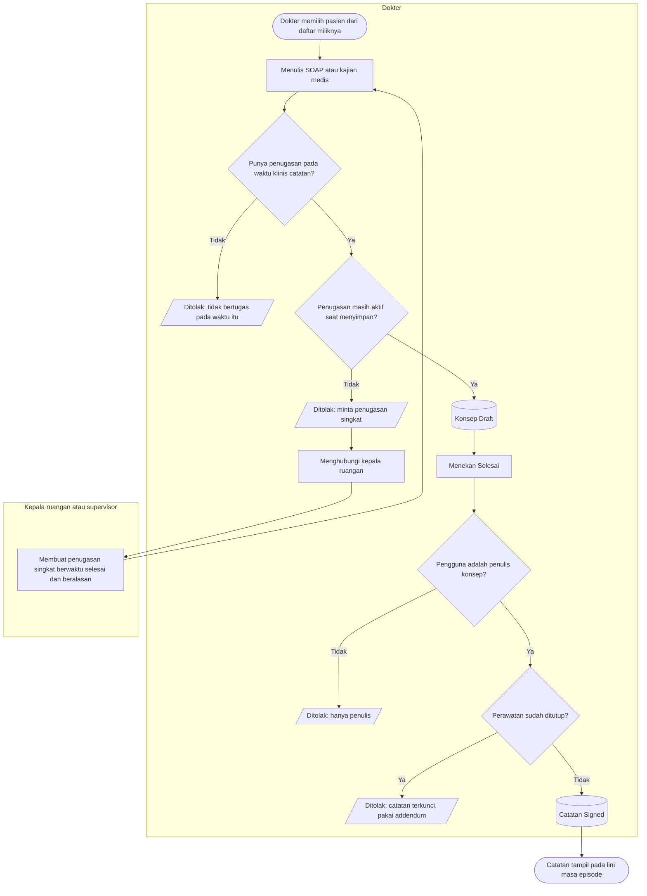
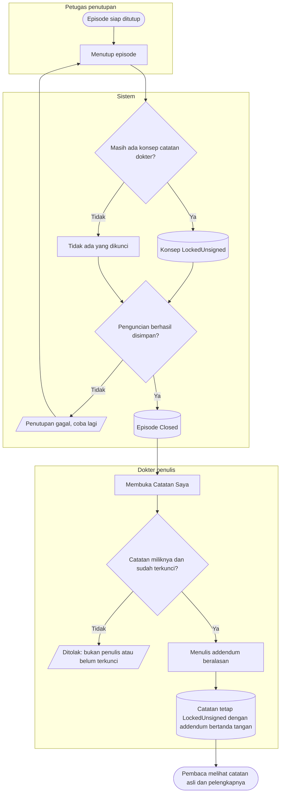
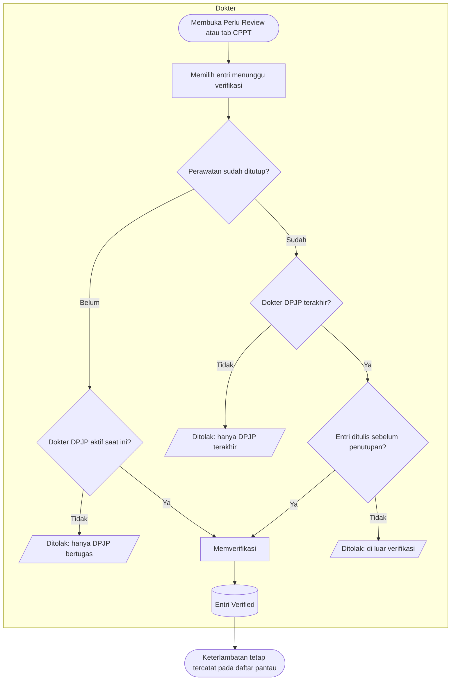

# Proses: Penulisan Catatan Dokter, Penguncian, dan Catatan Saya

| Field | Nilai |
| --- | --- |
| Sub-modul | `dokter-rawat-inap` |
| Revision | `0.3` — berkas baru, blueprint revision `7` |
| Status | `draft` — belum disetujui manusia |
| Isi | Seluruh percabangan beserta jalur pengecualiannya |
| Kemampuan | `CAP-020`, `CAP-021`, `CAP-022` |
| Keputusan | `RWI-DEC-125` s.d. `RWI-DEC-130`, `RWI-DEC-138`, `RWI-DEC-142`, `RWI-DEC-144` |
| Kontrak | Status sebaris dengan `contracts/state-transition-matrix.md` bagian 8.1 dan 8.2; pesan penolakan ada di `contracts/validation-matrix.md` bagian 10.1 dan 10.2 |

Berkas ini **melengkapi** [`01-catatan-harian-dan-cppt.md`](./01-catatan-harian-dan-cppt.md). Node "Dokter berwenang
atas pasien ini?" pada berkas itu kini dibaca sebagai dua pertanyaan pada diagram 1 di bawah.

---

## 1. Menulis catatan baru dan menyelesaikan konsep

| Langkah | Pelaku | Masukan yang dibutuhkan | Keluaran | Bila gagal |
| --- | --- | --- | --- | --- |
| Memilih pasien | Dokter | Penugasan aktif sebagai DPJP, konsulen, atau dokter jaga | Ruang kerja pasien terbuka | Pasien tidak ada pada daftar; dokter meminta penugasan kepada kepala ruangan |
| Menulis catatan | Dokter | Waktu klinis, isi SOAP atau kajian | Konsep `Draft` dan registrasi keutuhan `Draft` | Tidak bertugas pada waktu klinis → dokter memeriksa waktu yang diisi |
| Menyimpan tanpa penugasan aktif | Dokter | — | Tidak tersimpan | Dokter menghubungi kepala ruangan untuk penugasan singkat, lalu mengirim ulang isi yang sama |
| Membuat penugasan singkat | Kepala ruangan atau supervisor | Dokter, waktu mulai **dan** selesai, alasan | Penugasan dokter jaga berjangka | Tanpa waktu selesai ditolak; petugas mengisi waktu selesai |
| Menyelesaikan konsep | Penulis | Konsep miliknya | Catatan `Signed` | Bukan penulis → dokter lain tidak dapat melanjutkan; penulis yang harus menyelesaikan |
| Menyelesaikan konsep setelah penugasan berakhir | Penulis | Konsep dibuat saat penugasan aktif, waktu klinis di dalam periode | Catatan `Signed`; waktu klinis dan waktu tanda tangan tampil berbeda | Konsep sudah terkunci karena episode ditutup → pakai addendum |

**Contoh.** 06.30 dr. Yoga menyimpan konsep SOAP Joko. 07.00 penugasannya berakhir. 08.00 ia membuka Catatan Saya dan
menyelesaikan konsep itu → diterima; lini masa Joko menampilkan waktu klinis 06.30 dan tanda tangan 08.00.

## 2. Penutupan episode dan pelengkapan lewat Catatan Saya

| Langkah | Pelaku | Masukan yang dibutuhkan | Keluaran | Bila gagal |
| --- | --- | --- | --- | --- |
| Menutup episode | Petugas admisi atau supervisor | Syarat penutupan episode | Episode `Closed`; konsep terkunci; pesanan tertunda batal | Kegagalan teknis penguncian → petugas mencoba lagi; konsep yang tersisa **tidak** menahan penutupan |
| Membuka Catatan Saya | Dokter penulis | Akun login | Daftar konsep dan catatan terkunci miliknya | Daftar gagal dimuat → dokter menekan Coba Lagi; daftar kosong tidak boleh dianggap "tidak ada catatan" |
| Menambah addendum | Dokter penulis | Alasan dan isi pelengkap | Addendum bertanda tangan penulis | Catatan milik dokter lain → hanya jalur penulis pengganti yang sah bagi DPJP aktif |
| Episode dibuka kembali | Supervisor | Sesi koreksi | Catatan tetap `LockedUnsigned` | Dokter tetap memakai addendum |

## 3. Verifikasi CPPT

| Langkah | Pelaku | Masukan yang dibutuhkan | Keluaran | Bila gagal |
| --- | --- | --- | --- | --- |
| Memilih entri | DPJP | Daftar Perlu Review | Entri terbuka | Daftar gagal → Coba Lagi |
| Verifikasi episode berjalan | DPJP aktif | Penugasan DPJP pada detik verifikasi | Entri `Verified`, verifikator tercatat terpisah dari penulis | Konsulen atau dokter jaga ditolak → meminta DPJP memverifikasi, atau kepala ruangan mengalihkan DPJP |
| Verifikasi episode ditutup | DPJP terakhir | Entri sebelum penutupan | Entri `Verified`; pasien hilang dari daftar setelah semua terverifikasi | DPJP sebelumnya ditolak → DPJP terakhir yang memverifikasi |
