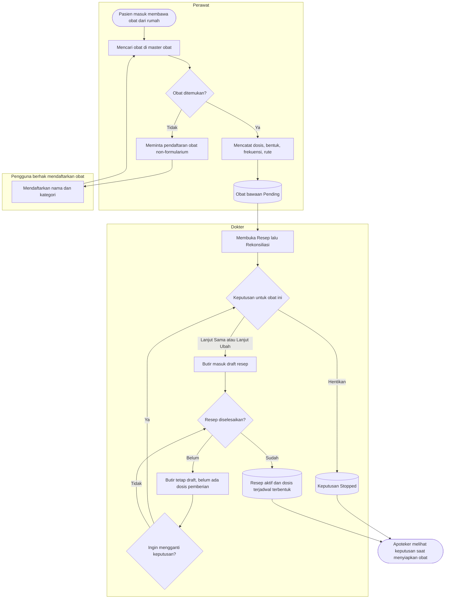
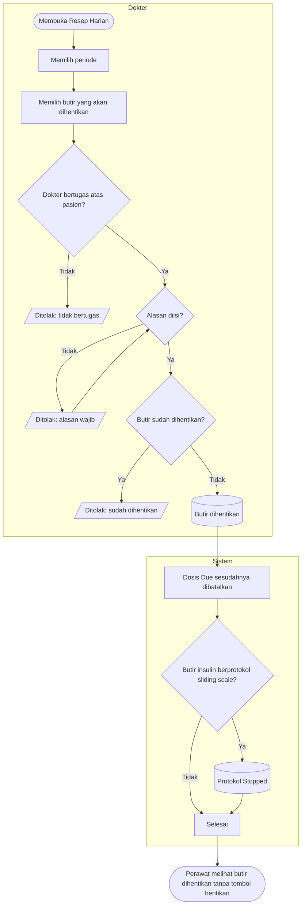
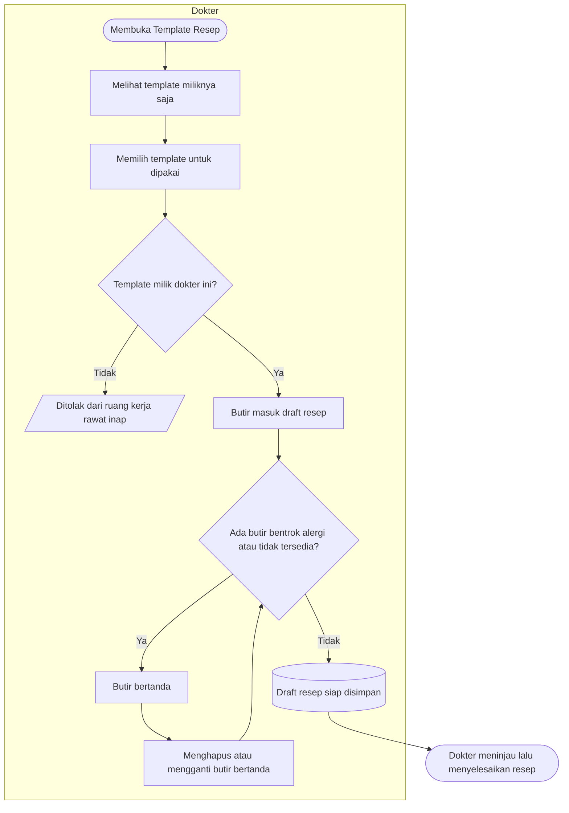
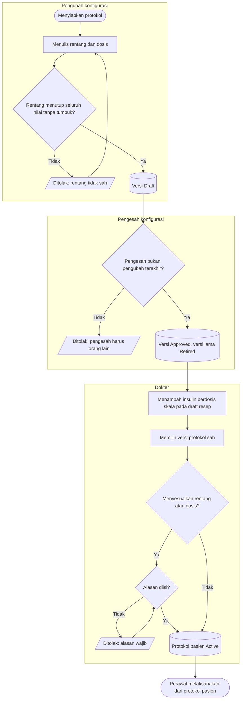

# Proses: Resep Harian, Rekonsiliasi Obat, Template, dan Sliding Scale

| Field | Nilai |
| --- | --- |
| Sub-modul | `dokter-rawat-inap` |
| Revision | `0.3` — berkas baru, blueprint revision `7` |
| Status | `draft` — belum disetujui manusia |
| Isi | Seluruh percabangan beserta jalur pengecualiannya |
| Kemampuan | `CAP-023-RSP` |
| Keputusan | `RWI-DEC-121`, `RWI-DEC-122`, `RWI-DEC-132` s.d. `RWI-DEC-135`, `RWI-DEC-145` s.d. `RWI-DEC-147` |
| Kontrak | Status sebaris dengan `contracts/state-transition-matrix.md` bagian 8.4 s.d. 8.7 |

Pemberian obat, pencatatan GDS, dan pelaksanaan sliding scale oleh perawat ada pada
`../../keperawatan/flowcharts/03-obat-mar-dan-sliding-scale.md`.

---

## 1. Rekonsiliasi obat saat admisi

| Langkah | Pelaku | Masukan yang dibutuhkan | Keluaran | Bila gagal |
| --- | --- | --- | --- | --- |
| Mencari obat | Perawat | Nama obat | Obat terpilih dari master | Tidak ditemukan → perawat meminta pengguna berhak mendaftarkannya; di luar jam kerja pencatatan menunggu, dan itu syarat operasional yang sudah diterima pemilik |
| Mendaftarkan obat non-formularium | Pengguna berhak mendaftarkan obat | Nama dan kategori | Obat baru bertanda non-formularium | Nama atau kategori kosong → dilengkapi |
| Mencatat obat bawaan | Perawat | Dosis, bentuk, frekuensi, rute | Obat bawaan `Pending` | Perawat mengira dapat mengetik nama bebas → tidak ada isiannya; kembali mencari di master |
| Memutuskan | Dokter | Obat bawaan | Keputusan tercatat; butir draft untuk "Lanjut" | Perawat mencoba memutuskan → ditolak; dokter yang memutuskan |
| Mengganti keputusan | Dokter | Butir hasil keputusan masih draft | Keputusan baru menunjuk yang lama | Resep sudah aktif → terapi diubah lewat resep atau penghentian butir |

## 2. Resep Harian dan penghentian butir

| Langkah | Pelaku | Masukan yang dibutuhkan | Keluaran | Bila gagal |
| --- | --- | --- | --- | --- |
| Memilih periode | Dokter | Hari ini, minggu ini, bulan ini, atau rentang | Daftar resep termasuk racikan dan obat pulang | Daftar gagal → Coba Lagi |
| Menghentikan butir | Dokter bertugas | Alasan | Butir dihentikan; dosis `Due` dibatalkan dalam satu simpanan | Tidak bertugas → dokter yang bertugas yang menghentikan |
| Akibat pada protokol | Sistem | Butir insulin berdosis skala | Protokol `Stopped` | — |

## 3. Template resep

| Langkah | Pelaku | Masukan yang dibutuhkan | Keluaran | Bila gagal |
| --- | --- | --- | --- | --- |
| Melihat template | Dokter | Akun tertaut dokter | Template milik sendiri | Akun tanpa tautan dokter → ditolak; administrator menautkan akun |
| Memakai template | Dokter | Draft resep pasien rawat inap | Butir draft dengan penanda | Template dokter lain → tidak dapat dipakai dari rawat inap |
| Menyimpan draft | Dokter | Butir tanpa penanda | Draft tersimpan | Masih ada penanda → dokter menghapus atau mengganti butir |

## 4. Protokol sliding scale — pengesahan dan pemesanan

| Langkah | Pelaku | Masukan yang dibutuhkan | Keluaran | Bila gagal |
| --- | --- | --- | --- | --- |
| Menulis rentang | Pengubah konfigurasi | Satuan gula darah, rentang, dosis | Versi `Draft` | Rentang bertumpuk atau berlubang → baris bermasalah ditunjukkan; pengubah memperbaiki |
| Mengesahkan | Pengesah | Versi `Draft` | Versi `Approved` | Pengesah sama dengan pengubah terakhir → pengguna lain yang mengesahkan |
| Memesan | Dokter | Butir insulin draft, versi sah | Protokol pasien `Active` versi 1 | Belum ada versi sah → sliding scale tidak dapat dipesan; menunggu pengesahan |
| Menyesuaikan | Dokter | Alasan | Versi protokol pasien baru | Dokter lain lebih dulu menyesuaikan → muat ulang lalu periksa |
| Pemakaian untuk pasien sungguhan | — | Isi protokol disahkan pemilik klinis | — | **Gerbang produksi**: belum ada pemilik klinis yang ditunjuk |
