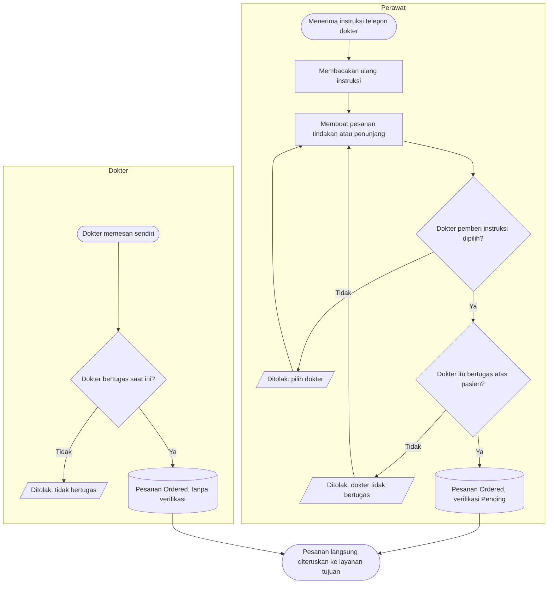
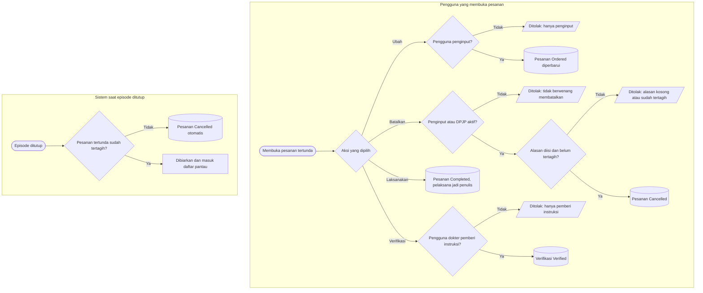

# Proses: Pesanan Tindakan, Pesanan Penunjang, dan Verifikasi Instruksi

| Field | Nilai |
| --- | --- |
| Sub-modul | `dokter-rawat-inap` — kontrak pesanan; pesanan perawat dibuat dari ruang kerja `keperawatan` |
| Revision | `0.3` — berkas baru, blueprint revision `7` |
| Status | `draft` — belum disetujui manusia |
| Isi | Seluruh percabangan beserta jalur pengecualiannya |
| Kemampuan | `CAP-024`, `CAP-015-LAB`, `CAP-015-RAD` |
| Keputusan | `RWI-DEC-114`, `RWI-DEC-139`, `RWI-DEC-143` |
| Kontrak | Status sebaris dengan `contracts/state-transition-matrix.md` bagian 8.3 |

---

## 1. Membuat pesanan

| Langkah | Pelaku | Masukan yang dibutuhkan | Keluaran | Bila gagal |
| --- | --- | --- | --- | --- |
| Membacakan ulang | Perawat | Instruksi dokter | Instruksi terkonfirmasi lisan | — |
| Membuat pesanan perawat | Perawat di unit pasien | Tindakan atau pemeriksaan, dokter pemberi instruksi | Pesanan `Ordered`, verifikasi `Pending`, penginput dari akun login | Dokter tidak bertugas → perawat menghubungi dokter yang bertugas |
| Membuat pesanan dokter | Dokter bertugas | Tindakan atau pemeriksaan | Pesanan `Ordered` | Tidak bertugas → meminta penugasan |
| Pesanan laboratorium dan radiologi perawat | Perawat | Sama | Sama | **Gerbang implementasi**: persetujuan pemilik modul Laboratorium dan Radiologi belum tercatat |

## 2. Mengubah, membatalkan, melaksanakan, dan memverifikasi

| Langkah | Pelaku | Masukan yang dibutuhkan | Keluaran | Bila gagal |
| --- | --- | --- | --- | --- |
| Mengubah | Penginput | Pesanan belum dilaksanakan | Isi pesanan berubah | Bukan penginput → meminta penginput mengubah, atau DPJP membatalkan lalu memesan ulang |
| Membatalkan | Penginput atau DPJP aktif | Alasan | Pesanan `Cancelled` | Sudah tertagih → ditangani bersama Billing |
| Melaksanakan | Dokter atau perawat berwenang | Pesanan `Ordered` | Pesanan `Completed`; catatan pelaksanaan final atas nama pelaksana | Episode ditutup → tidak dapat dilaksanakan |
| Memverifikasi | Dokter pemberi instruksi | Pesanan perawat `Pending` | Verifikasi `Verified`; penginput dan isi tidak berubah | Bukan pemberi instruksi → pesanan tetap menunggu pemberi instruksi |
| Penutupan episode | Sistem | Pesanan tertunda | Pesanan belum tertagih `Cancelled` beralasan "episode ditutup sebelum dilaksanakan" | Pesanan tertagih dibiarkan dan tampil pada daftar pantau episode |

**Contoh.** 23.00 dr. Yoga menelepon Ns. Siti; Siti membuat pesanan cek GDS dengan pemberi instruksi dr. Yoga. Pesanan
langsung ke laboratorium. 07.30 esoknya dr. Yoga membuka Perlu Review dan memverifikasi. Bila pagi itu dr. Rina yang
membuka pesanan yang sama, tombol verifikasi tidak ada baginya.
