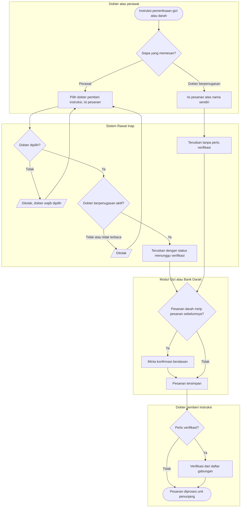

# Flowchart — Pesanan Gizi dan Bank Darah dari bangsal

| Field | Nilai |
|---|---|
| Sub-modul | `dokter-rawat-inap` |
| Kontrak | `0.7.0` — `draft` |
| Proses | `BP-RWF-05` |
| Keputusan | `RWI-DEC-171`, `RWI-DEC-188` |

| Langkah | Pelaku | Masukan | Keluaran | Bila gagal |
|---|---|---|---|---|
| Isi pesanan | Dokter atau perawat | Layanan, alasan, komponen darah | Pesanan siap dikirim | — |
| Periksa penugasan | Sistem Rawat Inap | Dokter pemberi instruksi | Pesanan diteruskan | Tanpa dokter atau dokter tidak berpenugasan: ditolak |
| Simpan di modul pemilik | Gizi atau Bank Darah | Pesanan | Pesanan dengan peminta dan penginput | Pesanan darah mirip: konfirmasi beralasan |
| Verifikasi | Dokter pemberi instruksi | Daftar gabungan | Terverifikasi atas namanya | Bukan dokter peminta: ditolak |
