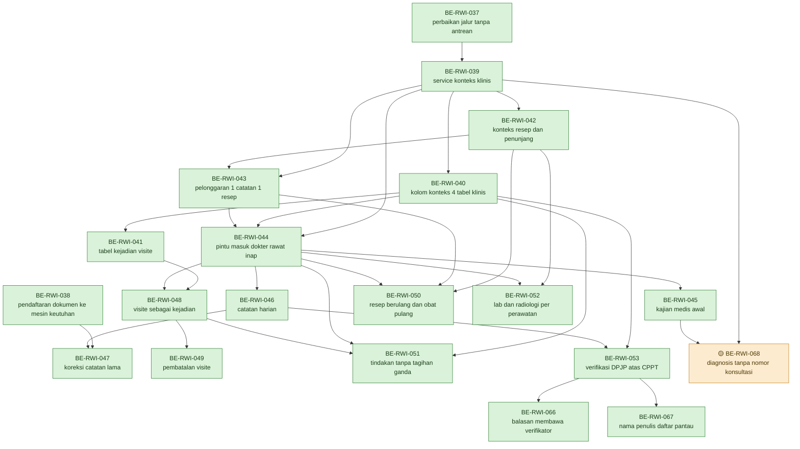
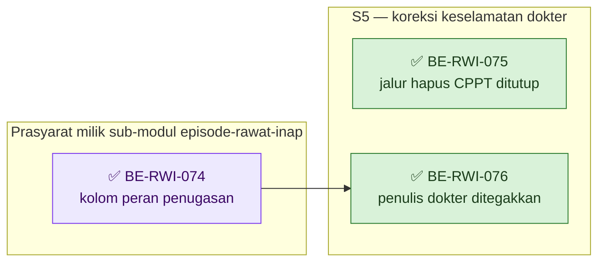

# Roadmap Delivery Backend — Sub-modul `dokter-rawat-inap` (Rawat Inap)

## Metadata

```yaml
module_id: rawat-inap
module_name: InPatientManagement
entity_prefix: Inp
roadmap_revision: 3
status: APPROVED
approval_gate: BLUEPRINT_APPROVED
blueprint_shape: COMPOSITE
submodule: dokter-rawat-inap
blueprint_root: docs/module-blueprints/rawat-inap/dokter-rawat-inap/
capability_scope: [CAP-015, CAP-020, CAP-021, CAP-022, CAP-023, CAP-024, CAP-025]
owners:
  - "Product/Domain: Muhammad Hamzah (RWI-DEC-061)"
  - "Pemilik ClinicalManagement, PharmacyManagement, MasterData: Muhammad Hamzah (RWI-DEC-062)"
  - "Clinical governance: sebagian terisi (RWI-DEC-064); pemilik SLA klinis BELUM ditunjuk"
  - "Security/Privacy: OPEN"
approved_by:
  - "Muhammad Hamzah — Product/Domain owner (RWI-DEC-061), approval desain 2026-09-03"
  - "Muhammad Hamzah — approval kontrak 0.4.0 pada 2026-09-09, mencabut kedua penghalang BE-RWI-068"
approved_at: "2026-09-09"
revision_authority: "Instruksi pengguna 2026-09-09: kunci BE-RWI-068 terhadap kontrak 0.4.0 yang disetujui Muhammad Hamzah pada hari yang sama. Revision 2 beserta seluruh task selesainya tetap berlaku dan tidak diulang"
revision_scope: "Perencanaan ulang terarah pada SATU task. BE-RWI-068 dilepas dari BLOCKED menjadi READY dan scope, dependency, acceptance, verification, serta DoD-nya dikunci terhadap kontrak 0.4.0. Grafik Urutan Dependency berbentuk Mermaid ditambahkan sebagaimana dituntut plan-module-delivery. Nol ID task baru dibuat, nol status task lain diubah. Bukan approval implementasi dan bukan approval rilis"
source_sha:
  backend: "93b3227c431401d8f586dec4e1fb25fbf41766e3"
  frontend: "863f24b0d1617069310c04e5770b47fd1b518b5b"
replan_source_sha:
  backend: "c82e69f327b01702b6bef595c685b10086ab7bd9"
  frontend: "e194509dc695aaa43264eab3ca7065762b14d2ee"
replan_date: "2026-09-08"
contract_versions: "0.4.0 (approved 2026-09-09) — task BE-RWI-037 s.d. BE-RWI-067 tetap terikat 0.3.0"
input_revisions:
  blueprint-manifest.md (tingkat modul): 5
  blueprint-manifest.md (sub-modul): 5
  00-interview-decisions.md: 18
  01-existing-capability-map.md: 1.3
  02-module-map.md: 1
  evidence/03-hospital-domain-architecture.md: 0.2
  02-backend-architecture.md: 0.4
  04-prd-to-mvp.md: 0.3
input_hashes:
  00-interview-decisions.md: "44d1980f99e1b43b2881cc60afc5ae4281a3411e0ea161e6365191fd62729afa"
  01-existing-capability-map.md: "0155b345abea61f1b69e6adaf48ee91056b5efaf7fa672ea6300e0546bf4db03"
  02-module-map.md: "94e54fd45ba09bd61eb9c218e7d7b424725c3a45b6dd76f16f4a51a98c6f7c85"
  evidence/03-hospital-domain-architecture.md: "226c6ef1e4bfec544c366b265fe1e4530e80c510da33c1a9eaf2e62161d0b717"
  02-backend-architecture.md: "b77429d02259dca85bf3b7170bcf4e6cf23ab9af6a4ffc2017d1218af8af7026"
  04-prd-to-mvp.md: "a0d5cc0c998fea5d7c23c587eeec1718e456320c6191eb5ffb752e0f3d79f9cb"
artifact_hashes:
  contracts/api-contract.md: "5bf0ee69fd2877199d5a80708cefcbdfc270f34adea143426bb17ad37125eb41"
  contracts/state-transition-matrix.md: "024c330d0ccf5acf4a94ec5c87e7cde6c92626f8b8fdcd0a86dc086aa8a14802"
  contracts/validation-matrix.md: "8844e3e0e64797eba48775a81d9221fae7aff4e55b4f86c7318201f1482e62af"
  contracts/integration-contract.md: "23f381dbb0e17ae2a1169393ddb25f29670b276a6c978498ec6c4be474f3e7a2"
  contracts/permission-audit-matrix.md: "dd8435f9222595164fca5192f7dc0bea0c533cf42512b8d2d66dd6d811318ef1"
  testing/acceptance-test-matrix.md: "d29314eb7ed2c69830e69622fab5279d9846e5952605caa432f5ea2d946a41fc"
  data/data-dictionary.md: "0659872afeade8cc5d35f4cd70648d19a33f854f49c828f34dd6d882f58b5958"
task_id_series: "BE-RWI-037 s.d. BE-RWI-053 (revision 1), ditambah BE-RWI-066 s.d. BE-RWI-068 (revision 2) — deret bersama seluruh modul, dilanjutkan dari BE-RWI-065 yang dipegang roadmap keperawatan"
```

---

## Grafik Urutan Dependency

Panah berarti **prasyarat harus selesai lebih dulu**, dan artinya tidak pernah dibalik. Setiap task
muncul **tepat satu kali** sebagai node, dan **jumlah panahnya sama persis** dengan isi kolom
`Dependency` pada bagian 4 — tiga puluh panah untuk dua puluh task. Bila grafik ini berbeda dari
kolom `Dependency`, **kolom itu yang berlaku** dan grafik ini yang salah.

Task frontend **sengaja tidak digambar di sini**. Ketiganya adalah pemakai hasil, bukan prasyarat,
sehingga menggambarnya akan menambah panah yang tidak ada pada kolom `Dependency`. Ketergantungan
arah itu dipegang [`frontend-roadmap.md`](./frontend-roadmap.md).



Hijau berarti ✅ selesai. Oranye berarti 🟡 sebagian: source-nya sudah ada dan terkompilasi,
tetapi acceptance criteria-nya belum terbukti berjalan.

### Gelombang eksekusi

| Gelombang | Task | Keadaan | Kenapa gelombangnya di sini |
| --- | --- | :---: | --- |
| `DOK-MVP-0` | `BE-RWI-037` | ✅ | Nol dependency. Memperbaiki jalur yang hari ini berujung kegagalan sistem |
| `DOK-MVP-0b` | `BE-RWI-038` | ✅ | Nol dependency, dan **tidak menunggu `DOK-MVP-0`**. Akar kedua yang berdiri sendiri |
| `DOK-MVP-1` | `BE-RWI-039`, `BE-RWI-040`, `BE-RWI-041`, `BE-RWI-042`, `BE-RWI-043` | ✅ | Fondasi konteks, kolom, tabel visite, dan pelonggaran |
| `DOK-MVP-2` | `BE-RWI-044`, `BE-RWI-045` | ✅ | Pintu masuk dokter dan kajian medis awal |
| `DOK-MVP-3` | `BE-RWI-046`, `BE-RWI-047` | ✅ | Catatan harian beserta koreksinya. `BE-RWI-047` mempertemukan kedua akar |
| `DOK-MVP-4` | `BE-RWI-048`, `BE-RWI-049` | ✅ | Visite sebagai kejadian tersendiri |
| `DOK-MVP-5` | `BE-RWI-050`, `BE-RWI-051`, `BE-RWI-052` | ✅ | Resep, tindakan, dan penunjang |
| `DOK-MVP-6` | `BE-RWI-053` | ✅ | Verifikasi DPJP atas catatan terpadu |
| `DOK-MVP-7` | `BE-RWI-066` ✅, `BE-RWI-067` ✅, **`BE-RWI-068`** 🟡 | 🟡 | Menutup tiga celah kontrak yang ditemukan layar. **`BE-RWI-068` satu-satunya yang tersisa.** Source-nya dibangun 9 September 2026 dan terkompilasi; gelombang ini belum naik karena bukti ujinya belum dijalankan — [laporan](../task/report/backend/BE-RWI-068.md) |

**Nol node blocker pada grafik ini.** Sampai 8 September 2026 `BE-RWI-068` digambar sebagai blocker
tanpa nomor gelombang, karena kontraknya belum ada. Approval `0.4.0` pada 9 September 2026 mencabut
keadaan itu, sehingga ia kini memegang nomor gelombang seperti task lain.

---

## 0. Empat peringatan yang tidak boleh dilewati

> **Pertama: sub-modul ini tidak memiliki satu tabel pun.** Seluruh perubahan di bawah terjadi di
> dalam modul milik orang lain — `ClinicalManagement`, `PharmacyManagement`,
> `LaboratoryManagement`, `RadiologyManagement`. Persetujuan lintas modul sudah ada lewat
> `RWI-DEC-062` untuk tiga modul pertama. **Penjadwalannya tetap wewenang pemilik modul
> masing-masing**, dan roadmap ini tidak menggantikannya.

> **Kedua: dua task pertama tidak menambah satu kemampuan pun, dan keduanya tetap paling depan.**
> `BE-RWI-037` memperbaiki jalur yang hari ini berujung kegagalan sistem; `BE-RWI-038` menutup
> keadaan di mana catatan yang sudah diselesaikan tidak dapat disunting **maupun** dikoreksi.
> Mengerjakan kemampuan baru di atas keduanya berarti membangun di atas lantai yang bolong.

> **Ketiga: setiap task yang menyentuh mesin klinis membawa test regresi poliklinik dan IGD.**
> `RWI-DEC-051` mewajibkannya, dan `RWI-AC-143` mengujinya. Bukti `DOK-TRC-VER-01` menyatakan
> **tidak ditemukan satu pun** test untuk konsultasi, pengkajian, CPPT, tindakan, resep, maupun
> radiologi rawat inap — jadi jaring pengamannya memang belum ada dan wajib dibuat sambil jalan.

> **Keempat: approval desain bukan izin menulis source.** Setiap task tetap menunggu approval task
> tersendiri. QBE preflight dan kesesuaian engineering diselesaikan **pada waktu eksekusi** dari
> `AGENTS.md` repository backend target beserta dokumen engineering canonical — bukan dari roadmap
> ini.

---

## 0.1 Apa yang berubah pada revision 2, dan kenapa

Revision 1 ditulis 3 September 2026 dan **seluruh tujuh belas task-nya sudah selesai**. Revision 2
tidak membatalkan satu pun dari itu. Ia lahir dari hal yang hanya bisa ketahuan setelah layarnya
benar-benar dibuat: **tiga task frontend berhenti di 🟡 `SEBAGIAN` bukan karena kekurangan source,
melainkan karena backend tidak mengirimkan data yang layarnya butuhkan.**

Analoginya sederhana. Perawat sudah menulis nama pemeriksa pada lembar rekam medis, dan lembar itu
tersimpan rapi di lemari. Tetapi ketika lembar itu difotokopi untuk diserahkan ke poli lain, kolom
nama pemeriksanya kebetulan **terpotong mesin fotokopi**. Datanya ada, penyimpanannya benar, yang
salah adalah salinan yang dikirim. Tiga task di bawah membetulkan salinan itu.

| Yang ditemukan | Ditemukan saat | Buktinya di source | Task penutupnya |
| --- | --- | --- | --- |
| Balasan baca catatan terpadu **tidak memuat satu pun kolom verifikasi**, padahal keempat kolomnya sudah ada dan sudah terisi di tabel | `FE-RWI-046` | `PatientIntegratedProgressNoteDtos.cs` tidak memuat `VerificationStatus`, `VerifiedAt`, maupun `VerifiedByUserId`; pemetaan `ToResponse` pada `PatientIntegratedProgressNoteController.cs:1393` karena itu juga tidak memetakannya | **`BE-RWI-066`** ✅ **DITUTUP 8 September 2026** — [laporan](../task/report/backend/BE-RWI-066.md) |
| Butir daftar pantau verifikasi hanya membawa **id pengguna** penulis, bukan namanya | `FE-RWI-050` | `CpptVerificationService.cs:41–59` — `CpptVerificationWatchItem` memuat `ProviderUserId`, dan tidak ada satu kolom nama pun | **`BE-RWI-067`** ✅ **DITUTUP 8 September 2026** — [laporan](../task/report/backend/BE-RWI-067.md) |
| Diagnosis terstruktur **wajib** menyebut nomor konsultasi, sehingga tidak dapat lahir dari layar kajian medis | `FE-RWI-044` | `PatientDiagnosisDtos.cs:146–152` — `EncounterId` dan `ConsultationId` keduanya `[Required]` | **`BE-RWI-068`** 🟡 **SEBAGIAN 9 September 2026** — source kesembilan kriteria ada dan terkompilasi; bukti ujinya belum dijalankan, [laporan](../task/report/backend/BE-RWI-068.md) |

**Dua di antaranya sengaja tidak menunggu kontrak baru, dan satu wajib menunggu.** Bedanya bukan
selera, melainkan apakah kontrak `0.3.0` sudah pernah menyebut endpoint-nya:

| Task | Endpoint-nya ada di kontrak `0.3.0`? | Karena itu |
| --- | --- | --- |
| `BE-RWI-066` | **Ya** — bagian 3, `PATCH /{id}/verify` dan `GET /episodes/{episodeId}/verification-status` | Menambah kolom balasan **memenuhi** kontrak yang sudah disetujui. Kontrak ini mengikat pada tingkat endpoint, hak akses, dan jenis balasan — bukan pada daftar kolom |
| `BE-RWI-067` | **Ya** — bagian 3, `GET /episodes/{episodeId}/verification-status` | Sama seperti di atas |
| `BE-RWI-068` | **Tidak pada `0.3.0`.** Grup diagnosis tidak ada pada kesebelas bagiannya, dan bagian 11 tidak menyebutnya sebagai yang sengaja ditiadakan | Ini endpoint yang **terlewat**, bukan yang ditolak. Menuliskan source-nya di atas `0.3.0` berarti membangun di luar kontrak yang disetujui, jadi task-nya lahir ⛔ **TERBLOKIR**. **Dijawab `0.4.0`** — lihat bagian 0.3 |

> **Menambah kolom pada balasan tidak merusak pemakai lama.** Consumer yang tidak tahu kolom barunya
> akan mengabaikannya; tidak ada kolom yang dihapus, diganti nama, atau berubah artinya. Itu batas
> kompatibilitas yang dipakai kontrak ini sendiri pada barisnya "*Tidak ada endpoint yang dihapus
> atau berubah bentuknya*".

## 0.2 Masukan yang bergerak sejak revision 1, dan apakah ia menggoyang sub-modul ini

Perencanaan ulang **wajib** memeriksa ini lebih dulu; merencanakan di atas masukan basi berarti
merencanakan hal yang sudah tidak benar. Tiga berkas bergerak, dan **tidak satu pun** mengubah
scope dokter.

| Masukan | Saat revision 1 | Sekarang | Dampak ke sub-modul ini |
| --- | --- | --- | --- |
| `00-interview-decisions.md` | Revision `10` | **Revision `18`** — `RWI-DEC-089` s.d. `RWI-DEC-096`, `RWI-FACT-015` s.d. `RWI-FACT-019`, `RWI-OQ-051`, `RWI-OQ-052` | **Nol.** Diperiksa satu per satu: `089` sampai `092` milik `keperawatan`, `093` sampai `096` milik deposit admisi pada `episode-rawat-inap`. `RWI-OQ-051` memblokir `BE-RWI-057` dan `BE-RWI-062` — keduanya task `keperawatan`, bukan task di sini |
| `02-module-map.md` | Hash `29c761ee…` | Hash `94e54fd4…` | **Nol untuk task.** Perubahannya menyangkut kepemilikan deposit rawat inap. Slot urutan daftar pantau bagi dokter **tetap belum ditetapkan**, sehingga `FE-RWI-050` kriteria 5 tetap terbuka — lihat bagian 5 |
| `data/data-dictionary.md` | Hash `dff96553…` | Hash `eb3a6150…` | **Nol yang belum diserap.** Perubahannya adalah revisi `0.2` → `0.3` yang menambahkan `PhysicalExamination`, `WorkingDiagnosis`, dan `TherapyPlan`, dan itu justru hasil penutupan blocker `BE-RWI-045` pada 5 September 2026 |

**Yang tidak bergerak sama sekali:** kelima kontrak dan matriks acceptance. Keenam hash-nya sama
persis dengan yang tercatat pada revision 1, sehingga `0.3.0` masih terkunci dan masih sah dipakai
merencanakan. Arsitektur backend, arsitektur frontend, PRD, ketiga flowchart, dan peta kemampuan
juga tidak bergerak.

> **Koreksi bertanggal 9 September 2026.** Paragraf di atas benar **pada 8 September 2026** dan
> dipertahankan sebagai jejak. Sehari kemudian `/qv-design` menaikkan lima dari enam berkas itu ke
> `0.4.0`, ditambah arsitektur backend dan kamus data — seluruhnya berstatus `draft`. Blok
> `input_hashes` dan `artifact_hashes` di kepala roadmap ini **sudah** menunjuk berkas versi baru.
> `0.3.0` tetap sah dan tetap mengikat seluruh task `BE-RWI-037` s.d. `BE-RWI-067` yang sudah
> selesai; yang mengikat `0.4.0` hanya `BE-RWI-068`. Rinciannya bagian 0.3.
>
> `contracts/state-transition-matrix.md` adalah satu-satunya dari keenam yang **tetap** `0.3.0`.

**Satu selisih dokumen yang ditemukan sambil memeriksa, dan sengaja tidak diperbaiki dari sini.**
`02-module-map.md` bagian 1 masih mencatat `dokter-rawat-inap` berstatus `draft` dengan approval
"Belum", padahal manifest sub-modulnya `approved` sejak 3 September 2026 dan `RWI-DEC-092` bahkan
menyatakan **ketiga** sub-modul sudah disetujui sehingga status modul turun menjadi `approved`.
Membetulkannya adalah pekerjaan dokumen tingkat modul, bukan wewenang roadmap sub-modul. Dicatat
sebagai gerbang terbuka pada bagian 5 supaya tidak hilang.

---

## 0.3 Apa yang berubah pada 9 September 2026 — kontrak naik ke `0.4.0`

`/qv-design` dijalankan atas `BE-RWI-068` dan **mencabut penghalang pertamanya**. Grup Patient
Diagnosis kini terdaftar pada kontrak API bagian 2.1, dan tujuh artefak desain naik ke `0.4` /
`0.4.0` berstatus **`draft`**.

| Penghalang `BE-RWI-068` | Keadaan sebelum | Keadaan sekarang |
| --- | --- | --- |
| ① Grup diagnosis belum ada pada kontrak API | ⛔ Menahan | ✅ **Tercabut** — `api-contract.md` `0.4.0` bagian 2.1; `INT-DOK-10`; `VAL-DOK-36` s.d. `VAL-DOK-40`; sembilan skenario acceptance pada bagian 11 |
| ② Pelonggaran aturan wajibnya belum disetujui pemilik tabel | ⛔ Menahan | ✅ **Tercabut 9 September 2026** — `0.4.0` disetujui **Muhammad Hamzah**. `RWI-DEC-062` sudah memberi persetujuan lintas modul atas perubahan `ClinicalManagement` yang dituntut blueprint ini, dan approval `0.4.0` adalah tanda tangan itu |

**Satu hal yang wajib diketahui sebelum menyetujui, dan tidak terlihat pada revision 2.** Anggapan
revision 2 bahwa grup diagnosis semata-mata **terlewat** ternyata hanya benar separuh. Kontrak API
memang tidak pernah menyebutnya, tetapi dua artefak lain **menyebutnya secara tegas dan menolaknya**:

| Artefak | Bunyinya | Keadaan sekarang |
| --- | --- | --- |
| `02-backend-architecture.md` bagian 9 | "Melonggarkan `ConsultationId` pada resep, tindakan, dan diagnosis — ketiganya memang lahir dari konsultasi; yang perlu dibuka adalah konsultasinya" | **Dibalik untuk diagnosis saja** pada revision `0.4`. Resep dan tindakan tetap ditolak dengan alasan yang sama |
| `data/data-dictionary.md` bagian 3 | "Diagnosis berkode ICD tetap tinggal di sana dan **tetap menggantung pada catatan dokter**" | Kalimatnya diperbarui pada revision `0.4` |

Alasan pembalikannya ditulis lengkap pada `contracts/integration-contract.md` bagian 10.1, dan
ringkasnya: kajian medis awal adalah **dokumen dan layar tersendiri** yang lahir sebelum catatan
harian pertama, sedangkan `PRD-RWI-FINAL-001` `CAP-022` aturan 5 menuntut daftar masalah berbentuk
objek terstruktur. Kedua fakta itu belum tersedia saat baris bagian 9 ditulis pada 2 September.

> **Kedua penghalang `BE-RWI-068` tercabut pada 9 September 2026.** `0.4.0` disetujui Muhammad
> Hamzah pada hari yang sama, sehingga yang tersisa tinggal perencanaan dan pembangunannya.

---

## 1. Cara membaca roadmap ini

| Kolom | Artinya |
| --- | --- |
| **Outcome** | Apa yang bisa dilakukan pengguna setelah task selesai, ditulis dari sudut pandang orang yang memakainya |
| **Trace** | Requirement, decision, dan bagian arsitektur yang menjadi asalnya |
| **Kontrak** | Versi kontrak yang mengikat task ini |
| **Reuse** | Kemampuan yang sudah ada dan dipakai ulang, supaya pelaksana tidak menulis ulang yang sudah jalan |
| **Scope** | Berkas dan perubahan yang diharapkan. Bukan daftar tertutup, tetapi batas yang wajar |
| **Dependency** | Task lain yang harus selesai lebih dulu |
| **Acceptance criteria** | Bernomor, dapat diuji, dan tidak memakai kata "dengan benar" |
| **Verification** | Bukti yang diharapkan, termasuk jenis test-nya |
| **Risk/blocker** | Risiko nyata beserta pemiliknya |
| **DoD** | Daftar yang jawabannya hanya "ya" atau "belum" |

Status setiap task ditulis pada kartunya masing-masing memakai lima tanda: ✅ selesai, 🟡 sebagian,
⛔ terblokir, ⬜ siap dikerjakan — seluruh dependency dan kontraknya sudah beres tetapi task-nya belum
dimulai — dan tanpa tanda untuk yang belum dikerjakan dan belum diperiksa kesiapannya. Tanda hanya boleh dinaikkan setelah
laporan tracked task itu ada di `../task/report/backend/`.

Per 8 September 2026: **seluruh 17 task `BE-RWI-037` s.d. `BE-RWI-053` ✅ selesai.** Tidak ada
di antara ketujuh belas itu yang 🟡 sebagian, ⛔ terblokir, maupun belum dikerjakan.

**Revision 2 menambahkan tiga task baru.** Per 8 September 2026, dua di antaranya sudah selesai:
`BE-RWI-066` ✅ dan `BE-RWI-067` ✅ dikerjakan bersamaan pada satu rangkaian validasi
(`dotnet test` `Failed: 0, Passed: 470, Total: 470`, 17 di antaranya uji baru kedua task itu;
`dotnet build` 0 error `CS`; nol migration dibuat). **Diperbarui 9 September 2026:** `BE-RWI-068`
tidak lagi ⛔. Kontrak `0.4.0` ditulis dan disetujui pada hari yang sama, kedua penghalangnya
tercabut, dan seluruh dependency-nya sudah ✅. Alasannya pada bagian 0.3.

**Diperbarui lagi pada hari yang sama, sesudah task itu dibangun.** `BE-RWI-068` kini 🟡
**SEBAGIAN**, bukan ⬜. Source kesembilan acceptance criteria-nya sudah ada dan terkompilasi
(`dotnet build` `0 Error(s)`, `187 Warning(s)`), dan satu migration dibuat tanpa diterapkan ke
database mana pun. Yang menahannya bukan kekurangan source melainkan bukti: `dotnet test`, uji
migration maju-mundur terhadap PostgreSQL, dan bahkan kompilasi berkas uji barunya **belum
dijalankan** — dihentikan atas instruksi pengguna. Rinciannya pada
[laporan](../task/report/backend/BE-RWI-068.md).

Uji migration maju-mundur dijalankan 5 September 2026 terhadap PostgreSQL 15.15 sungguhan dan
menutup `BE-RWI-040`, `BE-RWI-042`, serta `BE-RWI-043`; `BE-RWI-045` ditutup setelah pemilik
memutuskan struktur penyimpanan isian medis.

Ketiga 🟡 yang sempat tersisa menunggu satu hal yang sama dan hanya satu: **database uji
tersendiri** bagi uji concurrency dan percobaan ulang. Pada 8 September 2026 hal itu disediakan sebagai
**container PostgreSQL 15.15 sekali pakai** — database `quilvian_rwi_test`, kosong di awal, terisi
148 migration dan 555 tabel dari nol. Penjagaan `BillingTestDatabaseFixture` pasca-`RJ-BIL-BE-002`
**tidak dilemahkan**; database sekali pakai itu memenuhi tuntutannya apa adanya, dan nol perintah
dikirim ke database bersama mana pun. Ketujuh test PostgreSQL hijau, dan `BE-RWI-041`,
`BE-RWI-048`, serta `BE-RWI-051` ✅ selesai.

Menjalankan uji yang selama ini hanya dikompilasi **menemukan dua hal yang tidak terlihat selama
ia tidak pernah dijalankan**, dan keduanya diperbaiki dalam task yang sama: satu cacat jam pada
uji `BE-RWI-041`, dan satu celah perlombaan nyata pada `PhysicianVisitService` milik `BE-RWI-048`
yang membuat permintaan yang kalah melempar alih-alih dijawab `200`.

---

## 2. Keadaan awal yang menentukan urutan

| Keadaan | Buktinya | Akibatnya bagi urutan |
| --- | --- | --- |
| Fondasi episode, DPJP berperiode, dan census **sudah ada dan sudah diuji** | `DOK-TRC-CTX-01`; `BE-RWI-001` s.d. `BE-RWI-036` sebagian besar selesai | Tidak ada task fondasi episode di roadmap ini |
| Jalur tanpa antrean **gagal** | `DOK-TRC-DEF-01` | `BE-RWI-037` menjadi task pertama |
| Hanya catatan terpadu yang terdaftar pada mesin keutuhan | `RWI-FACT-014` | `BE-RWI-038` menjadi task kedua |
| Konteks klinis episode belum ada | `DOK-TRC-INT-01` `Missing` | `BE-RWI-039` mendahului seluruh kemampuan klinis |
| Batas satu catatan dan satu resep masih dipaksakan | `DOK-TRC-INT-02` `Extend` | `BE-RWI-043` mendahului catatan harian dan resep |
| Modul Radiologi **sudah ada** | Migration `20260828093000_AddRadiologyManagement` | Radiologi masuk MVP, bukan ditunda |
| Mesin resep, tindakan, lab, radiologi, integritas, dan fakta Billing sudah berjalan | Bagian 4 arsitektur | Sebagian besar task berbentuk `Extend`, bukan `New` |

---

## 3. Slice dan milestone

| Gelombang | Isi | Task | Yang dapat diverifikasi bisnis setelahnya |
| --- | --- | --- | --- |
| **`DOK-MVP-0`** ✅ | Perbaikan jalur tanpa antrean | `BE-RWI-037` ✅ | ✅ selesai 3 September 2026. Catatan untuk pasien tanpa antrean tersimpan, tidak lagi gagal |
| **`DOK-MVP-0b`** ✅ | Pendaftaran dokumen ke mesin keutuhan | `BE-RWI-038` ✅ | ✅ selesai 4 September 2026. Catatan dokter, kajian medis, dan tindakan yang sudah diselesaikan kini terdaftar tertanda tangan dan dapat dikoreksi |
| **`DOK-MVP-1`** ✅ | Fondasi konteks, kolom, tabel visite, pelonggaran | `BE-RWI-039` ✅, `BE-RWI-040` ✅, `BE-RWI-041` ✅, `BE-RWI-042` ✅, `BE-RWI-043` ✅ | ✅ selesai 8 September 2026. Kelima task ✅ setelah `BE-RWI-041` ditutup: kedua test `PhysicianVisitUniquenessTests` hijau terhadap PostgreSQL 15.15 sekali pakai |
| **`DOK-MVP-2`** ✅ | Pintu masuk dan kajian medis | `BE-RWI-044` ✅, `BE-RWI-045` ✅ | ✅ selesai 5 September 2026. Dokter menulis catatan dan kajian medis awal tanpa nomor antrean, dan kajian yang bagiannya masih kosong — termasuk **diagnosis** — ditolak beserta daftar bagiannya. Blocker struktur dicabut: `TrxPatientAssessment` memperoleh tiga kolom isian medis |
| **`DOK-MVP-3`** ✅ | Catatan harian | `BE-RWI-046` ✅, `BE-RWI-047` ✅ | ✅ selesai 4 September 2026. Dokter menulis catatan setiap hari, membacanya sebagai lini masa menurut waktu pemeriksaan, dan membetulkannya kapan pun — termasuk setelah pasien pulang |
| **`DOK-MVP-4`** ✅ | Visite | `BE-RWI-048` ✅, `BE-RWI-049` ✅ | ✅ selesai 8 September 2026. Kunjungan dokter tercatat, terhitung, dan dapat dibatalkan beralasan; uji concurrency `BE-RWI-048` hijau, dan celah perlombaan yang ditemukannya sudah ditutup |
| **`DOK-MVP-5`** ✅ | Resep, tindakan, penunjang | `BE-RWI-050` ✅, `BE-RWI-051` ✅, `BE-RWI-052` ✅ | ✅ selesai 8 September 2026. Dokter meresepkan berulang, mencatat tindakan, dan memesan lab serta radiologi; uji percobaan ulang `BE-RWI-051` hijau terhadap PostgreSQL sungguhan |
| **`DOK-MVP-6`** ✅ | Catatan terpadu dan verifikasi | `BE-RWI-053` ✅ | ✅ selesai 4 September 2026. DPJP memverifikasi catatan profesi lain; keterlambatan terpantau lewat daftar pantau berkebijakan kosong |
| **`DOK-MVP-7`** 🟡 ★ baru revision 2 | Menutup tiga celah kontrak yang ditemukan layar | `BE-RWI-066` ✅, `BE-RWI-067` ✅, `BE-RWI-068` 🟡 **sebagian** | Layar dapat menyebut **siapa yang memverifikasi** sebuah catatan dan **siapa penulis** catatan yang menunggu verifikasi, tanpa menebak. Setelah `BE-RWI-066` dan `BE-RWI-067` selesai, `FE-RWI-046` dan `FE-RWI-050` dapat ditutup pada ID-nya masing-masing. `BE-RWI-068` **dibangun 9 September 2026** dan source-nya terkompilasi, tetapi berhenti di 🟡 karena `dotnet test` dan uji migration dihentikan atas instruksi pengguna pada hari yang sama. `FE-RWI-044` baru dapat ditutup setelah bukti uji itu dijalankan — [laporan](../task/report/backend/BE-RWI-068.md) |

**Nol gelombang memuat epic `OPEN DECISION`**, karena sub-modul ini memang tidak punya satu pun.

> **Kenapa gelombang penutup ini tidak melahirkan task frontend baru.** Ketiga task frontend yang
> tertahan — `FE-RWI-044`, `FE-RWI-046`, dan `FE-RWI-050` — **belum selesai**, dan acceptance
> criteria yang belum terbukti masih tercatat pada kartunya masing-masing. Membuat ID frontend baru
> berarti memecah satu acceptance criteria dari kartu yang memilikinya, dan sesudah itu tidak ada
> lagi satu tempat pun yang menjawab "apakah `FE-RWI-046` sudah selesai". Ketiganya karena itu
> ditutup **pada ID-nya sendiri** dengan menjalankan ulang builder frontend setelah backend-nya
> siap. Roadmap frontend revision 3 mencatat ketergantungan barunya.

### Urutan dependency

Grafik kanonisnya ada di [**Grafik Urutan Dependency**](#grafik-urutan-dependency) pada kepala
roadmap ini, berikut tabel gelombang eksekusinya. Bagian ini tidak menggambar ulang grafik yang sama
— dua gambar yang sama persis hanya menciptakan dua tempat yang harus dijaga tetap sinkron.

Yang ditambahkan bagian ini adalah hal yang **tidak terbaca dari grafik**: apa yang boleh berjalan
bersamaan, dan task mana yang paling mahal bila terlambat.

**Dua akar yang tidak saling menunggu.** `BE-RWI-037` dan `BE-RWI-038` sama-sama tidak punya
dependency dan **boleh dikerjakan orang berbeda sejak hari pertama**. Keduanya baru bertemu di
`BE-RWI-047`. Tabel gelombang menempatkan keduanya berurutan (`DOK-MVP-0` lalu `DOK-MVP-0b`), tetapi
urutan itu urusan penomoran gelombang, bukan dependency teknis.

**Yang boleh paralel.**

| Setelah selesai | Yang lepas bersamaan | Kenapa tidak saling menunggu |
| --- | --- | --- |
| `BE-RWI-039` | `BE-RWI-040`, `BE-RWI-042` | Menyentuh tabel yang berbeda; keduanya hanya butuh service konteks |
| `BE-RWI-044` | `BE-RWI-045`, `BE-RWI-046`, `BE-RWI-048`, `BE-RWI-050`, `BE-RWI-052` | Lima kemampuan berbeda di atas satu pintu masuk yang sama. `BE-RWI-048` menunggu `BE-RWI-041` lebih dulu |
| `BE-RWI-046` | `BE-RWI-047`, `BE-RWI-053` | Koreksi dan verifikasi tidak saling menyentuh. `BE-RWI-047` menunggu `BE-RWI-038` |
| `BE-RWI-048` | `BE-RWI-049`, `BE-RWI-051` | Pembatalan visite dan tindakan dokter berdiri sendiri |

**Tiga task yang menahan paling banyak.** `BE-RWI-039` menahan empat belas task sesudahnya;
`BE-RWI-040` menahan empat jalur berbeda (`041`, `044`, `051`, `053`); `BE-RWI-044` menahan sembilan
task. Keterlambatan pada ketiganya berbiaya jauh lebih besar daripada keterlambatan di mana pun.

**Paralel tidak berarti bebas jadwal.** Seluruh task di atas berjalan di dalam modul milik orang
lain — peringatan pertama bagian 0. Urutan dependency menyatakan **apa yang secara teknis boleh
dimulai**, sedangkan **kapan** dikerjakan tetap wewenang pemilik `ClinicalManagement`,
`PharmacyManagement`, `LaboratoryManagement`, dan `RadiologyManagement`. `BE-RWI-039` dan
`BE-RWI-040` juga dipakai bersama sub-modul `keperawatan` lewat `INT-DOK-09`: siapa pun yang mendarat
lebih dulu membuatnya, dan yang kedua menerima baris dependency, bukan salinan task.

---

## 4. Task

### ✅ `BE-RWI-037` — Catatan dokter untuk pasien tanpa antrean tidak lagi menggagalkan sistem

| Field | Isi |
| --- | --- |
| **Status** | ✅ **SELESAI 3 September 2026.** Kelima acceptance criteria terbukti; nol perubahan bentuk data. `dotnet build` `0 Error(s)`; `dotnet test` project uji SQLite `Failed: 0, Passed: 219`, enam di antaranya uji khusus task ini termasuk regresi poliklinik, rawat jalan, dan IGD. Selisih yang dilaporkan: kode sukses endpoint adalah `200`, bukan `201` seperti tertulis pada kriteria 1 — bentuk itu sudah ada pada source sebelum task ini dan mengubahnya merusak consumer frontend. Bukti: [laporan](../task/report/backend/BE-RWI-037.md) |
| **Outcome** | Dokter dapat menyimpan catatan untuk pasien yang tidak punya nomor antrean — keadaan normal bagi pasien menginap dan pasien IGD — tanpa permintaannya berujung kegagalan sistem |
| **Trace** | `DOK-TRC-DEF-01`; `FR-DOK-037`; `02-backend-architecture.md` §3.2; `contracts/integration-contract.md` §1.1 |
| **Kontrak** | `0.3.0` |
| **Reuse** | Cabang tanpa antrean yang sudah ada pada pembuatan catatan dokter; pola penolakan yang sudah dipakai jalur IGD |
| **Scope** | `Areas/HealthServices/ClinicalManagement/Controllers/DoctorConsultationController.cs` — melindungi seluruh mutasi data antrean pada cabang tanpa antrean. **Nol perubahan bentuk data** |
| **Dependency** | — |
| **Acceptance criteria** | 1. Membuat catatan untuk kunjungan tanpa baris antrean menghasilkan `201`, bukan `500`. 2. Jumlah baris antrean sebelum dan sesudah permintaan itu **identik**. 3. Jalur IGD lewat cara lamanya tetap `201`. 4. Jalur poliklinik lewat antrean tetap `201`. 5. Tidak ada kolom maupun tabel yang berubah |
| **Verification** | Integration test jalur tanpa antrean; test yang menghitung baris antrean sebelum dan sesudah; **test regresi IGD dan poliklinik** yang wajib lulus |
| **Risk/blocker** | Menyentuh alur yang sedang melayani pasien poliklinik dan IGD, dan menurut `RWI-RISK-002` belum ada jaring pengaman test sama sekali. Test regresi karena itu **bagian dari task ini**, bukan pekerjaan menyusul. Owner: `ClinicalManagement` |
| **DoD** | Kelima acceptance criteria terbukti; empat test hijau; build lulus; laporan menyebut nol perubahan bentuk data |

---

### ✅ `BE-RWI-038` — Catatan yang sudah diselesaikan dapat dikoreksi

| Field | Isi |
| --- | --- |
| **Status** | ✅ **SELESAI 4 September 2026.** Keenam acceptance criteria terbukti. `dotnet build` `0 Error(s)`; `dotnet test` project uji SQLite `Failed: 0, Passed: 320`, tujuh di antaranya uji khusus task ini termasuk regresi catatan terpadu. **Nol migration, nol tabel, nol kolom, nol nilai jenis dokumen baru.** Selisih yang dilaporkan: kalimat penolakan koreksi atas dokumen yang belum terdaftar diubah menjadi "Catatan ini belum final. Perbaiki langsung pada catatannya." mengikuti `VAL-DOK-32`. Bukti: [laporan](../task/report/backend/BE-RWI-038.md) |
| **Outcome** | Dokter yang salah ketik pada catatan yang sudah diselesaikan dapat membetulkannya lewat koreksi beralasan, bukan terpaksa menulis catatan baru yang membantah catatan lama |
| **Trace** | `RWI-DEC-086`, `RWI-DEC-087`, `RWI-RULE-038`, `RWI-FACT-014`; `FR-DOK-044`, `FR-DOK-045`, `FR-DOK-046`; `RWI-AC-157` s.d. `RWI-AC-162`; `02-backend-architecture.md` §4.9.2 |
| **Kontrak** | `0.3.0` |
| **Reuse** | Mesin keutuhan dokumen, addendum, dan pendelegasian penulis milik `MedicalRecordManagement` — dipakai **apa adanya**. Pola pendaftaran yang sudah dipakai catatan terpadu |
| **Scope** | Pendaftaran keutuhan pada finalisasi catatan dokter, kajian medis, dan tindakan. **Nol nilai jenis dokumen baru; nol kolom baru; nol tabel baru** |
| **Dependency** | — |
| **Acceptance criteria** | 1. Memfinalkan catatan dokter mendaftarkannya sebagai dokumen tertanda tangan, dengan penulis dokumen sebagai penanda tangan. 2. Bila pendaftaran gagal, **finalisasi ikut batal**. 3. Menyelesaikan kajian medis dan menandai tindakan dikerjakan berperilaku sama. 4. Koreksi pada dokumen yang sudah final diterima. 5. Koreksi pada dokumen yang **belum** final ditolak `400` beserta arahan menyunting langsung. 6. Catatan terpadu **tidak berubah perilakunya** |
| **Verification** | Integration test per jenis dokumen; test yang memaksa pendaftaran gagal lalu membuktikan finalisasi ikut batal; test koreksi pada dokumen konsep; test regresi catatan terpadu |
| **Risk/blocker** | Pendaftaran dan finalisasi **wajib satu transaksi**. Bila dipisah, akan lahir catatan final yang tidak dapat dikoreksi — persis keadaan yang sedang ditutup. Owner: `ClinicalManagement` |
| **DoD** | Keenam acceptance criteria terbukti; tiga jenis dokumen terdaftar; test transaksi hijau; laporan menyebut nol perubahan bentuk data |

---

### ✅ `BE-RWI-039` — Satu tempat menjawab "dokumen ini milik perawatan yang mana"

| Field | Isi |
| --- | --- |
| **Status** | ✅ **SELESAI 3 September 2026.** Ketujuh acceptance criteria terbukti; nol tabel dan nol kolom; service terdaftar pada dependency injection. `dotnet build` `0 Error(s)`; enam belas uji khusus task ini hijau, termasuk uji yang menghitung baris antrean sebelum dan sesudah tujuh pemanggilan — sebelum `0`, sesudah `0`. Bukti: [laporan](../task/report/backend/BE-RWI-039.md) |
| **Outcome** | Setiap dokumen klinis rawat inap dapat membuktikan pasien, kunjungan, perawatan, dan kewenangan dokternya — tanpa satu pun baris antrean semu dibuat |
| **Trace** | `INT-DOK-01`; `CON-INP-015`; `INV-DOK-01`, `INV-DOK-02`, `INV-DOK-03`, `INV-DOK-13`; `RWI-RULE-026`; `02-backend-architecture.md` §3.4 |
| **Kontrak** | `0.3.0` |
| **Reuse** | `InpEpisode`, `InpDoctorAssignment` berperiode, dan pemeriksaan dokter aktif per episode yang **sudah ada** dan sudah dipakai jalur perpindahan serta pemulangan |
| **Scope** | Satu service konteks klinis pada `Areas/HealthServices/ClinicalManagement/Services/`; pendaftarannya pada DI. **Nol tabel, nol kolom** |
| **Dependency** | `BE-RWI-037` |
| **Acceptance criteria** | 1. Untuk kunjungan yang punya perawatan berjalan, service mengembalikan pasien, kunjungan, perawatan, status, dan kewenangan dokter. 2. Kunjungan tanpa perawatan rawat inap ditolak `422`. 3. Perawatan berstatus `Draft` ditolak `422`. 4. Perawatan `Closed` atau `Cancelled` ditolak untuk dokumen **baru**. 5. Pasien dokumen yang tidak cocok dengan pasien perawatan ditolak `400`. 6. Dokter yang tidak berwenang atas pasien itu ditolak `403`. 7. **Nol baris antrean dibuat** pada seluruh jalur |
| **Verification** | Unit test per cabang penolakan; integration test yang menghitung baris antrean sebelum dan sesudah; test kewenangan memakai dua dokter berbeda pada satu episode |
| **Risk/blocker** | **Dipakai bersama sub-modul `keperawatan`** lewat `INT-KEP-01`. Service ini dibuat **sekali**; roadmap `keperawatan` kelak menerima baris dependency, **bukan salinan task** — `INT-DOK-09`. Bila `keperawatan` mendarat lebih dulu, task ini berubah menjadi dependency. Owner: `ClinicalManagement` |
| **DoD** | Ketujuh acceptance criteria terbukti; service terdaftar pada DI; laporan menyebut nol tabel dan nol kolom |

---

### ✅ `BE-RWI-040` — Dokumen klinis menyimpan konteks perawatannya

| Field | Isi |
| --- | --- |
| **Status** | ✅ **SELESAI, 5 September 2026.** Keenam acceptance criteria terbukti. Kriteria 4 ditutup dengan uji **maju-mundur-maju** terhadap PostgreSQL **15.15** sungguhan pada database pengembang perorangan `QuilvianNewDevHamzah`, berisi 175 encounter data nyata: maju `Done.` (115 → 133 migration) dengan **13 kolom** terbukti hadir pada empat tabel lewat katalog `information_schema`; mundur `Done.` dengan **0 dari 13** tersisa; maju lagi `Done.` dengan **13** kembali. Satu migration `20260903092936_AddInpatientClinicalContextColumns`, terpasang pada database pengembang saja — penerapan ke database bersama tetap wewenang tersendiri. `dotnet build` `0 Error(s)`; `dotnet test` SQLite `Failed: 0, Passed: 324`, project `Tests` `Failed: 0, Passed: 288`. Bukti: [laporan](../task/report/backend/BE-RWI-040.md) |
| **Outcome** | Pertanyaan "catatan ini milik perawatan A atau B" dapat dijawab tanpa penelusuran berlapis, dan waktu pemeriksaan terpisah dari waktu penulisan |
| **Trace** | `02-backend-architecture.md` §4.1, §4.2, §4.3, §4.4; `data/data-dictionary.md` §2 s.d. §5; `INV-DOK-01` |
| **Kontrak** | `0.3.0` |
| **Reuse** | Pola kolom nullable beserta konfigurasi EF yang sudah dipakai tabel klinis lain |
| **Scope** | Kolom pada empat tabel `ClinicalManagement`: catatan dokter (3), catatan terpadu (5), tindakan (3), ditambah nilai jenis kajian medis pada enum jenis pengkajian; enum keadaan verifikasi; satu migration |
| **Dependency** | `BE-RWI-039` |
| **Acceptance criteria** | 1. Ketiga belas kolom terbentuk sesuai kamus data, seluruhnya nullable kecuali keadaan verifikasi yang bernilai bawaan tidak-diwajibkan. 2. Index lini masa per perawatan terbentuk. 3. Enum jenis pengkajian bertambah dua nilai kajian medis **tanpa mengubah nilai lama**. 4. Migration maju dan mundur berhasil. 5. Baris lama menerima nilai bawaan dan **tidak disentuh**. 6. Nol kolom milik modul lain di luar keempat tabel ini yang berubah |
| **Dependency lintas sub-modul** | Kolom konteks pada tabel pengkajian **sudah diminta** `keperawatan`. Siapa pun yang mendarat lebih dulu membuatnya; yang kedua memakainya apa adanya — `INT-DOK-09`. Roadmap `keperawatan` belum ada, sehingga task ini **membuatnya bila belum ada**, dan berubah menjadi dependency bila `keperawatan` mendarat lebih dulu |
| **Verification** | Uji migration maju-mundur; pembandingan bentuk kolom terhadap DDL pada kamus data; test yang menghitung jumlah nilai enum |
| **Risk/blocker** | Migration **tidak boleh** diterapkan ke database mana pun selain lokal tanpa izin tertulis. Owner: `ClinicalManagement` |
| **DoD** | Keenam acceptance criteria terbukti; satu migration; uji maju-mundur lulus; laporan menyatakan migration belum diterapkan di luar lokal |

---

### ✅ `BE-RWI-041` — Kunjungan dokter punya tempat menyimpan

| Field | Isi |
| --- | --- |
| **Status** | ✅ **SELESAI 8 September 2026.** Keenam acceptance criteria terbukti dan keempat butir DoD terpenuhi. Kriteria 6 ditutup 5 September 2026 lewat uji maju-mundur-maju terhadap PostgreSQL **15.15**. Butir DoD terakhir ditutup 8 September 2026: **kedua test `PhysicianVisitUniquenessTests` hijau** terhadap PostgreSQL 15.15 sungguhan — `dotnet test` project uji PostgreSQL `Failed: 0, Passed: 7`, dan `dotnet test` SQLite `Failed: 0, Passed: 448`. Database uji tersendiri disediakan sebagai container `postgres:15.15` sekali pakai bernama `quilvian_rwi_test`, 148 migration dan 555 tabel dari nol; penjagaan `BillingTestDatabaseFixture` dipenuhi apa adanya dan **tidak dilemahkan**, dan nol perintah dikirim ke database bersama mana pun. Menjalankannya menyingkap satu cacat pada uji itu sendiri — `DuaVisitePadaTanggalSama_DiterimaKeduanya` memakai jam tetap 07.00 dan 16.00 UTC, sehingga sejak `VAL-DOK-16` berlaku ia hanya bisa hijau setelah pukul 16.00 UTC; waktunya kini diturunkan dari jam sekarang. Nol migration baru. Bukti: [laporan](../task/report/backend/BE-RWI-041.md) bagian 9 |
| **Outcome** | Sistem punya tempat mencatat bahwa seorang dokter benar-benar mendatangi pasien, terpisah dari catatan apa pun yang ia tulis |
| **Trace** | `RWI-DEC-084`, `RWI-DEC-085`; `CON-EXT-015`; `02-backend-architecture.md` §4.6; `data/data-dictionary.md` §6 |
| **Kontrak** | `0.3.0` |
| **Reuse** | Pola entity berprefix pemilik yang sudah dipakai `CliClinicalMilestoneFact`; pola alokasi nomor bisnis lewat penyedia seri nomor; pola konfigurasi EF pada `Repositories/Configurations/HealthServices/ClinicalManagement/` |
| **Scope** | `CliPhysicianVisit.cs`; konfigurasi EF-nya; `DbSet`; tiga enum peran dan keadaan; service visite; seri nomor; satu migration |
| **Dependency** | `BE-RWI-040` |
| **Acceptance criteria** | 1. Tabel bernama `CliPhysicianVisit` terbentuk — **bukan** berawalan `Trx`. 2. Kunci permintaan **wajib terisi** dan dijaga unique penuh. 3. Index perawatan-waktu dan dokter-waktu terbentuk. 4. **Tidak ada** unique atas pasangan perawatan, dokter, dan tanggal. 5. Nomor bisnis dialokasikan service lewat penyedia seri nomor, **bukan** Count+1 atau Max+1. 6. Migration maju dan mundur berhasil |
| **Verification** | Uji migration maju-mundur; test yang menyisipkan dua baris berkunci sama dan membuktikan database menolaknya, dijalankan terhadap **PostgreSQL sungguhan**; test yang menyisipkan dua visite dokter yang sama pada tanggal yang sama dan membuktikan keduanya **diterima** |
| **Risk/blocker** | Nama `Trx*` dilarang untuk kode baru oleh `QBE-NAM-001`; revision `0.1` sempat menuliskannya dan itu keliru. Unique atas dokter-per-tanggal **dilarang** oleh `RWI-DEC-085`. Owner: `ClinicalManagement` |
| **DoD** | Keenam acceptance criteria terbukti; satu migration; dua test PostgreSQL hijau; laporan menyebut nama tabel apa adanya |

---

### ✅ `BE-RWI-042` — Resep dan pesanan penunjang menyimpan konteks perawatan

| Field | Isi |
| --- | --- |
| **Status** | ✅ **SELESAI, 5 September 2026.** Keenam acceptance criteria terbukti. Kriteria 6 ditutup dengan uji maju-mundur-maju terhadap PostgreSQL **15.15** pada ketiga migration modul pemilik — Farmasi, Laboratorium, Radiologi — seluruhnya `Done.` di ketiga arah; **5 kolom** pada tiga tabel terbukti hadir lewat katalog, `0 dari 5` sesudah mundur, `5 dari 5` sesudah maju lagi. Arah mundur juga melewati rename tabel Laboratorium dan mengembalikannya ke `TrxLabSpecimen` serta `TrxLabTransitionHistory`, lalu memulihkannya. Baris registry `RadiologyManagement / Rad` **masih `PLANNED`** dan tetap dicatat sebagai utang terbuka — uji migration tidak mengubahnya. `dotnet test` SQLite `Failed: 0, Passed: 324`. Bukti: [laporan](../task/report/backend/BE-RWI-042.md) |
| **Outcome** | Resep dan pesanan pemeriksaan dapat dibuktikan miliknya perawatan mana, sehingga pesanan perawatan A tidak dapat diproses sebagai milik perawatan B |
| **Trace** | `02-backend-architecture.md` §4.5, §4.7, §4.8; `AC-CAP015-01`; `INV-DOK-01` |
| **Kontrak** | `0.3.0` |
| **Reuse** | Pola kolom nullable pada tabel milik modul lain, sebagaimana `BE-RWI-040` |
| **Scope** | Satu kolom konteks pada resep, satu pada pesanan laboratorium, satu pada pesanan radiologi; jenis resep beserta enumnya; kunci permintaan pada resep; penyaring kunjungan pada daftar pesanan laboratorium; migration **per modul pemilik** |
| **Dependency** | `BE-RWI-039` |
| **Acceptance criteria** | 1. Ketiga kolom konteks terbentuk, seluruhnya nullable. 2. Jenis resep memuat rutin, harian, dan obat pulang, dengan bawaan rutin. 3. Baris resep lama menerima bawaan rutin dan **tidak disentuh**. 4. Daftar pesanan laboratorium dapat disaring kunjungan. 5. Daftar pesanan radiologi **sudah** dapat disaring kunjungan dan tidak diubah. 6. Migration maju dan mundur berhasil pada ketiga modul |
| **Verification** | Uji migration maju-mundur per modul; test penyaring kunjungan pada daftar laboratorium; test yang membuktikan pesanan perawatan A tidak terbaca dari perawatan B |
| **Risk/blocker** | **Prasyarat registry:** baris `RadiologyManagement / Rad` masih berstatus `PLANNED` padahal entity-nya sudah ada. Penambahan kolom pada entity yang sudah ada tidak terhalang, tetapi barisnya **wajib dinaikkan menjadi `ACTIVE`** oleh pemilik registry supaya registry menggambarkan keadaan sebenarnya. Owner: pemilik registry, `PharmacyManagement`, `LaboratoryManagement`, `RadiologyManagement` |
| **DoD** | Keenam acceptance criteria terbukti; tiga migration; baris registry `Rad` sudah dinaikkan atau tercatat sebagai utang terbuka pada laporan |

---

### ✅ `BE-RWI-043` — Dokter dapat menulis lebih dari satu catatan dan satu resep

| Field | Isi |
| --- | --- |
| **Status** | ✅ **SELESAI, 5 September 2026.** Keenam acceptance criteria terbukti ujung ke ujung. Kriteria 1 ditutup `BE-RWI-044`; **kriteria 2 ditutup hari ini lewat endpoint** setelah `BE-RWI-050` menyalakan jalur resep rawat inap — `SupportingOrderAndPrescriptionContextTests.ResepKedua_DiterimaLewatEndpointRawatInap_DitolakLewatEndpointRawatJalan`: resep kedua rawat inap `200` dan tersimpan `2`, resep aktif kedua tanpa konteks perawatan `400` dengan kalimat dibandingkan **utuh** dan hitungan tetap `1`. Uji maju-mundur PostgreSQL dijalankan dan **menemukan satu cacat**: `Down()` membangun ulang unique index versi ketat, sehingga rollback gagal `23505` begitu fitur ini dipakai — dibuktikan dengan menyisipkan dua catatan, dan lulus kembali setelah baris uji dihapus. **Diperbaiki**: `Down()` kini berhenti dengan pesan `P0001` yang menyebut jumlah baris bentrok dan tindakan yang diperlukan, tanpa menghapus catatan klinis apa pun. Bagian `Emergency` pada `INT-DOK-02` **tetap sengaja belum dikerjakan**. `dotnet test` SQLite `Failed: 0, Passed: 324`. Bukti: [laporan](../task/report/backend/BE-RWI-043.md) |
| **Outcome** | Pasien yang dirawat sepuluh hari menerima catatan harian dan resep sebanyak yang memang dibutuhkan, bukan satu untuk seluruh masa perawatan |
| **Trace** | `INT-DOK-02`; `RWI-DEC-038`, `RWI-DEC-070`, `RWI-RULE-026` aturan 4 dan 5; `INV-DOK-04`, `INV-DOK-05`; `FR-DOK-002`, `FR-DOK-003` |
| **Kontrak** | `0.3.0` |
| **Reuse** | Penyaring tipe kunjungan yang sudah dipakai pelonggaran IGD |
| **Scope** | Pelonggaran batas satu catatan per kunjungan pada `ClinicalManagement`; pelonggaran batas satu resep aktif pada `PharmacyManagement`. Keduanya **disaring tipe kunjungan** |
| **Dependency** | `BE-RWI-039`, `BE-RWI-042` |
| **Acceptance criteria** | 1. Catatan kedua pada satu kunjungan rawat inap diterima. 2. Resep kedua sepanjang perawatan diterima. 3. Catatan kedua pada kunjungan **rawat jalan** tetap ditolak **dengan kode dan kalimat yang sama persis** seperti sebelum perubahan. 4. Resep aktif kedua pada kunjungan rawat jalan tetap ditolak sama persis. 5. Perilaku medical check-up tidak berubah. 6. Perilaku IGD tetap berjalan |
| **Verification** | Integration test rawat inap; **test regresi rawat jalan yang membandingkan kode dan kalimat penolakan** terhadap perilaku sebelum perubahan; test regresi IGD dan medical check-up |
| **Risk/blocker** | Ini perubahan paling berisiko pada seluruh roadmap: ia menyentuh alur poliklinik yang sedang melayani pasien, dan `RWI-RISK-002` mencatat belum ada jaring pengaman. `RWI-AC-143` adalah penjaganya. Owner: `ClinicalManagement`, `PharmacyManagement` |
| **DoD** | Keenam acceptance criteria terbukti; test regresi rawat jalan dan medical check-up hijau; laporan mencantumkan kalimat penolakan sebelum dan sesudah, berdampingan |

---

### ✅ `BE-RWI-044` — Dokter membuka pasien rawat inap dan menulis tanpa nomor antrean

| Field | Isi |
| --- | --- |
| **Status** | ✅ **SELESAI 4 September 2026.** Kelima acceptance criteria terbukti. `dotnet build` `0 Error(s)`; `dotnet test` project uji SQLite `Failed: 0, Passed: 262` — 16 di antaranya uji khusus task ini termasuk regresi poliklinik, medical check-up, dan IGD; project uji InMemory menambahkan 19 uji hak akses **peran non-SuperAdmin**. **Nol migration** dan nol perubahan bentuk data. Selisih yang dilaporkan: kalimat penolakan `VAL-DOK-04` diperbarui karena kalimat lama berhenti benar begitu pintu rawat inap dibuka — kode penolakannya tetap `400`. `VAL-DOK-06` sengaja belum ditegakkan; alasannya pada laporan. Bukti: [laporan](../task/report/backend/BE-RWI-044.md) |
| **Outcome** | Dokter dapat mulai mendokumentasikan pasien menginap langsung dari konteks perawatannya, dan hak akses barunya benar-benar berfungsi bagi peran selain SuperAdmin |
| **Trace** | `FR-DOK-001`, `FR-DOK-038`; `EPIC DOK-01`; `contracts/api-contract.md` §1, §2; `permission-audit-matrix.md` §1.1 |
| **Kontrak** | `0.3.0` |
| **Reuse** | Service konteks klinis dari `BE-RWI-039`; mesin hak akses dan penyaring yang sudah ada |
| **Scope** | Memasang service konteks pada pembuatan catatan dokter dan pengkajian; penolakan penanda perawatan yang tidak cocok; pendaftaran butir hak akses baru pada seeder |
| **Dependency** | `BE-RWI-039`, `BE-RWI-040`, `BE-RWI-043` |
| **Acceptance criteria** | 1. Catatan dokter dapat dibuat untuk perawatan berjalan tanpa antrean dan tanpa kunjungan IGD. 2. Penanda perawatan yang terisi tetapi tidak cocok dengan kunjungannya ditolak `400`. 3. Catatan dapat dibuat walaupun pengkajian awal keperawatan belum selesai. 4. Seluruh endpoint yang tersentuh dapat dipanggil peran **non-SuperAdmin** yang berhak. 5. Nama pada penanda aksi dan penanda hak akses **sama persis** |
| **Verification** | Integration test per acceptance criteria; **test hak akses memakai peran non-SuperAdmin** untuk setiap endpoint baru |
| **Risk/blocker** | `BE-RWI-034` pernah mengunci sembilan endpoint karena nama pada kedua penanda berbeda, dan menahan tujuh task frontend. Owner: `ClinicalManagement`, Platform |
| **DoD** | Kelima acceptance criteria terbukti; test peran non-SuperAdmin hijau; laporan mencantumkan pasangan nama penanda apa adanya |

---

### ✅ `BE-RWI-045` — Kajian medis awal tersimpan terpisah dari catatan harian

| Field | Isi |
| --- | --- |
| **Status** | ✅ **SELESAI, 5 September 2026.** Keenam acceptance criteria terbukti. Blocker struktur **dicabut**: Product/Domain memilih pilihan 1 — `TrxPatientAssessment` memperoleh `PhysicalExamination`, `WorkingDiagnosis`, dan `TherapyPlan`, seluruhnya nullable, dengan `data/data-dictionary.md` bagian 3 direvisi `0.2` → `0.3`. Daftar bagian kosong kini **lima** baris, bukan dua. Kriteria 4 dibuktikan dua arah oleh `KajianMedisTanpaDiagnosis_DitolakDanHanyaDiagnosisYangDisebut` — menyebut "diagnosis kerja" dan **tidak** menyebut empat bagian yang sudah diisi — beserta kendali positif `KajianMedisYangLengkap_DapatDiselesaikanDanIsianMedisnyaTersimpan`. Satu migration `20260905081108_AddMedicalAssessmentContentColumns`, diuji maju-mundur-maju terhadap PostgreSQL 15.15: `3` kolom → `0` → `3`. Satu regresi ditemukan dan diperbaiki pada `ClinicalDocumentFinalizationIntegrityTests`. `dotnet test` SQLite `Failed: 0, Passed: 324`, 17 di antaranya `MedicalAssessmentTests`. Bukti: [laporan](../task/report/backend/BE-RWI-045.md) |
| **Outcome** | DPJP mengisi pemeriksaan menyeluruh pertama sebagai dokumen tersendiri, dan catatan harian berikutnya tidak pernah menimpanya |
| **Trace** | `EPIC DOK-02`; `FR-DOK-006` s.d. `FR-DOK-011`; `AC-CAP022-02`; `02-backend-architecture.md` §4.2 |
| **Kontrak** | `0.3.0` |
| **Reuse** | Tabel pengkajian yang sudah ada beserta mesin statusnya; jenis kajian dari `BE-RWI-040` |
| **Scope** | Pembuatan dan penyelesaian kajian medis memakai jenis kajian medis; pembacaan kajian per perawatan; kewenangan menulis bercabang menurut jenis |
| **Dependency** | `BE-RWI-044` |
| **Acceptance criteria** | 1. Kajian medis dan catatan harian tersimpan sebagai record berbeda dengan mesin status yang berjalan sendiri. 2. Menulis tiga catatan harian **tidak mengubah satu huruf pun** isi kajian medis. 3. Satu perawatan memiliki paling banyak satu kajian medis yang berlaku. 4. Menyelesaikan kajian tanpa diagnosis ditolak `400` beserta daftar bagian yang kosong. 5. Perawat ditolak `403` saat mencoba membuat kajian medis. 6. Kajian yang selesai terdaftar pada mesin keutuhan |
| **Verification** | Integration test per acceptance criteria; test yang membandingkan isi kajian sebelum dan sesudah tiga catatan harian ditulis |
| **Risk/blocker** | Berbagi satu tabel dengan pengkajian keperawatan berarti mesin hak akses melihat **satu** sumber daya untuk dua jenis dokumen; pembedaannya dijaga aturan bisnis, bukan hak akses. Bila pemilik kelak memilih bentuk penyimpanan terpisah, task ini berubah. Owner: Product/Domain bersama `ClinicalManagement` |
| **DoD** | Keenam acceptance criteria terbukti; test pemisahan isi hijau; laporan menyebut jenis kajian yang dipakai |

---

### ✅ `BE-RWI-046` — Catatan harian terbaca menurut waktu pemeriksaan yang sebenarnya

| Field | Isi |
| --- | --- |
| **Status** | ✅ **SELESAI 4 September 2026.** Kelima acceptance criteria terbukti. `dotnet test` project uji SQLite `Failed: 0, Passed: 262`, 12 di antaranya uji khusus task ini. **Nol migration** — kolom dan index-nya sudah dibuat `BE-RWI-040`. Selisih yang dilaporkan: syarat penyelesaian catatan yang berkonteks perawatan dilonggarkan menjadi `VAL-DOK-12`, yaitu cukup satu bagian S/O/A/P terisi dan diagnosis utama tidak diwajibkan; catatan poliklinik tetap menuntut keempat bagian dan diagnosis, dijaga test regresi `CatatanTanpaKonteksPerawatan_TetapMenuntutSoapLengkapDanDiagnosis`. Bukti: [laporan](../task/report/backend/BE-RWI-046.md) |
| **Outcome** | Lini masa perkembangan pasien menggambarkan urutan pemeriksaan yang sungguh terjadi, bukan urutan kapan dokter sempat mengetik |
| **Trace** | `EPIC DOK-03`; `FR-DOK-012`, `FR-DOK-013`, `FR-DOK-014`; `contracts/api-contract.md` §1 |
| **Kontrak** | `0.3.0` |
| **Reuse** | Isi SOAP yang **sudah ada** di dalam catatan dokter; penyimpanan otomatis yang sudah berjalan |
| **Scope** | Pengisian waktu pemeriksaan; pembacaan lini masa per perawatan terurut waktu pemeriksaan; validasi batas waktu |
| **Dependency** | `BE-RWI-044` |
| **Acceptance criteria** | 1. Catatan yang ditulis pukul 11.00 untuk pemeriksaan pukul 07.40 menempati urutan pukul 07.40. 2. Waktu pemeriksaan melewati waktu sekarang ditolak `400`. 3. Waktu pemeriksaan sebelum pasien masuk kamar ditolak `400`. 4. Beberapa catatan sepanjang perawatan terbaca sebagai lini masa terurut. 5. Menyelesaikan catatan dengan keempat bagian kosong ditolak `400` |
| **Verification** | Integration test urutan lini masa memakai tiga catatan berwaktu berbeda; test batas waktu; test bagian kosong |
| **Risk/blocker** | Waktu pemeriksaan **wajib** boleh diisi mundur; memaksanya sama dengan waktu penulisan membuat lini masa menyesatkan. Owner: `ClinicalManagement` |
| **DoD** | Kelima acceptance criteria terbukti; test urutan hijau |

---

### ✅ `BE-RWI-047` — Catatan lama tetap dapat dibetulkan, termasuk setelah pasien pulang

| Field | Isi |
| --- | --- |
| **Status** | ✅ **SELESAI 4 September 2026.** Keenam acceptance criteria terbukti, termasuk uji nomor 5 yang membuktikan seluruh pemeriksaan hak akses lolos dan penolakannya datang dari aturan bisnis. `dotnet build` `0 Error(s)`; `dotnet test` project uji SQLite `Failed: 0, Passed: 320`, tujuh di antaranya uji khusus task ini. **Nol migration.** Butir DoD "nol perubahan pada `MedicalRecordManagement`" **tidak terpenuhi apa adanya**: nol perubahan model, tetapi `ClinicalNoteAddendumController` berubah dua baris karena jalur tulis koreksi hanya ada di sana. Utang pemberitahuan kepada pemilik modul tercatat pada laporan. Bukti: [laporan](../task/report/backend/BE-RWI-047.md) |
| **Outcome** | Kesalahan tulis dapat dibetulkan kapan pun tanpa mengubah isi aslinya, dan tanpa membuka kembali perawatan yang sudah ditutup |
| **Trace** | `FR-DOK-015`, `FR-DOK-016`, `FR-DOK-047`, `FR-DOK-048`; `RWI-DEC-088`; `RWI-AC-161`, `RWI-AC-163` s.d. `RWI-AC-167`; `permission-audit-matrix.md` §3 |
| **Kontrak** | `0.3.0` |
| **Reuse** | Mesin addendum dan penetapan penulis pengganti milik `MedicalRecordManagement` — **nol perubahan model** |
| **Scope** | Penjaga kewenangan per pasien pada jalur koreksi atas nama penulis lain; penolakan dokumen baru pada perawatan tertutup; pendaftaran butir hak akses koreksi dan penetapan |
| **Dependency** | `BE-RWI-038`, `BE-RWI-046` |
| **Acceptance criteria** | 1. Perawatan tertutup menolak catatan **baru** `422`. 2. Perawatan tertutup **menerima** koreksi, dan statusnya tetap tertutup, tempat tidurnya tidak berubah, lama dirawatnya tidak bergeser. 3. Setelah penetapan berhalangan berlaku, DPJP aktif perawatan itu dapat mengoreksi catatan dokter yang berhalangan. 4. Koreksi atas nama dokter lain **tidak mengubah penulis catatan aslinya**. 5. Dokter yang **bukan** DPJP aktif perawatan itu ditolak `403` walaupun butir hak akses penggantinya ada dan penetapannya berlaku. 6. Penetapan tanpa masa berlaku ditolak `400` |
| **Verification** | Integration test per acceptance criteria; **test khusus untuk nomor 5** yang membuktikan seluruh pemeriksaan hak akses lolos dan penolakannya datang dari aturan bisnis |
| **Risk/blocker** | Penetapan berhalangan bersifat **milik penulis**, tidak menyebut penggantinya. Pembatasan "hanya DPJP aktif" karena itu **tidak dapat** dijaga mesin hak akses dan wajib berada di dalam perintah bisnis. Test yang hanya menguji hak akses **tidak akan menangkapnya**. Owner: `ClinicalManagement` |
| **DoD** | Keenam acceptance criteria terbukti; test nomor 5 hijau beserta catatan bahwa hak aksesnya lolos; laporan menyebut nol perubahan pada `MedicalRecordManagement` |

---

### ✅ `BE-RWI-048` — Kunjungan dokter tercatat sebagai kejadian tersendiri

| Field | Isi |
| --- | --- |
| **Status** | ✅ **SELESAI 8 September 2026.** Ketujuh acceptance criteria terbukti dan ketiga butir DoD terpenuhi: grup endpoint visite berdiri dengan delapan endpoint, hitungan visite diturunkan dari kejadian dan bukan dari catatan — tiga catatan tanpa kejadian menghasilkan **nol**, dua visite nyata sehari menghasilkan **dua**, kiriman ulang berkunci sama menghasilkan **satu** dengan kode `200`. Butir DoD "test concurrency PostgreSQL hijau" ditutup 8 September 2026 lewat `DuaPermintaanBersamaan_KunciSama_HanyaSatuKejadian` terhadap PostgreSQL **15.15** sekali pakai — `dotnet test` project uji PostgreSQL `Failed: 0, Passed: 7`, SQLite `Failed: 0, Passed: 448`. Menjalankannya **menyingkap satu celah nyata**: `PhysicianVisitService.RecordAsync` membiarkan permintaan yang kalah dalam perlombaan **melempar**, padahal kriteria 3 menuntut `200` beridentitas sama. Celah itu ditutup pada task ini memakai pola yang sudah berjalan pada `NursingInterventionService` — 22 baris ditambah, 1 diubah. **Nol migration.** Delta kontrak tidak bertambah: tiga endpoint baca baseline transaksi di luar lima yang tercantum `api-contract.md` §4. Bukti: [laporan](../task/report/backend/BE-RWI-048.md) |
| **Outcome** | Dokter yang mendatangi pasien dapat mencatat kunjungannya walaupun belum sempat menulis apa pun, dan tombol yang tertekan dua kali tidak melahirkan dua kunjungan |
| **Trace** | `EPIC DOK-05`; `FR-DOK-023` s.d. `FR-DOK-028`, `FR-DOK-039`; `RWI-AC-150` s.d. `RWI-AC-155`; `contracts/api-contract.md` §4 |
| **Kontrak** | `0.3.0` |
| **Reuse** | Tabel dan service visite dari `BE-RWI-041`; pola kunci permintaan yang sudah dipakai penerbitan fakta klinis |
| **Scope** | Pencatatan visite; pembacaan riwayat per perawatan; penautan dokumen opsional; butir hak akses visite |
| **Dependency** | `BE-RWI-041`, `BE-RWI-044` |
| **Acceptance criteria** | 1. Visite pukul 07.40 muncul pada riwayat walaupun catatannya baru ditulis pukul 07.52 **atau tidak ditulis sama sekali**. 2. Tiga catatan tanpa satu pun kejadian visite menghasilkan hitungan **nol**. 3. Dua pengiriman berkunci sama menghasilkan **satu** kejadian dengan identitas sama, kode `200` pada yang kedua. 4. Dua visite nyata pada tanggal yang sama menghasilkan **dua** baris dan hitungan **dua**. 5. Kunci permintaan kosong ditolak `400`. 6. Perawat ditolak `403`. 7. Riwayat menampilkan perawatan, dokter, peran, waktu, pencatat, dan tautan bila ada |
| **Verification** | Integration test per acceptance criteria; **dua permintaan bersamaan berkunci sama terhadap PostgreSQL sungguhan** — provider InMemory tidak dapat membuktikan unique index |
| **Risk/blocker** | Menghitung visite dari catatan **dilarang** `INV-DOK-07`. Menolak visite kedua pada hari yang sama **dilarang** `RWI-DEC-085`. Owner: `ClinicalManagement` |
| **DoD** | Ketujuh acceptance criteria terbukti; test concurrency PostgreSQL hijau; laporan mencantumkan hitungan pada keenam keadaan pada matriks status §5.3 |

---

### ✅ `BE-RWI-049` — Kunjungan yang salah catat dapat dibatalkan tanpa menghilangkan jejaknya

| Field | Isi |
| --- | --- |
| **Status** | ✅ **SELESAI 4 September 2026.** Ketujuh acceptance criteria terbukti, termasuk **tiga uji arsitektur**: nol endpoint penyunting waktu maupun peran, nol endpoint penghapusan, dan nol tipe di luar `ClinicalManagement` yang menyentuh kejadian visite. `dotnet build` `0 Error(s)`; `dotnet test` project uji SQLite `Failed: 0, Passed: 320`, tujuh di antaranya uji khusus task ini. **Nol migration.** Bukti: [laporan](../task/report/backend/BE-RWI-049.md) |
| **Outcome** | Dokter yang salah mengisi jam dapat membetulkannya, dan auditor tetap dapat melihat bahwa pernah ada catatan yang dibatalkan beserta alasannya |
| **Trace** | `FR-DOK-040`, `FR-DOK-041`; `INV-DOK-08`, `INV-DOK-09`; `RWI-AC-156`; `contracts/state-transition-matrix.md` §5.2 |
| **Kontrak** | `0.3.0` |
| **Reuse** | Kolom pembatalan dan penunjuk kejadian pengganti dari `BE-RWI-041` |
| **Scope** | Pembatalan kejadian beserta alasan; penunjuk kejadian yang digantikan; penyaringan hitungan; butir hak akses pembatalan |
| **Dependency** | `BE-RWI-048` |
| **Acceptance criteria** | 1. Pembatalan tanpa alasan ditolak `400`. 2. Kejadian yang dibatalkan **tetap tersimpan** dan tetap tampil pada riwayat beserta alasannya. 3. Hitungan hanya menghitung kejadian yang tidak dibatalkan. 4. Membatalkan kejadian yang sudah batal ditolak `409`. 5. Pencatatan ulang setelah pembatalan menunjuk kejadian yang digantikannya. 6. **Tidak ada** jalur yang menyunting waktu atau peran kejadian. 7. Agregasi tagihan tidak mengubah, menggabungkan, maupun menghapus kejadian klinis |
| **Verification** | Integration test per acceptance criteria; **architecture test** yang membuktikan tidak ada endpoint penyuntingan waktu maupun peran visite |
| **Risk/blocker** | Penyuntingan di tempat **dilarang** `RWI-DEC-085`; menyediakannya berarti membatalkan keputusan pemilik. Owner: `ClinicalManagement` |
| **DoD** | Ketujuh acceptance criteria terbukti; architecture test hijau; laporan menunjukkan riwayat berisi baris batal beserta alasannya |

---

### ✅ `BE-RWI-050` — Resep berulang dan obat pulang sepanjang perawatan

| Field | Isi |
| --- | --- |
| **Status** | ✅ **SELESAI 4 September 2026.** Keenam acceptance criteria terbukti, termasuk dua uji arsitektur yang membuktikan nol jalur tulis menuju status pemenuhan. Lima resep pada satu perawatan lima hari tersimpan seluruhnya, dan penyaring obat pulang mengembalikan **satu** baris. `dotnet build` `0 Error(s)`; `dotnet test` project uji SQLite `Failed: 0, Passed: 320`, lima di antaranya uji khusus task ini. **Nol migration.** Selisih yang dilaporkan: kriteria 5 dipenuhi lebih kuat daripada yang diminta — permukaan penyerahan obat **tidak ada sama sekali**, sehingga tidak ada permintaan yang dapat mencapainya untuk ditolak `403`. Task ini **melepas penghalang `BE-RWI-043` kriteria 2**. Bukti: [laporan](../task/report/backend/BE-RWI-050.md) |
| **Outcome** | Dokter meresepkan setiap hari sesuai kebutuhan, dan resep yang dibawa pulang dikenali petugas farmasi di layar mereka sendiri |
| **Trace** | `EPIC DOK-06`; `FR-DOK-029` s.d. `FR-DOK-032`; `RWI-RULE-024`, `RWI-DEC-046`; `AC-CAP023-03` |
| **Kontrak** | `0.3.0` |
| **Reuse** | Mesin resep `PharmacyManagement` yang **sudah lengkap** — resep, item, racikan, review, penyiapan, ruang kerja farmasi |
| **Scope** | Pembuatan resep dari konteks perawatan; jenis obat pulang; kunci permintaan; pembacaan status pemenuhan |
| **Dependency** | `BE-RWI-042`, `BE-RWI-043`, `BE-RWI-044` |
| **Acceptance criteria** | 1. Lima resep pada satu perawatan lima hari tersimpan seluruhnya. 2. Resep obat pulang tersaring tersendiri menurut jenisnya. 3. Pengiriman berulang berkunci sama tidak melahirkan resep ganda. 4. Status pemenuhan dapat **dibaca** kembali. 5. Percobaan menandai obat sudah diserahkan dari sub-modul ini ditolak `403`. 6. **Nol jalur tulis** menuju status pemenuhan |
| **Verification** | Integration test per acceptance criteria; **architecture test** yang memindai endpoint dan service dan menemukan nol penulisan status pemenuhan |
| **Risk/blocker** | Menandai obat diserahkan **dilarang** `RUL-DOK-01`; menambahkannya kelak berarti melanggar batas kepemilikan, bukan melengkapi fitur. Owner: `PharmacyManagement` |
| **DoD** | Keenam acceptance criteria terbukti; architecture test hijau |

---

### ✅ `BE-RWI-051` — Tindakan dokter tercatat dan tagihannya tidak pernah ganda

| Field | Isi |
| --- | --- |
| **Status** | ✅ **SELESAI 8 September 2026.** Kelima acceptance criteria terbukti dan ketiga butir DoD terpenuhi, termasuk uji kegagalan Billing yang membuktikan catatan tindakan tetap tersimpan dan hasil penerbitannya tercatat gagal. Butir Verification "integration test terhadap **PostgreSQL** untuk percobaan ulang" ditutup 8 September 2026 lewat **empat test baru** `PatientProcedureRetryTests` terhadap PostgreSQL **15.15** sekali pakai: percobaan ulang menghasilkan satu tindakan dan **satu** fakta klinis walau ditandai dikerjakan dua kali; dua permintaan bersamaan menyisakan **satu** baris; baris kembar ditolak database walau ditulis langsung; tiga tindakan **tanpa** kunci tetap berdampingan. `dotnet test` project uji PostgreSQL `Failed: 0, Passed: 7`, SQLite `Failed: 0, Passed: 448`. Unique index parsial `IdempotencyKey` pada `TrxPatientProcedure` kini terbukti **menegakkan**, bukan sekadar terbentuk. **Nol source aplikasi disunting. Nol migration.** Bukti: [laporan](../task/report/backend/BE-RWI-051.md) |
| **Outcome** | Tindakan yang dikerjakan tercatat pada rekam medis pasien, dan kegagalan sistem keuangan tidak pernah menghapus bukti bahwa tindakan itu terjadi |
| **Trace** | `FR-DOK-033`, `FR-DOK-034`; `INV-DOK-09`; `AC-CAP024-01`, `AC-CAP024-02`; `contracts/integration-contract.md` §3 |
| **Kontrak** | `0.3.0` |
| **Reuse** | Mesin tindakan beserta status, tarif, dan penerbitan fakta klinis ke Billing yang **sudah berjalan** |
| **Scope** | Konteks perawatan pada tindakan; tautan visite opsional; kunci permintaan; urutan simpan-lalu-terbitkan |
| **Dependency** | `BE-RWI-040`, `BE-RWI-044`, `BE-RWI-048` |
| **Acceptance criteria** | 1. Tindakan untuk pasangan pasien dan kunjungan yang tidak cocok ditolak `400`. 2. Percobaan ulang tidak menghasilkan tindakan maupun fakta klinis ganda. 3. Saat Billing gagal dihubungi, catatan tindakan **tetap tersimpan** dan hasil penerbitannya tercatat gagal. 4. Kedua jalur pencatatan dipertahankan — direncanakan lebih dulu, atau langsung dicatat dikerjakan. 5. Tautan ke kejadian visite bersifat opsional |
| **Verification** | Integration test terhadap PostgreSQL untuk percobaan ulang; test yang mematikan jalur Billing lalu membuktikan catatan klinis tetap ada |
| **Risk/blocker** | Urutan **tidak boleh dibalik**: catatan klinis disimpan lebih dulu, fakta diterbitkan sesudahnya. Owner: `ClinicalManagement` |
| **DoD** | Kelima acceptance criteria terbukti; test kegagalan Billing hijau |

---

### ✅ `BE-RWI-052` — Pemeriksaan laboratorium dan radiologi dipesan dan hasilnya dibaca

| Field | Isi |
| --- | --- |
| **Status** | ✅ **SELESAI 4 September 2026.** Keenam acceptance criteria terbukti, termasuk dua uji arsitektur yang membuktikan **nol tabel salinan hasil** dan nol permukaan pemesanan yang menerima isi hasil. Hasil yang belum final ditandai beserta kalimat larangan pemakaiannya sebagai dasar keputusan klinis. `dotnet build` `0 Error(s)`; `dotnet test` project uji SQLite `Failed: 0, Passed: 320`, enam di antaranya uji khusus task ini. **Nol migration.** Baris registry `RadiologyManagement / Rad` masih `PLANNED` dan tetap dicatat sebagai **utang terbuka**; `QBE-MOD-002` tidak terpicu karena task ini tidak membuat entity operasional baru di sana. Bukti: [laporan](../task/report/backend/BE-RWI-052.md) |
| **Outcome** | Dokter memesan pemeriksaan dari konteks pasiennya dan membaca hasil yang sudah disahkan, tanpa satu baris salinan hasil pun disimpan Rawat Inap |
| **Trace** | `CAP-015`; `FR-DOK-035`, `FR-DOK-036`, `FR-DOK-042`, `FR-DOK-043`; `INV-DOK-12`; `AC-CAP015-01`, `AC-CAP015-02` |
| **Kontrak** | `0.3.0` |
| **Reuse** | Mesin pesanan laboratorium dan radiologi yang **sudah berjalan**, termasuk studi, modalitas, dan lifecycle pesanan |
| **Scope** | Pemesanan membawa konteks perawatan; pembacaan pesanan dan hasil final per perawatan; penanda hasil belum final |
| **Dependency** | `BE-RWI-042`, `BE-RWI-044` |
| **Acceptance criteria** | 1. Pesanan laboratorium perawatan A tidak dapat diproses sebagai milik perawatan B — ditolak `400`. 2. Hal yang sama berlaku untuk pesanan radiologi. 3. Hasil final terbaca dari konteks pasien **tanpa tabel salinan**. 4. Hasil yang belum final ditampilkan dengan penanda dan tidak disajikan sebagai hasil sah. 5. Hasil milik kunjungan di luar perawatan yang dibuka **tidak ikut tampil**. 6. Percobaan menulis hasil dari sub-modul ini ditolak `403` |
| **Verification** | Integration test per acceptance criteria; **architecture test** yang membuktikan nol tabel hasil baru dan nol jalur tulis hasil |
| **Risk/blocker** | Menyalin hasil **dilarang** `RUL-DOK-02`. Hasil yang basi di layar dokter adalah risiko keselamatan, bukan masalah tampilan. Owner: `LaboratoryManagement`, `RadiologyManagement` |
| **DoD** | Keenam acceptance criteria terbukti; architecture test hijau |

---

### ✅ `BE-RWI-053` — DPJP memverifikasi catatan profesi lain, dan keterlambatannya terpantau

| Field | Isi |
| --- | --- |
| **Status** | ✅ **SELESAI 4 September 2026.** Keenam acceptance criteria terbukti. **Nol angka batas waktu ditanam di kode**: mekanismenya berjalan dengan kebijakan kosong, dan layar menerima penanda `isVerificationPolicyEmpty` supaya dapat menyatakan "kebijakan verifikasi belum aktif". `dotnet build` `0 Error(s)`; `dotnet test` project uji SQLite `Failed: 0, Passed: 320`, delapan di antaranya uji khusus task ini termasuk uji bahwa nama pada `[AccessAction]` dan `[AccessPermission]` untuk `Verify` sama persis. **Nol migration, nol tabel kebijakan dibuat.** Delta kontrak: `GET /episodes/{episodeId}` ikut dibuat karena daftar pantau tidak berarti tanpa permukaan yang menampilkan catatannya. Bukti: [laporan](../task/report/backend/BE-RWI-053.md) |
| **Outcome** | DPJP dapat menyatakan sudah membaca catatan perawat dan profesi lain, tanpa verifikasi itu menahan satu pun pelayanan |
| **Trace** | `EPIC DOK-04`; `FR-DOK-017` s.d. `FR-DOK-022`; `INV-DOK-11`; `AC-CAP021-03`; `contracts/state-transition-matrix.md` §3 |
| **Kontrak** | `0.3.0` |
| **Reuse** | Catatan terpadu yang sudah ada beserta profesi dan penulisnya; kolom verifikasi dari `BE-RWI-040` |
| **Scope** | Verifikasi oleh DPJP aktif; keadaan menunggu, terverifikasi, dan lewat batas; daftar catatan yang menunggu; kebijakan kosong |
| **Dependency** | `BE-RWI-040`, `BE-RWI-046` |
| **Acceptance criteria** | 1. Verifikasi **tidak mengubah** penulis asli; verifikator tersimpan terpisah. 2. Verifikator wajib DPJP yang **aktif saat verifikasi**, bukan yang aktif saat catatan ditulis. 3. Dokter jaga yang bukan DPJP ditolak `403`. 4. Kebijakan verifikasi kosong berarti seluruh catatan tidak diwajibkan dan daftar pantau kosong, sedangkan pencatatan berjalan penuh. 5. Catatan yang lewat batas muncul pada daftar pantau dan **tidak menahan** penulisan catatan berikutnya. 6. Koreksi catatan terverifikasi mengembalikannya ke menunggu verifikasi |
| **Verification** | Integration test per acceptance criteria; test pergantian DPJP yang membuktikan DPJP lama ditolak dan DPJP baru diterima; test kebijakan kosong |
| **Risk/blocker** | Nilai batas waktunya **belum disahkan** — `RWI-RULE-021` menunggu pemilik klinis yang belum ditunjuk. Mekanismenya dibangun dengan kebijakan kosong; **jangan menanam angka apa pun**. Owner: Clinical Governance |
| **DoD** | Keenam acceptance criteria terbukti; test kebijakan kosong hijau; laporan menyatakan nol angka batas waktu ditanam di kode |

---

### ✅ `BE-RWI-066` — Balasan catatan terpadu menyebutkan siapa yang memverifikasi dan kapan

| Field | Isi |
| --- | --- |
| **Status** | ✅ **SELESAI 8 September 2026.** Keenam acceptance criteria terpetakan ke source yang benar-benar ada. Validasi nyata: `dotnet build` **0 error `CS`** — dua error `MSB3027`/`MSB3021` yang muncul adalah berkas keluaran terkunci proses aplikasi backend yang sedang dijalankan pengguna, dicatat apa adanya sebagai `EXISTING / ENVIRONMENT ISSUE`; `dotnet test` **`Failed: 0, Passed: 470, Skipped: 0, Total: 470`**, 9 di antaranya uji baru task ini. Uji risiko jumlah query membuktikan lima catatan dengan lima verifikator berbeda dibaca dengan **tepat 2 perintah SQL**, bukan tujuh. **Nol migration dibuat, nol kolom tabel bertambah** — relasi `VerifiedByUserId` beserta index-nya sudah tercatat pada `ApplicationDbContextModelSnapshot.cs` sejak `BE-RWI-040`, dan yang ditambahkan hanya navigation model CLR. **Satu butir Verification tidak dapat dijalankan apa adanya:** uji "nama verifikator terbaca dari snapshot" menuntut kolom snapshot yang tidak ada di tabel, dan menambahkannya berarti kolom tabel baru beserta migration yang dilarang kartu ini; penggantinya membuktikan nama verifikator yang tidak dikenali **kosong** dan tidak pernah jatuh ke nama penulis. Laporan: [BE-RWI-066](../task/report/backend/BE-RWI-066.md) |
| **Outcome** | Dokter dan supervisor membuka lini masa catatan terpadu, lalu melihat langsung bahwa sebuah catatan **sudah diverifikasi, oleh siapa, dan pukul berapa** — sementara nama penulis aslinya tetap berdiri di tempatnya. Hari ini keterangan itu sudah tersimpan di database tetapi tidak pernah ikut terkirim ke layar, sehingga layar hanya bisa berkata "belum dapat dipastikan" |
| **Trace** | `CAP-021`; `AC-CAP021-03`; `INV-DOK-11`; `contracts/api-contract.md` bagian 3; `03-frontend-architecture.md` bagian 3.4; `RWI-DEC-062` untuk kewenangan menyentuh modul `ClinicalManagement`. **Ditemukan** saat `FE-RWI-046` dikerjakan — [laporan FE-RWI-046](../task/report/frontend/FE-RWI-046.md) |
| **Kontrak** | `0.3.0` — **tidak berubah**, dan alasannya dijelaskan pada bagian 0.1. Kontrak bagian 3 sudah mengikat `PATCH /{id}/verify` mengembalikan `ApiResponse<ProgressNoteResponse>` beserta kalimat "**tidak mengubah penulis aslinya**". Kalimat itu tidak dapat dibuktikan pemakainya selama balasannya sendiri tidak menyebutkan verifikator, sehingga task ini **memenuhi** kontrak yang sudah disetujui alih-alih mengubahnya |
| **Reuse** | Kolomnya **sudah ada dan sudah terisi** sejak `BE-RWI-053`: `VerificationStatus`, `VerifiedAt`, `VerifiedByUserId`, dan `VerificationDueAt` pada `Areas/HealthServices/ClinicalManagement/Models/TrxPatientIntegratedProgressNote.cs:58-81`. Pola penamaan berjenjang — relasi pengguna lebih dulu, snapshot sebagai cadangan — sudah dipakai `ToResponse` untuk penulis, dan **ditiru apa adanya** untuk verifikator. **Nol migration, nol kolom tabel baru, nol endpoint baru** |
| **Scope** | `Areas/HealthServices/ClinicalManagement/DTOs/PatientIntegratedProgressNoteDtos.cs` — kolom balasan verifikasi pada `PatientIntegratedProgressNoteResponse`. `Areas/HealthServices/ClinicalManagement/Controllers/PatientIntegratedProgressNoteController.cs` — pemetaan `ToResponse` mulai baris 1393 dan `ToDetailResponse`, ditambah `Include` relasi pengguna verifikator pada query yang memakainya supaya namanya tidak selalu kosong. Bukan daftar tertutup, tetapi batas yang wajar |
| **Dependency** | `BE-RWI-053` ✅ selesai. Tidak menunggu `BE-RWI-067`; keduanya menyentuh berkas berbeda dan **boleh dikerjakan bersamaan** |
| **Acceptance criteria** | 1. Balasan `GET /timeline`, `GET /episodes/{episodeId}`, dan `PATCH /{id}/verify` memuat `VerificationStatus`, `VerifiedAt`, `VerifiedByUserId`, dan `VerificationDueAt` dengan nilai yang sama persis dengan yang tersimpan pada barisnya. 2. Balasan memuat **nama** verifikator, bukan hanya nomor pengguna. **Contoh:** catatan ditulis Ns. Sari lalu diverifikasi dr. Andi — balasan menyebut penulis "Ns. Sari" **dan** verifikator "dr. Andi" pada **dua kolom yang berbeda**, sehingga layar tidak mungkin menimpa yang satu dengan yang lain. 3. Memverifikasi sebuah catatan **tidak mengubah satu pun** kolom penulis, baik pada balasan maupun pada barisnya — `INV-DOK-11`. 4. Catatan yang belum diverifikasi mengembalikan waktu verifikasi dan verifikator **kosong** — bukan tanggal bawaan `0001-01-01`, dan bukan teks kosong yang terbaca sebagai nama orang. 5. Catatan yang kebijakan verifikasinya tidak aktif mengembalikan `VerificationStatus` bernilai `NotRequired`, sehingga layar dapat membedakan "tidak diwajibkan" dari "sudah diverifikasi" tanpa menebak. 6. Catatan poliklinik, medical check-up, dan IGD tetap mengembalikan seluruh kolom lamanya persis seperti sebelumnya — `RWI-AC-143` |
| **Verification** | `dotnet build` tanpa error, dan hasilnya dicatat apa adanya. Test unit baru pada `Tests/QuilvianSystemBackend.UnitTests.Sqlite/ClinicalManagement/` yang menutup keenam kriteria, termasuk: satu test yang mengosongkan relasi pengguna verifikator lalu membuktikan namanya tetap terbaca dari snapshot; satu test yang memverifikasi catatan lalu membandingkan seluruh kolom penulis sebelum dan sesudah; dan satu test regresi yang membaca catatan **rawat jalan** untuk membuktikan balasannya tidak berubah |
| **Risk / blocker** | **Risiko jumlah query.** Menambahkan relasi verifikator pada lini masa yang panjang dapat melahirkan satu query tambahan per baris bila `Include`-nya terlewat; buktikan dengan satu test yang membaca banyak catatan sekaligus. **Risiko kepemilikan.** Berkasnya milik `ClinicalManagement`; wewenangnya sudah ada lewat `RWI-DEC-062`, tetapi pemberitahuan pemiliknya tetap diperlukan seperti pada `BE-RWI-047` dan `BE-RWI-053`. Pemilik: `ClinicalManagement` |
| **DoD** | Keenam acceptance criteria terpetakan ke source yang benar-benar ada; `dotnet build` dan `dotnet test` dijalankan dan hasilnya dicatat apa adanya; laporan tracked ada di `../task/report/backend/BE-RWI-066.md`; register bagian 4.1 dan `requirement-traceability.md` ikut diperbarui; nol kolom sensitif masuk logger; nol migration dibuat |

---

### ✅ `BE-RWI-067` — Daftar pantau verifikasi menyebut nama penulis, bukan nomor pengguna

| Field | Isi |
| --- | --- |
| **Status** | ✅ **SELESAI 8 September 2026.** Keenam acceptance criteria terpetakan ke source yang benar-benar ada. Validasi nyata: `dotnet build` **0 error `CS`** — dua error penyalinan berkas terkunci dicatat apa adanya sebagai `EXISTING / ENVIRONMENT ISSUE`; `dotnet test` **`Failed: 0, Passed: 470, Skipped: 0, Total: 470`**, 8 di antaranya uji baru task ini. Larangan bocornya isi klinis **dibuktikan test**, bukan dinyatakan: kedelapan kolom isi catatan diisi teks samaran, lalu seluruh properti bertipe teks pada butir daftar pantau diperiksa lewat refleksi. Uji risiko jumlah query membuktikan lima catatan dengan lima penulis berbeda dibaca dengan **tepat 1 perintah SQL**. **Nol migration, nol kolom tabel baru, nol endpoint baru**; satu berkas source berubah. Laporan: [BE-RWI-067](../task/report/backend/BE-RWI-067.md) |
| **Outcome** | Supervisor klinis membuka daftar catatan yang menunggu verifikasi, lalu langsung tahu **siapa yang menulis** setiap catatan. Hari ini daftar itu hanya membawa nomor pengguna — deretan angka dan huruf yang tidak berarti apa-apa bagi manusia — sehingga layar terpaksa menuliskan "Nama penulis belum tersedia", dan supervisor harus membuka catatannya satu per satu hanya untuk tahu siapa yang perlu diingatkan |
| **Trace** | `CAP-021`; `FE-DOK-08`; `contracts/api-contract.md` bagian 3 baris `GET /episodes/{episodeId}/verification-status`; `03-frontend-architecture.md` bagian 3.8; `RWI-DEC-062`. **Ditemukan** saat `FE-RWI-050` dikerjakan — [laporan FE-RWI-050](../task/report/frontend/FE-RWI-050.md) |
| **Kontrak** | `0.3.0` — **tidak berubah**. Endpoint-nya sudah dikontrak beserta hak aksesnya; kontrak tidak pernah merinci daftar kolom `VerificationStatusResponse`, sehingga melengkapi butirnya adalah mengisi kontrak yang sudah ada |
| **Reuse** | `CpptVerificationWatchItem` pada `Areas/HealthServices/ClinicalManagement/Services/CpptVerificationService.cs:41-59` **sudah membawa** nomor catatan, jenis profesi, waktu catatan, status verifikasi, batas waktu, dan penanda terlambat. Yang kurang hanya namanya. Kolom snapshot penulis pada `TrxPatientIntegratedProgressNote` juga sudah ada dan dipakai apa adanya |
| **Scope** | `Areas/HealthServices/ClinicalManagement/Services/CpptVerificationService.cs` — satu kolom nama penulis pada butir daftar pantau beserta pengisiannya. **Nol migration, nol kolom tabel baru, nol endpoint baru** |
| **Dependency** | `BE-RWI-053` ✅ selesai. Tidak menunggu `BE-RWI-066` |
| **Acceptance criteria** | 1. Setiap butir daftar pantau memuat nama penulis catatan. 2. Namanya diambil **berjenjang, snapshot lebih dulu**, baru relasi pengguna bila snapshot-nya kosong. **Alasannya mengikat, bukan selera:** daftar pantau adalah catatan historis, dan akun yang berganti nama **tidak boleh** mengubah nama penulis pada catatan lama. **Contoh:** Ns. Sari menulis catatan pada 1 September, lalu namanya di sistem berubah menjadi Ns. Sari Wijaya pada 5 September — daftar pantau tetap menyebut "Ns. Sari" untuk catatan 1 September itu. 3. Penulis yang tidak dapat dikenali sama sekali menghasilkan kolom nama **kosong**, bukan nomor pengguna mentah dan bukan nama tebakan. 4. Butir daftar pantau **tidak memuat satu pun isi klinis** — tidak ada teks catatan, ringkasan, maupun kutipan sebagiannya. Daftar pantau hanya menjawab siapa, kapan, dan seberapa terlambat. 5. Urutan, penyaringan, dan jumlah butir yang dikembalikan **tidak berubah** dibanding sebelum task ini. 6. Kebijakan verifikasi yang tidak aktif tetap menghasilkan status `NotRequired` seperti sebelumnya, bukan daftar kosong |
| **Verification** | `dotnet build` tanpa error. Test unit baru yang menutup keenam kriteria, termasuk: satu test yang mengubah nama akun pengguna **setelah** catatannya dibuat lalu membuktikan daftar pantau tetap menyebut nama lama; satu test yang mengosongkan snapshot dan membuktikan namanya jatuh ke relasi pengguna; dan satu test yang memeriksa butir daftar pantau **tidak** memuat teks catatan, memakai teks samaran yang mudah dicari |
| **Risk / blocker** | **Bentuk daftar lintas episode masih belum diputuskan** — hari ini `FE-RWI-050` menyusunnya dari pembacaan per episode. Task ini **tidak memutuskan** hal itu dan tidak boleh melebar ke sana; ia hanya melengkapi butir yang sudah dikembalikan endpoint yang ada. Keputusan bentuk agregasinya milik pemilik `02-module-map.md` bersama `ClinicalManagement`. Berkasnya milik `ClinicalManagement`; pemberitahuan pemiliknya tetap diperlukan. Pemilik: `ClinicalManagement` |
| **DoD** | Keenam acceptance criteria terpetakan ke source yang benar-benar ada; `dotnet build` dan `dotnet test` dijalankan dan hasilnya dicatat apa adanya; laporan tracked ada di `../task/report/backend/BE-RWI-067.md`; register bagian 4.1 dan `requirement-traceability.md` ikut diperbarui; nol isi klinis bocor ke daftar pantau, dan itu **dibuktikan test**, bukan sekadar dinyatakan |

---

### 🟡 `BE-RWI-068` — Diagnosis kerja dapat dicatat langsung dari kajian medis awal

| Field | Isi |
| --- | --- |
| **Status** | 🟡 **SEBAGIAN — 9 September 2026.** Kesembilan acceptance criteria **terpetakan ke source yang benar-benar ada dan terkompilasi**: `dotnet build` solution **`0 Error(s)`, `187 Warning(s)`**, seluruh warning adalah warning lama pada berkas yang tidak disentuh. Satu migration dibuat, `20260909065125_AddInpatientEpisodeContextToPatientDiagnosis`, dan **belum diterapkan ke database mana pun**. Tiga butir Definition of Done **belum terpenuhi**: `dotnet test` `NOT RUN`, uji migration maju-mundur terhadap PostgreSQL `NOT RUN`, dan berkas uji baru **belum pernah dikompilasi** — ketiganya dihentikan atas **instruksi pengguna 9 September 2026**. Menjalankan ketiganya menaikkan status ini menjadi ✅ tanpa satu baris kode pun berubah. Bukti: [laporan](../task/report/backend/BE-RWI-068.md) |
| **Outcome** | DPJP menambahkan diagnosis kerja **langsung dari layar kajian medis awal**. Hari ini diagnosis terstruktur hanya dapat lahir dari catatan dokter, sehingga dokter yang baru selesai memeriksa pasien untuk pertama kali terpaksa membuat catatan harian lebih dulu — semata-mata supaya ada tempat menggantungkan diagnosisnya. Urutan itu terbalik dari cara kerja sebenarnya: diagnosis kerja justru lahir **pada** pemeriksaan pertama |
| **Trace** | `CAP-022`; `AC-CAP022-02`; `04-prd-to-mvp.md` bagian kajian medis; `03-frontend-architecture.md` bagian 3.2. **Ditemukan** saat `FE-RWI-044` dikerjakan — [laporan FE-RWI-044](../task/report/frontend/FE-RWI-044.md) |
| **Kontrak** | **`0.4.0` — `approved` Muhammad Hamzah, 9 September 2026. Terkunci dan mengikat.** `contracts/api-contract.md` bagian 2.1 beserta aturan konteks 2.1.2 dan kode status 2.1.3; `contracts/integration-contract.md` `INT-DOK-10` bagian 10; `contracts/validation-matrix.md` bagian 9 `VAL-DOK-36` s.d. `VAL-DOK-40`; `contracts/permission-audit-matrix.md` bagian 1.1, 2, 3, 4, dan 5; `testing/acceptance-test-matrix.md` bagian 11; `02-backend-architecture.md` bagian 4.10 dan bagian 7.3 langkah 11; `data/data-dictionary.md` bagian 10.1 |
| **Reuse** | Endpoint, tabel, dan mesin diagnosisnya **sudah ada** di `ClinicalManagement`; yang menghalangi hanya satu aturan wajib pada permintaannya. Pelonggarannya sekelas dengan `INT-DOK-02`, yang dulu dikerjakan `BE-RWI-043` dan memakai konteks perawatan sebagai pengganti nomor konsultasi |
| **Scope** | **Terkunci 9 September 2026.** Seluruhnya di dalam `Areas/HealthServices/ClinicalManagement/`, nol berkas di bawah `InPatientManagement/`. ① `Models/TrxPatientDiagnosis.cs` — tambah `InpEpisodeId` nullable, lepas `[Required]` pada `ConsultationId`, tambah relasi `InpEpisode`. ② Configuration entity-nya — index `InpEpisodeId` bersama `PatientId`, `DeleteBehavior.Restrict`. ③ **Satu migration**, tanpa mematikan layanan; nol baris lama disentuh. ④ `DTOs/PatientDiagnosisDtos.cs` baris 148–152 — `ConsultationId` menjadi `Guid?`, `InpEpisodeId` ditambahkan pada `CreatePatientDiagnosisRequest`, `UpdatePatientDiagnosisRequest`, dan kedua DTO balasan. ⑤ `Controllers/PatientDiagnosisController.cs` baris 326 — `FirstAsync` diganti pencarian bercabang menurut konteks, ditambah penegakan `VAL-DOK-36` s.d. `VAL-DOK-40`. ⑥ Penyaring `inpEpisodeId` pada `GetDiagnoses` baris 149 dan `GetDiagnosisOptions` baris 221. **Di luar scope:** resep, tindakan, jalur IGD, dan penghapusan diagnosis — seluruhnya ditolak `api-contract.md` bagian 11 |
| **Dependency** | `BE-RWI-039` ✅ service konteks klinis dan `BE-RWI-045` ✅ kajian medis awal. **Keduanya selesai, sehingga nol dependency tersisa.** Dua panah pada [Grafik Urutan Dependency](#grafik-urutan-dependency) |
| **Acceptance criteria** | **1.** Diagnosis terstruktur dapat dibuat dengan menyebut **perawatan rawat inap** sebagai konteks, tanpa nomor konsultasi, ketika pasien itu belum punya satu pun catatan harian — `CAP-022` aturan 5. **2.** Diagnosis itu tetap terhubung ke pasien dan kunjungan yang benar, dan **terbaca pada daftar masalah kajian medis** pasien itu lewat penyaring `inpEpisodeId` — `CAP-022` aturan 2. **3.** Permintaan yang **tidak menyebut satu pun** konteks ditolak `400`, dan **nol baris konsultasi terbentuk** — `VAL-DOK-36`. **4.** Permintaan yang menyebut konteks milik pasien lain ditolak `400` — `VAL-DOK-37`, `VAL-DOK-40`. **5.** Kewenangan menulis diagnosis mengikuti kewenangan menulis kajian medis pasien itu, bukan sekadar nama peran; dokter yang memegang butir hak akses tetapi bukan DPJP pasien itu ditolak `403` — `VAL-DOK-39`. **6.** Jalur **rawat jalan dan medical check-up tidak berubah**: permintaan tanpa nomor konsultasi tetap ditolak dengan **kode dan kalimat yang sama persis** seperti sebelum `0.4.0` — `VAL-DOK-38`, `RWI-AC-143`. **7.** Jalur **IGD tidak ikut dibuka** — `api-contract.md` bagian 11. **8.** Permintaan lama yang menyebut nomor konsultasi tetap berperilaku identik seperti sebelum `0.4.0`. **9.** Kajian medis tetap dapat diselesaikan ketika diagnosis kerja teks kosong tetapi daftar terstruktur terisi — `VAL-DOK-11` |
| **Verification** | **Terkunci pada sembilan skenario** `testing/acceptance-test-matrix.md` bagian 11 — lima jalur gagal dan **dua regresi** — dipetakan satu-satu ke acceptance criteria di atas. `dotnet build` tanpa error `CS`. `dotnet test` dijalankan dan hasilnya dicatat apa adanya. **Uji migration maju-mundur wajib** terhadap PostgreSQL sungguhan lewat container sekali pakai, sebab langkah mundurnya **tidak simetris** — `02-backend-architecture.md` bagian 7.3 langkah 11. Tiga test yang paling mudah terlewat dan karena itu disebut namanya: ⓐ menghitung baris `TrxDoctorConsultation` sebelum dan sesudah permintaan gagal, membuktikan **nol konsultasi bayangan**; ⓑ membandingkan kalimat penolakan rawat jalan **utuh**, bukan hanya kode `400`, cara yang sama dipakai `BE-RWI-043`; ⓒ menguji `VAL-DOK-39` dengan peran **non-SuperAdmin** yang memegang `PatientDiagnosis : Create`, sehingga penolakannya benar-benar datang dari aturan bisnis dan bukan dari mesin hak akses — pelajaran `BE-RWI-034` |
| **Risk / blocker** | **Nol blocker. Tiga risiko teknis yang wajib dibawa pelaksana.** ① **Langkah mundur tidak simetris.** Mengembalikan `ConsultationId` menjadi `NOT NULL` **gagal** bila sudah ada diagnosis rawat inap tanpa nomor konsultasi. Urutan mundurnya: kembalikan validasi lebih dulu, tangani baris yang telanjur ada bersama pemilik klinis, baru turunkan migration — bagian 7.3 langkah 11. ② **Satu jaring pengaman basis data dilepas.** Aturan salah-satu-wajib tidak dapat ditegakkan `NOT NULL`, sehingga basis data tidak lagi menolak diagnosis tanpa konteks; penjagaannya sepenuhnya `VAL-DOK-36`, dan itulah sebabnya kasus keduanya kosong diuji khusus. ③ **Tabel ini dipakai poliklinik setiap hari.** Yang paling mungkin rusak bukan jalur barunya melainkan jalur lamanya, dan itu sebabnya dua dari sembilan skenario adalah regresi. **Pemilik perubahan:** `ClinicalManagement` — Muhammad Hamzah, `RWI-DEC-062`, dikuatkan approval `0.4.0`. **Penjadwalannya tetap wewenang pemilik modul**, sebagaimana peringatan pertama bagian 0 |
| **DoD** | Kesembilan acceptance criteria terpetakan ke source yang benar-benar ada. `dotnet build` dan `dotnet test` dijalankan dan hasilnya dicatat **apa adanya**, termasuk bila gagal. Uji migration maju-mundur dijalankan terhadap PostgreSQL sungguhan dan hasilnya dicatat; nol perintah dikirim ke database bersama mana pun. Uji regresi rawat jalan membandingkan kalimat penolakan **utuh**, bukan hanya kode balasannya. Nol konsultasi bayangan, dan itu **dibuktikan test**, bukan sekadar dinyatakan. Laporan tracked ada di `../task/report/backend/BE-RWI-068.md`. Register bagian 4.1 dan `requirement-traceability.md` ikut diperbarui. **QBE preflight dan kesesuaian engineering diselesaikan pada waktu eksekusi** dari `AGENTS.md` repository backend target beserta dokumen engineering canonical — bukan dari roadmap ini |

---


## S5. Gelombang 1A — Rawat Inap Safety Corrections

**Slice baru 11 September 2026.** Menyerap `RWI-DEC-098` dan `RWI-DEC-099` lewat `04-prd-to-mvp.md`
bagian 21. Dua task, keduanya `⛔` menunggu approval kontrak.

### Grafik Urutan Dependency — S5



### Tabel gelombang eksekusi — S5

| Gelombang | Boleh mulai setelah | Task |
| ---: | --- | --- |
| 1 | — | ✅ `BE-RWI-075` |
| 2 | ✅ `BE-RWI-074` selesai 11 September 2026, milik sub-modul `episode-rawat-inap` | ✅ `BE-RWI-076` |

---

### ✅ `BE-RWI-075` — Catatan terpadu tidak dapat disembunyikan lagi

| Field | Isi |
| --- | --- |
| **Status** | ✅ **SELESAI 11 September 2026.** Ketujuh acceptance criteria terpetakan ke source yang benar-benar ada. Action `DeleteProgressNote` beserta route `HttpDelete("{id:guid}")` **dihapus seluruhnya**, dan pencarian `HttpDelete` pada berkas itu mengembalikan **0 hasil** — sehingga permintaan ke path itu dijawab `404` oleh routing, bukan `403` oleh mesin hak akses. Jalur `PATCH /{id}/cancel` memanggil `EnsureMutableAsync` sebelum satu pun kolom pembatalan disentuh, menolak `422`. **Satu lubang tambahan ditutup:** status verifikasi CPPT tinggal pada baris CPPT sementara keutuhan dokumen tinggal pada tabel lain, sehingga catatan terverifikasi yang baris keutuhannya belum terdaftar dulu tetap dapat dibatalkan; pemeriksaan kedua yang berdiri sendiri kini menolaknya `422`. Alasan pembatalan yang hanya berisi spasi ditolak `400`. Diff: **1 berkas**, 36 baris action hapus dicabut; nol endpoint baru, nol tabel, nol migration, nol `[AccessPermission]` baru. `tooling/qbe/Invoke-QbeConformanceCheck.ps1` mode `Strict` menjawab `VIOLATION: 0`, `Findings: none`, `Final result: PASS`. **Dua butir verifikasi tidak dijalankan dan ditulis apa adanya:** `dotnet build` `NOT RUN` — dikecualikan atas instruksi pemilik pada task aktif 11 September 2026 bahwa build dijalankan sendiri, sehingga jumlah error tidak diklaim; serta integration test `AC-DOK-060` s.d. `AC-DOK-066` `NOT RUN` karena folder `Tests/` sudah tidak ada dan `rules/backend/TEST_POLICY.md` melarang membuatnya kembali — digantikan penelusuran source beserta contoh berangka. **Satu akibat yang perlu diketahui:** butir hak akses `PatientIntegratedProgressNote : Delete` menjadi butir yatim pada data hak akses, dan pembersihannya adalah pekerjaan data, bukan source. Bukti: [laporan](../task/report/backend/BE-RWI-075.md) |
| **Outcome** | Catatan terpadu yang sudah final tidak dapat dihilangkan dari rekam medis oleh siapa pun. Kesalahan dibetulkan dengan addendum yang menyisakan jejak, bukan dengan penghapusan yang tidak menyisakan apa-apa |
| **Trace** | `RWI-DEC-098`; `FR-DOK-060` s.d. `FR-DOK-062`; `04-prd-to-mvp.md` bagian 21.3 |
| **Kontrak** | `contracts/api-contract.md` `0.5.0` bagian 0.A.1 dan bagian 3; `contracts/state-transition-matrix.md` `0.5.0` bagian 3A |
| **Reuse** | `ClinicalDocumentIntegrityService.EnsureMutableAsync` dan `ClinicalNoteAddendumService` dipakai apa adanya. Keduanya **sudah terpasang** di controller yang sama. Nol tabel baru, nol migration |
| **Cakupan** | Hapus route `HttpDelete` pada `PatientIntegratedProgressNoteController`; panggil `EnsureMutableAsync` pada jalur `PATCH /{id}/cancel` sebelum pembatalan diproses; sesuaikan test yang mengunci perilaku lama |
| **Dependency** | Approval kontrak `0.5.0` |
| **Acceptance criteria** | `AC-DOK-060` s.d. `AC-DOK-066` pada `testing/acceptance-test-matrix.md` `0.5.0` bagian 3A.1 |
| **Verification** | Integration test ketujuh butir itu. `AC-DOK-066` adalah **regresi Rawat Jalan** dan bersifat wajib, karena controller ini dipakai bersama |
| **Risk/Blocker** | **Menutup `DELETE` saja tidak cukup.** Tanpa `EnsureMutableAsync` pada jalur pembatalan, catatan final yang tadinya dapat dihapus akan dapat dibatalkan, dan hasilnya sama saja bagi pembaca rekam medis. Kedua bagian wajib satu task, bukan dua. Pemilik risiko: pelaksana task |
| **DoD** | Ketujuh acceptance criteria terpetakan ke source; nol `HttpDelete` tersisa pada berkas itu; regresi Rawat Jalan lulus; `dotnet build` tanpa error baru. **Kesesuaian QBE dan preflight engineering diselesaikan saat eksekusi** |

---

### ✅ `BE-RWI-076` — Catatan dokter selalu punya penulis yang benar-benar menulisnya

| Field | Isi |
| --- | --- |
| **Status** | ✅ **SELESAI 11 September 2026.** Kesembilan acceptance criteria terpetakan ke source yang benar-benar ada. Penjaga kewenangan penulis sebelumnya **mati**: ia hanya diuji bila pemanggil mengirim dokter pelaku, dan dari sembilan titik panggil hanya `PhysicianVisitController` yang mengirimkannya. Penjaga bersama `InpatientClinicalContextService.ResolveForDoctorWriteAsync` dibuat — **satu implementasi, bukan lima salinan** — dan dipanggil dari **enam titik pada kelima grup**: Doctor Consultation, Patient Assessment, Patient Integrated Progress Note, Patient Diagnosis dua cabang, dan Patient Procedure. `AC-DOK-072` dibuktikan dengan pencarian `ResolveForDoctorWriteAsync` di luar service pemiliknya, yang mengembalikan tepat keenam titik itu. Cabang diagnosis bernomor konsultasi dulu satu-satunya jalur rawat inap yang lolos **tanpa memeriksa penulis sama sekali**, dan kini ikut dijaga. Penulis diambil dari akun lewat empat langkah berdata — kolom `DoctorId` akun, klaim dokter, profil tenaga kerja, lalu surel — dan resolver dokter lokal milik diagnosis yang menjadi kode mati dihapus, 86 baris. **Batas rawat jalan dijaga ketat:** penjaga hanya menyala ketika kunjungan benar-benar menaungi perawatan rawat inap, sehingga poliklinik, medical check-up, dan IGD tidak mendadak menuntut penautan akun ke baris dokter. Diff: **6 berkas**; nol endpoint baru, nol tabel, nol migration, nol `[AccessPermission]` baru, nol `IsInRole` maupun nama peran ditambahkan. `tooling/qbe/Invoke-QbeConformanceCheck.ps1` mode `Strict` atas 7 berkas menjawab `VIOLATION: 0`, `Findings: none`, `Final result: PASS`. **Dua butir verifikasi tidak dijalankan dan ditulis apa adanya:** `dotnet build` `NOT RUN` — dikecualikan atas instruksi pemilik pada task aktif; serta integration test `AC-DOK-067` s.d. `AC-DOK-075` `NOT RUN` sesuai `rules/backend/TEST_POLICY.md`, digantikan penelusuran source beserta delapan contoh berangka. **`AC-DOK-075` dipenuhi lewat bukti pengganti, bukan lewat eksekusi.** Kriteria itu membatasi cara kedelapan kriteria lain diuji; karena integration test sudah dicabut dari governance backend, tidak tersisa eksekusi yang dapat dibatasi. Maksudnya — memastikan penolakan datang dari penjaga baru, bukan dari mesin hak akses — dibuktikan pada source: **nol** nama peran, nama jabatan, dan `UserType` pada jalur penjaga; **nol** jalan pintas SuperAdmin pada `AccessPermissionFilter`; dan penjaga berada di service yang dipanggil **sesudah** filter meloloskan permintaan. Laporan bagian 5.4. **Satu selisih antar-dokumen kontrak dicatat, bukan diputuskan sepihak:** `permission-audit-matrix.md` bagian 3A.4 menyatakan kewenangan verifikator CPPT dinilai pada waktu klinis catatan, sedangkan `AC-DOK-073` menuntut penugasan **aktif** dan source mengikuti kriteria itu; diserahkan kepada pemilik kontrak. Bukti: [laporan](../task/report/backend/BE-RWI-076.md) |
| **Outcome** | Catatan klinis tidak dapat tersimpan atas nama dokter lain, dan dokter tanpa kewenangan atas pasien itu tidak dapat menulis sama sekali |
| **Trace** | `RWI-DEC-099`; `FR-DOK-063` s.d. `FR-DOK-067`; `04-prd-to-mvp.md` bagian 21.3 |
| **Kontrak** | `contracts/api-contract.md` `0.5.0` bagian 0.A.2; `contracts/permission-audit-matrix.md` `0.5.0` bagian 3A |
| **Reuse** | `InpatientClinicalContextService.ResolveAsync` dan `IsDoctorAssignedAsync` **sudah ada dan sudah benar**. `ApplicationUser.DoctorId` juga sudah ada. Yang kurang hanya pemanggilannya |
| **Cakupan** | Ambil dokter pelaku dari `ApplicationUser.DoctorId`; teruskan ke resolver pada **kelima** grup jalur tulis, yaitu Doctor Consultation, Patient Assessment, Patient Integrated Progress Note, Patient Diagnosis, dan Patient Procedure; tolak `DoctorId` payload yang berbeda; nilai kewenangan pada waktu klinis; terapkan hal yang sama pada verifikasi CPPT |
| **Dependency** | Approval kontrak `0.5.0`; `BE-RWI-074` |
| **Acceptance criteria** | `AC-DOK-067` s.d. `AC-DOK-075` pada `testing/acceptance-test-matrix.md` `0.5.0` bagian 3A.2 |
| **Verification** | `AC-DOK-072` menuntut **lima test terpisah**, satu per grup, bukan satu test yang mewakili semuanya. `AC-DOK-075` menuntut peran nyata, bukan SuperAdmin |
| **Risk/Blocker** | **Test hak akses lama akan tetap lulus tanpa disentuh**, karena task ini melahirkan nol Resource dan nol Action baru. Menyatakan task selesai karena test hak akses hijau adalah kesimpulan yang salah; satu-satunya bukti sah adalah skenario negatif per-pasien. Pemilik risiko: pelaksana task bersama peninjau |
| **DoD** | Kesembilan acceptance criteria terpetakan ke source; kelima grup terbukti memanggil resolver dengan dokter pelaku; peran yang dipakai pada test negatif tercatat pada laporan; nol `[AccessPermission]` baru; `dotnet build` tanpa error baru. **Kesesuaian QBE dan preflight engineering diselesaikan saat eksekusi** |

---
## 4.1 Register status task

Tabel ini adalah ringkasan status seluruh task pada bagian 4, beserta tautan laporan tracked-nya.
Bila tabel ini berbeda dari baris `Status` di dalam kartu task, **kartu task yang berlaku**.

Tiga baris bertanda ★ adalah task baru revision 2. Kolom **Laporan**-nya sengaja belum terisi:
laporan tracked ditulis oleh `build-module-backend` saat task itu benar-benar dikerjakan, dan
menautkan berkas yang belum ada hanya membuat register ini berbohong.

| Task | Judul singkat | Status | Laporan |
| --- | --- | :---: | --- |
| `BE-RWI-037` | Perbaikan jalur tanpa antrean | ✅ | [BE-RWI-037](../task/report/backend/BE-RWI-037.md) |
| `BE-RWI-038` | Pendaftaran dokumen ke mesin keutuhan | ✅ | [BE-RWI-038](../task/report/backend/BE-RWI-038.md) |
| `BE-RWI-039` | Service konteks klinis | ✅ | [BE-RWI-039](../task/report/backend/BE-RWI-039.md) |
| `BE-RWI-040` | Kolom konteks pada empat tabel klinis | ✅ | [BE-RWI-040](../task/report/backend/BE-RWI-040.md) |
| `BE-RWI-041` | Tabel kejadian visite | ✅ | [BE-RWI-041](../task/report/backend/BE-RWI-041.md) |
| `BE-RWI-042` | Konteks pada resep dan pesanan penunjang | ✅ | [BE-RWI-042](../task/report/backend/BE-RWI-042.md) |
| `BE-RWI-043` | Pelonggaran satu catatan dan satu resep | ✅ | [BE-RWI-043](../task/report/backend/BE-RWI-043.md) |
| `BE-RWI-044` | Pintu masuk dokter rawat inap | ✅ | [BE-RWI-044](../task/report/backend/BE-RWI-044.md) |
| `BE-RWI-045` | Kajian medis awal | ✅ | [BE-RWI-045](../task/report/backend/BE-RWI-045.md) |
| `BE-RWI-046` | Catatan harian menurut waktu pemeriksaan | ✅ | [BE-RWI-046](../task/report/backend/BE-RWI-046.md) |
| `BE-RWI-047` | Koreksi catatan lama, termasuk setelah pasien pulang | ✅ | [BE-RWI-047](../task/report/backend/BE-RWI-047.md) |
| `BE-RWI-048` | Visite sebagai kejadian tersendiri | ✅ | [BE-RWI-048](../task/report/backend/BE-RWI-048.md) |
| `BE-RWI-049` | Pembatalan visite tanpa menghilangkan jejak | ✅ | [BE-RWI-049](../task/report/backend/BE-RWI-049.md) |
| `BE-RWI-050` | Resep berulang dan obat pulang | ✅ | [BE-RWI-050](../task/report/backend/BE-RWI-050.md) |
| `BE-RWI-051` | Tindakan dokter tanpa tagihan ganda | ✅ | [BE-RWI-051](../task/report/backend/BE-RWI-051.md) |
| `BE-RWI-052` | Lab dan radiologi per perawatan | ✅ | [BE-RWI-052](../task/report/backend/BE-RWI-052.md) |
| `BE-RWI-053` | Verifikasi DPJP atas catatan terpadu | ✅ | [BE-RWI-053](../task/report/backend/BE-RWI-053.md) |
| `BE-RWI-066` ★ | Balasan membawa identitas verifikator | ✅ | [BE-RWI-066](../task/report/backend/BE-RWI-066.md) — selesai 8 September 2026 |
| `BE-RWI-067` ★ | Nama penulis pada daftar pantau verifikasi | ✅ | [BE-RWI-067](../task/report/backend/BE-RWI-067.md) — selesai 8 September 2026 |
| `BE-RWI-068` ★ | Diagnosis tanpa nomor konsultasi | 🟡 9 dari 9 kriteria ber-source, 0 terbukti uji | [BE-RWI-068](../task/report/backend/BE-RWI-068.md) — dibangun 9 September 2026; `dotnet test` dan uji migration belum dijalankan |
| `BE-RWI-075` ★ | Jalur hapus CPPT ditutup | ✅ 7 dari 7 kriteria ber-source | [BE-RWI-075](../task/report/backend/BE-RWI-075.md) — selesai 11 September 2026; `dotnet build` dan integration test `NOT RUN` |
| `BE-RWI-076` ★ | Penulis dokter ditegakkan pada lima grup | ✅ 9 dari 9 kriteria ber-source | [BE-RWI-076](../task/report/backend/BE-RWI-076.md) — selesai 11 September 2026; `dotnet build` dan integration test `NOT RUN`, `AC-DOK-075` dipenuhi lewat bukti pengganti |

---

## 5. Gerbang yang masih terbuka

Tidak satu pun menahan roadmap ini disusun, tetapi seluruhnya menahan **rilis**.

| Gerbang | Sifat | Pemilik | Menahan apa |
| --- | --- | --- | --- |
| **Skenario negatif `BE-RWI-076` belum dijalankan memakai peran nyata** ★ baru 11 September 2026 | Pembuktian runtime belum ada | Pemilik modul | **Tidak menahan status `BE-RWI-076`**, yang sudah ✅: `AC-DOK-075` dipenuhi lewat bukti pengganti pada source, dan `TEST_POLICY.md` menyatakan ketiadaan integration test bukan alasan task dianggap belum selesai. Yang tertahan hanya ketenangan rilis — bahwa aplikasi yang benar-benar berjalan menjawab persis seperti yang ditelusuri |
| **Waktu penilaian kewenangan verifikator CPPT** ★ baru 11 September 2026 | Selisih **antar-dokumen kontrak** | Pemilik kontrak | `permission-audit-matrix.md` bagian 3A.4 menuntut penilaian pada **waktu klinis catatan**, sedangkan `AC-DOK-073` pada acceptance test matrix menuntut penugasan **aktif**. Keduanya sama-sama `approved` dan saling bertentangan; source mengikuti `AC-DOK-073`, dan mengikuti 3A.4 dapat mengunci verifikasi seluruh catatan lama setiap kali DPJP berganti. Tidak menahan pekerjaan; menahan ketepatan kontrak |
| **Butir hak akses yatim `PatientIntegratedProgressNote : Delete`** ★ baru 11 September 2026 | Sisa data sesudah route dicabut | Admin sistem | Tidak menahan apa pun dan tidak memberi izin atas apa pun — action pemiliknya sudah dihapus `BE-RWI-075`. Butirnya tetap terlihat pada layar Akses Role sampai dirapikan. Pembersihannya pekerjaan data, bukan source |
| **Pemanggil `DELETE` CPPT pada frontend** ★ baru 11 September 2026 | Lintas repository | Pemilik frontend | Tidak menahan `BE-RWI-075`. Menahan ketenangan rilis: tombol hapus CPPT yang masih tersisa akan menjawab `404`. Pemeriksaan repository frontend berada di luar target tulis `BE-RWI-075` |
| Nilai batas waktu kajian medis dan verifikasi catatan terpadu — `RWI-RULE-021` | Belum disahkan | Pemilik klinis, **belum ditunjuk** | Rilis produksi. Mekanismenya **sudah dibangun** `BE-RWI-053` ✅ dan berjalan dengan kebijakan kosong; nol angka ditanam di kode |
| Baris registry `RadiologyManagement / Rad` masih `PLANNED` | Selisih registry terhadap source | Pemilik registry | Kerapian registry; **tidak** menahan `BE-RWI-042` maupun `BE-RWI-052`. **Masih terbuka** per 4 September 2026: keduanya selesai dikerjakan tanpa menaikkannya, dan utangnya tercatat pada [laporan BE-RWI-042](../task/report/backend/BE-RWI-042.md) serta [laporan BE-RWI-052](../task/report/backend/BE-RWI-052.md) |
| Rework ruang kerja dokter | `Conflict` | Frontend authority | **Rilis apa pun** — lihat roadmap frontend |
| Kebijakan pencatatan visite atas nama dokter | Belum ada | Clinical Governance | Kemampuan itu saja; bawaan aman sudah berlaku |
| Kebijakan agregasi tarif visite | Belum ada | Pemilik Billing | Penagihan visite; **tidak** menahan pencatatan klinis |
| Penjadwalan pekerjaan di modul milik orang lain | Belum dijadwalkan | Pemilik masing-masing modul | Waktu mulai setiap task; persetujuannya sudah ada lewat `RWI-DEC-062` untuk tiga modul |
| ~~**Verifikasi PostgreSQL bagi lima migration `DOK-MVP-1`**~~ ✅ **DITUTUP 5 September 2026** | — | — | Uji maju-mundur-maju dijalankan terhadap PostgreSQL **15.15** sungguhan di atas database berisi 175 encounter nyata. Ketujuh migration `DOK-MVP-1` lulus kedua arah, dan `BE-RWI-040`, `BE-RWI-042`, serta `BE-RWI-043` naik menjadi ✅. Ujinya **menemukan satu cacat** pada arah mundur `BE-RWI-043`, yang diperbaiki dalam task yang sama — lihat [laporan BE-RWI-043](../task/report/backend/BE-RWI-043.md) bagian 8.2 |
| ~~**Database uji tersendiri bagi uji concurrency dan percobaan ulang**~~ ✅ **DITUTUP 8 September 2026** | — | — | Ditutup tanpa menunggu DBA dan tanpa hak `CREATEDB`: database uji disediakan sebagai **container `postgres:15.15` sekali pakai**, `quilvian_rwi_test` pada `localhost:55432`, kosong di awal lalu terisi **148 migration** dan **555 tabel** dari nol. Penjagaan `BillingTestDatabaseFixture` **dipenuhi apa adanya, bukan dilemahkan** — nama database memuat penanda `test` dan nol penanda terlarang — dan **nol perintah** dikirim ke `QuilvianNewDevHamzah` maupun database bersama lainnya. Hasilnya **7 test PostgreSQL hijau**: tiga `PhysicianVisitUniquenessTests` dan empat `PatientProcedureRetryTests`. `BE-RWI-041`, `BE-RWI-048`, dan `BE-RWI-051` naik menjadi ✅. Menjalankannya **menemukan dua cacat**: jam tetap pada uji `BE-RWI-041`, dan celah perlombaan nyata pada `PhysicianVisitService` milik `BE-RWI-048` — keduanya diperbaiki dalam task yang sama |
| **PostgreSQL bagi uji integrasi di CI** ★ baru 8 September 2026 | Belum ada layanan PostgreSQL pada pipeline | Pemilik CI / lingkungan uji | Kerapian jaring pengaman, **bukan** status task mana pun. Ketujuh test PostgreSQL kini hijau di mesin pengembang, tetapi akan `NOT RUN` di CI selama pipeline belum menyalakan PostgreSQL dan mengisi `QUILVIAN_BILLING_TEST_DB` — terhalang konfigurasi, bukan gagal. Container sekali pakai `postgres:15.15` sudah terbukti cukup; yang dibutuhkan hanyalah menjalankannya sebagai service pada pipeline |
| **Pemberitahuan pemilik `MedicalRecordManagement`** ★ baru 4 September 2026 | Perubahan lintas modul di luar `RWI-DEC-062` | Pemilik `MedicalRecordManagement` | Kerapian kepemilikan. `BE-RWI-047` dan `BE-RWI-053` masing-masing menyentuh `ClinicalNoteAddendumController` dua baris — satu parameter konstruktor dan satu pemanggilan. Nol perubahan model, entity, maupun migration di sana. Aturan bisnisnya berada penuh pada service milik `ClinicalManagement` |
| **Peringatan obat pulang sebelum pasien dinyatakan boleh pulang — `VAL-DOK-20`** ★ baru 4 September 2026 | Belum dikerjakan; alasan tercatat | Pemilik `PharmacyManagement` | Kelengkapan `CAP-023`. `BE-RWI-050` tidak membuatnya karena bentuk penyampaian **peringatan** pada balasan pembuatan resep belum ada polanya di controller itu; rinciannya pada [laporan BE-RWI-050](../task/report/backend/BE-RWI-050.md) |
| ~~**Tempat menyimpan diagnosis, pemeriksaan fisik, dan rencana terapi kajian medis**~~ ✅ **DITUTUP 5 September 2026** | — | — | Product/Domain memilih **pilihan 1**: `TrxPatientAssessment` memperoleh `PhysicalExamination`, `WorkingDiagnosis`, dan `TherapyPlan`, seluruhnya nullable, dengan `data/data-dictionary.md` bagian 3 direvisi `0.2` → `0.3` dan jalan **A** pada `02-backend-architecture.md` bagian 4.2 dikunci. `BE-RWI-045` naik menjadi ✅ — lihat [laporan BE-RWI-045](../task/report/backend/BE-RWI-045.md) bagian 8 |
| **Pelonggaran `Emergency` pada `INT-DOK-02`** ★ baru 3 September 2026 | Belum dikerjakan; alasan teknis tercatat | Pemilik `PharmacyManagement` | Kelengkapan `INT-DOK-02`. `BE-RWI-043` melonggarkan `Inpatient` saja karena `TrxPrescription` tidak memiliki kolom pembeda resep IGD; rinciannya pada [laporan BE-RWI-043](../task/report/backend/BE-RWI-043.md) |
| ~~Grup diagnosis pada kontrak API, lalu approval `0.4.0`~~ ✅ **TERTUTUP 9 September 2026** | Grupnya ditulis pada `api-contract.md` bagian 2.1, tujuh artefak naik ke `0.4` / `0.4.0`, dan seluruhnya **disetujui Muhammad Hamzah** pada hari yang sama. Approval itu sekaligus menjadi persetujuan pemilik `ClinicalManagement` lewat `RWI-DEC-062`. Baris ini dipertahankan sebagai jejak | Product/Domain **Muhammad Hamzah** | **Nol.** `BE-RWI-068` sudah dibangun di atas kontrak itu dan kini 🟡 sebagian |
| **Slot urutan daftar pantau bagi dokter belum ditetapkan** ★ baru 8 September 2026 | `02-module-map.md` bagian 3.3 hanya menyebut `FE-DOK-08` sebagai "daftar tambahan", tanpa nomor urutan — berbeda dari `keperawatan` yang mendapat kata "ketiga" | Pemilik `02-module-map.md` bersama Frontend authority | Acceptance criteria nomor 5 `FE-RWI-050`. **Tidak** menahan `BE-RWI-067`, dan tidak menahan task backend mana pun |
| **Bukti uji `BE-RWI-068` belum dijalankan** ★ baru 9 September 2026 | Validasi yang dituntut task belum dieksekusi | Pemilik pekerjaan | **Status `BE-RWI-068` naik menjadi ✅, dan sesudah itu `FE-RWI-044`.** Source kesembilan kriteria sudah ada dan terkompilasi, tetapi `dotnet test`, uji migration maju-mundur terhadap PostgreSQL, dan kompilasi berkas uji barunya dihentikan atas instruksi pengguna 9 September 2026. **Tidak ada kode yang perlu ditulis lagi** — yang dibutuhkan hanya menjalankan ketiganya dan mencatat hasilnya — [laporan](../task/report/backend/BE-RWI-068.md) |
| **Registry peta modul masih membaca sub-modul ini `draft`** ★ baru 8 September 2026 | Selisih dokumen tingkat modul | Pemilik `02-module-map.md` | Kerapian dokumen. `02-module-map.md` bagian 1 masih menulis approval "Belum", padahal manifest sub-modul `approved` sejak 3 September 2026 dan `RWI-DEC-092` menyatakan ketiga sub-modul sudah disetujui. **Tidak** menahan satu pun task |

---

## 6. Yang sengaja tidak ada di roadmap ini

| Yang tidak ada | Alasan |
| --- | --- |
| Task pembuatan tabel milik Rawat Inap | Sub-modul ini **nol tabel** — `RWI-DEC-081` |
| Task untuk sub-modul `keperawatan` | Sub-modul itu punya roadmap sendiri. **Diperbarui 8 September 2026:** `keperawatan` kini `approved` lewat `RWI-DEC-092` dan roadmap backend-nya sudah berada di revision 2 memegang `BE-RWI-054` s.d. `BE-RWI-065`. Deret ID-nya bersama, tetapi task-nya tetap tinggal di folder masing-masing |
| Task frontend penutup bagi ketiga task 🟡 | Ketiganya ditutup **pada ID-nya sendiri**, bukan dengan ID baru. Alasannya pada catatan di bawah tabel gelombang bagian 3 |
| Task memperbaiki `02-module-map.md` | Berkas itu milik tingkat modul. Roadmap sub-modul mencatat selisihnya pada bagian 5, tidak menyuntingnya sendiri |
| Salinan task service konteks klinis untuk `keperawatan` | Service dibuat **sekali** pada `BE-RWI-039`; roadmap `keperawatan` menerima baris dependency — `INT-DOK-09` |
| Task penagihan visite | Kebijakan agregasi milik Billing belum ada |
| Task pencatatan visite atas nama dokter | Kebijakannya belum ada; bawaan aman berlaku |
| Task pembacaan balik penyerahan obat pulang | Kontrak status final Farmasi belum disetujui pemiliknya |
| Task resume pulang | `CAP-026` milik `episode-rawat-inap` |
| Task perapian entity legacy berawalan `Trx` | Utang teknis milik modul lain; **task tersendiri** dengan approval pemilik arsitektur backend, bukan diselipkan ke sini |
