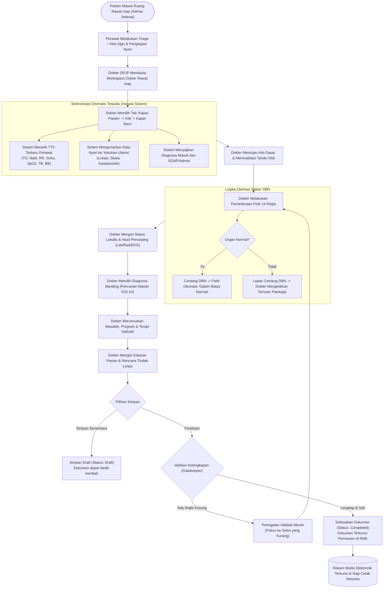

# Rencana Kerja Modernisasi Kajian Pasien Dokter Rawat Inap (V1 ke QuilvianFinal)

> **Dokumen Perencanaan Resmi & Laporan Kesiapan Implementasi**  
> **Modul:** Pelayanan Kesehatan — Dokter Rawat Inap (`doctor-inpatient`)  
> **Menu Sasaran:** Tab **Kajian Pasien** (`assessment` / `medical-assessment`)  
> **Referensi Bukti Lapangan:** `QuilvianV1/QuilvianSystemFrontendDev/captures/dokter-rawat-inap/04-kajian-pasien` (8 Berkas Tangkapan Layar Operasional)  
> **Status:** 🟡 **MENUNGGU PERSETUJUAN PENGGUNA (REVIEW & APPROVAL)** sebelum Eksekusi Implementasi Tahap 4.

---

## 0. Riwayat Revisi & Identitas Dokumen

| Revisi | Tanggal | Penulis | Ringkasan Perubahan |
| :--- | :--- | :--- | :--- |
| **Rev 1.0** | 30 September 2026 | Google Antigravity (Skill: `modernisasi-menu-v1`) | Dokumen awal audit mendalam paritas operasional V1, perancangan formulir terstruktur 8 seksi, spesifikasi endpoint Swagger, matriks kesenjangan (Gap Analysis), flowchart Mermaid, wireframe UI/UX modern, dan vertical slice roadmap. |

### Identitas Dokumen

| Atribut | Keterangan |
| :--- | :--- |
| **Area Modul** | Pelayanan Kesehatan — Ruang Kerja Dokter Rawat Inap (`Health Services / Inpatient Management / Doctor Inpatient`) |
| **Menu / Tab** | Ruang Kerja Dokter (`physician-workspace`) → Tab **Kajian Pasien** |
| **Jalur Dokumen** | `docs/module-blueprints/rawat-inap/dokter-rawat-inap/roadmap/rencana-kerja/kajian-pasien/kajian-pasien.md` |
| **Bukti Operasional V1** | Tangkapan layar pada folder `captures/dokter-rawat-inap/04-kajian-pasien/`: `01-riwayat-kajian.png`, `02-form-kajian-baru.png`, `Screenshot 2026-09-30 142003.png`, `Screenshot 2026-09-30 142018.png`, `Screenshot 2026-09-30 142030.png`, `Screenshot 2026-09-30 142034.png`, `Screenshot 2026-09-30 142039.png`, `Screenshot 2026-09-30 142043.png`; serta kode sumber V1 `kajian-pasien.jsx`, `kajian-form.jsx`, `kajian-history.jsx`, model `KajianPasien.cs`, dan controller `KajianPasienController.cs` |
| **Bukti Arsitektur V2 / Final** | Komponen FE: `tabs/assessment/medical-assessment-tab.jsx`, `medical-assessment-form.jsx`, `medical-assessment-history.jsx`, `medical-problem-list.jsx`, hook `use-inpatient-medical-assessment.jsx`; Backend V2: `TrxPatientAssessment`, `PatientAssessmentController.cs`, `PatientAssessmentDtos.cs`, `TrxPatientAssessmentConfiguration.cs` |
| **Standar Regulasi** | Permenkes No. 24 Tahun 2022 tentang Rekam Medis Elektronik (RME); Standar Akreditasi Rumah Sakit (STARKES) — Kelompok Pelayanan Berfokus pada Pasien (PAP 1, PAP 1.1, PAP 1.2), Hak Pasien dan Keluarga (HPK 2.1, HPK 2.2), Komunikasi dan Edukasi (MKE 8, MKE 9); Sasaran Keselamatan Pasien (SKP 1, SKP 2, SKP 6). |

---

## 1. Ringkasan Eksekutif & Permintaan Pemilik

### 1.1 Instruksi Pemilik Sistem (30 September 2026)
Pengguna memberikan instruksi tegas untuk modernisasi menu **Kajian Pasien**:
> *"Ikuti Form Form yang sesuai gambar ini, harus ada, soal ya itu berlaku di operasional. C:\Users\Admin\Documents\Quilvian\Source Code\QuilvianV1\QuilvianSystemFrontendDev\captures\dokter-rawat-inap\04-kajian-pasien"*

### 1.2 Kesimpulan Hasil Audit
1. **Ketertinggalan Signifikan pada V2/Final**:
   Meskipun kerangka dasar dokumen medis rawat inap telah dibangun pada tiket `BE-RWI-045` dan `FE-RWI-044` (5 September 2026), formulir pengkajian medis dokter di `QuilvianFinal` saat ini **hanya menyediakan 4 field textarea sederhana** (`chiefComplaint`, `physicalExamination`, `workingDiagnosis`, dan `therapyPlan`).
2. **Ketiadaan 8 Seksi Formulir Standar Operasional RS**:
   Formulir operasional V1 yang berlaku nyata di bangsal rawat inap memiliki **8 seksi terstruktur** yang sangat lengkap:
   - **Seksi 1: Informasi Dasar Kajian** (Tanggal Kajian dan Kajian Utama Pengkajian).
   - **Seksi 2: Tanda Vital & Kondisi Umum** (Keadaan Umum, Kesadaran, TD Sistolik/Diastolik, Nadi, Pernapasan, Suhu, TB, BB, SpO2, serta sinkronisasi otomatis dari catatan perawat bangsal).
   - **Seksi 3: Riwayat Penyakit & Keluhan Utama** (Keluhan Utama dengan auto-fill dari *Pain Assessment* / Pengkajian Nyeri perawat terbaru, riwayat sekarang, riwayat dahulu, riwayat keluarga, dan alergi).
   - **Seksi 4: Pemeriksaan Fisik Detail 14 Regio & 12 Saklar DBN (Dalam Batas Normal)**:
     - DBN Kepala & Keadaan Kepala
     - DBN Mata & Keadaan Mata
     - DBN Mulut & Keadaan Mulut
     - DBN THT & Keadaan THT
     - DBN Leher & Keadaan Leher
     - Pemeriksaan Kulit
     - DBN Thorak & Keadaan Thorak
     - Pemeriksaan Dada
     - Jantung Dalam Batas Normal & Keadaan Jantung
     - Paru-Paru Dalam Batas Normal & Keadaan Paru-Paru
     - Punggung Dalam Batas Normal & Keadaan Punggung
     - Abdomen Dalam Batas Normal & Keadaan Abdomen
     - Genital Dalam Batas Normal & Keadaan Genitalia
     - Ekstremitas Dalam Batas Normal & Keadaan Ekstremitas
     - Status Lokalis (deskripsi lesi/luka/fraktur)
     - Pemeriksaan Fisik Lainnya
   - **Seksi 5: Pemeriksaan Penunjang** (Hasil laboratorium, radiologi, EKG, USG, dsb).
   - **Seksi 6: Diagnosa & Rencana Terapi**:
     - Diagnosa Saat Ini (auto-fill dari SOAP/Assessment awal)
     - Pencarian & Pemilihan Diagnosa Banding berbasis Master ICD-10 resmi (bukan hardcode)
     - Tabel daftar diagnosa banding interaktif dengan opsi hapus
     - Kompilasi teks terformat otomatis Diagnosa Banding
     - Daftar Masalah klinis
     - Program / Rencana tindakan dokter
     - Terapi definitif / medikamentosa
   - **Seksi 7: Edukasi Pasien**:
     - Sasaran edukasi (Pasien / Keluarga)
     - Metode penyampaian edukasi
     - Bahasa yang digunakan
     - Jenis hambatan komunikasi (bahasa, fisik, kognitif)
     - Indikator Bahasa Daerah & Bahasa Asing
   - **Seksi 8: Rencana Tindak Lanjut**:
     - Tanggal tindak lanjut / kontrol
     - Nama tempat rujukan / poli tujuan
     - Indikasi tindak lanjut klinis
     - Keterangan tambahan
3. **Kepatuhan Terhadap Konstitusi & Aturan Workspace**:
   - Seluruh data diagnosa banding **wajib terhubung ke Master Data ICD-10** (`MstDiagnosis`), menolak keras data array hardcode.
   - Menggunakan relasi dan entitas yang sudah ada (`TrxPatientAssessment`), memperluas skema dengan migrasi EF Core resmi tanpa membuat entitas pasien/dokter duplikat.
   - Tanda tangan dan identitas dokter wajib ditautkan langsung ke data akun login dan master dokter (`DoctorId`, `AssessmentByUserId`, `UserActiveId`).

---

## 2. Audit Bukti Operasional V1 (Analisis Tangkapan Layar)

Audit dilakukan terhadap 8 berkas tangkapan layar operasional yang diserahkan pemilik sistem:

```
QuilvianV1/QuilvianSystemFrontendDev/captures/dokter-rawat-inap/04-kajian-pasien/
├── 01-riwayat-kajian.png
├── 02-form-kajian-baru.png
├── Screenshot 2026-09-30 142003.png
├── Screenshot 2026-09-30 142018.png
├── Screenshot 2026-09-30 142030.png
├── Screenshot 2026-09-30 142034.png
├── Screenshot 2026-09-30 142039.png
└── Screenshot 2026-09-30 142043.png
```

### 2.1 Analisis Tampilan 01: Riwayat Kajian Pasien (`01-riwayat-kajian.png`)
- **Navigasi Tab Modul**: Terletak pada tab ke-3 di Workspace Dokter Rawat Inap: `SOAP` | `CPPT` | **`KAJIAN PASIEN`** | `RESEP` | `TINDAKAN` | `RESUME MEDIS` | `VISIT` | `PENUNJANG MEDIS`.
- **Sub-Tab Internal**: Terbagi atas dua sub-tab:
  1. `Riwayat Kajian` (tampilan tabel histori pengkajian yang telah dibuat).
  2. `Form Kajian Baru` (layar input dokumentasi pengkajian baru).
- **Elemen Antarmuka**:
  - Header panel: "Riwayat Kajian untuk Kunjungan Ini".
  - Counter badge: Menampilkan jumlah kajian yang tercatat (contoh: `[0 Kajian]`).
  - Tombol aksi utama: `[+ Kajian Baru]` (warna hijau) di sisi kanan header.
  - State kosong (*Empty State*): Ikon jam histori berputar (`FaHistory`), pesan informatif *"Belum ada riwayat kajian untuk kunjungan ini"*, dan tombol pemicu cepat `[+ Buat Kajian Pertama]`.
  - Format tabel histori (pada `kajian-history.jsx`): Kolom `Tanggal`, `Keluhan Utama`, `Dokter Penilai`, dan kolom `Aksi` (ikon detail informasi modal dan gunakan sebagai template).

### 2.2 Analisis Tampilan 02 & 03: Header, Info Dasar & Tanda Vital (`02-form-kajian-baru.png` & `Screenshot 2026-09-30 142003.png`)
- **Header Formulir**: Menampilkan judul *"Form Kajian Pasien Baru"* (atau *"Edit Kajian Pasien"*) dilengkapi tombol aksi `[💾 Simpan]` dan `[✕ Batal]`.
- **Seksi 1 — Informasi Dasar Kajian**:
  - `Tanggal Kajian` (`tglKajian`): Input format tanggal & waktu (*datetime-local*), nilai awal otomatis terisi waktu saat ini (*real-time*).
  - `Kajian Utama Pengkajian` (`kajianUtamaPengkajian`): Field teks untuk judul/fokus kajian medis (contoh: "Kajian Awal Medis Bedah", "Pengkajian Ulang Pasca Operasi").
- **Seksi 2 — Tanda Vital**:
  - Badge Status Sinkronisasi: Indikator berwarna di pojok kanan header seksi (`[Data Tersedia]` warna hijau jika tanda vital perawat ditemukan, `[Belum Ada Data]` warna oranye jika kosong, `[Memuat...]` jika proses fetch).
  - `Keadaan Umum`: Dropdown seleksi (`Baik`, `Sedang`, `Lemah`, `Buruk`).
  - `Kesadaran`: Dropdown seleksi GCS deskriptif (`Compos Mentis`, `Somnolent`, `Sopor`, `Coma`).
  - `TD Systolic (mmHg)`: Input angka tekanan darah sistolik.
  - `TD Diastolic (mmHg)`: Input angka tekanan darah diastolik.
  - `Nadi (x/menit)`: Frekuensi denyut nadi per menit.
  - `Pernapasan (x/menit)`: Frekuensi pernapasan (RR) per menit.
  - `Suhu (°C)`: Nilai suhu tubuh dalam derajat Celcius.
  - `Tinggi Badan (cm)` & `Berat Badan (kg)`: Parameter antropometri dasar.

### 2.3 Analisis Tampilan 04: Riwayat Penyakit & Awal Fisik (`Screenshot 2026-09-30 142018.png`)
- **Seksi 3 — Riwayat Penyakit**:
  - Badge status ketersediaan data *Pain Assessment*.
  - `Keluhan Utama`: Textarea luas. Di V1 terdapat fitur otomatisasi pintar: jika perawat sudah mengisi pengkajian nyeri (*Pain Assessment*), sistem mengompilasi teks rincian nyeri (lokasi, skala /10, karakteristik, durasi, faktor pemberat, faktor peringan) langsung ke keluhan utama ini, namun dokter tetap bebas menyunting atau menambahkannya.
- **Seksi 4 — Pemeriksaan Fisik Detail (Bagian 1)**:
  - Pola interaktif **Saklar DBN (Dalam Batas Normal)**:
    - Setiap regio tubuh dipasangkan dengan satu checkbox DBN.
    - Logika otomatis V1: Jika checkbox DBN dicentang (`checked = true`), textarea di bawahnya otomatis terisi kalimat `"Dalam Batas Normal"`. Jika centang dilepas, teks kembali dikosongkan agar dokter dapat mengetikkan temuan patologis secara spesifik.
  - Regio di Bagian 1:
    - `[ ] DBN Kepala` → Textarea `Keadaan Kepala`.
    - `[ ] DBN Mata` → Textarea `Keadaan Mata`.
    - `[ ] DBN Mulut` → Textarea `Keadaan Mulut`.
    - `[ ] DBN THT` → Textarea `Keadaan THT`.
    - `[ ] DBN Leher` → Textarea `Keadaan Leher`.
    - Textarea `Pemeriksaan Kulit`.

### 2.4 Analisis Tampilan 05: Pemeriksaan Fisik Lanjutan (`Screenshot 2026-09-30 142030.png`)
- Regio di Bagian 2:
  - `[ ] DBN Thorak` → Textarea `Keadaan Thorak`.
  - Textarea `Pemeriksaan Dada`.
  - `[ ] Jantung Dalam Batas Normal` → Textarea `Keadaan Jantung`.
  - `[ ] Paru-Paru Dalam Batas Normal` → Textarea `Keadaan Paru-Paru`.
  - `[ ] Punggung Dalam Batas Normal` → Textarea `Keadaan Punggung`.
  - `[ ] Abdomen Dalam Batas Normal` → Textarea `Keadaan Abdomen`.

### 2.5 Analisis Tampilan 06: Genital, Ekstremitas, Status Lokalis & Penunjang (`Screenshot 2026-09-30 142034.png`)
- Regio di Bagian 3:
  - `[ ] Genital Dalam Batas Normal` → Textarea `Keadaan Genitalia`.
  - `[ ] Ekstremitas Dalam Batas Normal` → Textarea `Keadaan Ekstremitas`.
  - `Status Lokalis`: Textarea penuh untuk menggambar atau mendeskripsikan secara detail regio yang mengalami lesi, trauma, fraktur, atau area tindakan operasi khusus.
  - `Pemeriksaan Lainnya`: Textarea catatan fisik pelengkap.
- **Seksi 5 — Pemeriksaan Penunjang**:
  - `Hasil Pemeriksaan Penunjang`: Textarea luas penampung hasil laboratorium (hematologi, kimia darah), radiologi (rontgen, USG, CT-scan), EKG, maupun penunjang lainnya.

### 2.6 Analisis Tampilan 07: Diagnosa & Rencana Terapi (`Screenshot 2026-09-30 142039.png`)
- **Seksi 6 — Diagnosa & Rencana Terapi**:
  - `Diagnosa Saat Ini`: Textarea terisi diagnosa kerja utama (dapat terisi dari SOAP sebelumnya).
  - `Cari dan Pilih Diagnosa Banding`: Komponen select async berbasis ICD-10 dengan dukungan pencarian minimal 2 karakter dan *infinite scrolling*.
  - `Tabel Diagnosa Banding`: Menampilkan baris diagnosa terpilih (Kolom No, Badge Kode ICD-10, Nama Diagnosa resmi beserta kode DTD, dan tombol hapus merah).
  - `Diagnosa Banding (Auto-filled)`: Textarea read-only yang otomatis menyusun daftar terformat angka:
    ```text
    1. A08.1 - Acute gastroenteropathy due to Norwalk agent
    2. K52.9 - Non-infective gastroenteritis and colitis, unspecified
    ```
  - `Daftar Masalah`: Textarea inventarisasi masalah medis aktif pasien.
  - `Program / Rencana`: Textarea rencana intervensi, rencana tindakan invasif, atau rencana konsultasi spesialis.
  - `Terapi`: Textarea terapi medikamentosa (obat-obatan definitif oral maupun injeksi).

### 2.7 Analisis Tampilan 08: Edukasi Pasien & Tindak Lanjut (`Screenshot 2026-09-30 142043.png`)
- **Seksi 7 — Edukasi Pasien**:
  - `Edukasi Kepada`: Textarea penerima informasi (Pasien, Istri, Suami, Orang Tua, Anak).
  - `Penyampaian Edukasi`: Metode pemberian edukasi (Diskusi langsung, Leaflet, Peragaan).
  - `Bahasa yang Digunakan`: Field input teks bahasa pengantar (contoh: Bahasa Indonesia).
  - `Jenis Hambatan`: Field input hambatan komunikasi (contoh: Pendengaran berkurang, lansia).
  - Checkbox penanda khusus: `[ ] Bahasa Daerah` dan `[ ] Bahasa Asing`.
- **Seksi 8 — Tindak Lanjut**:
  - `Tanggal Tindak Lanjut`: Input tanggal kontrol / rencana evaluasi.
  - `Nama Tempat`: Lokasi fasilitas/ruangan tujuan kontrol atau rujukan.
  - `Indikasi Tindak Lanjut`: Textarea alasan medis dilakukannya rujukan atau pemeriksaan lanjutan.
  - `Keterangan`: Catatan instruksi penutup dari DPJP.

---

## 3. Matriks Kesenjangan (Gap Analysis Matrix V1 vs QuilvianFinal)

Tabel berikut memetakan setiap parameter operasional V1 terhadap kondisi di `QuilvianFinal`:

| No | Parameter / Fitur Operasional V1 | Bukti Tangkapan Layar | Status di QuilvianFinal Saat Ini | Rekomendasi Solusi Modernisasi |
| :---: | :--- | :--- | :---: | :--- |
| **1** | **Tab Navigasi & Sub-Tab Riwayat / Form** | `01-riwayat-kajian.png` | `SEBAGIAN DITERAPKAN` | Tab `assessment` sudah ada, namun sub-tab `Form Kajian Baru` menyatu canggung dengan mode klik tombol; perlu dirapikan dengan `ClinicalSegmentedNav` terpadu. |
| **2** | **Tabel Riwayat Pengkajian & Modal Detail** | `01-riwayat-kajian.png` | `SEBAGIAN DITERAPKAN` | Tabel riwayat ada tapi kolomnya belum menyajikan ringkasan keluhan utama dan popup detail dokumen komprehensif. |
| **3** | **Informasi Dasar Kajian (`tglKajian`, `kajianUtama`)** | `02-form-kajian-baru.png` | `BELUM DITERAPKAN` | Belum ada field `tglKajian` dan judul fokus kajian `kajianUtamaPengkajian` di form dokter. |
| **4** | **Tanda Vital Lengkap (TD, Nadi, RR, Suhu, TB, BB, SpO2)** | `02-form-kajian-baru.png` | `SEBAGIAN DITERAPKAN` | Backend `TrxPatientAssessment` punya kolom tanda vital, tapi di UI form dokter rawat inap tidak dapat diinput/diedit langsung dan tidak ada indikator sinkronisasi perawat. |
| **5** | **Keadaan Umum & Kesadaran GCS** | `Screenshot ... 142003.png` | `SEBAGIAN DITERAPKAN` | Enum ada di backend, namun dropdown interaktif tidak disediakan di form kajian dokter. |
| **6** | **Auto-fill Keluhan Utama dari Pain Assessment** | `Screenshot ... 142018.png` | `BELUM DITERAPKAN` | Belum ada logic penyedotan data asesmen nyeri terbaru perawat ke dalam keluhan utama kajian dokter. |
| **7** | **12 Saklar Otomatis DBN (Dalam Batas Normal)** | `Screenshot ... 142018 - 142034.png` | `BELUM DITERAPKAN` | Sama sekali belum ada saklar DBN interaktif yang mengotomatisasi teks "Dalam Batas Normal". |
| **8** | **Pemeriksaan Fisik 14 Regio Tubuh Terstruktur** | `Screenshot ... 142018 - 142034.png` | `BELUM DITERAPKAN` | Final saat ini hanya punya 1 kotak `physicalExamination` naratif; kehilangan seluruh pemisahan regio kepala, mata, mulut, THT, leher, thorak, jantung, paru, dsb. |
| **9** | **Status Lokalis & Pemeriksaan Lainnya** | `Screenshot ... 142034.png` | `BELUM DITERAPKAN` | Field khusus deskripsi lesi/status lokalis belum tersedia di formulir kajian dokter. |
| **10** | **Pemeriksaan Penunjang (Lab, Rad, EKG)** | `Screenshot ... 142034.png` | `BELUM DITERAPKAN` | Seksi rangkuman penunjang medis belum ada di formulir kajian. |
| **11** | **Diagnosa Saat Ini & Diagnosa Banding ICD-10** | `Screenshot ... 142039.png` | `SEBAGIAN DITERAPKAN` | Ada `workingDiagnosis` teks bebas dan `DoctorDiagnosisSearchModal`, tapi belum ada tabel multi-select diagnosa banding dan auto-kompilasi teks terformat. |
| **12** | **Daftar Masalah, Program Tindakan & Terapi** | `Screenshot ... 142039.png` | `BELUM DITERAPKAN` | Belum ada pemisahan terstruktur untuk Masalah Aktif, Program Kerja, dan Terapi Medikamentosa pada kajian medis. |
| **13** | **Seksi Edukasi Pasien (Sasaran, Cara, Hambatan)** | `Screenshot ... 142043.png` | `BELUM DITERAPKAN` | Formulir edukasi pasien dan checkbox kendala bahasa belum tersedia. |
| **14** | **Seksi Rencana Tindak Lanjut (Tanggal, Tempat, Indikasi)** | `Screenshot ... 142043.png` | `BELUM DITERAPKAN` | Rencana kontrol/rujukan dan indikasi tindak lanjut belum ada di pengkajian medis dokter. |
| **15** | **Tanda Tangan Digital (TTD) & Audit Penulis** | Aturan Konstitusi Quilvian | `SEBAGIAN DITERAPKAN` | Penulis tercatat via `DoctorId`, namun belum dilengkapi stempel digital resmi dan integrasi master TTD `ttdPath` dokter. |

---

## 4. Arsitektur Data & Model Backend QuilvianFinal

Untuk mempertahankan prinsip integritas rekayasa (*Single Source of Truth*), kita **tidak membuat tabel duplikat**, melainkan memperkaya entitas `TrxPatientAssessment` yang memang dirancang menaungi pengkajian pasien rawat inap (`AssessmentType = MedicalInitial` / `MedicalReassessment`).

### 4.1 Penambahan Kolom pada `TrxPatientAssessment`
Seluruh kolom baru dibuat bersifat `nullable` agar tidak merusak baris data pengkajian poli, IGD, dan keperawatan yang sudah ada:

```csharp
// =========================================================================
// EKSTENSI OPERASIONAL KAJIAN MEDIS DOKTER (PARITAS V1)
// =========================================================================

// Info Dasar Kajian
[MaxLength(150)]
public string? KajianUtamaPengkajian { get; set; }

// Pemeriksaan Fisik Spesifik Per Regio
[MaxLength(1000)]
public string? KeadaanKepala { get; set; }

[MaxLength(1000)]
public string? KeadaanMata { get; set; }

[MaxLength(1000)]
public string? KeadaanMulut { get; set; }

[MaxLength(1000)]
public string? KeadaanTHT { get; set; }

[MaxLength(1000)]
public string? KeadaanLeher { get; set; }

[MaxLength(1000)]
public string? KeadaanKulit { get; set; }

[MaxLength(1000)]
public string? KeadaanThorak { get; set; }

[MaxLength(1000)]
public string? KeadaanDada { get; set; }

[MaxLength(1000)]
public string? KeadaanJantung { get; set; }

[MaxLength(1000)]
public string? KeadaanParuParu { get; set; }

[MaxLength(1000)]
public string? KeadaanPunggung { get; set; }

[MaxLength(1000)]
public string? KeadaanAbdomen { get; set; }

[MaxLength(1000)]
public string? KeadaanGenitalia { get; set; }

[MaxLength(1000)]
public string? KeadaanEkstremitas { get; set; }

[MaxLength(2000)]
public string? StatusLokalis { get; set; }

[MaxLength(1000)]
public string? KeadaanLainnya { get; set; }

// Saklar DBN (Dalam Batas Normal)
public bool IsDBNKepala { get; set; } = false;
public bool IsDBNMata { get; set; } = false;
public bool IsDBNMulut { get; set; } = false;
public bool IsDBNTHT { get; set; } = false;
public bool IsDBNLeher { get; set; } = false;
public bool IsDBNThorak { get; set; } = false;
public bool IsDBNJantung { get; set; } = false;
public bool IsDBNParu { get; set; } = false;
public bool IsDBNPunggung { get; set; } = false;
public bool IsDBNAbdomen { get; set; } = false;
public bool IsDBNGenital { get; set; } = false;
public bool IsDBNEkstremitas { get; set; } = false;

// Pemeriksaan Penunjang
[MaxLength(3000)]
public string? PemeriksaanPenunjang { get; set; }

// Diagnosa & Perencanaan
[MaxLength(1000)]
public string? DiagnosaSaatIni { get; set; }

[MaxLength(2000)]
public string? DiagnosaBanding { get; set; }

[MaxLength(2000)]
public string? DaftarMasalah { get; set; }

[MaxLength(2000)]
public string? Program { get; set; }

[MaxLength(3000)]
public string? Terapi { get; set; }

// Edukasi Pasien
[MaxLength(250)]
public string? EdukasiKepada { get; set; }

[MaxLength(500)]
public string? PenyampaianEdukasi { get; set; }

[MaxLength(100)]
public string? BahasaDigunakan { get; set; }

[MaxLength(250)]
public string? JenisHambatan { get; set; }

public bool IsBahasaDaerah { get; set; } = false;
public bool IsBahasaAsing { get; set; } = false;

// Rencana Tindak Lanjut
public DateTime? TanggalTindakLanjut { get; set; }

[MaxLength(200)]
public string? NamaTempatTindakLanjut { get; set; }

[MaxLength(1000)]
public string? IndikasiTindakLanjut { get; set; }

[MaxLength(1000)]
public string? KeteranganTindakLanjut { get; set; }
```

---

## 5. Spesifikasi Endpoint Swagger API

Seluruh endpoint bernaung di bawah tag Swagger resmi:  
`[Tags("Health Services / Clinical Management / Patient Assessment")]`  
Base URL: `/api/v1/health-services/clinical-management/patient-assessments`

### 5.1 Tabel Spesifikasi Endpoint

| HTTP Method | Route Path | Deskripsi Fungsi | Otorisasi / Role | Status Sukses | Error Codes |
| :--- | :--- | :--- | :--- | :---: | :---: |
| `GET` | `/episodes/{episodeId}` | Mengambil seluruh riwayat kajian pasien pada episode rawat inap aktif. | `Doctor`, `Nurse`, `MedicalRecord` | `200 OK` | `401`, `403`, `404` |
| `GET` | `/{id}` | Mengambil detail lengkap dokumen kajian medis pasien berdasarkan ID. | `Doctor`, `Nurse`, `MedicalRecord` | `200 OK` | `401`, `403`, `404` |
| `POST` | `/` | Membuat dokumen kajian medis baru (status awal: `Draft`). | `Doctor` (Wajib akun dokter) | `201 Created` | `400`, `401`, `403`, `422` |
| `PUT` | `/{id}` | Memperbarui isi formulir kajian medis yang masih berstatus `Draft`. | `Doctor` (Penulis Asli) | `200 OK` | `400`, `401`, `403`, `404`, `409` |
| `PATCH` | `/{id}/complete` | Menyelesaikan & mengunci (*lock*) dokumen kajian medis secara permanen. | `Doctor` (Penulis Asli) | `200 OK` | `400`, `401`, `403`, `422` |
| `PATCH` | `/{id}/cancel` | Membatalkan dokumen kajian medis dengan alasan pembatalan klinis. | `Doctor`, `Supervisor` | `200 OK` | `400`, `401`, `403` |
| `GET` | `/episodes/{episodeId}/latest-nurse-vitals` | Mengambil data tanda vital & asesmen nyeri terbaru perawat untuk auto-fill. | `Doctor`, `Nurse` | `200 OK` | `401`, `404` |

---

## 6. Alur Bisnis Proses Rumah Sakit (Business Process Workflow)

Alur proses kajian pasien dokter rawat inap digambarkan secara terstruktur dari admisi hingga penguncian rekam medis:



### Contoh Skenario Nyata Bangsal Rumah Sakit:
1. **Skenario Pasien Bedah Akut (Apendisitis Akut)**:
   - Pasien Tn. B (32 th) masuk bangsal rawat inap bedah dengan keluhan nyeri perut kanan bawah.
   - Dokter membuka *Kajian Pasien*. Sistem otomatis menarik tanda vital dari perawat (Nadi 98x/m, Suhu 37.9°C, Skala Nyeri 7/10 tajam di kuadran kanan bawah).
   - Dokter mencentang DBN pada Kepala, Mata, Leher, Dada, Jantung, dan Paru (semua otomatis terisi "Dalam Batas Normal").
   - Pada regio **Abdomen**, dokter melepas centang DBN dan mengetik: *"Inspeksi cembung, bising usus menurun, nyeri tekan dan nyeri lepas di titik McBurney (+), Rovsing sign (+), defans muskular (+)"*.
   - Pada **Status Lokalis**, dokter mencatat: *"Regio iliaka dekstra tegang, perkusi nyeri"*.
   - Pada **Diagnosa Banding**, dokter mencari ICD-10 `K35.8` (*Acute appendicitis, other and unspecified*).
   - Pada **Program**, dokter merencanakan: *"Pro Appendektomi Cito, puasakan pasien, pasang infus RL 20 tpm, persiapkan informed consent operasi"*.
2. **Skenario Pasien Anak (Bronkopneumonia)**:
   - Pasien An. K (3 th) masuk dengan sesak napas dan demam tinggi.
   - Pada tanda vital, sistem menampilkan RR 44x/m (Takipnea), SpO2 93% *room air*, suhu 38.8°C.
   - Pada pemeriksaan fisik Paru, DBN dilepas: *"Vesikuler meningkat, terdapat ronki basah halus di kedua basal paru, retraksi interkostal (+)"*.
   - Pada Edukasi Pasien, dokter mengisi edukasi kepada *"Orang Tua / Ibu"*, metode *"Penjelasan Lisan & Edukasi Posisi Tirah Baring"*, hambatan *"Cemas tinggi"*.

---

## 7. Analisis Pengaruh Perubahan Bisnis

1. **Efisiensi Waktu Dokumentasi Medis DPJP**:
   - Keberadaan 12 saklar DBN menghemat waktu pengetikan dokter hingga 60-70% untuk organ tubuh yang sehat.
   - Integrasi otomatis penarikan tanda vital dan keluhan nyeri dari catatan perawat bangsal meniadakan pengetikan ganda (*redundant typing*).
2. **Peningkatan Keselamatan Pasien (SKP)**:
   - **SKP 1 (Identifikasi Pasien Tepat)**: Mengunci ID Episode dan RM pasien secara ketat.
   - **SKP 2 (Komunikasi Efektif)**: Kolom edukasi pasien dengan pelacakan kendala bahasa (daerah/asing) memastikan keluarga pasien memahami rencana perawatan dan risiko medis.
   - **SKP 6 (Pengurangan Risiko Cedera Pasien Jatuh/Kritis)**: Kesadaran GCS, TTV abnormal, dan status lokalis yang terdokumentasi rapi mencegah perburukan klinis yang terlambat diantisipasi (*failure to rescue*).
3. **Kepatuhan Akreditasi Rumah Sakit (STARKES / KARS)**:
   - Memenuhi standar **PAP 1.1** (Pengkajian awal medis rawat inap wajib mencakup riwayat kesehatan, pemeriksaan fisik menyeluruh, penunjang, dan rencana terapi dalam waktu 1x24 jam sejak admisi).
   - Memenuhi standar **MKE 9** (Dokumentasi edukasi pasien dan keluarga beserta verifikasi pemahaman materi).

---

## 8. Skema Desain UI/UX Modern & Wireframe Inovasi

Antarmuka dirancang modern berbasis token desain Quilvian, memadukan kehangatan visual, kontras yang jelas, serta kenyamanan mata dokter bangsal:

```
+-------------------------------------------------------------------------------------------------------+
|  KAJIAN PASIEN - DOKTER RAWAT INAP                                                                    |
|  Pasien: SANTI (32 Th) | No. RM: 25-31-10-94 | Kamar: Cempaka BAYI | DPJP: dr. Hendra, Sp.A           |
+-------------------------------------------------------------------------------------------------------+
|  [ 📋 Riwayat Kajian (2) ]     [ 🩺 Form Kajian Baru / Edit ]                                         |
+-------------------------------------------------------------------------------------------------------+
|  FORM KAJIAN PASIEN BARU                                                [ 💾 Simpan Draft ] [ ✕ Batal ] |
+-------------------------------------------------------------------------------------------------------+
|  ┌── 1. INFORMASI DASAR KAJIAN ────────────────────────────────────────────────────────────────────┐ |
|  │  Tanggal & Waktu Kajian: [ 2026-09-30 14:30 📅 ]    Fokus Kajian: [ Kajian Awal Medis Anak   ] │ |
|  └─────────────────────────────────────────────────────────────────────────────────────────────────┘ |
|                                                                                                       |
|  ┌── 2. TANDA VITAL & KONDISI UMUM ────────────────────────── [ ✅ Data Tersedia dari Ns. Rina ] ───┐ |
|  │  Keadaan Umum: [ Sedang          ▼ ]        Kesadaran: [ Compos Mentis                ▼ ]       │ |
|  │  TD Sistolik:  [ 110 ] mmHg                 TD Diastolik: [ 70  ] mmHg                           │ |
|  │  Nadi:         [ 102 ] x/menit              Pernapasan:   [ 24  ] x/menit                        │ |
|  │  Suhu:         [ 37.8 ] °C                  SpO2:         [ 98  ] %                              │ |
|  │  Tinggi Badan: [ 92  ] cm                   Berat Badan:  [ 13.5] kg                             │ |
|  └─────────────────────────────────────────────────────────────────────────────────────────────────┘ |
|                                                                                                       |
|  ┌── 3. RIWAYAT PENYAKIT & KELUHAN UTAMA ──────────────────── [ 🔄 Terisi dari Pain Assessment ] ──┐ |
|  │  Keluhan Utama:                                                                                 │ |
|  │  [ Nyeri perut kanan bawah sejak 2 hari SMRS. Skala nyeri 6/10, bertambah saat batuk.          ] │ |
|  │  [ Riwayat Penyakit Sekarang: Demam hilang timbul sejak kemarin...                             ] │ |
|  └─────────────────────────────────────────────────────────────────────────────────────────────────┘ |
|                                                                                                       |
|  ┌── 4. PEMERIKSAAN FISIK DETAIL (14 REGIO & SAKLAR DBN) ──────────────────────────────────────────┐ |
|  │  [✓] DBN Kepala           [✓] DBN Mata             [✓] DBN Mulut            [✓] DBN THT        │ |
|  │  [ Dalam Batas Normal  ]  [ Dalam Batas Normal  ]  [ Dalam Batas Normal  ]  [ Dalam Batas N..] │ |
|  │                                                                                                 │ |
|  │  [✓] DBN Leher            Pemeriksaan Kulit        [✓] DBN Thorak           Pemeriksaan Dada    │ |
|  │  [ Dalam Batas Normal  ]  [ Turgor kembali lambat] [ Dalam Batas Normal  ]  [ Simetris ki=ka ]  │ |
|  │                                                                                                 │ |
|  │  [✓] DBN Jantung          [ ] DBN Paru             [✓] DBN Punggung         [ ] DBN Abdomen     │ |
|  │  [ BJ I-II murni reguler] [ Ronki basah halus + ]  [ Tidak ada kelainan ]   [ Nyeri McBurney + ]│ |
|  │                                                                                                 │ |
|  │  [✓] DBN Genitalia        [✓] DBN Ekstremitas                                                   │ |
|  │  [ Dalam Batas Normal  ]  [ Akral hangat, CRT <2s]                                              │ |
|  │                                                                                                 │ |
|  │  Status Lokalis:                                                                                │ |
|  │  [ Regio abdomen kanan bawah: inspeksi supel, palpasi nyeri tekan (+) titik McBurney...        ] │ |
|  │  Pemeriksaan Lainnya:                                                                           │ |
|  │  [ Pembesaran KGB colli (-), edema pretibial (-)                                               ] │ |
|  └─────────────────────────────────────────────────────────────────────────────────────────────────┘ |
|                                                                                                       |
|  ┌── 5. PEMERIKSAAN PENUNJANG ─────────────────────────────────────────────────────────────────────┐ |
|  │  [ Hb: 12.8, Leukosit: 14.500 (Leukositosis), Trombosit: 280.000.                               ] │ |
|  │  [ USG Abdomen: Tampak gambaran target sign pada appendiks vermiformis...                      ] │ |
|  └─────────────────────────────────────────────────────────────────────────────────────────────────┘ |
|                                                                                                       |
|  ┌── 6. DIAGNOSA & RENCANA TERAPI ─────────────────────────────────────────────────────────────────┐ |
|  │  Diagnosa Saat Ini: [ Febris H-3 ec Suspek Apendisitis Akut                                   ] │ |
|  │  Cari Diagnosa Banding ICD-10: [ Appendicitis                                     🔍 Cari ]     │ |
|  │  +-------------------------------------------------------------------------------------------+  │ |
|  │  | No | Kode ICD-10 | Nama Diagnosa                              | Aksi                      |  │ |
|  │  |----+-------------+--------------------------------------------+---------------------------|  │ |
|  │  | 1  | K35.8       | Other and unspecified acute appendicitis   | [ 🗑 Hapus ]              |  │ |
|  │  | 2  | A08.1       | Acute gastroenteropathy due to Norwalk     | [ 🗑 Hapus ]              |  │ |
|  │  +-------------------------------------------------------------------------------------------+  │ |
|  │  Diagnosa Banding Terformat (Auto):                                                             │ |
|  │  [ 1. K35.8 - Other and unspecified acute appendicitis                                          ] │ |
|  │  [ 2. A08.1 - Acute gastroenteropathy due to Norwalk agent                                     ] │ |
|  │  Daftar Masalah: [ Nyeri akut, hipertermia, risiko dehidrasi                                    ] │ |
|  │  Program:        [ Pro Appendektomi, konsul dr. Sp.B, pasang IVFD D5 1/4 NS 12 tpm              ] │ |
|  │  Terapi:         [ Ceftriaxone 1x1g IV, Paracetamol drip 150mg k/p demam, Ondansetron 2mg IV   ] │ |
|  └─────────────────────────────────────────────────────────────────────────────────────────────────┘ |
|                                                                                                       |
|  ┌── 7. EDUKASI PASIEN & KELUARGA ─────────────────────────────────────────────────────────────────┐ |
|  │  Edukasi Kepada:     [ Ibu Pasien (Ny. Rina)    ]  Metode: [ Penjelasan lisan langsung         ]│ |
|  │  Bahasa Pengantar:   [ Bahasa Indonesia         ]  Hambatan: [ Sangat cemas                    ]│ |
|  │  [ ] Pasien/Keluarga Menggunakan Bahasa Daerah     [ ] Pasien/Keluarga Menggunakan Bahasa Asing │ |
|  └─────────────────────────────────────────────────────────────────────────────────────────────────┘ |
|                                                                                                       |
|  ┌── 8. RENCANA TINDAK LANJUT ─────────────────────────────────────────────────────────────────────┐ |
|  │  Tanggal Tindak Lanjut: [ 2026-10-02 📅 ]          Nama Tempat: [ OK Bedah Sentral             ]│ |
|  │  Indikasi:   [ Rencana tindakan operatif cito                                                  ]│ |
|  │  Keterangan: [ Inform concent telah ditandatangani orang tua pasien                            ]│ |
|  └─────────────────────────────────────────────────────────────────────────────────────────────────┘ |
|                                                                                                       |
|  ===================================================================================================  |
|  [ ⚠️ Dokumen Belum Terkunci ]   [ 💾 Simpan Draft ]   [ 🔒 Selesaikan & Kunci Pengkajian ]           |
+-------------------------------------------------------------------------------------------------------+
```

---

## 9. Rencana Kerja Eksekusi Vertical Slice (Tahap 4)

Setelah laporan rencana kerja ini mendapatkan persetujuan pengguna, eksekusi implementasi dilakukan secara tuntas mencakup Backend dan Frontend:

### Slice 1: Backend Database Migration & DTO Extension
- **Task ID**: `BE-RWI-145` (Pengayaan Entitas & DTO Kajian Pasien Terstruktur)
- **Lingkup**:
  1. Menambahkan 35 properti operasional baru pada `TrxPatientAssessment.cs`.
  2. Memperbarui pemetaan fluent API pada `TrxPatientAssessmentConfiguration.cs`.
  3. Membuat migrasi EF Core: `AddInpatientDoctorMedicalAssessmentOperationalColumns`.
  4. Memperbarui `PatientAssessmentDtos.cs`:
     - Menambahkan properti pada `CreatePatientAssessmentRequest` & `UpdatePatientAssessmentRequest`.
     - Menambahkan properti pada `PatientAssessmentDetailResponse` dan respons ringkasan.
  5. Menyesuaikan logika pemetaan dan validasi di `PatientAssessmentController.cs`.
  6. Memastikan kompilasi bersih: `dotnet build QuilvianSystemBackend.csproj --no-incremental` (0 Error).

### Slice 2: Frontend Komponen Formulir & Interaktivitas DBN
- **Task ID**: `FE-RWI-145` (Pembaruan UI Modern & Form 8 Seksi Kajian Pasien)
- **Lingkup**:
  1. Membangun sub-komponen seksi formulir:
     - `medical-assessment-basic-info.jsx` (Tanggal & fokus kajian).
     - `medical-assessment-vitals.jsx` (Tanda vital interaktif, sinkronisasi data perawat).
     - `medical-assessment-physical-exam.jsx` (14 regio dengan 12 saklar interaktif DBN).
     - `medical-assessment-diagnosa-banding.jsx` (Tabel ICD-10 terintegrasi master data).
     - `medical-assessment-education-followup.jsx` (Edukasi & tindak lanjut).
  2. Memperbarui `use-inpatient-medical-assessment.jsx` untuk sinkronisasi state 8 seksi, auto-fill pain assessment, dan penanganan submit draft/complete.
  3. Memperbarui `medical-assessment-tab.jsx` untuk navigasi tab, segmented history/form, status alert, dan aksi penyelesaian.
  4. Memperbarui modul styling CSS `physician-medical-assessment.module.css` berbasis token desain Quilvian.
  5. Memastikan lolos build frontend tanpa error kompilasi.

---

## 10. Pertanyaan Keputusan Pemilik Sistem

Sebelum eksekusi Tahap 4 dimulai, mohon konfirmasi atas butir-butir penyesuaian berikut:

1. **Format Penyimpanan Diagnosa Banding**:
   Apakah Diagnosa Banding disimpan sebagai teks terkompilasi bernomor (`"1. K35.8 - Other acute appendicitis\n2. A08.1 - ..."`) seperti di V1, sekaligus ditautkan secara relasional ke tabel `TrxPatientDiagnosis` (tipe `Differential`) agar terbaca pada resume medis? *(Rekomendasi: Ya, disimpan ke keduanya agar kompatibel secara visual sekaligus terstandar di rekam medis).*
2. **Validasi Penyelesaian Dokumen (*Complete*)**:
   Apakah saat tombol `Selesaikan & Kunci Pengkajian` ditekan, seluruh 14 pemeriksaan fisik wajib terisi (baik berupa centang DBN atau teks manual temuan patologis)? *(Rekomendasi: Ya, demi kepatuhan SKP dan standar akreditasi rekam medis STARKES).*
