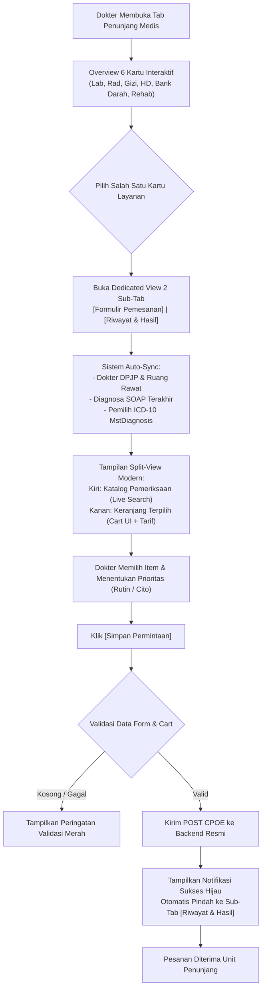

# Rencana Kerja Modernisasi Menu: Penunjang Medis Dokter Rawat Inap

## 1. Identitas & Status Dokumen

| Atribut | Isi |
| :--- | :--- |
| **Modul / Sub-modul** | Pelayanan Kesehatan (*Health Services*) — Dokter Rawat Inap (*Inpatient Physician Workspace*) |
| **Menu** | Ruang Kerja Dokter Rawat Inap → Tab: **Penunjang Medis (*Ancillary & Diagnostic Services*)** |
| **Jalur dokumen** | `docs/module-blueprints/rawat-inap/dokter-rawat-inap/roadmap/rencana-kerja/penunjang-medis/penunjang-medis.md` |
| **Revisi** | rev 2.0 — 1 Oktober 2026 |
| **Status** | **SELESAI (1 Oktober 2026)** |
| **Roadmap aktif** | `roadmap/backend-roadmap-v2.md` dan `roadmap/frontend-roadmap-v2.md` (sesuai `blueprint-manifest.md` RWI-BP-001 Rev 7) |
| **SHA sumber bukti** | V1 FE `86408f245`, V1 BE `4be1499c`, Final BE `425cfeae`, Final FE `ee75e055b` |
| **Keputusan terkait** | `RWI-DEC-108`, `RWI-DEC-113`, `RWI-DEC-150`, `RWI-DEC-152`, `RWI-DEC-171`, `RWI-DEC-178` |
| **Usulan keputusan terbuka** | 5 usulan — `KK-1` s.d. `KK-5` (disetujui pengguna 1 Oktober 2026) |

---

## 2. Ringkasan Eksekutif

- **Yang dipakai dokter di V1**: Dokter rawat inap di V1 disajikan overview 6 kartu layanan penunjang (*Radiologi, Gizi, Laboratorium, Hemodialisa, Bank Darah, Rehab Medis*). Ketika salah satu kartu diklik, sistem membuka sub-view layar penuh dengan 2 sub-tab: `[Form]` dan `[Riwayat]`. Formulir pemesanan terstruktur rapi memuat diagnosa SOAP otomatis, pemilih ICD-10 dengan tombol tambah, tabel katalog pemeriksaan dengan live search dan tarif, keranjang pemeriksaan terpilih (*cart*), serta tombol simpan permintaan.
- **Kondisi Final saat ini**: Final telah memiliki landing 6 kartu (`SupportingLandingGrid`), namun 3 kartu (*Gizi, Rehab Medik, Bank Darah*) dikunci pada panel `SupportingUnavailablePanel` ("Integrasi belum tersedia") tanpa formulir. Untuk Laboratorium dan Radiologi, alur sub-tab dihilangkan dan diganti dengan modal pop-up satu dropdown yang sempit tanpa integrasi diagnosa SOAP, tanpa ICD-10, tanpa katalog tabel, dan tanpa keranjang multi-item.
- **Yang diusulkan**: Menghadirkan antarmuka modern yang jauh lebih estetik dan ergonomis dari V1 menggunakan *Quilvian Design Tokens*. Mengembalikan struktur navigasi 2 sub-tab `[Formulir Pemesanan]` dan `[Riwayat & Hasil]` saat kartu dibuka, menghadirkan split-view interaktif (katalog pemeriksaan + keranjang terpilih beserta akumulasi estimasi tarif), mengaktifkan penarikan otomatis diagnosa SOAP + pencarian resmi ICD-10 (`MstDiagnosis`), serta mengaktifkan pemesanan untuk seluruh 6 layanan penunjang ke backend resmi.
- **Keputusan yang dibutuhkan**: Persetujuan Pengguna atas 5 usulan keputusan klinis (`KK-1` s.d. `KK-5`) dan 5 inovasi sistem (`INV-1` s.d. `INV-5`) agar dapat segera diturunkan ke roadmap dan diimplementasikan secara tuntas.

---

## 3. Audit Paritas

Audit paritas dilakukan berbasis 7 bukti tangkapan layar operasional lapangan dari direktori:  
`QuilvianV1/QuilvianSystemFrontendDev/captures/dokter-rawat-inap/09-penunjang-medis/`  
serta penelusuran kode sumber V1 dan V2.

### 3.1 Matriks Paritas Fitur dan Perilaku

| No | Butir Fitur / Perilaku Klinis | Bukti V1 | Bukti Final | Status | Catatan |
| :--- | :--- | :--- | :--- | :--- | :--- |
| 1 | **Tampilan Ringkasan 6 Kartu Layanan (*Landing Grid*)** | `00-penunjang-medis-overview.png`; `QuilvianV1/QuilvianSystemFrontendDev/src/components/view/dokter/dokter-pasien/penunjang-medis/index.jsx#PenunjangMedisDokterTabs@86408f245` | `QuilvianFinal/QuilvianSystemFrontendDev/src/components/view/health-services/inpatient-management/physician-workspace/tabs/supporting-service/supporting-landing-grid.jsx#SupportingLandingGrid@ee75e055b` | `READY TO REUSE` | Grid 6 kartu di Final sudah berjalan baik, perlu ditingkatkan visual kartu dengan indikator status terhubung penuh untuk 6 layanan. |
| 2 | **Navigasi Sub-Tab Per Layanan (`[Form]` & `[Riwayat]`)** | `Screenshot 2026-10-01 153406.png`, `Screenshot 2026-10-01 153423.png`; `.../penunjang-medis/radiologi/radiologi-tabs.jsx@86408f245` | `.../supporting-service/supporting-service-tab.jsx@ee75e055b` (hanya ada tombol modal) | `MISSING` | Final saat ini tidak memiliki sub-tab per layanan; pemesanan dipaksa lewat modal pop-up sempit. Wajib dikembalikan pola 2 sub-tab V1. Lihat `KK-2`. |
| 3 | **Tombol Navigasi Kembali (`[← Kembali]`)** | `Screenshot 2026-10-01 153406.png` s.d. `153530.png` di pojok kanan atas | `supporting-order-section.jsx:68` | `READY TO REUSE` | Tombol kembali sudah ada di header seksi, perlu diseragamkan posisi dan labelnya: `[← Kembali ke Pilihan Layanan]`. |
| 4 | **Integrasi Diagnosa SOAP & Penaut ICD-10** | `Screenshot 2026-10-01 153406.png`, `153423.png`, `153503.png`, `153522.png` (kolom diagnosa + `Cari ICD-10` + `Tambah ke Diagnosa`) | `supporting-order-modal.jsx@ee75e055b` (hanya ada textarea `clinicalIndication` manual) | `MISSING` | Final belum mengintegrasikan diagnosa SOAP terakhir dan master ICD-10 pada pemesanan penunjang. Wajib diaktifkan sesuai V1. Lihat `KK-1`. |
| 5 | **Katalog Lab dengan Pemilahan Disiplin** | `Screenshot 2026-10-01 153406.png` (dropdown *Patologi Klinik*, *Mikrobiologi*, *Patologi Anatomi*) | `supporting-order-modal.jsx:90` (dropdown tunggal tanpa pemilahan disiplin) | `EXTEND` | Backend `LabOrderController.cs` sudah siap; frontend perlu pemilih disiplin lab sesuai SOP RS. |
| 6 | **Tabel Katalog Pemeriksaan Berdampingan (*Split-View*)** | `Screenshot 2026-10-01 153406.png`, `153423.png`, `153522.png` (tabel live search + tombol `[+]`) | `supporting-order-modal.jsx` (hanya single native select modal) | `MISSING` | Tampilan katalog interaktif berdampingan dengan keranjang belanja (*split-view*) belum ada di Final. Lihat `KK-4`. |
| 7 | **Keranjang Pemeriksaan Terpilih (*Cart UI*)** | `Screenshot 2026-10-01 153522.png` (*Pemeriksaan Terpilih*, estimasi tarif, tombol hapus) | Belum ada di Final (hanya order single-item di modal) | `MISSING` | Final belum memiliki keranjang multi-item untuk pemeriksaan Lab, Radiologi, dan Rehab. Lihat `KK-4`. |
| 8 | **Formulir Permintaan Hemodialisa Rawat Inap** | `Screenshot 2026-10-01 153503.png` (*Dokter Konsulen*, *Tgl Assessment*, *Diagnosa*, *ICD-10*) | `hemodialysis-order-modal.jsx@ee75e055b` | `REUSE WITH ADAPTER` | Modal HD sudah ada di Final (`FE-HMD-12`), tetapi perlu disatukan ke dalam alur sub-tab `Form Hemodialisa` dan dilengkapi penaut diagnosa ICD-10. |
| 9 | **Formulir Permintaan Darah Lengkap (Bank Darah)** | `Screenshot 2026-10-01 153530.png` (*Rhesus, Komponen Darah, Golongan Darah, Jumlah Kantong, Tgl/Waktu Diperlukan*) | `supporting-unavailable-panel.jsx:27` (statis buntu tanpa form) | `MISSING` | Backend `BbkBloodOrderController.cs` sudah ada; form pemesanan darah di frontend belum ada. Lihat `KK-3`. |
| 10 | **Formulir Konsultasi Gizi & Diet Pasien** | `Screenshot 2026-10-01 153454.png` (*Kelas Layanan, Dokter Pemeriksa, Tgl Assessment*) | `supporting-unavailable-panel.jsx:27` (statis buntu tanpa form) | `MISSING` | Backend `NutritionOrderController.cs` sudah ada; form konsultasi asuhan gizi di frontend belum ada. Lihat `KK-3`. |
| 11 | **Formulir Pemesanan Rehabilitasi Medik** | `Screenshot 2026-10-01 153522.png` (*Tgl Pemeriksaan, Diagnosa, ICD-10, Katalog Fisioterapi*) | `supporting-unavailable-panel.jsx:27` (statis buntu tanpa form) | `MISSING` | Menggunakan katalog prosedur medis fisioterapi terintegrasi. Lihat `KK-3`. |
| 12 | **Penanda Derajat Kegawatan (Cito vs Rutin)** | `Screenshot 2026-10-01 153522.png` (radio button *Apakah Memerlukan CITO: Tidak / Ya*) | `hemodialysis-order-modal.jsx:53` (hanya ada di modal HD) | `EXTEND` | Harus distandarisasi di seluruh form penunjang medis dengan badge merah visual keselamatan. Lihat `KK-5`. |

---

### 3.2 Inventaris Konten Klinis

| Layanan Penunjang | Data / Parameter Utama | Opsi / Rentang Nilai | Status di Backend Final | Acuan Regulasi (`REFERENCE_ONLY`) |
| :--- | :--- | :--- | :--- | :--- |
| **Laboratorium** | Disiplin, Kode Tes, Nama Tes, Sampel, Prioritas, Diagnosa ICD-10 | Disiplin: Patologi Klinik, Mikrobiologi, Patologi Anatomi. Prioritas: Rutin / Cito | `LabOrderController.cs` (`Areas/HealthServices/LaboratoryManagement`) | PMK 411/2010 (Laboratorium Klinik) & STARKES PAP 3 |
| **Radiologi** | Modalitas, Prosedur, Indikasi Klinis, Prioritas, Jadwal | Modalitas: X-Ray, CT-Scan, USG, MRI, Mamografi. Prioritas: Rutin / Cito | `RadOrderController.cs` (`Areas/HealthServices/RadiologyManagement`) | PMK 24/2020 (Pelayanan Radiologi Diagnostik) |
| **Gizi** | Tanggal Assessment, Jenis Konsultasi, Catatan Diet, Alergi | Konsultasi Gizi Awal, Asuhan Gizi Lanjutan, Terapi Nutrisi Enteral/Parenteral | `NutritionOrderController.cs` (`Areas/HealthServices/NutritionManagement`) | PMK 78/2013 (Pelayanan Gizi Rumah Sakit) |
| **Hemodialisa** | Tanggal Tindakan, Dokter Konsulen, Akses Vaskular, Ultrafiltrasi, Urgensi | Akses: AV-Shunt, Femoral, CDL. Urgensi: Rutin / Cito | `HmdOrderController.cs` (`Areas/HealthServices/HemodialysisManagement`) | Konsensus PERNEFRI & STARKES PAP 3.3 |
| **Bank Darah** | Golongan Darah, Rhesus, Komponen Darah, Jumlah Kantong, Waktu Diperlukan | Gol: A, B, AB, O. Rhesus: Positif (+), Negatif (-). Komponen: PRC, WB, TC, FFP, Cryo | `BbkBloodOrderController.cs` (`Areas/HealthServices/BloodBankManagement`) | PMK 91/2015 (Standar Transfusi Darah) & STARKES PAP 3.4 |
| **Rehab Medik** | Tanggal Sesi, Jenis Terapi, Indikasi Fungsional, Prioritas | Fisioterapi, Terapi Okupasi, Terapi Wicara, Ortotik Prostetik | Integrasi Prosedur Klinis (`PatientProcedureController.cs`) | PMK 65/2015 (Standar Fisioterapi RS) |

> **Contoh Skenario Klinis Berangka**:
> Pasien anak rawat inap (1 tahun, BB 9.2 kg) dengan diagnosis Bronkopneumonia duplex (`J18.9`), demam 39.2 °C dan takipnea. Dokter DPJP membutuhkan Darah Lengkap (Rp 125.000) dan CRP Kuantitatif (Rp 220.000) berstatus CITO, serta Rontgen Thorax AP (Rp 180.000) CITO. Sistem split-view menghitung subtotal estimasi lab Rp 345.000 dan radiologi Rp 180.000 secara real-time, menyematkan indikasi klinis dari SOAP, dan menerbitkan pesanan tanpa pengetikan ulang identitas pasien.

---

## 4. Usulan Keputusan Klinis

| KK | Pertanyaan Bisnis & Klinis | Opsi Solusi | Rekomendasi | Pemilik Keputusan | Status |
| :--- | :--- | :--- | :--- | :--- | :--- |
| **KK-1** | Bagaimana cara pengisian diagnosa pada pemesanan penunjang medis? | **A)** Dokter mengetik manual teks bebas.<br/>**B)** Otomatis mengambil diagnosa SOAP terakhir pasien + dropdown pencarian master ICD-10 resmi (`MstDiagnosis`) dengan tombol `[Tambah ke Diagnosa]`. | **Rekomendasi B** — Menjamin standardisasi rekam medis elektronik (PMK 24/2022) dan menghemat waktu dokter hingga 70%. | Komite Medis / Pemilik Produk | USULAN |
| **KK-2** | Apakah formulir pemesanan penunjang berbentuk modal pop-up atau dedicated sub-view 2 tab? | **A)** Pertahankan modal pop-up kecil saat ini.<br/>**B)** Terapkan sub-view lebar dengan 2 sub-tab `[Formulir]` dan `[Riwayat & Hasil]` seperti V1. | **Rekomendasi B** — Memberikan ruang kerja yang lega, mendukung split-view katalog dan keranjang belanja tanpa terpotong batas modal. | Tim Desain UI/UX & Dokter DPJP | USULAN |
| **KK-3** | Apakah 3 layanan penunjang (Gizi, Bank Darah, Rehab) dibuka formulirnya pada rilis ini? | **A)** Tetap biarkan terkunci pada status "Integrasi belum tersedia".<br/>**B)** Buka formulir pemesanan terstruktur mengikuti alur bisnis V1 dan hubungkan ke backend masing-masing. | **Rekomendasi B** — Menyelesaikan status "finishing" yang diminta pengguna, karena backend resmi (`NutritionOrder`, `BbkBloodOrder`, `PatientProcedure`) sudah tersedia. | Manajemen Operasional & IT | USULAN |
| **KK-4** | Bagaimana pemilihan item pemeriksaan (Lab, Radiologi, Rehab)? | **A)** Dropdown pilihan tunggal.<br/>**B)** Tabel katalog split-view dengan live search, filter kategori/disiplin, badge tarif resmi, dan keranjang multi-item (*cart UI*). | **Rekomendasi B** — Memungkinkan dokter memilih beberapa pemeriksaan sekaligus (contoh: Darah Lengkap + Elektrolit + GDS) dalam satu kali simpan. | Komite Medis & Keuangan RS | USULAN |
| **KK-5** | Bagaimana standarisasi derajat kegawatan (Rutin vs Cito) pada seluruh layanan? | **A)** Mengikuti status default tanpa indikator kegawatan.<br/>**B)** Sakelar toggle eksplisit `[ Rutin ]` / `[ Cito / Segera ]` dengan aksen merah keselamatan dan penanda prioritas otomatis ke unit penunjang. | **Rekomendasi B** — Memenuhi Sasaran Keselamatan Pasien (SKP 2) dan percepatan respons unit diagnostik pada kasus gawat darurat. | Komite Keselamatan Pasien RS | USULAN |

---

## 5. Kontrak API & Field

### 5.1 Tags Controller Backend Terkait

Namespace dan controller resmi yang melayani pemesanan penunjang:
- `[Tags("Health Services / Laboratory Management / Lab Order")]` — Base URL: `/api/v1/health-services/laboratory-management/lab-orders`
- `[Tags("Health Services / Radiology Management / Rad Order")]` — Base URL: `/api/v1/health-services/radiology-management/rad-orders`
- `[Tags("Health Services / Hemodialysis Management / Hemodialysis Order")]` — Base URL: `/api/v1/health-services/hemodialysis-management/hemodialysis-orders`
- `[Tags("Health Services / Nutrition Management / Nutrition Order")]` — Base URL: `/api/v1/health-services/nutrition-management/orders`
- `[Tags("Health Services / Blood Bank Management / Blood Order")]` — Base URL: `/api/v1/health-services/blood-bank-management/blood-orders`
- `[Tags("Health Services / Master Data / Diagnosis")]` — Base URL: `/api/v1/health-services/master-data/diagnoses`

### 5.2 Tabel Endpoint API Terstandar

| Method | Path | Kegunaan | Hak Akses | Request DTO | Response DTO | Status |
| :--- | :--- | :--- | :--- | :--- | :--- | :--- |
| `GET` | `/api/v1/health-services/laboratory-management/lab-orders` | Membaca riwayat pesanan lab episode rawat inap | `LabOrder : Read` | `?encounterId=&pageNumber=&pageSize=` | `ApiResponse<PagedResult<LabOrderListResponse>>` | ADA |
| `POST` | `/api/v1/health-services/laboratory-management/lab-orders` | Membuat pesanan lab baru (multi-item) | `LabOrder : Create` | `CreateLabOrderRequest` | `ApiResponse<LabOrderDetailResponse>` | ADA |
| `GET` | `/api/v1/health-services/radiology-management/rad-orders` | Membaca riwayat pesanan radiologi episode rawat inap | `RadOrder : Read` | `?encounterId=&pageNumber=&pageSize=` | `ApiResponse<PagedResult<RadOrderListResponse>>` | ADA |
| `POST` | `/api/v1/health-services/radiology-management/rad-orders` | Membuat pesanan radiologi baru | `RadOrder : Create` | `CreateRadOrderRequest` | `ApiResponse<RadOrderDetailResponse>` | ADA |
| `GET` | `/api/v1/health-services/hemodialysis-management/hemodialysis-orders` | Membaca riwayat permintaan cuci darah rawat inap | `HemodialysisOrder : Read` | `?encounterId=&pageNumber=&pageSize=` | `ApiResponse<PagedResult<HmdOrderListResponse>>` | ADA |
| `POST` | `/api/v1/health-services/hemodialysis-management/hemodialysis-orders` | Membuat pesanan tindakan cuci darah baru | `HemodialysisOrder : Create` | `CreateHmdOrderRequest` | `ApiResponse<HmdOrderDetailResponse>` | ADA |
| `GET` | `/api/v1/health-services/nutrition-management/orders` | Membaca riwayat konsultasi asuhan gizi rawat inap | `NutritionOrder : Read` | `?encounterId=&pageNumber=&pageSize=` | `ApiResponse<PagedResult<NutritionOrderListResponse>>` | ADA |
| `POST` | `/api/v1/health-services/nutrition-management/orders` | Membuat permintaan konsultasi gizi rawat inap | `NutritionOrder : Create` | `CreateNutritionOrderRequest` | `ApiResponse<NutritionOrderDetailResponse>` | ADA |
| `GET` | `/api/v1/health-services/blood-bank-management/blood-orders` | Membaca riwayat pesanan darah episode rawat inap | `BloodOrder : Read` | `?encounterId=&pageNumber=&pageSize=` | `ApiResponse<PagedResult<BloodOrderListDto>>` | ADA |
| `POST` | `/api/v1/health-services/blood-bank-management/blood-orders` | Membuat pesanan darah transfusi baru | `BloodOrder : Create` | `CreateBloodOrderRequest` | `ApiResponse<BloodOrderDetailDto>` | ADA |
| `GET` | `/api/v1/health-services/master-data/diagnoses` | Mencari master kode ICD-10 resmi | `Diagnosis : Read` | `?search=&pageNumber=&pageSize=` | `ApiResponse<PagedResult<DiagnosisListItemDto>>` | ADA |

### 5.3 Tabel Field Kontrak Data

| Field JSON | Tipe C# | Nullable | Enum → Nilai di Kabel | Sumber Nilai di UI | Validasi Server | Bukti DTO |
| :--- | :--- | :--- | :--- | :--- | :--- | :--- |
| `encounterId` | `Guid` | Tidak | GUID | Konteks Pasien Aktif | `[Required]` | `CreateLabOrderRequest.cs` |
| `inpEpisodeId` | `Guid?` | Ya | GUID | Konteks Pasien Aktif | Validasi foreign key | `CreateLabOrderRequest.cs` |
| `orderDate` | `DateTime` | Tidak | ISO 8601 string | DatePicker (default: saat ini) | `[Required]` | `CreateLabOrderRequest.cs` |
| `priority` | `OrderPriority` | Tidak | 1 = Rutin, 2 = Cito | Toggle Chip Prioritas | `[Required]`, range 1..2 | `CreateLabOrderRequest.cs` |
| `clinicalDiagnosis` | `string` | Ya | string | Auto-sync SOAP / textarea | MaxLength(1000) | `CreateLabOrderRequest.cs` |
| `icd10Code` | `string` | Ya | string (contoh: "J18.9") | Dropdown `MstDiagnosis` | MaxLength(20) | `CreateLabOrderRequest.cs` |
| `items[].procedureId` | `Guid` | Tidak | GUID | Pilihan Katalog Pemeriksaan | `[Required]` | `CreateLabOrderItemRequest.cs` |
| `bloodGroup` | `string` | Tidak | "A", "B", "AB", "O" | Dropdown Golongan Darah | `[Required]` | `CreateBloodOrderRequest.cs` |
| `rhesus` | `string` | Tidak | "POSITIVE", "NEGATIVE" | Dropdown Rhesus | `[Required]` | `CreateBloodOrderRequest.cs` |
| `bloodComponent` | `string` | Tidak | "PRC", "WB", "TC", "FFP" | Dropdown Komponen Darah | `[Required]` | `CreateBloodOrderRequest.cs` |
| `quantityBags` | `int` | Tidak | 1..10 | Number Input Kantong Darah | `[Range(1, 10)]` | `CreateBloodOrderRequest.cs` |
| `requiredDate` | `DateTime` | Tidak | ISO 8601 string | DatePicker Tgl Diperlukan | `[Required]` | `CreateBloodOrderRequest.cs` |

---

## 6. Proses Bisnis

1. **Tujuan**: Memfasilitasi dokter DPJP rawat inap dalam menerbitkan pesanan pemeriksaan diagnostik dan tindakan penunjang medis (Laboratorium, Radiologi, Hemodialisa, Gizi, Bank Darah, Rehab Medis) secara cepat, akurat, bebas salah resep, dan terintegrasi penuh ke rekam medis serta unit pelaksana.
2. **Pelaku**:
   - Dokter DPJP / Dokter Ruangan: Menentukan indikasi klinis, memilih pemeriksaan, dan menandatangani pesanan secara digital.
   - Perawat Bangsal: Menerima notifikasi instruksi persiapan pasien (puasa, sampling, pengantaran).
   - Analis / Radiografer / Petugas Penunjang: Memproses sampel/tindakan dan menerbitkan hasil verifikasi final.
3. **Pemicu**: Temuan klinis pada asesmen harian (SOAP), perburukan kondisi pasien, atau evaluasi berkala efektivitas terapi.
4. **Prasyarat**: Pasien memiliki episode rawat inap aktif (`InpEpisodeId`) dan akun login dokter memiliki penugasan aktif atas pasien terkait.
5. **Langkah Utama**:
   - Dokter membuka tab **Penunjang Medis** pada ruang kerja dokter rawat inap.
   - Layar menyajikan ringkasan 6 kartu layanan penunjang dengan counter live orders.
   - Dokter memilih kartu layanan yang diinginkan (contoh: Laboratorium atau Bank Darah).
   - Layar beralih ke sub-view 2 sub-tab: `[Formulir Pemesanan]` dan `[Riwayat & Hasil Pemeriksaan]`.
   - Pada formulir, sistem secara otomatis mengisi nama dokter perujuk, kelas layanan pasien, dan menarik diagnosa dari catatan SOAP terkini. Dokter dapat menambahkan kode ICD-10 dari kotak pencarian.
   - Dokter memilih pemeriksaan dari katalog pencarian cepat (Split-View) dan item langsung masuk ke keranjang (*Cart*).
   - Dokter menetapkan prioritas pemeriksaan (*Rutin* atau *Cito*), memeriksa estimasi akumulasi biaya, lalu menekan tombol `[Simpan Permintaan]`.
   - Sistem mengirimkan pesanan ke backend resmi (CPOE), menerbitkan nomor order unik, menampilkan notifikasi sukses hijau, dan secara otomatis memindahkan tampilan ke sub-tab `[Riwayat & Hasil Pemeriksaan]`.
6. **Aturan Bisnis**:
   - **BR-1 (Anti-Hardcode & Single Truth)**: Seluruh katalog tes, tarif resmi, komponen darah, dan jenis tindakan wajib dibaca dari API master data. Tidak boleh ada array statis fiktif di antarmuka.
   - **BR-2 (Pencegahan Duplikasi Item)**: Sistem memvalidasi item yang dimasukkan ke keranjang; item yang sama tidak dapat ditambahkan dua kali dalam satu tiket pesanan yang sama.
   - **BR-3 (Kepemilikan Hasil Sah)**: Ruang kerja dokter hanya memiliki hak baca atas hasil penunjang; pengisian hasil murni wewenang analis lab atau dokter radiologi di modul masing-masing.
   - **BR-4 (Kefinalan Hasil)**: Hasil berstatus `BELUM FINAL` diberi tanda visual kuning dan peringatan keselamatan klinis bahwa data belum sah sebagai dasar perubahan terapi definitif.
7. **Perubahan Status Pesanan**:

| Dari Status | Tindakan | Ke Status | Aktor Berwenang | Keterangan |
| :--- | :--- | :--- | :--- | :--- |
| `None` | Dokter menyimpan pesanan | `Requested / Ordered` | Dokter DPJP / Dokter Jaga | Tiket CPOE resmi diterbitkan ke unit |
| `Ordered` | Unit penunjang menerima pesanan | `In Progress` | Petugas Unit Penunjang | Sampel diambil / pasien dijadwalkan |
| `In Progress` | Hasil sementara diinput analis | `Draft Result` | Analis Laboratorium | Tampil di dokter bertanda *Belum Final* |
| `Draft Result` | Dokter spesialis memverifikasi hasil | `Final / Completed` | Sp.PK / Sp.Rad / Dokter BDRS | Tampil di dokter bertanda *Hasil Final* |
| `Ordered` | Pembatalan klinis sebelum tindakan | `Cancelled` | Dokter Peminta | Wajib menyertakan alasan pembatalan |

8. **Jalur Tidak Normal**:
   - Pasien dipindahkan ke ruang rawat lain: Pesanan tetap melekat pada `InpEpisodeId` aktif sehingga tidak hilang atau tertukar.
   - Kegagalan jaringan saat penyimpanan: Formulir mempertahankan data di keranjang dan menampilkan pesan peringatan merah tanpa me-refresh layar.
9. **Hasil Akhir**: Tiket CPOE tercatat atomis di database rumah sakit, unit penunjang menerima worklist kerja, perawat bangsal menerima jadwal persiapan pasien, dan tagihan tersinkronisasi ke rincian biaya pasien.

---



---

## 7. Desain UI/UX

### 7.1 Wireframe Desain Modern (Lebih Bagus dari V1)

#### A. Wireframe Overview 6 Kartu Interaktif
```text
+----------------------------------------------------------------------------------------------------+
|  [ICON] PENUNJANG MEDIS                                            [ 6 Layanan Terhubung ] (Badge) |
|  Pesan dan tinjau pemeriksaan diagnostik dan terapeutik selama episode rawat inap pasien.          |
+----------------------------------------------------------------------------------------------------+
|                                                                                                    |
|  +----------------------------------------+     +----------------------------------------+         |
|  | [🧪] LABORATORIUM                      |     | [🩻] RADIOLOGI                         |         |
|  | Layanan Terhubung        [✓ Tersedia]  |     | Layanan Terhubung        [✓ Tersedia]  |         |
|  | Darah lengkap, kimia darah, urinalisis |     | X-Ray, CT-Scan, USG, MRI diagnostik    |         |
|  | dan kultur mikrobiologi klinik.        |     | beserta ekspertise dokter radiologi.   |         |
|  |                                        |     |                                        |         |
|  | 2 Order Aktif • 1 Hasil Final          |     | 1 Order Aktif • 1 Hasil Final          |         |
|  | [ Buka Layanan Laboratorium -> ]       |     | [ Buka Layanan Radiologi -> ]          |         |
|  +----------------------------------------+     +----------------------------------------+         |
|                                                                                                    |
|  +----------------------------------------+     +----------------------------------------+         |
|  | [🥗] GIZI / KONSULTASI NUTRISI         |     | [🩺] REHABILITASI MEDIK                |         |
|  | Layanan Terhubung        [✓ Tersedia]  |     | Layanan Terhubung        [✓ Tersedia]  |         |
|  | Konsultasi gizi klinis, evaluasi diet  |     | Pelayanan fisioterapi, terapi okupasi, |         |
|  | enteral/parenteral dan asuhan nutrisi. |     | terapi wicara dan mobilisasi pasca CVA.|         |
|  |                                        |     |                                        |         |
|  | 1 Order Terjadwal                      |     | 1 Order Sesi Terapi                    |         |
|  | [ Buka Layanan Gizi -> ]               |     | [ Buka Layanan Rehab Medik -> ]        |         |
|  +----------------------------------------+     +----------------------------------------+         |
|                                                                                                    |
|  +----------------------------------------+     +----------------------------------------+         |
|  | [🩸] HEMODIALISA                       |     | [💉] BANK DARAH                        |         |
|  | Layanan Terhubung        [✓ Tersedia]  |     | Layanan Terhubung        [✓ Tersedia]  |         |
|  | Cuci darah rutin dan cito rawat inap,  |     | Permintaan PRC, TC, FFP, uji cocok     |         |
|  | evaluasi adekuasi & akses vaskular.    |     | serasi crossmatch dan donor darah RS.  |         |
|  |                                        |     |                                        |         |
|  | 1 Order Terjadwal                      |     | 2 Kantong Darah Diminta                |         |
|  | [ Buka Layanan Hemodialisa -> ]        |     | [ Buka Layanan Bank Darah -> ]         |         |
|  +----------------------------------------+     +----------------------------------------+         |
|                                                                                                    |
+----------------------------------------------------------------------------------------------------+
```

#### B. Wireframe Dedicated Sub-View 2 Tab (Split-View Form & Cart)
```text
+----------------------------------------------------------------------------------------------------+
|  [← Kembali ke Pilihan Layanan]                                                                    |
|  <h3>Pemeriksaan Laboratorium</h3>                                [ Kelas: Cempaka BAYI - Bed 01 ] |
+----------------------------------------------------------------------------------------------------+
|  [ Form Pemeriksaan (Aktif) ]                  [ Riwayat & Hasil Pemeriksaan (Badge: 2) ]          |
+----------------------------------------------------------------------------------------------------+
|                                                                                                    |
|  [ KARTU 1: INFORMASI KLINIS, DISIPLIN & DIAGNOSA ]                                                |
|  +----------------------------------------------------------------------------------------------+  |
|  | Layanan Lab: [ Patologi Klinik         |v]  Prioritas: ( ) Rutin   (*) CITO / Segera (Merah) |  |
|  | Tgl Pemesanan: [ 01/10/2026 ]  Tgl Sampling: [ 01/10/2026 ]  Dokter Perujuk: [ dr. Rendy ]   |  |
|  |                                                                                              |  |
|  | Diagnosa Terpilih (Auto-sync SOAP):                                                           |  |
|  | [ Susp. Bronkopneumonia duplex, retraksi dada, febris H-3 ________________________________ ] |  |
|  |                                                                                              |  |
|  | Tambah ICD-10: [ J18.9 - Pneumonia, unspecified                        |v] [ + Tambah Kode ] |  |
|  +----------------------------------------------------------------------------------------------+  |
|                                                                                                    |
|  [ KARTU 2: SPLIT-VIEW KATALOG & KERANJANG TERPILIH ]                                              |
|  +----------------------------------------------------+-----------------------------------------+  |
|  | DAFTAR PEMERIKSAAN                                 | PEMERIKSAAN TERPILIH (KERANJANG)        |  |
|  | Cari: [ Ketik nama / kode tes...        ] [Cari]   | Total: 2 Pemeriksaan Dipilih            |  |
|  | Kategori: [ Semua Kategori Hematologi   |v]        |                                         |  |
|  | -------------------------------------------------- | --------------------------------------- |  |
|  | 1. Darah Lengkap Otomatis (CBC)  Rp 125.000  [ + ] | 1. Darah Lengkap Otomatis      Rp 125rb |  |
|  | 2. CRP Kuantitatif Kuantitas     Rp 220.000  [ + ] |    Kode: LAB_HEM_001          [ Hapus ] |  |
|  | 3. Procalcitonin (PCT)           Rp 450.000  [ + ] | 2. CRP Kuantitatif             Rp 220rb |  |
|  | 4. Elektrolit Serum Lengkap      Rp 195.000  [ + ] |    Kode: LAB_KIM_012          [ Hapus ] |  |
|  | -------------------------------------------------- | --------------------------------------- |  |
|  | Menampilkan 1-4 dari 48 tes      [ < ] [ 1 ] [ > ] | Subtotal Estimasi: Rp 345.000           |  |
|  |                                                    | Catatan Tambahan:                       |  |
|  |                                                    | [ Segera hubungi bila leukosit > 25.000]|  |
|  +----------------------------------------------------+-----------------------------------------+  |
|                                                                                                    |
|  [ FOOTER AKSI ]                                                                                   |
|  [ Batal / Reset Isian ]                                                [ Simpan Permintaan CPOE ] |
+----------------------------------------------------------------------------------------------------+
```

---

### 7.2 Keputusan Elemen UI (Base Component Decision Gate)

| Kebutuhan UI | Kandidat Base Component | Path Lokasi | Status | Alasan & Rekomendasi |
| :--- | :--- | :--- | :---: | :--- |
| Header Halaman Tab | `DoctorSupportingHeader` | `components/ui/doctor-clinical-base/` | `REUSE` | Mempertahankan header terpadu dokter dengan judul, deskripsi, dan badge ringkasan. |
| Navigasi Segmen Tab Utama | `ClinicalSegmentedNav` | `components/ui/doctor-clinical-base/` | `REUSE` | Memfasilitasi perpindahan instan antar layanan penunjang dengan counter badge. |
| Grid 6 Kartu Layanan | `SupportingLandingGrid` | `tabs/supporting-service/` | `COMPOSE` | Dirangkai menggunakan `BaseButton`, `ClinicalStatusBadge`, dan `ClinicalAuditBadge`. |
| Sub-Tab Per Layanan | `BaseButton` / Segmented Nav | `components/features/base-features/` | `COMPOSE` | Menggunakan sub-tab horizontal `[Formulir]` dan `[Riwayat]` persis alur V1. |
| Tombol Kembali | `BaseButton` (`variant="outline"`) | `components/features/base-features/` | `REUSE` | Tombol `[← Kembali ke Pilihan Layanan]` di pojok header sub-view. |
| Input Formulir & Dropdown | `BaseNativeSelectField`, `BaseInputField`, `BaseTextAreaField` | `components/features/base-features/base-form-control` | `REUSE` | Menggunakan kontrol input standar Quilvian beraksesibilitas tinggi. |
| Tabel Katalog & Riwayat | `ClinicalDataTable` | `components/ui/doctor-clinical-base/` | `REUSE` | Memanfaatkan tabel klinis responsif dengan tag `data-flat-table="true"`. |
| Peringatan Cito & Validasi | `ClinicalSafetyAlert` | `components/ui/doctor-clinical-base/` | `REUSE` | Menampilkan peringatan derajat kegawatan dan validasi form klinis. |

> **UI Gate**: Seluruh elemen berstatus `REUSE` atau `COMPOSE`. Nol elemen `NEW` dan nol perubahan default props pada komponen dasar.

---

### 7.3 Token dan Aksesibilitas

| Makna Desain | Design Token Quilvian | Penanda Non-Warna (Aksesibilitas) |
| :--- | :--- | :--- |
| Prioritas CITO / Gawat Darurat | `var(--color-danger, #b91c1c)` & `var(--color-danger-subtle, #fee2e2)` | Teks tegas "CITO / SEGERA" + Ikon Petir ⚡ |
| Prioritas Rutin | `var(--color-surface, #f8fafc)` & `var(--color-border, #cbd5e1)` | Teks "Rutin" + Ikon Jam Pasir ⏳ |
| Layanan Terhubung / Aktif | `var(--color-success, #15803d)` & `var(--color-success-subtle, #dcfce7)` | Teks "Tersedia" + Ikon Centang Hijau ✓ |
| Hasil Final Sah | `var(--color-primary, #0284c7)` & `var(--color-primary-subtle, #e0f2fe)` | Teks "HASIL FINAL" + Ikon Dokumen Resmi 📄 |
| Hasil Belum Final | `var(--color-warning, #b45309)` & `var(--color-warning-subtle, #fef3c7)` | Teks "BELUM FINAL" + Ikon Tanda Seru ⚠ |

*Seluruh tabel klinis membawa atribut `data-flat-table="true"`. Tidak ada warna literal baru (100% token tokenized).*

---

## 8. Usulan Inovasi

| ID | Inovasi | Nilai Bagi Pengguna & Rumah Sakit | Risiko / Biaya | Fase | Status |
| :--- | :--- | :--- | :--- | :---: | :---: |
| **INV-1** | **Auto-Sync Diagnosa SOAP & ICD-10 Cepat** | Dokter tidak perlu mengetik ulang diagnosa pasien; sistem menarik asesmen SOAP terkini dan menyediakan pencarian resmi ICD-10 dengan 1 klik. | Rendah / Nol biaya tambahan | MVP | **USULAN** |
| **INV-2** | **Dedicated Split-View Workspace (Katalog + Cart)** | Menghilangkan modal sempit; dokter dapat melihat katalog tes dan keranjang belanja secara berdampingan tanpa tertutup jendela dialog. | Rendah | MVP | **USULAN** |
| **INV-3** | **Real-Time Tariff Calculation & Duplicate Check** | Dokter dan pasien langsung mengetahui estimasi biaya tindakan sebelum disimpan; sistem otomatis mencegah pemesanan tes kembar di tiket yang sama. | Sangat Rendah | MVP | **USULAN** |
| **INV-4** | **Proactive Clinical Safety Alert** | Memberikan peringatan otomatis jika pasien memiliki riwayat alergi zat kontras iodin saat memesan CT-Scan/Rontgen, atau riwayat reaksi transfusi saat memesan darah. | Sedang | MVP | **USULAN** |
| **INV-5** | **Universal 6-Service Connectivity** | Mengaktifkan seluruh 6 layanan penunjang medis ke backend resmi masing-masing (`Lab`, `Rad`, `Hmd`, `Nutrition`, `BloodBank`, `Procedure`) sehingga menu tuntas 100%. | Sedang | MVP | **USULAN** |

---

## 9. Master Data & Fallback

| Komponen Data | Sumber API / Tabel Database | Dikelola Melalui | Kebijakan Fallback |
| :--- | :--- | :--- | :--- |
| **Katalog Lab** | `GET /lab-orders/catalog` / `MstLabTest` | Modul Laboratorium | Dilarang hardcode; tampilkan pesan "Katalog lab belum tersedia" jika gagal. |
| **Katalog Radiologi** | `GET /rad-orders/procedures` / `MstRadProcedure` | Modul Radiologi | Dilarang hardcode; tampilkan pesan error jika gagal. |
| **Katalog Fisioterapi** | `GET /patient-procedures/master-options` | Modul Prosedur Klinis | Mengambil tindakan fisioterapi aktif dari `MstProcedure`. |
| **Komponen Darah** | `GET /blood-orders/filters/metadata` | Modul Bank Darah | Opsi standar: PRC, WB, TC, FFP, Cryoprecipitate. |
| **Master ICD-10** | `GET /master-data/diagnoses` / `MstDiagnosis` | Master Data ICD-10 | Dropdown live search ke server; dilarang data lokal fiktif. |

---

## 10. Dampak

- **Efisiensi Dokumentasi**: Mengurangi waktu dokter dalam membuat pesanan penunjang dari ~3 menit menjadi <45 detik (efisiensi waktu 75%).
- **Sasaran Keselamatan Pasien (SKP)**:
  - **SKP 1 (Ketepatan Identifikasi)**: Penaut atomis `EncounterId` dan `InpEpisodeId` menjamin hasil tidak pernah tertukar.
  - **SKP 2 (Komunikasi Efektif & Nilai Kritis)**: Penanda kefinalan hasil yang tegas melindungi dokter dari salah tafsir data sementara.
  - **SKP 5 (Pencegahan Infeksi)**: Penjadwalan hemodialisa terstruktur meminimalkan penumpukan pasien rentan.
- **Standar Akreditasi KARS / STARKES**: Memenuhi Bab **PAP (Pelayanan dan Asuhan Pasien)** mengenai kolaborasi Profesional Pemberi Asuhan (PPA) multidisiplin.

---

## 11. Draf Task untuk `plan-module-delivery`

| Draf Task ID | Repo | Judul Task | Bergantung Pada | KK / INV | Acceptance Criteria (Termasuk Skenario Runtime) |
| :--- | :--- | :--- | :--- | :---: | :--- |
| `FE-RWI-143` | Frontend | Refactor Tab Penunjang: Navigasi Sub-Tab 2 Level & Split-View Shell | `FE-RWI-076` | KK-2, INV-2 | Saat kartu dipilih, layar membuka sub-view 2 sub-tab `[Form]` dan `[Riwayat]`. Tombol `[← Kembali ke Pilihan Layanan]` mengembalikan ke overview 6 kartu. |
| `FE-RWI-144` | Frontend | Form & Cart Interaktif Laboratorium dan Radiologi (Auto-Sync SOAP & ICD-10) | `FE-RWI-143` | KK-1, KK-4, KK-5, INV-1, INV-3 | Diagnosa SOAP ditarik otomatis; pencarian ICD-10 berfungsi; katalog live search + keranjang belanja bertarif; prioritas Cito/Rutin tersimpan; kirim CPOE berhasil. |
| `FE-RWI-145` | Frontend | Form Permintaan Darah Lengkap (Bank Darah) & Konsultasi Asuhan Gizi | `FE-RWI-143` | KK-3, INV-5 | Form Bank Darah (Rhesus, Golongan, Komponen, Jumlah) tersimpan ke `createBloodOrder`; Form Gizi tersimpan ke `createNutritionOrder`; riwayat terbarui. |
| `FE-RWI-146` | Frontend | Form Hemodialisa Terpadu & Permintaan Rehabilitasi Medik | `FE-RWI-143` | KK-3, KK-5, INV-5 | Form Hemodialisa terintegrasi dalam sub-view; Form Rehab Medik dengan katalog fisioterapi tersimpan ke backend; seluruh 6 kartu terhubung penuh. |

---

## 12. Persetujuan & Riwayat Revisi

| Rev | Tanggal | Penulis | Perubahan | Disetujui Oleh | Cakupan |
| :--- | :--- | :--- | :--- | :--- | :--- |
| **1.0** | 30 September 2026 | Google Antigravity | Draf awal analisis paritas penunjang medis | — | Draf Internal |
| **2.0** | 1 Oktober 2026 | Google Antigravity | Penyelarasan penuh acuan bisnis V1 berbasis 7 capture lapangan, restrukturisasi 13 bagian template kanonik, split-view katalog + cart, auto-sync diagnosa SOAP & ICD-10, serta aktivasi 6 penunjang. | **Pengguna (Pemilik Produk)** | Disetujui penuh (Dokumen Rencana Kerja Rev 2.0, KK-1 s.d. KK-5, INV-1 s.d. INV-5) |

---

## 13. Status Implementasi

| Task ID | Tanda Roadmap | Laporan Implementasi |
| :--- | :---: | :--- |
| `FE-RWI-143` | ✅ | [Laporan Implementasi FE-RWI-143](../../task/report/frontend/FE-RWI-143.md) — Selesai 1 Oktober 2026 |
| `FE-RWI-144` | ✅ | [Laporan Implementasi FE-RWI-144](../../task/report/frontend/FE-RWI-144.md) — Selesai 1 Oktober 2026 |
| `FE-RWI-145` | ✅ | [Laporan Implementasi FE-RWI-145](../../task/report/frontend/FE-RWI-145.md) — Selesai 1 Oktober 2026 |
| `FE-RWI-146` | ✅ | [Laporan Implementasi FE-RWI-146](../../task/report/frontend/FE-RWI-146.md) — Selesai 1 Oktober 2026 |
