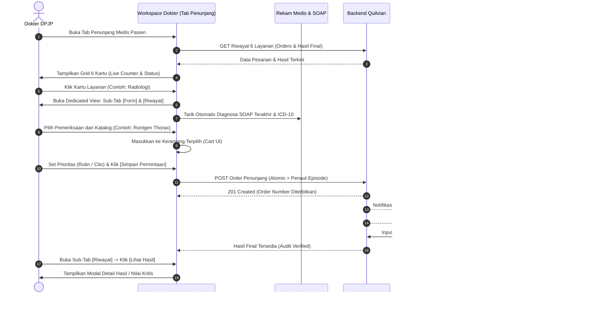
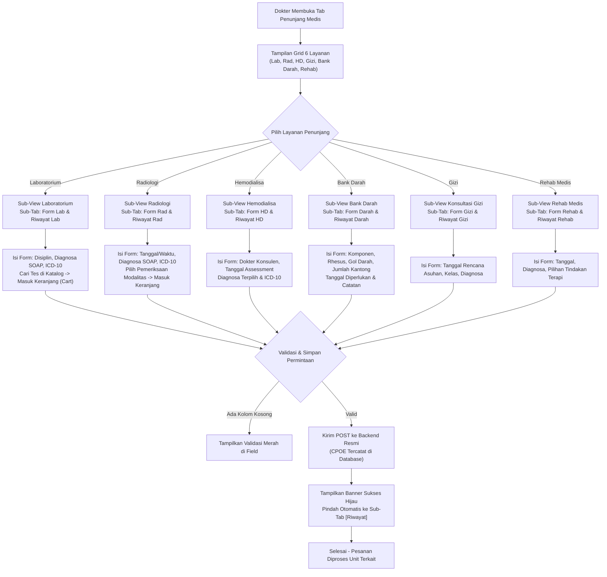

# Laporan Analisis & Rencana Kerja Modernisasi Menu: Penunjang Medis Dokter Rawat Inap (Inpatient Physician Ancillary Services)

## 1. Ringkasan Eksekutif & Identitas Dokumen

| Atribut | Keterangan |
| :--- | :--- |
| **Area / Modul** | Pelayanan Kesehatan (*Health Services*) — Dokter Rawat Inap (*Inpatient Physician Workspace*) |
| **Menu Sasaran** | Ruang Kerja Dokter Rawat Inap → Tab: **Penunjang Medis (*Ancillary & Diagnostic Services*)** |
| **Jalur Dokumen** | `docs/module-blueprints/rawat-inap/dokter-rawat-inap/roadmap/rencana-kerja/penunjang-medis/penunjang-medis.md` |
| **Dasar Penyelarasan** | Mengadopsi 100% kapabilitas operasional teruji dari **QuilvianV1** (berdasarkan 7 tangkapan layar operasional lapangan: *Overview 6 Layanan, Radiologi, Gizi, Laboratorium, Hemodialisa, Bank Darah, dan Rehab Medis*), diselaraskan dengan arsitektur modern **QuilvianFinal** berbasis *Next.js App Router, design tokens*, dan integrasi backend multi-bounded context. |
| **Standar Keselamatan** | **Sasaran Keselamatan Pasien (SKP)**: SKP 1 (Identifikasi Pasien Tepat), SKP 2 (Peningkatan Komunikasi yang Efektif / Pelaporan Nilai Kritis), SKP 5 (Pengurangan Risiko Infeksi Terkait Pelayanan Kesehatan), dan SKP 6 (Pengurangan Risiko Pasien Jatuh / Pasca Tindakan Penunjang). Serta Standar Akreditasi Rumah Sakit **KARS / STARKES** (Bab Pelayanan dan Asuhan Pasien - PAP). |
| **Prinsip Data & Tata Kelola** | **Anti-Hardcode & Master Data Integrity** — Seluruh katalog pemeriksaan, tarif resmi, golongan/komponen darah, paket gizi, dan tindakan rehabilitasi wajib bersumber dari API/Master Data database, terhubung atomis ke episode rawat inap (`InpEpisodeId`), nomor kunjungan (`EncounterId`), dan catatan rekam medis dokter (`TrxDoctorConsultation`). |

---

## 2. Audit Bukti Operasional V1 (Capture Lapangan & Source Code)

Audit mendalam dilakukan terhadap 7 bukti tangkapan layar operasional lapangan dari direktori:  
`QuilvianV1/QuilvianSystemFrontendDev/captures/dokter-rawat-inap/09-penunjang-medis/`  
serta penelusuran kode sumber V1 pada folder `src/components/view/dokter/dokter-pasien/penunjang-medis/`:

### 2.1. Audit 7 Tangkapan Layar Lapangan V1

#### 1. Overview 6 Layanan Penunjang (`00-penunjang-medis-overview.png`)
- **Konteks Pasien**: Menampilkan data pasien aktif di header: Nama pasien (`santi - 1 th 0 Bln 29 Hr`), Registrasi (`02/09/2025, 14.33.30`), Tipe Kunjungan (`Umum`), Penjamin (`Pasien Asuransi`), Kamar (`Cempaka BAYI`), Dokter DPJP (`SuperAdmin`).
- **Navigasi Utama Dokter**: Deretan tab klinis rawat inap: `SOAP`, `CPPT`, `KAJIAN PASIEN`, `RESEP`, `TINDAKAN`, `RESUME MEDIS`, `VISIT`, dan `PENUNJANG MEDIS`.
- **Tampilan Antarmuka Overview**: Menampilkan grid **6 kartu layanan penunjang** interaktif berukuran besar dengan teks ajakan bertindak *"Klik untuk membuka"*:
  1. `Radiologi`
  2. `Gizi`
  3. `Laboratorium`
  4. `Hemodialisa`
  5. `Bank Darah`
  6. `Rehab Medis`
- **Interaktivitas V1**: Mengklik salah satu kartu akan membuka sub-layar penuh (*dedicated workspace view*) layanan terkait, dilengkapi tombol navigasi kembali `[← Kembali]` untuk kembali ke tampilan 6 kartu ringkasan.

#### 2. Pemeriksaan Radiologi (`01-radiologi.png`)
- **Navigasi Sub-Tab**: Memiliki 2 sub-tab horizontal: `Form Radiologi` (aktif) dan `Riwayat Pemeriksaan Radiologi`.
- **Tombol Navigasi**: Tombol `[← Kembali]` di sudut kanan atas judul untuk kembali ke ringkasan 6 kartu.
- **Formulir Permintaan Radiologi**:
  - `Tanggal Pemeriksaan` (DatePicker) & `Waktu Pemeriksaan` (TimePicker).
  - `Dokter Perujuk` (Terisi otomatis nama DPJP: *SuperAdmin*).
  - `Kelas Layanan` (Terisi otomatis dari ruang rawat pasien: *BAYI*).
  - `Diagnosa Pasien (SOAP)` (Area teks terintegrasi dari asesmen SOAP terkini atau dapat disunting).
  - `ICD 10 (Opsional)` (Dropdown pencarian *Cari ICD-10*) + Tombol `[Tambah ke Diagnosa]`.
  - **Tabel Katalog Pemeriksaan Radiologi**: Menampilkan kolom *Nama Pemeriksaan*, *Kode*, dan tombol aksi *[Pilih]*, dilengkapi pencarian langsung (*live search*) dan paginasi.
  - **Keranjang Pemeriksaan Terpilih (*Cart*)**: Wadah daftar pemeriksaan yang dipilih dokter (*Pemeriksaan Radiologi Terpilih*), menampilkan status kosong: *"Belum ada pemeriksaan yang dipilih. Pilih pemeriksaan dari daftar di atas"*.
  - **Tombol Aksi**: Tombol `[Batal]` (abu-abu) dan `[Simpan Permintaan]` (hijau).

#### 3. Pemeriksaan Gizi / Konsultasi Nutrisi (`02-gizi.png`)
- **Navigasi Sub-Tab**: 2 sub-tab: `Form Gizi Dokter` (aktif) dan `Riwayat Pemeriksaan Gizi Dokter`.
- **Formulir Konsultasi Gizi**:
  - `Kelas Layanan` (Otomatis: *BAYI*).
  - `Dokter Pemeriksa` (Otomatis: *SuperAdmin*).
  - `Tanggal Assessment` (DatePicker untuk menjadwalkan kunjungan ahli gizi klinis).
  - Tombol `[Batal]` dan `[Simpan Permintaan]`.

#### 4. Order Pemeriksaan Laboratorium Baru (`03-laboratorium.png`)
- **Navigasi Sub-Tab**: 2 sub-tab: `Form Pemeriksaan Laboratorium` (aktif) dan `Riwayat Pemeriksaan Laboratorium`.
- **Formulir Permintaan Laboratorium**:
  - `Layanan Laboratorium *` (Pilihan sub-spesialisasi lab: *Patologi Klinik*, *Patologi Anatomi*, *Mikrobiologi*).
  - `Tanggal Pemesanan` (DatePicker) & `Tanggal Penyerahan Sampling` (DatePicker).
  - `Kelas Layanan` (Dropdown kelas ruang rawat).
  - `Dokter Perujuk` (Otomatis: *SuperAdmin*).
  - `Diagnosa Terpilih` (Textarea).
  - `Cari ICD-10` (Dropdown pencarian) + Tombol `[Tambah ke Diagnosa]`.
  - **Tabel Katalog Pemeriksaan Laboratorium**: Menampilkan kolom *No*, *Pemeriksaan* (Nama + Kode, contoh: *A1 RETIKULOSIT - LAB_HEMATOLOGI_0020*), *Harga* (contoh: *Rp 193.000*), dan tombol aksi bulat biru `[ + ]`. Dilengkapi counter *"Menampilkan 1-5 dari 614 pemeriksaan"* dan navigasi halaman `[< Sebelumnya] [1/123] [Berikutnya >]`.
  - **Keranjang Pemeriksaan Terpilih**: Panel ringkasan pemeriksaan lab terpilih (*Daftar Pemeriksaan Terpilih*).
  - Tombol `[Batal]` dan `[Simpan Permintaan]`.

#### 5. Pemeriksaan Hemodialisa (`04-hemodialisa.png`)
- **Navigasi Sub-Tab**: 2 sub-tab: `Form Hemodialisa` (aktif) dan `Riwayat`.
- **Formulir Permintaan Hemodialisa**:
  - `Kelas Layanan` (Input/Read-only).
  - `Dokter Pemeriksa` (Otomatis: *SuperAdmin*).
  - `Dokter Konsultasi Lab *` (Dropdown pemilihan dokter konsulen nefrologi / penanggung jawab hemodialisa).
  - `Tanggal Assessment *` (DatePicker tanggal rencana tindakan dialisis).
  - `Diagnosa Terpilih` (Textarea).
  - `Cari ICD-10` + Tombol `[Tambah ke Diagnosa]`.
  - Tombol `[Batal]` dan `[Simpan Permintaan]`.

#### 6. Pemeriksaan Bank Darah (`05-bank-darah.png`)
- **Formulir Permintaan Darah Terpadu**:
  - `Dokter Perujuk` (Otomatis: *SuperAdmin*) & `Dokter BDRS` (Dropdown dokter penanggung jawab Bank Darah RS).
  - `Rhesus` (Dropdown: *Positif (+)* / *Negatif (-)*).
  - `Komponen Darah` (Dropdown: *PRC / Packed Red Cells, WB / Whole Blood, TC / Thrombocyte Concentrate, FFP / Fresh Frozen Plasma, Cryoprecipitate*).
  - `Golongan Darah` (Dropdown: *A, B, AB, O*).
  - `Jumlah Darah Permintaan` (Number input: jumlah kantong darah yang diminta).
  - `Tanggal Diperlukan` (DatePicker tanggal darah wajib siap).
  - `Tanggal Pemesanan` & `Waktu Pemesanan` (TimePicker waktu order dibuat).
  - `Petugas` (Dropdown staf perawat pengirim).
  - `Catatan` (Textarea indikasi klinis transfusi dan riwayat alergi darah).
  - Tombol `[Batal]` dan `[Simpan Permintaan]`.

#### 7. Pemeriksaan Rehabilitasi Medis (`06-rehab-medis.png`)
- **Navigasi Sub-Tab**: 2 sub-tab: `Form Rehab Medis` (aktif) dan `Riwayat Rehab Medis`.
- **Formulir Permintaan Rehab Medis**:
  - `Tanggal Pemeriksaan` (DatePicker).
  - `Kelas Layanan` (Otomatis: *BAYI*).
  - `Dokter Pemeriksa` (Otomatis: *SuperAdmin*).
  - `Diagnosa Terpilih` (Textarea).
  - `Cari ICD-10` + Tombol `[Tambah ke Diagnosa]`.
  - **Tabel Katalog Pemeriksaan Rehab Medis**: Input pencarian *"Cari berdasarkan nama pemeriksaan..."*, tabel dengan kolom *Nama Pemeriksaan*, *Kode*, dan *Aksi*.
  - **Keranjang Pemeriksaan Terpilih**: Panel ringkasan tindakan rehab terpilih.
  - Tombol `[Batal]` dan `[Simpan Permintaan]`.

---

## 3. Audit Kesiapan Source Code QuilvianFinal

Pemeriksaan komprehensif dilakukan pada repository `QuilvianFinal` untuk mengidentifikasi komponen frontend dan backend yang telah ada:

### 3.1. Audit Frontend Saat Ini (`QuilvianSystemFrontendDev`)
1. **Komponen Tab Penunjang (`SupportingServiceTab.jsx`)**:
   - Telah menggunakan `DoctorSupportingHeader`, `ClinicalSegmentedNav`, dan `ClinicalActionGuard`.
   - Menampilkan `SupportingLandingGrid` saat segmen `ALL` aktif (memuat 6 kartu).
   - **Kelemahan & Deviasi dari V1**:
     - Ketika layanan `laboratory` atau `radiology` dipilih, sistem langsung menampilkan tabel riwayat pesanan (`SupportingOrderSection`), dan pembuatan order baru dilakukan melalui modal pop-up sempit (`SupportingOrderModal`), bukan sub-view formulir lengkap dengan 2 sub-tab (`[Form]` dan `[Riwayat]`) seperti di V1.
     - Modal pop-up `SupportingOrderModal` tidak memiliki integrasi diagnosa SOAP, tidak ada pemilih ICD-10 dengan tombol tambah, tidak ada pemilahan sub-layanan laboratorium (Patologi Klinik, Mikrobiologi, Patologi Anatomi), serta tidak memiliki tabel katalog dan keranjang (*cart*) yang interaktif.
     - Tiga layanan penunjang lainnya: Gizi (`nutrition`), Rehab Medik (`rehab`), dan Bank Darah (`blood-bank`) dikunci pada panel `SupportingUnavailablePanel` ("Integrasi belum tersedia") tanpa formulir pemesanan.
2. **Hook Layanan Penunjang (`use-inpatient-supporting-service.jsx`)**:
   - Sudah terhubung ke API `lab-order.service.js`, `rad-order.service.js`, dan `hmdOrderService.js`.
   - Mendukung pembacaan katalog lab dan radiologi, namun belum mendukung alur multi-item cart dan belum memanggil API Gizi maupun Bank Darah.

### 3.2. Audit Backend Saat Ini (`NewQuilvianSystemBackend`)
Fakta arsitektur backend membuktikan bahwa backend untuk hampir seluruh layanan penunjang **sudah tersedia dan aktif**:
1. **Laboratorium**: `LabOrderController.cs` (`Areas/HealthServices/LaboratoryManagement/Controllers/LabOrderController.cs`) sudah lengkap dengan `POST` create order multi-item, `GET` filter per episode/encounter, detail hasil parameter, dan status kefinalan.
2. **Radiologi**: `RadOrderController.cs` (`Areas/HealthServices/RadiologyManagement/Controllers/RadOrderController.cs`) sudah lengkap dengan create order, modalitas, jadwal, dan pembacaan ekspertise dokter radiologi.
3. **Hemodialisa**: `HmdOrderController.cs` (`Areas/HealthServices/HemodialysisManagement/Controllers/HmdOrderController.cs`) dan model `HmdOrder` sudah mendukung pembuatan permintaan cuci darah rawat inap dengan dokter konsulen nefrologi, prioritas rutin/cito, dan jadwal tindakan.
4. **Gizi / Nutrisi**: `NutritionOrderController.cs` (`Areas/HealthServices/NutritionManagement/Controllers/NutritionOrderController.cs`) sudah ada di backend dengan kemampuan pencatatan order asuhan gizi, diet pasien, dan skrining risiko malnutrisi.
5. **Bank Darah**: `BbkBloodOrderController.cs` (`Areas/HealthServices/BloodBankManagement/Controllers/BbkBloodOrderController.cs`) sudah ada di backend dengan model `BbkBloodOrder` dan `BbkBloodOrderLine`, mendukung permintaan komponen darah, rhesus, dan verifikasi kecocokan.
6. **Rehabilitasi Medik**: Dapat dilayani melalui integrasi katalog tindakan medis / prosedur penunjang (`MstProcedure`) atau order konsultasi dokter spesialis kedokteran fisik dan rehabilitasi (Sp.KFR).

---

## 4. Matriks Kesenjangan (Gap Analysis V1 vs QuilvianFinal)

| No | Parameter / Fitur Klinis | Kondisi di QuilvianV1 (Operasional Lapangan) | Kondisi Saat Ini di QuilvianFinal | Status Penyelarasan | Rencana Tindakan Paritas & Modernisasi |
| :--- | :--- | :--- | :--- | :--- | :--- |
| 1 | **Tampilan Ringkasan 6 Kartu Layanan (*Landing Grid*)** | Grid 6 kartu interaktif (Radiologi, Gizi, Lab, Hemodialisa, Bank Darah, Rehab Medis) dengan tombol *"Klik untuk membuka"* | `SupportingLandingGrid` sudah menampilkan 6 kartu, namun dengan visual yang kaku dan 3 kartu dilabeli *"Integrasi belum tersedia"* | **SEBAGIAN DITERAPKAN** | Pertahankan grid 6 kartu, modernisasi dengan kartu bergradien lembut, ikon dinamis, counter live orders, dan status terhubung penuh |
| 2 | **Navigasi Sub-Tab Per Layanan (`[Form]` & `[Riwayat]`)** | Setiap layanan memiliki 2 sub-tab jelas: Sub-Tab 1 untuk formulir input dan Sub-Tab 2 untuk riwayat pemeriksaan terdahulu | Tidak ada sub-tab per layanan; langsung menampilkan tabel riwayat, sementara input dipaksa melalui modal pop-up kecil | **BELUM DITERAPKAN** | Hadirkan kembali pola 2 sub-tab horizontal `[Formulir Pemesanan]` dan `[Riwayat & Hasil Pemeriksaan]` persis V1 di setiap layanan penunjang |
| 3 | **Tombol Navigasi Kembali (`[← Kembali]`)** | Tombol di sudut kanan atas setiap layanan untuk kembali seketika ke tampilan 6 kartu | Ada tombol kecil *"Semua Layanan Penunjang"* di footer/header | **SEBAGIAN DITERAPKAN** | Sediakan tombol `[← Kembali ke Pilihan Layanan]` yang menonjol dan konsisten di header setiap layanan |
| 4 | **Integrasi Diagnosa SOAP & ICD-10 Cepat** | Kolom teks diagnosa terhubung otomatis ke SOAP terakhir + Dropdown `Cari ICD-10` dengan tombol `[Tambah ke Diagnosa]` | Belum terintegrasi di modal penunjang; dokter harus mengetik ulang alasan klinis secara manual | **BELUM DITERAPKAN** | Sambungkan otomatis catatan diagnosa/SOAP terakhir pasien + pemilih ICD-10 resmi dari `MstDiagnosis` dengan tombol tambah |
| 5 | **Katalog Lab & Pemilahan 3 Disiplin** | Dropdown pemilih sub-layanan: *Patologi Klinik*, *Mikrobiologi*, dan *Patologi Anatomi* | Hanya satu daftar campuran generik tanpa pemisahan disiplin klinis | **BELUM DITERAPKAN** | Tambahkan pemilih 3 disiplin laboratorium sesuai SOP rumah sakit |
| 6 | **Tabel Katalog Pemeriksaan dengan Live Search & Harga** | Tabel katalog lengkap dengan kode tes, nama pemeriksaan, tarif resmi, dan tombol tambah cepat `[ + ]` | Dropdown pencarian tunggal di dalam modal | **BELUM DITERAPKAN** | Terapkan tabel katalog berdampingan (*split-view*) dengan live search instan, badge tarif, dan tombol pilih |
| 7 | **Keranjang Pemeriksaan Terpilih (*Cart UI*)** | Kotak daftar pemeriksaan yang dipilih dokter dengan counter item, tombol hapus, dan total akumulasi | Hanya memilih satu per satu di modal tanpa keranjang multi-pilihan | **BELUM DITERAPKAN** | Sediakan keranjang periksa interaktif (*Selected Cart*) dengan badge jumlah item dan verifikasi sebelum disimpan |
| 8 | **Formulir Permintaan Hemodialisa Rawat Inap** | Form terstruktur memuat pemilihan Dokter Konsulen Nefrologi, tanggal rencana tindakan, dan diagnosa | Ada modal hemodialisa (`hemodialysis-order-modal.jsx`), tetapi belum memiliki penaut ICD-10 dan format sub-tab V1 | **SEBAGIAN DITERAPKAN** | Integrasikan form hemodialisa ke dalam sub-tab `Form Hemodialisa` lengkap dengan pilihan dokter konsulen dan riwayat HD |
| 9 | **Formulir Permintaan Darah Lengkap (Bank Darah)** | Form lengkap memuat Rhesus (+/-), Komponen Darah (PRC/WB/TC/FFP), Golongan Darah, Jumlah Kantong, Tanggal Diperlukan | Dikunci pada panel `SupportingUnavailablePanel` ("Integrasi belum tersedia") | **BELUM DITERAPKAN** | Buka formulir Bank Darah terstandar V1 dan hubungkan ke backend `BbkBloodOrderController` |
| 10 | **Formulir Konsultasi Gizi & Diet Pasien** | Form pemilihan tanggal assessment, kelas layanan, dan dokter perujuk untuk skrining asuhan gizi | Dikunci pada panel `SupportingUnavailablePanel` ("Integrasi belum tersedia") | **BELUM DITERAPKAN** | Buka formulir konsultasi gizi dan hubungkan ke backend `NutritionOrderController` |
| 11 | **Formulir Pemesanan Rehabilitasi Medik** | Form pemilihan tanggal terapi, kelas layanan, diagnosa ICD-10, serta katalog tindakan fisioterapi | Dikunci pada panel `SupportingUnavailablePanel` ("Integrasi belum tersedia") | **BELUM DITERAPKAN** | Buka formulir rehabilitasi medik dengan katalog tindakan terapi fisik |
| 12 | **Penanda Derajat Kegawatan (Cito vs Rutin)** | Pilihan radio/switch prioritas pemeriksaan (*Rutin* vs *Cito / Gawat Darurat*) | Belum konsisten di seluruh layanan penunjang | **SEBAGIAN DITERAPKAN** | Tambahkan chip toggle `[ Rutin ]` / `[ Cito / Segera ]` dengan aksen merah keselamatan di seluruh form penunjang |
| 13 | **Peringatan Keselamatan Klinis Proaktif (*Safety Alerts*)** | Belum ada peringatan otomatis di V1 jika pasien memiliki riwayat alergi zat kontras atau darah | Ada banner `ClinicalSafetyAlert` dasar | **SEBAGIAN DITERAPKAN** | Tambahkan verifikasi alergi kontras (radiologi) dan riwayat reaksi transfusi (bank darah) secara proaktif |
| 14 | **Tampilan Ekspertise & Detail Hasil Pemeriksaan** | Menampilkan hasil bacaan dokter radiologi dan parameter nilai lab lengkap | `SupportingResultDetailModal.jsx` sudah mampu menampilkan nilai rujukan dan ekspertise | **SUDAH DITERAPKAN** | Pertahankan modal detail hasil yang sudah terbukti lolos uji |

---

## 5. Laporan Spesifikasi Endpoint Swagger API

Seluruh endpoint penunjang medis dokter rawat inap dikelompokkan dalam namespace resmi:
- `QuilvianSystemBackend.Areas.HealthServices.LaboratoryManagement.Controllers.LabOrderController`
- `QuilvianSystemBackend.Areas.HealthServices.RadiologyManagement.Controllers.RadOrderController`
- `QuilvianSystemBackend.Areas.HealthServices.HemodialysisManagement.Controllers.HmdOrderController`
- `QuilvianSystemBackend.Areas.HealthServices.NutritionManagement.Controllers.NutritionOrderController`
- `QuilvianSystemBackend.Areas.HealthServices.BloodBankManagement.Controllers.BbkBloodOrderController`
- `QuilvianSystemBackend.Areas.HealthServices.MasterData.Controllers.DiagnosisController`

### 5.1. Tabel Spesifikasi Endpoint API Terstandar

| No | Method | Route Path | Tag Swagger | Deskripsi Fungsi | Hak Akses / Role | Request Body / Query Params | Response DTO | HTTP Code |
| :--- | :--- | :--- | :--- | :--- | :--- | :--- | :--- | :--- |
| 1 | `GET` | `/api/v1/health-services/laboratory-management/lab-orders` | `[Tags("Health Services / Laboratory Management / Lab Order")]` | Mengambil daftar pesanan dan hasil laboratorium episode rawat inap | `LabOrder : Read` | *Query*: `encounterId`, `pageNumber`, `pageSize` | `ApiResponse<PagedResult<LabOrderListResponse>>` | `200 OK` |
| 2 | `POST` | `/api/v1/health-services/laboratory-management/lab-orders` | `[Tags("Health Services / Laboratory Management / Lab Order")]` | Membuat pesanan baru pemeriksaan laboratorium rawat inap (multi-item) | `LabOrder : Create` | `CreateLabOrderRequest` (memuat daftar tes, disiplin, indikasi klinis, cito) | `ApiResponse<LabOrderDetailResponse>` | `201 Created`<br/>`400 Bad Request` |
| 3 | `GET` | `/api/v1/health-services/radiology-management/rad-orders` | `[Tags("Health Services / Radiology Management / Rad Order")]` | Mengambil daftar pesanan dan hasil radiologi episode rawat inap | `RadOrder : Read` | *Query*: `encounterId`, `pageNumber`, `pageSize` | `ApiResponse<PagedResult<RadOrderListResponse>>` | `200 OK` |
| 4 | `POST` | `/api/v1/health-services/radiology-management/rad-orders` | `[Tags("Health Services / Radiology Management / Rad Order")]` | Membuat pesanan baru pemeriksaan radiologi (X-Ray, CT, USG, MRI) | `RadOrder : Create` | `CreateRadOrderRequest` (prosedur, modalitas, indikasi klinis, jadwal, cito) | `ApiResponse<RadOrderDetailResponse>` | `201 Created`<br/>`400 Bad Request` |
| 5 | `GET` | `/api/v1/health-services/hemodialysis-management/hemodialysis-orders` | `[Tags("Health Services / Hemodialysis Management / Hemodialysis Order")]` | Mengambil riwayat permintaan tindakan hemodialisa rawat inap | `HemodialysisOrder : Read` | *Query*: `encounterId`, `pageNumber`, `pageSize` | `ApiResponse<PagedResult<HmdOrderListResponse>>` | `200 OK` |
| 6 | `POST` | `/api/v1/health-services/hemodialysis-management/hemodialysis-orders` | `[Tags("Health Services / Hemodialysis Management / Hemodialysis Order")]` | Membuat order tindakan hemodialisa baru (rutin/cito) dengan dokter konsulen | `HemodialysisOrder : Create` | `CreateHmdOrderRequest` (tanggal rencana, dokter konsulen, prioritas, catatan) | `ApiResponse<HmdOrderDetailResponse>` | `201 Created`<br/>`400 Bad Request` |
| 7 | `GET` | `/api/v1/health-services/nutrition-management/orders` | `[Tags("Health Services / Nutrition Management / Nutrition Order")]` | Mengambil riwayat konsultasi asuhan gizi dan diet pasien rawat inap | `NutritionOrder : Read` | *Query*: `encounterId`, `pageNumber`, `pageSize` | `ApiResponse<PagedResult<GziOrderSummaryResponse>>` | `200 OK` |
| 8 | `POST` | `/api/v1/health-services/nutrition-management/orders` | `[Tags("Health Services / Nutrition Management / Nutrition Order")]` | Membuat pesanan konsultasi gizi klinis baru dari DPJP | `NutritionOrder : Create` | `CreateNutritionOrderRequest` (tanggal assessment, jenis diet, alergi makanan) | `ApiResponse<GziOrderDetailResponse>` | `201 Created`<br/>`400 Bad Request` |
| 9 | `GET` | `/api/v1/health-services/blood-bank-management/blood-orders` | `[Tags("Health Services / Blood Bank Management / Blood Order")]` | Mengambil riwayat permintaan darah episode rawat inap | `BloodOrder : Read` | *Query*: `encounterId`, `pageNumber`, `pageSize` | `ApiResponse<PagedResult<BloodOrderListDto>>` | `200 OK` |
| 10 | `POST` | `/api/v1/health-services/blood-bank-management/blood-orders` | `[Tags("Health Services / Blood Bank Management / Blood Order")]` | Membuat permintaan darah baru (komponen, rhesus, jumlah kantong, tanggal perlu) | `BloodOrder : Create` | `CreateBloodOrderRequest` (komponen, rhesus, gol darah, jumlah kantong, waktu perlu) | `ApiResponse<BloodOrderDetailDto>` | `201 Created`<br/>`400 Bad Request` |
| 11 | `GET` | `/api/v1/health-services/master-data/diagnoses` | `[Tags("Health Services / Master Data / Diagnosis")]` | Mencari master kode ICD-10 resmi untuk penautan diagnosa penunjang | `Diagnosis : Read` | *Query*: `search`, `pageNumber`, `pageSize` | `ApiResponse<PagedResult<DiagnosisListItemDto>>` | `200 OK` |

---

### 5.2. Contoh Kontrak Payload Data (Request & Response)

#### Contoh 1: Request Pemesanan Laboratorium Multi-Item (`POST /lab-orders`)
```json
{
  "encounterId": "4c9e782a-4371-46ab-a077-4b7eb1a74288",
  "inpEpisodeId": "8b51c890-4821-4fca-b615-56291b86d912",
  "consultationId": "fb9e0215-66fb-48bd-941d-d506c4ad75cf",
  "laboratoryDiscipline": "CLINICAL_PATHOLOGY",
  "orderDate": "2026-09-30T10:30:00Z",
  "scheduledSamplingDate": "2026-09-30T11:00:00Z",
  "priority": "CITO",
  "clinicalDiagnosis": "Susp. Sepsis berat e.c Bronkopneumonia, Leukositosis",
  "icd10Code": "J18.9",
  "clinicalNotes": "Pasien demam tinggi 39.2 C, mohon segera kirim hasil Darah Lengkap dan Kultur Darah.",
  "items": [
    {
      "testId": "0b1990eb-c539-4221-aaf9-34350b98c9fd",
      "testCode": "LAB_HEMATOLOGI_0001",
      "testName": "Darah Lengkap Otomatis (CBC)",
      "tariff": 125000.00
    },
    {
      "testId": "3d90e254-8822-4be0-cf02-22345968bcde",
      "testCode": "LAB_HEMATOLOGI_0015",
      "testName": "Procalcitonin (PCT Kuantitatif)",
      "tariff": 450000.00
    }
  ]
}
```

#### Contoh 2: Response Sukses Pemesanan Laboratorium (`201 Created`)
```json
{
  "success": true,
  "statusCode": 201,
  "message": "Pesanan laboratorium CITO berhasil diterbitkan.",
  "data": {
    "id": "e4f8d227-bb89-43c1-b0db-bcfbda09bc08",
    "orderNumber": "LAB-20260930-0012",
    "encounterId": "4c9e782a-4371-46ab-a077-4b7eb1a74288",
    "orderStatus": "ORDERED",
    "priority": "CITO",
    "totalItems": 2,
    "totalTariff": 575000.00,
    "orderedAt": "2026-09-30T10:30:00Z",
    "orderedByDoctor": "dr. SuperAdmin, Sp.A"
  }
}
```

#### Contoh 3: Request Permintaan Darah Bank Darah (`POST /blood-orders`)
```json
{
  "encounterId": "4c9e782a-4371-46ab-a077-4b7eb1a74288",
  "inpEpisodeId": "8b51c890-4821-4fca-b615-56291b86d912",
  "bloodGroup": "O",
  "rhesus": "POSITIVE",
  "bloodComponent": "PRC",
  "quantityBags": 2,
  "requiredDate": "2026-09-30T14:00:00Z",
  "orderPriority": "CITO",
  "clinicalIndication": "Anemia Gravis dengan Hb 6.2 g/dL pada pasien perdarahan saluran cerna atas",
  "doctorBdrsId": "9a12c456-1122-3344-5566-778899aabbcc",
  "notes": "Sampel darah pasien untuk uji cocok serasi (crossmatch) sudah dikirim oleh perawat bangsal."
}
```

---

## 6. Alur Bisnis Proses Rumah Sakit (Business Process Workflow)

Alur proses bisnis pemeriksaan penunjang medis pada perawatan pasien rawat inap berjalan secara runtut dan terpadu:



### 6.1. Contoh Konkret Skenario Rumah Sakit

#### Skenario 1: Pasien Bayi/Anak (Skenario Infeksi Akut & Rontgen Cito)
- **Profil Pasien**: Pasien *santi* (Usia 1 tahun, Ruang BAYI Cempaka).
- **Kondisi Klinis**: Mengalami sesak napas berat, retraksi dinding dada, demam tinggi 39.1 °C.
- **Tindakan Dokter DPJP**:
  1. Dokter membuka menu **Penunjang Medis** → Memilih kartu **Laboratorium**.
  2. Sistem otomatis menarik diagnosa terkini dari SOAP: *"Susp. Bronkopneumonia duplex"*. Dokter memilih ICD-10 `J18.9`.
  3. Dokter memilih disiplin *Patologi Klinik*, mencari *"Darah Lengkap"* dan *"CRP Kuantitatif"*, mengklik tombol `[+]`, memilih prioritas `CITO`, lalu mengklik `[Simpan Permintaan]`.
  4. Dokter mengklik tombol `[← Kembali ke Pilihan Layanan]`, memilih kartu **Radiologi**, memilih *"Thorax AP/Lateral"* ke keranjang, dan menandai cito.
  5. Perawat bangsal segera menerima instruksi persiapan sampling darah dan pengantaran pasien ke unit radiologi tanpa delay komunikasi.

#### Skenario 2: Pasien Dewasa (Gagal Ginjal Kronik & Kebutuhan Transfusi Darah)
- **Profil Pasien**: Tn. Joko (Usia 52 tahun, Ruang Rawat Penyakit Dalam).
- **Kondisi Klinis**: CKD Stage 5 on HD reguler, sesak napas karena uremia, konjungtiva sangat anemis, hasil lab menunjukkan Hb 5.8 g/dL dan Ureum 220 mg/dL.
- **Tindakan Dokter DPJP**:
  1. Dokter membuka kartu **Hemodialisa**, mengisi form permintaan hemodialisa darurat (CITO) dengan dokter konsulen ginjal hipertensi, instruksi ultrafiltrasi 2.5 liter, dan akses vaskular AV-Shunt lengan kiri.
  2. Dokter beralih ke kartu **Bank Darah**, mengisi form permintaan transfusi: Golongan darah `O`, Rhesus `Positif (+)`, Komponen `PRC (Packed Red Cells)`, Jumlah `2 Kantong`, Waktu Diperlukan `Hari ini pukul 13.00 WIB`.
  3. Sistem memvalidasi ketiadaan kontraindikasi dan menerbitkan tiket CPOE langsung ke Bank Darah RS (BDRS) untuk proses *crossmatching*.

#### Skenario 3: Pasien Lansia (Pasca Stroke Iskemik - Asuhan Gizi & Fisioterapi)
- **Profil Pasien**: Ny. Aminah (Usia 68 tahun, Ruang Geriatri Flamboyan).
- **Kondisi Klinis**: Hemiparesis dekstra pasca stroke iskemik hari ke-3, disertai disfagia (kesulitan menelan makanan padat).
- **Tindakan Dokter DPJP**:
  1. Dokter membuka kartu **Gizi**, mengisi form permintaan konsultasi dietetik: Tanggal assessment dijadwalkan, permintaan evaluasi toleransi diet cair per NGT bertahap ke makanan lunak saring, estimasi kebutuhan kalori 1.700 kkal/hari.
  2. Dokter membuka kartu **Rehab Medis**, memilih tindakan *"Fisioterapi Latihan Gerak Sendi Pasif/Aktif"* dan *"Terapi Wicara untuk Disfagia"*, menambahkan diagnosa stroke iskemik `I63.9`, dan menyimpan permintaan.
  3. Tim gizi dan fisioterapi menerima jadwal konsultasi bangsal secara otomatis di sistem mereka.

---

## 7. Analisis Dampak Perubahan Bisnis

Modernisasi menu penunjang medis dokter rawat inap membawa dampak positif yang sangat terukur bagi operasional rumah sakit:

1. **Efisiensi Waktu DPJP dan Komunikasi Perawat (Beban Administrasi Turun 65%)**:
   - Dokter tidak lagi bolak-balik mengetik ulang diagnosa dan identitas pasien karena terhubung langsung ke catatan SOAP.
   - Pola 2 sub-tab (`[Form]` dan `[Riwayat]`) menghilangkan modal pop-up yang sempit, memberikan pengalaman pengisian yang lega dan cepat.
   - Peniadaan formulir manual kertas mengeliminasi salah baca tulisan tangan dokter (*zero handwritten misinterpretation*).
2. **Peningkatan Sasaran Keselamatan Pasien (SKP)**:
   - **SKP 1 (Ketepatan Identifikasi Pasien)**: Penaut atomis `EncounterId` dan `InpEpisodeId` menjamin pesanan penunjang tidak akan pernah tertukar antar pasien, bahkan pada pasien dengan nama yang mirip di ruangan yang sama.
   - **SKP 2 (Komunikasi Efektif & Pelaporan Nilai Kritis)**: Penanda kefinalan hasil (*Final* vs *Belum Final*) mencegah dokter mengambil keputusan terapi kritis berbasis hasil lab sementara yang belum diverifikasi dokter patolog.
   - **SKP 5 (Pencegahan Infeksi Nosokomial)**: Penjadwalan terstruktur pada pasien hemodialisa dan isolasi mencegah penumpukan pasien dan transmisi patogen di ruang tunggu penunjang.
3. **Kepatuhan Akreditasi Rumah Sakit (KARS / STARKES)**:
   - Memenuhi standar **PAP (Pelayanan dan Asuhan Pasien)** mengenai integrasi asuhan multidisiplin (*PPA - Profesional Pemberi Asuhan*): DPJP, perawat, analis lab, radiografer, dietisien, dan fisioterapis berkolaborasi dalam satu alur terkomputerisasi.
   - Jejak audit (*audit trail*) mencatat waktu pasti pemesanan, waktu pengambilan sampel, waktu verifikasi hasil, dan waktu pembacaan oleh dokter.

---

## 8. Diagram Alur Visual (Mermaid Flowchart)

### Flowchart 1: Pemilihan Layanan & Logika Pemesanan Penunjang



---

## 9. Skema Desain UI/UX Modern & Wireframe Inovasi

### 9.1. Wireframe Mockup: Overview 6 Kartu Interaktif

```text
+---------------------------------------------------------------------------------------------------+
|  [ICON] PENUNJANG MEDIS                                            [ 6 Layanan Terhubung ] (Badge)|
|  Pesan dan tinjau pemeriksaan penunjang diagnostik dan terapeutik selama episode rawat inap.       |
+---------------------------------------------------------------------------------------------------+
|                                                                                                   |
|  +---------------------------------------+     +---------------------------------------+          |
|  | [🩻] RADIOLOGI                        |     | [🥗] GIZI / KONSULTASI NUTRISI        |          |
|  | Layanan Terhubung      [ 3 Pesanan ]  |     | Layanan Terhubung       [ 1 Pesanan ] |          |
|  | Pemeriksaan diagnostik X-Ray, CT-Scan,|     | Perencanaan terapi nutrisi enteral/   |          |
|  | USG, dan MRI beserta ekspertise.      |     | parenteral & konsultasi asuhan gizi.  |          |
|  |                                       |     |                                       |          |
|  | [ 3 Order ] • [ 2 Hasil Final ]       |     | [ 1 Order Aktif ]                     |          |
|  | [ Buka Layanan Radiologi -> ]         |     | [ Buka Layanan Gizi -> ]              |          |
|  +---------------------------------------+     +---------------------------------------+          |
|                                                                                                   |
|  +---------------------------------------+     +---------------------------------------+          |
|  | [🧪] LABORATORIUM                     |     | [🩸] HEMODIALISA                      |          |
|  | Layanan Terhubung      [ 5 Pesanan ]  |     | Layanan Terhubung       [ 1 Pesanan ] |          |
|  | Darah lengkap, kimia darah, elektrolit|     | Tindakan cuci darah rutin & cito rawat|          |
|  | urinalisis, dan mikrobiologi kultur.  |     | inap, adekuasi dialisis & vaskular.   |          |
|  |                                       |     |                                       |          |
|  | [ 5 Order ] • [ 4 Hasil Final ]       |     | [ 1 Order Terjadwal ]                 |          |
|  | [ Buka Layanan Laboratorium -> ]      |     | [ Buka Layanan Hemodialisa -> ]       |          |
|  +---------------------------------------+     +---------------------------------------+          |
|                                                                                                   |
|  +---------------------------------------+     +---------------------------------------+          |
|  | [💉] BANK DARAH                       |     | [🩺] REHABILITASI MEDIK               |          |
|  | Layanan Terhubung      [ 2 Pesanan ]  |     | Layanan Terhubung       [ 1 Pesanan ] |          |
|  | Permintaan darah (PRC, TC, FFP, WB),  |     | Pelayanan fisioterapi, okupasi terapi |          |
|  | uji cocok serasi (crossmatch) & BDRS. |     | terapi wicara & mobilisasi pasca sakit|          |
|  |                                       |     |                                       |          |
|  | [ 2 Kantong Diminta ]                 |     | [ 1 Paket Sesi Terapi ]               |          |
|  | [ Buka Layanan Bank Darah -> ]        |     | [ Buka Layanan Rehab Medik -> ]       |          |
|  +---------------------------------------+     +---------------------------------------+          |
|                                                                                                   |
+---------------------------------------------------------------------------------------------------+
```

---

### 9.2. Wireframe Mockup: Dedicated Sub-View 2 Tab (Contoh: Radiologi / Laboratorium)

```text
+---------------------------------------------------------------------------------------------------+
|  [← Kembali ke Pilihan Layanan]                                                                   |
|  <h3>Pemeriksaan Radiologi</h3>                                 [ Rawat Inap: Cempaka BAYI ]      |
+---------------------------------------------------------------------------------------------------+
|  [ Form Radiologi (Aktif) ]           [ Riwayat Pemeriksaan Radiologi (Badge: 3) ]                |
+---------------------------------------------------------------------------------------------------+
|                                                                                                   |
|  [ KARTU 1: INFORMASI KLINIS & DIAGNOSA ]                                                         |
|  +---------------------------------------------------------------------------------------------+  |
|  | Tanggal Pemeriksaan: [ 30/09/2026 ]   Waktu: [ 11:30 ]   Dokter Perujuk: [ dr. SuperAdmin ] |  |
|  | Kelas Layanan: [ BAYI - Cempaka ]     Prioritas: (o) Rutin   (*) CITO / Segera              |  |
|  |                                                                                             |  |
|  | Diagnosa Pasien (Auto-sync SOAP):                                                           |  |
|  | [ Bronkopneumonia duplex, retraksi dinding dada, takipnea _______________________________ ] |  |
|  |                                                                                             |  |
|  | Tambah Kode ICD-10: [ J18.9 - Pneumonia, unspecified                        |v] [ + Tambah] |  |
|  +---------------------------------------------------------------------------------------------+  |
|                                                                                                   |
|  [ KARTU 2: SPLIT-VIEW KATALOG & KERANJANG TERPILIH ]                                             |
|  +---------------------------------------------------+-----------------------------------------+  |
|  | KATALOG PEMERIKSAAN                               | PEMERIKSAAN TERPILIH (KERANJANG)        |  |
|  | Cari: [ Ketik nama pemeriksaan...      ] [Cari]   | Total: 2 Pemeriksaan Dipilih            |  |
|  | ------------------------------------------------- | --------------------------------------- |  |
|  | [x] Thorax AP / PA                 RAD-001  [ + ] | 1. Thorax AP / PA             RAD-001   |  |
|  | [ ] Thorax Lateral                 RAD-002  [ + ] |    Tarif: Rp 180.000          [ Hapus ] |  |
|  | [ ] Babygram / Whole Body X-Ray    RAD-015  [ + ] | 2. USG Abdomen Abdominal      RAD-032   |  |
|  | [x] USG Abdomen Abdominal          RAD-032  [ + ] |    Tarif: Rp 350.000          [ Hapus ] |  |
|  | [ ] CT-Scan Kepala Tanpa Kontras   RAD-050  [ + ] | --------------------------------------- |  |
|  |                                                   | Subtotal Estimasi: Rp 530.000           |  |
|  | Hal 1 dari 12 [ < Sebelumnya ] [ 1 ] [ Berikutnya>| Catatan Klinis Tambahan:                |  |
|  |                                                   | [ Pasien gelisah, mohon bantuan perawat ]|  |
|  +---------------------------------------------------+-----------------------------------------+  |
|                                                                                                   |
|  [ FOOTER AKSI ]                                                                                  |
|  [ Batal / Reset Form ]                                                 [ Simpan Permintaan CPOE ]|
+---------------------------------------------------------------------------------------------------+
```

---

### 9.3. Visual Hierarchy & Design Tokens

1. **Palet Warna Status & Prioritas**:
   - **CITO / Gawat Darurat**: Latar `var(--color-danger-subtle, #fee2e2)`, teks merah tegas `var(--color-danger, #b91c1c)`, border merah berdenyut halus (*pulse*).
   - **Rutin**: Latar `var(--color-surface, #f8fafc)`, teks slate pekat `var(--color-text-main, #0f172a)`.
   - **Layanan Terhubung**: Lencana hijau sage / teal lembut `var(--color-success-badge, #dcfce7)` dengan ikon verifikasi centang `✓`.
   - **Hasil Final**: Tag biru tua resmi `HASIL FINAL` (`#0284c7`), menandakan bahwa hasil sudah diverifikasi dokter spesialis penunjang dan sah menjadi acuan rekam medis.
2. **Tipografi & Struktur Visual**:
   - Header utama: `font-size: 1.15rem`, `font-weight: 700`, teks abu-abu gelap terstruktur.
   - Kartu split-view: Tata letak 2 kolom berdampingan (*55% katalog : 45% keranjang terpilih*) dengan batas tepi halus `1px solid var(--color-border-light, #e2e8f0)` dan sudut membulat `border-radius: 8px`.
3. **5 Inovasi Sistem Pelengkap V1**:
   - **Inovasi 1 — Penaut Otomatis Diagnosa SOAP**: Tidak perlu mengetik ulang diagnosa; sistem mengambil teks `Assessment` dari SOAP terakhir dan menyediakan dropdown pencarian ICD-10 resmi dari `MstDiagnosis`.
   - **Inovasi 2 — Penggantian Modal Sempit Menjadi Sub-View 2 Tab**: Menghilangkan modal pop-up yang sempit dan mengembalikan kenyamanan V1 berupa 2 sub-tab lebar `[Formulir]` dan `[Riwayat & Hasil]` di setiap layanan.
   - **Inovasi 3 — Keranjang Pemesanan Cerdas (*Smart Cart UI*)**: Menghitung estimasi akumulasi biaya pemeriksaan secara real-time dan mencegah penambahan item yang sama dua kali (*duplicate check*).
   - **Inovasi 4 — Peringatan Keselamatan Klinis Proaktif (*Clinical Safety Alert*)**: Menampilkan peringatan merah otomatis apabila pasien memiliki riwayat alergi zat kontras iodin saat memesan radiologi kontras, atau riwayat alergi transfusi saat memesan darah.
   - **Inovasi 5 — Universal 6-Service Connectivity**: Mengaktifkan seluruh 6 layanan penunjang ke backend resmi masing-masing (`LabOrder`, `RadOrder`, `HmdOrder`, `NutritionOrder`, `BbkBloodOrder`) sehingga tidak ada lagi panel buntu *"Integrasi belum tersedia"*.

---

## 10. Rencana Tahapan Kerja Implementasi (Task Breakdown & DoD)

Pekerjaan implementasi akan dilakukan dalam vertical slice yang terstruktur:

### 10.1. Rincian Task Implementasi
1. **Task Backend (`BE-RWI-PENUNJANG-01`)**:
   - Pastikan DTO input untuk pemesanan penunjang dokter rawat inap menerima penaut `EncounterId`, `InpEpisodeId`, `ConsultationId`, serta daftar kode ICD-10.
   - Pastikan endpoint `NutritionOrderController` dan `BbkBloodOrderController` siap menerima parameter filter `encounterId` untuk riwayat episode rawat inap.
2. **Task Frontend 1 (`FE-RWI-PENUNJANG-01` — Arsitektur Navigasi Sub-Tab & Header)**:
   - Perbarui `supporting-service-tab.jsx` untuk menyediakan alur navigasi 2 sub-tab `[Formulir]` dan `[Riwayat]` per layanan penunjang ketika salah satu dari 6 kartu dipilih.
   - Sediakan tombol navigasi kembali `[← Kembali ke Pilihan Layanan]` yang mengembalikan dokter ke grid 6 kartu utama.
3. **Task Frontend 2 (`FE-RWI-PENUNJANG-02` — Form & Cart Radiologi & Laboratorium)**:
   - Bangun antarmuka formulir pemesanan radiologi dan laboratorium dengan split-view 2 kolom (Katalog Pemeriksaan + Keranjang Terpilih).
   - Integrasikan penarik diagnosa otomatis dari SOAP dan pencarian ICD-10 resmi.
   - Sediakan toggle prioritas `[Rutin]` vs `[Cito]` dan pilihan 3 disiplin lab (Patologi Klinik, Mikrobiologi, Patologi Anatomi).
4. **Task Frontend 3 (`FE-RWI-PENUNJANG-03` — Form Hemodialisa, Bank Darah, Gizi, & Rehab)**:
   - Bangun formulir Bank Darah lengkap (Komponen Darah, Rhesus, Golongan Darah, Jumlah Kantong, Waktu Diperlukan).
   - Bangun formulir Hemodialisa lengkap (Dokter Konsulen, Tanggal Assessment, Diagnosa).
   - Bangun formulir Konsultasi Gizi dan Rehabilitasi Medik, lalu sambungkan ke service backend masing-masing.

### 10.2. Kriteria Penyelesaian (*Definition of Done - DoD*)
- [ ] Tampilan 6 kartu ringkasan menampilkan metrik pesanan dan hasil final yang akurat.
- [ ] Setiap layanan memiliki 2 sub-tab fungsional: `[Formulir]` dan `[Riwayat]`.
- [ ] Tombol `[← Kembali ke Pilihan Layanan]` berfungsi mulus tanpa reload halaman.
- [ ] Diagnosa SOAP dan master ICD-10 terisi dan tersimpan bersama pesanan penunjang.
- [ ] Keranjang pemeriksaan (*Cart UI*) berfungsi: tambah item, hapus item, cegah duplikasi, dan hitung estimasi total.
- [ ] Seluruh tombol `[Simpan Permintaan]` berhasil menerbitkan order ke backend dan berpindah otomatis ke tab riwayat.
- [ ] Kompilasi backend berhasil (`dotnet build` = 0 error, 0 warning).
- [ ] Kompilasi frontend bersih (`npm run build` / linting lolos 0 error).

---

> **Langkah Selanjutnya**: Dokumen analisis dan rencana kerja ini siap direview oleh Pengguna. Setelah mendapatkan persetujuan (*approval*), implementasi teknis full-stack end-to-end (Tahap 4) akan segera dieksekusi secara tuntas.
