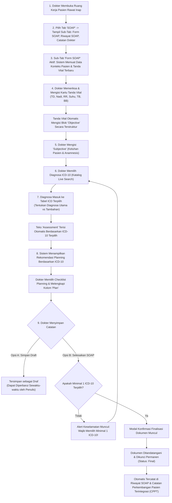

# Laporan Analisis & Rencana Kerja Modernisasi Menu: SOAP Dokter Rawat Inap (Inpatient Physician Progress Note & SOAP Documentation)

## 1. Ringkasan Eksekutif & Identitas Dokumen

| Atribut | Keterangan |
| :--- | :--- |
| **Area / Modul** | Pelayanan Kesehatan (*Health Services*) — Dokter Rawat Inap (*Inpatient Physician Workspace*) |
| **Menu Sasaran** | Ruang Kerja Dokter Rawat Inap → Tab 1: **SOAP (*Subjective, Objective, Assessment, Plan*) / Catatan Perkembangan Pasien Terintegrasi Dokter** |
| **Jalur Dokumen** | `docs/module-blueprints/rawat-inap/dokter-rawat-inap/roadmap/rencana-kerja/soap/soap.md` |
| **Dasar Penyelarasan** | Mengadopsi 100% kapabilitas operasional lapangan dari **QuilvianV1** (berdasarkan 3 tangkapan layar utama di `captures/dokter-rawat-inap/02-soap/`: `01-form-soap.png`, `02-riwayat-soap.png`, `03-catatan-dokter.png`, dan source code `form-soap.jsx` & `Soap-module/index.jsx`), diselaraskan secara mulus dengan arsitektur modern **QuilvianFinal** (`physician-progress-tab.jsx`, `soap-editor.jsx`, `DoctorConsultationController.cs`, dan `PatientDiagnosisController.cs`). |
| **Standar Keselamatan & Mutu** | **Sasaran Keselamatan Pasien (SKP 1 & SKP 2)**: Identifikasi Pasien Tepat, Peningkatan Komunikasi Efektif (Pelaporan Kondisi Pasien SBAR/TBAK), Standar Akreditasi Rumah Sakit STARKES / KARS (Bab Pelayanan dan Asuhan Pasien / PAP 1, PAP 2, PAP 3) serta Peraturan Menteri Kesehatan RI No. 24 Tahun 2022 tentang Rekam Medis Elektronik (RME). |
| **Prinsip Data & Legalitas Medis** | **Audit Trail & Immutability** — Pencatatan akurat tanda vital (*vital signs snapshot*), penegakan diagnosa berstandar kodifikasi internasional (*ICD-10 coding mandatory*), keterhubungan otomatis antara ICD-10 dengan rencana terapi (*integrated planning*), perlindungan catatan terhadap perubahan sepihak (*author ownership*), dan mekanisme koreksi resmi melalui addendum klinis berwewenang. |

---

## 2. Analisis Mendalam: Audit Kesenjangan V1 vs Final (Status Implementasi)

Investigasi teliti dilakukan dengan membandingkan formulir operasional **QuilvianV1** (folder `captures/dokter-rawat-inap/02-soap/`, file `01-form-soap.png`, `02-riwayat-soap.png`, `03-catatan-dokter.png`, serta source code `form-soap.jsx`) terhadap kondisi sistem di **QuilvianFinal** (`physician-progress-tab.jsx`, `soap-editor.jsx`, `use-inpatient-progress-note.jsx`, `DoctorConsultationController.cs`, `PatientDiagnosisController.cs`, dan `TrxDoctorConsultation.cs`):

### 2.1. Matriks Status Implementasi Fitur & Parameter Klinis

| No | Komponen / Fitur | Kondisi di QuilvianV1 (Operasional Lapangan - Capture `02-soap`) | Kondisi di QuilvianFinal Saat Ini | Status Penyelarasan | Catatan & Rencana Paritas 100% V1 |
| :--- | :--- | :--- | :--- | :--- | :--- |
| 1 | **Struktur Sub-Tab Navigasi Internal** | 3 Sub-Tab Horizontal Lengkap:<br/>1. `Form SOAP` (ikon Clipboard)<br/>2. `Riwayat SOAP` (ikon History)<br/>3. `Catatan Dokter` (ikon StickyNote) | Saat ini di Final hanya ada 1 tampilan form editor dengan collapsible drawer riwayat kecil di bagian atas (`historyBanner`). | **SEBAGIAN DITERAPKAN** | **Paritas Penuh V1**: Menyediakan 3 sub-tab horizontal yang jelas (`Form SOAP`, `Riwayat SOAP`, `Catatan Dokter`) sehingga dokter memiliki ruang kerja terfokus sesuai alur kerja klinis harian. |
| 2 | **Header Form & Identitas Pasien** | **Card Header Teal/Biru**: Judul `Form SOAP` dengan badge identitas pasien rawat inap di sisi kanan (format: `Nama Pasien - No. RM`). | Header Dokter SOAP generik dengan badge nomor konsultasi dan status draf. | **PARITAS 100% DISEMPURNAKAN** | Mengadopsi header kartu yang bersih dengan badge nama pasien & No. RM yang kontras dan mudah dibaca dokter. |
| 3 | **Section Input Tanda Vital (Vital Signs Snapshot)** | **Tersedia Lengkap pada Form (`01-form-soap.png`)**:<br/>- Tekanan Darah (mmHg): Systolic / Diastolic (2 input box)<br/>- Heart Rate / Nadi (HR): input numerik x/m<br/>- Respiratory Rate (RR): input numerik x/m<br/>- Suhu (°C): input numerik desimal<br/>- Tinggi Badan (cm): input numerik<br/>- Berat Badan (kg): input numerik desimal<br/>- Badge status: `Isi Tanda Vital` / `Data Tanda Vital Terbaru`<br/>- Keterangan: *"Tanda vital otomatis ditambahkan ke bagian Objective, dan bisa diubah secara manual jika diperlukan."* | **SAMA SEKALI BELUM ADA** pada form SOAP Final (`soap-editor.jsx`). Hanya ada field input waktu pemeriksaan (`clinicalDateTime`) dan 4 textarea teks bebas (S/O/A/P). | **BELUM DITERAPKAN (GAP KRITIS)** | **Wajib Ditambahkan Segera!** Membangun form input Tanda Vital 6 parameter persis V1, terhubung dengan field entity `TrxDoctorConsultation` (BloodPressureSystolic/Diastolic, PulseRate, RespiratoryRate, Temperature, Height, Weight) serta auto-sync ke textarea Objective. |
| 4 | **Pencarian & Katalog ICD-10 (Diagnosa Terstruktur)** | **Tersedia Dropdown / Select Field ICD-10**:<br/>- Live search minimal 2 karakter (kode atau nama penyakit)<br/>- Infinite scroll pencarian ICD-10<br/>- Placeholder: *"Cari ICD-10 (kode atau nama diagnosa)..."* | **SAMA SEKALI BELUM ADA** di tab SOAP Dokter Rawat Inap Final. Dokter dipaksa mengetik diagnosa manual sebagai teks bebas tanpa kode ICD-10 terstandar. | **BELUM DITERAPKAN (GAP KRITIS)** | **Wajib Diterapkan Segera!** Mengintegrasikan katalog ICD-10 terpadu menggunakan API `GET /patient-diagnoses/master-options` dan komponen pencarian diagnosa modern (dropdown live search + modal katalog ICD-10). |
| 5 | **Tabel Diagnosa Terpilih (Diagnosa Utama vs Tambahan)** | **Tabel Terstruktur Interaktif (`01-form-soap.png`)**:<br/>- Kolom: `No`, `Kode ICD` (Badge Info), `Nama Diagnosa`, `Diagnosa Utama` (Checkbox), `Diagnosa Tambahan` (Checkbox), `Aksi` (Tombol Hapus Merah).<br/>- Mengatur klasifikasi diagnosa primer/sekunder langsung pada tabel. | **BELUM ADA** tabel diagnosa terpilih di form SOAP rawat inap Final. | **BELUM DITERAPKAN (GAP KRITIS)** | **Wajib Diterapkan Segera!** Menghadirkan tabel diagnosa terpilih lengkap dengan status badge `Utama` / `Tambahan`, pemilihan radio/checkbox diagnosa utama eksklusif, dan tombol hapus item. |
| 6 | **Auto-Populasi Kolom Assessment dari ICD-10** | Begitu dokter memilih diagnosa ICD-10 pada tabel, teks pada kolom **Assessment** otomatis terisi secara terstruktur:<br/>`1. A09 - Diarrhoea and gastroenteritis of presumed infectious origin (Diagnosa Utama)`<br/>Dokter tetap dapat menambahkan interpretasi klinis lanjutan. | Kolom Assessment di Final hanya menerima input ketikan manual tanpa integrasi otomatis dari data ICD-10. | **BELUM DITERAPKAN** | **Paritas 100% V1**: Menghubungkan pemilihan ICD-10 dengan auto-populasi teks Assessment secara real-time demi efisiensi dokter bangsal. |
| 7 | **Planning Berdasarkan Diagnosa (Accordion Planning)** | Begitu ICD-10 dipilih, sistem menampilkan Accordion **Planning per Diagnosa** yang memuat checklist rencana tindakan/terapi standar untuk diagnosa tersebut. Checklist yang dicentang otomatis mengisi textarea **Planning**. | Kolom Plan di Final hanya textarea teks bebas biasa tanpa integrasi rekomendasi rencana tindakan per diagnosa. | **BELUM DITERAPKAN** | **Paritas 100% V1**: Menghadirkan accordion rekomendasi planning per diagnosa ICD-10, terhubung ke generator rencana tindakan otomatis. |
| 8 | **Sub-Tab Riwayat SOAP Pasien (`02-riwayat-soap.png`)** | Tampilan sub-tab khusus: judul `Riwayat SOAP Pasien`, deskripsi pasien, tombol `Refresh`, counter `Total SOAP: X catatan`, tombol `Buat SOAP Baru`, serta daftar kartu SOAP berbadge lengkap (SOAP #1, Tanggal/Jam, Nama Dokter DPJP). | Di Final riwayat hanya berupa timeline compact vertikal dalam drawer, tanpa tampilan sub-tab dedicated yang luas. | **SEBAGIAN DITERAPKAN** | **Paritas Penuh V1**: Menyediakan sub-tab `Riwayat SOAP Pasien` yang menyajikan seluruh catatan perkembangan historis pasien dalam kartu komprehensif yang rapi. |
| 9 | **Sub-Tab Catatan Dokter (`03-catatan-dokter.png`)** | Sub-tab dedicated `Catatan Dokter` yang memfilter catatan perkembangan khusus dokter, dilengkapi counter total dan tombol `Buat SOAP Baru`. | Belum ada pemisahan sub-tab khusus Catatan Dokter di tab SOAP Final. | **BELUM DITERAPKAN** | **Paritas 100% V1**: Menghadirkan sub-tab `Catatan Dokter` untuk audit rekam medis dokter yang cepat dan akurat. |
| 10 | **Banner Validasi Keamanan Klinis (Safety Gate)** | Banner Alert Kuning (Warning) di bagian bawah form:<br/>*"Silakan pilih minimal satu diagnosa ICD-10 sebelum menyimpan SOAP."*<br/>Tombol Simpan otomatis dinonaktifkan (disabled) jika belum ada ICD-10 yang dipilih. | Validasi Final hanya memeriksa apakah ada minimal 1 bagian SOAP yang terisi, belum memvalidasi keberadaan diagnosa terstruktur ICD-10. | **BELUM DITERAPKAN** | **Peningkatan Keselamatan Klinis**: Mewajibkan minimal 1 diagnosa ICD-10 sebelum catatan SOAP dapat difinalisasi, disertai pesan alert ramah pengguna persis V1. |
| 11 | **Siklus Hidup Dokumen Medis Resmi (Inovasi Final)** | V1 hanya memiliki tombol Reset dan Simpan SOAP langsung (tanpa pembedaan draft vs terkunci permanen). | Final memiliki siklus hidup EMR berstandar akreditasi: `Simpan Draft` (dapat diedit sewaktu-waktu oleh penulis), `Selesaikan SOAP` (tanda tangan digital & dokumen dikunci permanen), serta `Koreksi / Addendum` berwewenang bila terjadi kesalahan pencatatan. | **TERINTEGRASI HARMONIS (KEUNGGULAN FINAL)** | **Perpaduan Sempurna**: Mengadopsi form input ramah pengguna dan lengkap dari V1, digabungkan dengan alur Simpan Draft, Selesaikan, dan Addendum dari Final demi kepatuhan hukum rekam medis. |

---

## 3. Laporan Spesifikasi Endpoint Swagger API

Modul SOAP Dokter Rawat Inap dilayani oleh 2 controller terpadu di backend:
1. `QuilvianSystemBackend.Areas.HealthServices.ClinicalManagement.Controllers.DoctorConsultationController`
2. `QuilvianSystemBackend.Areas.HealthServices.ClinicalManagement.Controllers.PatientDiagnosisController`

### 3.1. Kelompok Tag Swagger
```csharp
[Tags("Health Services / Clinical Management / Doctor Consultation")]
[Route("api/v1/health-services/clinical-management/doctor-consultations")]

[Tags("Health Services / Clinical Management / Patient Diagnosis")]
[Route("api/v1/health-services/clinical-management/patient-diagnoses")]
```

### 3.2. Tabel Spesifikasi Endpoint API Terstandar

| No | Method | Route Path | Deskripsi Fungsi | Hak Akses / Role Otorisasi | Request Body (DTO) | Response DTO | HTTP Code |
| :--- | :--- | :--- | :--- | :--- | :--- | :--- | :--- | :--- |
| 1 | `GET` | `/api/v1/health-services/clinical-management/doctor-consultations/episodes/{episodeId}/soap-timeline` | Mengambil seluruh lini masa catatan perkembangan SOAP pasien dalam satu episode rawat inap terurut waktu pemeriksaan klinis | `DoctorConsultation : Read` | *Query Params*: `from` (DateTime?), `to` (DateTime?) | `ApiResponse<SoapTimelineResponse>` | `200 OK`<br/>`400 Bad Request`<br/>`404 Not Found` |
| 2 | `POST` | `/api/v1/health-services/clinical-management/doctor-consultations` | Membuat catatan konsultasi / SOAP rawat inap baru (draf baru), mencakup data snapshot tanda vital dan narasi S/O/A/P | `DoctorConsultation : Create` | `CreateDoctorConsultationRequest` | `ApiResponse<DoctorConsultationCreateResponse>` | `201 Created`<br/>`400 Bad Request`<br/>`403 Forbidden`<br/>`422 Unprocessable` |
| 3 | `GET` | `/api/v1/health-services/clinical-management/doctor-consultations/{id}` | Mengambil data detail lengkap satu catatan konsultasi SOAP tertentu beserta tanda vital, penulis, status, dan riwayat koreksinya | `DoctorConsultation : Read` | *Route Param*: `id` (GUID) | `ApiResponse<DoctorConsultationDetailResponse>` | `200 OK`<br/>`404 Not Found` |
| 4 | `PATCH` | `/api/v1/health-services/clinical-management/doctor-consultations/{id}/soap` | Memperbarui isi narasi Subjective, Objective, Assessment, Plan, dan rencana turunan pada catatan SOAP yang masih berstatus Draf | `DoctorConsultation : Update` | `UpdateDoctorConsultationSoapRequest` | `ApiResponse<DoctorConsultationResponse>` | `200 OK`<br/>`400 Bad Request`<br/>`403 Forbidden`<br/>`409 Conflict (Terkunci)` |
| 5 | `PUT` | `/api/v1/health-services/clinical-management/doctor-consultations/{id}` | Memperbarui data umum konsultasi SOAP (termasuk koreksi nilai tanda vital numerik) selama catatan masih draf | `DoctorConsultation : Update` | `UpdateDoctorConsultationRequest` | `ApiResponse<DoctorConsultationResponse>` | `200 OK`<br/>`400 Bad Request`<br/>`403 Forbidden` |
| 6 | `PATCH` | `/api/v1/health-services/clinical-management/doctor-consultations/{id}/complete` | Dokter menandatangani dan menyelesaikan catatan SOAP sehingga status berubah menjadi Final dan dokumen terkunci permanen | `DoctorConsultation : Update` | `CompleteDoctorConsultationRequest` (opsional catatan akhir) | `ApiResponse<DoctorConsultationResponse>` | `200 OK`<br/>`400 Bad Request`<br/>`403 Forbidden`<br/>`409 Conflict` |
| 7 | `GET` | `/api/v1/health-services/clinical-management/patient-diagnoses/master-options` | Mengambil katalog master ICD-10 aktif yang berlaku untuk penegakan diagnosa klinis dengan live search kode / nama | `PatientDiagnosis : Read` | *Query Params*: `search`, `diagnosisChapterId`, `take` (default: 50, max: 100) | `ApiResponse<List<PatientDiagnosisMasterOptionResponse>>` | `200 OK`<br/>`400 Bad Request` |
| 8 | `GET` | `/api/v1/health-services/clinical-management/patient-diagnoses` | Mengambil daftar diagnosa ICD-10 pasien yang tertaut pada episode rawat inap atau catatan konsultasi SOAP tertentu | `PatientDiagnosis : Read` | *Query Params*: `inpEpisodeId`, `consultationId`, `encounterId` | `ApiResponse<PagedResult<PatientDiagnosisResponse>>` | `200 OK`<br/>`400 Bad Request` |
| 9 | `POST` | `/api/v1/health-services/clinical-management/patient-diagnoses` | Menambahkan rekaman diagnosa ICD-10 pasien yang tertaut pada catatan SOAP dokter atau episode rawat inap aktif | `PatientDiagnosis : Create` | `CreatePatientDiagnosisRequest` | `ApiResponse<PatientDiagnosisResponse>` | `201 Created`<br/>`400 Bad Request`<br/>`403 Forbidden` |
| 10 | `PATCH` | `/api/v1/health-services/clinical-management/patient-diagnoses/{id}/set-primary` | Mengubah status diagnosa terpilih menjadi Diagnosa Utama (Primary Diagnosis) | `PatientDiagnosis : Update` | `SetPrimaryPatientDiagnosisRequest` | `ApiResponse<PatientDiagnosisResponse>` | `200 OK`<br/>`400 Bad Request`<br/>`404 Not Found` |
| 11 | `DELETE` | `/api/v1/health-services/clinical-management/patient-diagnoses/{id}` | Menghapus diagnosa ICD-10 dari daftar diagnosa catatan SOAP selama catatan belum difinalisasi | `PatientDiagnosis : Delete` | *Route Param*: `id` (GUID) | `ApiResponse<object>` | `200 OK`<br/>`403 Forbidden`<br/>`404 Not Found` |
| 12 | `POST` | `/api/v1/health-services/medical-record-management/clinical-note-addendums` | Menambahkan catatan koreksi addendum resmi pada dokumen SOAP yang telah berstatus Final / Terkunci | `ClinicalNoteAddendum : Create` | `CreateClinicalNoteAddendumRequest` | `ApiResponse<ClinicalNoteAddendumResponse>` | `201 Created`<br/>`400 Bad Request`<br/>`403 Forbidden` |

---

### 3.3. Contoh Kontrak Payload Data (Request & Response)

#### Contoh 1: Request Pembuatan Catatan SOAP Baru Lengkap (`POST /doctor-consultations`)
```json
{
  "encounterId": "4c9e782a-4371-46ab-a077-4b7eb1a74288",
  "inpEpisodeId": "3b2e7c41-89a1-4322-901d-5c6a7e8f1234",
  "clinicalDateTime": "2026-09-30T08:30:00Z",
  "bloodPressureSystolic": 120,
  "bloodPressureDiastolic": 80,
  "pulseRate": 82,
  "respiratoryRate": 20,
  "temperature": 36.8,
  "oxygenSaturation": 98.0,
  "height": 165.0,
  "weight": 58.0,
  "isVitalSignCopiedFromAssessment": false,
  "subjective": "Pasien mengeluhkan demam naik-turun sejak 3 hari lalu, disertai mual dan lemas. Nyeri ulu hati berkurang setelah minum antasida.",
  "objective": "TD: 120/80 mmHg, HR: 82 x/m, RR: 20 x/m, Suhu: 36.8°C, TB: 165 cm, BB: 58 kg. Keadaan umum sedang, compos mentis. Abdomen supel, nyeri tekan epigastrium (+), bising usus normal.",
  "assessment": "1. A01.0 - Typhoid fever (Diagnosa Utama)\n2. K30 - Functional dyspepsia (Diagnosa Tambahan)",
  "plan": "• Tirah baring (bed rest)\n• Diet lunak rendah serat\n• IVFD RL 20 tpm\n• Ceftriaxone 1x2g IV (skin test lebih dulu)\n• Paracetamol 3x500mg PO prn demam\n• Omeprazole 1x40mg IV"
}
```

#### Contoh 2: Request Penambahan Diagnosa ICD-10 Terkait SOAP (`POST /patient-diagnoses`)
```json
{
  "encounterId": "4c9e782a-4371-46ab-a077-4b7eb1a74288",
  "consultationId": "8f1a2b3c-4d5e-6f7a-8b9c-0d1e2f3a4b5c",
  "inpEpisodeId": "3b2e7c41-89a1-4322-901d-5c6a7e8f1234",
  "diagnosisId": "d5e6f7a8-b9c0-1d2e-3f4a-5b6c7d8e9f0a",
  "diagnosisCode": "A01.0",
  "diagnosisName": "Typhoid fever",
  "isPrimary": true,
  "isChronic": false,
  "isNewCase": true,
  "clinicalNote": "Hasil widal test titer O 1/320, H 1/160"
}
```

#### Contoh 3: Response Sukses Pembuatan SOAP (`201 Created`)
```json
{
  "success": true,
  "statusCode": 201,
  "message": "Catatan konsultasi dokter rawat inap berhasil dibuat.",
  "data": {
    "id": "8f1a2b3c-4d5e-6f7a-8b9c-0d1e2f3a4b5c",
    "consultationNumber": "CONS-RWI-20260930-0042",
    "encounterId": "4c9e782a-4371-46ab-a077-4b7eb1a74288",
    "inpEpisodeId": "3b2e7c41-89a1-4322-901d-5c6a7e8f1234",
    "consultationStatus": 1,
    "consultationStatusText": "Draft",
    "clinicalDateTime": "2026-09-30T08:30:00Z",
    "consultationDateTime": "2026-09-30T09:15:22Z",
    "doctorId": "d1e2f3a4-b5c6-7d8e-9f0a-1b2c3d4e5f6a",
    "doctorName": "dr. Yuhana Fitra, Sp.PD",
    "bloodPressureSystolic": 120,
    "bloodPressureDiastolic": 80,
    "pulseRate": 82,
    "respiratoryRate": 20,
    "temperature": 36.8,
    "height": 165.0,
    "weight": 58.0,
    "subjective": "Pasien mengeluhkan demam naik-turun sejak 3 hari lalu...",
    "objective": "TD: 120/80 mmHg, HR: 82 x/m, Suhu: 36.8°C...",
    "assessment": "1. A01.0 - Typhoid fever (Diagnosa Utama)...",
    "plan": "• Tirah baring (bed rest)...",
    "isLockedUnsigned": false
  }
}
```

---

## 4. Alur Bisnis Proses Rumah Sakit & Standar Keselamatan Pasien

### 4.1. Alur Proses Kerja Visite & Dokumentasi SOAP Bangsal



### 4.2. Skenario Konkret Kasus Nyata di Rumah Sakit

#### Skenario 1: Pasien Anak (Pediatri — Bangsal Cempaka Bayi/Anak)
- **Identitas**: An. Santi (Usia: 1 tahun 0 bulan 29 hari, RM: 25-31-10-94).
- **Trigger**: Visite pagi dokter spesialis anak di ruang rawat inap anak.
- **Tanda Vital**: Nadi 124 x/m, RR 32 x/m, Suhu 38.6°C, TB 74 cm, BB 9.2 kg. Otomatis masuk ke *Objective*.
- **Subjective**: Ibu pasien melaporkan anak masih rewel, batuk berdahak, demam tinggi sejak semalam, mau minum sedikit-sedikit.
- **Objective**: Anak tampak lemas, retraksi interkostal ringan (-), ronkhi basah halus pada basal paru bilateral.
- **Pencarian ICD-10**: Dokter mencari `"Bronchopneumonia"`, memilih kode **J18.0 (Bronchopneumonia, unspecified)** sebagai *Diagnosa Utama*.
- **Assessment**: Terisi otomatis: `1. J18.0 - Bronchopneumonia, unspecified (Diagnosa Utama)`.
- **Planning**: Terisi otomatis dari rekomendasi pneumonia anak: O2 nasal kanul 1 lpm, nebulisasi NaCl 0.9% 3x/hari, paracetamol drop bila suhu > 38°C, antibiotik injeksi lanjutan.

#### Skenario 2: Pasien Dewasa (Penyakit Dalam — Bangsal Mawar Kelas I)
- **Identitas**: Tn. Budi Santoso (57 tahun, RM: 00-12-34-56).
- **Trigger**: Visite dokter spesialis penyakit dalam (DPJP).
- **Tanda Vital**: TD 145/90 mmHg, Nadi 88 x/m, RR 18 x/m, Suhu 36.6°C, TB 168 cm, BB 70 kg.
- **Subjective**: Nyeri kepala tengkuk berkurang, batuk berdahak putih minimal, nafsu makan membaik.
- **Pencarian ICD-10**:
  1. **J18.9 (Pneumonia, unspecified)** — Ditandai sebagai *Diagnosa Utama*.
  2. **I10 (Essential (primary) hypertension)** — Ditandai sebagai *Diagnosa Tambahan*.
- **Assessment**: Terisi otomatis:
  `1. J18.9 - Pneumonia, unspecified (Diagnosa Utama)`
  `2. I10 - Essential (primary) hypertension (Diagnosa Tambahan)`
- **Planning**: Lanjutkan levofloxacin 1x750mg IV hari ke-4, amlodipine 1x10mg oral pagi, edukasi pembatasan konsumsi garam, rencana foto toraks evaluasi sebelum pulang.

#### Skenario 3: Pasien Lansia (Geriatri — Bangsal Melati Isolasi)
- **Identitas**: Ny. Siti Aminah (74 tahun, RM: 25-10-88-12).
- **Trigger**: Visite dokter jaga bangsal melaporkan perburukan sesak napas.
- **Tanda Vital**: TD 160/95 mmHg, Nadi 102 x/m, RR 26 x/m, Suhu 37.4°C, SpO2 93% room air.
- **Subjective**: Pasien merasa sesak memberat saat berbaring mendatar, batuk berdahak kental kekuningan.
- **Pencarian ICD-10**:
  1. **J44.1 (Chronic obstructive pulmonary disease with acute exacerbation, unspecified)** — *Diagnosa Utama*.
  2. **I50.9 (Heart failure, unspecified)** — *Diagnosa Tambahan*.
- **Assessment**: Terisi otomatis kedua diagnosa di atas.
- **Planning**: Pasang sungkup O2 4 lpm, injeksi furosemid 20mg IV pelan, nebul combivent + pulmicort per 8 jam, konsul DPJP spesialis paru & jantung.

---

### 4.3. Analisis Pengaruh Perubahan Bisnis & Keselamatan Pasien

1. **Efisiensi Waktu Visite & Dokumentasi Dokter**:
   - Penghapusan input manual yang berulang-ulang: Tanda vital langsung membentuk narasi *Objective*, pilihan ICD-10 langsung membentuk narasi *Assessment*, dan template rekomendasi langsung membentuk narasi *Plan*.
   - Mengurangi durasi dokumentasi per pasien dari 8–10 menit menjadi 2–3 menit, sehingga dokter dapat meluangkan lebih banyak waktu untuk interaksi klinis langsung dengan pasien.
2. **Kepatuhan Terhadap Standar Akreditasi Rumah Sakit (STARKES / KARS)**:
   - **Sasaran Keselamatan Pasien 1 (SKP 1)**: Identifikasi pasien akurat tercantum permanen pada header formulir SOAP.
   - **Sasaran Keselamatan Pasien 2 (SKP 2)**: Setiap instruksi medis dan perkembangan klinis terdokumentasi terstruktur dan dapat diaudit secara *time-stamped*.
   - **Pelayanan dan Asuhan Pasien (PAP 1 & PAP 2)**: Asuhan klinis didasarkan pada asesmen komprehensif yang memadukan data fisik, tanda vital, dan diagnosa terkodifikasi.
3. **Peningkatan Kualitas Data Klaim Asuransi & BPJS (Zero Uncoded Diagnosis)**:
   - Kewajiban memilih diagnosa ICD-10 resmi mencegah klaim tertolak (*claim rejection*) akibat diagnosa dokter yang tidak jelas atau singkatan non-standar.
   - Pembedaan tegas antara *Diagnosa Utama* dan *Diagnosa Tambahan* sangat krusial bagi penentuan tarif INA-CBGs dan pertanggungan asuransi komersial.

---

## 5. Skema Tampilan UI/UX Modern & Wireframe Inovasi

### 5.1. Wireframe Layout Antarmuka Terpadu (Sub-Tab: Form SOAP)

```text
┌──────────────────────────────────────────────────────────────────────────────────────────────────┐
│ Ruang Kerja Dokter Rawat Inap > SOAP Pasien                                                      │
├──────────────────────────────────────────────────────────────────────────────────────────────────┤
│ [ SOAP (Aktif) ] [ CPPT ] [ KAJIAN PASIEN ] [ RESEP ] [ TINDAKAN ] [ RESUME ] [ VISIT ] [ PENUNJANG ] │
├──────────────────────────────────────────────────────────────────────────────────────────────────┤
│                                                                                                  │
│  [📋 Form SOAP (Aktif)]           [🕒 Riwayat SOAP]                 [📝 Catatan Dokter]           │
│                                                                                                  │
│ ┌──────────────────────────────────────────────────────────────────────────────────────────────┐ │
│ │ 📋 Form SOAP                                             [ Santi • RM: 25-31-10-94 • Bayi ]  │ │
│ ├──────────────────────────────────────────────────────────────────────────────────────────────┤ │
│ │                                                                                              │ │
│ │ 🩺 TANDA VITAL                                                     [ Badge: Isi Tanda Vital ] │ │
│ │ ┌──────────────────────────────────────────────────────────────────────────────────────────┐ │ │
│ │ │ Tekanan Darah (mmHg)       Nadi (HR)         Laju Nafas (RR)    Suhu (°C)   TB (cm)  BB (kg) │ │ │
│ │ │ [ 120 ] / [ 80 ]           [ 82 ] x/m        [ 20 ] x/m         [ 36.8 ]    [ 165 ]  [ 58 ]  │ │ │
│ │ │ 💡 Tanda vital otomatis mengisi bagian Objective dan dapat disesuaikan manual bila perlu.  │ │ │
│ │ └──────────────────────────────────────────────────────────────────────────────────────────┘ │ │
│ │                                                                                              │ │
│ │ 🩺 SUBJECTIVE (Keluhan Pasien)                                                               │ │
│ │ ┌──────────────────────────────────────────────────────────────────────────────────────────┐ │ │
│ │ │ Pasien mengeluhkan demam naik-turun sejak 3 hari lalu, disertai mual dan lemas...         │ │ │
│ │ └──────────────────────────────────────────────────────────────────────────────────────────┘ │ │
│ │                                                                                              │ │
│ │ 👁 OBJECTIVE (Pemeriksaan Fisik)                                                             │ │
│ │ ┌──────────────────────────────────────────────────────────────────────────────────────────┐ │ │
│ │ │ TD: 120/80 mmHg, HR: 82 x/m, RR: 20 x/m, Suhu: 36.8°C, TB: 165 cm, BB: 58 kg.             │ │ │
│ │ │ Keadaan umum sedang, compos mentis. Abdomen supel, nyeri tekan epigastrium (+)...         │ │ │
│ │ └──────────────────────────────────────────────────────────────────────────────────────────┘ │ │
│ │                                                                                              │ │
│ │ 🔍 PILIH ICD-10 (Diagnosa)                                                                   │ │
│ │ ┌──────────────────────────────────────────────────────────────────────────┬───────────────┐ │ │
│ │ │ 🔍 Cari ICD-10 (kode atau nama diagnosa, contoh: A09, Typhoid, Fever)... │ [Katalog ICD] │ │ │
│ │ └──────────────────────────────────────────────────────────────────────────┴───────────────┘ │ │
│ │                                                                                              │ │
│ │ DAFTAR DIAGNOSA ICD-10 TERPILIH:                                                             │ │
│ │ ┌────┬──────────┬─────────────────────────────────────┬──────────────┬──────────────┬──────┐ │ │
│ │ │ No │ Kode ICD │ Nama Diagnosa                       │ Diagnosa     │ Diagnosa     │ Aksi │ │ │
│ │ │    │          │                                     │ Utama        │ Tambahan     │      │ │ │
│ │ ├────┼──────────┼─────────────────────────────────────┼──────────────┼──────────────┼──────┤ │ │
│ │ │ 1  │ A01.0    │ Typhoid fever                       │  (●) Radio   │  [ ] Check   │ [🗑] │ │ │
│ │ │ 2  │ K30      │ Functional dyspepsia                │  ( ) Radio   │  [✓] Check   │ [🗑] │ │ │
│ │ └────┴──────────┴─────────────────────────────────────┴──────────────┴──────────────┴──────┘ │ │
│ │                                                                                              │ │
│ │ 📑 REKOMENDASI PLANNING PER DIAGNOSA (ACCORDION)                                             │ │
│ │ ┌──────────────────────────────────────────────────────────────────────────────────────────┐ │ │
│ │ │ ▼ A01.0 - Typhoid fever                                                                  │ │ │
│ │ │   [✓] Tirah baring (bed rest) total                                                      │ │ │
│ │ │   [✓] Diet lunak rendah serat                                                            │ │ │
│ │ │   [✓] Terapi antibiotik Ceftriaxone 1x2g IV                                              │ │ │
│ │ └──────────────────────────────────────────────────────────────────────────────────────────┘ │ │
│ │                                                                                              │ │
│ │ 📋 ASSESSMENT (Diagnosa) - Terisi Otomatis                                                   │ │
│ │ ┌──────────────────────────────────────────────────────────────────────────────────────────┐ │ │
│ │ │ 1. A01.0 - Typhoid fever (Diagnosa Utama)                                                  │ │ │
│ │ │ 2. K30 - Functional dyspepsia (Diagnosa Tambahan)                                          │ │ │
│ │ └──────────────────────────────────────────────────────────────────────────────────────────┘ │ │
│ │                                                                                              │ │
│ │ 📋 PLANNING (Rencana Tindakan) - Terisi Otomatis / Disesuaikan                              │ │
│ │ ┌──────────────────────────────────────────────────────────────────────────────────────────┐ │ │
│ │ │ === Planning untuk A01.0 - Typhoid fever ===                                               │ │ │
│ │ │ • Tirah baring (bed rest) total                                                          │ │ │
│ │ │ • Diet lunak rendah serat                                                                │ │ │
│ │ │ • Terapi antibiotik Ceftriaxone 1x2g IV                                                  │ │ │
│ │ └──────────────────────────────────────────────────────────────────────────────────────────┘ │ │
│ │                                                                                              │ │
│ │ ⚠️ Peringatan: Silakan pilih minimal satu diagnosa ICD-10 sebelum menyelesaikan SOAP.         │ │
│ │                                                                                              │ │
│ │ ──────────────────────────────────────────────────────────────────────────────────────────── │ │
│ │                                           [ 🔄 Reset ]  [ 💾 Simpan Draft ]  [ ✅ Selesaikan ] │ │
│ └──────────────────────────────────────────────────────────────────────────────────────────────┘ │
└──────────────────────────────────────────────────────────────────────────────────────────────────┘
```

### 5.2. Visual Hierarchy & Design Tokens (Estetika Modern & Wow Effect)

1. **Card Layout & Elevation**:
   - Container menggunakan kartu modern putih bersih dengan elevasi halus (`box-shadow: 0 4px 20px rgba(0, 0, 0, 0.05)`), border tipis 1px (`rgba(226, 232, 240, 0.8)`), dan rounded corners `16px`.
2. **Kombinasi Warna Harmonis (Hospital Premium Palette)**:
   - **Header Card & Primary Accent**: Deep Cyan / Medical Teal (`#0e7490`) bergradasi ke Soft Ocean (`#0284c7`).
   - **Vital Signs Snapshot Card**: Soft Cyan tint background (`#f0fdfa`) dengan border teal halus (`#ccfbf1`).
   - **Badge Diagnosa Utama**: Emerald Green solid (`#059669`) dengan teks putih cerah.
   - **Badge Diagnosa Tambahan**: Slate / Sky Blue solid (`#0284c7`) dengan teks putih.
   - **Safety Alert Banner**: Warm Amber background (`#fffbeb`), border amber (`#fde68a`), teks peringatan cokelat gelap (`#92400e`).
3. **Micro-Interactions & Reaktivitas UI**:
   - **Live Typing Sync**: Saat dokter mengetik di input Tanda Vital, baris pertama Objective otomatis ter-update mulus tanpa flicker.
   - **ICD-10 Chip Selection**: Memilih diagnosa langsung menambahkan baris animasi ke tabel diagnosa terpilih dan men-trigger pembuatan poin Assessment otomatis.
   - **Interactive Accordion**: Klik pada nama diagnosa membuka checklist rekomendasi terapi dengan animasi transisi tinggi (*smooth height collapse*).
   - **Interactive Counter**: Menampilkan counter jumlah ICD-10 yang dipilih `[2 Diagnosa Dipilih]`.

---

## 6. Rencana Kerja Implementasi End-to-End (Tahap 4 - Siap Eksekusi)

Setelah rencana kerja ini direview dan disetujui pengguna, tahap eksekusi implementasi tuntas akan mencakup langkah-langkah berikut:

### 6.1. Eksekusi Lapisan Backend
1. **Penyelarasan DTO & Endpoint SOAP**:
   - Memastikan DTO `CreateDoctorConsultationRequest` dan `UpdateDoctorConsultationRequest` menerima dan menyimpan 6 parameter tanda vital (`BloodPressureSystolic`, `BloodPressureDiastolic`, `PulseRate`, `RespiratoryRate`, `Temperature`, `Height`, `Weight`) secara persisten ke database `TrxDoctorConsultation`.
   - Memverifikasi endpoint `GET /api/v1/health-services/clinical-management/patient-diagnoses/master-options` melayani pencarian kata kunci ICD-10 dengan performa tinggi.
   - Memastikan penyimpanan diagnosa ICD-10 via `POST /patient-diagnoses` terhubung mulus dengan `InpEpisodeId` dan `ConsultationId`.

### 6.2. Eksekusi Lapisan Frontend
1. **Pembaruan Komponen Sub-Navigasi SOAP (`physician-progress-tab.jsx`)**:
   - Menyediakan 3 sub-tab navigasi persis V1: `Form SOAP`, `Riwayat SOAP`, dan `Catatan Dokter`.
   - Mengintegrasikan state tab aktif dengan aksi switch tab instan (misal tombol *Buat SOAP Baru* langsung mengalihkan ke sub-tab *Form SOAP*).
2. **Pembangunan Ulang Editor SOAP (`soap-editor.jsx`)**:
   - Membangun blok kartu **Tanda Vital** (TD, HR, RR, Suhu, TB, BB) lengkap dengan validasi numerik dan auto-sync ke textarea Objective.
   - Membangun selector **Pencarian ICD-10** (live search + catalog modal) terintegrasi dengan tabel diagnosa terpilih.
   - Menyediakan toggle diagnosa utama vs tambahan serta tombol hapus diagnosa.
   - Mengimplementasikan auto-populasi teks Assessment dari daftar diagnosa ICD-10 terpilih.
   - Mengimplementasikan Accordion Rekomendasi Planning per diagnosa ICD-10 dan auto-sync ke textarea Plan.
   - Menghadirkan tombol **Reset**, **Simpan Draft**, dan **Selesaikan SOAP** (dengan modal konfirmasi kunci permanen).
   - Menampilkan banner keselamatan amber jika belum ada diagnosa ICD-10 yang dipilih.
3. **Penyediaan Halaman Riwayat SOAP & Catatan Dokter**:
   - Mengembangkan komponen tampilan penuh sub-tab `Riwayat SOAP Pasien` (`02-riwayat-soap.png`) dengan kartu-kartu SOAP terperinci dan tombol *Buat SOAP Baru*.
   - Mengembangkan sub-tab `Catatan Dokter` (`03-catatan-dokter.png`) untuk peninjauan khusus catatan DPJP.

### 6.3. Verifikasi Bebas Error (Definition of Done)
1. **Backend Compilation**: `dotnet build QuilvianSystemBackend.csproj --no-incremental` menghasilkan **0 Errors**.
2. **Frontend Typecheck & Component Verification**: Seluruh komponen Next.js/React terbebas dari error linting dan dapat dirender secara stabil.
3. **Pengujian Fungsional Form SOAP**:
   - Pengisian nilai tanda vital berhasil tersinkron ke field Objective.
   - Pencarian dan pemilihan ICD-10 berhasil menambahkan diagnosa ke tabel dan mengisi Assessment.
   - Checklist planning berhasil menambahkan butir rencana ke kolom Plan.
   - Penyimpanan draft dan penyelesaian SOAP berhasil tersimpan di backend.
