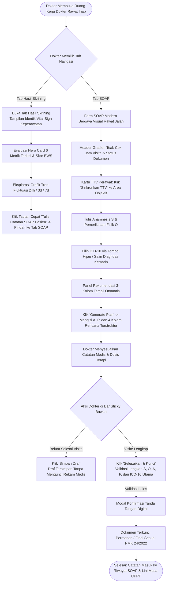

# Rencana Kerja & Dokumen Desain: Modernisasi Tampilan SOAP Dokter Rawat Inap & Tab Baru Hasil Skrining

> **Dokumen Resmi Rekayasa Perangkat Lunak — Revisi 3 (01-10-2026)**  
> **Status:** Siap Dieksekusi (*Approved for Implementation*)  
> **Jalur Berkas:** `NewQuilvianSystemBackend/docs/module-blueprints/rawat-inap/dokter-rawat-inap/roadmap/rencana-kerja/soap/soap-rev3-modernisasi-tampilan-dan-skrining.md`  
> **Dasar Perubahan:** Permintaan Pemilik Sistem (01 Oktober 2026):
> 1. Menyelaraskan tampilan visual SOAP dokter rawat inap mengikuti tampilan dokter rawat jalan (*pure look & feel / presentation layer*).
> 2. Memastikan pemisahan tegas: **TIDAK meniru alur simpan konsultasi antrean poli**, melainkan mempertahankan tata kelola draf, kunci rekam medis, dan addendum rawat inap.
> 3. Menambahkan tab/menu baru di ruang kerja dokter rawat inap bernama **"Hasil Skrining"** yang mengadopsi 100% tampilan pemantauan tanda vital keperawatan (grafik tren, kartu observasi terkini, EWS, dan tabel riwayat) serta terhubung tautan cepat dari form SOAP.

---

## 0. Riwayat Revisi Dokumen

| Revisi | Tanggal | Penulis | Perubahan Utama |
| :--- | :--- | :--- | :--- |
| **Rev 1** | ≤ 30-09-2026 | Google Antigravity | Rencana paritas awal V1 vs Final ([`soap-rev1-antigravity.md`](./soap-rev1-antigravity.md)). |
| **Rev 2** | 30-09-2026 | Claude Code | Pemindahan sumber ICD-10 ke master V2, integrasi TTV perawat ke deret pasien, dan penyelesaian 6 task (`BE-RWI-141`, `BE-RWI-142`, `FE-RWI-139`–`142`) di [`soap.md`](./soap.md). |
| **Rev 3** | **01-10-2026** | **Google Antigravity** | **Modernisasi visual Form SOAP mengikuti estetika Dokter Rawat Jalan + Penambahan Menu/Tab Baru "Hasil Skrining" di Ruang Kerja Dokter Rawat Inap yang mengadopsi tampilan Vital Sign Keperawatan.** |

---

## 1. Ringkasan Eksekutif & Batasan Ruang Lingkup

### 1.1. Yang Diadopsi dari Rawat Jalan (Murni Tampilan / UI Layer)
1. **Header Panel Gradien Teal:** Mengadopsi estetika `DoctorSoapHeader` bernuansa toska modern (`#078da0`, `#18b9c8`) dengan border radius 16px dan bayangan lembut.
2. **Tata Letak 2-Kolom Bersih S/O & A/P:** Menggunakan input teks standar `DoctorSoapField` tanpa ikon kartunis besar, memberikan ruang pengetikan yang luas dan fokus.
3. **Katalog ICD-10 Hijau Gradien & Tabel Diagnosa Bersih:** Mengadopsi tombol pil hijau gradien `DoctorDiagnosisCatalogButton`, modal `DoctorDiagnosisSearchModal`, dan `DoctorDiagnosisTable` dengan lencana kode diagnosa biru yang rapi.
4. **Panel Rekomendasi 3-Kolom:** Kartu ringkas **Resep**, **Tindakan**, dan **Edukasi** dengan tombol cepat **"Generate Plan"** 1-klik.
5. **Grid 4-Kolom Rencana Terstruktur:** Menampilkan 4 textarea `DoctorSoapField`: *Rencana Resep*, *Rencana Tindakan*, *Rencana Edukasi*, dan *Catatan Dokter*.

### 1.2. Yang DILARANG Ditiru & Wajib Dipertahankan (Logika Rawat Inap)
1. **Dilarang Meniru "Simpan Konsultasi" Poli:** Rawat jalan menyelesaikan antrean tiket pasien. Rawat inap beroperasi pada episode pasien yang dirawat berhari-hari. Aksi simpan rawat inap **TETAP**:
   - **Simpan Draf:** Boleh disimpan kapan saja (cukup 1 bagian terisi, `VAL-DOK-12`), milik dokter penulis (`FR-DOK-075`).
   - **Selesaikan & Kunci:** Penguncian rekam medis permanen (wajib S, O, A, P, dan minimal 1 ICD-10 Utama, `BE-RWI-142`).
   - **Koreksi (Addendum):** Perbaikan pasca-kunci wajib melalui addendum resmi sesuai Permenkes 24/2022.
2. **Tetap Mempertahankan 3 Sub-Tab SOAP:** *Form SOAP*, *Riwayat SOAP*, dan *Catatan Dokter*.
3. **Tetap Mempertahankan Tombol Salin SOAP Kemarin:** Fitur kontinuitas visite harian.

### 1.3. Penambahan Tab Baru: "Hasil Skrining" di Dokter Rawat Inap
- Menambahkan tab baru bernama **Hasil Skrining** pada deretan tab ruang kerja dokter rawat inap.
- Mengadopsi 100% tampilan pemantauan tanda vital dari Ruang Kerja Keperawatan (`nursing-care/vital-sign`):
  - Kartu Cockpit Observasi Terkini (TD + MAP, Nadi, RR, Suhu, SpO2, GCS) beserta kalkulasi Early Warning Score (EWS).
  - Filter rentang waktu: 24 Jam Terakhir, 3 Hari Terakhir, 7 Hari (Maksimal).
  - Beralih tampilan: Tabel Riwayat vs Grafik Tren Waktu (ECharts).
  - Tautan pintas dari Form SOAP: Tombol cepat *"Lihat Tren di Hasil Skrining →"* agar dokter dapat langsung memeriksa grafik saat mengisi SOAP.

---

## 2. Skenario Nyata di Rumah Sakit

> **Studi Kasus: Visite Pagi dr. Hendra, Sp.PD pada Pasien Ny. Aminah (Bangsal Flamboyan Bed 302)**
> 
> 1. **Pukul 06.30 (Observasi Perawat Bangsal):**
>    Perawat shift malam menginput observasi TTV berkala di Ruang Kerja Keperawatan: TD 145/95 mmHg, Nadi 98x/m, RR 24x/m, Suhu 38.5°C, SpO2 94% (Room Air), GCS 15. Server menghitung EWS = Skor 5 (Risiko Sedang - Demam tinggi dan takipnea).
> 
> 2. **Pukul 08.15 (Dokter Membuka Ruang Kerja Dokter Rawat Inap):**
>    dr. Hendra membuka aplikasi tablet di depan ranjang Ny. Aminah:
>    - Dokter membuka tab **Hasil Skrining**. Layar menampilkan grafik fluktuasi suhu dan tensi selama 24 jam terakhir yang diinput perawat. Terlihat lonjakan suhu dari 37.2°C pada pukul 23.00 menjadi 38.5°C pada pukul 06.30.
>    - Dokter beralih ke tab **SOAP**. Form SOAP tampil dengan header gradien *teal* yang rapi. Di atas area S & O, terdapat kartu ringkasan TTV perawat terbaru dengan peringatan EWS Skor 5, dan tombol *"Sinkronkan ke Objektif"*.
>    - Dokter mengklik *"Sinkronkan ke Objektif"*, sehingga data TTV perawat otomatis tersusun rapi di kolom O. Dokter menambahkan hasil pemeriksaan fisik stetoskop di bawahnya.
>    - Dokter mengisi keluhan subjektif di kolom S: *"Pasien mengeluh menggigil sejak subuh, batuk produktif."*
>    - Dokter mengklik tombol hijau *"Pilih Diagnosa ICD-10"*, menetapkan `J18.0 Bronchopneumonia` sebagai Diagnosa Utama.
>    - Panel Rekomendasi 3-Kolom memunculkan usulan antibiotik IV, foto toraks evaluasi, dan nebulizer. Dokter mengklik *"Generate Plan"*. Kolom A, P, dan 4 kolom rencana terstruktur terisi instan.
> 
> 3. **Pukul 08.25 (Penyelesaian Dokumen Legal):**
>    dr. Hendra mengklik tombol **"Selesaikan & Kunci"** di bar bawah (bukan simpan konsultasi poli). Dokumen terverifikasi lengkap, terkunci permanen, dan otomatis tercatat ke Lini Masa CPPT bangsal.

---

## 3. Alur Proses Bisnis End-to-End



---

## 4. Spesifikasi Kontrak API (Endpoint Bergaya Swagger)

### 4.1. Grup Tag: `[Tags("DoctorConsultation")]` (Catatan SOAP Dokter)

| Method | Endpoint Path | Deskripsi Singkat | Otorisasi | Request Body / Param | Response Sukses |
| :--- | :--- | :--- | :--- | :--- | :--- |
| `GET` | `/v1/health-services/clinical-management/doctor-consultations/episodes/{episodeId}/soap-timeline` | Mengambil lini masa seluruh catatan SOAP dokter pada episode rawat inap terurut waktu klinis. | Bearer Token (Dokter, Perawat) | Path: `episodeId` (UUID) | `200 OK`: Array timeline SOAP (S, O, A, P, diagnosa, rencana terstruktur, penulis). |
| `POST` | `/v1/health-services/clinical-management/doctor-consultations` | Membuat draf catatan SOAP rawat inap baru. | Bearer Token (Dokter Penulis) | JSON: `encounterId`, `inpEpisodeId`, `clinicalDateTime`, `subjective`, `objective`, `assessment`, `plan`, `prescriptionPlan`, `procedurePlan`, `educationPlan`, `doctorNote`, `sourceVitalSignId`. | `201 Created`: ID konsultasi baru (`id`). |
| `PATCH` | `/v1/health-services/clinical-management/doctor-consultations/{id}/soap` | Memperbarui draf catatan SOAP yang sedang disunting dokter penulis. | Bearer Token (Dokter Penulis) | JSON: S, O, A, P, kolom rencana terstruktur, dan tautan tanda vital. | `200 OK`: Data konsultasi terbaru. |
| `PATCH` | `/v1/health-services/clinical-management/doctor-consultations/{id}/complete` | Mengunci dan menandatangani rekam medis catatan visite secara permanen. | Bearer Token (Dokter Penulis) | Path: `id` (UUID) | `200 OK`: Status `Completed` (Kunci permanen). Tolak `422` bila S/O/A/P atau ICD-10 kosong. |

### 4.2. Grup Tag: `[Tags("PatientVitalSign")]` (Deret Tanda Vital & Skrining)

| Method | Endpoint Path | Deskripsi Singkat | Otorisasi | Request Body / Param | Response Sukses |
| :--- | :--- | :--- | :--- | :--- | :--- |
| `GET` | `/v1/health-services/clinical-management/daily-monitoring/patient-vital-signs/episodes/{episodeId}` | Mengambil deret waktu tanda vital observasi perawat dan dokter (filter 24h, 3d, 7d). | Bearer Token (Dokter, Perawat) | Query: `from`, `to` (ISO DateTime) | `200 OK`: Daftar observasi (TD, HR, RR, Suhu, SpO2, Kesadaran, MAP, EWS, observer). |
| `POST` | `/v1/health-services/clinical-management/daily-monitoring/patient-vital-signs` | Mencatat tanda vital baru (digunakan saat dokter mengukur mandiri saat visite). | Bearer Token (Dokter, Perawat) | JSON: `inpEpisodeId`, parameter TTV, sumber pencatat (`DoctorConsultation`). | `201 Created`: Rekaman tanda vital terverifikasi server. |

---

## 5. Rencana Kerja Implementasi Bertahap (Roadmap & Action Plan)

Pekerjaan dipecah menjadi **6 Vertical Slice Task** yang terisolasi dan dapat diuji:

```
┌────────────────────────────────────────────────────────┐
│ BAGIAN A: MENU BARU HASIL SKRINING DOKTER RAWAT INAP   │
├────────────────────────────────────────────────────────┤
│ Task 1 (FE-RWI-160): Komponen Tab PhysicianScreeningTab│
│ Task 2 (FE-RWI-161): Registrasi Navigasi & Quick Link │
└──────────────────────────┬─────────────────────────────┘
                           │
┌──────────────────────────▼─────────────────────────────┐
│ BAGIAN B: MODERNISASI VISUAL FORM SOAP DOKTER          │
├────────────────────────────────────────────────────────┤
│ Task 3 (FE-RWI-162): Header Gradien Teal & Panel Frame │
│ Task 4 (FE-RWI-163): Editor Bersih 2-Kolom S/O & A/P   │
│ Task 5 (FE-RWI-164): Katalog ICD-10 & Rekomendasi 3-K  │
│ Task 6 (FE-RWI-165): Grid Rencana 4-K & Bar Simpan Draf│
└────────────────────────────────────────────────────────┘
```

---

### Task 1: Pembuatan Komponen Tab "Hasil Skrining" (`PhysicianScreeningTab`)
- **Kode Task:** `FE-RWI-160`
- **Tujuan:** Menyediakan antarmuka deret tanda vital pasien di ruang kerja dokter dengan mengadopsi tampilan `NursingVitalSignTab`.
- **Target Berkas:**
  - `src/components/view/health-services/inpatient-management/physician-workspace/tabs/screening/physician-screening-tab.jsx` (Baru)
- **Rincian Pekerjaan:**
  1. Menggunakan hook `useInpatientVitalSignSeries` dengan `episodeId` dari `PhysicianWorkspaceContext`.
  2. Merender header bar "Deret Tanda Vital Pasien" dengan filter `24h / 3d / 7d`, toggle view `Tabel / Grafik`, dan tombol `Segarkan`.
  3. Merender Hero Cockpit 6 kartu metrik terkini (TD, Nadi, RR, Suhu, SpO2, Kesadaran) lengkap dengan badge status dan interpretasi EWS server.
  4. Merender grafik garis interaktif `VitalSignTrendChart` (ECharts) dan tabel deret waktu riwayat observasi perawat.
  5. Menyediakan tombol `+ Catat Tanda Vital` mandiri oleh dokter bila diperlukan.
- **Kriteria Terima (Acceptance Criteria):**
  - Tampilan persis 100% dengan tampilan vital sign keperawatan pada tangkapan layar pengguna.
  - Data TTV perawat termuat otomatis berdasarkan episode pasien yang sedang dibuka dokter.

---

### Task 2: Registrasi Tab Navigasi & Tautan Cepat dari Form SOAP
- **Kode Task:** `FE-RWI-161`
- **Tujuan:** Mendaftarkan tab "Hasil Skrining" ke daftar tab dokter rawat inap dan menyediakan tautan cepat dari form SOAP.
- **Target Berkas:**
  - `src/lib/constants/health-services/inpatient-management/inpatient-physician-constants.jsx`
  - `src/components/view/health-services/inpatient-management/doctor-inpatient/doctor-inpatient-view.jsx`
  - `src/components/view/health-services/inpatient-management/physician-workspace/components/physician-workspace-tabs.jsx`
  - `tests/unit/inpatient-physician-workspace.test.mjs`
- **Rincian Pekerjaan:**
  1. Menambahkan tab `{ key: "screening", label: "Hasil Skrining", description: "..." }` pada `INPATIENT_PHYSICIAN_WORKSPACE_TABS`.
  2. Mendaftarkan `screening: PhysicianScreeningTab` pada pemetaan tab dokter.
  3. Menyesuaikan tes unit `inpatient-physician-workspace.test.mjs` untuk mengakomodasi tab ke-9 ini.
  4. Menambahkan tombol tautan cepat pada Form SOAP: *"Lihat Tren di Hasil Skrining →"* yang memicu perpindahan tab aktif ke `screening`.
- **Kriteria Terima (Acceptance Criteria):**
  - Tab "Hasil Skrining" tampil di jajaran tab dokter rawat inap dan dapat diklik.
  - Klik tautan di form SOAP langsung mengarahkan dokter ke tab Hasil Skrining tanpa reload.

---

### Task 3: Modernisasi Header Form SOAP (Gaya Visual Rawat Jalan)
- **Kode Task:** `FE-RWI-162`
- **Tujuan:** Mengadopsi header panel gradien *teal* `DoctorSoapHeader` pada form SOAP dokter rawat inap.
- **Target Berkas:**
  - `src/components/view/health-services/inpatient-management/physician-workspace/tabs/progress-note/soap-editor.jsx`
  - `src/style/health-services/inpatient-management/physician-progress-note.module.css`
- **Rincian Pekerjaan:**
  1. Mengganti pembungkus kartu lama dengan `DoctorSoapHeader` bernuansa gradien toska.
  2. Menempatkan badge rawat inap di sisi kanan: Nama Pasien, No. RM, Hari Rawat (LOS), Status Dokumen (Draf/Final), Jam Visite (`ClinicalTimeField`), dan Indikator Kelengkapan SOAP (S·O·A·P).
  3. Menyajikan kartu TTV perawat dalam bentuk strip kompak modern tepat di atas blok S & O dengan tombol cepat *"Sinkronkan TTV"*.
- **Kriteria Terima (Acceptance Criteria):**
  - Estetika header selaras dengan standar rawat jalan, informasi klinis rawat inap tidak ada yang hilang.

---

### Task 4: Standardisasi Editor 2-Kolom S & O, A & P Menggunakan `DoctorSoapField`
- **Kode Task:** `FE-RWI-163`
- **Tujuan:** Menata kolom input S/O dan A/P agar bersih, lega, dan ergonomis seperti rawat jalan.
- **Target Berkas:**
  - `src/components/view/health-services/inpatient-management/physician-workspace/tabs/progress-note/soap-editor.jsx`
- **Rincian Pekerjaan:**
  1. Mengganti styling textarea lama dengan `DoctorSoapField` (menghapus ikon besar stetoskop/mata).
  2. Menjaga tombol cepat: *"+ Sisipkan dari catatan perawat: Nyeri X/10"* di bawah area Subjektif.
  3. Menjaga tombol helper: *"Susun ulang blok diagnosa"* di kolom Asesmen bila terjadi ketidaksinkronan ICD-10.
- **Kriteria Terima (Acceptance Criteria):**
  - Grid 2-kolom responsif: berdampingan pada layar desktop, bertumpuk pada layar sempit/tablet bangsal.

---

### Task 5: Penyelarasan Tombol Hijau Katalog ICD-10 & Rekomendasi 3-Kolom
- **Kode Task:** `FE-RWI-164`
- **Tujuan:** Menyelaraskan pemilihan diagnosa dan rekomendasi terapi dengan gaya rawat jalan.
- **Target Berkas:**
  - `src/components/view/health-services/inpatient-management/physician-workspace/tabs/progress-note/soap-icd-section.jsx`
  - `src/components/view/health-services/inpatient-management/physician-workspace/tabs/progress-note/soap-editor.jsx`
- **Rincian Pekerjaan:**
  1. Memasang `DoctorDiagnosisCatalogButton` hijau gradien dengan counter badge diagnosa.
  2. Menggunakan `DoctorDiagnosisTable` untuk daftar diagnosa terpilih (kode badge biru, nama, status utama, tombol hapus).
  3. Menjaga tombol pendamping *"Salin Diagnosa Kemarin"* tetap berada di samping tombol katalog.
  4. Menghadirkan panel rekomendasi 3-kolom (**Resep**, **Tindakan & Penunjang**, **Edukasi**) dilengkapi tombol **"Generate Plan"** 1-klik.
- **Kriteria Terima (Acceptance Criteria):**
  - Klik "Generate Plan" otomatis menyusun teks penalaran ke A dan P tanpa menghapus tulisan manual dokter.

---

### Task 6: Grid 4-Kolom Rencana Terstruktur & Bar Aksi Simpan Draf Rawat Inap
- **Kode Task:** `FE-RWI-165`
- **Tujuan:** Memunculkan 4 textarea rencana terstruktur di layar dan memastikan logika simpan draf / kunci rekam medis rawat inap tetap aman.
- **Target Berkas:**
  - `src/components/view/health-services/inpatient-management/physician-workspace/tabs/progress-note/soap-editor.jsx`
  - `tests/unit/inpatient-soap-modernization.test.mjs`
- **Rincian Pekerjaan:**
  1. Menambahkan grid 4-kolom textarea `DoctorSoapField` di bawah Plan:
     - `Rencana Resep` (`prescriptionPlan`, rows=4)
     - `Rencana Tindakan` (`procedurePlan`, rows=4)
     - `Rencana Edukasi` (`educationPlan`, rows=4)
     - `Catatan Dokter` (`doctorNote`, rows=4)
  2. Memastikan bar aksi sticky di bagian bawah tetap mempertahankan tombol murni rawat inap:
     - **Reset**
     - **Simpan Draf** (manual, tanpa autosave antrean poli)
     - **Selesaikan & Kunci** (menandatangani dokumen rekam medis)
     - **Koreksi** (addendum resmi untuk dokumen final)
  3. Menjalankan rangkaian 12 unit test SOAP untuk memastikan tidak ada regresi fungsional.
- **Kriteria Terima (Acceptance Criteria):**
  - Keempat field terstruktur tersimpan sempurna ke backend `DoctorConsultation`.
  - 12/12 unit test di `inpatient-soap-modernization.test.mjs` lulus hijau (PASS).

---

## 6. Definition of Done (DoD)

1. **Integritas Bisnis:** Tidak ada logika antrean / konsultasi poli rawat jalan yang bocor ke rawat inap.
2. **Kesesuaian Tampilan:** Form SOAP memiliki visual gradien toska dan grid bersih yang serasi dengan rawat jalan; Tab Hasil Skrining 100% identik dengan tampilan vital sign keperawatan.
3. **Kepatuhan Regulasi:** Penguncian dokumen rekam medis (Permenkes 24/2022) dan hak cipta penulis (FR-DOK-075) tetap ditegakkan secara mutlak.
4. **Validasi Kode:** Bebas dari lint error pada seluruh berkas yang disentuh; seluruh unit test lolos tanpa error.

---

## 7. Status Implementasi & Registri Keterlacakan (Traceability Registry)

| Kode Task | Nama Task | Status | Berkas Utama | Pengujian |
| :--- | :--- | :---: | :--- | :--- |
| `FE-RWI-160` | Komponen Tab `PhysicianScreeningTab` (Replikasi Vital Sign Keperawatan) | **SELESAI** | `physician-screening-tab.jsx` | Konteks episode & provider terpasang |
| `FE-RWI-161` | Registrasi Tab Navigasi & Tautan Cepat Form SOAP | **SELESAI** | `inpatient-physician-constants.jsx`, `doctor-inpatient-view.jsx`, `vital-signs-card.jsx` | `inpatient-physician-workspace.test.mjs` (PASS 16/16) |
| `FE-RWI-162` | Modernisasi Header Form SOAP (`DoctorSoapHeader`) | **SELESAI** | `soap-editor.jsx`, `physician-progress-note.module.css` | Header gradien toska & badge lengkap |
| `FE-RWI-163` | Editor Bersih 2-Kolom S/O & A/P (`DoctorSoapField`) | **SELESAI** | `soap-editor.jsx`, `physician-progress-note.module.css` | Responsif desktop/mobile, bebas icon kartunis |
| `FE-RWI-164` | Tombol Hijau Katalog ICD-10 & Panel Rekomendasi 3-Kolom | **SELESAI** | `soap-icd-section.jsx`, `soap-editor.jsx` | Tombol *Generate Plan* 1-klik aktif |
| `FE-RWI-165` | Grid 4-Kolom Rencana Terstruktur & Bar Aksi Draf Rawat Inap | **SELESAI** | `soap-editor.jsx`, `inpatient-progress-note-utils.jsx` | `inpatient-soap-modernization.test.mjs` (PASS 13/13) |

- **Laporan Pelaksanaan Resmi:** [`FE-RWI-160-s-d-165-modernisasi-soap-dan-skrining.md`](file:///c:/Users/Admin/Documents/Quilvian/Source%20Code/QuilvianFinal/NewQuilvianSystemBackend/docs/module-blueprints/rawat-inap/dokter-rawat-inap/task/report/frontend/FE-RWI-160-s-d-165-modernisasi-soap-dan-skrining.md)
- **Status Akhir Suite Unit Test:** 29/29 Unit Tests PASS, 79/79 Regression Tests PASS.

