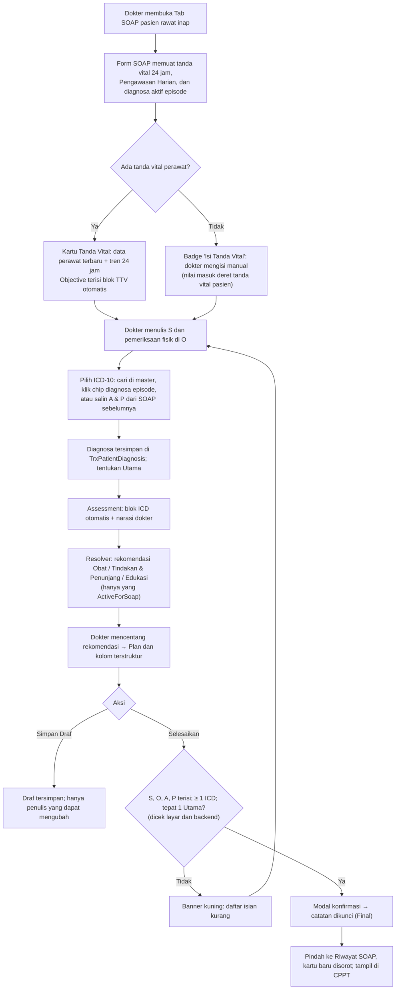

# Rencana Kerja SOAP Dokter Rawat Inap — Revisi 2

> **Status (30-09-2026): dieksekusi — keenam task ✅ selesai di tingkat source.** `BE-RWI-141`, `BE-RWI-142`, `FE-RWI-139` s.d. `FE-RWI-142`; laporan di `task/report/backend/` dan `task/report/frontend/`.
> - `dotnet build --no-incremental` PASS (0 error, 230 warning, tidak satu pun di berkas task).
> - ESLint 15 berkas SOAP PASS; test SOAP 12/12 PASS; suite unit 2101/2106 (5 kegagalan menu yang sudah ada).
> - Migration `20260930110000_AddDoctorConsultationSourceVitalSign` diterapkan ke `QuilvianNewDevHamzah` saja.
> - `npm run build` dan runtime **NOT RUN**; dijalankan pemilik (bagian 9 butir 4).
> - Yang belum tercapai: target CSS di bawah 400 baris (599 baris, token-only), dan empat penyimpangan tampilan yang menunggu keputusan pemilik (laporan `FE-RWI-141` bagian 8).
>
> Keputusan pemilik K1–K5 dijawab 30-09-2026 (bagian 8). Temuan audit bagian 2 ditelusuri dari source per 30-09-2026 **sebelum** eksekusi.
> Pembaca: pemilik dan pelaksana backend/frontend.

## 0. Riwayat Revisi

| Revisi | Tanggal | Penulis | Ringkasan |
| :--- | :--- | :--- | :--- |
| Rev 1 | ≤ 30-09-2026 09:41 (tanggal berkas) | Google Antigravity, skill `modernisasi-menu-v1` | Analisis paritas V1 dan rencana kerja awal. Disimpan utuh di [`soap-rev1-antigravity.md`](./soap-rev1-antigravity.md). |
| Rev 2 | 30-09-2026 | Claude Code (audit source V1 + V2) | Ditulis ulang mengikuti 4 permintaan pemilik. Sumber data dipindah ke master V2, tanda vital ditautkan ke observasi perawat, 12 cacat source dicatat, dan klaim Rev 1 dikoreksi (bagian 2.4). |
| Rev 2.1 | 30-09-2026 | Claude Code | Keputusan K1–K5 dicatat. Gerbang ICD di backend masuk lingkup, tidak ada kolom kata kunci ICD baru, salin A & P menjadi task `FE-RWI-142`, dan tanda vital ukuran dokter masuk deret tanda vital pasien (`BE-RWI-141`). |
| Eksekusi | 30-09-2026 | Claude Code | Keenam task dikerjakan dan ditandai ✅ di tingkat source (bagian 7). Rinciannya ada di laporan task, `frontend-roadmap-v2.md`, `backend-roadmap-v2.md`, dan `requirement-traceability-v2.md` bagian 17. |

---

## 1. Ringkasan Eksekutif

### 1.1 Permintaan pemilik (30-09-2026)

1. ICD-10 harus berasal dari **master data**.
2. Tanda vital harus **mengambil riwayat isian perawat** dan tertaut ke SOAP.
3. Tampilan **lebih bagus dan sesuai**.
4. Form **lengkap dan sesuai V1**.

### 1.2 Kesimpulan

- **Master ICD-10 sudah ada di V2**: `MstDiagnosis` berisi WHO ICD-10 2019, lengkap dengan halaman master data dan master rekomendasi terapi per diagnosa yang punya alur tinjauan. Masalahnya ada di Form SOAP rawat inap: ia memakai **data hardcode** `src/utils/icdData.jsx` (10 diagnosa dan planning fiktif salinan V1), bukan master.
- **Tanda vital perawat sudah tersimpan per episode** (`TrxPatientVitalSign`, ringkasan Pengawasan Harian). V1 dulu menariknya otomatis; V2 sekarang meminta dokter mengetik ulang. Ini fitur V1 yang hilang, dan Rev 1 tidak mencatatnya.
- Ada **cacat data kritis** di source hari ini. Diagnosa dari dropdown cepat membawa GUID milik V1, backend menolaknya, error ditelan, lalu SOAP tetap dikunci **tanpa diagnosa terkode** (bagian 2.3, C1–C3).
- Arah Rev 2: **struktur dan urutan V1 dipertahankan** (3 sub-tab; Tanda Vital → S → O → ICD-10 → Planning → A → P), **semua data diambil dari backend V2**, dan tampilan memakai base component serta token Quilvian. Pekerjaan dipecah menjadi 2 task backend dan 4 task frontend (bagian 7). `FE-RWI-139` didahulukan karena menutup cacat kritis tanpa menunggu backend.

### 1.3 Identitas dokumen

| Atribut | Keterangan |
| :--- | :--- |
| **Area / Modul** | Pelayanan Kesehatan — Dokter Rawat Inap |
| **Menu sasaran** | Ruang Kerja Dokter Rawat Inap → Tab **SOAP** (Form SOAP · Riwayat SOAP · Catatan Dokter) |
| **Jalur dokumen** | `docs/module-blueprints/rawat-inap/dokter-rawat-inap/roadmap/rencana-kerja/soap/soap.md` |
| **Bukti V1** | Capture `QuilvianV1/QuilvianSystemFrontendDev/captures/dokter-rawat-inap/02-soap/` (`01-form-soap.png`, `02-riwayat-soap.png`, `03-catatan-dokter.png`); source `src/components/view/dokter/componen-dokter/soap-componen/{form-soap,soap-history-pasien,soap-catatan-dokter}.jsx`, `dokter-pasien/Soap-module/index.jsx`, `src/lib/hooks/skrining/{useVitalSignLatest,usePainAssesmentLatest}.jsx`; backend V1 `MstICD-10`, `ICDPlanning`, `SOAPPlanning`, `MstDetailICD`, `MstVitalSign` |
| **Bukti V2** | FE `physician-workspace/tabs/progress-note/*` dan `use-inpatient-progress-note.jsx` (diubah 30-09-2026 09:55); SOAP poli `use-doctor-soap.js` + `doctor-soap-utils.js`; BE `DoctorConsultationController`, `PatientDiagnosisController`, `DiagnosisRecommendationResolverController`, `PatientVitalSignController`, `DailyObservationController`, `MasterData/DiagnosisController` |
| **Standar** | PMK 24/2022 Rekam Medis Elektronik; SKP 1 (identifikasi pasien) dan SKP 2 (komunikasi efektif); STARKES — Pelayanan dan Asuhan Pasien (PAP) |

---

## 2. Temuan Audit Source (30-09-2026)

### 2.1 Sudah ada di V2 — dipakai ulang, jangan dibuat baru

| Kebutuhan | Yang sudah ada | Lokasi |
| :--- | :--- | :--- |
| Master ICD-10 | `MstDiagnosis`: kode, nama, bab, induk–anak, `IsSelectableForClinicalUse`, `IsPrimaryDiagnosisAllowed`, `IsSecondaryDiagnosisAllowed`, `IcdVersion`; `MstDiagnosisChapter`; seeder WHO ICD-10 2019 (±12.200 kode termasuk kategori 3 karakter) | `Areas/HealthServices/MasterData/Models/MstDiagnosis.cs`, `Seeders/Icd10DiagnosisSeeder.cs`, `SeedData/ICD10/` |
| Halaman master ICD | CRUD Diagnosis dan Bab Diagnosis | FE `app/health-services/master-data/diagnosis`, `diagnosis-chapter`; BE `/master-data/diagnoses`, `/master-data/diagnosis-chapters` |
| Pengganti "Planning per ICD" V1 | Master rekomendasi **obat**, **tindakan/penunjang**, dan **edukasi** per diagnosa. Punya tata kelola `ReviewStatus` (`DraftFromLiterature → DoctorReviewed → ActiveForSoap → Inactive`) dan sumber (PNPK, Fornas, PPK RS). Obat tertaut `MstDrug`, tindakan tertaut `MstProcedure` | BE `/master-data/diagnosis-{drug,procedure,education}-recommendations`; FE halaman master masing-masing |
| Resolver rekomendasi untuk SOAP | `POST /clinical-management/diagnosis-recommendations/resolve` (body `diagnosisIds`); hanya rekomendasi berstatus `ActiveForSoap` yang keluar | `DiagnosisRecommendationResolverController.cs` |
| Pencarian ICD untuk dokter | `GET /patient-diagnoses/master-options?search=&take=` (hanya aktif dan dapat dipilih) | `PatientDiagnosisController.cs` |
| Diagnosa pasien | `TrxPatientDiagnosis`: tipe (Primary, Secondary, Differential, WorkingDiagnosis, FinalDiagnosis), status (Active, Resolved, RuledOut, Cancelled), `IsChronic`, `IsNewCase`, catatan klinis. Endpoint `POST`, `PUT`, `PATCH set-primary`, `PATCH resolve`, `PATCH cancel`. Filter `consultationId`, `inpEpisodeId`, `diagnosisStatus` | `PatientDiagnosisController.cs` |
| Tanda vital perawat per episode | `TrxPatientVitalSign`: TD, MAP, nadi, RR, suhu, SpO2 dan pemakaian O2, kesadaran/GCS, BB/TB/BMI, EWS dan tingkat risiko, tanda abnormal/kritis, `ObservedByName`, `InpEpisodeId`, `ConsultationId`. `GET /patient-vital-signs/episodes/{episodeId}` (default 24 jam terakhir, maks 7 hari) | `PatientVitalSignController.cs`, `InpatientVitalSignService.cs` |
| Ringkasan Pengawasan Harian | `GET /daily-monitoring/episodes/{episodeId}/summary?date=`: tanda vital hari itu, nyeri terakhir dari Monitoring Nyeri, GDS, balans cairan per shift dan 24 jam, observasi | `DailyObservationController.cs` |
| Snapshot tanda vital di catatan dokter | Kolom TD, nadi, RR, suhu, **SpO2**, BB, TB, BMI dan `IsVitalSignCopiedFromAssessment` di `TrxDoctorConsultation`; diterima DTO create dan patch SOAP | `TrxDoctorConsultation.cs`, `DoctorConsultationDtos.cs` |
| Plan terstruktur | `PrescriptionPlan`, `ProcedurePlan`, `SupportingExamPlan`, `ReferralPlan`, `EducationPlan`, `FollowUpDate`, `FollowUpNote`, `DoctorNote` di `TrxDoctorConsultation` dan DTO patch SOAP | idem |
| Pola SOAP dokter yang sudah berjalan | SOAP poli: cari ICD ke master, diagnosa langsung disimpan lewat API, resolver rekomendasi mengisi rencana resep/tindakan/edukasi, dan **isian dokter dilindungi** (teks otomatis hanya menimpa bila dokter belum menyuntingnya) | `lib/hooks/health-services/clinical-management/use-doctor-soap.js`, `utils/health-services/clinical-management/doctor-soap-utils.js` |
| Base component | `DoctorDiagnosisTable`, `DoctorDiagnosisSearchModal`, `DoctorSoapField`, `ClinicalSectionPanel`, `ClinicalSafetyAlert`, `ClinicalCompletionBar`, `ClinicalSegmentedNav`, `ClinicalScoreBadge` | `components/ui/doctor-clinical-base` |

### 2.2 Kondisi Form SOAP rawat inap saat ini

Berkas yang diubah 30-09-2026 09:55: `physician-progress-tab.jsx`, `soap-editor.jsx`, `vital-signs-card.jsx`, `soap-icd-section.jsx`, `soap-planning-accordion.jsx`, `soap-history-panel.jsx`, `doctor-notes-panel.jsx`, `patient-summary-badge.jsx`, `use-inpatient-progress-note.jsx`, `physician-progress-note.module.css`.

Kerangka V1 (3 sub-tab, kartu tanda vital, tabel ICD, planning, riwayat) sudah berdiri. Yang salah adalah sumber datanya, cara diagnosa disimpan, dan tampilannya.

### 2.3 Cacat yang wajib diperbaiki

Ditelusuri dari source (path relatif `QuilvianSystemFrontendDev/src` dan `NewQuilvianSystemBackend`); belum dijalankan.

| # | Tingkat | Cacat | Bukti | Akibat |
| :--- | :--- | :--- | :--- | :--- |
| C1 | Kritis | Dropdown cepat ICD dan planning memakai data hardcode `utils/icdData.jsx`: 10 diagnosa dan planning berisi obat fiktif (`m-001`) serta lab fiktif (`l-001`), disalin dari V1 Mei 2025 | `soap-icd-section.jsx:11,83`; `use-inpatient-progress-note.jsx:46,430` | Dokter hanya bisa memilih 10 diagnosa; rekomendasi obat tidak berasal dari master yang ditinjau |
| C2 | Kritis | GUID diagnosa hardcode adalah GUID `MstICD-10` V1, bukan `MstDiagnosis` V2, sehingga `POST /patient-diagnoses` ditolak 400 "Master diagnosis tidak ditemukan atau tidak aktif." | `use-inpatient-progress-note.jsx:609`; `PatientDiagnosisController.BuildDiagnosisSnapshotAsync` | Lihat C3 |
| C3 | Kritis | `persistDiagnoses` menelan error (`console.warn`), lalu `completeNote` tetap memanggil `complete` | `use-inpatient-progress-note.jsx:619-621, 736-737` | SOAP terkunci permanen tanpa diagnosa terkode, padahal layar menampilkannya. Resume medis dan klaim kehilangan kode |
| C4 | Tinggi | Backend tidak memeriksa diagnosa saat SOAP diselesaikan | `ConsultationFinalizationService.cs` (tidak ada aturan diagnosa) | Aturan "minimal 1 ICD-10" hanya dijaga layar |
| C5 | Tinggi | Menghapus diagnosa yang sudah tersimpan hanya menghapus dari state layar (tanpa `PATCH /{id}/cancel`). Mengganti Utama pada diagnosa tersimpan tidak memanggil `PATCH /{id}/set-primary` | `use-inpatient-progress-note.jsx:369-400` | Isi database berbeda dengan layar |
| C6 | Tinggi | Setiap perubahan diagnosa menimpa seluruh kolom Assessment | `use-inpatient-progress-note.jsx:322-325` | Penalaran klinis yang diketik dokter di A hilang |
| C7 | Sedang | Menghapus centang template planning tidak mencabut barisnya dari Plan | `use-inpatient-progress-note.jsx:450-466` | Plan memuat item yang sudah dibatalkan |
| C8 | Sedang | Katalog ICD beralih ke data hardcode saat API gagal | `use-inpatient-progress-note.jsx:492-512` | Kegagalan API tersamarkan |
| C9 | Sedang | Tanda vital diketik manual oleh dokter; tidak ada isian SpO2 padahal backend menyimpannya | `vital-signs-card.jsx` | Entri ganda perawat–dokter; SpO2 tidak tercatat |
| C10 | Sedang | `master-options` tidak menyaring `IcdVersion`, padahal ICD-9 disimpan di tabel yang sama | `PatientDiagnosisController.cs:185-241`; `Icd10DiagnosisSeeder.cs:26,250` | Kode tindakan ICD-9 dapat muncul di pencarian diagnosa bila sudah di-seed |
| C11 | Sedang | Resolver rekomendasi obat hanya mengembalikan `DrugId`, tanpa nama obat | `DiagnosisRecommendationResolverDtos.cs:19-37` | Dokter tidak melihat nama obat pada rekomendasi; SOAP poli terdampak juga |
| C12 | Rendah | Kepala halaman bertumpuk dan ganda (bagian 3.3). CSS modul 1.850 baris dengan 244 warna hex (73 berbeda) dan hanya 54 pemakaian token | `physician-progress-note.module.css` | Tampilan menyimpang dari design system; dokter harus menggulir jauh sebelum mengetik |

### 2.4 Koreksi terhadap Rev 1

| Klaim Rev 1 | Fakta 30-09-2026 |
| :--- | :--- |
| ICD-10, tabel diagnosa, tanda vital, dan sub-tab "SAMA SEKALI BELUM ADA" | Sudah ada di source sejak 30-09-2026 09:55, tetapi memakai data hardcode (C1–C3) |
| Endpoint `DELETE /patient-diagnoses/{id}` | Tidak ada. Pembatalan diagnosa memakai `PATCH /patient-diagnoses/{id}/cancel`, sehingga jejak audit tetap ada |
| Planning per ICD mengikuti `SOAPPlanning` V1 | V2 sudah punya master rekomendasi obat/tindakan/edukasi dengan tata kelola tinjauan dan resolver. Itu yang dipakai |
| Bagian 6.1: "memastikan DTO menerima 6 parameter tanda vital" | Sudah diterima, termasuk SpO2 |
| Tidak menyebut tautan ke tanda vital perawat | V1 menariknya otomatis (`useVitalSignLatest` + SignalR `vitalsign ditambah`), dan V2 punya datanya per episode. Dimasukkan sebagai permintaan 2 |
| Request selesai bernama `CompleteDoctorConsultationRequest` | Nama DTO di source: `FinalizeDoctorConsultationRequest` |
| Kolom "Diagnosa Utama" dan "Diagnosa Tambahan" berupa dua checkbox | Di V1 keduanya bisa sama-sama tercentang atau sama-sama kosong. Rev 2 memakai tepat satu Utama; sisanya Tambahan |

---

## 3. Rekomendasi

### 3.1 ICD-10 dari master data (permintaan 1)

Prinsipnya satu sumber kebenaran: `MstDiagnosis`. Rekam Medis mengelolanya lewat halaman master; dokter hanya memilih.

**Frontend**

1. Hapus pemakaian `utils/icdData.jsx` dari SOAP (importer-nya hanya `soap-icd-section.jsx` dan `use-inpatient-progress-note.jsx`), lalu hapus berkasnya.
2. Sediakan satu kolom cari ICD async seperti `SelectField` V1: minimal 2 huruf, debounce ±300 ms, memanggil `master-options`, menampilkan "kode — nama", dan memberi tanda bila diagnosa tidak boleh menjadi Utama. Tombol **Katalog ICD-10** tetap membuka `DoctorDiagnosisSearchModal` untuk menjelajah per bab. Tidak ada fallback hardcode: bila API gagal, tampilkan pesan dan tombol Coba lagi.
3. **Diagnosa aktif episode** (tambahan V2): chip diagnosa yang sudah tercatat pada episode ini, baik dari IGD, admisi, maupun SOAP kemarin (`GET /patient-diagnoses?inpEpisodeId=&diagnosisStatus=Active`). Sekali klik untuk menambahkan, karena visite harian biasanya mengulang diagnosa yang sama.
4. Tabel memakai `DoctorDiagnosisTable`, komponen yang sama dengan SOAP poli: Status (Utama/Tambahan), Kode, Nama, Aksi (Jadikan Utama, Hapus). Utama selalu tepat satu.
5. Diagnosa disimpan lewat API:
   - **Catatan baru:** diagnosa disimpan berurutan saat Simpan Draf atau Selesaikan pertama.
   - **Catatan tersimpan:** langsung per aksi. Tambah memakai `POST`; hapus memakai `PATCH /{id}/cancel` dengan alasan otomatis "Dihapus dari SOAP oleh penulis"; ganti Utama memakai `PATCH /{id}/set-primary`.
   - Setiap kegagalan ditampilkan, dan **Selesaikan dibatalkan**. Tidak ada lagi `console.warn` yang menelan error.

**Backend (`BE-RWI-142`)**

- `master-options` mendapat parameter `icdVersion` (default `ICD-10`). Urutan hasil: kode persis, lalu awalan kode, lalu nama yang mengandung kata.
- Resolver mengembalikan nama obat (serta kekuatan/sediaan bila tersedia di `MstDrug`) dan nama tindakan dari `MstProcedure`.
- Backend menolak penyelesaian catatan rawat inap (`InpEpisodeId` terisi) yang tidak punya diagnosa aktif atau tidak punya tepat satu Utama, dengan pesan yang sama dengan layar (K1).
- Timeline SOAP menyertakan diagnosa per catatan (kode, nama, Utama) dan peran dokter pada episode, agar Riwayat SOAP dan Catatan Dokter tidak perlu satu request per kartu.

**Master data (keputusan K2 dan K3)**

- Tidak ada kolom baru di `MstDiagnosis`. Pencarian memakai kode dan nama yang ada di master data (K2).
- Kode DTD, kolom Kasus Baru/Lama, dan versi ICD untuk klaim dikonfirmasi ke Rekam Medis dan casemix di luar task SOAP ini, dan tidak memblokirnya (K3). V1 menyimpan `DTDCode`/`NamaDtd`; berkas seed WHO sudah memuat kolom daftar tabulasi morbiditas bila kelak dibutuhkan.

### 3.2 Tanda vital tertaut ke observasi perawat (permintaan 2)

Prinsipnya: perawat dan dokter memakai satu deret tanda vital pasien. Perawat mengukur rutin, dokter meninjau dan merujuk, dan ukuran dokter masuk ke deret yang sama. Tidak ada input ganda.

1. **Sumber data.** Saat Form SOAP dibuka, muat `GET /patient-vital-signs/episodes/{episodeId}` (24 jam bergulir) untuk nilai terbaru dan tren, serta `GET /daily-monitoring/episodes/{episodeId}/summary` (hari ini) untuk nyeri, GDS, dan balans cairan.
2. **Kartu Tanda Vital** tetap di posisi dan dengan judul V1, tetapi isinya "data perawat terbaru": TD, Nadi, RR, Suhu, SpO2 (dengan tanda bila memakai O2), Kesadaran/GCS, TB, BB, dan EWS (`ClinicalScoreBadge`). Nilai abnormal/kritis diberi warna. Sumbernya ditulis, misalnya "Ns. Rina · 06.10 (2 jam lalu)".
   - Arti badge V1 dipertahankan: hijau **Data Tanda Vital Terbaru** bila ada data perawat, oranye **Isi Tanda Vital** bila belum ada.
3. **Tren 24 jam** (tambahan V2): satu baris berisi suhu tertinggi, TD terendah, nadi tertinggi, dan SpO2 terendah beserta jamnya. Dengan begitu, demam pukul 02.00 tidak tertutup oleh nilai pagi yang normal.
4. **Pengawasan Harian ringkas:** nyeri terakhir (skala dan jam, dari Monitoring Nyeri), GDS terakhir, dan balans cairan 24 jam (masuk/keluar/balans).
5. **Objective otomatis (paritas V1).** Pada catatan baru dengan Objective kosong, blok TTV langsung terisi. Tombol **Masukkan ke Objective** tersedia untuk catatan lain. Contoh:

   ```text
   TTV (06.10, Ns. Rina): TD 100/60 mmHg · N 124 x/m · RR 32 x/m · S 37,9 °C · SpO2 96% O2 1 lpm · GCS 15 · EWS 3
   24 jam: suhu maks 38,6 °C (02.00) · Nyeri 2/10 (05.00) · Balans +120 mL
   ```

   Dokter menulis pemeriksaan fisik di bawahnya. Pembaruan otomatis hanya menimpa blok buatan sistem bila dokter belum menyuntingnya, memakai pola `dirtyFieldsRef` dari `use-doctor-soap.js`, bukan regex pemisah seperti V1.
6. **Isi manual oleh dokter (K5).** Bila dokter mengukur sendiri, tombol **Isi manual** membuka input (termasuk SpO2). Nilainya masuk ke deret tanda vital pasien sebagai `TrxPatientVitalSign` bersumber `DoctorConsultation` dengan `ConsultationId` catatan itu, sehingga tampil di tabel dan grafik perawat dengan label Dokter. Satu catatan dokter memiliki paling banyak satu baris tanda vital buatan dokter: baris itu diperbarui selama catatan masih Draf, dibekukan saat catatan diselesaikan, dan dibatalkan bila catatan dibatalkan.
7. **Penyegaran.** Sediakan tombol **Muat ulang**, dan muat ulang otomatis saat tab kembali aktif. V2 belum punya hub SignalR untuk tanda vital (hanya `QueueHub`), jadi push realtime seperti V1 masuk fase berikutnya.
8. **Tautan tersimpan (`BE-RWI-141`).** Tambah kolom `SourceVitalSignId` di `TrxDoctorConsultation` yang merujuk baris tanda vital yang dipakai, baik milik perawat (dipilih dokter) maupun buatan dokter (butir 6). Nilainya tetap disalin sebagai snapshot, sehingga yang dilihat dokter saat menandatangani tidak berubah bila perawat mengoreksi datanya kemudian.
9. **Izin.** Akun dokter butuh `PatientVitalSign.Read` dan `DailyObservation.Read`. Bila ditolak, kartu menampilkan "akses ditolak" dan form tetap bisa diisi manual.

**Subjective.** V1 mengisi S dari Pain Assessment. Namun pemetaan V1 membaca `lokasiNyeri`, `skalaNyeri`, dan `karakteristikNyeri`, yang tidak ada di API V1 (yang ada `Lokasi`, `SkalaPainId`, `Kualitas`), sehingga praktis hanya Keluhan Utama yang terisi. Di V2, nyeri rawat inap dicatat di Monitoring Nyeri. Rekomendasinya chip **Sisipkan dari catatan perawat** di bawah S, bukan isian otomatis, karena S adalah anamnesis dokter.

### 3.3 Tampilan (permintaan 3): struktur V1, penyelesaian V2

**Dipertahankan dari V1**

- Tiga sub-tab horizontal berikon: Form SOAP, Riwayat SOAP, Catatan Dokter.
- Kartu **Form SOAP** berkepala warna utama dengan badge "Nama – No. RM" di kanan.
- Urutan vertikal: Tanda Vital → Subjective → Objective → Pilih ICD-10 → Tabel diagnosa → Planning per diagnosa → Assessment → Planning.
- Ikon dan warna aksen per seksi: S stetoskop (primer), O mata (hijau), A clipboard (kuning), P dokumen (merah).
- Banner kuning dekat tombol: "Silakan pilih minimal satu diagnosa ICD-10 sebelum menyelesaikan SOAP."
- Setelah catatan diselesaikan, layar pindah ke Riwayat SOAP.

**Diperbaiki di V2**

1. **Kepala ganda dibuang.** Saat ini urutan dari atas ke form adalah: header episode + alergi (workspace), `DoctorSoapHeader`, banner "Riwayat Catatan" + drawer, `PatientSummaryBadge` (identitas ganda), lalu kartu "Form SOAP Dokter". Rev 2 menyisakan header episode (tetap), sub-tab, lalu kartu Form SOAP. Riwayat cukup di sub-tab Riwayat SOAP.
2. **Header kartu satu baris:** judul, badge Nama – RM (V1), status (Draf/Final/Tidak Ditandatangani), waktu pemeriksaan, dan indikator kelengkapan S·O·A·P.
3. **Satu bar aksi sticky** di bawah kartu: status simpan · Reset · Simpan Draf · Selesaikan & Kunci. Untuk dokumen final: Koreksi (addendum) · Catatan Baru. Bar editor dan `ClinicalCompletionBar` digabung.
4. **Satu tempat pesan validasi:** banner kuning V1 di atas bar aksi, berisi daftar isian kurang yang bisa diklik. Saat ini pesan ICD bisa muncul tiga kali (alert seksi ICD, ringkasan validasi, error simpan).
5. **Tata letak responsif:** pada lebar ≥ 1280 px, S dan O berdampingan, begitu pula A dan P. Pada layar sempit, satu kolom.
6. **Base component dan token:** `ClinicalSectionPanel` per seksi, `DoctorSoapField`, `DoctorDiagnosisTable`, `ClinicalSafetyAlert`, `ClinicalScoreBadge`, dan `ClinicalCompletionBar`. Warna, radius, dan bayangan diambil dari token `app/globals.css` (`--color-primary`, `--color-success`, `--color-warning`, `--color-danger`, `--color-surface-soft`, `--radius-*`, `--shadow-*`). Target CSS modul di bawah 400 baris tanpa warna hex lepas.
7. **Isian otomatis diberi tanda** "otomatis dari …" beserta tombol kembalikan, supaya dokter tahu teks mana yang berasal dari sistem.

**Riwayat SOAP (capture 02).** Pertahankan kepala V1, tombol Refresh, "Total SOAP: n catatan", tombol Buat SOAP Baru, dan kartu akordeon "SOAP #n · tanggal · dokter" yang terbuka menjadi grid 2×2 S/O/A/P. Tambahkan badge status, chip ICD (Utama ditebalkan), chip TTV ringkas, pengelompokan per "Hari rawat ke-n", filter dokter dan rentang tanggal, pencarian teks, serta tombol Buka dan Koreksi.

**Catatan Dokter (capture 03).** V1 mengelompokkan SOAP per dokter (`groupSoapByDoctor`) lalu menampilkannya rata, sehingga tab ini sama dengan Riwayat. Di V2, catatan dikelompokkan per dokter beserta perannya pada episode (DPJP, Konsulen, Dokter jaga dari `InpDoctorAssignment`). Instruksi (P) terakhir tiap dokter tampil di atas, ada filter "Catatan saya", dan modal detail V1 dipertahankan.

### 3.4 Kelengkapan form (permintaan 4): matriks paritas

| # | Komponen | V1 | V2 saat ini (30-09) | Target Rev 2 |
| :--- | :--- | :--- | :--- | :--- |
| 1 | Sub-tab | Form SOAP, Riwayat SOAP, Catatan Dokter (khusus rawat inap) | Ada | Tetap; Catatan Dokter per dokter dan peran |
| 2 | Header form | "Form SOAP" + badge Nama – RM | "Form SOAP Dokter" + kartu identitas ganda | Gaya V1 + status + waktu pemeriksaan |
| 3 | Badge tanda vital | Hijau/oranye sesuai ada tidaknya data perawat | Sesuai ada tidaknya ketikan | Arti V1 + sumber dan jam |
| 4 | Sumber tanda vital | Otomatis dari skrining perawat + realtime SignalR | Diketik manual | Deret tanda vital pasien per episode; ukuran dokter ikut masuk (3.2) |
| 5 | Parameter | TD, HR, RR, Suhu, TB, BB | Sama | + SpO2/O2, Kesadaran/GCS, EWS, tren 24 jam, nyeri, GDS, balans |
| 6 | Subjective | Otomatis dari Pain Assessment + ketik | Ketik | Ketik + chip sisip dari perawat |
| 7 | Objective | Blok TTV otomatis + teks dokter | Tombol "Salin ke Objektif" | Blok otomatis + perlindungan suntingan |
| 8 | Pilih ICD-10 | Cari async min. 2 huruf, infinite scroll, master `/Icd10` | Dropdown 10 diagnosa hardcode + modal katalog | Cari async ke `MstDiagnosis` + chip diagnosa episode + katalog |
| 9 | Tabel diagnosa | No, Kode, Nama (+DTD), ☐Utama, ☐Tambahan, Hapus | Radio Utama, ☐Tambahan, Hapus (tidak tersimpan) | `DoctorDiagnosisTable`; tepat satu Utama; hapus = `cancel` |
| 10 | Planning per diagnosa | Akordeon checklist dari master `SOAPPlanning` | Kartu dari data hardcode | Akordeon per diagnosa dari resolver, dikelompokkan Obat · Tindakan & Penunjang · Edukasi; centang menambah, hapus centang mencabut |
| 11 | Assessment | Otomatis dari ICD (latar abu) | Otomatis, menimpa ketikan | Blok ICD otomatis + narasi dokter yang tidak tertimpa |
| 12 | Plan | Otomatis "=== Planning untuk … ===" + ketik | Menambah baris "- nama (ICD)" | Narasi Plan + kolom terstruktur (lihat pemetaan di bawah) |
| 13 | Validasi | S, O, A+ICD, P wajib; tombol Simpan mati tanpa ICD | Minimal 1 bagian; ICD hanya dicek saat Selesaikan | Draf: minimal 1 bagian. Selesaikan: S, O, A (≥ 1 ICD, tepat 1 Utama), P wajib; dicek layar dan backend (K1) |
| 14 | Aksi | Reset, Simpan SOAP | Reset, Simpan Draft, Selesaikan, Koreksi | Tetap (lifecycle V2) dalam satu bar sticky |
| 15 | Setelah simpan | Pindah ke Riwayat SOAP + refresh | Tetap di form | Selesaikan → Riwayat dengan kartu baru disorot |
| 16 | Waktu pemeriksaan | Tidak ada | Ada (`clinicalDateTime`) | Tetap |
| 17 | Salin dari SOAP sebelumnya | Tidak ada | Tidak ada | Tombol **Salin A & P dari SOAP {tanggal}**: diagnosa, narasi Assessment, dan Plan dari catatan final terakhir, diberi tanda "disalin" (K4, `FE-RWI-142`) |

**Pemetaan rekomendasi ke kolom Plan terstruktur** (yang disimpan adalah item yang dicentang, bukan hasil parsing teks):

| Rekomendasi (resolver) | Kolom `TrxDoctorConsultation` |
| :--- | :--- |
| Obat | `PrescriptionPlan` |
| Tindakan: `Procedure`, `Monitoring` | `ProcedurePlan` |
| Tindakan: `Lab`, `Radiology` | `SupportingExamPlan` |
| Tindakan: `Referral` | `ReferralPlan` |
| Tindakan: `FollowUp` | `FollowUpNote` |
| Edukasi | `EducationPlan` |

Narasi `Plan` disusun dari kelompok yang sama ("Terapi:", "Tindakan:", "Penunjang:", "Edukasi:", "Rencana lanjut:") dan tetap bisa diketik bebas.

**Cacat V1 yang tidak ditiru**

- Pemetaan Pain Assessment yang salah nama kolom (lihat 3.2).
- Pemisahan teks Objective/Subjective dengan regex.
- Checkbox Utama dan Tambahan yang bisa sama-sama tercentang atau sama-sama kosong.
- SOAP dan detail ICD disimpan dengan panggilan terpisah tanpa penanganan bila sebagian gagal.
- Riwayat SOAP diambil per pasien (`fetchSoapByPasienId`), bukan per episode rawat inap.

---

## 4. Kontrak API

Prefix semua route: `/api/v1/health-services`.

### 4.1 Dipakai apa adanya

| Method | Route | Dipakai untuk |
| :--- | :--- | :--- |
| `GET` | `/clinical-management/doctor-consultations/episodes/{episodeId}/soap-timeline` | Riwayat SOAP, Catatan Dokter, sumber salin A & P |
| `POST` | `/clinical-management/doctor-consultations` | Membuat draf (menerima TTV termasuk `oxygenSaturation`) |
| `PATCH` | `/clinical-management/doctor-consultations/{id}/soap` | Menyimpan S/O/A/P, kolom Plan terstruktur, TTV |
| `PATCH` | `/clinical-management/doctor-consultations/{id}/complete` | Menyelesaikan catatan (`FinalizeDoctorConsultationRequest`) |
| `GET` | `/clinical-management/patient-diagnoses/master-options?search=&take=` | Cari ICD-10 |
| `GET` | `/clinical-management/patient-diagnoses?consultationId=` | Diagnosa satu catatan |
| `GET` | `/clinical-management/patient-diagnoses?inpEpisodeId=&diagnosisStatus=Active` | Diagnosa aktif episode |
| `POST` | `/clinical-management/patient-diagnoses` | Tambah diagnosa (`diagnosisId` dari master) |
| `PATCH` | `/clinical-management/patient-diagnoses/{id}/set-primary` | Ganti Utama |
| `PATCH` | `/clinical-management/patient-diagnoses/{id}/cancel` | Hapus dari SOAP (jejak audit tetap) |
| `POST` | `/clinical-management/diagnosis-recommendations/resolve` | Rekomendasi obat/tindakan/edukasi per diagnosa |
| `GET` | `/clinical-management/patient-vital-signs/episodes/{episodeId}?from=&to=` | TTV perawat dan dokter, serta tren (default 24 jam) |
| `GET` | `/clinical-management/daily-monitoring/episodes/{episodeId}/summary?date=` | Nyeri terakhir, GDS, balans cairan |
| — | Alur addendum yang sudah ada (`clinical-note-addendum.service`) | Koreksi catatan final |

### 4.2 Perubahan backend

| Task | Perubahan kontrak |
| :--- | :--- |
| `BE-RWI-141` | `TrxDoctorConsultation.SourceVitalSignId` (`Guid?`, FK ke `TrxPatientVitalSign`, migration). `sourceVitalSignId` diterima di `CreateDoctorConsultationRequest` dan `UpdateDoctorConsultationSoapRequest`. Validasi 400 bila tanda vital bukan milik episode yang sama atau sudah dibatalkan. Isian TTV manual dokter dicatat sebagai `TrxPatientVitalSign` bersumber `DoctorConsultation` (satu baris per catatan; diperbarui selama Draf, dibekukan saat selesai, dibatalkan bila catatan dibatalkan). `SoapTimelineItemResponse` bertambah `sourceVitalSignId`, `vitalSignObservedAt`, `vitalSignObservedByName` |
| `BE-RWI-142` | `master-options?icdVersion=` (default `ICD-10`) dan urutan relevansi. Resolver bertambah `drugName` (serta kekuatan/sediaan bila ada) dan `procedureName`. Gerbang `complete` untuk catatan rawat inap (K1). `SoapTimelineItemResponse` bertambah `diagnoses[] { diagnosisCode, diagnosisName, isPrimary }` dan `doctorAssignmentRole` |

---

## 5. Alur Bisnis dan Skenario

### 5.1 Alur visite dan dokumentasi SOAP



### 5.2 Skenario

**Skenario 1 — Anak, data perawat tersedia.** An. Santi (1 th 0 bln 29 hr, RM 25-31-10-94, Kamar Cempaka Bayi, hari rawat ke-3). Pukul 02.00 perawat mencatat suhu 38,6 °C; pukul 06.10 TD 100/60, N 124, RR 32, S 37,9, SpO2 96% dengan O2 1 lpm, EWS 3. Dokter membuka Form SOAP pukul 07.40. Badge hijau menyala, kartu menampilkan nilai pukul 06.10 dari Ns. Rina, dan baris tren menulis "suhu maks 38,6 °C (02.00)". Objective sudah berisi blok TTV; dokter menambahkan temuan auskultasi. Chip "J18.0 Bronchopneumonia" (dari IGD) diklik dan menjadi Utama. Assessment terisi, rekomendasi aktif untuk J18.0 muncul, dan dokter mencentang yang sesuai. Setelah Selesaikan, layar pindah ke Riwayat SOAP dengan kartu SOAP #3 disorot.

**Skenario 2 — Dewasa, salin dari catatan sebelumnya (K4).** Tn. Budi Santoso (57 th, hari rawat ke-4). Dokter menekan **Salin A & P dari SOAP 29/09**. Diagnosa J18.9 (Utama) dan I10 ikut tersalin ke catatan baru, narasi A dan P diberi tanda "disalin", sedangkan S dan O tetap kosong. Dokter menulis S dan O hari ini, menyesuaikan rencana, lalu menyelesaikan catatan.

**Skenario 3 — Kegagalan harus terlihat.** Jaringan putus saat diagnosa kedua disimpan. Layar menulis "Diagnosa I10 belum tersimpan: <pesan server>", penyelesaian dibatalkan, catatan tetap Draf, dan dokter menekan Coba lagi. Kasus ini persis yang saat ini lolos diam-diam (C3).

**Skenario 4 — Pasien baru masuk tanpa TTV perawat (K5).** Badge oranye "Isi Tanda Vital" tampil. Dokter menekan Isi manual dan mengisi TD, nadi, RR, suhu, dan SpO2, lalu menyimpan draf. Nilainya tersimpan sebagai snapshot di catatan dokter dan masuk deret tanda vital pasien, sehingga perawat shift berikutnya melihatnya di grafik dengan label Dokter.

### 5.3 Dampak

- **Entri ganda hilang:** dokter merujuk ukuran perawat, dan ukuran dokter masuk ke deret yang sama.
- **Diagnosa selalu terkode:** resume medis, laporan morbiditas, dan klaim menerima kode dari master, bukan teks bebas.
- **Keselamatan:** tren 24 jam dan EWS membuat perburukan malam hari terlihat saat visite pagi.

---

## 6. Wireframe

### 6.1 Sub-tab Form SOAP

```text
┌──────────────────────────────────────────────────────────────────────────────────────────────┐
│ [Header episode + alergi — sudah ada di workspace, tidak diulang di dalam tab]              │
│ SOAP │ CPPT │ KAJIAN PASIEN │ RESEP │ TINDAKAN │ RESUME MEDIS │ VISIT │ PENUNJANG MEDIS      │
│   [Form SOAP]                   [Riwayat SOAP  3]                  [Catatan Dokter  3]       │
│ ┌──────────────────────────────────────────────────────────────────────────────────────────┐ │
│ │ Form SOAP        [Santi – 25-31-10-94]   Draf · Periksa 30/09 07.40   S ✓  O ✓  A ○  P ○ │ │
│ ├──────────────────────────────────────────────────────────────────────────────────────────┤ │
│ │ Tanda Vital                 [● Data Tanda Vital Terbaru]   Ns. Rina · 06.10 (2 jam lalu) │ │
│ │ TD 100/60 · N 124 · RR 32 · S 37,9 · SpO2 96% (O2 1 lpm) · GCS 15 · TB 74 · BB 9,2 · EWS 3 │ │
│ │ 24 jam: suhu maks 38,6 (02.00) · SpO2 min 94% (03.00) · Nyeri 2/10 (05.00) · Balans +120 mL │ │
│ │ [Masukkan ke Objective]   [Isi manual]   [Muat ulang]                                    │ │
│ ├─────────────────────────────────────────────┬────────────────────────────────────────────┤ │
│ │ S · Subjective (Keluhan Pasien)             │ O · Objective (Pemeriksaan Fisik)          │ │
│ │ [ketik anamnesis]                           │ [blok TTV otomatis ↺]                      │ │
│ │ (+ Sisipkan dari catatan perawat)           │ [pemeriksaan fisik dokter]                 │ │
│ ├─────────────────────────────────────────────┴────────────────────────────────────────────┤ │
│ │ Pilih ICD-10 (Diagnosa)  [Cari kode atau nama, min. 2 huruf .................] [Katalog] │ │
│ │ Diagnosa aktif episode:  (+ J18.0 Bronchopneumonia, unspecified)  (+ E86 Volume depletion)│ │
│ │ [Salin A & P dari SOAP 29/09 08.05]                                                      │ │
│ │ ┌──────────┬───────┬────────────────────────────────────┬───────────────────────────────┐ │ │
│ │ │ Status   │ Kode  │ Nama diagnosa                      │ Aksi                          │ │ │
│ │ │ UTAMA    │ J18.0 │ Bronchopneumonia, unspecified      │ [Hapus]                       │ │ │
│ │ │ Tambahan │ E86   │ Volume depletion                   │ [Jadikan Utama] [Hapus]       │ │ │
│ │ └──────────┴───────┴────────────────────────────────────┴───────────────────────────────┘ │ │
│ ├──────────────────────────────────────────────────────────────────────────────────────────┤ │
│ │ Planning per Diagnosa (master rekomendasi aktif)                                         │ │
│ │ ▼ J18.0 Bronchopneumonia        [Obat 2]  [Tindakan & Penunjang 3]  [Edukasi 1]         │ │
│ │     [✓] <nama obat dari master> — dosis · rute · frekuensi — Lini pertama · PPK RS       │ │
│ │     [ ] <tindakan dari master> — Tindakan                                                │ │
│ │ ▶ E86 Volume depletion          [Obat 1]  [Edukasi 1]                                    │ │
│ ├─────────────────────────────────────────────┬────────────────────────────────────────────┤ │
│ │ A · Assessment (Diagnosa)                   │ P · Planning (Rencana Tindakan)            │ │
│ │ 1. J18.0 … (Diagnosa Utama)   [otomatis ↺]  │ Terapi: …                                  │ │
│ │ 2. E86 … (Diagnosa Tambahan)                │ Tindakan: … · Penunjang: …                 │ │
│ │ [narasi dokter — tidak tertimpa]            │ Edukasi: … · Rencana lanjut: …             │ │
│ ├─────────────────────────────────────────────┴────────────────────────────────────────────┤ │
│ │ ⚠ Belum lengkap: Plan belum diisi.  (klik untuk menuju isian)                           │ │
│ │ Tersimpan 07.52                        [Reset]  [Simpan Draf]  [Selesaikan & Kunci]  ← sticky │
│ └──────────────────────────────────────────────────────────────────────────────────────────┘ │
└──────────────────────────────────────────────────────────────────────────────────────────────┘
```

### 6.2 Sub-tab Riwayat SOAP

```text
┌ Riwayat SOAP Pasien — Santi (RM 25-31-10-94) ──────────────────────────────── [↻ Refresh] ┐
│ [Cari teks …]   [Dokter: Semua ▾]   [Rentang: 7 hari ▾]                                    │
│ Total SOAP: 3 catatan                                                    [+ Buat SOAP Baru] │
│ ── Hari rawat ke-3 · Rabu 30/09 ─────────────────────────────────────────────────────────── │
│ ▼ SOAP #3  [Final]  07.40 · dr. Yuhana Fitra (DPJP)   J18.0 (Utama) · E86   S 37,9 · N 124 │
│     S … │ O …                                                                               │
│     A … │ P …                                                            [Buka] [Koreksi]   │
│ ── Hari rawat ke-2 · Selasa 29/09 ───────────────────────────────────────────────────────── │
│ ▶ SOAP #2  [Final]  08.05 · dr. Yuhana Fitra (DPJP)   J18.0 (Utama)                         │
│ ▶ SOAP #1  [Draf]   21.30 · dr. Andi (Dokter jaga)    J18.0 (Utama)                         │
└────────────────────────────────────────────────────────────────────────────────────────────┘
```

### 6.3 Sub-tab Catatan Dokter

```text
┌ Catatan Dokter — Santi (RM 25-31-10-94) ───────────────────────────── [☐ Catatan saya] ┐
│ dr. Yuhana Fitra · DPJP · 2 catatan · terakhir 30/09 07.40                              │
│   Instruksi terakhir (P): …                                               [Detail]      │
│   ▶ SOAP #3 · 30/09 07.40      ▶ SOAP #2 · 29/09 08.05                                  │
│ dr. Andi · Dokter jaga · 1 catatan · terakhir 29/09 21.30                               │
│   Instruksi terakhir (P): …                                               [Detail]      │
└─────────────────────────────────────────────────────────────────────────────────────────┘
```

---

## 7. Rencana Kerja Implementasi

**Catatan ID.** `FE-RWI-138` sudah dipakai Tindakan (`task/report/frontend/FE-RWI-138-tindakan-paritas-v1-split-view.md`), padahal laporan `FE-RWI-137` mengusulkannya untuk perbaikan panel Sliding Scale; usulan itu perlu ID baru. ID di bawah (`FE-RWI-139` s.d. `FE-RWI-142`, `BE-RWI-141` s.d. `BE-RWI-142`) **sudah dialokasikan 30-09-2026**, setelah grep global ketiga repository bersih. `task_id_next_free` diperbarui menjadi `FE-RWI-143` di `frontend-roadmap-v2.md` dan `BE-RWI-143` di `backend-roadmap-v2.md`.

### 7.1 Urutan

| Gelombang | ID (usulan) | Lapisan | Judul | Menutup | Bergantung |
| :--- | :--- | :--- | :--- | :--- | :--- |
| 1 | `FE-RWI-139` ✅ | FE | ICD-10 dan rekomendasi dari master; penyimpanan diagnosa yang benar | Permintaan 1, 4; C1–C3, C5–C8 | Tidak ada (endpoint sudah ada) |
| 1 | `BE-RWI-142` ✅ | BE | Penyempurnaan diagnosa untuk SOAP, termasuk gerbang ICD | C4, C10, C11; K1; data Riwayat dan Catatan Dokter | — |
| 2 | `BE-RWI-141` ✅ | BE | Tautan SOAP ke deret tanda vital (perawat dan dokter) | Permintaan 2; K5 | — |
| 2 | `FE-RWI-140` ✅ | FE | Panel tanda vital dan Pengawasan Harian; isian manual dokter | Permintaan 2, 4; C9; K5 | Endpoint yang ada; isian manual ke deret dan `sourceVitalSignId` setelah `BE-RWI-141` |
| 2 | `FE-RWI-142` ✅ | FE | Salin A & P dari SOAP sebelumnya | K4 | `FE-RWI-139` |
| 3 | `FE-RWI-141` ✅ | FE | Tata letak V1 + tampilan V2, Riwayat SOAP, Catatan Dokter | Permintaan 3; C12 | `FE-RWI-139`, `FE-RWI-140`, `BE-RWI-142` |

### 7.2 `FE-RWI-139` ✅ — ICD-10 dan rekomendasi dari master

> ✅ Selesai di tingkat source 30-09-2026 — [laporan](../../../task/report/frontend/FE-RWI-139.md). `npm run build` dan runtime NOT RUN.

**Isi**

- Hapus `@/utils/icdData` dari `soap-icd-section.jsx` dan `use-inpatient-progress-note.jsx`, lalu hapus `src/utils/icdData.jsx`.
- Kolom cari ICD async ke `master-options` dan `DoctorDiagnosisSearchModal`; tanpa fallback hardcode.
- Chip diagnosa aktif episode.
- `DoctorDiagnosisTable` dengan tepat satu Utama.
- Penyimpanan diagnosa sesuai 3.1 butir 5; kegagalan tampil dan membatalkan Selesaikan.
- Planning per diagnosa dari resolver, pemetaan kolom sesuai 3.4; builder dipakai ulang dari `doctor-soap-utils.js`.
- Assessment: blok ICD otomatis di atas, narasi dokter di bawah tidak tertimpa (pola `lastGenerated` dan `dirtyFields` dari `use-doctor-soap.js`).

**Kriteria terima**

1. `grep -r "utils/icdData" src` tidak menemukan apa pun.
2. Mencari "J18" menampilkan kode dari `MstDiagnosis`; memilihnya menyimpan `TrxPatientDiagnosis` dengan `diagnosisId` master.
3. Menghapus diagnosa tersimpan memanggil `cancel`, dan diagnosa itu tidak muncul lagi saat catatan dimuat ulang.
4. Bila penyimpanan diagnosa gagal, catatan tidak diselesaikan dan pesan backend tampil.
5. Narasi yang diketik di Assessment tetap ada setelah diagnosa kedua ditambahkan.
6. Menghapus centang rekomendasi mencabut barisnya dari Plan dan dari kolom terstruktur.

### 7.3 `FE-RWI-140` ✅ — Panel tanda vital dan Pengawasan Harian

> ✅ Selesai di tingkat source 30-09-2026 — [laporan](../../../task/report/frontend/FE-RWI-140.md). `npm run build` dan runtime NOT RUN.

**Isi**

- Muat tanda vital 24 jam dan ringkasan Pengawasan Harian saat Form SOAP terbuka. Sediakan tombol Muat ulang dan muat ulang saat tab aktif lagi.
- Kartu Tanda Vital sesuai 3.2: nilai terbaru dan sumbernya (perawat atau dokter), SpO2/O2, kesadaran/GCS, EWS, warna abnormal/kritis, badge V1, baris tren, serta nyeri/GDS/balans.
- Objective otomatis dengan perlindungan suntingan, dan tombol Masukkan ke Objective.
- Isi manual dengan input SpO2 baru. Setelah `BE-RWI-141` selesai, nilai manual dicatat backend di deret tanda vital pasien, dan `sourceVitalSignId` dikirim saat dokter memakai data perawat.
- Izin ditolak: kartu menampilkan "akses ditolak", dan form tetap bisa diisi manual.

**Kriteria terima**

1. Episode dengan TTV perawat pukul 06.10 menampilkan nilai itu, nama perawat, dan jamnya, dengan badge hijau.
2. Episode tanpa TTV menampilkan badge oranye "Isi Tanda Vital", dan input manual aktif.
3. Suhu 38,6 pukul 02.00 dan 36,8 pukul 06.10 menghasilkan tren "suhu maks 38,6 (02.00)".
4. Objective yang sudah disunting dokter tidak ditimpa saat data dimuat ulang.
5. SpO2 tersimpan dan tampil lagi saat catatan dibuka kembali.
6. Setelah Simpan Draf dengan TTV manual, tabel tanda vital perawat menampilkan satu baris bersumber Dokter. Mengubah nilai lalu menyimpan lagi tidak menambah baris baru.

### 7.4 `FE-RWI-141` ✅ — Tata letak dan tampilan

> ✅ Selesai di tingkat source 30-09-2026 — [laporan](../../../task/report/frontend/FE-RWI-141.md). `npm run build` dan runtime NOT RUN. Target CSS di bawah 400 baris tidak tercapai (599 baris, token-only).

**Isi**

- Hapus `DoctorSoapHeader` di dalam tab, banner "Riwayat Catatan" beserta drawer-nya, dan `PatientSummaryBadge`.
- Header kartu Form SOAP, bar aksi sticky tunggal, dan banner validasi tunggal sesuai 3.3.
- Urutan seksi, ikon, dan warna aksen V1; `ClinicalSectionPanel` dan `DoctorSoapField`.
- Riwayat SOAP dan Catatan Dokter sesuai 3.3. Setelah Selesaikan, layar pindah ke Riwayat dan kartu baru disorot.
- CSS modul memakai token `globals.css`, dengan target di bawah 400 baris.

**Kriteria terima**

1. Dari atas tab SOAP sampai kolom Subjective hanya ada sub-tab, header kartu, dan kartu Tanda Vital.
2. Pesan "minimal satu diagnosa ICD-10" tampil tepat satu kali.
3. Tidak ada warna hex lepas di CSS modul, kecuali yang tokennya belum ada (dicatat di laporan).
4. Pada lebar 1366 px, S|O dan A|P berdampingan; pada 768 px, satu kolom tanpa gulir horizontal.
5. Riwayat SOAP menampilkan chip ICD tanpa request tambahan per kartu.

### 7.5 `FE-RWI-142` ✅ — Salin A & P dari SOAP sebelumnya

> ✅ Selesai di tingkat source 30-09-2026 — [laporan](../../../task/report/frontend/FE-RWI-142.md). Runtime NOT RUN.

**Isi**

- Tombol **Salin A & P dari SOAP {tanggal}** pada catatan baru, aktif bila episode punya catatan Final. Sumbernya catatan Final terakhir dari timeline.
- Yang disalin: diagnosa aktif catatan sumber (menjadi diagnosa catatan ini dengan Utama yang sama, disimpan sesuai 3.1 butir 5), narasi Assessment dokter, narasi Plan, dan kolom Plan terstruktur. S dan O tidak disalin.
- Teks yang disalin diberi tanda "disalin dari SOAP {tanggal}" di layar sampai dokter menyuntingnya.
- Bila A atau P sudah berisi, layar meminta konfirmasi di dalam halaman sebelum menyalin; tidak ada isian yang ditimpa diam-diam.

**Kriteria terima**

1. Catatan baru pada episode yang punya SOAP Final menampilkan tombol salin; episode tanpa catatan Final tidak.
2. Menyalin memasukkan diagnosa sumber ke tabel dengan Utama yang sama, dan diagnosa itu tersimpan lewat API.
3. S dan O tetap kosong setelah menyalin.
4. Isian A atau P yang sudah diketik tidak tertimpa tanpa konfirmasi.

### 7.6 `BE-RWI-141` ✅ — Tautan SOAP ke deret tanda vital (perawat dan dokter)

> ✅ Selesai di tingkat source 30-09-2026 — [laporan](../../../task/report/backend/BE-RWI-141.md). `dotnet build` PASS; migration diterapkan ke `QuilvianNewDevHamzah`; runtime NOT RUN.

**Isi**

- Kolom `SourceVitalSignId` (`Guid?`, FK ke `TrxPatientVitalSign`, `OnDelete Restrict`) di `TrxDoctorConsultation`, beserta migration. Migration hanya dijalankan ke DB pribadi `QuilvianNewDevHamzah`.
- `sourceVitalSignId` di create dan patch SOAP. Tanda vital harus milik episode/pasien yang sama dan tidak berstatus `Cancelled` atau `EnteredInError`; selain itu 400 dengan pesan yang jelas.
- Isian TTV manual pada create/patch SOAP (tanpa `sourceVitalSignId`) dicatat sebagai `TrxPatientVitalSign`: `VitalSignSource = DoctorConsultation`, `ConsultationId` dan `InpEpisodeId` diisi server, `ObservationDateTime` = waktu pemeriksaan catatan (atau waktu simpan bila kosong), pengukur = dokter penulis. Jalur perawat saat ini memaksa sumber `InpatientObservation` untuk kunjungan rawat inap, jadi jalur ini butuh pengecualian. Pakai logika pembuatan tanda vital yang sama dengan jalur perawat (MAP, EWS, dan tanda abnormal bila dihitung di sana); jangan insert langsung.
- Satu baris per catatan: diperbarui selama Draf, tidak bisa diubah setelah catatan selesai, dan ikut dibatalkan bila catatan dibatalkan. `SourceVitalSignId` menunjuk baris ini.
- Nilai TTV tetap disalin sebagai snapshot di catatan dokter; `IsVitalSignCopiedFromAssessment = true` bila berasal dari perawat.
- Timeline mengembalikan `sourceVitalSignId`, `vitalSignObservedAt`, dan `vitalSignObservedByName`.

**Kriteria terima**

1. Mengirim ID tanda vital episode lain menghasilkan 400.
2. Koreksi nilai oleh perawat setelah SOAP diselesaikan tidak mengubah snapshot di catatan dokter.
3. Menyimpan draf dua kali dengan TTV manual berbeda menghasilkan satu baris `TrxPatientVitalSign` berisi nilai terakhir.
4. Baris buatan dokter muncul di `GET /patient-vital-signs/episodes/{episodeId}` dengan sumber `DoctorConsultation`.
5. Membatalkan catatan ikut membatalkan baris tanda vital buatan dokter.
6. `dotnet build` 0 error.

### 7.7 `BE-RWI-142` ✅ — Penyempurnaan diagnosa untuk SOAP

> ✅ Selesai di tingkat source 30-09-2026 — [laporan](../../../task/report/backend/BE-RWI-142.md). `dotnet build` PASS; runtime NOT RUN.

**Isi**

- `master-options`: parameter `icdVersion` (default `ICD-10`) dan urutan kode persis → awalan kode → nama.
- Resolver: nama obat (serta kekuatan/sediaan bila ada di `MstDrug`) dan nama tindakan dari `MstProcedure`.
- Gerbang `complete` untuk konsultasi rawat inap (K1): minimal satu diagnosa aktif pada catatan itu dan tepat satu Utama.
- Timeline: daftar diagnosa per catatan dan peran dokter pada episode (`InpDoctorAssignmentRole`).

**Kriteria terima**

1. Mencari "J18" menempatkan J18.0, J18.1, … di urutan teratas, dan kode ICD-9 tidak muncul.
2. Resolve mengembalikan `drugName`.
3. Menyelesaikan SOAP rawat inap tanpa diagnosa menghasilkan 400 dengan pesan yang sama dengan layar.
4. SOAP poli tidak terkena gerbang ini.

---

## 8. Keputusan Pemilik (30-09-2026)

| Kode | Pertanyaan | Keputusan | Dampak pada rencana |
| :--- | :--- | :--- | :--- |
| K1 | Apakah backend menolak penyelesaian SOAP rawat inap tanpa ICD-10 dan tanpa diagnosa Utama? | **Ya** | Gerbang masuk `BE-RWI-142` |
| K2 | Apakah master ICD perlu nama Indonesia/kata kunci pencarian? | **Tidak; sesuai isi master data saja** | Tidak ada kolom baru; pencarian memakai kode dan nama master |
| K3 | Kode DTD, kolom Kasus Baru/Lama, dan versi ICD untuk klaim | **Disetujui: dikonfirmasi ke Rekam Medis dan casemix** | Di luar lingkup task SOAP; tidak memblokir |
| K4 | Bolehkah A dan P disalin dari SOAP sebelumnya? | **Boleh** | Task baru `FE-RWI-142`; hanya A dan P beserta diagnosanya, diberi tanda |
| K5 | Apakah TTV yang diukur dokter ikut masuk deret tanda vital perawat? | **Ya** | Masuk `BE-RWI-141` dan `FE-RWI-140` |

---

## 9. Definition of Done

1. Source selesai sesuai kriteria terima task.
2. Frontend: `npx eslint <berkas yang diubah> --quiet` bersih. `npm run lint:errors` rusak oleh lingkungan, jadi jangan dipakai sebagai bukti.
3. Backend: `dotnet build` 0 error (garis dasar 222 warning). Migration hanya ke `QuilvianNewDevHamzah`.
4. Build dan runtime dijalankan pemilik. Bila tidak dijalankan, laporan menulis **NOT RUN**, bukan PASS.
5. Cek salah-prop komponen dasar: `ConfirmModal show=`, `ClinicalActionGuard allowed=`, `ClinicalStatusBadge label=`, `ClinicalStateBoundary` dengan prop `loading`/`error`/`empty` terpisah, dan `BaseTextField field={{ label }}`.
6. Test yang hanya mencocokkan string source tidak dihitung sebagai bukti fungsi.
7. Laporan task ditulis di `dokter-rawat-inap/task/report/{frontend,backend}/`, status task di roadmap diperbarui, dan bagian status dokumen ini diberi catatan bertanggal.
