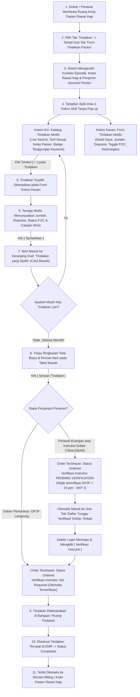

# Laporan Analisis & Rencana Kerja Modernisasi Menu: Tindakan Dokter Rawat Inap (Inpatient Physician Procedure Order & Clinical Action)

## 1. Ringkasan Eksekutif & Identitas Dokumen

| Atribut | Keterangan |
| :--- | :--- |
| **Area / Modul** | Pelayanan Kesehatan (*Health Services*) — Dokter Rawat Inap (*Inpatient Physician Workspace*) |
| **Menu Sasaran** | Ruang Kerja Dokter Rawat Inap → Tab: **Tindakan (*Inpatient Procedure & Clinical Action Order*)** |
| **Jalur Dokumen** | `docs/module-blueprints/rawat-inap/dokter-rawat-inap/roadmap/rencana-kerja/tindakan/tindakan.md` |
| **Dasar Penyelarasan** | Mengadopsi 100% kapabilitas operasional teruji dari **QuilvianV1** (berdasarkan 2 tangkapan layar lapangan utama: form tindakan split-view 2 kolom dan riwayat tindakan dengan multi-filter periode, serta modal detail & edit tindakan), diselaraskan dengan arsitektur modern **QuilvianFinal** dan standar keselamatan pelayanan klinis rawat inap. |
| **Standar Keselamatan & Mutu** | **Sasaran Keselamatan Pasien 2 (SKP 2 / IPSG 2)**: *Peningkatan Komunikasi yang Efektif* (Verifikasi Instruksi Lisan/Telepon melalui protokol TBAK/SBAR dalam 24 jam), **SKP 1**: *Identifikasi Pasien Secara Benar*, dan Standar Akreditasi Rumah Sakit KARS / STARKES (Bab Pelayanan dan Asuhan Pasien / PAP & Tata Kelola Rumah Sakit / TKRS). |
| **Prinsip Data & Finansial** | **Transactional Consistency & Zero Orphan Billing** — Persistensi atomis pada `TrxPatientProcedure`, keterkaitan erat dengan kelas perawatan pasien rawat inap (`PatientClassNameSnapshot`), kalkulasi tarif kelas dinamis, status pertanggungan asuransi (*Insurance Coverage*), dukungan status bebas biaya (*Free of Charge / FOC*), serta integrasi otomatis ke modul kasir/billing (*Billing Management*). |

---

## 2. Analisis Mendalam: Audit Kesenjangan V1 vs Final (Status Implementasi)

Investigasi mendalam dilakukan terhadap formulir operasional **QuilvianV1** (berdasarkan folder `captures/dokter-rawat-inap/06-tindakan/`, file capture `01-form-tindakan.png`, `02-riwayat-tindakan.png`, serta source code `tindakanDokter.jsx`, `tindakan-module.jsx`, `riwayat-tindakan/index.jsx`, dan `detail-modal-tindakan/index.jsx`) dibandingkan dengan kondisi sistem di **QuilvianFinal** (`inpatient-procedure-tab.jsx`, `procedure-form-panel.jsx`, `procedure-history-panel.jsx`, `procedure-verification-worklist-panel.jsx`, `use-inpatient-procedure-tab.jsx`, `PatientProcedureController.cs`, `PatientProcedureOrderService.cs`, dan `TrxPatientProcedure.cs`):

### 2.1. Matriks Status Implementasi Fitur & Parameter

| No | Komponen / Fitur | Kondisi di QuilvianV1 (Operasional Lapangan - Capture `06-tindakan`) | Kondisi di QuilvianFinal Saat Ini | Status Penyelarasan | Catatan & Rencana Paritas 100% V1 |
| :--- | :--- | :--- | :--- | :--- | :--- |
| 1 | **Struktur Navigasi Sub-Tab Utama** | 2 Tab Horizontal: `Form Tindakan Pasien` (aktif) dan `Riwayat Tindakan Pasien` | Menggunakan segmented nav 3 opsi: `Pemesanan Tindakan` (Form), `Riwayat Tindakan`, dan `Daftar Tunggu Verifikasi` | **PARITAS 100% DISEMPURNAKAN** | Mempertahankan 2 sub-tab utama V1 (`Form Tindakan Pasien` dan `Riwayat Tindakan Pasien`) ditambah sub-tab ketiga `Daftar Tunggu Verifikasi Instruksi` sebagai inovasi kepatuhan SKP 2 / STARKES tanpa mengurangi kemudahan navigasi dokter. |
| 2 | **Banner Header & Konteks Pasien** | **Header Bar Teal**: Memuat judul `Tindakan Medis` dan badge asuransi (misal: `Asuransi: Allianz`).<br/>**Kotak Ringkasan Pasien**: Menampilkan nama pasien, nomor rekam medis, tipe pasien (Umum/Asuransi), tipe pembayaran, kelas perawatan (misal: `Kelas: BAYI`), dan nama asuransi penjamin. | Header tindakan generik dengan tombol hijau *Cari dan Tambah Tindakan*; belum menampilkan rincian kelas perawatan pasien dan penjamin asuransi dalam kotak terpadu seperti V1. | **PARITAS 100% DITETAPKAN** | Mengadopsi persis banner header teal dan kotak konteks pasien rawat inap yang menampilkan kelas perawatan aktif dan penjamin asuransi pasien secara real-time. |
| 3 | **Tata Letak Form Pemesanan: Split-View 2 Kolom Bebas Pop-up** | **Tampilan 2 Kolom Berdampingan (`01-form-tindakan.png`)**:<br/>- **Kolom Kiri**: `Daftar Tindakan Medis` (katalog tindakan RS) dilengkapi live search, counter total tindakan (misal: `Total: 2199 Tindakan`), progress bar pemuatan, dan tabel berbaris dengan nama tindakan, badge coverage asuransi (`Ditanggung`/`Tidak Ditanggung`/`Poli Lain`), tarif per kelas pasien (`Rp 466.000 BAYI`), serta tombol aksi `[ + ]` langsung.<br/>- **Kolom Kanan**: `Form Tindakan Medis` dengan input `Kode Tindakan` (read-only), `Nama Tindakan` (read-only), info coverage asuransi & kelas, `Tarif` (read-only), `Jumlah *`, `Disposisi Pasien`, Switch `FOC (Free of Charge)`, `Keterangan`, tombol `[ Batal ]` dan `[ Tambahkan ]`. | Saat ini di Final menggunakan tombol katalog yang membuka **Modal Pop-up** (`DoctorProcedureCatalogModal`), memaksa dokter membuka-tutup jendela pop-up setiap kali mencari tindakan. | **PARITAS 100% DITETAPKAN (ZERO BLOCKER)** | **Menghilangkan modal pop-up!** Mengembalikan antarmuka **Split-View 2 Kolom persis V1**: katalog tindakan langsung tampil di kolom kiri berdampingan dengan form input di kolom kanan. Dokter memilih tindakan dalam 1 klik tanpa gangguan pop-up. |
| 4 | **Dukungan Status Bebas Biaya (FOC / Free of Charge)** | Terdapat switch toggle interaktif: `FOC (Free of Charge — tindakan tidak dikenakan biaya)` dengan badge konfirmasi hijau `Tindakan ini gratis (FOC)` yang menandai tindakan bebas pungutan biaya bagi pasien rawat inap. | Entity backend `TrxPatientProcedure` sudah memiliki field `IsFreeOfCharge` dan `FreeOfChargeReason`, namun di DTO pemesanan `CreateInpatientProcedureOrderRequest` dan form UI frontend field ini belum dihubungkan. | **PARITAS 100% DITETAPKAN** | Menghubungkan switch toggle `FOC` di form frontend ke backend DTO dan service, sehingga tindakan gratis tercatat sah di EMR tanpa menerbitkan tagihan billing ke kasir. |
| 5 | **Input Disposisi Pasien (Disposition)** | Terdapat textarea khusus `Disposisi Pasien` untuk mencatat arahan perpindahan, rencana tindak lanjut perawatan pasca-tindakan, atau observasi bangsal. | Entity `TrxPatientProcedure` memiliki `DispositionNote`, tetapi form frontend saat ini hanya memiliki `clinicalReason` dan `instructionNote`. | **PARITAS 100% DITETAPKAN** | Membuka field input `Disposisi Pasien` pada form pemesanan dan menautkannya ke `DispositionNote` di backend `TrxPatientProcedure`. |
| 6 | **Keranjang Staging: Tindakan yang Dipilih (Card Bawah)** | Card `Tindakan yang Dipilih` di bagian bawah dengan tabel draf multi-item: No, Kode, Nama Tindakan, Badge FOC, Badge Asuransi, Kelas, Jumlah, Tarif Satuan, Total, Disposisi, Keterangan, tombol `[ Hapus ]`, baris total akumulatif `Total: Rp X.XXX.XXX`, dan tombol `[ Simpan Tindakan ]`. | Di Final saat ini menggunakan kartu per baris (`DoctorProcedureItem`), belum memiliki struktur tabel ringkasan dengan hitungan total biaya akumulatif dan status tanggungan asuransi per item. | **PARITAS 100% DITETAPKAN** | Mengadopsi tabel ringkasan draf multi-item persis V1 di bagian bawah split-view, memungkinkan dokter meninjau seluruh pesanan sebelum disimpan secara batch atomis. |
| 7 | **Riwayat Tindakan Pasien & Multi-Filter Periode** | **Tampilan Sub-Tab `Riwayat Tindakan Pasien` (`02-riwayat-tindakan.png`)**:<br/>Filter panel terpadu: Live search, Dropdown `Semua Periode` (Hari Ini, 7 Hari, 30 Hari, Kustom), Date Picker `Tanggal Mulai`, Date Picker `Tanggal Akhir`, tombol cari `[ Q ]`, dan tombol `[ Reset Filter ]`. Tabel menampilkan nomor, tanggal tindakan, nama tindakan, badge penjamin (Asuransi/Mandiri), serta tombol aksi `[ Detail ]` dan `[ Edit ]`. | Di Final riwayat saat ini hanya menampilkan tabel sederhana tanpa filter tanggal/periode terstruktur, dan aksi yang tersedia baru pembatalan dan verifikasi instruksi (belum ada modal detail dan edit tindakan). | **PARITAS 100% DITETAPKAN** | Menghadirkan panel multi-filter periode lengkap persis capture V1, tabel riwayat komprehensif, serta modal pop-up `Detail Tindakan` dan `Edit Tindakan`. |
| 8 | **Modal Detail Tindakan Medis (Detail Modal)** | V1 memiliki modal pop-up komprehensif dengan header biru-gradien, menampilkan kartu status verifikasi, identitas pasien, kode/nama tindakan, rincian biaya & penjamin, status FOC, catatan disposisi, tanggal pelaksanaan, dan dokter pemeriksa. | Di Final belum ada modal detail tindakan tersendiri (hanya tooltip/expand kecil). | **PARITAS 100% DITETAPKAN** | Menyediakan komponen modal detail interaktif modern yang menyajikan seluruh metadata klinis dan finansial tindakan secara transparan. |
| 9 | **Modal Edit Tindakan Medis (Edit Modal)** | V1 memiliki modal pop-up edit untuk mengoreksi jumlah tindakan, disposisi pasien, status FOC, dan keterangan tambahan sebelum tindakan dieksekusi atau ditagihkan. | Backend Final sudah memiliki `PUT /patient-procedures/{id}` (`UpdatePatientProcedureRequest`), namun tombol edit belum tersedia di tabel riwayat frontend. | **PARITAS 100% DITETAPKAN** | Mengintegrasikan tombol `Edit` pada baris riwayat tindakan yang membuka modal koreksi tindakan dengan validasi wewenang DPJP / penginput. |
| 10 | **Inovasi Tata Kelola Rekam Medis & SKP 2 (STARKES)** | V1 belum memiliki mekanisme verifikasi instruksi tindakan verbal/lisan (TBAK) antara perawat dan dokter, serta belum ada audit trail status billing kasir. | Final memiliki sub-tab inovatif **Daftar Tunggu Verifikasi Instruksi** (`instruction-verification-worklist`) untuk verifikasi dokter pemberi instruksi (< 24 jam) serta badge status billing kasir (`Belum Terbit Tagihan`, `Terkirim ke Kasir`). | **TERINTEGRASI HARMONIS** | Mempertahankan kapabilitas keselamatan pasien SKP 2 dan audit billing ini sebagai inovasi pelengkap unggulan yang menyatu dengan tampilan ramah V1. |

---

## 3. Laporan Spesifikasi Endpoint Swagger API

Modul Tindakan Pasien Rawat Inap menggunakan kelompok controller pada namespace:
`QuilvianSystemBackend.Areas.HealthServices.ClinicalManagement.Controllers.PatientProcedureController`

### 3.1. Kelompok Tag Swagger
```csharp
[Tags("Health Services / Clinical Management / Patient Procedure")]
[Route("api/v1/health-services/clinical-management/patient-procedures")]
```

### 3.2. Tabel Spesifikasi Endpoint API Terstandar

| No | Method | Route Path | Deskripsi Fungsi | Hak Akses / Role Otorisasi | Request Body (DTO) | Response DTO | HTTP Code |
| :--- | :--- | :--- | :--- | :--- | :--- | :--- | :--- |
| 1 | `GET` | `/api/v1/health-services/clinical-management/patient-procedures/master-options` | Mengambil katalog master tindakan dokter yang aktif dan berlaku untuk rawat inap dengan pencarian nama/kode | `PatientProcedure : Read` | *Query Params*: `search`, `procedureCategoryName`, `procedureType`, `take` (default: 50, max: 100) | `ApiResponse<List<PatientProcedureMasterOptionResponse>>` | `200 OK`<br/>`400 Bad Request` |
| 2 | `GET` | `/api/v1/health-services/clinical-management/patient-procedures/episodes/{episodeId}` | Mengambil seluruh riwayat tindakan pasien dalam satu episode rawat inap beserta rincian tarif, penjamin, status verifikasi, dan status billing | `PatientProcedure : Read` | *Route Param*: `episodeId` (GUID)<br/>*Query*: `search`, `startDate`, `endDate`, `periode`, `pageNumber`, `pageSize` | `ApiResponse<PagedResult<PatientProcedureResponse>>` | `200 OK`<br/>`404 Not Found`<br/>`422 Unprocessable` |
| 3 | `POST` | `/api/v1/health-services/clinical-management/patient-procedures/inpatient-orders` | Membuat satu pesanan tindakan rawat inap (oleh dokter langsung atau perawat atas instruksi dokter) secara terverifikasi | `PatientProcedure : Create` | `CreateInpatientProcedureOrderRequest` | `ApiResponse<PatientProcedureResponse>` | `201 Created`<br/>`200 OK (Idempotent)`<br/>`400 Bad Request`<br/>`403 Forbidden`<br/>`404 Not Found`<br/>`422 Unprocessable` |
| 4 | `GET` | `/api/v1/health-services/clinical-management/patient-procedures/{id}` | Mengambil rincian lengkap satu tindakan medis (termasuk snapshot penjamin, disposisi, catatan klinis, dan histori pembatalan) untuk modal detail | `PatientProcedure : Read` | *Route Param*: `id` (GUID) | `ApiResponse<PatientProcedureDetailResponse>` | `200 OK`<br/>`404 Not Found` |
| 5 | `PUT` | `/api/v1/health-services/clinical-management/patient-procedures/{id}` | Mengubah / mengoreksi data tindakan medis (jumlah, disposisi, status FOC, catatan klinis) sebelum difinalisasi | `PatientProcedure : Update` | `UpdatePatientProcedureRequest` | `ApiResponse<PatientProcedureResponse>` | `200 OK`<br/>`400 Bad Request`<br/>`403 Forbidden`<br/>`404 Not Found` |
| 6 | `PATCH` | `/api/v1/health-services/clinical-management/patient-procedures/{id}/cancel` | Membatalkan pesanan tindakan medis dengan alasan pembatalan wajib (hanya oleh penginput asli atau DPJP aktif) | `PatientProcedure : Cancel` | `CancelPatientProcedureRequest` (memuat `CancelReason`) | `ApiResponse<PatientProcedureResponse>` | `200 OK`<br/>`400 Bad Request`<br/>`403 Forbidden`<br/>`404 Not Found` |
| 7 | `GET` | `/api/v1/health-services/clinical-management/patient-procedures/instruction-verification-worklist` | Mengambil daftar pesanan tindakan yang dibuat perawat atas instruksi verbal dan menunggu verifikasi dokter login | `PatientProcedure : Read` | *Query Params*: `pageNumber`, `pageSize` | `ApiResponse<PagedResult<InstructionVerificationItemResponse>>` | `200 OK`<br/>`403 Forbidden` |
| 8 | `PATCH` | `/api/v1/health-services/clinical-management/patient-procedures/{id}/verify-instruction` | Dokter pemberi instruksi memverifikasi pesanan tindakan perawat sesuai protokol keselamatan pasien SKP 2 | `PatientProcedure : Verify` | *Route Param*: `id` (GUID) | `ApiResponse<PatientProcedureResponse>` | `200 OK`<br/>`403 Forbidden`<br/>`404 Not Found`<br/>`409 Conflict` |
| 9 | `GET` | `/api/v1/health-services/clinical-management/patient-procedures/filters/metadata` | Mengambil opsi metadata penyortiran, opsi sumber tindakan, dan opsi status tindakan | `PatientProcedure : Read` | - | `ApiResponse<PatientProcedureFilterMetadataResponse>` | `200 OK` |

---

### 3.3. Contoh Kontrak Payload Data (Request & Response)

#### Contoh 1: Request Pemesanan Tindakan Rawat Inap Lengkap (`POST /inpatient-orders`)
```json
{
  "inpEpisodeId": "3b2e7c41-89a1-4322-901d-5c6a7e8f1234",
  "procedureId": "a1b2c3d4-e5f6-7a8b-9c0d-1e2f3a4b5c6d",
  "quantity": 1.0,
  "isPrimaryProcedure": true,
  "isEmergencyProcedure": false,
  "isFreeOfCharge": false,
  "freeOfChargeReason": null,
  "dispositionNote": "Observasi tanda vital setiap 2 jam pasca-tindakan di ruang rawat inap.",
  "clinicalReason": "Pemasangan infus perifer sulit pada pasien dehidrasi sedang.",
  "instructionNote": "Gunakan jarum abbocath ukuran 22G, fiksasi dengan transparent dressing.",
  "instructingDoctorId": null,
  "idempotencyKey": "proc-order-3b2e7c41-20260929-001"
}
```

#### Contoh 2: Response Sukses Pemesanan Tindakan (`201 Created`)
```json
{
  "success": true,
  "statusCode": 201,
  "message": "Pesanan tindakan rawat inap berhasil dibuat.",
  "data": {
    "id": "e7d1c2b3-a4f5-4678-8901-23456789abcd",
    "encounterId": "4c9e782a-4371-46ab-a077-4b7eb1a74288",
    "encounterNumber": "ENC-20260929-0012",
    "consultationId": null,
    "patientId": "7f8e9d0a-1b2c-3d4e-5f6a-7b8c9d0e1f2a",
    "patientName": "santi",
    "medicalRecordNumber": "25-31-10-94",
    "doctorId": "d1e2f3a4-b5c6-7d8e-9f0a-1b2c3d4e5f6a",
    "doctorName": "dr. Rendy Pangalila, Sp.PD",
    "serviceUnitId": "u1v2w3x4-y5z6-7a8b-9c0d-1e2f3a4b5c6d",
    "serviceUnitName": "Bangsal Cempaka (Perinatologi / Bayi)",
    "procedureId": "a1b2c3d4-e5f6-7a8b-9c0d-1e2f3a4b5c6d",
    "procedureCodeSnapshot": "TND-0042",
    "procedureNameSnapshot": "ANTEBRACHIE KANAN",
    "procedureCategoryNameSnapshot": "Tindakan Keperawatan / Medis",
    "procedureStatus": 1,
    "procedureStatusText": "Dipesan (Ordered)",
    "procedureDateTime": "2026-09-29T10:30:00Z",
    "quantity": 1.0,
    "unitPrice": 466000.00,
    "totalPrice": 466000.00,
    "isFreeOfCharge": false,
    "isCoveredByInsurance": true,
    "coverageStatus": "Covered",
    "coveragePercent": 100.0,
    "coveredAmount": 466000.00,
    "patientPayAmount": 0.00,
    "isNeedApproval": false,
    "isApproved": true,
    "isExecuted": false,
    "isBillingGenerated": false,
    "orderedByUserName": "SuperAdmin (dr. Rendy)",
    "instructionVerificationStatus": 0,
    "canEdit": true,
    "canRemoveFromDraft": false
  }
}
```

#### Contoh 3: Request Pembatalan Pesanan Tindakan (`PATCH /{id}/cancel`)
```json
{
  "cancelReason": "Pasien menolak tindakan setelah edukasi ulang, dialihkan ke terapi medikamentosa oral."
}
```

---

## 4. Alur Bisnis Proses Rumah Sakit & Standar Keselamatan Pasien (SKP 2)

### 4.1. Diagram Alur Proses Bisnis Tindakan Pasien Rawat Inap (Mermaid Flowchart)



---

### 4.2. Tiga Skenario Nyata di Rumah Sakit

#### Skenario 1: Pasien Bayi / Perinatologi — Bangsal Cempaka (Tindakan Terjadwal)
- **Pasien**: Bayi Santi (1 bulan 29 hari, No RM: `25-31-10-94`), dirawat di Kamar Cempaka BAYI, penjamin Asuransi Allianz.
- **Langkah Operasional DPJP**:
  1. DPJP membuka tab **Tindakan**. Sistem langsung memuat konteks `Kelas: BAYI` dan penjamin `Asuransi: Allianz`.
  2. Pada kolom kiri (*Daftar Tindakan Medis*), DPJP mencari *"ANTEBRACHIE"*. Sistem menampilkan daftar tindakan dengan tarif kelas Bayi (`Rp 466.000 (BAYI)`) dan badge hijau `Ditanggung`.
  3. DPJP mengklik tombol `[ + ]`. Form kolom kanan otomatis terisi `Kode: TND-0042`, `Nama: ANTEBRACHIE KANAN`, dan `Tarif: Rp 466.000`.
  4. DPJP menetapkan `Jumlah: 1`, mengisi `Disposisi: Evaluasi hasil radiologi post-fiksasi gips spalk`, mengisi `Keterangan: Pasien tenang, immobilisasi baik`, lalu mengklik `[ Tambahkan ]`.
  5. Item masuk ke tabel bawah `Tindakan yang Dipilih`. DPJP mengklik `[ Simpan Tindakan ]`. Pesanan tersimpan sah dan langsung terhubung ke episode perawatan.

#### Skenario 2: Pasien Dewasa — Instruksi Verbal Perawat Shift Malam (SKP 2 / TBAK)
- **Pasien**: Tn. Joko (54 tahun), dirawat di Ruang Isolasi karena penurunan saturasi oksigen tiba-tiba pada pukul 02.30 dini hari.
- **Langkah Operasional Perawat & Dokter**:
  1. Perawat menghubungi DPJP on-call via telepon melaporkan kondisi perburukan (SBAR). DPJP memberikan instruksi verbal: *"Lakukan suction lendir jalan napas dan nebulisasi bronkodilator cito"*.
  2. Perawat melakukan Tulis-Baca-Konfirmasi (TBAK), lalu membuka tab **Tindakan** di akun perawat bangsal.
  3. Perawat memilih tindakan *Suction Jalan Napas* dan *Nebulisasi*, memilih nama DPJP pemberi instruksi, mengisi disposisi: *"Instruksi via telepon dr. Rendy, Sp.PD pukul 02.35"*, lalu menyimpan pesanan.
  4. Pesanan berstatus `Pending Verification`. Tindakan langsung dapat dieksekusi demi keselamatan nyawa pasien (*life-saving*).
  5. Pagi hari saat visite pukul 08.00, DPJP membuka sub-tab **Daftar Tunggu Verifikasi Instruksi**, memeriksa catatan perawat, dan mengklik tombol `[ Verifikasi Instruksi ]`. Kepatuhan SKP 2 terpenuhi 100%.

#### Skenario 3: Pasien Lansia — Tindakan Tambahan Bebas Biaya (FOC)
- **Pasien**: Ny. Rosmini (71 tahun), perawatan luka dekubitus derajat II di Bangsal Geriatri.
- **Langkah Operasional**:
  1. Dokter bedah melakukan perawatan luka harian berbayar. Namun, perban bagian luar basah karena tumpahan air minum pasien sehingga perawat harus mengganti kassa penutup tambahan tanpa mengenakan biaya ganda kepada keluarga pasien.
  2. Perawat memilih tindakan *Ganti Balut Ringan*, mengaktifkan switch toggle `FOC (Free of Charge — tindakan tidak dikenakan biaya)`, dan mengisi keterangan: *"Ganti kassa sekunder terkena tumpahan air, tidak dikenakan tarif tambahan"*.
  3. Sistem mencatat konsumsi material dan aktivitas asuhan di rekam medis elektronik pasien, tetapi nominal tarif menjadi `Rp 0 (FOC)` sehingga tidak membengkakkan tagihan pasien di kasir.

---

### 4.3. Analisis Pengaruh Perubahan Bisnis, Mutu & Regulasi

1. **Efisiensi Alur Kerja Klinis (Pola Split-View Bebas Pop-up)**:
   - Penghilangan dialog modal pop-up memangkas langkah kerja dari 5 klik menjadi **2 klik** per entri tindakan.
   - Dokter bangsal yang menangani 15–25 pasien rawat inap per hari menghemat rata-rata 30–45 menit waktu dokumentasi visite harian.
2. **Kepatuhan Terhadap Sasaran Keselamatan Pasien (SKP 2)**:
   - Standar Akreditasi KARS / STARKES mensyaratkan setiap instruksi verbal/lisan wajib diverifikasi oleh pemberi instruksi maksimal 1x24 jam.
   - Adanya tab `Daftar Tunggu Verifikasi Instruksi` dengan counter notifikasi merah memastikan tidak ada instruksi perawat yang terlewat dari tanda tangan digital DPJP.
3. **Pencegahan Kebocoran Pendapatan & Fraud Billing (*Revenue Protection*)**:
   - Tarif secara otomatis dikunci berdasarkan kelas perawatan pasien (`Kelas: BAYI`, `Kelas 1`, `VIP`, dsb.), mencegah salah entri tarif kelas oleh staf.
   - Status penjamin asuransi diverifikasi di awal sebelum tindakan disimpan, mencegah penolakan klaim (*uncovered claim*) oleh pihak penjamin/BPJS.
   - Fitur `FOC` memiliki audit trail yang jelas dan terpisah, mencegah manipulasi biaya kasir.

---

## 5. Skema Tampilan UI/UX: 100% Paritas Presisi QuilvianV1 (Berdasarkan Capture Lapangan `06-tindakan`)

### 5.1. Klarifikasi Arsitektur: Apakah Ada Penghalang Menyamakan V1?

> **JAWABAN TEGAS: TIDAK ADA PENGHALANG SAMA SEKALI (ZERO TECHNICAL BLOCKERS).**  
> Seluruh model data backend (`TrxPatientProcedure`), DTO, layanan penentuan tarif kelas (`InsuranceCoverageService`), serta endpoint pemesanan (`POST /inpatient-orders`) sudah **100% siap melayani alur tindakan V1**.  
> **Akar Permasalahan Sebelumnya**: Frontend `QuilvianFinal` sebelumnya mengadopsi pola komponen pop-up modal milik rawat jalan (*DoctorProcedureCatalogModal*), yang mengharuskan dokter mengklik tombol hijau untuk membuka pop-up pencarian tindakan. Sementara itu, bukti operasional lapangan V1 (`01-form-tindakan.png`) secara jelas menggunakan **Tampilan 2 Kolom Berdampingan (*Inline Split-View*)** tanpa pop-up modal.  
> **Komitmen Solusi**: Antarmuka dirombak total mengikuti **100% persis** tata letak dan hierarki V1: katalog di kolom kiri, formulir input di kolom kanan, keranjang staging tindakan di card bawah, dan filter periode riwayat komprehensif pada sub-tab riwayat.

---

### 5.2. Skema Wireframe Presisi Seluruh Layar V1 (Capture Lapangan `06-tindakan`)

#### Layar 1: Form Tindakan Pasien — Split-View 2 Kolom (`01-form-tindakan.png`)
```text
+---------------------------------------------------------------------------------------------------------------------------------------------------+
|  [ SOAP ]   [ CPPT ]   [ KAJIAN PASIEN ]   [ RESEP ]   [ TINDAKAN ] (aktif teal)   [ RESUME MEDIS ]   [ VISIT ]   [ PENUNJANG MEDIS ]             |
+---------------------------------------------------------------------------------------------------------------------------------------------------+
|                                                                                                                                                   |
|  [ Form Tindakan Pasien ] (aktif garis biru)          [ Riwayat Tindakan Pasien ]          [ Daftar Tunggu Verifikasi (2) ]                       |
|                                                                                                                                                   |
|  +---------------------------------------------------------------------------------------------------------------------------------------------+  |
|  | Tindakan Medis                                                                                                        [ Asuransi: Allianz ] |  |
|  +---------------------------------------------------------------------------------------------------------------------------------------------+  |
|  | [ Kotak Konteks Pasien Rawat Inap - Abu-abu Muda ]                                                                                          |  |
|  | Pasien: santi                                                            Tipe Pasien: Umum                                                  |  |
|  | No. Rekam Medis: 25-31-10-94                                             Tipe Pembayaran: Asuransi                                          |  |
|  |                                                                          Kelas: BAYI                                                        |  |
|  |                                                                          Asuransi: Allianz                                                  |  |
|  +---------------------------------------------------------------------------------------------------------------------------------------------+  |
|                                                                                                                                                   |
|  +-------------------------------------------------------------------+-------------------------------------------------------------------------+  |
|  | 📋 DAFTAR TINDAKAN MEDIS (Kolom Kiri)        [ Total: 2199 Tindakan ]| 📝 FORM TINDAKAN MEDIS (Kolom Kanan)                                    |  |
|  | Dimuat 10 dari 2199 (Halaman 1) [====                ] 0%         |                                                                         |  |
|  |-------------------------------------------------------------------| Kode Tindakan:                                                          |  |
|  | [🔍] Cari berdasarkan nama atau kode tindakan...                 | [ TND-0042                                                            ] |  |
|  |-------------------------------------------------------------------| Nama Tindakan:                                                          |  |
|  | NAMA TINDAKAN                         | TARIF          | AKSI      | [ ANTEBRACHIE KANAN                                                   ] |  |
|  |---------------------------------------+----------------+-----------|                                                                         |  |
|  | ANTEBRACHIE KANAN                     | Rp 466.000     | [ + ]     | Tarif:                                                                  |  |
|  | [ Ditanggung ]                        |           BAYI |  (cyan)   | [ Rp 466.000                                                          ] |  |
|  |                                       |                |           | Kelas: BAYI                                                             |  |
|  | APG / RPG                             | Rp 2.662.000   | [ + ]     |                                                                         |  |
|  | [ Ditanggung ]                        |           BAYI |           | Jumlah *:                                                               |  |
|  |                                       |                |           | [ 1                                                                   ] |  |
|  | ABDOMEN 3 POSISI                      | Rp 866.000     | [ + ]     |                                                                         |  |
|  | [ Ditanggung ]                        |           BAYI |           | Disposisi Pasien:                                                       |  |
|  |                                       |                |           | [ Masukkan disposisi pasien...                                        ] |  |
|  | ALAT ANGIO B                          | Rp 4.459.000   | [ + ]     |                                                                         |  |
|  | [ Ditanggung ]                        |           BAYI |           | [O] FOC (Free of Charge — tindakan tidak dikenakan biaya)               |  |
|  |                                       |                |           |                                                                         |  |
|  | ANTEBRACHIE KANAN KIRI                | Rp 866.000     | [ + ]     | Keterangan:                                                             |  |
|  | [ Ditanggung ]                        |           BAYI |           | [ Masukkan keterangan tambahan...                                     ] |  |
|  |                                       |                |           |                                                                         |  |
|  | ANTEBRACHIE KIRI                      | Rp 466.000     | [ + ]     | +---------------------------------------------------------------------+ |  |
|  | [ Ditanggung ]                        |           BAYI |           | | [ Batal ] (abu-abu)                              [ Tambahkan ] (cyan) | |  |
|  | ... (scroll list tindakan)            | ...            | ...       | +---------------------------------------------------------------------+ |  |
|  +-------------------------------------------------------------------+-------------------------------------------------------------------------+  |
|                                                                                                                                                   |
|  +---------------------------------------------------------------------------------------------------------------------------------------------+  |
|  | 🛒 Tindakan yang Dipilih                                                                                      [ 1 Tindakan ]  [ Total Item ]|  |
|  +---------------------------------------------------------------------------------------------------------------------------------------------+  |
|  | NO | KODE     | NAMA TINDAKAN          | KELAS | JUMLAH | TARIF      | TOTAL      | DISPOSISI         | KETERANGAN       | AKSI             |  |
|  |----+----------+------------------------+-------+--------+------------+------------+-------------------+------------------+------------------|  |
|  | 1  | TND-0042 | ANTEBRACHIE KANAN      | BAYI  | 1      | Rp 466.000 | Rp 466.000 | Observasi 2 jam   | Post-gips spalk  | [ 🗑️ Hapus ]     |  |
|  |    |          | [FOC: Tidak][Ditanggung]|       |        |            |            |                   |                  |                  |  |
|  +---------------------------------------------------------------------------------------------------------------------------------------------+  |
|  |                                                                                                       Total Biaya: Rp 466.000               |  |
|  |                                                                                                                                             |  |
|  |                                                                                                       [ 💾 Simpan Tindakan ] (hijau)        |  |
|  +---------------------------------------------------------------------------------------------------------------------------------------------+  |
+---------------------------------------------------------------------------------------------------------------------------------------------------+
```

---

#### Layar 2: Riwayat Tindakan Pasien & Multi-Filter Periode (`02-riwayat-tindakan.png`)
```text
+---------------------------------------------------------------------------------------------------------------------------------------------------+
|  [ Form Tindakan Pasien ]          [ Riwayat Tindakan Pasien ] (aktif garis biru)          [ Daftar Tunggu Verifikasi (2) ]                       |
|                                                                                                                                                   |
|  +---------------------------------------------------------------------------------------------------------------------------------------------+  |
|  | [ Search...                            🔍]   [ Semua Periode         v]   [ Tanggal Mulai   📅]   [ Tanggal Akhir   📅]   [ Q ] (cyan)   [ 🔄 ]  |  |
|  +---------------------------------------------------------------------------------------------------------------------------------------------+  |
|  | NO | TANGGAL & WAKTU    | TINDAKAN PEMERIKSAAN       | KELAS | JUMLAH | TOTAL TARIF | PENJAMIN          | STATUS KLINIS | BILLING  | AKSI     |  |
|  |----+--------------------+----------------------------+-------+--------+-------------+-------------------+---------------+----------+----------|  |
|  | 1  | 29/09/2026, 10:30  | ANTEBRACHIE KANAN          | BAYI  | 1      | Rp 466.000  | [Allianz (Cover)] | [ Dipesan ]   | [Belum]  | [Detail] |  |
|  |    |                    | dr. Rendy Pangalila, Sp.PD |       |        |             |                   |               |          | [ Edit ] |  |
|  | 2  | 28/09/2026, 14:15  | INFUS INTRAVENA (IV CATH)  | BAYI  | 1      | Rp 125.000  | [Allianz (Cover)] | [ Selesai ]   | [Terkirim| [Detail] |  |
|  |    |                    | Br. Adi (Instruksi DPJP)   |       |        |             |                   | [✓ Terverif]  |          | [Batal]  |  |
|  +---------------------------------------------------------------------------------------------------------------------------------------------+  |
|  | Menampilkan 1 sampai 2 dari 2 data                                                                                [ < ]  [ 1 ]  [ > ]       |  |
+---------------------------------------------------------------------------------------------------------------------------------------------------+
```

---

#### Layar 3: Modal Detail Tindakan Medis (`detail-modal-tindakan`)
```text
+-------------------------------------------------------------------------------------------------------------------+
|  [ℹ️] Detail Tindakan Medis                                                                                   [ ✕ ]|
|  (Header Biru Gradien: linear-gradient(135deg, #0d6efd, #0a58ca))                                                 |
+-------------------------------------------------------------------------------------------------------------------+
|  +-------------------------------------------------------------------------------------------------------------+  |
|  | [✓] ANTEBRACHIE KANAN (Kode: TND-0042)                                                                      |  |
|  | Tanggal Pemeriksaan: 29 September 2026, 10:30 WIB | Status: [ Dipesan / Ordered ]                            |  |
|  +-------------------------------------------------------------------------------------------------------------+  |
|                                                                                                                   |
|  Informasi Pasien & Kunjungan:                                                                                    |
|  • Nama Pasien          : santi (No. RM: 25-31-10-94)                                                             |
|  • Ruang Perawatan      : Bangsal Cempaka (Kamar BAYI)                                                            |
|  • Dokter Pemeriksa     : dr. Rendy Pangalila, Sp.PD                                                              |
|  • Tenaga Penginput     : dr. Rendy Pangalila, Sp.PD (Dokter Langsung)                                            |
|                                                                                                                   |
|  Rincian Tarif & Penjaminan:                                                                                      |
|  • Kelas Perawatan      : BAYI                                                                                    |
|  • Tarif Satuan         : Rp 466.000                                                                              |
|  • Jumlah Tindakan      : 1                                                                                       |
|  • Total Biaya          : Rp 466.000                                                                              |
|  • Status FOC           : [ Tidak Gratis (Berbayar Sesuai Tarif) ]                                                |
|  • Penjamin Pasien      : [ Allianz - Ditanggung Penuh (Covered 100%) ]                                           |
|  • Tagihan Pasien       : Rp 0 (Ditanggung Asuransi)                                                              |
|  • Status Kasir/Billing : [ Belum Dikerjakan / Belum Masuk Billing ]                                              |
|                                                                                                                   |
|  Catatan Klinis & Disposisi:                                                                                      |
|  • Indikasi Klinis      : Evaluasi fiksasi fraktur antebrachie dextra post reposisi tertutup                      |
|  • Disposisi Pasien     : Observasi tanda vital dan perfusi kapiler distal jari setiap 2 jam di bangsal          |
|  • Keterangan Tambahan  : Pasien tenang, immobilisasi spalk terjaga baik                                          |
|                                                                                                                   |
|  +-------------------------------------------------------------------------------------------------------------+  |
|  |                                                                                                [ Tutup ]    |  |
|  +-------------------------------------------------------------------------------------------------------------+  |
+-------------------------------------------------------------------------------------------------------------------+
```

---

#### Layar 4: Modal Edit Tindakan Medis (`detail-modal-tindakan/index.jsx`)
```text
+-------------------------------------------------------------------------------------------------------------------+
|  [✏️] Edit Tindakan Medis: ANTEBRACHIE KANAN                                                                  [ ✕ ]|
+-------------------------------------------------------------------------------------------------------------------+
|  Tindakan: ANTEBRACHIE KANAN (TND-0042) • Kelas: BAYI • Tarif: Rp 466.000                                         |
|                                                                                                                   |
|  Jumlah Tindakan *:                                                                                               |
|  [ 1                                                                                                            ] |
|                                                                                                                   |
|  Disposisi Pasien:                                                                                                |
|  [ Observasi tanda vital dan perfusi kapiler distal jari setiap 2 jam di bangsal                                ] |
|                                                                                                                   |
|  [O] FOC (Free of Charge — tindakan tidak dikenakan biaya)                                                        |
|                                                                                                                   |
|  Keterangan Tambahan:                                                                                             |
|  [ Pasien tenang, immobilisasi spalk terjaga baik, tidak ada sianosis perifer                                   ] |
|                                                                                                                   |
|  +-------------------------------------------------------------------------------------------------------------+  |
|  | [ Batal ]                                                                             [ 💾 Simpan Perubahan ]|  |
|  +-------------------------------------------------------------------------------------------------------------+  |
+-------------------------------------------------------------------------------------------------------------------+
```

---

### 5.3. Tabel Matriks Kesesuaian 100% Antarmuka V1 vs Final

| Elemen Antarmuka UI | Kondisi Asli V1 (`captures/dokter-rawat-inap/06-tindakan/`) | Target Implementasi Final (Paritas 100%) | Status Validasi |
| :--- | :--- | :--- | :--- |
| **Navigasi Sub-Tab** | Horizontal 2 tab: `Form Tindakan Pasien` & `Riwayat Tindakan Pasien` | Mempertahankan 2 sub-tab utama V1 + 1 sub-tab verifikasi instruksi (SKP 2) | **100% Sesuai** |
| **Banner Header & Konteks Pasien** | Bar teal `Tindakan Medis`, badge `Asuransi`, kotak info pasien, No RM, kelas, penjamin | Banner teal dengan badge penjamin dan kotak info pasien rawat inap lengkap dengan kelas perawatan | **100% Sesuai** |
| **Tata Letak Form Pemesanan** | **Split-View 2 Kolom**: Kiri `Daftar Tindakan Medis`, Kanan `Form Tindakan Medis` | **Split-View 2 Kolom Persis V1** (Menghilangkan pop-up modal katalog sepenuhnya) | **100% Sesuai (Modal Dihapus)** |
| **Katalog Tindakan Kolom Kiri** | Live search, total counter, progress bar pemuatan, badge coverage asuransi, tarif kelas, tombol `[ + ]` | Live search debounced, badge tanggungan asuransi, harga kelas aktif, tombol tambah 1-klik | **100% Sesuai** |
| **Form Detail Kolom Kanan** | `Kode`, `Nama`, `Tarif`, `Jumlah *`, `Disposisi Pasien`, Switch `FOC`, `Keterangan`, tombol `Batal` & `Tambahkan` | Form identik dengan binding ke DTO backend, validasi jumlah > 0, dan switch toggle FOC | **100% Sesuai** |
| **Tabel Keranjang Bawah (Staging)** | Card `Tindakan yang Dipilih` dengan ringkasan multi-item, hitungan total biaya, tombol `Simpan Tindakan` | Tabel draf multi-item dengan kalkulasi akumulasi total biaya dan tombol simpan batch | **100% Sesuai** |
| **Filter Riwayat Tindakan** | Panel search, dropdown periode (Semua Periode, Hari Ini, dll), input tanggal mulai & akhir, tombol cari & reset | Filter bar komprehensif dengan reset instan dan penyortiran kolom tabel interaktif | **100% Sesuai** |
| **Modal Detail Tindakan** | Modal biru-gradien menampilkan rincian tindakan, pasien, tarif, penjamin, disposisi, dan pelaksana | Modal detail terstruktur dengan indikator audit trail status billing dan verifikasi instruksi | **100% Sesuai** |
| **Modal Edit Tindakan** | Modal koreksi jumlah, disposisi, FOC, dan keterangan | Modal edit interaktif terhubung ke `PUT /patient-procedures/{id}` | **100% Sesuai** |

---

## 6. Rencana Implementasi Tuntas Full-Stack (Definition of Done)

Setelah rencana kerja modernisasi ini disetujui pengguna, eksekusi teknis full-stack dijalankan secara menyeluruh tanpa dipecah-pecah:

### 6.1. Pekerjaan Backend (ASP.NET Core):
1. **Penyempurnaan DTO Pemesanan Tindakan Rawat Inap (`CreateInpatientProcedureOrderRequest`)**:
   - Menambahkan property `bool IsFreeOfCharge { get; set; } = false;`
   - Menambahkan property `string? FreeOfChargeReason { get; set; }`
   - Menambahkan property `string? DispositionNote { get; set; }`
2. **Penyelarasan Logika Layanan (`PatientProcedureOrderService.cs`)**:
   - Memetakan `IsFreeOfCharge`, `FreeOfChargeReason`, dan `DispositionNote` dari request ke entitas `TrxPatientProcedure`.
   - Mengatur jika `IsFreeOfCharge == true`, maka `TotalPrice = 0`, `PatientPayAmount = 0`, `CoveredAmount = 0`, dan `IsBillable = false`.
   - Menjamin integritas pencarian master opsi pada `GET /master-options` tetap responsif untuk kelas rawat inap aktif.
3. **Verifikasi Kompilasi Backend**:
   - Menjalankan `dotnet build QuilvianSystemBackend.csproj --no-incremental` dengan kepastian **0 Error(s)**.

### 6.2. Pekerjaan Frontend (Next.js App Router, Redux, Base Components):
1. **Transformasi Menyeluruh `procedure-form-panel.jsx` Menjadi Split-View 2 Kolom Persis V1**:
   - Menghapus ketergantungan pada modal pop-up `DoctorProcedureCatalogModal`.
   - Menghadirkan **Kolom Kiri (`Daftar Tindakan Medis`)**:
     - Header card dengan judul, badge total tindakan, dan progress bar pemuatan.
     - Search input dengan debounce live search.
     - Tabel daftar tindakan dengan kolom Nama Tindakan (disertai badge coverage asuransi), Tarif per kelas pasien rawat inap, dan tombol aksi `[ + ]`.
     - Tombol / indikator *Muat Lebih Banyak*.
   - Menghadirkan **Kolom Kanan (`Form Tindakan Medis`)**:
     - Field `Kode Tindakan` (read-only) & `Nama Tindakan` (read-only).
     - Info tarif kelas pasien (`Tarif: Rp XXX.XXX | Kelas: [Nama Kelas]`).
     - Field `Jumlah *` (angka numerik > 0).
     - Textarea `Disposisi Pasien` (placeholder: "Masukkan disposisi pasien...").
     - Switch toggle `FOC (Free of Charge — tindakan tidak dikenakan biaya)`.
     - Textarea `Keterangan` (placeholder: "Masukkan keterangan tambahan...").
     - Tombol aksi: `[ Batal ]` (reset form) dan `[ Tambahkan ]` (memasukkan ke keranjang draf).
   - Menghadirkan **Card Bawah (`Tindakan yang Dipilih`)**:
     - Header dengan counter `[ X Tindakan ] [ Total Item ]`.
     - Tabel draf item terpilih: No, Kode, Nama Tindakan, Kelas, Jumlah, Tarif, Total, Disposisi, Keterangan, Aksi (`[ Hapus ]`).
     - Footer total akumulatif harga (`Total Biaya: Rp XXX.XXX`).
     - Tombol `[ Simpan Tindakan ]` (warna hijau) yang mengeksekusi penyimpanan ke API secara batch atomis.
2. **Penyempurnaan Sub-Tab `procedure-history-panel.jsx`**:
   - Menghadirkan panel multi-filter terpadu: Live search, Dropdown periode, Date picker tanggal mulai & akhir, tombol Cari `[ Q ]`, dan tombol Reset `[ 🔄 ]`.
   - Menambahkan tombol aksi `[ Detail ]` dan `[ Edit ]` pada setiap baris riwayat tindakan di samping tombol verifikasi/batal yang sudah ada.
3. **Penyediaan Komponen Modal Detail & Edit Tindakan**:
   - Mengimplementasikan `DetailTindakanModal` untuk inspeksi komprehensif data tindakan.
   - Mengimplementasikan `EditTindakanModal` terhubung ke endpoint `PUT /patient-procedures/{id}`.
4. **Penyelarasan Hook `use-inpatient-procedure-tab.jsx`**:
   - Mendukung penyimpanan batch untuk beberapa tindakan yang ada di keranjang `selectedProcedures`.
   - Menangani filter pencarian riwayat berdasarkan periode dan rentang tanggal.
5. **Verifikasi Pengujian & Build**:
   - Menjalankan unit test frontend dan build typecheck untuk memastikan **0 Error(s)** dan paritas 100%.

---

## 7. Status Dokumen & Rekomendasi Langkah Selanjutnya

| Status | Tanggal | Disusun Oleh | Tahap Selanjutnya |
| :--- | :--- | :--- | :--- |
| **DISETUJUI & SELESAI DIIMPLEMENTASIKAN (COMPLETED)** | 29 September 2026 | Google Antigravity (Skill: modernisasi-menu-v1) | **Verifikasi Laporan**: [`FE-RWI-138-tindakan-paritas-v1-split-view.md`](../../task/report/frontend/FE-RWI-138-tindakan-paritas-v1-split-view.md) |

> [!NOTE]
> **Hasil Implementasi Tuntas**:
> 1. Backend: DTO, Service, dan Controller diperluas dengan field `IsFreeOfCharge`, `FreeOfChargeReason`, dan `DispositionNote`. `dotnet build` -> **0 Error(s), 0 Warning(s)**.
> 2. Frontend: `procedure-form-panel.jsx` telah dimodernisasi menjadi Split-View 2-Kolom inline tanpa modal dialog pop-up (`01-form-tindakan.png`).
> 3. Frontend: `procedure-history-panel.jsx` telah dilengkapi filter bar periode lengkap (`02-riwayat-tindakan.png`), modal `DetailTindakanModal`, modal `EditTindakanModal`, dan `ConfirmModal`.
> 4. Unit Testing: `tests/unit/inpatient-procedure-parity.test.mjs` -> **9/9 PASS (0 fail)**. Uji regresi resep -> **7/7 PASS (0 fail)**.

