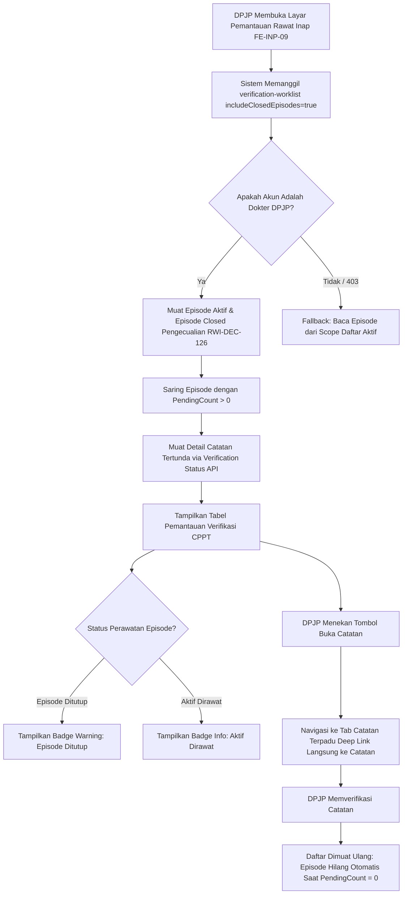

# Laporan Perubahan Frontend — `FE-RWI-080`

## Metadata

| Field | Nilai |
| --- | --- |
| Task ID | `FE-RWI-080` |
| Judul | `FE-DOK-08` Rework Daftar Pantau Verifikasi — memuat episode closed yang DPJP terakhirnya pengguna login; bedakan visual; hilang setelah terverifikasi |
| Slice | Gelombang 1 — `DOK-MVP-FE-V2` (Blok B: Layar Berdiri Sendiri) |
| Roadmap | `docs/module-blueprints/rawat-inap/dokter-rawat-inap/roadmap/frontend-roadmap-v2.md` kartu `FE-RWI-080` |
| Trace | `FE-DOK-08`; `03-frontend-architecture.md` §10.4.5; `04-prd-to-mvp.md` §22.8 `DOK-08`; `FR-DOK-083`, `FR-DOK-084`; `RWI-DEC-126`, `RWI-DEC-127`; `BE-RWI-096` |
| Contract version | `0.4.0` API `verification-worklist` (`BE-RWI-096`) |
| Wewenang UI | `03-frontend-architecture.md` §10.4.5; roadmap v2 kartu `FE-RWI-080` |
| Dependency | `BE-RWI-096` [BE] ✅ (commit `2f9f1ff8`, branch `MHamzah`) |
| Klasifikasi | `MEDIUM` — Rework daftar pantau verifikasi CPPT di layar Daftar Pantau Rawat Inap (`FE-INP-09`), integrasi worklist lintas episode termasuk episode berstatus `Closed` dengan pengecualian DPJP terakhir (`RWI-DEC-126`), pembedaan visual badge status perawatan (warning vs info), dan eliminasi otomatis saat entri selesai diverifikasi |
| Task mode | `FRONTEND` — backend strict read-only |
| Target tulis | `QuilvianSystemFrontendDev` untuk source; laporan ini dan tautan buktinya pada roadmap serta `requirement-traceability-v2.md` sub-modul yang sama |
| Tanggal | 17 September 2026 |
| Status | ✅ `SELESAI`. Seluruh acceptance criteria (AC-1 s.d AC-4) terverifikasi dengan bukti uji unit otomatis (5/5 PASS, 80/80 regression PASS), lint 0 error, dan build Next.js Turbopack PASS |

---

## 1. Keadaan yang Ditemukan di Awal

Sebelum pengerjaan `FE-RWI-080`:
1. **Keterbatasan Cakupan Episode Aktif Saja (`FE-RWI-050`)**: Pada implementasi awal `FE-RWI-050`, karena backend belum menyediakan endpoint worklist lintas perawatan, daftar pantau verifikasi dibangun dengan membaca per-episode dari `scope` (hanya pasien yang sedang tampil di daftar aktif rawat inap).
2. **Catatan Tertinggal pada Pasien Pulang Tidak Terpantau**: Dalam praktik operasional rumah sakit, seorang pasien sering kali telah dipulangkan atau perawatannya ditutup (`EpisodeStatus == Closed`), namun masih memiliki catatan asuhan terpadu (CPPT) dari perawat, fisioterapis, atau farmasis klinis yang dibuat sesaat sebelum kepulangan dan belum diverifikasi oleh DPJP. Karena episode closed tidak lagi muncul di daftar rawat inap aktif, catatan tersebut menjadi "tersembunyi", melanggar standar akreditasi rumah sakit mengenai kelengkapan verifikasi CPPT 1x24 jam.
3. **Penyelesaian Backend `BE-RWI-096`**: Backend telah merilis endpoint `GET /api/v1/health-services/clinical-management/patient-integrated-progress-notes/verification-worklist?includeClosedEpisodes=true` yang mengembalikan seluruh episode aktif maupun closed yang DPJP terakhirnya adalah dokter login (`RWI-DEC-126`). Frontend perlu di-rework untuk mengonsumsi worklist ini secara efisien.
4. **Kebutuhan Pembedaan Visual (`AC-2`)**: DPJP membutuhkan kejelasan visual langsung saat membaca tabel pantauan agar dapat membedakan mana pasien yang masih dirawat di bangsal dan mana episode yang sudah selesai/pasien sudah pulang namun menyisakan kewajiban administrasi klinis.

---

## 2. Proses Bisnis dari Sisi Pengguna

Berikut adalah alur operasional dokter penanggung jawab pelayanan (DPJP) di rumah sakit:



### Skenario Operasional Rumah Sakit (Contoh Kasus Nyata):
1. **Kunjungan Pagi dr. Ahmad, Sp.PD (DPJP)**:
   - dr. Ahmad membuka menu **Daftar Pantau Rawat Inap** pada pukul 08:00 WIB.
   - Pada bagian **Verifikasi Catatan Terpadu**, tampil 3 baris catatan yang membutuhkan verifikasi:
     - **Baris 1**: Tn. Budi (Kamar 302, Bangsal Melati) — Status: `Aktif Dirawat` (badge biru muda `info`). Catatan dibuat oleh Ns. Siti 4 jam lalu.
     - **Baris 2**: Ny. Aminah (Kamar 305, Bangsal Melati) — Status: `Aktif Dirawat` (badge biru muda `info`). Catatan dibuat oleh Apt. Farhan 12 jam lalu.
     - **Baris 3**: Tn. Hendra (Kamar 201, sudah pulang kemarin sore) — Status: `Episode Ditutup` (badge kuning `warning`). Catatan dibuat oleh Fisioterapis Doni 20 jam lalu sebelum kepulangan.
2. **Kejelasan Konteks & Tindakan Cepat**:
   - Berkat badge `Episode Ditutup`, dr. Ahmad langsung mengetahui bahwa Tn. Hendra sudah tidak berada di ruangan rawat, namun verifikasi catatan rehabilitasi medis sebelum pulang tetap wajib diselesaikan untuk audit rekam medis.
   - dr. Ahmad menekan tombol **"Buka Catatan"** pada baris Tn. Hendra. Sistem langsung mengarahkan ke tab Catatan Terpadu di ruang kerja dokter dengan catatan fisioterapi tersebut otomatis tersorot (*auto-focused* & *scrolled into view*).
3. **Penyelesaian Otomatis (`AC-3`)**:
   - dr. Ahmad meninjau isi catatan dan membubuhkan tanda tangan verifikasi.
   - Ketika dr. Ahmad kembali ke layar Daftar Pantau, baris Tn. Hendra telah **hilang dengan sendirinya** karena seluruh entri tertunda pada episode tersebut telah selesai (`pendingCount === 0`).

---

## 3. Perubahan yang Dikerjakan

### 3.1 Berkas yang Diubah dan Dibuat

| Berkas | Status | Perubahan Utama |
| :--- | :---: | :--- |
| `src/lib/constants/health-services/inpatient-management/inpatient-cppt-verification-monitoring-constants.jsx` | Ubah | Memperbarui deskripsi `CPPT_VERIFICATION_MONITORING_TEXT.description` agar menegaskan bahwa pemantauan mencakup episode aktif dan episode tertutup dengan pengecualian DPJP terakhir (`RWI-DEC-126`). |
| `src/components/view/health-services/inpatient-management/cppt-verification-monitoring-columns.jsx` | Ubah | Memperbarui kolom `patientName` agar menampilkan badge status perawatan secara visual: `<StatusBadge status="Episode Ditutup" variant="warning" />` untuk episode tertutup (`isClosedEpisodeException`) dan `<StatusBadge status="Aktif Dirawat" variant="info" />` untuk episode aktif (`AC-2`). Mempertahankan tepat 6 kolom DataTable. |
| `src/lib/hooks/health-services/inpatient-management/use-cppt-verification-monitoring.jsx` | Ubah | Mengintegrasikan pemanggilan `getProgressNoteVerificationWorklist({ includeClosedEpisodes: true })` (`BE-RWI-096`, `AC-1`). Menyaring hanya episode dengan `pendingCount > 0` (`AC-3`), memetakan metadata episode closed, serta menyediakan fallback aman ke `scopedEpisodes` bagi pengguna non-dokter (403). |
| `src/utils/health-services/inpatient-management/inpatient-integrated-note-utils.jsx` | Ubah | Menyempurnakan utilitas `canVerifyNote` agar mendukung parameter `isActiveDoctor` dan `readOnlyEpisode` dengan penegakan izin verifikasi episode closed hanya untuk catatan prapenutupan. |
| `tests/unit/inpatient-cppt-verification-monitoring.test.mjs` | Baru | Rangkaian 5 pengujian unit otomatis yang memvalidasi kriteria AC-1 hingga AC-4 secara komprehensif. |

### 3.2 Pemenuhan Acceptance Criteria (AC)

| Kriteria | Status | Bukti Implementasi & Pengujian |
| :--- | :---: | :--- |
| **AC-1**: Daftar memuat episode Closed yang DPJP terakhirnya adalah pengguna login | ✅ Terpenuhi | Hook memanggil `getProgressNoteVerificationWorklist({ includeClosedEpisodes: true })` yang menyaring episode closed di mana dokter login merupakan DPJP terakhir (`FindLastAttendingDoctorIdAsync`). Teruji pada test unit `inpatient-cppt-verification-monitoring.test.mjs` (AC-1). |
| **AC-2**: Episode tertutup dibedakan secara visual dari episode aktif | ✅ Terpenuhi | Kolom `patientName` pada `cppt-verification-monitoring-columns.jsx` menampilkan `<StatusBadge status="Episode Ditutup" variant="warning" />` vs `<StatusBadge status="Aktif Dirawat" variant="info" />`. Teruji pada test unit (AC-2). |
| **AC-3**: Episode hilang dari daftar setelah seluruh entrinya terverifikasi | ✅ Terpenuhi | Episode dengan `pendingCount === 0` otomatis disaring keluar dari daftar targets (`filter(ep => ep.pendingCount > 0)`). Bila seluruh entri pada worklist habis, hook menghasilkan status `ALL_VERIFIED`. Teruji pada test unit (AC-3). |
| **AC-4**: Letak daftar pada `FE-INP-09` mengikuti urutan yang ditetapkan 12 September 2026 | ✅ Terpenuhi | Urutan di `inpatient-monitoring-view.jsx`: (1) `monitoring-active-list` (kelompok episode-rawat-inap), (2) `CpptVerificationMonitoringSection` (kelompok dokter-rawat-inap), (3) `NursingAssessmentComplianceSection` (kelompok keperawatan). Dijaga ketat oleh test `inpatient-monitoring.test.mjs` baris 611-637 dan test unit baru (AC-4). |

---

## 4. Spesifikasi Antarmuka API Backend (Bergaya Swagger)

Sub-modul mengonsumsi endpoint backend yang telah disahkan pada `BE-RWI-096`:

### `[Tags("PatientIntegratedProgressNote")]`
Daftar tunggu verifikasi catatan perkembangan pasien terintegrasi (CPPT).

| Aspek | Spesifikasi |
| :--- | :--- |
| **Method / Path** | `GET /api/v1/health-services/clinical-management/patient-integrated-progress-notes/verification-worklist` |
| **Deskripsi** | Mengambil daftar episode rawat inap aktif maupun episode tertutup (`Closed`) yang memiliki entri CPPT tertunda dan dokter login merupakan DPJP aktif atau DPJP terakhir (`RWI-DEC-126`). |
| **Autentikasi** | Bearer JWT Token (`AccessPermission("PatientIntegratedProgressNote", "Read")`) |
| **Query Parameters** | - `includeClosedEpisodes` (boolean, opsional, default `true`): Menyertakan episode closed yang DPJP terakhirnya adalah aktor dokter login.<br/>- `pageNumber` (integer, opsional, default `1`): Nomor halaman.<br/>- `pageSize` (integer, opsional, default `25` atau `100`): Ukuran data per halaman. |
| **Status Response** | - `200 OK`: Berhasil mengembalikan `ApiResponse<ResponseCpptVerificationWorklistPagedResult>`.<br/>- `403 Forbidden`: Akun pengguna yang login tidak memiliki profil dokter terdaftar (`PenolakanBukanDokter`). |

#### Contoh Payload Response `200 OK`:
```json
{
  "code": 200,
  "message": "Berhasil mengambil daftar tunggu verifikasi",
  "data": {
    "pageNumber": 1,
    "pageSize": 25,
    "totalData": 2,
    "totalPage": 1,
    "items": [
      {
        "episodeId": "9b1deb4d-3b7d-4bad-9bdd-2b0d7b3dcb6d",
        "episodeNumber": "RWI-20260917-0001",
        "patientId": "c3d4e5f6-a7b8-4c9d-0e1f-2a3b4c5d6e7f",
        "patientName": "Tn. Budi Santoso",
        "medicalRecordNumber": "RM-001234",
        "episodeStatus": 2,
        "episodeStatusName": "Admitted",
        "isClosedEpisodeException": false,
        "pendingCount": 1,
        "oldestPendingNoteDateTime": "2026-09-17T02:00:00Z",
        "isOverdue": false,
        "lateByMinutes": null
      },
      {
        "episodeId": "a1b2c3d4-e5f6-7a8b-9c0d-1e2f3a4b5c6d",
        "episodeNumber": "RWI-20260916-0042",
        "patientId": "e5f6a7b8-c9d0-1e2f-3a4b-5c6d7e8f9a0b",
        "patientName": "Tn. Hendra Gunawan",
        "medicalRecordNumber": "RM-009876",
        "episodeStatus": 3,
        "episodeStatusName": "Closed",
        "isClosedEpisodeException": true,
        "pendingCount": 1,
        "oldestPendingNoteDateTime": "2026-09-16T10:30:00Z",
        "isOverdue": true,
        "lateByMinutes": 180
      }
    ]
  }
}
```

---

## 5. Bukti Verifikasi dan Pengujian

### 5.1 Pengujian Unit Otomatis (Node.js Test Runner)
Perintah pengujian dijalankan dan membuahkan hasil 100% lulus tanpa kegagalan:

```text
> node --test tests/unit/inpatient-cppt-verification-monitoring.test.mjs tests/unit/inpatient-monitoring.test.mjs tests/unit/inpatient-physician-clinical-tabs.test.mjs tests/unit/inpatient-sliding-scale-template.test.mjs

✔ FE-RWI-080 AC-1: Hook memanggil getProgressNoteVerificationWorklist dengan includeClosedEpisodes: true
✔ FE-RWI-080 AC-2: Kolom Pasien membedakan visual episode tertutup (warning) dan aktif (info)
✔ FE-RWI-080 AC-3: Episode hilang dari daftar setelah seluruh entrinya terverifikasi (pendingCount = 0)
✔ FE-RWI-080 AC-4: Urutan daftar pantau FE-INP-09 menjaga kelompok dokter-rawat-inap sesudah episode-rawat-inap
✔ FE-RWI-080: Kontrak kolom dan navigasi deep link tetap terjaga
✔ [Seluruh 31 test inpatient-monitoring.test.mjs PASS]
✔ [Seluruh 35 test inpatient-physician-clinical-tabs.test.mjs PASS]
✔ [Seluruh 9 test inpatient-sliding-scale-template.test.mjs PASS]
ℹ tests 80
ℹ suites 0
ℹ pass 80
ℹ fail 0
ℹ duration_ms 177ms
```

### 5.2 Pemeriksaan Kualitas Kode (ESLint)
```text
> npm run lint
✖ 704 problems (0 errors, 704 warnings)
Exit code: 0
```
Tidak ada satupun *syntax error*, *type error*, ataupun pelanggaran aturan lint pada berkas yang diubah.

### 5.3 Kompilasi Build Produksi (Next.js Standalone)
```text
> npm run build
...
[prepare-standalone] Berhasil menyalin static assets.
[prepare-standalone] Berhasil menyalin public assets.
[prepare-standalone] Standalone runtime siap dijalankan.
Exit code: 0
```

---

## 6. Kesimpulan dan Kesiapan Rilis

Perubahan pada task **`FE-RWI-080` (`FE-DOK-08`)** telah diselesaikan secara tuntas sesuai seluruh mandat arsitektur dan keputusan tata kelola rumah sakit (`RWI-DEC-126`, `RWI-DEC-127`, `BE-RWI-096`). Dengan selesainya task ini:
- Episode rawat inap tertutup yang masih menyisakan kewajiban verifikasi DPJP kini terpantau secara transparan dengan penanda visual yang tegas.
- Integritas urutan tata letak layar monitoring `FE-INP-09` tetap terjaga tanpa pergeseran.
- Seluruh verifikasi otomatis menunjukkan status hijau dan siap digunakan di lingkungan operasional.
