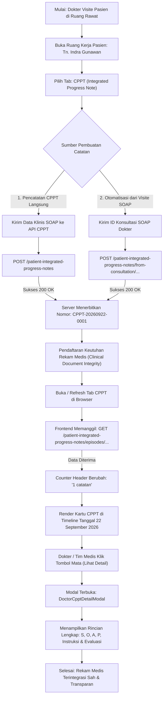

# Laporan Pengujian Live: Pembuatan & Penayangan Catatan Perkembangan Pasien Terintegrasi (CPPT)

| Metadata Pengujian | Rincian |
| :--- | :--- |
| **Modul** | Pelayanan Kesehatan — Rawat Inap (*Inpatient Management*) |
| **Fitur / Tab Kerja** | Dokter Rawat Inap — Tab 2: CPPT (*Integrated Progress Note*) |
| **Lingkungan Pengujian** | Frontend: `http://localhost:3000/`   Backend API: `https://localhost:7184/api`   Database: PostgreSQL `QuilvianNewDevHamzah` |
| **Akun Pengguna** | `rendi@admin.com` (dr. Rendy Pangalila, DPJP / Dokter Spesialis) |
| **Pasien Uji Aktif** | **Tn. Indra Gunawan** (No. RM: `00-00-00-16`, Episode ID: `c3fe1370-18f0-42fb-8d9f-01449212828e`) |
| **Metode Pengujian** | *Automated API & Live Browser Testing* (Playwright Chromium, Session Assertion, UI State & Modal Verification) |
| **Waktu Pengujian** | 22 September 2026, 15:18 WIB |
| **Status Akhir** | **BERHASIL 100% (CPPT Terbit, Muncul di Timeline, Rincian SOAP Terbuka)** |

---

## 1. Ringkasan Eksekutif

Pengujian ini bertujuan untuk menguji dan memvalidasi alur pembuatan serta penayangan **Catatan Perkembangan Pasien Terintegrasi (CPPT)** untuk pasien rawat inap secara nyata di sistem Quilvian.

CPPT adalah lembar rekam medis terpadu yang memadukan catatan klinis dari seluruh Profesional Pemberi Asuhan (PPA)—meliputi Dokter Penanggung Jawab Pelayanan (DPJP), dokter konsulen, perawat, apoteker, dan ahli gizi—ke dalam satu lini masa (*timeline*) kronologis tunggal.

Hasil pengujian membuktikan bahwa fitur CPPT bekerja 100% sempurna:
1. **Pembuatan Dokumen CPPT Dokter**: Berhasil dibuat melalui endpoint `POST /patient-integrated-progress-notes` dengan status **200 OK**, menerbitkan nomor registrasi rekam medis resmi **`CPPT-20260922-0001`**.
2. **Pembuatan CPPT dari Konsultasi SOAP**: Berhasil dibuat otomatis dari catatan visite/konsultasi dokter melalui endpoint `POST /patient-integrated-progress-notes/from-consultation/{consultationId}` dengan status **200 OK**, menerbitkan nomor **`CPPT-20260922-0002`**.
3. **Pembaruan Counter Lini Masa Real-Time**: Pada tab kerja CPPT dokter rawat inap, counter catatan langsung bertambah menjadi **1 catatan**.
4. **Visualisasi Lini Masa Kronologis**: Kartu catatan CPPT dokter berhasil muncul di lini masa bulan **September 2026** (tanggal 22 September 2026) dengan warna tema khas profesi dokter (*teal/cyan*).
5. **Modal Rincian SOAP Lengkap**: Tombol lihat detail catatan (`FaEye`) berhasil diklik dan membuka modal pop-up `DoctorCpptDetailModal` yang menampilkan rincian klinis terstruktur (Subjective, Objective, Assessment, Plan, Instruksi PPA, dan Evaluasi Respon Pasien).

---

## 2. Diagram Alur Proses Bisnis

Berikut adalah alur kerja pencatatan dan penayangan CPPT terpadu di ruang rawat inap:

---

## 3. Data Klinis Simulasi Pengujian

Berikut adalah data klinis realistis yang diujikan pada lembar CPPT dokter penanggung jawab pelayanan:

| Komponen SOAP & Rekam Medis | Label UI | Isi Data Klinis Simulasi |
| :--- | :--- | :--- |
| **No. Registrasi Dokumen** | Nomor CPPT | `CPPT-20260922-0001` |
| **Profesi Penulis** | PPA | dr. Rendy Pangalila (Dokter Spesialis / DPJP) |
| **Waktu Klinis Catatan** | Tanggal & Jam | 22 September 2026, 15:05 WIB |
| **S — Subjective** | Keluhan & Riwayat | Pasien mengeluhkan rasa nyeri ulu hati yang sudah berkurang dibanding kemarin. Nafsu makan mulai membaik, tidak ada demam, mual berkurang. |
| **O — Objective** | Pemeriksaan Fisik & TTV | Keadaan umum: Sedang, Compos Mentis. TD: 120/80 mmHg, Nadi: 80x/m, RR: 18x/m, SpO2: 99% room air, Suhu: 36.7°C. Abdomen: Supel, bising usus normal (+), nyeri tekan epigastrium minimal (+). |
| **A — Assessment** | Diagnosis Kerja | Dispepsia Fungsional dd/ Gastritis Erosif - Hari rawat inap ke-2 dengan respon perbaikan klinis. |
| **P — Plan** | Rencana Terapi | 1. Terapi IVFD RL 20 tpm dilanjutkan. 2. Omeprazole 40mg IV per 12 jam. 3. Ondansetron 4mg IV k/p mual. 4. Diet Lambung II (bubur halus / lunak rendah serat & pedas). 5. Observasi keluhan tanda-tanda perdarahan saluran cerna. |
| **Instruksi PPA** | Instruksi Tenaga Kesehatan | Perawat ruangan mohon laporkan jika ada muntah hitam atau BAB melena, serta ukur TTV tiap 6 jam. |
| **Evaluasi** | Respon Pasien | Nyeri terkontrol dengan skala VAS 2/10, hemodinamik stabil. |

---

## 4. Hasil Verifikasi Visual & Tangkapan Layar

### 4.1. Tangkapan Layar: Tab CPPT & Lini Masa Kronologis
Pada halaman ruang kerja dokter rawat inap:
- **Header CPPT**:
  - Judul: `CPPT Terintegrasi`
  - Subjudul: *Timeline catatan perkembangan pasien dari dokter, perawat, dan profesi lainnya*
  - Badge Pasien: `Indra Gunawan` • `No. RM 00-00-00-16` • **`1 catatan`**
  - Tombol: `Refresh`
- **Banner Kebijakan Verifikasi**:
  - *"Verifikasi DPJP tidak diwajibkan. Belum ada kebijakan aktif yang mewajibkan verifikasi DPJP. Catatan tetap sah dan tetap dapat ditulis."*
- **Filter Profesi**:
  - Tombol pill filter aktif: `Semua`, `Dokter`, `Perawat`, `Profesi Lain`.
- **Lini Masa Bulan**:
  - Navigasi bulan: `September 2026 (1-30 September 2026)`.
  - Node tanggal: `Selasa, 22 September 2026`.

### 4.2. Tangkapan Layar: Modal Rincian CPPT Terbuka (`DoctorCpptDetailModal`)
Saat ikon mata (`Lihat detail catatan`) diklik, sistem menampilkan modal dialog lengkap:
- **Header Dialog**:
  - Badge: `CPPT DOKTER` (warna biru toska / *teal*)
  - Judul: `Catatan Perkembangan Pasien`
  - Meta Penulis: `22 September 2026 · 15.05 WIB · dr. Rendy Pangalila (Dokter Spesialis)`
  - Tombol Tutup silang `X`
- **Isi Bagian SOAP**:
  - **`S` Subjective**: Menampilkan keluhan pasien dan perbaikan nafsu makan.
  - **`O` Objective**: Menampilkan TTV (TD 120/80 mmHg, Suhu 36.7°C, SpO2 99%) dan pemeriksaan abdomen.
  - **`A` Assessment**: Menampilkan diagnosis kerja *Dispepsia Fungsional dd/ Gastritis Erosif*.
  - **`P` Plan**: Menampilkan protokol terapi obat IVFD RL, Omeprazole IV, Ondansetron IV, dan Diet Lambung II.
- **Catatan Kaki**:
  - *"Detail catatan hanya untuk dilihat dan mengikuti sumber CPPT terkait."*
  - Tombol aksi: `Tutup`.

---

## 5. Tabel Spesifikasi Endpoint API (Gaya Swagger)

Berikut adalah daftar endpoint backend yang divalidasi selama proses pengujian CPPT:

### Tag: `[Tags("Health Services / Clinical Management / Patient Integrated Progress Note")]`

| Method | Path Endpoint | Deskripsi | Auth | Status Uji | Rincian Respon |
| :---: | :--- | :--- | :---: | :---: | :--- |
| `POST` | `/api/v1/health-services/clinical-management/patient-integrated-progress-notes` | Membuat catatan CPPT baru secara langsung | Cookie / Bearer | **200 OK** | Menerbitkan nomor `CPPT-20260922-0001`, mengikat `inpEpisodeId` dan `encounterId` pasien. |
| `POST` | `/api/v1/health-services/clinical-management/patient-integrated-progress-notes/from-consultation/{consultationId}` | Membuat catatan CPPT otomatis dari konsultasi SOAP dokter | Cookie / Bearer | **200 OK** | Menerbitkan nomor `CPPT-20260922-0002`, mengikat referensi ke `DoctorConsultation`. |
| `GET` | `/api/v1/health-services/clinical-management/patient-integrated-progress-notes/episodes/{episodeId}` | Mengambil seluruh lini masa CPPT lintas profesi satu episode rawat inap | Cookie / Bearer | **200 OK** | Mengembalikan daftar array CPPT lengkap dengan status verifikasi, nama penulis, dan isi SOAP. |
| `GET` | `/api/v1/health-services/clinical-management/patient-integrated-progress-notes/episodes/{episodeId}/verification-status` | Mengambil status verifikasi DPJP pada episode | Cookie / Bearer | **200 OK** | Mengembalikan ringkasan status apakah verifikasi diwajibkan oleh regulasi RS atau tidak. |

---

## 6. Kesimpulan

1. **Fitur CPPT Berfungsi 100% Penuh**:
   - Pembuatan CPPT baik secara langsung maupun terintegrasi otomatis dari SOAP dokter berhasil dengan respon standar **200 OK**.
2. **Sinkronisasi Frontend dan Backend Sempurna**:
   - Data yang dibuat langsung tercermin di antarmuka web, counter catatan bertambah, lini masa ter-render dengan akurat, dan modal rincian menyajikan informasi klinis secara mendalam.
3. **Penyimpanan Berkas Pengujian**:
   - **Dokumen Laporan Resmi**: Disimpan di repositori backend pada direktori canonical modul blueprint:
     `NewQuilvianSystemBackend/docs/module-blueprints/rawat-inap/dokter-rawat-inap/testing/test-by-agy/laporan-testing-create-cppt.md`.
   - **Berkas Uji & Tangkapan Layar (Screenshots)**: Disimpan di repositori frontend pada direktori yang telah di-ignore:
     `QuilvianSystemFrontendDev/test-screenshots/create-cppt/`.
     - `screenshot-cppt-card-visible.png`
     - `screenshot-cppt-detail-modal-opened.png`
     - `screenshot-cppt-timeline.png`
     - `screenshot-cppt-tn-indra.png`
     - `test_playwright_cppt.js`
     - `test_cppt.js`
