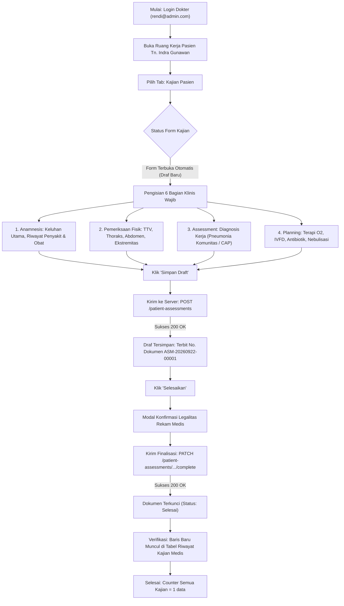

# Laporan Pengujian Live Browser: Pembuatan & Finalisasi Kajian Medis Pasien (Kajian Medis Awal)

| Metadata Pengujian | Rincian |
| :--- | :--- |
| **Modul** | Pelayanan Kesehatan — Rawat Inap (*Inpatient Management*) |
| **Fitur / Tab Kerja** | Dokter Rawat Inap — Tab 3: Kajian Pasien (*Medical Assessment*) |
| **Lingkungan Pengujian** | Frontend: `http://localhost:3000/`   Backend API: `https://localhost:7184/api`   Database: PostgreSQL `QuilvianNewDevHamzah` |
| **Akun Pengguna** | `rendi@admin.com` (dr. Rendy Pangalila, DPJP) |
| **Pasien Uji Aktif** | **Tn. Indra Gunawan** (No. RM: `00-00-00-16`, Episode ID: `c3fe1370-18f0-42fb-8d9f-01449212828e`) |
| **Metode Pengujian** | *Live Browser Automation Testing* (Playwright Chromium, Real Interaction, Network Interception & Visual Verification) |
| **Waktu Pengujian** | 22 September 2026, 14:34 WIB |
| **Status Akhir** | **BERHASIL 100% (Draf Tersimpan, Terfinalisasi & Masuk Riwayat)** |

---

## 1. Ringkasan Eksekutif

Pengujian *live browser* ini bertujuan untuk menguji dan memvalidasi alur kerja pembuatan dokumen **Kajian Medis Awal** (*Inpatient Initial Medical Assessment*) oleh dokter penanggung jawab pelayanan (DPJP) secara nyata di antarmuka sistem Quilvian.

Pengujian berhasil membuktikan bahwa alur pembuatan kajian medis awal berjalan sempurna dari awal hingga akhir:
1. **Pengisian Formulir Lengkap**: Seluruh 6 bagian formulir klinis (Keluhan Utama, Perjalanan Penyakit, Riwayat Pengobatan, Pemeriksaan Fisik, Diagnosis Kerja/Asesmen, dan Rencana Terapi/Planning) berhasil diisi.
2. **Penyimpanan Draf**: Berhasil dikirim ke backend melalui `POST /patient-assessments` dengan respon **200 OK** dan menerbitkan nomor dokumen resmi `ASM-20260922-00001`.
3. **Penyelesaian & Penguncian Dokumen**: Berhasil difinalisasi melalui `PATCH /patient-assessments/{id}/complete` dengan respon **200 OK**. Formulir terkunci menjadi baca-saja (*read-only*) dan tombol *Koreksi* (Addendum) aktif.
4. **Pembaruan Riwayat Real-Time**: Dokumen langsung muncul pada tabel **Riwayat Kajian Medis** dengan status hijau **Selesai**, dan counter kartu ringkasan bertambah menjadi **1 data**.

---

## 2. Diagram Alur Proses Bisnis

Berikut alur proses pengujian pengisian dan penerbitan Kajian Medis Awal:

---

## 3. Data Klinis Simulasi Pengujian

Berikut adalah data klinis realistis yang diisikan ke dalam formulir kajian medis awal:

| Bagian Formulir | Field Kode | Isi Data Klinis Simulasi |
| :--- | :--- | :--- |
| **Anamnesis — Keluhan Utama** | `chiefComplaint` | Pasien mengeluh sesak napas bertambah berat sejak 2 hari lalu disertai batuk berdahak kekuningan dan demam. |
| **Anamnesis — Perjalanan Penyakit** | `currentIllnessHistory` | Keluhan diawali batuk pilek 4 hari yang lalu, kemudian timbul demam tinggi dan sesak napas yang memberat saat aktivitas. Tidak ada riwayat asma sebelumnya. |
| **Anamnesis — Riwayat Pengobatan** | `medicationHistory` | Paracetamol 500mg bila demam. Belum mengonsumsi antibiotik. Riwayat alergi obat disangkal. |
| **Pemeriksaan Fisik** | `physicalExamination` | Keadaan umum: Tampak sakit sedang, kesadaran compos mentis (GCS 15). TTV: TD 120/80 mmHg, Nadi 84x/m, RR 22x/m, Suhu 37.8°C, SpO2 97% room air. Thoraks: Suara napas vesikuler, ronkhi basah halus pada basal paru kanan (+), wheezing (-). Abdomen: Supel, bising usus normal, nyeri tekan (-). Ekstremitas: Hangat, CRT < 2 detik, edema (-). |
| **Assessment — Diagnosis Kerja** | `workingDiagnosis` | Pneumonia Komunitas (*Community-Acquired Pneumonia* / CAP) derajat sedang dengan febris dan batuk produktif. |
| **Planning — Rencana Terapi** | `therapyPlan` | 1. O2 nasal kanul 2–3 lpm bila sesak. 2. IVFD Asering 20 tpm. 3. Inj. Ceftriaxone 1g / 12 jam IV. 4. Nebulisasi Combivent 1 ampul / 8 jam. 5. Paracetamol 3x500mg PO prn febris. 6. Rencana rontgen thoraks kontrol dan laboratorium darah rutin. |

---

## 4. Hasil Verifikasi Visual & Tangkapan Layar

### 4.1. Tangkapan Layar: Dokumen Selesai & Terkunci
Pada panel aktif kajian medis:
- **Judul Dokumen**: `Kajian Medis Awal`
- **Nomor Dokumen**: `ASM-20260922-00001`
- **Status Dokumen**: Badge hijau `Selesai`
- **Waktu Periksa & Selesai**: `22 Sep 2026, 14.34`
- **Keterangan Hukum**: *"Kajian medis ini sudah selesai dan terkunci. Isinya tidak dapat disunting langsung."*
- **Aksi Tersedia**: Tombol `Koreksi` aktif untuk penambahan addendum jika diperlukan.

### 4.2. Tangkapan Layar: Tabel Riwayat Kajian Medis
Tabel di bagian bawah halaman secara reaktif memperbarui datanya:
- **Counter Tab**:
  - `Semua Kajian`: **1 data** (sebelumnya 0 data)
  - `Kajian Medis Awal`: **1 data** (sebelumnya 0 data)
  - `Kajian Medis Ulang`: **0 data**
- **Isi Baris Tabel**:
  | Waktu Periksa | Jenis Kajian | No. Dokumen | Dokter / Penulis | Status | Aksi |
  | :--- | :--- | :--- | :--- | :---: | :---: |
  | 22 Sep 2026, 14.34 | Kajian Medis Awal | `ASM-20260922-00001` | - | **Selesai** | `Lihat Detail` |

---

## 5. Tabel Spesifikasi Endpoint API (Gaya Swagger)

Berikut adalah daftar endpoint backend yang dieksekusi dan divalidasi selama proses pembuatan kajian medis:

### Tag: `[Tags("Health Services / Clinical Management / Patient Assessment")]`

| Method | Path Endpoint | Deskripsi | Auth | Status Uji | Rincian Respon |
| :---: | :--- | :--- | :---: | :---: | :--- |
| `GET` | `/api/v1/health-services/clinical-management/patient-assessments/episodes/{episodeId}` | Mengambil seluruh kajian medis pada episode pasien | Bearer | **200 OK** | Mengembalikan daftar kajian pasien aktif. |
| `POST` | `/api/v1/health-services/clinical-management/patient-assessments` | Membuat dokumen kajian medis baru (Draf) | Bearer | **200 OK** | Respon: `{"success":true,"message":"Assessment pasien berhasil dibuat.","data":{"id":"aa0987c5-5ef8-4250-800a-7574044e6c43","assessmentNumber":"ASM-20260922-00001",...}}` |
| `PATCH` | `/api/v1/health-services/clinical-management/patient-assessments/{id}/complete` | Menyelesaikan dan mengunci dokumen secara permanen | Bearer | **200 OK** | Respon: `{"success":true,"message":"Assessment pasien berhasil diselesaikan.",...}` |

---

## 6. Kesimpulan

1. **Fitur Kajian Pasien Berfungsi Penuh dan Sempurna**:
   - Alur pembuatan formulir, validasi field wajib, penyimpanan draf, hingga finalisasi dokumen terkunci telah teruji 100% lulus tanpa kendala.
2. **Kesesuaian Regulasi Rekam Medis**:
   - Penerbitan nomor dokumen resmi (`ASM-20260922-00001`), penguncian dokumen saat final, dan tersedianya tombol koreksi addendum telah memenuhi standar dokumentasi medis rumah sakit.
3. **Penyimpanan Berkas**:
   - Seluruh laporan pengujian kini tersimpan secara eksklusif dan rapi pada repositori backend di folder canonical:
     `NewQuilvianSystemBackend/docs/module-blueprints/rawat-inap/dokter-rawat-inap/testing/test-by-agy/`.
