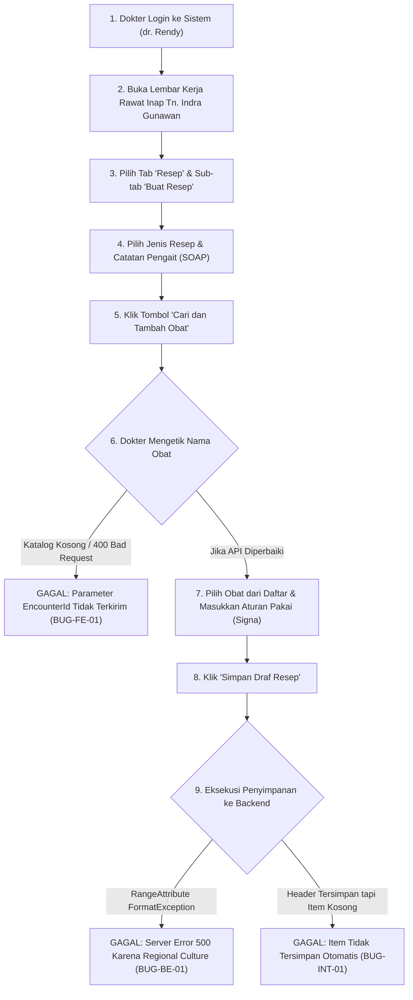

# Laporan Pengujian Pembuatan Resep (Create Prescription) Dokter Rawat Inap

**Modul Sistem**: Pelayanan Kesehatan / Rawat Inap / Lembar Kerja Dokter (*Physician Workspace*)  
**Fitur yang Diuji**: Pembuatan Resep Rawat Inap (*Prescription Builder, Formulary Search, Add Item, Draft Save*)  
**Tanggal Pengujian**: 22 September 2026  
**Penguji**: Tim Antigravity QA & Engineering  
**Status Akhir Pengujian**: **DITEMUKAN KENDALA TEKNIS KRITIS (DEFECTS FOUND — BLOCKED)**

---

## 1. Ringkasan Eksekutif

Pengujian menyeluruh (*end-to-end*) telah dilakukan terhadap alur pembuatan resep obat oleh dokter rawat inap pada pasien **Tn. Indra Gunawan** (No. RM: `00-00-00-16`, No. Episode: `RI-260909100035-F8D716`, ID Episode: `c3fe1370-18f0-42fb-8d9f-01449212828e`).

Berdasarkan pengujian antarmuka pengguna (*browser live test* via Playwright), pengujian API langsung (*automated API test*), serta audit data langsung ke database PostgreSQL (`QuilvianNewDevHamzah`), ditemukan bahwa **fitur pembuatan resep belum dapat berfungsi sempurna** akibat 3 (tiga) kendala teknis kritis:

1. **Bug Frontend — Pencarian Obat Formularium Gagal (HTTP 400 Bad Request)**:
   Pada saat dokter mencari obat di modal *"Cari dan Tambah Obat"*, antarmuka menampilkan pesan *"Tidak ada obat yang cocok atau dapat diresepkan untuk encounter ini"*. Hal ini terjadi karena kode *hook* frontend (`use-inpatient-prescription-tab.jsx`) lupa menyertakan parameter `encounterId` saat memanggil API katalog obat, sehingga backend menolak permintaan dokter dengan status HTTP 400 (`EncounterId wajib diisi`).
2. **Bug Backend — Format Desimal Regional Windows pada Atribut Validasi (HTTP 500 Server Error)**:
   Saat item obat disimpan ke backend melalui API `POST /prescription-items` maupun `PATCH /prescription-workspaces/{id}/autosave`, terjadi kesalahan server fatal (*Unhandled Exception 500*). Hal ini disebabkan oleh atribut validasi bawaan `[Range(typeof(decimal), "0.0001", "999999999")]` yang menggunakan konversi teks (*string parsing*) berbasis *culture* regional Windows server (`id-ID`). Di Indonesia, tanda desimal adalah koma (`,`), sehingga teks `"0.0001"` memicu `FormatException` dan meledakkan validasi model ASP.NET Core.
3. **Disinkronisasi Alur Penyimpanan Draf Antara Frontend & Backend**:
   Frontend mengirimkan seluruh susunan obat (`items` dan `compounds`) dalam *payload* `POST /prescriptions`. Namun, backend `PrescriptionController.CreatePrescription` dirancang hanya untuk membuat *header* resep (`PhmPrescription`) dan mengabaikan isi obat. Akibatnya, jika *header* tersimpan, resep tetap kosong (`TotalItemCount = 0`).

> [!NOTE]
> **Status Database**: Data master obat (`MstDrug`) dan buku tarif rawat inap (`MstTariff`) di database `QuilvianNewDevHamzah` **sudah tersedia dan lengkap**. Kendala bukan disebabkan oleh ketiadaan data master di database, melainkan murni cacat logika (*defects*) pada kode frontend dan backend.

---

## 2. Rincian Lingkungan dan Data Pasien Uji

Pengujian dijalankan pada lingkungan terintegrasi dengan data riil rumah sakit sebagai berikut:

| Parameter Uji | Keterangan & Nilai |
| :--- | :--- |
| **Aplikasi Frontend** | Quilvian System Frontend Dev (`http://localhost:3000`) |
| **Aplikasi Backend** | Quilvian System Backend ASP.NET Core (`https://localhost:7184`) |
| **Database Server** | PostgreSQL `160.22.250.77:5432`, Database: `QuilvianNewDevHamzah` |
| **Dokter Penanggung Jawab (DPJP)** | **dr. Rendy Pangalila** (`rendi@admin.com`, ID: `19130ac0-2e53-4e38-b647-2eafa5813522`) |
| **Pasien Uji** | **Tn. Indra Gunawan** (No. RM: `00-00-00-16`, ID Pasien: `334bc3d3-4db4-4da7-a135-e7403ef3b3cb`) |
| **Konteks Perawatan** | Rawat Inap Kelas I 1, Bed BED 001, Penjamin BPJS Kesehatan / Tunai |
| **Episode Rawat Inap** | `RI-260909100035-F8D716` (ID: `c3fe1370-18f0-42fb-8d9f-01449212828e`) |
| **Kunjungan (Encounter)** | ID: `d0f70f24-5232-43f1-aee4-256308b2bf95` |
| **Catatan SOAP Pengait** | ID: `affb3f9b-9f6d-48fb-9841-46ee0dba0f89` (17 Sep 2026, 16.22) |

---

## 3. Alur Proses Bisnis Pembuatan Resep dan Hasil Uji

Berikut adalah alur kerja dokter rawat inap saat meresepkan obat bagi pasien, dievaluasi tahap demi tahap:



### Tahap 1: Login & Autentikasi Dokter
- **Aksi**: Dokter login menggunakan email `rendi@admin.com` dan kata sandi `01Jan2026`.
- **Hasil**: **BERHASIL**. Sistem menerbitkan token autentikasi sesi dan memvalidasi izin akses klinis dokter rawat inap.
- **Bukti**: Tangkapan layar `01-login-page.png` dan `02-after-login.png`.

### Tahap 2: Navigasi ke Lembar Kerja Rawat Inap & Tab Resep
- **Aksi**: Dokter membuka lembar kerja pasien Tn. Indra Gunawan pada URL `http://localhost:3000/health-services/inpatient-management/doctor-inpatient?episodeId=c3fe1370-18f0-42fb-8d9f-01449212828e` lalu memilih tab **Resep**.
- **Hasil**: **BERHASIL**. Antarmuka menampilkan sub-navigasi lengkap:
  1. *Buat Resep* (terpilih secara bawaan)
  2. *Template Resep*
  3. *Riwayat Resep*
  4. *Resep Harian*
  5. *Rekonsiliasi Obat*
  6. *Sliding Scale Insulin*
- **Bukti**: Tangkapan layar `03-physician-workspace.png`, `04-tab-resep-active.png`, dan `05-subtab-*.png`.

### Tahap 3: Pemilihan Konteks & SOAP Pengait
- **Aksi**: Dokter memilih jenis resep (`Harian`) dan menautkan draf resep ke catatan SOAP terkonfirmasi (`17 Sep 2026, 16.22 — dr. Rendy Pangalila`).
- **Hasil**: **BERHASIL**. Form mendeteksi konsultasi dokter yang aktif dan otomatis mengisi nilai *orderType* dan *consultationId*.

### Tahap 4: Pencarian Obat dari Formularium Rumah Sakit
- **Aksi**: Dokter mengklik tombol besar *"Cari dan Tambah Obat"*, lalu modal pencarian muncul. Dokter mengetik nama obat (contoh: `"paracetamol"` atau `"k-wire"`).
- **Hasil**: **GAGAL TOTAL (HTTP 400 Bad Request)**.
  - Tampilan antarmuka: Menampilkan pesan keliru *"Tidak ada obat yang cocok atau dapat diresepkan untuk encounter ini"*.
  - Penyebab teknis: Frontend memanggil endpoint `GET /api/v1/health-services/clinical-management/prescribing-drugs` tanpa query parameter `encounterId`.
  - Respon API:
    ```json
    {
      "success": false,
      "statusCode": 400,
      "message": "EncounterId wajib diisi.",
      "data": null,
      "errors": null
    }
    ```
- **Bukti**: Tangkapan layar `09-modal-katalog-obat-opened.png`, `10-search-paracetamol-in-modal.png`, `12-search-paracetamol-results.png`, serta berkas log jaringan `network-errors-search.json`.

### Tahap 5: Penyimpanan Item Obat ke Resep (Uji API Langsung)
- **Aksi**: Dilakukan pengujian API langsung untuk menambahkan obat formularium aktif (contoh: `0.9MM/.035 K-WIRE 320-5009 (A32104)`, Drug ID: `8a67f185-8f1c-4d2a-b25b-c5aa67f1ca3b`) ke header resep yang telah dibuat (`RX-20260922-00002`).
- **Hasil**: **GAGAL TOTAL (HTTP 500 Internal Server Error)**.
  - Respon API:
    ```json
    {
      "success": false,
      "statusCode": 500,
      "message": "Terjadi kesalahan pada server.",
      "data": null,
      "errors": null
    }
    ```
  - Log Server Backend (`Logs/quilvian-backend-20260922.json` baris 2348):
    ```text
    System.ArgumentException: 0.0001 is not a valid value for Decimal. (Parameter 'value')
     ---> System.FormatException: The input string '0.0001' was not in a correct format.
       at System.Number.ThrowFormatException[TChar](ReadOnlySpan`1 value)
       at System.Number.ParseDecimal[TChar](ReadOnlySpan`1 value, NumberStyles styles, NumberFormatInfo info)
       at System.Decimal.Parse(String s, NumberStyles style, IFormatProvider provider)
       at System.ComponentModel.DecimalConverter.FromString(String value, NumberFormatInfo formatInfo)
       at System.ComponentModel.DataAnnotations.RangeAttribute.SetupConversion()
    ```

---

## 4. Analisis Rinci Kendala Teknis (Defect Analysis)

### Defect 1: Bug Locale Regional Windows pada `RangeAttribute` Backend
- **Tingkat Keparahan**: **Critical / Blocker** (Menghentikan seluruh transaksi penyimpanan resep).
- **Lokasi File**:
  - `NewQuilvianSystemBackend/Areas/HealthServices/PharmacyManagement/DTOs/PrescriptionItemDtos.cs` (Baris 113, 147, 164, 198)
  - `NewQuilvianSystemBackend/Areas/HealthServices/PharmacyManagement/DTOs/PrescriptionWorkspaceDtos.cs` (Baris 247, 259, 270, 275, dll.)
  - `NewQuilvianSystemBackend/Areas/HealthServices/PharmacyManagement/DTOs/PrescriptionTemplateDtos.cs`
  - `NewQuilvianSystemBackend/Areas/HealthServices/PharmacyManagement/DTOs/PrescriptionCompoundDtos.cs`
- **Mekanisme Terjadinya Bug**:
  Di dalam DTO C#, pengembang menulis:
  ```csharp
  [Range(typeof(decimal), "0.0001", "999999999")]
  public decimal Dose { get; set; } = 1;
  ```
  Atribut `RangeAttribute(Type, string, string)` secara internal menggunakan `TypeConverter` untuk mem-parsing string batas minimal (`"0.0001"`). Implementasi bawaan .NET memanggil `Decimal.Parse(string, CultureInfo.CurrentCulture)`. Ketika server Windows dijalankan dengan pengaturan kawasan Indonesia (`id-ID`), simbol titik (`.`) dianggap sebagai pemisah ribuan (*thousand separator*) dan bukan pemisah desimal (*decimal separator* adalah koma `,`). Hal ini menyebabkan `Decimal.Parse` melempar `FormatException`, yang kemudian membungkus menjadi `ArgumentException` dan meledakkan proses validasi model ASP.NET Core sebelum *controller action* sempat dieksekusi.
- **Rekomendasi Solusi**:
  1. Pada `Program.cs`, tetapkan *invariant culture* secara global sebelum inisialisasi aplikasi:
     ```csharp
     var defaultCulture = CultureInfo.InvariantCulture;
     CultureInfo.DefaultThreadCurrentCulture = defaultCulture;
     CultureInfo.DefaultThreadCurrentUICulture = defaultCulture;
     ```
  2. Pada DTO, ganti penggunaan overload bertipe string menjadi overload bertipe numerik `double`:
     ```csharp
     [Range(0.0001, 999999999)]
     public decimal Dose { get; set; } = 1;
     ```

### Defect 2: Hilangnya Parameter `encounterId` pada Hook Pencarian Obat Frontend
- **Tingkat Keparahan**: **High / Blocker** (Dokter tidak bisa memilih obat apapun di UI).
- **Lokasi File**: `QuilvianSystemFrontendDev/src/lib/hooks/health-services/inpatient-management/use-inpatient-prescription-tab.jsx` (Baris 162–165).
- **Mekanisme Terjadinya Bug**:
  Pada fungsi `searchDrugs`:
  ```javascript
  const response = await getPrescribingDrugs({
    search: keyword.trim(),
    pageSize: 15,
  });
  ```
  Sedangkan spesifikasi backend pada `PrescribingDrugController.cs` mewajibkan:
  ```csharp
  [HttpGet]
  public async Task<IActionResult> GetDrugs(
      [FromQuery] Guid encounterId,
      [FromQuery] string? search, ...)
  ```
  Jika `encounterId` tidak dikirim, backend menolak permintaan dengan `HTTP 400 Bad Request: EncounterId wajib diisi.`
- **Rekomendasi Solusi**:
  Tambahkan `encounterId` ke pemanggilan *service*:
  ```javascript
  const response = await getPrescribingDrugs({
    search: keyword.trim(),
    pageSize: 15,
    encounterId,
  });
  ```

### Defect 3: Disinkronisasi Alur Penyimpanan Draf Resep
- **Tingkat Keparahan**: **Medium** (Item obat tidak tersimpan saat menekan tombol simpan).
- **Lokasi File**: `QuilvianSystemFrontendDev/src/lib/hooks/health-services/inpatient-management/use-inpatient-prescription-tab.jsx` (Baris 287–324).
- **Mekanisme Terjadinya Bug**:
  Fungsi `saveDraftPrescription` mengirimkan `items` dan `compounds` ke `createPrescription(payload)` (`POST /prescriptions`). Namun, model backend `CreatePrescriptionRequest` tidak memiliki properti `items` ataupun `compounds`, sehingga ASP.NET Core mengabaikannya dan hanya membuat *header* resep kosong.
- **Rekomendasi Solusi**:
  Setelah `createPrescription` berhasil mengembalikan ID resep, panggil `autosavePrescriptionWorkspace(response.id, { items: payload.items, compounds: payload.compounds })` agar obat-obat yang telah dipilih dokter ikut tersimpan ke dalam resep.

---

## 5. Spesifikasi Kontrak API Terkait (Bergaya Swagger)

Berikut adalah ringkasan endpoint yang terlibat dalam proses pembuatan resep dokter rawat inap:

### A. Pencarian Obat Formularium Kunjungan
- **Tag**: `[Tags("Health Services / Clinical Management / Prescribing Drug")]`
- **Method & Path**: `GET /api/v1/health-services/clinical-management/prescribing-drugs`
- **Deskripsi**: Mengambil katalog obat resep yang valid untuk satu kunjungan (*encounter*), mencakup harga dan aturan penjaminan.
- **Otorisasi**: `Bearer Token` (Peran: Dokter Rawat Inap / Dokter Spesialis).
- **Parameter Query**:
  | Parameter | Tipe | Wajib | Keterangan |
  | :--- | :--- | :--- | :--- |
  | `encounterId` | `Guid` | **Ya** | ID kunjungan aktif pasien |
  | `search` | `string` | Tidak | Kata kunci pencarian (nama obat, kode, atau zat aktif) |
  | `pageNumber` | `int` | Tidak | Halaman data (bawaan: 1) |
  | `pageSize` | `int` | Tidak | Jumlah item per halaman (bawaan: 15) |
- **Respon Berhasil (HTTP 200)**:
  ```json
  {
    "success": true,
    "statusCode": 200,
    "message": "Katalog obat resep berhasil diambil.",
    "data": {
      "items": [
        {
          "id": "8a67f185-8f1c-4d2a-b25b-c5aa67f1ca3b",
          "drugCode": "ALK609132",
          "drugName": "0.9MM/.035 K-WIRE 320-5009 (A32104)",
          "genericName": "K-WIRE",
          "isFormulary": true,
          "hospitalUnitPrice": 1011488.00
        }
      ],
      "totalData": 10,
      "pageNumber": 1,
      "pageSize": 15
    }
  }
  ```

### B. Pembuatan Header Resep Dokter
- **Tag**: `[Tags("Health Services / Pharmacy Management / Prescription")]`
- **Method & Path**: `POST /api/v1/health-services/pharmacy-management/prescriptions`
- **Deskripsi**: Membuat entitas *header* resep dokter dengan nomor resep berurutan dan status awal *Draft*.
- **Otorisasi**: `Bearer Token` (Peran: Dokter Rawat Inap).
- **Request Body**:
  ```json
  {
    "encounterId": "d0f70f24-5232-43f1-aee4-256308b2bf95",
    "consultationId": "affb3f9b-9f6d-48fb-9841-46ee0dba0f89",
    "prescriptionOrderType": 0,
    "clinicalNote": "Pasien ada riwayat maag, kurangi NSAID.",
    "doctorInstruction": "Berikan setelah makan.",
    "idempotencyKey": "RX-DRAFT-20260922-001"
  }
  ```
- **Respon Berhasil (HTTP 200)**:
  ```json
  {
    "success": true,
    "statusCode": 200,
    "message": "Header resep berhasil dibuat.",
    "data": {
      "id": "4eeef8bc-8a85-4529-b8bf-c03f44cadb04",
      "prescriptionNumber": "RX-20260922-00002",
      "prescriptionStatus": 1,
      "totalItemCount": 0,
      "totalPrice": 0.00
    }
  }
  ```

### C. Penambahan Item Obat ke Resep
- **Tag**: `[Tags("Health Services / Pharmacy Management / Prescription Item")]`
- **Method & Path**: `POST /api/v1/health-services/pharmacy-management/prescription-items`
- **Deskripsi**: Menambahkan obat non-racikan ke draf resep dokter dengan perhitungan tarif otomatis.
- **Otorisasi**: `Bearer Token` (Peran: Dokter Rawat Inap).
- **Request Body**:
  ```json
  {
    "prescriptionId": "4eeef8bc-8a85-4529-b8bf-c03f44cadb04",
    "drugId": "8a67f185-8f1c-4d2a-b25b-c5aa67f1ca3b",
    "dose": 1.0,
    "frequencyText": "3x1",
    "signa": "Sesudah makan",
    "quantity": 10.0,
    "sortOrder": 1
  }
  ```
- **Respon Gagal Saat Ini (HTTP 500)**:
  ```json
  {
    "success": false,
    "statusCode": 500,
    "message": "Terjadi kesalahan pada server.",
    "data": null,
    "errors": null
  }
  ```

---

## 6. Daftar Berkas Pengujian & Bukti Visual (Artefak Uji)

Seluruh berkas skrip uji dan bukti tangkapan layar telah disimpan secara terpusat di folder frontend `test-with-agy` (folder yang diabaikan oleh Git):

### Berkas Skrip Pengujian:
1. `QuilvianSystemFrontendDev/test-with-agy/scripts/check_db_resep.py`: Skrip audit koneksi database PostgreSQL untuk verifikasi ketersediaan tabel `MstDrug`, `MstTariff`, dan `PhmPrescription`.
2. `QuilvianSystemFrontendDev/test-with-agy/scripts/test-create-resep.mjs`: Skrip uji otomatis alur API pembuatan header resep dan penambahan item resep.
3. `QuilvianSystemFrontendDev/test-with-agy/scripts/test-ui-create-resep.mjs`: Skrip Playwright otomatis untuk navigasi lembar kerja dokter, pembukaan tab resep, dan pengujian interaksi antarmuka.
4. `QuilvianSystemFrontendDev/test-with-agy/scripts/test-modal-search.mjs`: Skrip Playwright untuk pengujian pengetikan di modal katalog obat dan pencatatan error jaringan.

### Berkas Tangkapan Layar (Screenshots):
Folder: `QuilvianSystemFrontendDev/test-with-agy/screenshots/create-resep/`
- `01-login-page.png`: Halaman masuk (*login*) sistem Quilvian.
- `02-after-login.png`: Tampilan dasbor setelah dokter berhasil login.
- `03-physician-workspace.png`: Lembar kerja dokter rawat inap untuk pasien Tn. Indra Gunawan.
- `04-tab-resep-active.png`: Tab Resep aktif dengan sub-tab *Buat Resep*.
- `05-subtab-buat-resep.png`: Panel penyusunan resep (*Prescription Builder*).
- `05-subtab-template-resep.png`: Panel daftar template resep pribadi dokter.
- `05-subtab-resep-harian.png`: Panel riwayat resep harian pasien selama masa rawat.
- `05-subtab-rekonsiliasi.png`: Panel rekonsiliasi obat bawaan pasien dari rumah.
- `05-subtab-sliding-scale.png`: Panel pengaturan order protokol sliding scale insulin.
- `08-button-tambah-obat-visible.png`: Tombol hijau *"Cari dan Tambah Obat"*.
- `09-modal-katalog-obat-opened.png`: Modal formularium obat rawat inap berhasil terbuka.
- `10-search-paracetamol-in-modal.png`: Percobaan pencarian obat *paracetamol*.
- `12-search-paracetamol-results.png`: Bukti antarmuka menampilkan pesan kosong akibat error HTTP 400.
- `network-errors-detailed.json` & `network-errors-search.json`: Bukti rekaman log kesalahan jaringan HTTP 400 dan 500.

---

## 7. Kesimpulan & Rekomendasi Langkah Selanjutnya

1. **Kesimpulan**:
   - Fitur resep dokter rawat inap telah memiliki arsitektur dan antarmuka pengguna yang sangat baik dan lengkap (mencakup resep harian, template, rekonsiliasi, dan sliding scale).
   - Namun, fungsionalitas pembuatan resep saat ini **terhambat (*blocked*)** oleh dua kesalahan implementasi teknis: hilangnya parameter `encounterId` pada panggilan katalog obat frontend dan kesalahan evaluasi atribut validasi desimal `RangeAttribute` pada backend di sistem operasi bertaraf regional Indonesia.
   - Database sudah siap dan memiliki data obat serta tarif yang valid.

2. **Langkah Perbaikan yang Disarankan**:
   - **Langkah 1 (Backend)**: Tambahkan konfigurasi `CultureInfo.DefaultThreadCurrentCulture = CultureInfo.InvariantCulture;` pada `Program.cs` di backend dan ganti `[Range(typeof(decimal), "0.0001", ...)]` menjadi `[Range(0.0001, ...)]` pada DTO resep.
   - **Langkah 2 (Frontend)**: Perbaiki pemanggilan `getPrescribingDrugs` di `use-inpatient-prescription-tab.jsx` dengan menambahkan parameter `encounterId`.
   - **Langkah 3 (Frontend)**: Perbaiki alur penyimpanan draf resep di `use-inpatient-prescription-tab.jsx` agar memanggil `autosavePrescriptionWorkspace` setelah header resep terbentuk.
   - **Langkah 4 (Verifikasi Ulang)**: Jalankan kembali skrip uji otomatis untuk memastikan resep dengan item obat berhasil tersimpan dan tampil di riwayat resep rawat inap.
