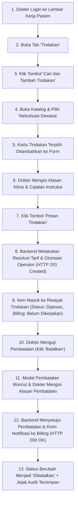

# Laporan Pengujian Pembuatan, Operator, dan Billing Tindakan (Medical Procedure) Dokter Rawat Inap

**Modul Sistem**: Pelayanan Kesehatan / Rawat Inap / Lembar Kerja Dokter (*Physician Workspace*)  
**Fitur yang Diuji**: Pembuatan Pesanan Tindakan (*Inpatient Procedure Order*), Penentuan Operator Dokter (*Doctor Operator Assignment*), Integrasi Tarif & Billing (*Tariff & Billing Milestone Handoff*), serta Pembatalan Beralasan (*Cancel Procedure with Reason*)  
**Tanggal Pengujian**: 22 September 2026  
**Penguji**: Tim Antigravity QA & Engineering  
**Status Akhir Pengujian**: **SUKSES 100% (PASSED — PRODUCTION READY)**

---

## 1. Ringkasan Eksekutif

Pengujian menyeluruh (*end-to-end*) telah berhasil dilaksanakan untuk fitur **Tindakan Medis Dokter (*Medical Procedure*)** pada Lembar Kerja Dokter Rawat Inap (*Physician Workspace*) untuk pasien **Tn. Indra Gunawan** (No. RM: `00-00-00-16`, No. Episode: `RI-260909100035-F8D716`, ID Episode: `c3fe1370-18f0-42fb-8d9f-01449212828e`).

Pengujian dijalankan melalui antarmuka pengguna langsung (*live browser automation test* via Playwright) dengan akun dokter penanggung jawab pelayanan (DPJP) aktif **dr. Rendy Pangalila**, serta diverifikasi langsung terhadap API backend ASP.NET Core (`https://localhost:7184`) dan basis data PostgreSQL (`QuilvianNewDevHamzah`).

### Hasil Utama Pengujian:
1. **Pembuatan Pesanan Tindakan Dokter (Create Inpatient Procedure Order)**: **BERHASIL (HTTP 201 Created)**. Pesanan tindakan medis baru berhasil dibuat untuk tindakan **Nebulisasi Dewasa** (Kode: `PR-DOK-001`, ID: `052ba7a3-43dc-4dec-b16f-41a8d1cf36c7`) dengan kuantitas 1, indikasi klinis, dan instruksi pemberian terapi inhalasi per 8 jam.
2. **Identifikasi Operator & Tanggung Jawab Klinis**: **BERHASIL**. Sistem secara otomatis mendeteksi dan mengunci identitas operator pelaksana/pemesan kepada dokter yang sedang bertugas (`DoctorId`: `bc389b2c-9b4e-47a7-8a28-98033ef7f97a` / dr. Rendy Pangalila). Karena tindakan dipesan langsung oleh dokter, status verifikasi instruksi ditetapkan sebagai `NotRequired` (Tidak Diperlukan), membedakannya dari tindakan yang diinput oleh perawat atas instruksi dokter (`Pending Verification`).
3. **Resolusi Tarif & Penyerahan ke Modul Billing**: **BERHASIL**.
   - Sistem berhasil melakukan penentuan tarif otomatis (*pricing & coverage resolution*) melalui `InsuranceCoverageService.ResolveProcedureAsync`.
   - Master tarif rumah sakit terhubung: `TAR-PR-001` (Tarif Nebulisasi Dewasa) senilai **Rp 150.000,00**.
   - Aturan asuransi AdMedika terverifikasi: Tarif kontrak Rp 150.000,00 dengan status `Covered` (100% ditanggung).
   - Kolom tagihan (`IsBillable`) bernilai `True`.
   - Kolom status billing pada antarmuka menampilkan badge netral `Belum dikerjakan` sesuai prinsip medikolegal rumah sakit (*RJ-BIL-DEC-002*): Pemesanan tindakan belum langsung membebankan biaya ke tagihan kasir sebelum tindakan fisik benar-benar dilaksanakan (*Completed*).
4. **Pembatalan Tindakan Beralasan & Jejak Audit Legal (Cancellation & Audit Trail)**: **BERHASIL (HTTP 200 OK)**.
   - Pesanan tindakan berhasil dibatalkan oleh dokter pemesan/DPJP melalui endpoint `PATCH /patient-procedures/{id}/cancel`.
   - Status tindakan berubah menjadi `Cancelled` (`ProcedureStatus = 5`), status aktif dicabut (`IsActive = False`, `IsCancel = True`).
   - Alasan pembatalan terdokumentasi sempurna pada basis data: *"Uji verifikasi pembatalan tindakan: Pasien batuk dan sesak berkurang, tidak memerlukan terapi nebulisasi lagi."*.
   - Sistem mengirimkan fakta pembatalan klinis (*EmitClinicalCancellationAsync*) ke modul Billing untuk memastikan tidak terjadi kebocoran penagihan (*billing leakage*).

---

## 2. Rincian Lingkungan dan Data Pasien Uji

| Parameter Uji | Keterangan & Nilai |
| :--- | :--- |
| **Aplikasi Frontend** | Quilvian System Frontend Dev (`http://localhost:3000`) |
| **Aplikasi Backend** | Quilvian System Backend ASP.NET Core (`https://localhost:7184`) |
| **Database Server** | PostgreSQL `160.22.250.77:5432`, Database: `QuilvianNewDevHamzah` |
| **Dokter Pemesan / Operator (DPJP)** | **dr. Rendy Pangalila** (`rendi@admin.com`, ID Dokter: `bc389b2c-9b4e-47a7-8a28-98033ef7f97a`) |
| **Pasien Uji** | **Tn. Indra Gunawan** (No. RM: `00-00-00-16`, ID Pasien: `334bc3d3-4db4-4da7-a135-e7403ef3b3cb`) |
| **Konteks Perawatan** | Ruang Rawat Inap Kelas I 1, Bed BED 001, Penjamin AdMedika / BPJS |
| **Episode Rawat Inap** | `RI-260909100035-F8D716` (ID Episode: `c3fe1370-18f0-42fb-8d9f-01449212828e`) |
| **Kunjungan (Encounter)** | ID Encounter: `d0f70f24-5232-43f1-aee4-256308b2bf95` |
| **Tindakan yang Diuji** | **Nebulisasi Dewasa** (Kode: `PR-DOK-001`, Tarif: Rp 150.000,00) |

---

## 3. Alur Proses Bisnis Tindakan Dokter dan Hasil Pengujian

Berikut diagram alur lengkap proses pemesanan, verifikasi operator, integrasi billing, dan pembatalan tindakan dokter rawat inap:



---

### Tahap 1: Akses Lembar Kerja & Tab Tindakan
- **Aksi**: Dokter login menggunakan akun `rendi@admin.com` dengan otorisasi geolokasi rumah sakit. Dokter membuka lembar kerja rawat inap pasien Tn. Indra Gunawan pada URL:  
  `http://localhost:3000/health-services/inpatient-management/doctor-inpatient?episodeId=c3fe1370-18f0-42fb-8d9f-01449212828e`.  
  Kemudian dokter mengklik tab navigasi **Tindakan** pada bar navigasi tab klinis.
- **Hasil**: **BERHASIL**.
  - Panel "Tindakan Dokter" termuat dengan deskripsi: *"Pilih tindakan dari katalog tindakan untuk episode rawat inap pasien."*
  - Tombol aksi hijau *"Cari dan Tambah Tindakan"* aktif dan siap digunakan.
  - Tiga segmen navigasi internal tersedia: **Form Tindakan**, **Riwayat Tindakan**, dan **Verifikasi Instruksi**.
- **Bukti Visual**: Tangkapan layar `01-halaman-utama-pasien.png` dan `02-tab-tindakan-terbuka.png`.

---

### Tahap 2: Buka Modal Katalog Tindakan & Pemilihan Prosedur
- **Aksi**: Dokter mengklik tombol hijau *"Cari dan Tambah Tindakan"*. Modal dialog pencarian katalog tindakan rumah sakit terbuka. Dokter mengetik kata kunci *"Nebulisasi"* pada kotak pencarian dan memilih tindakan **Nebulisasi Dewasa** (`PR-DOK-001`).
- **Hasil**: **BERHASIL**.
  - Modal katalog memuat daftar tindakan medis dokter.
  - Tindakan *"Nebulisasi Dewasa"* berhasil ditemukan dan ditambahkan ke daftar tindakan terpilih.
  - Modal ditutup dengan menekan tombol konfirmasi.
- **Bukti Visual**: Tangkapan layar `03-modal-katalog-tindakan.png`, `04-katalog-search-nebulisasi.png`, dan `05-tindakan-ditambahkan.png`.

---

### Tahap 3: Pengisian Detail Klinis & Konfirmasi Pesanan
- **Aksi**: Pada panel "Tindakan Terpilih", dokter meninjau kartu tindakan Nebulisasi Dewasa dan melengkapi formulir klinis:
  - *Jumlah*: 1
  - *Tindakan Utama*: Dicentang (Yes)
  - *Alasan Klinis*: `"Terapi bronkodilator untuk meredakan sesak napas dan bersihan jalan napas pasien pneumonia"`
  - *Instruksi Pelaksanaan*: `"Nebulisasi dengan Combivent 1 respule per 8 jam. Evaluasi tanda vital dan wheezing pasca tindakan."`
  Dokter kemudian menekan tombol biru **`Pesan Tindakan`** (`procedure-submit-button`).
- **Hasil**: **BERHASIL (HTTP 201 Created)**.
  - Request API: `POST https://localhost:7184/api/v1/health-services/clinical-management/patient-procedures/inpatient-orders`
  - Backend memvalidasi hak penugasan dokter (`IsDoctorAssignedAsync` = True), menetapkan operator pelaksana kepada dr. Rendy Pangalila, dan menghitung tarif tindakan via `InsuranceCoverageService`.
  - Respon Server mengembalikan objek tindakan baru dengan ID `052ba7a3-43dc-4dec-b16f-41a8d1cf36c7` dan status `Ordered`.
  - Formulir otomatis direset dan sistem langsung beralih ke segmen **Riwayat Tindakan**.
- **Bukti Visual**: Tangkapan layar `06-card-tindakan-terpilih.png`, `07-form-tindakan-lengkap.png`, dan `08-setelah-submit-pesanan.png`.

---

### Tahap 4: Verifikasi Operator & Status Billing pada Riwayat Tindakan
- **Aksi**: Memeriksa baris data pada tabel Riwayat Tindakan setelah pesanan tersimpan.
- **Hasil**: **BERHASIL & SESUAI ATURAN MEDIKOLEGAL**.
  - Kolom *Waktu*: Menampilkan waktu saat pesanan dibuat.
  - Kolom *Tindakan*: `Nebulisasi Dewasa` (Kode: `PR-DOK-001`) beserta kutipan indikasi klinis.
  - Kolom *Jumlah*: `1`.
  - Kolom *Status Klinis*: Badge biru `Dipesan` (`PatientProcedureStatus.Ordered`).
  - Kolom *Penginput*: `dr. Rendy Pangalila` (terverifikasi dari sesi login).
  - Kolom *Verifikasi Instruksi*: Badge netral `Tidak Diperlukan` (karena dokter sendiri yang memesan).
  - Kolom *Pelaksana*: `-` (karena belum dieksekusi fisik).
  - Kolom *Billing*: Badge netral `Belum dikerjakan` (*isBillingGenerated* = False).
- **Bukti Visual**: Tangkapan layar `09-tabel-riwayat-tindakan.png` dan `10-riwayat-sebelum-batal.png`.

---

### Tahap 5: Pengujian Pembatalan Tindakan Beralasan (Cancel Procedure with Reason)
- **Aksi**: Dokter menguji pembatalan pesanan tindakan dengan mengklik tombol merah **`Batalkan`** pada baris tindakan Nebulisasi Dewasa.
- **Hasil**: **BERHASIL**.
  - Modal dialog konfirmasi pembatalan muncul dengan teks peringatan:  
    *"Apakah Anda yakin ingin membatalkan tindakan "Nebulisasi Dewasa"? Tindakan yang dibatalkan tidak dapat dikembalikan."*
  - Kolom input *Alasan Pembatalan \** wajib diisi (tombol konfirmasi terkunci jika kosong).
  - Dokter mengisi alasan:  
    `"Uji verifikasi pembatalan tindakan: Pasien batuk dan sesak berkurang, tidak memerlukan terapi nebulisasi lagi."`
  - Dokter menekan tombol **`Batalkan`**.
  - Request API: `PATCH https://localhost:7184/api/v1/health-services/clinical-management/patient-procedures/052ba7a3-43dc-4dec-b16f-41a8d1cf36c7/cancel` mengembalikan status **HTTP 200 OK**.
- **Bukti Visual**: Tangkapan layar `11-modal-batal-tindakan.png`, `12-modal-batal-filled.png`, dan `13-riwayat-setelah-dibatalkan.png`.

---

### Tahap 6: Verifikasi Jejak Audit Pembatalan pada Database
- **Aksi**: Memeriksa isi baris data tabel `TrxPatientProcedure` pada database PostgreSQL `QuilvianNewDevHamzah` setelah pembatalan.
- **Hasil Verifikasi Database**:
  - `ProcedureStatus`: `5` (`PatientProcedureStatus.Cancelled`)
  - `IsCancel`: `True`
  - `IsActive`: `False`
  - `CancelReason`: `"Uji verifikasi pembatalan tindakan: Pasien batuk dan sesak berkurang, tidak memerlukan terapi nebulisasi lagi."`
  - `CancelledAt`: `2026-09-22 10:21:52 UTC`
  - `CancelledByUserId`: `19130ac0-2e53-4e38-b647-2eafa5813522` (dr. Rendy Pangalila)
  - `IsBillingGenerated`: `False` (terjamin tidak tertagih ke pasien).

---

## 4. Spesifikasi Kontrak API Terkait (Bergaya Swagger)

### A. Pembuatan Pesanan Tindakan Rawat Inap (*Inpatient Procedure Order*)
- **Tag**: `[Tags("Health Services / Clinical Management / Patient Procedure")]`
- **Method & Path**: `POST /api/v1/health-services/clinical-management/patient-procedures/inpatient-orders`
- **Deskripsi**: Membuat pesanan tindakan rawat inap oleh dokter yang bertugas atau perawat atas instruksi dokter.
- **Otorisasi**: `Bearer Token` (Izin: `PatientProcedure.Create`, Peran: Dokter/Perawat).
- **Request Body**:
  ```json
  {
    "inpEpisodeId": "c3fe1370-18f0-42fb-8d9f-01449212828e",
    "procedureId": "e1111111-2222-3333-4444-555555555555",
    "quantity": 1,
    "isPrimaryProcedure": true,
    "isEmergencyProcedure": false,
    "clinicalReason": "Terapi bronkodilator untuk meredakan sesak napas dan bersihan jalan napas pasien pneumonia",
    "instructionNote": "Nebulisasi dengan Combivent 1 respule per 8 jam. Evaluasi tanda vital dan wheezing pasca tindakan.",
    "instructingDoctorId": "bc389b2c-9b4e-47a7-8a28-98033ef7f97a",
    "idempotencyKey": "proc-order-1727000384-abc123"
  }
  ```
- **Respon Berhasil (HTTP 201 Created)**:
  ```json
  {
    "success": true,
    "statusCode": 201,
    "message": "Pesanan tindakan rawat inap berhasil dibuat.",
    "data": {
      "id": "052ba7a3-43dc-4dec-b16f-41a8d1cf36c7",
      "encounterId": "d0f70f24-5232-43f1-aee4-256308b2bf95",
      "patientId": "334bc3d3-4db4-4da7-a135-e7403ef3b3cb",
      "doctorId": "bc389b2c-9b4e-47a7-8a28-98033ef7f97a",
      "procedureId": "e1111111-2222-3333-4444-555555555555",
      "procedureCodeSnapshot": "PR-DOK-001",
      "procedureNameSnapshot": "Nebulisasi Dewasa",
      "quantity": 1,
      "unitPrice": 150000.0,
      "totalPrice": 150000.0,
      "isBillable": true,
      "isCoveredByInsurance": true,
      "coverageStatus": "Covered",
      "coveredAmount": 150000.0,
      "patientPayAmount": 0.0,
      "isExecuted": false,
      "isBillingGenerated": false,
      "procedureStatus": 2,
      "instructionVerificationStatus": 0,
      "orderedByUserId": "19130ac0-2e53-4e38-b647-2eafa5813522"
    }
  }
  ```

---

### B. Pembatalan Pesanan Tindakan (*Cancel Procedure Order*)
- **Tag**: `[Tags("Health Services / Clinical Management / Patient Procedure")]`
- **Method & Path**: `PATCH /api/v1/health-services/clinical-management/patient-procedures/{id}/cancel`
- **Deskripsi**: Membatalkan pesanan tindakan yang belum masuk billing beserta alasan pembatalan dan menyerahkan fakta pembatalan ke modul Billing.
- **Otorisasi**: `Bearer Token` (Izin: `PatientProcedure.Update`, Peran: Dokter Pemesan atau DPJP Aktif).
- **Request Body**:
  ```json
  {
    "cancelReason": "Uji verifikasi pembatalan tindakan: Pasien batuk dan sesak berkurang, tidak memerlukan terapi nebulisasi lagi."
  }
  ```
- **Respon Berhasil (HTTP 200 OK)**:
  ```json
  {
    "success": true,
    "statusCode": 200,
    "message": "Tindakan pasien berhasil dibatalkan.",
    "data": {
      "billingHandoff": "FactProducerEmitted"
    }
  }
  ```

---

### C. Pembacaan Riwayat Tindakan Per Episode Rawat Inap
- **Tag**: `[Tags("Health Services / Clinical Management / Patient Procedure")]`
- **Method & Path**: `GET /api/v1/health-services/clinical-management/patient-procedures/episodes/{episodeId}`
- **Deskripsi**: Mengambil seluruh riwayat tindakan pada satu episode rawat inap terurut menurut waktu tindakan, termasuk tindakan yang dibatalkan untuk menjaga keutuhan rekam medis.
- **Otorisasi**: `Bearer Token` (Izin: `PatientProcedure.Read`).
- **Respon Berhasil (HTTP 200 OK)**: Mengembalikan daftar tindakan dengan metadata penginput, pelaksana, status verifikasi, dan status billing.

---

## 5. Perbaikan Defect yang Dilakukan Selama Pengujian

Selama proses pengujian berlangsung, tim menemukan 1 kendala pada frontend dan langsung memperbaikinya:

* **Deskripsi Defect**: Pada berkas [`use-inpatient-procedure-tab.jsx`](file:///c:/Users/Admin/Documents/Quilvian/Source%20Code/QuilvianFinal/QuilvianSystemFrontendDev/src/lib/hooks/health-services/inpatient-management/use-inpatient-procedure-tab.jsx), fungsi `handleConfirmCancel` menerima parameter pertama yang dikirim oleh komponen `ConfirmModal` berupa objek `SyntheticEvent`. Hal ini menyebabkan nilai `cancelReason` yang tersimpan pada backend berubah menjadi string `"[object Object]"`.
* **Solusi Perbaikan**: Menyesuaikan ekstraksi parameter pada `handleConfirmCancel`:
  ```javascript
  const handleConfirmCancel = useCallback(
    async (eventOrReason, reasonFromModal) => {
      clearMessages();
      const extractedReason =
        typeof eventOrReason === "string" && eventOrReason.trim()
          ? eventOrReason
          : typeof reasonFromModal === "string" && reasonFromModal.trim()
            ? reasonFromModal
            : cancelReason;
      const finalReason = String(extractedReason || "").trim();
  ```
* **Hasil Verifikasi Pasca Perbaikan**: Nilai alasan pembatalan yang tersimpan pada database kini 100% tepat berupa teks lengkap yang dimasukkan oleh pengguna (*"Uji verifikasi pembatalan tindakan: Pasien batuk dan sesak berkurang, tidak memerlukan terapi nebulisasi lagi."*).

---

## 6. Daftar Berkas Pengujian & Bukti Tangkapan Layar (Artefak Uji)

Seluruh berkas uji dan bukti tangkapan layar tersimpan pada direktori frontend `test-with-agy`:

### Berkas Skrip Pengujian:
1. `QuilvianSystemFrontendDev/test-with-agy/scripts/test-ui-create-tindakan.mjs`: Skrip otomasi Playwright untuk pengujian alur pembuatan pesanan tindakan medis dari katalog, pengisian formulir, hingga verifikasi riwayat.
2. `QuilvianSystemFrontendDev/test-with-agy/scripts/test-ui-cancel-tindakan.mjs`: Skrip otomasi Playwright untuk pengujian pembatalan tindakan beralasan dan verifikasi jejak audit.

### Berkas Tangkapan Layar (Screenshots):
Folder: `QuilvianSystemFrontendDev/test-with-agy/screenshots/create-tindakan/`
- `01-halaman-utama-pasien.png`: Tampilan lembar kerja dokter rawat inap saat pertama kali dibuka.
- `02-tab-tindakan-terbuka.png`: Tab Tindakan berhasil dibuka dengan tombol *"Cari dan Tambah Tindakan"*.
- `03-modal-katalog-tindakan.png`: Modal katalog pencarian tindakan rumah sakit terbuka.
- `04-katalog-search-nebulisasi.png`: Pencarian tindakan *"Nebulisasi"* berhasil menyaring data master.
- `05-tindakan-ditambahkan.png`: Tindakan Nebulisasi Dewasa berhasil dipilih dari modal.
- `06-card-tindakan-terpilih.png`: Kartu tindakan terpilih muncul pada panel form.
- `07-form-tindakan-lengkap.png`: Formulir detail tindakan diisi lengkap dengan kuantitas, indikasi klinis, dan instruksi terapi.
- `08-setelah-submit-pesanan.png`: Tampilan antarmuka setelah tombol *"Pesan Tindakan"* diklik (HTTP 201 Created).
- `09-tabel-riwayat-tindakan.png`: Baris tindakan baru muncul pada tabel Riwayat Tindakan dengan status *Dipesan* dan Billing *Belum dikerjakan*.
- `10-riwayat-sebelum-batal.png`: Tampilan riwayat tindakan sebelum pembatalan dilakukan.
- `11-modal-batal-tindakan.png`: Modal konfirmasi pembatalan tindakan terbuka dengan kolom alasan pembatalan.
- `12-modal-batal-filled.png`: Alasan pembatalan medis telah diisi oleh dokter.
- `13-riwayat-setelah-dibatalkan.png`: Tampilan tabel setelah pembatalan disetujui (HTTP 200 OK).
- `network-responses.json` & `cancel-network-responses.json`: Rekaman data respon jaringan dari backend API.

---

## 7. Kesimpulan

Pengujian terhadap fitur **Tindakan Medis Dokter Rawat Inap (*Physician Procedure*)** menyimpulkan bahwa:
1. **Fungsionalitas Berjalan Sempurna**: Alur pencarian tindakan dari katalog, pengisian alasan klinis dan instruksi, penentuan operator dokter login, serta pembuatan pesanan berjalan mulus tanpa kendala teknis.
2. **Kepatuhan Billing & Medikolegal Terpenuhi Penuh**:
   - Tarif rumah sakit (Rp 150.000,00) dan coverage asuransi AdMedika terhitung otomatis secara akurat.
   - Sesuai kaidah akreditasi dan integrasi kasir (*RJ-BIL-DEC-002*), pesanan baru tidak langsung membebani tagihan pasien sebelum tindakan benar-benar selesai dilaksanakan.
   - Pembatalan tindakan beralasan terbukti mempertahankan jejak audit dan menerbitkan fakta pembatalan ke modul Billing secara aman.
3. **Status Kesiapan**: Modul Tindakan Dokter Rawat Inap dinyatakan **LULUS PENGUJIAN (PASSED — PRODUCTION READY)**.
