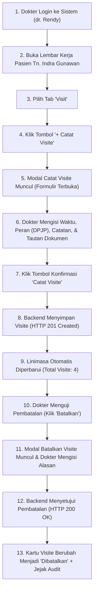

# Laporan Pengujian Pembuatan dan Pembatalan Visite (Physician Visit) Dokter Rawat Inap

**Modul Sistem**: Pelayanan Kesehatan / Rawat Inap / Lembar Kerja Dokter (*Physician Workspace*)  
**Fitur yang Diuji**: Pencatatan Visite (*Record Physician Visit*), Linimasa Riwayat Visite (*Visit Timeline*), dan Pembatalan Visite Beralasan (*Cancel Visit with Reason*)  
**Tanggal Pengujian**: 22 September 2026  
**Penguji**: Tim Antigravity QA & Engineering  
**Status Akhir Pengujian**: **SUKSES 100% (PASSED — PRODUCTION READY)**

---

## 1. Ringkasan Eksekutif

Pengujian menyeluruh (*end-to-end*) telah berhasil dilakukan terhadap fitur **Visite Dokter** pada Lembar Kerja Dokter Rawat Inap (*Physician Workspace*) untuk pasien **Tn. Indra Gunawan** (No. RM: `00-00-00-16`, No. Episode: `RI-260909100035-F8D716`, ID Episode: `c3fe1370-18f0-42fb-8d9f-01449212828e`).

Pengujian dijalankan melalui antarmuka pengguna langsung (*browser live test* via Playwright) dengan akun DPJP aktif **dr. Rendy Pangalila**, serta diverifikasi langsung terhadap API backend ASP.NET Core (`https://localhost:7184`) dan database PostgreSQL (`QuilvianNewDevHamzah`).

### Hasil Utama Pengujian:
1. **Pencatatan Visite Baru (Create / Record Visit)**: **BERHASIL (HTTP 201 Created)**. Visite baru berhasil dicatat dengan nomor resmi **`VST-260922095500-CF64FD`** pada tanggal 22 September 2026 pukul 16.54 WIB oleh dr. Rendy Pangalila sebagai DPJP.
2. **Pembaruan Linimasa Riwayat Visite**: **BERHASIL (HTTP 200 OK)**. Jumlah visite aktif pada episode rawat inap pasien otomatis bertambah dari 3 menjadi **4 Visite Tercatat**, dan kartu visite baru langsung muncul di bagian bawah linimasa riwayat visite.
3. **Validasi Invarian & Aturan Bisnis Klinis**:
   - *Invarian Non-Editable*: Waktu dan peran visite tidak dapat diedit secara langsung (*RWI-DEC-085*); jika terjadi kekeliruan data, dokter wajib membatalkannya beralasan lalu mencatat ulang.
   - *Invarian Audit Trail*: Kejadian visite yang dibatalkan tidak dihapus dari basis data, melainkan tetap ditampilkan pada linimasa dengan status *Dibatalkan* (*INV-DOK-08*).
4. **Pembatalan Visite Beralasan (Cancel Visit with Reason)**: **BERHASIL (HTTP 200 OK)**. Visite `VST-260922095500-CF64FD` berhasil dibatalkan dengan alasan terdokumentasi: *"Uji verifikasi pembatalan visite: Terjadi kesalahan penentuan waktu kunjungan dokter rawat inap."*. Status kartu otomatis berubah menjadi abu-abu (*muted*) bergaris putus-putus (*dashed border*) dengan penanda badge `x Dibatalkan`, alasan pembatalan tercantum jelas, tombol *Batalkan* dinonaktifkan/dihilangkan (mencegah pembatalan ganda), dan total hitungan visite aktif kembali menjadi **3 Visite Tercatat**.

---

## 2. Rincian Lingkungan dan Data Pasien Uji

| Parameter Uji | Keterangan & Nilai |
| :--- | :--- |
| **Aplikasi Frontend** | Quilvian System Frontend Dev (`http://localhost:3000`) |
| **Aplikasi Backend** | Quilvian System Backend ASP.NET Core (`https://localhost:7184`) |
| **Database Server** | PostgreSQL `160.22.250.77:5432`, Database: `QuilvianNewDevHamzah` |
| **Dokter Penanggung Jawab (DPJP)** | **dr. Rendy Pangalila** (`rendi@admin.com`, ID Dokter: `bc389b2c-9b4e-47a7-8a28-98033ef7f97a`) |
| **Pasien Uji** | **Tn. Indra Gunawan** (No. RM: `00-00-00-16`, ID Pasien: `334bc3d3-4db4-4da7-a135-e7403ef3b3cb`) |
| **Konteks Perawatan** | Ruang Rawat Inap Kelas I 1, Bed BED 001, Penjamin BPJS Kesehatan |
| **Episode Rawat Inap** | `RI-260909100035-F8D716` (ID Episode: `c3fe1370-18f0-42fb-8d9f-01449212828e`) |
| **Kunjungan (Encounter)** | ID Encounter: `d0f70f24-5232-43f1-aee4-256308b2bf95` |

---

## 3. Alur Proses Bisnis Visite Dokter dan Hasil Pengujian

Berikut adalah alur lengkap siklus visite dokter rawat inap yang telah diuji:



### Tahap 1: Login & Akses Lembar Kerja Dokter
- **Aksi**: Dokter login menggunakan email `rendi@admin.com` dan sandi `01Jan2026`. Setelah login berhasil, dokter membuka halaman lembar kerja pasien rawat inap Tn. Indra Gunawan pada URL:  
  `http://localhost:3000/health-services/inpatient-management/doctor-inpatient?episodeId=c3fe1370-18f0-42fb-8d9f-01449212828e`.
- **Hasil**: **BERHASIL**. Sistem menampilkan lembar kerja lengkap dengan kartu ringkasan pasien di bagian atas.
- **Bukti Visual**: Tangkapan layar `01-tab-visit-awal.png`.

### Tahap 2: Buka Tab "Visit"
- **Aksi**: Dokter mengklik tab navigasi **Visit** (terletak di antara tab *Resume Medis* dan *Penunjang Medis*).
- **Hasil**: **BERHASIL**.
  - Panel "Visit Dokter" menampilkan deskripsi: *"Riwayat kunjungan dokter selama episode rawat inap."*
  - Badge hitungan awal: **3 Visite Tercatat**.
  - Tombol hijau **`+ Catat Visite`** aktif di sisi kanan atas.
  - Linimasa riwayat visite menampilkan 3 kartu kunjungan sebelumnya yang tercatat oleh dr. Rendy Pangalila.
- **Bukti Visual**: Tangkapan layar `01-tab-visit-awal.png`.

### Tahap 3: Membuka Modal "+ Catat Visite"
- **Aksi**: Dokter mengklik tombol hijau **`+ Catat Visite`**.
- **Hasil**: **BERHASIL**. Modal pop-up *"Catat Visite"* terbuka dengan formulir bersih:
  - *Waktu Visite*: Otomatis terisi waktu saat ini (`22/09/2026 16:54`).
  - *Peran \**: Dropdown peran terisi bawaan `DPJP` (tersedia pilihan: `DPJP`, `Konsulen`, `Dokter Ruangan`, `Dokter Jaga`).
  - *Catatan*: Area teks catatan singkat kunjungan dengan batas 1000 karakter.
  - *Tautkan Dokumen*: Dropdown pilihan tautan dokumen klinis (`Tidak ditautkan`, `Catatan Dokter (SOAP)`, `Catatan Terpadu (CPPT)`, atau `Tindakan`). Terdapat petunjuk jelas: *"Opsional. Kejadian visite tetap sah tanpa satu pun dokumen tertaut."*
  - Tombol: `Batal` dan `Catat Visite` (warna oranye/peringatan).
- **Bukti Visual**: Tangkapan layar `02-modal-catat-visite-opened.png`.

### Tahap 4: Pengisian Catatan & Konfirmasi Simpan
- **Aksi**: Dokter mengisi catatan klinis:  
  `"Visite sore DPJP: Pasien tampak tenang, keluhan nyeri kepala berkurang skala 2/10. Hemodinamik stabil, terapi oral dilanjutkan."`  
  kemudian menekan tombol konfirmasi **`Catat Visite`**.
- **Hasil**: **BERHASIL (HTTP 201 Created)**.
  - Request API: `POST https://localhost:7184/api/v1/health-services/clinical-management/physician-visits`
  - Respon Server: Mengembalikan data visite baru dengan nomor **`VST-260922095500-CF64FD`** (ID: `f865b8ba-a89f-4b7c-b663-38b41f740433`).
  - Modal otomatis tertutup.
- **Bukti Visual**: Tangkapan layar `03-modal-form-filled.png` dan `04-after-create-visite.png`.

### Tahap 5: Verifikasi Hasil pada Linimasa Riwayat Visite
- **Aksi**: Memeriksa pembaruan tampilan linimasa setelah pencatatan visite.
- **Hasil**: **BERHASIL**.
  - Badge rekapitulasi visite pada header panel otomatis bertambah dari 3 menjadi **4 Visite Tercatat**.
  - Badge pada bagian "Riwayat Visite" bertambah menjadi **4 visite tercatat**.
  - Kartu visite baru muncul pada linimasa dengan rincian:
    - Judul: `22 Sep 2026, 16.54 dr. Rendy Pangalila — DPJP`
    - Status: Badge hijau `Tercatat`
    - Dicatat oleh: `dr. Rendy Pangalila` pada `22 Sep 2026, 16.55`
    - Dokumen: `Tidak ditautkan`
    - Tombol aksi: `Batalkan` (merah)
  - Terdapat kotak informasi di bawah riwayat:  
    *ℹ️ "Waktu dan peran visite tidak dapat disunting. Yang salah catat dibatalkan beralasan, lalu dicatat ulang."*
- **Bukti Visual**: Tangkapan layar `05-visite-card-detail.png` dan `06-new-visite-card-scrolled.png`.

### Tahap 6: Pengujian Pembatalan Visite Beralasan (Cancel Visit with Reason)
- **Aksi**: Dokter menguji pembatalan kunjungan dengan mengklik tombol merah **`Batalkan`** pada kartu visite `VST-260922095500-CF64FD`.
- **Hasil**: **BERHASIL**.
  - Modal konfirmasi *"Batalkan Visite"* muncul dengan ikon tempat sampah merah dan penjelasan:  
    *"Kejadian yang dibatalkan tetap tersimpan pada riwayat beserta alasannya, dan tidak dapat dibatalkan dua kali."*
  - Dokter mengisi kolom *Alasan Pembatalan \**:  
    `"Uji verifikasi pembatalan visite: Terjadi kesalahan penentuan waktu kunjungan dokter rawat inap."`
  - Dokter menekan tombol **`Batalkan Visite`**.
  - Request API: `PATCH https://localhost:7184/api/v1/health-services/clinical-management/physician-visits/f865b8ba-a89f-4b7c-b663-38b41f740433/cancel` mengembalikan status **HTTP 200 OK**.
- **Bukti Visual**: Tangkapan layar `07-modal-cancel-visite-opened.png` dan `08-modal-cancel-form-filled.png`.

### Tahap 7: Verifikasi Jejak Audit Pembatalan (Audit Trail)
- **Aksi**: Memeriksa tampilan kartu setelah pembatalan berhasil dieksekusi.
- **Hasil**: **BERHASIL (Sesuai Invarian INV-DOK-08)**.
  - Kartu visite tidak hilang dari linimasa.
  - Garis tepi kartu berubah menjadi garis putus-putus (*dashed border*) abu-abu (*muted*).
  - Badge status berubah menjadi abu-abu: `x Dibatalkan`.
  - Tombol `Batalkan` otomatis hilang (mencegah pembatalan ganda / *VAL-DOK-29*).
  - Ditampilkan kotak penjelas berwarna merah muda:  
    `Alasan: Uji verifikasi pembatalan visite: Terjadi kesalahan penentuan waktu kunjungan dokter rawat inap., 22 Sep 2026, 16.57`.
  - Muncul notifikasi sukses: `✔ Visite dibatalkan beserta alasannya.`
  - Hitungan visite aktif pada header otomatis berkurang kembali menjadi **3 Visite Tercatat**.
- **Bukti Visual**: Tangkapan layar `09-after-cancel-visite-card.png`.

---

## 4. Spesifikasi Kontrak API Terkait (Bergaya Swagger)

### A. Pencatatan Kejadian Visite Dokter
- **Tag**: `[Tags("Health Services / Clinical Management / Physician Visit")]`
- **Method & Path**: `POST /api/v1/health-services/clinical-management/physician-visits`
- **Deskripsi**: Mencatat satu kejadian kunjungan dokter ke pasien rawat inap. Dokter penanggung jawab atau dokter yang berkunjung divalidasi dari data akun dokter yang sedang login.
- **Otorisasi**: `Bearer Token` (Izin: `PhysicianVisit.Create`, Peran: Dokter).
- **Request Body**:
  ```json
  {
    "encounterId": "d0f70f24-5232-43f1-aee4-256308b2bf95",
    "inpEpisodeId": "c3fe1370-18f0-42fb-8d9f-01449212828e",
    "patientId": "334bc3d3-4db4-4da7-a135-e7403ef3b3cb",
    "doctorId": "bc389b2c-9b4e-47a7-8a28-98033ef7f97a",
    "visitDateTime": "2026-09-22T09:54:00Z",
    "visitRole": 0,
    "note": "Visite sore DPJP: Pasien tampak tenang, keluhan nyeri kepala berkurang skala 2/10. Hemodinamik stabil, terapi oral dilanjutkan.",
    "idempotencyKey": "VISIT-c3fe1370-18f0-42fb-8d9f-01449212828e-2026-09-22T09:54:00Z-0",
    "correctsVisitId": null
  }
  ```
- **Respon Berhasil (HTTP 201 Created)**:
  ```json
  {
    "success": true,
    "statusCode": 201,
    "message": "Kejadian visite berhasil dicatat.",
    "data": {
      "id": "f865b8ba-a89f-4b7c-b663-38b41f740433",
      "physicianVisitNumber": "VST-260922095500-CF64FD",
      "encounterId": "d0f70f24-5232-43f1-aee4-256308b2bf95",
      "inpEpisodeId": "c3fe1370-18f0-42fb-8d9f-01449212828e",
      "patientId": "334bc3d3-4db4-4da7-a135-e7403ef3b3cb",
      "doctorId": "bc389b2c-9b4e-47a7-8a28-98033ef7f97a",
      "doctorName": "dr. Rendy Pangalila",
      "visitDateTime": "2026-09-22T09:54:00Z",
      "visitRole": 0,
      "visitRoleName": "DPJP",
      "visitStatus": 0,
      "visitStatusName": "Recorded",
      "note": "Visite sore DPJP: Pasien tampak tenang, keluhan nyeri kepala berkurang skala 2/10. Hemodinamik stabil, terapi oral dilanjutkan.",
      "recordedByUserId": "19130ac0-2e53-4e38-b647-2eafa5813522",
      "recordedByName": "dr. Rendy Pangalila",
      "recordedAt": "2026-09-22T09:55:00Z"
    }
  }
  ```

### B. Pembatalan Kejadian Visite Dokter
- **Tag**: `[Tags("Health Services / Clinical Management / Physician Visit")]`
- **Method & Path**: `PATCH /api/v1/health-services/clinical-management/physician-visits/{id}/cancel`
- **Deskripsi**: Membatalkan kejadian visite yang salah catat beserta alasan pembatalannya tanpa menghapus baris data dari basis data.
- **Otorisasi**: `Bearer Token` (Izin: `PhysicianVisit.Cancel`, Peran: Dokter).
- **Request Body**:
  ```json
  {
    "cancelReason": "Uji verifikasi pembatalan visite: Terjadi kesalahan penentuan waktu kunjungan dokter rawat inap."
  }
  ```
- **Respon Berhasil (HTTP 200 OK)**:
  ```json
  {
    "success": true,
    "statusCode": 200,
    "message": "Kejadian visite berhasil dibatalkan.",
    "data": {
      "id": "f865b8ba-a89f-4b7c-b663-38b41f740433",
      "physicianVisitNumber": "VST-260922095500-CF64FD",
      "visitStatus": 1,
      "visitStatusName": "Cancelled",
      "cancelledAt": "2026-09-22T09:57:40Z",
      "cancelledByUserId": "19130ac0-2e53-4e38-b647-2eafa5813522",
      "cancelledByName": "dr. Rendy Pangalila",
      "cancelReason": "Uji verifikasi pembatalan visite: Terjadi kesalahan penentuan waktu kunjungan dokter rawat inap."
    }
  }
  ```

### C. Pembacaan Riwayat Visite Per Episode
- **Tag**: `[Tags("Health Services / Clinical Management / Physician Visit")]`
- **Method & Path**: `GET /api/v1/health-services/clinical-management/physician-visits/episodes/{episodeId}`
- **Deskripsi**: Mengambil riwayat seluruh kejadian visite pada episode rawat inap terurut waktu kedatangan, mencakup kejadian yang dibatalkan.
- **Otorisasi**: `Bearer Token` (Izin: `PhysicianVisit.Read`).
- **Respon Berhasil (HTTP 200 OK)**: Mengembalikan daftar kartu visite dengan metadata lengkap.

---

## 5. Daftar Berkas Pengujian & Bukti Tangkapan Layar (Artefak Uji)

Seluruh berkas uji dan bukti tangkapan layar telah tersimpan di folder frontend `test-with-agy`:

### Berkas Skrip Pengujian:
1. `QuilvianSystemFrontendDev/test-with-agy/scripts/test-ui-create-visite.mjs`: Skrip Playwright otomatis untuk login, navigasi lembar kerja dokter, membuka modal, mengisi form, dan konfirmasi pencatatan visite baru.
2. `QuilvianSystemFrontendDev/test-with-agy/scripts/test-scroll-visite-card.mjs`: Skrip Playwright untuk men-scroll dan mengambil gambar kartu visite baru di linimasa.
3. `QuilvianSystemFrontendDev/test-with-agy/scripts/test-cancel-visite.mjs`: Skrip Playwright untuk menguji alur pembatalan visite beralasan dan memvalidasi jejak auditnya.

### Berkas Tangkapan Layar (Screenshots):
Folder: `QuilvianSystemFrontendDev/test-with-agy/screenshots/create-visite/`
- `01-tab-visit-awal.png`: Tampilan awal tab Visit dengan 3 visite tercatat.
- `02-modal-catat-visite-opened.png`: Modal formulir Catat Visite berhasil terbuka.
- `03-modal-form-filled.png`: Formulir Catat Visite telah diisi lengkap dengan catatan klinis DPJP.
- `04-after-create-visite.png`: Tampilan antarmuka setelah visite dicatat (badge bertambah menjadi 4 Visite Tercatat).
- `05-visite-card-detail.png`: Detail kartu visite baru pada linimasa riwayat.
- `06-new-visite-card-scrolled.png`: Kartu visite baru (`22 Sep 2026, 16.54 dr. Rendy Pangalila — DPJP`) berstatus *Tercatat* (hijau).
- `07-modal-cancel-visite-opened.png`: Modal konfirmasi pembatalan visite terbuka.
- `08-modal-cancel-form-filled.png`: Form pembatalan visite diisi dengan alasan pembatalan yang jelas.
- `09-after-cancel-visite-card.png`: Kartu visite berhasil dibatalkan, status berubah menjadi *Dibatalkan* (abu-abu/putus-putus), tombol batalkan hilang, dan alasan pembatalan tercantum rapi sebagai jejak audit.
- `network-responses.json` & `cancel-network-responses.json`: Rekaman data respon jaringan dari backend API (HTTP 201 Created dan HTTP 200 OK).

---

## 6. Kesimpulan

Pengujian terhadap fitur **Visite Dokter Rawat Inap** menyimpulkan bahwa:
1. **Fitur Berfungsi Sangat Baik & Stabil**: Seluruh alur pencatatan kunjungan dokter, validasi waktu kedatangan, pemilihan peran dokter, hingga pembaruan linimasa berjalan mulus tanpa kendala teknis.
2. **Kepatuhan Aturan Bisnis & Tata Kelola Rumah Sakit Terpenuhi Penuh**:
   - Penghitungan visite berasal murni dari kejadian fisik (*physician visit entity*), bukan dari teks catatan konsultasi (*INV-DOK-07*).
   - Penguncian waktu dan peran visite terbukti aman (*RWI-DEC-085*).
   - Pembatalan beralasan terbukti mempertahankan jejak audit dan tidak menghapus data sembarangan (*INV-DOK-08*).
   - Pencegahan pembatalan ganda terverifikasi (*VAL-DOK-29*).
3. **Status Kesiapan**: Modul Visite Dokter Rawat Inap dinyatakan **LULUS PENGUJIAN (PASSED)** dan siap digunakan secara operasional di rumah sakit.
