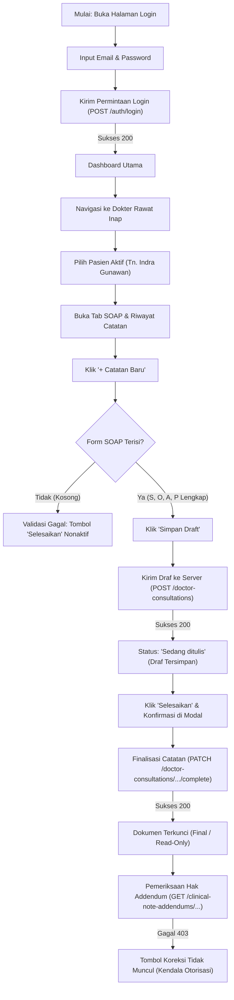

# Laporan Pengujian Live Browser: Modul Dokter Rawat Inap — Catatan Perkembangan (SOAP)

| Dokumen Informasi | Keterangan |
| :--- | :--- |
| **Modul** | Pelayanan Kesehatan — Rawat Inap (*Inpatient Management*) |
| **Fitur / Halaman** | Dokter Rawat Inap — Catatan Perkembangan Pasien (*Doctor SOAP Progress Note*) |
| **Lingkungan Pengujian** | Frontend: `http://localhost:3000/` <br> Backend API: `https://localhost:7184/api` <br> Database: PostgreSQL `QuilvianNewDevHamzah` |
| **Akun Penguji** | `rendi@admin.com` (dr. Rendy Pangalila, DPJP) |
| **Metode Pengujian** | *Live Browser Automation Testing* (Playwright Chromium, Headless with Real Network & UI Verification) |
| **Tanggal Pengujian** | 22 September 2026 |
| **Status Akhir** | **Fungsional Inti Berhasil** (Ditemukan 2 Kendala Hak Akses & Endpoint Legacy) |

---

## 1. Ringkasan Eksekutif

Pengujian *live browser* ini bertujuan untuk memvalidasi alur kerja dokumentasi klinis harian dokter rawat inap pada sistem rekam medis elektronik Quilvian. Pengujian mencakup proses masuk sistem (*login*), pencarian dan pemilihan pasien rawat inap, pembukaan lembar kerja SOAP (*Subjective, Objective, Assessment, Plan*), pemeriksaan aturan keselamatan input (*validation guard*), penyimpanan draf sementara (*Save Draft*), penandatanganan dan penguncian dokumen (*Complete / Finalize Note*), hingga kesiapan penulisan addendum koreksi (*Clinical Note Addendum*).

Secara fungsional, alur pencatatan SOAP berhasil dijalankan dari awal hingga dokumen terkunci menjadi berstatus **Final**. Namun, pengujian mendeteksi dua kendala teknis:
1. **Error HTTP 404**: Kegagalan pemanggilan endpoint data dokter aktif pada sidebar profil (`UserActiveDoctors`), yang memicu notifikasi peringatan (*error issue*) di Next.js.
2. **Error HTTP 403 (Otorisasi Addendum)**: Akun dokter penanggung jawab pelayanan (DPJP) ditolak saat memeriksa izin pembuatan addendum koreksi rekam medis, sehingga tombol koreksi tidak dapat ditampilkan setelah dokumen diselesaikan.

---

## 2. Lingkungan & Kredensial Pengujian

1. **Aplikasi Frontend**:
   - Framework: Next.js App Router (Node.js)
   - Alamat Server: `http://localhost:3000/`
   - URL Pengujian: `/health-services/inpatient-management/doctor-inpatient`
2. **Aplikasi Backend**:
   - Framework: ASP.NET Core Web API (.NET 8)
   - Alamat Server: `https://localhost:7184/api`
3. **Kredensial Pengguna**:
   - Email: `rendi@admin.com`
   - Password: `[DIRAHSIAKAN]` (01Jan2026)
   - Dokter: **dr. Rendy Pangalila**
   - Peran Klinis: Dokter Penanggung Jawab Pelayanan (DPJP)
4. **Pasien Uji Aktif**:
   - Nama Pasien: **Tn. Indra Gunawan**
   - Nomor Rekam Medis: `00-00-00-16`
   - Ruang / Kamar / Bed: Ruang Rawat Inap Kelas I 1 • Bed BED 001 • KELAS I
   - Status Episode: Sedang dirawat (13 hari rawat)
   - ID Episode: `c3fe1370-18f0-42fb-8d9f-01449212828e`

---

## 3. Alur Proses Bisnis & Skenario Pengujian

Berikut adalah diagram alur kerja yang diuji selama sesi berlangsung:



### Tahap demi Tahap Hasil Pengujian:

#### Tahap 1: Autentikasi dan Login
- Browser membuka halaman `/login`.
- Izin akses lokasi (*browser geolocation*) diberikan otomatis oleh sistem otomasi uji.
- Input data login:
  - Input Email: `rendi@admin.com`
  - Input Password: `•••••••••`
- Tombol **Masuk** diklik.
- Server mengembalikan status **200 OK** untuk `POST /v1/auth/login` dan `GET /v1/auth/me`. Session assertion dan cookie auth tersimpan dengan benar.

#### Tahap 2: Akses Lembar Kerja Dokter Rawat Inap
- Browser diarahkan ke `/health-services/inpatient-management/doctor-inpatient`.
- Sistem memanggil metadata sensus dan daftar pasien dokter (`GET /census?assignedToMe=true`).
- Ditemukan 1 pasien aktif yang terhubung dengan akun DPJP (Tn. Indra Gunawan).
- Panel kiri menampilkan kartu ringkasan pasien secara lengkap (Nama, No RM, Kamar/Bed, DPJP, Lama Rawat).

#### Tahap 3: Pemilihan Pasien & Akses Tab SOAP
- Kartu pasien Tn. Indra Gunawan diklik.
- Sistem memuat data pendukung pasien secara paralel:
  - Penempatan bed: `GET /bed-occupancies/placements/by-episode/...` (**200 OK**)
  - Penugasan dokter: `GET /episodes/.../doctor-assignments` (**200 OK**)
  - Riwayat alergi: `GET /patient-allergies/active-alerts?...` (**200 OK**)
  - Lini masa SOAP: `GET /doctor-consultations/episodes/.../soap-timeline` (**200 OK**)
  - Diagnosis aktif: `GET /patient-diagnoses?...` (**200 OK**)
- Tab **SOAP** dokter terbuka secara default.
- Riwayat catatan pemeriksaan sebelumnya dapat diakses melalui drawer *Riwayat Catatan*.

#### Tahap 4: Pengujian Aturan Validasi Form Kosong (*Validation Guard*)
- Tombol **+ Catatan Baru** diklik untuk membuat sesi SOAP baru.
- Saat form masih kosong:
  - Komponen `ClinicalValidationSummary` muncul dan menandai bahwa minimal salah satu komponen SOAP wajib diisi (`VAL-DOK-12`).
  - Tombol **Selesaikan** berada dalam status **Disabled** (nonaktif), mencegah dokter memfinalisasi rekam medis yang belum memiliki data klinis.

#### Tahap 5: Pengisian Data Klinis SOAP
Form diisi dengan data klinis simulasi pemeriksaan rawat inap:
- **Waktu Pemeriksaan**: `22 Sep 2026, 11:10`
- **S — Subjective**: *"Pasien mengeluh sesak napas dan batuk berdahak sejak kemarin malam."*
- **O — Objective**: *"TD: 120/80 mmHg, N: 82x/m, RR: 20x/m, SpO2: 98% room air. Ronkhi basah halus minimal."*
- **A — Assessment**: *"Pneumonia komunitas derajat ringan-sedang, perbaikan klinis hari ke-2."*
- **P — Plan**: *"IVFD Asering 20 tpm, Inj. Ceftriaxone 1g/12j, Nebulisasi Combivent 1 amp/8j."*

#### Tahap 6: Pengujian Simpan Draf (*Save Draft*)
- Tombol **Simpan Draft** diklik.
- Frontend mengirimkan request `POST /v1/health-services/clinical-management/doctor-consultations`.
- Backend merespon **200 OK** dengan payload konsultasi baru.
- Lini masa catatan diperbarui secara reaktif, menampilkan status **Sedang ditulis** (*Draft*). Notifikasi hijau berbunyi: *"Catatan perkembangan tersimpan sebagai draf."*

#### Tahap 7: Pengujian Selesaikan & Penandatanganan Catatan (*Complete Note*)
- Tombol **Selesaikan** menjadi aktif (**Enabled**).
- Tombol **Selesaikan** diklik, memunculkan modal peringatan legalitas rekam medis: *"Dokumen yang diselesaikan akan dikunci permanen dan tidak dapat disunting kembali."*
- Tombol **Ya, Selesaikan** pada modal diklik.
- Frontend mengirimkan request `PATCH /v1/health-services/clinical-management/doctor-consultations/{id}/complete`.
- Backend memproses penutupan dokumen dan merespon **200 OK**.
- Status dokumen berubah menjadi **Final** dengan nomor konsultasi resmi (contoh: `CON-20260922-00002`).
- Form SOAP beralih ke tampilan baca-saja (*read-only*) dengan keterangan: *"Catatan ini sudah final dan tidak dapat disunting langsung. Pembetulan ditulis sebagai koreksi bernomor urut."*

#### Tahap 8: Pengujian Fitur Koreksi / Addendum Rekam Medis
- Setelah dokumen berstatus *Final*, sistem secara otomatis mengecek hak dokter untuk membuat addendum koreksi melalui:
  - `GET /v1/health-services/medical-record-management/clinical-note-addendums/authority/2/{id}`
  - `GET /v1/health-services/medical-record-management/clinical-note-addendums/by-document/2/{id}`
- **Hasil**: Server mengembalikan **HTTP 403 Forbidden**. Akibatnya, tombol **Koreksi** tidak muncul di layar dokter.

---

## 4. Analisis Temuan Error & Kendala Sistem

Berikut adalah temuan teknis yang berhasil diidentifikasi selama pengujian:

### 🔴 Temuan 1: HTTP 404 Not Found pada Endpoint Data Dokter Aktif di Sidebar
- **Path Endpoint**: `GET /api/UserActive/UserActiveDoctors/19130ac0-2e53-4e38-b647-2eafa5813522`
- **Lokasi Sumber**: File [`user-profile-sidebar.jsx`](file:///c:/Users/Admin/Documents/Quilvian/Source%20Code/QuilvianFinal/QuilvianSystemFrontendDev/src/components/view/settings/sidebar-profile/user-profile-sidebar.jsx#L674)
- **Gejala / Log**:
  ```text
  [CONSOLE ERROR] Error fetching doctor data: AxiosError: Request failed with status code 404
  [API FAILED 404] GET https://localhost:7184/api/UserActive/UserActiveDoctors/19130ac0-2e53-4e38-b647-2eafa5813522
  ```
- **Dampak Pengguna**: Memunculkan badge merah *1 Issue* pada pojok kiri bawah Next.js (*development overlay*).
- **Akar Masalah**: Komponen sidebar profil masih memanggil pola endpoint legacy `/UserActive/UserActiveDoctors/{userActiveId}` yang tidak tersedia atau ID relasi dokter aktif tidak ditemukan di backend ASP.NET Core saat ini.
- **Rekomendasi Perbaikan**:
  1. Perbarui pemanggilan profil dokter ke endpoint canonical: `/v1/corporate/human-resource/master-data/doctors/{doctorId}`.
  2. Tambahkan proteksi *try-catch* tanpa melempar error unhandled jika data dokter tidak terdaftar.

---

### 🔴 Temuan 2: HTTP 403 Forbidden pada Pemeriksaan Wewenang Addendum Rekam Medis
- **Path Endpoint**:
  1. `GET /v1/health-services/medical-record-management/clinical-note-addendums/authority/2/{consultationId}`
  2. `GET /v1/health-services/medical-record-management/clinical-note-addendums/by-document/2/{consultationId}`
- **Respon Backend**:
  ```json
  {
    "success": false,
    "statusCode": 403,
    "message": "Anda tidak memiliki akses ke menu atau fitur ini.",
    "data": null,
    "errors": null,
    "timestamp": "2026-09-22T11:10:22.6550695+07:00"
  }
  ```
- **Lokasi Sumber**: File [`use-inpatient-progress-note.jsx`](file:///c:/Users/Admin/Documents/Quilvian/Source%20Code/QuilvianFinal/QuilvianSystemFrontendDev/src/lib/hooks/health-services/inpatient-management/use-inpatient-progress-note.jsx#L235-L244)
- **Dampak Klinis**: Sesuai regulasi rekam medis (Permenkes 24/2022 dan standar akreditasi RS), catatan medis yang sudah final tidak boleh dihapus atau diubah langsung, melainkan harus dikoreksi melalui mekanisme addendum bernomor urut. Akibat error 403 ini, dokter yang telah menandatangani catatan SOAP tidak dapat menambahkan catatan pembetulan/koreksi susulan jika sewaktu-waktu ada data laboratorium atau hasil pemeriksaan baru yang masuk.
- **Akar Masalah**: Role akun `rendi@admin.com` belum diberikan izin akses (*permission*) untuk membaca dan menulis addendum pada modul `medical-record-management` di konfigurasi Role-Based Access Control (RBAC) backend.
- **Rekomendasi Perbaikan**: Berikan hak akses `ClinicalNoteAddendum.Read` dan `ClinicalNoteAddendum.Create` kepada role Dokter Spesialis / DPJP di tabel perizinan backend.

---

### 🟡 Temuan 3: HTTP 403 Forbidden pada Endpoint Opsi Kiosk saat Halaman Utama Dimuat
- **Daftar Endpoint**:
  - `GET /v1/health-services/patient-management/master-data/patients/options`
  - `GET /v1/corporate/human-resource/master-data/doctors/kiosk/options`
  - `GET /v1/health-services/master-data/clinics/kiosk/options`
  - `GET /v1/health-services/master-data/doctor-schedules`
- **Dampak**: Muncul 4 kali log error merah di konsol browser sesaat setelah login.
- **Akar Masalah**: Terdapat komponen global atau slice Redux yang memanggil opsi kiosk dan jadwal dokter secara eager pada saat login pertama kali, meskipun pengguna yang masuk bertindak sebagai staf medis rawat inap.
- **Rekomendasi Perbaikan**: Terapkan pemanggilan bersyarat (*conditional fetching*) atau *lazy loading* agar opsi data kiosk hanya dipanggil ketika pengguna membuka modul mesin antrean / kiosk pendaftaran.

---

## 5. Tabel Spesifikasi Endpoint API (Gaya Swagger)

Berikut adalah daftar endpoint backend yang terlibat dalam proses pengujian SOAP Dokter Rawat Inap:

### Tag: `[Tags("Authentication")]`
| Method | Path Endpoint | Deskripsi | Auth | Status Uji | Keterangan |
| :---: | :--- | :--- | :---: | :---: | :--- |
| `POST` | `/api/v1/auth/login` | Otentikasi email dan password user | Public | **200 OK** | Mengembalikan JWT access token dan refresh token. |
| `GET` | `/api/v1/auth/me` | Membaca profil dan klaim role pengguna | Bearer | **200 OK** | Mengembalikan ID dokter, nama, dan role DPJP. |

### Tag: `[Tags("InpatientManagement - Census")]`
| Method | Path Endpoint | Deskripsi | Auth | Status Uji | Keterangan |
| :---: | :--- | :--- | :---: | :---: | :--- |
| `GET` | `/api/v1/health-services/inpatient-management/census/filters/metadata` | Metadata filter ruang rawat | Bearer | **200 OK** | Mengambil daftar unit rawat inap dan kelas. |
| `GET` | `/api/v1/health-services/inpatient-management/census` | Daftar pasien rawat inap dokter | Bearer | **200 OK** | Parameter `assignedToMe=true` mengembalikan pasien asuhan DPJP. |

### Tag: `[Tags("ClinicalManagement - DoctorConsultation")]`
| Method | Path Endpoint | Deskripsi | Auth | Status Uji | Keterangan |
| :---: | :--- | :--- | :---: | :---: | :--- |
| `GET` | `/api/v1/health-services/clinical-management/doctor-consultations/episodes/{episodeId}/soap-timeline` | Riwayat timeline catatan SOAP episode | Bearer | **200 OK** | Menampilkan daftar catatan draf dan final berurutan. |
| `POST` | `/api/v1/health-services/clinical-management/doctor-consultations` | Membuat atau menyimpan draf SOAP baru | Bearer | **200 OK** | Menerima payload S, O, A, P, dan waktu pemeriksaan. Status: `Draft (0)`. |
| `PATCH` | `/api/v1/health-services/clinical-management/doctor-consultations/{id}/soap` | Memperbarui isi catatan SOAP draf | Bearer | **200 OK** | Digunakan saat memperbarui ketikan draf yang sudah tersimpan. |
| `PATCH` | `/api/v1/health-services/clinical-management/doctor-consultations/{id}/complete` | Menyelesaikan & mengunci catatan SOAP | Bearer | **200 OK** | Mengubah status menjadi `Completed (2)` dan menerbitkan nomor konsultasi. |

### Tag: `[Tags("MedicalRecordManagement - ClinicalNoteAddendum")]`
| Method | Path Endpoint | Deskripsi | Auth | Status Uji | Keterangan |
| :---: | :--- | :--- | :---: | :---: | :--- |
| `GET` | `/api/v1/health-services/medical-record-management/clinical-note-addendums/authority/{documentKind}/{documentId}` | Memeriksa kewenangan addendum | Bearer | <span style="color:red">**403 Forbidden**</span> | Role dokter belum diberikan wewenang akses endpoint ini. |
| `GET` | `/api/v1/health-services/medical-record-management/clinical-note-addendums/by-document/{documentKind}/{documentId}` | Daftar addendum pada dokumen terkait | Bearer | <span style="color:red">**403 Forbidden**</span> | Menampilkan riwayat koreksi catatan jika memiliki izin akses. |

---

## 6. Kesimpulan & Rekomendasi Tindak Lanjut

### Kesimpulan
1. **Fungsionalitas Utama Terbukti Handal**: Alur inti dokter rawat inap—mulai dari masuk aplikasi, memilih pasien, membuka rekam medis, mengisi lembar SOAP (S, O, A, P), menyimpan draf, hingga memfinalisasi dokumen—telah berjalan dengan sukses dan sesuai dengan spesifikasi proses bisnis rumah sakit.
2. **Integritas Rekam Medis Terjaga**: Mekanisme penguncian dokumen (*lock on complete*) dan validasi field kosong bekerja dengan baik untuk mencegah kesalahan data medis sebelum ditandatangani.

### Rekomendasi Tindak Lanjut
1. **Prioritas Tinggi (P1)**:
   - Tambahkan izin otorisasi addendum rekam medis (`MedicalRecord.Addendum` atau `ClinicalNoteAddendum.Read`/`Create`) ke dalam peran (*Role*) Dokter Rawat Inap / DPJP di database backend agar dokter dapat melakukan koreksi addendum pada catatan yang sudah berstatus Final.
2. **Prioritas Sedang (P2)**:
   - Sesuaikan pemanggilan endpoint dokter pada `user-profile-sidebar.jsx` agar tidak lagi mengarah ke route legacy `/UserActive/UserActiveDoctors/{id}` yang mengembalikan error 404.
3. **Prioritas Rendah (P3)**:
   - Optimalkan *data fetching* pada layout utama agar opsi master data kiosk tidak dipanggil secara otomatis oleh pengguna dengan peran non-administrasi/kiosk.
